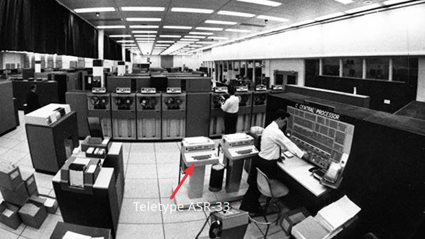

# Таненбаум Э. - Современные операционные системы. 4-е изд. 2015

Современный компьютер состоит из одного или нескольких процессоров, оперативной памяти, дисков, принтера, клавиатуры, мыши, дисплея, сетевых интерфейсов и других разнообразных устройств ввода-вывода. Управление всеми этими компонентами и их оптимальное использование представляет собой очень непростую задачу. По этой причине компьютеры оснащены *специальным уровнем программного обеспечения*, который называется операционной системой, в чью задачу входит управление пользовательскими программами, а также всеми ранее упомянутыми ресурсами.

>
> [How to create your own OS (minimal configuration) for the IBM PC (x86) platform](https://github.com/Jekahome/Jeka-OS)
>
> [QEMU emulator OS](https://www.qemu.org/)
>
> [wiki.osdev.org/Bare_Bones](https://wiki.osdev.org/Bare_Bones), [Multiboot](https://wiki.osdev.org/Multiboot)
>
> [The little book about OS development (x86)](https://littleosbook.github.io/)

Операционные системы выполняют две основные функции: предоставляют абстракции пользовательским программам и управляют ресурсами компьютера.

**Операционная система как расширенная машина**

Архитектура большинства компьютеров (система команд, организация памяти, ввод-вывод данных и структура шин) на уровне машинного языка слишком примитивна и неудобна для использования в программах, особенно это касается систем ввода-вывода. Чтобы перевести разговор в конкретное русло, рассмотрим современные жесткие диски SATA (Serial ATA) его описание занимает 450 страниц. Понятно, что ни один зравомыслящий программист не захочет иметь дела с таким диском на аппаратном уровне. Вместо него оборудованием занимается та часть программного обеспечения, которая называется драйвером диска и предоставляет, не вдаваясь в детали, интерфейс для чтения и записи дисковых блоков. Операционные системы содержат множество драйверов для управления устройствами ввода-вывода.

Но для большинства приложений слишком низким является даже этот уровень. Поэтому все операционные системы предоставляют еще один уровень абстракции для использования дисков — файлы. Используя эту абстракцию, программы могут создавать, записывать и читать файлы, не вникая в подробности реальной работы оборудования. Эта абстракция является ключом к управлению сложностью.

Абстракция файл позволяет работать с фотографиями, сообщениями электронной почты и веб-страницами намного легче, чем с особенностями SATA-дисков (или других дисковых устройств). Задача операционной системы заключается в создании хорошей абстракции, а затем в реализации абстрактных объектов, создаваемых в рамках этой абстракции, и управлении ими.

Реально существующие процессоры, блоки памяти, диски и другие компоненты представляют собой слишком сложные устройства, предоставляющие трудные, неудобные, не похожие друг на друга и не обладающие постоянством интерфейсы для тех людей, которым приходится создавать для них программное обеспечение. Иногда такая ситуация объясняется необходимостью поддержки обратной совместимости, а иногда она связана со стремлением к экономии средств, но порой разработчики аппаратного обеспечения просто не понимают (или не хотят понимать), как много проблем они создают для разработчиков программного обеспечения. Одна из главных задач операционной системы — скрыть аппаратное обеспечение и существующие программы (и их разработчиков) под создаваемыми взамен них и приспособленными для нормальной работы красивыми, элегантными, неизменными абстракциями. Операционные системы превращают уродство в красоту.

Следует отметить, что реальными «заказчиками» операционных систем являются прикладные программы (разумеется, не без помощи прикладных программистов). Именно они непосредственно работают с операционной системой и ее абстракциями. А конечные пользователи работают с абстракциями, предоставленными пользовательским интерфейсом, — это или командная строка оболочки, или графический интерфейс.

**Операционная система в качестве менеджера ресурсов**

Представление о том, что операционная система главным образом предоставляет абстракции для прикладных программ, — это взгляд сверху вниз. Сторонники взгляда снизу вверх считают, что задача операционной системы заключается в обеспечении упорядоченного и управляемого распределения процессоров, памяти и устройств ввода-вывода между различными программами, претендующими на их использование.

Управление ресурсами включает в себя мультиплексирование (распределение) ресурсов двумя различными способами: во времени и в пространстве. Когда ресурс разделяется во времени, различные программы или пользователи используют его по очереди: сначала ресурс получают в пользование одни, потом другие и т.д. Другим видом разделения ресурсов является пространственное разделение. Вместо поочередной работы каждый клиент получает какую-то часть разделяемого ресурса. Например, оперативная память обычно делится среди нескольких работающих программ, так что все они одновременно могут постоянно находиться в памяти (например, используя центральный процессор по очереди). При условии, что памяти достаточно для хранения более чем одной программы, эффективнее разместить в памяти сразу несколько программ, чем выделять всю память одной программе, особенно если ей нужна лишь небольшая часть от общего пространства. Разумеется, при этом возникают проблемы равной доступности, обеспечения безопасности и т.д., и их должна решать операционная система. Другим ресурсом с разделяемым пространством является жесткий диск. На многих системах на одном и том же диске могут одновременно храниться файлы, принадлежащие многим пользователям. Распределение дискового пространства и отслеживание того, кто какие дисковые блоки использует, — это типичная задача операционной системы по управлению ресурсами.

**Устройства ввода-вывода**

Устройства ввода-вывода обычно состоят из двух компонентов: самого устройства и его контроллера. Контроллер представляет собой микросхему или набор микросхем, которые управляют устройством на физическом уровне. Он принимает от операционной системы команды, например считать данные с помощью устройства, а затем их выполняет.

Так как все типы контроллеров отличаются друг от друга, для управления ими требуется различное программное обеспечение. Программа, предназначенная для общения с контроллером, выдачи ему команды и получения поступающих от него ответов, называется драйвером устройства. Каждый производитель контроллеров должен поставлять вместе с ними драйверы для каждой поддерживаемой операционной системы. Например, сканер может поступить в продажу с драйверами для операционных систем OS X, Windows 7, Windows 8 и Linux.

Для использования драйвер нужно поместить в операционную систему, предоставив ему тем самым возможность работать в режиме ядра. Вообще-то драйверы могут работать и не в режиме ядра, и поддержка такого режима предлагается в настоящее время в операционных системах Linux и Windows. Подавляющее большинство драйверов по-прежнему запускается ниже границы ядра. В пользовательском пространстве драйверы запускаются только лишь в весьма немногих существующих системах, например в MINIX 3. Драйверам в пользовательском пространстве должно быть разрешено получать доступ к устройству неким контролируемым способом, что является весьма непростой задачей.

Существует три способа установки драйвера в ядро. 
* Первый состоит в том, чтобы заново скомпоновать ядро вместе с новым драйвером и затем перезагрузить систему. Многие устаревшие UNIX-системы именно так и работают. 
* Второй способ: создать в специальном файле операционной системы запись, сообщающую ей о том, что требуется, и затем перезагрузить систему. Во время загрузки операционная система сама находит нужные ей драйверы и загружает их. Именно так и работает система Windows.
* При третьем способе — динамической загрузке драйверов — операционная система может принимать новые драйверы в процессе работы и оперативно устанавливать их, не требуя для этого перезагрузки.

Ввод и вывод данных можно делать тремя различными способами. 
* В простейшем из них пользовательская программа производит системный вызов, который транслируется ядром в процедуру вызова соответствующего драйвера. После этого драйвер приступает к процессу ввода-вывода. В это время он выполняет очень короткий цикл, постоянно опрашивая устройство и отслеживая завершение операции (обычно занятость устройства определяется состоянием специального бита). По завершении операции ввода-вывода драйвер помещает данные (если таковые имеются) туда, куда требуется, и возвращает управление. Затем операционная система возвращает управление вызывающей программе. Этот способ называется активным ожиданием или ожиданием готовности, а его недостаток заключается в том, что он загружает процессор опросом устройства об окончании работы.
* Второй способ заключается в том, что драйвер запускает устройство и просит его выдать прерывание по окончании выполнения команды (завершении ввода или вывода данных). Сразу после этого драйвер возвращает управление. Затем операционная система блокирует вызывающую программу, если это необходимо, и переходит к выполнению других задач. Когда контроллер обнаруживает окончание передачи данных, он генерирует прерывание, чтобы просигнализировать о завершении операции.
* При третьем способе ввода-вывода используется специальный контроллер прямого доступа к памяти (Direct Memory Access (DMA)), который может управлять потоком битов между оперативной памятью и некоторыми контроллерами без постоянного вмешательства центрального процессора. Центральный процессор осуществляет настройку контроллера DMA, сообщая ему, сколько байтов следует передать, какое устройство и адреса памяти задействовать и в каком направлении передать данные, а затем дает ему возможность действовать самостоятельно. Когда контроллер DMA завершает работу, он выдает запрос на прерывание.

**Технология plug and play**

Для работы в окружении, операционная система должна знать о том, какие периферийные устройства подключены к компьютеру, и сконфигурировать эти устройства. Это требование заставило корпорации Intel и Microsoft разработать для PC-совместимых компьютеров систему, называемую plug and play (подключи и работай). Она основана на аналогичной концепции, первоначально реализованной в Apple Macintosh. До появления plug and play каждая плата ввода-вывода имела фиксированный уровень запроса на прерывание и постоянные адреса для своих регистров ввода-вывода. Например, клавиатура использовала прерывание 1 и адреса ввода-вывода от 0x60 до 0x64; До поры до времени все это неплохо работало. Проблемы начинались, когда пользователь покупал звуковую карту и внутренний модем и обнаруживалось, что оба устройства использовали, скажем, прерывание 4. Возникал конфликт, не позволяющий им работать вместе. Решением стало появление на каждой плате ввода-вывода DIP-переключателей, или перемычек (jumpers). Однако приходилось инструктировать пользователя о необходимости выбрать уровень запроса на прерывание и адреса ввода-вывода для данного устройства, которые не конфликтовали бы со всеми другими прерываниями и адресами, задействованными на его системе. Технология plug and play заставляет систему автоматически собирать информацию об устройствах ввода-вывода, централизованно присваивая уровни запросов на прерывания и адреса ввода-вывода, а затем сообщать каждой карте, какие значения ей присвоены.

**Зоопарк операционных систем**

* Операционные системы мейнфреймов. Такие компьютеры отличаются от персональных компьютеров объемами ввода-вывода данных. Мейнфреймы, имеюют тысячи дисков и петабайты данных. Примером операционной системы универсальных машин может послужить OS/390. Однако эти операционные системы постепенно вытесняются вариантами операционной системы UNIX, например Linux.
* Серверные операционные системы. Они работают на серверах, которые представлены очень мощными персональными компьютерами, рабочими станциями или даже универсальными машинами. Они одновременно обслуживают по сети множество пользователей, обеспечивая им общий доступ к аппаратным и программным ресурсам. Типичными представителями серверных операционных систем являются Solaris, FreeBSD, Linux и Windows Server 201x.
* Многопроцессорные операционные системы. Объединение множества центральных процессоров в единую систему, что позволяет добиться вычислительной мощности, достойной высшей лиги. В зависимости от того, как именно происходит это объединение, а также каковы ресурсы общего пользования, эти системы называются параллельными компьютерами, мультикомпьютерами или многопроцессорными системами. Им требуются специальные операционные системы, в качестве которых часто применяются особые версии серверных операционных систем, оснащенные специальными функциями связи, сопряжения и синхронизации. На многопроцессорных системах могут работать многие популярные операционные системы, включая Windows и Linux.
* Операционные системы персональных компьютеров. Задачей операционных систем персональных компьютеров является качественная поддержка работы отдельного пользователя. Они широко используются для обработки текстов, создания электронных таблиц, игр и доступа к Интернету. Типичными примерами могут служить операционные системы Linux, FreeBSD, Windows 7, Windows 8 и OS X компании Apple.
* Операционные системы карманных персональных компьютеров. Эти компьютеры, изначально известные как КПК, или PDA (Personal Digital Assistant — персональный цифровой секретарь), представляют собой смартфоны и планшеты. Доминируют операционные системы Android от Google и iOS от Apple.
* Встроенные операционные системы. Поскольку на этих системах установка пользовательских программ не предусматривается, их обычно компьютерами не считают. Примерами устройств, где устанавливаются встроенные компьютеры, могут послужить микроволновые печи, телевизоры, автомобили, пишущие DVD, обычные телефоны и MP3-плееры. В основном встроенные системы отличаются тем, что на них ни при каких условиях не будет работать стороннее программное обеспечение. В микроволновую печь невозможно загрузить новое приложение, поскольку все ее программы записаны в ПЗУ. Следовательно, отпадает необходимость в защите приложений друг от друга и операционную систему можно упростить. Наиболее популярными в этой области считаются операционные системы Embedded Linux, QNX и VxWorks.
* Операционные системы сенсорных узлов. Сети, составленные из миниатюрных сенсорных узлов, связанных друг с другом и с базовой станцией по беспроводным каналам, развертываются для различных целей. Такие сенсорные сети используются для защиты периметров зданий, охраны государственной границы, обнаружения возгораний в лесу, измерения температуры и уровня осадков в целях составления прогнозов погоды, сбора информации о перемещениях противника на поле боя и многого другого. Узлы такой сети представляют собой миниатюрные компьютеры, питающиеся от батареи и имеющие встроенную радиосистему. Примером широко известной операционной системы для сенсорных узлов может послужить TinyOS.
* Операционные системы реального времени. Эти системы характеризуются тем, что время для них является ключевым параметром. Эти системы должны давать абсолютные гарантии того, что определенные действия будут осуществляться в конкретный момент времени. Например, в системах управления производственными процессами компьютеры, работающие в режиме реального времени, должны собирать сведения о процессе и использовать их для управления станками на предприятии. Довольно часто они должны отвечать очень жестким временным требованиям. Например, когда автомобиль перемещается по сборочному конвейеру, то в определенные моменты времени должны осуществляться вполне конкретные операции. Если, к примеру, сварочный робот приступит к сварке с опережением или опозданием, машина придет в негодность. Если операция должна быть проведена точно в срок (или в определенный период времени), то мы имеем дело с системой жесткого реального времени. Поскольку к системам реального времени предъявляются очень жесткие требования, иногда операционные системы представляют собой простую библиотеку, сопряженную с прикладными программами, где все тесно взаимосвязано и между частями системы не существует никакой защиты. Примером такой системы может послужить eCos.
* Операционные системы смарт-карт. Смарт-карта представляет собой устройство размером с кредитную карту, имеющее собственный процессор. На операционные системы для них накладываются очень жесткие ограничения по требуемой вычислительной мощности процессора и объему памяти. Некоторые из смарт-карт получают питание через контакты считывающего устройства, в которое вставляются, другие — бесконтактные смарт-карты — получают питание за счет эффекта индукции, что существенно ограничивает их возможности. Некоторые из них способны справиться с одной-единственной функцией, например с электронными платежами, но существуют и многофункциональные смарт-карты. Зачастую они являются патентованными системами.

**Процессы**

Ключевым понятием во всех операционных системах является процесс. Процессом, по существу, является программа во время ее выполнения. С каждым процессом связано его адресное пространство — список адресов ячеек памяти от нуля до некоторого максимума, откуда процесс может считывать данные и куда может записывать их. Адресное пространство содержит выполняемую программу, данные этой программы и ее стек. Кроме этого, с каждым процессом связан набор ресурсов, который обычно включает регистры (в том числе счетчик команд и указатель стека), список открытых файлов, необработанные предупреждения, список связанных процессов и всю остальную информацию, необходимую в процессе работы программы. Таким образом, процесс — это контейнер, в котором содержится вся информация, необходимая для работы программы.

Если процесс приостанавливается таким образом, позже он должен возобновиться именно с того состояния, в котором был остановлен. Это означает, что на период приостановки вся информация о процессе должна быть явным образом где-то сохранена. Во многих операционных системах вся информация о каждом процессе, за исключением содержимого его собственного адресного пространства, хранится в таблице операционной системы, которая называется *таблицей процессов* и представляет собой массив (или связанный список) структур, по одной на каждый из существующих на данный момент процессов.

Главными системными вызовами, используемыми при управлении процессами, являются вызовы, связанные с созданием и завершением процессов. Рассмотрим простой пример. Процесс, называемый интерпретатором команд, или оболочкой, считывает команды с терминала. Пользователь только что набрал команду, требующую компиляции программы. Теперь оболочка должна создать новый процесс, запускающий компилятор. Когда этот процесс завершит компиляцию, он произведет системный вызов для завершения собственного существования. Если процесс способен создавать несколько других процессов (называющихся дочерними процессами), а эти процессы в свою очередь могут создавать собственные дочерние процессы, то перед нами предстает *дерево процессов*. Связанные процессы, совместно работающие над выполнением какой-нибудь задачи, зачастую нуждаются в обмене данными друг с другом и синхронизации своих действий. Такая связь называется *межпроцессным взаимодействием*.

Командный интерпретатор UNIX т.е. оболочка (shell) не являясь частью ядра операционной системы, а представляет собой пользовательскую программу, оболочка нашла широкое применение как средство доступа ко многим функциям операционной системы и служит хорошим примером использования системных вызовов. 

Два основных типа оболочек:
1. Текстовая оболочка (Command-Line Interface, CLI) - sh,bash,csh,ksh,zsh
2. Графическая оболочка (Graphical User Interface, GUI) - рабочий стол Windows (Explorer), GNOME, KDE Plasma, Xfce, Cinnamon

Существует множество текстовыъ оболочек, включая sh, csh, ksh и bash (bash это командный интерпретатор (shell), интерпретатор языка сценариев (shell scripting language), относящийся к высокоуровневым интерпретируемым языкам и программа, предоставляющая интерфейс командной строки). Все они поддерживают рассматриваемые далее функции, происходящие из исходной оболочки (sh). Оболочка запускается после входа в систему любого пользователя. В качестве стандартного устройства ввода и вывода оболочка использует терминал. Свою работу она начинает с вывода приглашения — знака доллара, сообщающего пользователю, что оболочка ожидает приема команды. Например, если теперь пользователь наберет на клавиатуре `date` оболочка создаст дочерний процесс и запустит дочернюю программу date. Пока выполняется дочерний процесс, оболочка ожидает его завершения. После завершения дочернего процесса оболочка снова выведет приглашение и попытается прочитать следующую введенную строку. Так же оболочка перенаправляет потоки ввода/вывода например команда `date >file`

В наши дни на большинстве персональных компьютеров используется графический пользовательский интерфейс. По сути, графический пользовательский интерфейс — это просто программа (или совокупность программ), работающая поверх операционной системы наподобие оболочки. В системах Linux этот факт проявляется явным образом, поскольку у пользователя есть выбор по крайней мере из двух сред, реализующих графический пользовательский интерфейс: Gnome и KDE. Или он может вообще не выбрать ни одну из них, воспользовавшись окном терминала из X11.

**Системные вызовы**

Операционные системы выполняют две основные функции: предоставляют *абстракции* пользовательским программам и *управляют ресурсами* компьютера. В основном взаимодействие пользовательских программ и операционной системы касается первой функции — взять, к примеру, операции с файлами: создание, запись, чтение и удаление. А управление ресурсами компьютера проходит большей частью *незаметно для пользователей* и осуществляется в автоматическом режиме. Так что интерфейс между пользовательскими программами и операционной системой строится в основном на абстракциях. Чтобы по-настоящему понять, что делает операционная система, мы должны более подробно рассмотреть этот интерфейс. Имеющиеся в интерфейсе *системные вызовы* варьируются в зависимости от используемой операционной системы.

Поскольку фактический механизм выполнения системного вызова существенно зависит от конкретной машины и зачастую должен быть реализован на ассемблере, разработаны библиотеки процедур, осуществляющие системные вызовы из программ, написанных, например, на языке C.

Операционные системы Windows и UNIX фундаментально отличаются друг от друга в соответствующих моделях программирования. Программы UNIX состоят из кода, который выполняет те или иные действия, при необходимости обращаясь к системе с системными вызовами для получения конкретных услуг. В отличие от этого программой Windows управляют, как правило, события. Основная программа ждет, пока возникнет какое-нибудь событие, а затем вызывает процедуру для его обработки. Типичные события — это нажатие клавиши, перемещение мыши, нажатие кнопки мыши или подключение USB-диска. Затем для обслуживания события, обновления экрана и обновления внутреннего состояния программы вызываются обработчики. В итоге все это приводит к несколько иному стилю программирования, чем в UNIX.

**Язык С**

В C отсутствует встроенная поддержка строковых объектов, потоков, пакетов, классов, объектов, обеспечения безопасности типов и сборки мусора. Последнее является серьезной проблемой для операционных систем. Все хранилища данных в языке C либо имеют статический характер, либо явно размещаются и освобождаются программистом, при этом часто используются библиотечные функции malloc и free. Это последнее свойство — полный контроль программиста над памятью — наряду с явными указателями и делает язык C привлекательным для написания операционных систем. Операционные системы по сути являются системами, которые работают в реальном масштабе времени. Когда происходит прерывание, у операционной системы может быть лишь несколько микросекунд для осуществления какого-нибудь действия, чтобы не допустить потери важной информации. В такой ситуации произвольное включение в работу сборщика мусора абсолютно неприемлемо.

Большие программные проекты на C

Для создания операционной системы каждый файл с расширением .c с помощью компилятора C превращается в **объектный файл**. Объектные файлы, имеющие имена, заканчивающиеся символами .o (.o-файлы), содержат двоичные инструкции для целевой машины. Позже они будут непосредственно выполняться центральным процессором.

Первый проход компилятора C называется **препроцессором** C. По мере чтения каждого файла с расширением .c при каждой встрече директивы #include он переходит к указанному в этой директиве заголовочному файлу, обрабатывает его содержимое, расширяя макросы и управляя условной компиляцией (и другими определенными вещами), и передает результаты следующему проходу компилятора, как будто они были физически включены в .c-файл.

Поскольку операционная система имеет очень большой объем (нередко составляющий порядка 5 000 000 строк), необходимость постоянной перекомпиляции всего кода при внесении изменений всего лишь в один файл была бы просто невыносимой. В то же время изменение ключевого заголовочного файла, включенного в тысячи других файлов, требует перекомпиляции всех этих файлов. Отслеживать зависимости тех или иных объектных файлов от определенных заголовочных файлов без посторонней помощи невозможно.

К счастью, компьютеры прекрасно справляются именно с задачами такого рода. В UNIX-системах есть программа под названием make (имеющая многочисленные варианты, например gmake, pmake и т. д.), читающая файл Makefile, в котором описываются зависимости одних файлов от других. Программа make работает следующим образом. Сначала она определяет, какие объектные файлы, необходимые для создания двоичного файла операционной системы, нужны именно сейчас. Затем для каждого из них проверяет, были ли изменены со времени последнего создания объектного файла какие-нибудь файлы (заголовочные файлы или файлы основного текста программ), от которых объектный файл зависит. Если такие изменения были, этот объектный файл должен быть перекомпилирован. Когда программа make определит, какие файлы с расширением .c должны быть перекомпилированы, она вызывает компилятор C для их перекомпиляции, сокращая таким образом количество компиляций до необходимого минимума. В больших проектах при создании Makefile трудно избежать ошибок, поэтому существуют средства, которые делают это автоматически.

Когда все файлы с расширением .o будут готовы, они передаются программе, которая называется **компоновщиком**. Эта программа объединяет все эти файлы в один исполняемый двоичный файл. На этом этапе также добавляются все вызываемые библиотечные функции, разрешаются все ссылки между функциями и перемещаются на нужные места машинные адреса. Когда компоновщик завершает свою работу, на выходе получается исполняемая программа, которая в UNIX-системах традиционно называется a.out.

После запуска операционная система может в динамическом режиме подгружать течасти, которые не были статически включены в двоичный файл, например драйверы устройств и файловые системы. Во время выполнения операционная система может состоять из множества сегментов: для текста (программного кода), данных и стека. Сегмент текста обычно является постоянным, не изменяясь в процессе выполнения. Сегмент данных с самого начала имеет определенный размер и проинициализирован конкретными значениями, но если потребуется, он может изменять размер (обычно разрастаться при необходимости). Стек сначала пустует, но затем он увеличивается и сокращается по мере вызова функций и возвращения из них. Чаще всего сегмент текста помещается в районе младших адресов памяти, сразу над ним располагается сегмент данных, который может расти вверх, а в старшем виртуальном адресе находится сегмент стека, способный расти вниз. Тем не менее разные системы работают по-разному.

**Исследования в области операционных систем**

Исследования в области операционных систем также привели к существенным изменениям в используемых системах. Ранее упоминалось, что все первые коммерческие компьютерные системы были системами пакетной обработки (batch processing) до тех пор, пока не изобрели интерактивную систему с разделением времени (Time-Sharing). Все компьютеры работали только в текстовом режиме, пока в конце 1960-х Даг Энгельбарт (Doug Engelbart) из Стэнфордского исследовательского института не изобрел мышь и графический пользовательский интерфейс.

> ***Пакетная обработка** (Batch Processing) — «Конвейер без обратной связи»*
>
> Программа и все ее исходные данные заранее записываются на физический носитель (перфокарты, магнитная лента). Оператор запускает задачу, и процессор выполняет ее строго последовательно, от первой команды до последней, без остановок. Во время выполнения программы канал ввода-вывода заблокирован для вмешательства пользователя. Пользователь не имеет дескриптора (терминала) для отправки сигналов прерывания. В современных системах вы можете нажать Ctrl+C и прервать чтение с диска — потому что операционная система может аннулировать запрос. В пакетной системе аннулировать текущую I/O операцию было нельзя без физического ресета всей машины.
>
> *Если пакетная обработка такая неудобная (нет отладки, ждать часы, нельзя вмешаться), если там всё равно есть прерывания и процессор мог бы переключаться — почему они мучились с ней целое десятилетие (1950–1960) и не сделали разделение времени сразу?*
> * Самая главная причина: Железо не умело защищать память. В процессорах 1950-х годов (IBM 701, UNIVAC) не было блока управления памятью (MMU) она появилась только в компьютерах начала 1960-х. Абсолютно все программы видели всю физическую память компьютера от первого байта до последнего. В пакетной системе в памяти находилась только одна программа. Она могла писать куда угодно, хоть затирать ядро ОС — но она одна, и пока она выполняется, никто другой не пострадает. Завершилась — память полностью очистилась, загрузили следующую программу с нуля.
> * Память была бешено дорогой и маленькой. В 1955 году 1 килобайт памяти на ферритовых кольцах стоил примерно 10-20 тысяч долларов в пересчете на современные деньги. Компьютер имел 4–32 килобайта оперативной памяти.
> * Не было дисков для хранения контекстов (свопинга). Свопинг был технически невозможен из-за отсутствия быстрых и вместительных накопителей. Разделение времени работает так: вы выгружаете образ программы из памяти на диск (своп), освобождаете место для другого пользователя, потом подгружаете обратно. В 1950-х годах жестких дисков не существовало в коммерческом доступе. Первый коммерческий жесткий диск (IBM 305 RAMAC) появился в 1956 году, имел объем 5 мегабайт, весил тонну, стоил как дом, и его скорость чтения была чудовищно медленной (примерно 10 килобайт в секунду). Чтобы сохранить и восстановить состояние программы (регистры, стек, память) — нужно было ждать десятки секунд. Пользователь думал бы, что система зависла. В пакетной системе вы читали данные с медленной ленты один раз в начале программы и один раз в конце — и это было терпимо.

> ***Интерактивный режим** (Interactive Mode) — «Прямое подключение один-к-одному»*
>
> Программистов не устраивало ожидать завершение работы всей программы что бы узнать результат. Вместо того чтобы сдавать стопку перфокарт и ждать часами, они соединили компьютер с печатной машинкой (телетайпом) и написали программу-интерпретатор, которая работает в бесконечном цикле.
>
> "Прочитай строку с клавиатуры → Выполни её → Напечатай результат → Жди следующую строку"
>
> Человек теперь видит результат своей команды через секунды, а не через часы. Может исправлять ошибки на лету.

> ***Разделение времени** (Time-Sharing) — «Псевдопараллелизм с вытеснением»*
>
> Компьютер стоит миллионы долларов. Когда программист сидит и думает над следующей командой, процессор простаивает. Это экономическое безумие — позволять дорогой машине ждать человека.
>
> Когда в начале 1960-х одновременно случились три прорыва:
> 1. Появилась память с аппаратной защитой (сегментация и страничная организация).
> 2. Появились быстрые жесткие диски (IBM 1301, скорость чтения выросла до сотен КБ/с).
> 3. Цены на память упали в 10 раз.
>
> ...тогда инженеры MIT (и других центров) собрали эти три кирпича и написали операционную систему CTSS, которая позволила нескольким пользователям одновременно работать с одним компьютером в интерактивном режиме. Компьютер это модифицированные мейнфреймы IBM 709, 7090 и 7094, с добавленной памятью, защитой памяти и прерываниями.
>
> Подключили к компьютеру много терминалов Teletype ASR-33 (десятки). Написали ОС, которая дает каждому пользователю по маленькому кванту времени (0,1 секунды). По таймеру процессор прерывает текущую программу, сохраняет её состояние, загружает следующую и продолжает. Каждый из 30 человек сидит за своим терминалом и видит мгновенный отклик, потому что переключения происходят за микросекунды.
> 
> За этими 30 терминалами стоял один огромный мейнфрейм IBM 7090. Он был размером с комнату, а выглядели терминалы как электромеханические печатные машинки.

Если MIT модифицировал мейнфреймы IBM для общения программистов с машиной, то IBM сделала System/360 универсальным «мозгом», который управлял не только полетами на Луну, но и всем бизнесом. Это был первый компьютер, который научили делать всё сразу (от бухгалтерии до баллистики)

IBM System/360 — это классический мейнфрейм. Это не один ящик, а целый зал, набитый шкафами. Стоил он как дом — от $133 000 до $5,5 млн, или от $2 700 в месяц аренды. Даже самая простая модель весила около 770 кг, а топовые версии — больше 7 тонн.

Следует заметить, что в компьютерной науке, в отличие от других научных сфер, основная часть исследований публикуется на конференциях, а не в журналах. Большинство статей, цитируемых в разделах, посвященных исследованиям, были опубликованы ACM, IEEE Computer Society или USENIX и доступны в Интернете для членов этих организаций.

Практически все исследователи понимают, что существующие операционные системы излишне громоздки, недостаточно гибки, ненадежны, небезопасны и в той или иной степени содержат ошибки (но не будем переходить на личности). Поэтому естественно, что огромное количество исследований посвящено тому, как создать более совершенные операционные системы.

