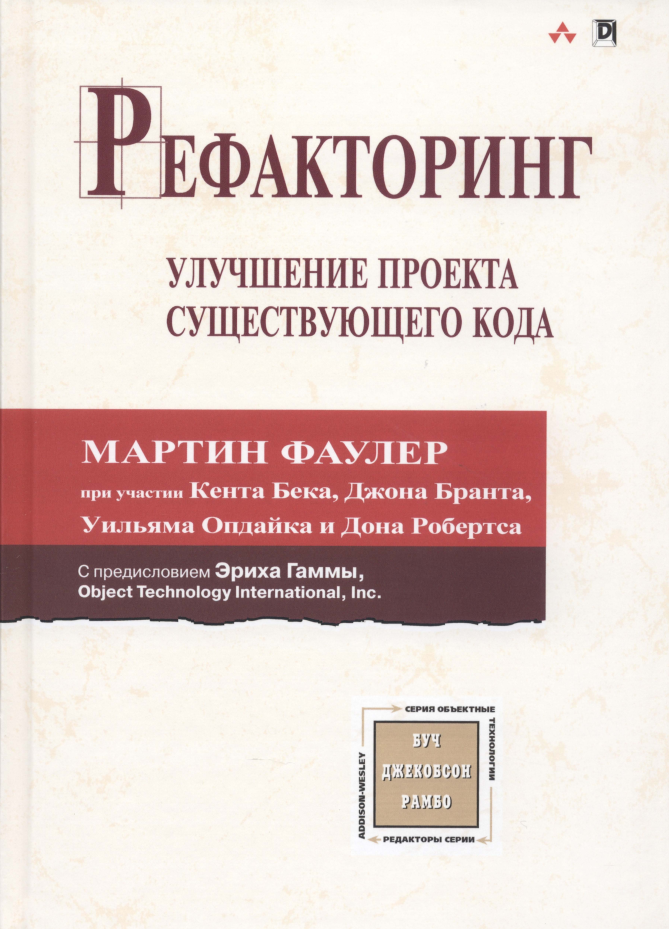

# Мартин Фаулер. Рефакторинг. Улучшение проекта существующего кода 2019



- [Когда нужно выполнять рефакторинг](#Когда-нужно-выполнять-рефакторинг)
- [Проблемы при выполнении рефакторинга](#Проблемы-при-выполнении-рефакторинга)
- [Рефакторинг и производительность](#Рефакторинг-и-производительность)
- [Глава 3. Запах в коде](#Глава-3-Запах-в-коде)
- [Глава 6-11. Методы рефаторинга](#Глава-6-11-Методы-рефаторинга)
- [Глава 12. Крупномасштабные рефакторинги](#Глава-12-Крупномасштабные-рефакторинги)
- [Refactoring.guru](#refactoringguru)


> 
> 💬 Сперва ПО проектируют, потом конструируют т.е. пишут код. И в любом случае придется изменять поведение, изменяя код. И хотелось бы вносить изменения или находить место в коде - бысто и легко с минимум когнитивной нагрузки. 
>
> Аналогия, плохое ПО - вам нужна нитка, они лежат в куче, вы тянете нитку которая тянет за собой клубок запутанных разноцветных ниток, которые только сильнее завязываются в узлы и рвутся.
> Хорошее ПО - вам нужна нитка, все нитки сложены в коробки с надписями по предназначению, цвету, размеру, ..., и в каждой коробке нитки намотаны на бабины и имеюют свое упорядоченное посадочное место, царит порядок и понятность. 
>
> Тем более, сделать плохо всегда легче, чем сделать хорошо, так как для порядка требуется дополнительное усилие, поэтому лучше **специально избегать** ситуаций способствующих легкому созданию плохого ПО. 
>
> Другая аналогия про порядок и понятность, играя в Fallout, MistSurvival... храня лут в неотсортированном порядке в разных ящиках и в разных местах, придется тратить время на вспоминание, что где находится и есть ли вообще эта детали, иначе ее надо крафтить, а для этого надо знать есть ли другие делати и так по кругу, с увеличением количества предметов растет степень запутанности.
>
> Но цель не порядок и понятность, что плохой код - понятный, можно сказать, если уделить достаточно много времени ему т.е. привыкнув к нему. **Главной же целью порядка и понятности является - помочь реализоваться всем потребностям ПО, помочь достичь своего максимума возможного.** Это достигается за счет высокой степени свободы при внесении изменений. Проводя эксперименты, быстро внося изменения, быстро находим идальный вариант. Ясное дело, что такой код != оптимальному коду с точки зрения производительности, аналогия - мы работаем с вечным прототипом, так как ПО должно быть "живое" для постоянных изменений.
>
> И что бы уметь оперировать понятиями - потность и порядок в коде, нужно уметь жанглировать такими умениями как архитектура и паттерны.
>
> Важно понимать отличие, производить рефакторинг так что бы стало понятно лично мне или правильные рефакторинг.  
>
> (Я)   


> Ральф Джонсон (Ralph Johnson) сравнивает первые шаги рефакторинга с мытьем окон, которое позволяет видеть яснее и дальше.

**Рефакторинг** - это процесс изменения программного проекта, в ходе которо­го внешнее поведение кода остается неизменным при усовершенствовании его внутренней структуры. Это систематизированный способ очистки кода, мини­мизирующий возможность появления новых ошибок.


**Рефакторинг** (Refactoring) (сущ.): изменение во внутренней структуре программного обеспечения, имеющее целью облегчить понимание его работы и упростить модификацию, не затрагивая наблюдаемого
поведения.

**Производить рефакторинг** (Refactor) (глаг.): изменять структуру программного обеспечения, применяя ряд рефакторингов, не затрагивая его поведения.
 

Обнаружив, что в программу необходимо добавить новую функциональность, но код программы неструктурирован удобным для добавления этой функциональности образом, сначала произведите рефакторинг программы, чтобы упростить внесение необходимых изменений, а только потом добавьте функцию.

💡Написать код, понятный компилятору, сможет любой дурак. Но лишь не­ многие смогут написать код, понятный людям.

Помните, что перед на­чалом рефакторинга код должен работать (в основном) правильно.

**Первый шаг рефакторинга** - это надежные тесты подтверждающие работоспособность.
Перед тем как приступать к рефакторингу, убедитесь, что у вас есть комплект надежных самопроверяющихся тестов.
Начиная рефакторинг, первым делом я всегда **создаю** (т.е. это новые дублирующие поведение тесты для новыго кода) надежный набор тестов для той части кода, с которой буду работать.

> 💬 В книге, пример организации внесения изменений, через автотесты, сверяющие результат нового кода с результатом тестирования старого кода. Так как поведение не должно менятся, то мы можем этот процесс, изменения кода, сопроводить автотестированием на момент рефакторинга. Т.е. создаются новые тесты которые используют старые тесты в роле `assert`. Но тогда важно соблюсти все инварианты ...

## Когда нужно выполнять рефакторинг

Я почти всегда против откладывания рефакторинга. Как мне кажется, рефак­торинг - это не тот вид деятельности, который можно отложить. Им следует за­ниматься понемногу и постоянно. Надо не принимать решение о проведении ре­факторинга, а проводить его, потому что вы должны делать свою работу.

Приближение срока окончания работ представляет собой единственный слу­чай, когда можно отложить рефакторинг из-за недостатка времени. Иначе в другое время, выполнение рефакторинга ведет к росту производительности труда. Нехватка времени обычно сигнализирует как раз о необходимости рефакторинга.

**Правило трех ударов**
Вот руководящий совет, который дал мне Дон Роберте (Don Roberts). 
Делая что-то в первый раз, вы просто это делаете. 
Делая что-то аналогичное во второй раз, вы морщитесь от необходимости повторения, но все-таки повторяете то же самое. 
Делая что-то похожее в третий раз, вы начинаете рефакторинг.
Даже если вы точно знаете, как работает система, не занимайтесь гаданием, а проведите замеры. 
Полученная информация в девяти случаях из десяти покажет, что ваши догадки были ошибочны!

> 💬 Если при нахождении "пахнущего" кода следует сразу его рефакторить, то следует вырабатывать в себе такое качество/чувство/стиля написания кода который вероятней не придется рефакторить в будущем, т.е. изначально писать хороший код. Приятней смотреть/иметь/взаимодействовать с кодом который не является убыточным, ограниченным, отсталым, а наоборот гибким, позволяющий вносить изменения и расширять его.

Руководитель, подгоняемый графиком работ, хочет от меня повышения скорости; ну, а как именно я буду этого добиваться - дело. Самый быстрый путь - не его рефакторинг, а потому я буду им заниматься.

**Как делать рефакторинг**

1. **Учитесь выбирать цель**. В ряде мест вашего кода есть запах. Решитесь из­ бавиться от него. После этого двигайтесь к выбранной цели. Вы занимае­тесь рефакторингом не в поисках истины и красоты (во всяком случае, это не единственная и не главная ваша задача). Вы стараетесь, чтобы програм­му было проще понять, чтобы восстановить контроль над программой, ко­торая живет своей жизнью.

2. **Остановитесь, почувствовав неуверенность**. По мере продвижения к цели может наступить момент, когда вы не можете уверенно сказать себе и другим, что ваши действия сохранят семантику программы. Остановитесь. Если код уже стал лучше, выпускайте версию, которую удалось получить. Если нет, отмените изменения.

3. **Возвращайтесь к прежней версии**. Дисциплину проведения рефакторинга трудно осваивать. Перспективу легко потерять из виду, отвлекшись даже на мгновение. Я по-прежнему теряю перспективу чаще, чем хотелось бы. Я выполняю по три-четыре рефакторинга подряд, не выполняя постоянно тестирования. Все обойдется, я же чувствую себя уверенно, у меня же боль­шой опыт! Бум! Тест не прошел, и я даже не знаю, какое из изменений стало источником проблемы.


## Проблемы при выполнении рефакторинга

Изменение интерфейсов, при изменении в рефакторинге опубликованного интерфей­са необходимо сохранять как старый интерфейс, так и новый, хотя бы до того времени, когда пользователи отреагируют на это изменение. К счастью, это не так уж сложно. Обычно можно выполнить работу так, чтобы старый интерфейс оставался работающим. Попробуйте сделать так, чтобы старый интерфейс вызы­вал новый, и, изменив название метода, сохраните его.

```rust,no_run
#[deprecated(
    since = "1.5.0", 
    note = "This method has performance issues. Use `process_data_v2` instead. \
           Migration guide: https://example.com/migration#process_data"
)]
pub fn process_data(input: &str) -> String {
    // устаревшая реализация
}

#[deprecated(note = "This struct will be removed in version 2.0")]
pub struct OldStruct {
    pub field: i32,
}

impl MyStruct {
    #[deprecated(since = "1.3.0", note = "Use `new_method` with better error handling")]
    pub fn old_method(&self) -> Result<(), String> {
        // устаревший метод
    }
}

#[cfg_attr(feature = "deprecated", deprecated(since = "1.6.0", note = "Use v2 API"))]
pub fn conditionally_deprecated() {
    // ...
}

#[deprecated(since = "1.2.0")]
pub enum OldEnum {
    Variant1,
    Variant2,
}

/// Старый способ обработки данных
///
/// # Deprecated
/// 
/// Этот метод устарел начиная с версии 1.4.0. 
/// Используйте [`new_processor`] вместо этого.
///
/// ## Миграция
/// ```rust
/// // Было:
/// old_processor(data);
/// 
/// // Стало:
/// new_processor(data);
/// ```
#[deprecated(since = "1.4.0", note = "Use `new_processor` instead")]
pub fn old_processor(data: &[u8]) {
    // ...
}

#[macro_export]
#[deprecated(since = "1.7.0", note = "Use `new_macro!` instead")]
macro_rules! old_macro {
    ($x:expr) => {
        println!("Old: {}", $x);
    };
}
```

## Рефакторинг и производительность

Распространенный вопрос, связанный с рефакторингом, - его влияние на производительность программы. Для облегчения понимания работы програм­мы часто осуществляется модификация, приводящая в конечном итоге к замед­лению программы. Это важный вопрос. Я не считаю возможным пренебрегать производительностью программного обеспечения, предпочитая чистоту проек­та или надеясь на увеличение вычислительной мощности техники. Рефакторинг может приводить к замедлению программы, но при этом он делает более легкой настройку ее производительности. Секрет создания быстрых программ (если только они не предназначены для работы в режиме реального времени) состоит в том, чтобы начать с написания программы, производительность которой **мож­но настраивать, а затем с помощью настройки достичь приемлемой скорости ее работы**. Благодаря более **понятному** коду легче выбрать возможные варианты настройки и понять, какая именно настройка может оказаться эффективной.

Все начинается с **запуска профайлера**, который исследует выполнение про­граммы и сообщает, где в основном расходуются время и память. Это позволя­ет выявить небольшой фрагмент кода, который представляет собой узкое ме­сто в смысле производительности. 

## Глава 3. Запах в коде

* **Дублирование кода**

   Увидев одинаковые кодовые структуры в нескольких местах, можно быть уверенным, что если удастся их объединить, программа от этого только выиграет.

   Лечение: применить рефакторинг "Извлечение метода", "Извлечение класса". Если оба метода делают одно и то же с помощью разных алгоритмов то применить рефакторинг "Замена алгоритма".

* **Длинный метод**

   Ухудшает чтение и сопровождение.  Все выгоды, которые дает косвенность - понятность, совместное использование и выбор, - поддерживаются именно маленькими методами. Главное, что способствует пониманию маленьких методов, - это присвоение им разумных имен. Правильно выбран­ное имя метода зачастую позволяет не изучать его тело. Эвристическое правило, которому мы следуем, гласит, что если возникает необходимость что-то прокомментировать, то пора писать метод. В этом методе содержится код, который требовал комментариев, но его название отражает его назначение, а не метод решения им задачи. Главным является не длина метода, а семантическое расстояние между тем, что метод делает, и тем, как он это делает.
   
   Лечение: использовать рефакторинг "Извлечение метода", найдите части метода, которые кажутся связанны­ми между собой, и образуйте новый метод. Найти код который нуждается в комментарии и выделить его в отдельный метод с ясным названием, имя которого основано на этом комментарии. Если у вас метод со множеством параметров и временных переменных, это мешает выделению нового метода. Применяя рефакторинг "Извлечение метода", приходится передавать в  качестве параметров такое количество параметров и временных переменных, что результат оказывается ничуть не проще, чем ориги­нал. Устранить временные переменные можно с помощью рефакторинга "Замена временной переменной запросом", а длинные списки параметров мож­но сократить с помощью рефакторингов "Введение объекта параметра" и "Сохранение всего объекта" или если после этого все равно остается слишком много временных переменныхи параметров то "Замена метода объектом методов".

* **Большой класс**

   Когда класс пытается выполнять слишком много работы, это часто проявляется в чрезмерном количестве имеющихся у него атрибутов. А если класс имеет слишком много атрибутов, недалеко и до дублирования кода.

   Лечение: устранение избыточности, рефакторинг "Извлечение класса" или "Извлечение подкласса" позволяет связать некоторое коли­чество членов-данных вместе для которых это имеет смысл. Полезным приемом является определение того, как клиенты используют класс, и применение рефакторинга "Извлечение интерфейса" для каждо­го из этих применений. В результате может выясниться, как разделить класс еще сильнее. Если большой класс является классом GUI, может потребоваться переместить его данные и поведение в отдельный объект предметной области. Это может по­требовать хранения дублированных данных в двух местах и поддерживать их со­гласованность. Рефакторинг "Дублирование видимых данных"

* **Длинный список параметров**

   В длинных списках параметров трудно разбираться, они становятся противоречивыми и сложными в использовании, а также потому, что их приходится вечно изменять по мере того, как возникает необходимость в новых данных. 
   
   Лечение: если же передавать методам объекты, то изменений потребуется меньше, так как для получения новых данных, скорее всего, хватит пары запросов.

   Исключение, когда такие изменения вносить не следует, когда мы не хотим создавать явную зависимость.

* **Расходящиеся модификации**

   Расходящиеся (divergent) модификации имеют место тогда, когда один класс часто модифицируется различными способами по разным причинам. Расходящиеся (divergent) изменения имеют место тогда, когда один класс час­то изменяется различными путями по разным причинам. Если глядя на класс, вы замечаете про себя, что вот эти три метода придется изменять для каждой новой базы данных, а вот эти четыре метода - при каждом появлении нового финансового требования, то это может означать, что вместо одного класса луч­ше иметь два. 
   
   Лечение: тогда имеет смысл выделить новые классы по типу будущих изменений. Для приведения кода в порядок сле­дует определить все, что модифицируется по данной конкретной причине, а затем применить рефакторинг "Извлечение класса". Так каждый класс будет иметь свою точно определенную зону от­ветственности и изменяться только в соответствии с изменениями в этой зоне.

* **«Стрельба дробью»**

   Когда при выполнении любых модификаций приходится вносить множество мелких изменений в большое число классов. 
   
   Лечение: в этой ситуации следует свести все изменения в один класс, использовав ре­факторинги "Перенос метода" и "Перенос поля". Если подходяще­го кандидата среди имеющихся классов нет, создайте новый класс. Часто можно применить рефакторинг "Встраивание класса" и поместить целый пакет методов в один класс.

* **Параллельные иерархии наследования**

   Параллельные иерархии наследования в действительности являются особым случаем «стрельбы дробью». В данном случае всякий раз при порождении подкласса одного из классов приходится создавать подкласс другого класса. 
   
   Лечение: общая стратегия устранения дублирования состоит в том, чтобы заставить экземпляры одной иерархии ссылаться на экземпляры другой. С помощью рефак­торингов "Перенос метода" и "Перенос поля" можно устранить излишнюю иерархию.

* **Завистливые функции**

   Весь смысл объектов в том, что они позволяют хранить данные вместе с процедурами их обработки. Классический пример дурного запаха - метод, который больше интересуется не тем классом, в котором он находится, а каким-то другим. Чаще всего предметом зависти являются данные. Не счесть случаев, когда мы сталкивались с методом, вызывающим полдюжины методов доступа к данным другого объекта, чтобы вычислить некоторое значение. 
   
   Лечение: метод следует перенести в другое место с помощью рефакторинга "Перенос метода". Разумеется, есть несколько сложных схем, нарушающих это правило. На ум сразу приходят паттерны из [Gang of Four](https://github.com/Jekahome/Patterns?tab=readme-ov-file#gangs-of-four-gof-design-patterns): [Strategy] и [Visitor](https://github.com/Jekahome/Patterns?tab=readme-ov-file#visitor).

* **Группы данных**

   Данные - как дети: они любят сбиваться в тесные группы, элементы данных встречаются во множестве мест: поля в паре классов, параметры в нескольких методах.

   Лечение: данные, встречающиеся совместно, имеет смысл превращать в отдельный класс. Рефакторинг "Извлечение класса" преобразовать группы данных в объект. Затем следу­ет обратить внимание на сигнатуры методов и применить рефакторинг "Введение объекта параметра" или "Сохранение всего объекта" для сокраще­ния их объема. Непосредственной выгодой от этого являются сокращение многих списков параметров и упрощение вызовов методов.

* **Классы данных**

   Такие классы содержат поля, методы для получения `get...` и установки значений `set...` этих полей и ничего больше. Такие классы - бессловесные хранилища данных, которыми другие классы наверняка **манипулируют излишне** обстоятельно. 
   
   Лечение: рефакторинг "Инкапсуляция поля", "Инкапсуляция кол­лекции", все поля такого класса должны быть инкапсулированы. Рефакторинг "Сокрытие метода" применяется ко всем полям, значение которых не должно изменяться. Рефакторинг "Перенос метода" для перемеще­ния поведения в класс данных. Если метод не удается переместить целиком, вос­пользуйтесь рефакторингом "Извлечение метода", чтобы создать метод, который можно переместить. Через некоторое время можно начать применять рефакторинг "Сокрытие метода" к методам получения и установки значе­ний полей. Классы данных подобны детям. В качестве начальной точки они годятся, но чтобы участвовать в работе в качестве взрослых объектов, они должны принять на себя определенную ответственность.

* **Одержимость элементарными типами**

   Те, кто занимается объектами недавно, обычно не любят использовать малень­кие объекты для маленьких задач, такие как, например, денежные классы, объеди­няющие численное значение и валюту, диапазоны с верхней и нижней границами или специализированные строки наподобие телефонных номеров или почтовых индексов. Выбраться в мир объектов помогает рефакторинг "Замена значения данных объектом".

   Лечение: завернув обший тип (примитив) в свою оболочку мы получаем свой собственный тип данных, который неполучится спутать с его внутренным типом и подставить в неверное место, так же вы можете обеспечить требуемые инварианты для значений типа, ограничив или расширив их. Также [Type safety (Newtype)] ближе к предметной области и следовательно лучше документировать и понять его применение.

   [Type safety (Newtype)]: https://github.com/Jekahome/Patterns?tab=readme-ov-file#type-safety-newtype-typestate

* **Операторы типа switch**

   Одним из очевидных признаков объектно-ориентированного кода служит сравнительная немногочисленность операторов типа switch (или case). Проблема, обусловленная применением switch, по существу, связана с дублированием. Часто один и тот же блок switch оказывается разбросанным по разным местам программы. При добавлении в switch нового варианта приходится искать все эти блоки switch и модифицировать их. Объектно­ ориентированная концепция полиморфизма предоставляет элегантный способ справиться с этой проблемой.

   Лечение: задача заключается в том, чтобы выяснить, где должен применяться полиморфизм. Часто инструкция switch работает с кодами ти­пов, переключая поведение для разных типов. При этом необходим метод или класс, хранящий значение кода типа. Воспользуйтесь рефакторингом "Извлече­ние метода" для выделения инструкции switch, а затем рефакторингом "Перенос метода" для ее вставки в класс, где требуется полиморфизм. В этот момент вы должны решить, чем именно воспользоваться - рефакторин­гом "Замена кода типа подклассами" или рефакторингом "Замена кода типа состоянием/стратегией". Разобравшись в структуре наследования, можно применить рефакторинг "Замена условной инструкции полиморфиз­мом".

   Замена условной инструкции (`if, case, match, switch...`) полиморфиз­мом:

   ```rust
   enum Payment {
      CreditCard { amount: f64 },
      Paypal { amount: f64 },
      Crypto { amount: f64 },
   }

   impl Payment {
      fn process(&self) {
         match self {
               Payment::CreditCard { amount } => {
                  println!("Processing credit card payment: ${amount}");
               }
               Payment::Paypal { amount } => {
                  println!("Processing PayPal payment: ${amount}");
               }
               Payment::Crypto { amount } => {
                  println!("Processing crypto payment: ${amount}");
               }
         }
      }
   }

   fn main() {
      let p = Payment::Paypal { amount: 42.0 };
      p.process();
   }
   ```

   Замена на полиморфизм:

   ```rust
   trait Payment {
      fn process(&self);
   }

   struct CreditCard {
      amount: f64,
   }

   impl Payment for CreditCard {
      fn process(&self) {
         println!("Processing credit card payment: ${}", self.amount);
      }
   }

   struct Paypal {
      amount: f64,
   }

   impl Payment for Paypal {
      fn process(&self) {
         println!("Processing PayPal payment: ${}", self.amount);
      }
   }

   struct Crypto {
      amount: f64,
   }

   impl Payment for Crypto {
      fn process(&self) {
         println!("Processing crypto payment: ${}", self.amount);
      }
   }

   // Обобщённая функция, которая работает с любым типом, реализующим Payment
   fn process_payment<T: Payment>(payment: &T) {
      payment.process();
   }

   fn main() {

      // статическая диспетчеризация

      let credit = CreditCard { amount: 100.0 };
      let paypal = Paypal { amount: 42.0 };
      let crypto = Crypto { amount: 0.005 };

      process_payment(&credit);
      process_payment(&paypal);
      process_payment(&crypto);

      // динамическая диспетчеризация (trait objects)

      let payments: Vec<Box<dyn Payment>> = vec![
         Box::new(CreditCard { amount: 100.0 }),
         Box::new(Paypal { amount: 42.0 }),
         Box::new(Crypto { amount: 0.005 }),
      ];

      for p in payments {
         p.process();
      }
   }
   ```

* **Ленивый класс**

   Сопровождение и понимание каждого создаваемого класса влечет опреде­ленные затраты. Класс, существование которого не окупается выполняемымиим функциями, должен быть ликвидирован.

   Лечение: если у вас есть подклассы с недостаточной функциональ­ностью, попробуйте применить рефакторинг "Свертывание иерархии". Компоненты, являющиеся практически бесполезными, должны быть подвергну­ты рефакторинrу "Встраивание класса".

   > 💬 осторожно цикличность, добавив классы на предыдущих этапах рефакторинга, в этом случае снова его удалить :)

* **Временное поле**

   Обычно временные поля возникают, когда сложному алгоритму требуется несколько переменных. Программист, который реализовывал алгоритм, не захо­тел пересылать большой список параметров (да и кто бы захотел?), поэтому он разместил их в полях. Но поля корректны только во время работы алгоритма; в других контекстах они лишь вводят в заблуждение. 
   
   Лечение: в таком случае можно приме­нить рефакторинг "Извлечение класса" к переменным и методам, в кото­рых требуются эти поля. Новый объект является объектом метода

* **Цепочки вызовов**

   Такие `a->b->c->d` после­довательности вызовов означают, что клиент связан с навигацией по структуре классов. Любые изменения промежуточных связей приводят к необходимости модификации клиента.

   Лечение: рефакторинг "Сокрытие делегирования", при­чем его можно использовать в различных местах цепочки.

* **Посредник**

   Одной из основных характеристик объектов является инкапсуляция - сокры­тие внутренних деталей реализации от внешнего мира. Инкапсуляции часто со­путствует делегирование. Если делегирования слишком много, например, мы просмат­риваем интерфейс класса и обнаруживаем, что половина методов делегирует об­работку другому классу. 

   Лечение: В таком случае нужно воспользоваться рефакторингом "Удаление посредника" и общаться с объектом, который действительно знает, что происходит.

* **Неуместная близость**

   Иногда классы оказываются в слишком близких отношениях и чаще, чем следовало бы, погружены в закрытые части друг друга.

   Лечение: с помощью рефакторингов "Пе­ренос метода" и "Перенос поля" необходимо разделить части кода, чтобы уменьшить их близость. Посмотрите, нельзя ли прибегнуть к рефакторингу "Замена двунаправленной связи однонаправленной". Если у классов есть общие интересы, воспользуйтесь рефакторингом "Извлечение класса", чтобы поместить общую деятельность в безопасное место и превратить их в доб­ропорядочные классы. Можно также применить рефакторинг "Замена наследо­вания делегированием", позволив другому классу выступать в качестве промежуточного звена.

* **Неполный библиотечный класс**

   Если в библиотечный класс надо включить всего лишь пару новых методов, используйте рефакторинг "Введение внешнего метода". Если дополни­тельная функциональность достаточно велика, необходимо применить рефакто­ринг "Введение локального расширения"

* **Отказ от наследования**

   Подклассам полагается наследовать методы и данные своих родителей. Но как быть, если наследство им не нравится или попросту не требуется? Получив все эти дары, они пользуются лишь малой их частью. Обычная история при этом - неправильно задуманная иерархия. 
   
   Лечение: необходимо создать новый класс на одном уровне с потомком и с помощью «Спуска метода» (Push Down Method) и «Спуска поля» (Push Down Field) вытолкнуть в него все бездействующие методы. Благодаря этому в родительском классе будет содержаться только то, что используется совместно.

   И учесть, что наследование зачастую приводит к чрезмерной близости. Подклассы всегда знают о своих родителях больше, чем последним хотелось бы.

* **Комментарии**

   Комментарии полезны, когда вы не знаете, что делать. Помимо описания происходящего, комментарии могут отмечать те места, в которых вы не увере­ны. Комментарии - хорошее место пояснить, почему вы поступаете именно так. Эта информация пригодится тем, кто будет работать с вашим кодом в будущем.

   Удивительно часто встречается код с обильными комментариями, которые появились в нем лишь потому, что код плохой. Первым действием должно быть удаление этих запахов плохого кода при помощи рефакторинга. После этого комментарии часто оказываются ненужными.

   При проведении рефакторинга, важным предварительным условием является наличие надежных тестов. Существует естественная связь между паттернами и рефакторингом. Паттерны представляют собой цели; рефакторинг дает методы их достижения.


## Глава 6-11. Методы рефаторинга

>
> 💬 Описанные методы рефаторинга (начиная с главы 6) в основном примитивны: если сложно понять часть кода - то выделите код в новый блок кода с ясным названием.
> 
> Ясное дело, что по хорошему следует писать код логически связанный, и оформлять в модули, класы, функции, и применять соответсвующие паттерны. Избегать неявных изменений, да в Rust мутация mut явная но есть возможность злоупотреблять **затенение** типа. Динамические языки позволяют злоупотреблять предоставленной гибкостью, многие из этих методов рефакторинга касаются их.
>
> Так есть рефакторинг смены ссылки на значение. Что тут комментировать, надо понимать - мы шарим или копируем и клонируем данные.

Список методов рефакторинга - это только начало. Это ворота, через кото­рые нужно пройти. Без этих методов вы не сможете изменять конструкцию ра­ботающих программ. С ними, впрочем, тоже - но по крайней мере это хорошая отправная точка. Почему же все эти замечательные методы представляют собой только начало? Потому что вы пока что не знаете, когда их нужно применять, а когда - нет, когда нужно начать рефакторинг, а когда остановиться, когда двигаться вперед, а когда ждать. Рефакторинг - это мелодия, а не отдельные ноты. Как узнать, что вы действительно начали понимать рефакторинг? Вы узнаете об этом, когда на вас снизойдет спокойствие. Когда вы почувствуете абсолютную уверенность, что, как бы хитро ни был запутан код, который вам достался, вы сумеете настолько его улучшить, что сможете легко работать над ним дальше. Но главный признак того, что вы освоили рефакторинг, - **умение вовремя остановиться**.


* **Извлечение метода (Extract Method)**

   Когда в методе есть код который должен быть выделен (по разным причинам) в новый отдельный метод. Преобразуем фрагмент кода в метод, название которого поясняет его назна­чение.

   Если я нахожу метод, кажущийся слишком длинным, или код, который для по­яснения его предназначения требует комментариев, я преобразую этот фрагмент кода в отдельный метод.

* **Извлечение переменной (Extract Variable)** — вводим именованную переменную в которой храним результат выражения, чтобы упростить сложное выражение.

   Особенно полезно, если выражение сложно читать или повторяется.

* **Расщепление временной переменной (Split Temporary VariaЬle)**. Имеется временная переменная, которой многократно присваивается значе­ние, но переменная не является ни переменной цикла, ни переменной для накоп­ления результата. Для каждого присваивания создается отдельная временная переменная.

* **Введение внешнеrо метода (Introduce Foreign Method)**. Используемому серверу требуется дополнительный метод, но модифициро­вать класс невозможно. То что в Rust называется `extension traits` - расширение существующих типов своими методами.

   > 💬 Думаю, это создает повод для рефакторинга, так как это уже не явное поведение типа, который мы расширяем. Как вы удивитесь, когда тип `String` из `std` использует метод `is_palindrome`, у вас появится желание посетить официальную документацию.


   * Пример для ситуации: наш трейт + чужой тип (crates или из std)

      Мы “добавим” метод к чужому типу (String), не изменяя его исходник.

      ```rust
      // Расширяем стандартный тип String
      trait StringUtils {
         fn is_palindrome(&self) -> bool;
      }

      // Реализация для String
      impl StringUtils for String {
         fn is_palindrome(&self) -> bool {
            let s = self.chars().collect::<Vec<_>>();
            s == s.iter().rev().cloned().collect::<Vec<_>>()
         }
      }
      fn main() {
         let s = "racecar".to_string();
         println!("{}", s.is_palindrome()); // true
      }
      ```

      Или расширим `Vec<i32>`:

      ```rust
      trait VecExt {
         fn sum_squares(&self) -> i32;
      }
      impl VecExt for Vec<i32> {
         fn sum_squares(&self) -> i32 {
            self.iter().map(|x| x * x).sum()
         }
      }
      fn main() {
         let buff:Vec<i32> = vec!(1,2,3);
         println!("{}", buff.sum_squares()); // 14
      }
      ```

   * Пример для ситуации: чужой трейт fmt::Display + наш тип MyType:

      ```rust
      use std::fmt;
      struct MyType;
      impl fmt::Display for MyType {
         fn fmt(&self, f: &mut fmt::Formatter) -> fmt::Result {
            write!(f, "MyType")
         }
      }
      ```

* **Введение локальноrо расширения (Introduce Local Extension)**. Когда нужно добавить поведение к чужому типу,
но не хочется (или нельзя) “засорять” глобальное пространство методами. То что в Rust называется [Type safety (Newtype)] - “создать свой тип, оборачивающий чужой”

   Теперь `SafePath` — это как “локальное расширение” для `PathBuf`. Мы не трогаем оригинальный тип, но даём ему локальное поведение.

   ```rust,no_run
   struct SafePath(PathBuf);

   impl SafePath {
      fn new(path: &str) -> Self {
         assert!(path.len() < 255);
         Self(PathBuf::from(path))
      }

      fn exists(&self) -> bool {
         self.0.exists()
      }
   }
   ```

* **Разбиение условия (Decompose Conditional)** — сложные `if`-условия распиливаем на маленькие функции с понятными именами.

* **Введение объекта параметров (Introduce Parameter Object)** — если функция принимает слишком много аргументов, оборачиваем их в один тип.

* **Заменить параметр запросом (Replace Parameter with Query)** — если значение можно получить из контекста, не нужно передавать его аргументом.

* **Введение утверждения (Introduce Assertion)** — вставляем `debug_assert!` или `assert!`, чтобы явно документировать ожидания.

   `assert!` используется именно для неожиданного (unrecoverable) случая ошибки — когда программа не может и не должна продолжать работу. Нарушен инвариант или логика программы — программа в некорректном состоянии, когда нарушение инварианта делает дальнейшее выполнение бессмысленным - выбрасываем `panic!`

   ```rust
   fn process(x: i32) {
      assert!(x >= 0, "x must be non-negative");
      // ...
   }
   ```

   Утверждения нужны для фиксации логических предположений, которые невозможно выразить типами или тестами. Так как в Rust большая часть того, что в других языках проверяют assert’ами, проверяется типовой системой и тестами:
   - borrow checker и lifetimes → защищают инварианты владения, ссылок, mutability
   - Result и Option → вынуждают обработку ошибок
   - property-based тестирование и unit-тесты → могут покрыть логические инварианты
   - статический анализ и Clippy → находят массу нарушений автоматически


   Когда `assert!` или `debug_assert!` всё-таки оправдан:

   1. **Сложные инварианты, не описываемые типами.**
      Например, проверка, что два вектора одинаковой длины, перед вычислением:

      ```rust
      fn dot(a: &[f64], b: &[f64]) -> f64 {
         debug_assert_eq!(a.len(), b.len());
         a.iter().zip(b).map(|(x, y)| x * y).sum()
      }
      ```

      Это не ошибка пользователя — просто сам код подразумевает “размеры совпадают”.

   2. **Оптимизация безопасности на отладке.**
      `debug_assert!` срабатывает только в debug-сборке,
      а в release вырезается — удобно для “дешёвых” проверок.

   3. **Документация для будущего разработчика.**
      Иногда assert — это не “проверка”, а “комментарий, который проверяется во время выполнения”:

      ```rust
      debug_assert!(state.is_ready(), "should not call process() before ready");
      ```
* **Заменить значение объектом (Replace Data Value with Object)** — из “плоских” данных делаем тип с поведением. Цель: заменить примитив (число, строку и т. п.) на объект, чтобы можно было добавить поведение или правила. Применяем идиому [Type safety (Newtype)].

* **Замена записи классом данных (Replace Record with Data Class)**. Превратить структуру данных в “немой объект данных” с поведением, инкапсулировав доступ к полям. “Немой объект данных”: он не делает ничего “умного” — просто хранит данные и отдаёт их.

   Позже его можно развить в “умный объект” (добавить валидацию, инварианты и поведение).

* **Замена кода типа классом (Replace Туре Code with Class)**. Если в классе есть поле — обычно число, строка или enum-код — которое определяет поведение объекта (например, “тип сотрудника”, “категория продукта”), то надо заменить это поле отдельным классом (типом), чтобы поведение было привязано к этому типу, а не к числу. Применяем идиому [Type safety (Newtype)]. Или если поле имеет изменяющееся поведенияе в зависимости от своего значения то заменить поле на полиморфизм или на шаблон [State](https://github.com/Jekahome/Patterns/tree/main/idioms/1.Type_safety/1.2.Typestates)/[Strategy].

[Strategy]:https://github.com/Jekahome/Patterns?tab=readme-ov-file#strategy

* **Дублирование видимых данных (Duplicate Observed Data)**. Иногда объект должен иметь свое собственное поле, которое дублирует данные из другого объекта,
чтобы упростить доступ. После дублирования данных нужно следить за синхронизацией. Обычно при изменении исходного объекта вызывается метод вроде `refresh()` или `update_from()`.

   Сценарий, когда вводится дублирование:
   1. Изначально объект жёстко зависит от другого — лезет за каждым значением вглубь (например, `order.customer.name`).
   2. Из-за этого код становится сильно связанным и медленным.
   3. Разработчик вводит локальное поле, которое дублирует наблюдаемые данные, чтобы **ослабить связь и повысить производительность** / удобство.

* **Замена однонаправленной связи двунаправленной (Change Unidirectional Association to Bidirectional)**. Обьекты хотят знать друг о друге.

   Это создаёт циклические зависимости, в Rust это решается:

   - для случая логической двунаправленности, если данные хранятся в коллекции или БД, то мы храним в обьектах их ID
   - для случая настоящих ссылок в памяти, используем слабый умный счетчик ссылок -`Weak`

   ```rust
   use std::cell::RefCell;
   use std::rc::{Rc, Weak};

   struct Customer {
      name: String,
      orders: RefCell<Vec<Rc<Order>>>,
   }

   struct Order {
      id: u32,
      customer: Weak<Customer>, // обратная ссылка
   }

   impl Customer {
      fn new(name: &str) -> Rc<Self> {
         Rc::new(Customer {
               name: name.to_string(),
               orders: RefCell::new(vec![]),
         })
      }

      fn add_order(self: &Rc<Self>, id: u32) {
         let order = Rc::new(Order {
               id,
               customer: Rc::downgrade(self), // слабая ссылка на владельца
         });
         self.orders.borrow_mut().push(order);
      }
   }

   ```

* **Замена магического числа символической константой (Replace Magic Number with Symbolic Constant)**. Есть числовой литерал, имеющий определенный смысл.Создайте константу, присвойте ей имя в соответствии со смыслом констан­ты и замените ею число.

* **Инкапсуляция поля (Encapsulate Field)**. Имеется открытое поле. Сделайте его закрытым и предоставьте методы доступа к нему. По умолчанию поля должны быть приватными.

* **Инкапсуляция коллекции (Encapsulate Collection)**. Метод возвращает коллекцию. Сделайте возвращаемое значение представлением, доступным только для
чтения, и предоставьте методы добавления/удаления элементов.

   Смысл в том, что бы держать внутреннюю механику работы класса закрытой, что дает ему полномочия самостоятельно распоряжаться деталями реализации, а не пользователям.

   ```rust,no_run
   struct Customer {
      orders: Vec<Order>, // скрываем
   }

   impl Customer {
      fn new() -> Self {
         Self { orders: Vec::new() }
      }

      fn add_order(&mut self, order: Order) {
         // тут можно добавить проверки, события и т.д.
         self.orders.push(order);
      }

      fn remove_order(&mut self, id: u32) {
         self.orders.retain(|o| o.id != id);
      }

      fn orders(&self) -> &[Order] {
         &self.orders // отдаём только чтение
      }
   }
   ```

* **Декомпозиция условного оператора (Decompose Conditional)**. Если у вас есть сложный `if-else` (или `match`), в котором в одной куче: проверяется длинное условие, выполняются сложные действия в ветках. Это значит, что код делает несколько вещей одновременно, и его надо разбить на понятные маленькие функции.

   Решение:
   - вынос сложных булевых выражений в функции `fn is_xxx(&self) -> bool`
   - разделение `match` с логикой на простые вызовы `fn handle_xxx()`
   - чистые функции вместо громоздких `if` внутри `impl`

* **Удаление управляющего флага (Remove Control Flag)**. Имеется переменная, действующая в качестве управляющего флага для ряда логических выражений. Используйте вместо нее break или return.

   > 💬 Конечно для выхода из области есть стандартные средства языка `break` или `return`, но я использую  условный флага управления ходом выполнения, когда нужно **еще** проверить условия после завершения, как казалось конца, алгоритма, и тут мы не можем просто выйти, нам нужно еще сделать шаг итерации, и возможно придется продолжать выполнять алгоритм.

* **Замена вложенных условных операторов граничным оператором (Replace Nested Conditional with Guard Clauses)**. Метод использует условное поведение, которое не дает возможности понять нормальный путь выполнения.

   Используйте граничные операторы (ранний выход из функции, если нарушено ожидаемое условие) для всех особых случаев.

   Трудно понять, где “нормальный” путь, а где — исключения:

   ```rust,no_run
   fn calculate_discount(order: &Order) -> f32 {
      if order.customer.is_some() {
         let customer = order.customer.as_ref().unwrap();
         if customer.is_active {
               if order.total > 100.0 {
                  return 0.1;
               } else {
                  return 0.05;
               }
         }
      }
      0.0
   }
   ```

   Заменим на понятный путь и вынесем граничные операторы:

   ```rust,no_run
   fn calculate_discount(order: &Order) -> f32 {
      let Some(customer) = &order.customer else { return 0.0 };// граничный оператор
      if !customer.is_active { return 0.0; }// граничный оператор
      // “нормальный” путь
      if order.total > 100.0 {
         0.1
      } else {
         0.05
      }
   }
   ```

* **Введение нулевого объекта (Introduce Null Object)**. В исходном тексте имеются многократные проверки на нулевое значение. Замените нулевое значение нулевым объектом.
   
   Если вы часто проверяете объекты на `null` (или `None`), и выполняете одинаковые действия в случае отсутствия значения, — создайте “нулевой объект”, который ведёт себя как “ничего”, но имеет те же методы и интерфейс.

   В Rust-практике “нулевой объект” — это не альтернатива Option, а способ выразить поведение по умолчанию без `match` и `if let`

   До (типичная ситуация), в коде полно проверок:

   ```rust,no_run
   fn send_email(customer: Option<&Customer>) {
      if let Some(c) = customer {
         c.send_email();
      }
   }
   ```

   После — “нулевой объект”, создаём тип, который реализует то же поведение, но делает “ничего”:

   ```rust
   trait Customer {
      fn send_email(&self);
   }

   struct NullCustomer;
   impl Customer for NullCustomer {
      fn send_email(&self) { /* ничего не делаем */ }
   }

   fn send_email(customer: &dyn Customer) {
      customer.send_email();
   }
   ```

   При выполнении данного рефакторинга можно иметь несколько разновид­ностей нулевых объектов. Часто имеется разница между отсутствием `customer` (новое здание, в котором никто не живет) и отсутствием сведений о `customer` (кто-то в теремке живет, но кто - неизвестно). В такой ситуации можно создать отдельные классы для разных нулевых случаев. Иногда нулевые объекты могут содержать фактические данные, например регистрировать пользование услугами неизвестным жильцом, чтобы впоследствии, когда станет известно, кто является жильцом, выставить ему счет. 
   
   В сущности, здесь должен применяться более крупный проектный шаблон, именуемый "особым", или "частным случаем" (`special case`). Класс частного слу­чая - это отдельный экземпляр класса с особым поведением. Таким образом, неизвестный клиент UnknownCustomer и отсутствующий клиент `NoCustomer` будут частными случаями `Customer`. Такие частные случаи часто встречаются среди чисел.

* **Введение утверждения (Introduce Assertion)**. Некоторая часть кода предполагает определенное состояние программы. Сделайте предположение **явным** с помощью оператора утверждения `assert!`, `debug_assert!`, `assert_eq!` и даже `unreachable!()`.

   Если в коде существует неявное предположение — например, что переменная не пуста, индекс в пределах, или состояние уже проверено, — добавь утверждение (assertion), чтобы явно зафиксировать это ожидание. 

   ```rust
   fn divide(a: i32, b: i32) -> i32 {
      assert!(b != 0, "Divider must not be zero");
      a / b
   }
   ```
   - код документирует своё ожидание прямо в месте использования
   - при нарушении инварианта ошибка сразу понятна
   - поведение программы становится явным и предсказуемым

* **Инкапсуляция нисходящеrо приведения типа (Encapsulate Downcast)**. Метод возвращает объект, к которому вызывающий код должен применить нисходящее приведение типа. Переместите нисходящее приведение внутрь метода.

   Если метод возвращает объект базового типа (или интерфейса), и вызывающий код каждый раз приводит его вниз к конкретному типу (downcast), — значит, это знание о типах утекло наружу.

   Надо перенести downcast в сам метод и вернуть нужный конкретный тип (или предоставить API, которое не требует приведения вообще).

   В Rust ни нисходящего, ни восходящего приведения в классическом смысле нет, но схожие ситуации возникают, когда мы используем `dyn Trait + Any` или когда приходится “вытаскивать” конкретный тип из обобщённого / полиморфного контейнера.

   Используйте, если интерфейс (trait) возвращает “базовый” тип (`dyn Trait` или `Box<dyn Trait>`), а вызывающий вынужден часто опознавать реальный тип вручную.

   Пример “до” — downcast снаружи:

   ```rust
   use std::any::Any;

   trait Shape: Any {
      fn as_any(&self) -> &dyn Any;
   }

   struct Circle { radius: f64 }
   impl Shape for Circle {
      fn as_any(&self) -> &dyn Any { self }
   }

   fn main() {
      let shape: Box<dyn Shape> = Box::new(Circle { radius: 10.0 });

      // вызывающий код делает downcast сам
      if let Some(circle) = shape.as_any().downcast_ref::<Circle>() {
         println!("Radius = {}", circle.radius);
      }
   }
   ```

   Минусы:
   - вызывающий код знает о конкретном типе `Circle`
   - повторяется шаблон `as_any().downcast_ref::<T>()`
   - нарушение инкапсуляции и слабая типобезопасность

   После (инкапсуляция приведения):

   ```rust
   use std::any::Any;

   trait Shape: Any {
      fn as_any(&self) -> &dyn Any;
   }

   struct Circle { radius: f64 }
   impl Shape for Circle {
      fn as_any(&self) -> &dyn Any { self }
   }
   // Мы спрятали downcast внутрь метода, предоставив удобный API
   impl dyn Shape {
      fn as_circle(&self) -> Option<&Circle> {
         self.as_any().downcast_ref::<Circle>()
      }
   }

   fn main() {
      let shape: Box<dyn Shape> = Box::new(Circle { radius: 10.0 });

      // Теперь внешний код выглядит чище:
      if let Some(circle) = shape.as_circle() {
         println!("Radius = {}", circle.radius);
      }
   }
   ```
 
   Плюсы:
   - внешний код не знает деталей приведения
   - все проверки типа централизованы
   - поведение типобезопасное и локализованное

* **Подъем поля (Pull Up Field)** и **Подъем метода (Pull Up Method)**. В двух подклассах есть одинаковое поле. Переместите поле в суперкласс.

   Если два (или больше) подкласса имеют одно и то же поле, его логично поднять в общий базовый класс, чтобы не дублировать данные. И наоборот, если метод/поле используется не всеми наследниками, то опустите в те из них которые используют.

   В Rust нет наследования классов, но есть способ выразить ту же идею: 

   Общая структура (Composition / Struct Embedding):

   `name` хранится в одном месте (Employee) и повторно не дублируется.

   ```rust
   struct Employee {
      name: String,
   }

   impl Employee {
      fn print_name(&self) {
         println!("{}", self.name);
      }
   }

   struct Manager {
      employee: Employee,
      department: String,
   }

   struct Developer {
      employee: Employee,
      language: String,
   }
   ```
 
   Trait для общего метода:

   ```rust
   trait HasName {
      fn print_name(&self);
   }

   struct Manager { name: String }
   struct Developer { name: String }

   impl HasName for Manager {
      fn print_name(&self) {
         println!("{}", self.name);
      }
   }

   impl HasName for Developer {
      fn print_name(&self) {
         println!("{}", self.name);
      }
   }
   ```

   Можно дополнительно вынести default-реализацию в trait:

   ```rust
   trait HasName {
      fn name(&self) -> &str;
      fn print_name(&self) {
         println!("{}", self.name());
      }
   }

   impl HasName for Manager {
      fn name(&self) -> &str { &self.name }
   }

   impl HasName for Developer {
      fn name(&self) -> &str { &self.name }
   }
   ```

* **Формирование шаблонного метода (Form Template Method)**. В подклассах есть два метода, выполняющие аналогичные шаги в одинаковом порядке, однако сами шаги различны. В базовом классе задаётся “каркас алгоритма”, а отдельные шаги алгоритма можно переопределять в подклассах.


   В Rust нет наследования, но есть `traits + default-реализация`, что позволяет сделать почти то же самое.
   Через `trait` с `default-методом`.

   ```rust
   trait Game {
      fn initialize(&self);
      fn start_play(&self);
      fn end_play(&self);
      // play_one_game - шаблонный метод, шаги реализуются в конкретных типах.
      fn play_one_game(&self) {
         self.initialize();
         self.start_play();
         self.end_play();
      }
   }

   struct Chess;

   impl Game for Chess {
      fn initialize(&self) { println!("Chess Initialized"); }
      fn start_play(&self) { println!("Chess Started"); }
      fn end_play(&self) { println!("Chess Ended"); }
   }

   fn main() {
      let chess = Chess;
      chess.play_one_game();
   }
   ```

   Можно использовать `composition` вместо `trait`. Если нужна большая гибкость или разные “шаги”:

   Здесь мы динамически формируем шаблон на основе функций, что похоже на “инжекцию поведения” в `runtime`.

   ```rust
   struct Game {
      initialize: Box<dyn Fn()>,
      start_play: Box<dyn Fn()>,
      end_play: Box<dyn Fn()>,
   }

   impl Game {
      fn play_one_game(&self) {
         (self.initialize)();
         (self.start_play)();
         (self.end_play)();
      }
   }

   fn main() {
      let chess = Game {
         initialize: Box::new(|| println!("Chess Initialized")),
         start_play: Box::new(|| println!("Chess Started")),
         end_play: Box::new(|| println!("Chess Ended")),
      };

      chess.play_one_game();
   }
   ```


## Глава 12. Крупномасштабные рефакторинги

Если говорить серьезно, то рефакторингом занимаются не потому, что это ве­село, а потому, что после проведения рефакторинга вы надеетесь суметь сделать со своими программами то, чего без него вы просто не смогли бы сделать.

* **Разделение наследования (Tease Apart Inheritance)**. Если иерархия классов решает две разные задачи одновременно, нужно разделить её на две независимые иерархии и соединить их через композицию (делегирование), а не наследование.

   “Tease Apart Inheritance” — это разделить одну сложную иерархию на две маленькие, каждая из которых решает только одну задачу, а потом соединить их через композицию (в Rust — через поля и трейты).

   В Rust прямого наследования нет, но бывает похожая ситуация: структура или enum начинает выполнять две разные роли одновременно.

   Используйие Разделение наследования, когда:
      - ваша иерархия описывает больше одной ответственности;
      - появляются две оси изменений (например, тип + стратегия);
      - вам необходимо избежать “взрыва подклассов”.

   До рефакторинга (одна структура делает всё сразу):

   ```rust
   enum Role {
      Engineer,
      Salesman,
   }

   enum Contract {
      Permanent,
      Contract,
   }
   // структура Employee делает всё сразу
   // 1. Кто он (role)
   // 2. Как работает (contract)
   struct Employee {
      role: Role,
      contract: Contract,
   }

   impl Employee {
      fn pay(&self) -> u32 {
         match self.contract {
            Contract::Permanent => 5000,
            Contract::Contract => 3000,
         }
      }

      fn report(&self) {
         match self.role {
            Role::Engineer => println!("Engineer report"),
            Role::Salesman => println!("Salesman report"),
         }
      }
   }
   ```

   После рефакторинга (разделение логики через composition (делегирование)):

   ```rust
   trait Role {
      fn report(&self);
   }

   trait Contract {
      fn pay(&self) -> u32;
   }

   struct Engineer;
   impl Role for Engineer {
      fn report(&self) { println!("Engineer report"); }
   }

   struct Salesman;
   impl Role for Salesman {
      fn report(&self) { println!("Salesman report"); }
   }

   struct Permanent;
   impl Contract for Permanent {
      fn pay(&self) -> u32 { 5000 }
   }

   struct ContractBased;
   impl Contract for ContractBased {
      fn pay(&self) -> u32 { 3000 }
   }

   struct Employee<R: Role, C: Contract> {
      role: R,
      contract: C,
   }

   impl<R: Role, C: Contract> Employee<R, C> {
      fn report(&self) { self.role.report(); }
      fn pay(&self) -> u32 { self.contract.pay() }
   }
   // Теперь ты можешь свободно комбинировать роли и типы контрактов:
   fn main(){
      let engineer = Employee { role: Engineer, contract: Permanent };
      let salesman = Employee { role: Salesman, contract: ContractBased };

      engineer.report(); // Engineer report
      println!("{}", salesman.pay()); // 3000
   }
   ```

   
* **Преобразование процедурного проекта в объектный (Convert Procedural Design to Objects)**. Имеется код, написанный в процедурном стиле. Преобразуйте записи данных в объекты, отделите поведение и переместите его в объекты.

   Он не про мелкий рефакторинг, а про смену парадигмы проектирования — от процедурного (“функции и данные отдельно”) к объектному (“поведение рядом с данными”).

   Если код написан в процедурном стиле — функции отдельно от данных, а логика передаёт одни и те же структуры везде, нужно переместить поведение ближе к данным (внутрь структур). 

   Превращаем “записи данных” (структуры, struct / record) в “объекты” с методами (impl). Упорядочиваем код: данные + логика → единая сущность.

   Что делает этот рефакторинг:
   - Связывает данные и поведение (инкапсуляция).
   - Упрощает тестирование и повторное использование.
   - Избавляет от “богоподобных” функций, оперирующих всеми структурами.
   - Позволяет постепенно перейти от “набор функций” → к “набору сущностей”.

   До рефакторинга (процедурный стиль):

   ```rust
   struct Account {
      balance: f64,
   }

   fn deposit(account: &mut Account, amount: f64) {
      account.balance += amount;
   }

   fn withdraw(account: &mut Account, amount: f64) {
      if account.balance >= amount {
         account.balance -= amount;
      }
   }
   ```

   Минусы:
   - данные (Account) и поведение (deposit, withdraw) разорваны;
   - любое изменение требует ручного контроля;
   - код не инкапсулирован, нарушается принцип единой ответственности [SRP](https://github.com/Jekahome/Patterns?tab=readme-ov-file#%D0%BF%D1%80%D0%B8%D0%BD%D1%86%D0%B8%D0%BF-%D0%B5%D0%B4%D0%B8%D0%BD%D0%BE%D0%B9-%D0%BE%D1%82%D0%B2%D0%B5%D1%82%D1%81%D1%82%D0%B2%D0%B5%D0%BD%D0%BD%D0%BE%D1%81%D1%82%D0%B8-srp---single-responsibility-principle).


   После рефакторинга (объектный подход):

   ```rust
   struct Account {
      balance: f64,
   }

   impl Account {
      fn deposit(&mut self, amount: f64) {
         self.balance += amount;
      }

      fn withdraw(&mut self, amount: f64) {
         if self.balance >= amount {
               self.balance -= amount;
         }
      }
   }

   ```

   Теперь:
   - поведение принадлежит объекту;
   - `Account` сам знает, как себя менять;
   - код становится читаемее, безопаснее и инкапсулированным.

* **Отделение предметной области от представления (Separate Domain from Presentation)**. Имеются классы графического интерфейса пользователя, содержащие логику предметной области. Выделите логику предметной области в отдельные классы предметной области.

   Он не только про UI, а вообще про чистую архитектуру, разделение ответственности и упрощение тестирования.

   Если в коде пользовательского интерфейса (или API, или CLI) находится логика предметной области (business logic), нужно вынести её в отдельный слой/модуль, чтобы UI стал только “обёрткой”, а не “мозгом”.

   Что делает этот рефакторинг:
   - UI становится тонким (только отображение, ввод/вывод).
   - Domain становится чистым и переиспользуемым.
   - Можно подключить разные представления (CLI, Web, GUI) к одному коду.
   - Упрощается тестирование бизнес-логики — без UI.

   До рефакторинга (всё смешано):

   ```rust
   fn on_button_click() {
      // Логика предметной области прямо в UI
      let mut balance = 100.0;
      let amount = 50.0;
      if balance >= amount {
         balance -= amount;
         println!("Withdraw successful: {}", balance);
      } else {
         println!("Insufficient funds");
      }
   }
   ```

   Минусы:
   - UI знает бизнес-логику (balance >= amount),
   - тестировать тяжело (надо кликать кнопку),
   - нельзя переиспользовать код в другом интерфейсе (например, CLI / API).

   После рефакторинга (логика отделена):

   ```rust
   // ---- Модуль предметной области (domain) ----
   struct Account {
      balance: f64,
   }

   impl Account {
      fn withdraw(&mut self, amount: f64) -> Result<(), &'static str> {
         if self.balance >= amount {
               self.balance -= amount;
               Ok(())
         } else {
               Err("Insufficient funds")
         }
      }
   }

   // ---- Модуль представления (presentation/UI) ----
   fn on_button_click(account: &mut Account, amount: f64) {
      match account.withdraw(amount) {
         Ok(_) => println!("Withdraw successful: {}", account.balance),
         Err(msg) => println!("Error: {}", msg),
      }
   }
   ```   

   Теперь:
   - UI просто делегирует действие доменной модели;
   - бизнес-правила живут отдельно;
   - код тестируется без интерфейса;
   - появляется чистое разделение: `Domain ↔ Presentation`.


   В Rust это выражается так:

| Цель                      | Инструмент                                           |
| ------------------------- | ---------------------------------------------------- |
| Отделить бизнес-логику    | Отдельный модуль `mod`/ `crate` (например `domain`)  |
| UI / API слой             | Отдельный модуль `ui`, `api`, `cli`                  |
| Взаимодействие между ними | Простые вызовы методов, без знания внутренней логики |
| Тестирование              | Тестируем `domain`, UI можно подменять моками        |


   Пример организации проекта:
   ```
      src/
      ├── domain/
      │   ├── account.rs
      │   └── mod.rs
      ├── ui/
      │   ├── cli.rs
      │   └── mod.rs
      └── main.rs
   ```

   Файл domain/account.rs:
   ```rust
   pub struct Account {
      pub balance: f64,
   }

   impl Account {
      pub fn withdraw(&mut self, amount: f64) -> Result<(), &'static str> {
         if self.balance >= amount {
               self.balance -= amount;
               Ok(())
         } else {
               Err("Insufficient funds")
         }
      }
   }
   ```

   Файл ui/cli.rs:
   ```rust
   use crate::domain::account::Account;

   pub fn run() {
      let mut acc = Account { balance: 100.0 };
      match acc.withdraw(50.0) {
         Ok(_) => println!("Success: {}", acc.balance),
         Err(e) => println!("Error: {}", e),
      }
   }
   ```


---

## Refactoring.guru

[Refactoring.guru](https://refactoring.guru/ru/refactoring/technical-debt)

[Приёмы рефакторинга (https://refactoring.guru/)](https://refactoring.guru/ru/refactoring/techniques)

## Технический долг

**Технический долг**
Сегодня вы временно ускоритесь, не написав тесты для новой фичи. Но каждый день пока эту фичу приходится тестировать руками, замедляет ваш общий прогресс. В какой-то момент, сумма этого времени превысит ту, которую вы бы потратили на изначальное написание теста.

**Причины появления технического долга**
 Давление со стороны бизнеса
Появлется когда бизнес заставляет выкатить фичи раньше, чем они будут полностью доделаны. В этом случае, в коде появляются заплатки и «костыли», которые скрывают недоделанные части проекта.

 **Отсутствие понимания последствий технического долга**
Появлется когда бизнес не понимает, что технический долг «начисляет проценты» в виде замедления темпов разработки по мере накопления долга. Из-за этого слишком сложно выделить время команды на рефакторинг, так как руководство не видит в этом ценности.

 **Отсутствие борьбы с жёсткой связанностью компонентов**
Это когда проект напоминает монолит, а не связь отдельных модулей. В этом случае любые изменения одной части проекта затрагивают другие. Командная разработка затруднена, так как сложно изолировать участки работы отдельных людей.

 **Отсутствие авто-тестов**
Отсутствие немедленной обратной связи поощряет быстрые, но рискованные исправления и «костыли», иногда прямо на продакшене. Эффекты от этого бывают катастрофические. Например, невинный хот-фикс рассылает тестовое письмо по всей базе клиентов или удаляет реальные данные клиентов в базе данных.

**Отсутствие документации**
Отсутствующая либо устарелая документация замедляет введение новых людей в проект. Такой проект рискует полностью застопориться, если ключевые сотрудники уволятся.

**Отсутствие взаимодействия между членами команды**
Когда база знаний не распространяется по организации, люди работают с устаревшим пониманием процессов и деталей проекта. Положение усугубляется, когда младшие разработчики неправильно обучаются их наставниками.

**Долговременная одновременная разработка в нескольких ветках**
Может вызвать накопление технического долга, который необходимо восполнить при слиянии изменений воедино. Чем больше изменений, которые сделаны изолировано, тем больше итоговый технический долг.

**Отложенный рефакторинг**
Требования к проекту постоянно изменяются и в определённый момент, может стать очевидным, что части кода устарели, стали громоздкими и должны быть переработаны под новые требования.

С другой стороны, программисты проекта каждый день пишут новый код, работающий с устаревшими частями. Поэтому чем дольше задерживается рефакторинг, тем больше зависимого кода придётся перелопачивать в будущем.

**Отсутствие контроля за соблюдением стандартов**
Каждый участник проекта пишет код так, как считает правильным (так, как он писал на прошлом проекте). В итоге код проекта превращается в салат из стилей кодирования, затрудняя понимание кода для всех членов команды.

**Отсутствие компетенции**
Когда разработчик просто не умеет писать качественный код.


## Код с душком

**Раздувальщики**
Раздувальщики представляют код, методы и классы, которые раздулись до таких больших размеров, что с ними стало невозможно эффективно работать.
- *Длинный метод*
   - Метод содержит слишком большое число строк кода. Длина метода более десяти строк должна начинать вас беспокоить.Лечение:Вынести код в отдельный метод.

- *Большой класс*
   - Класс содержит множество полей/методов/строк кода.Лечение:Вынести код в отдельный класс.
   
- *Одержимость элементарными типами*
     - Использование элементарных типов вместо маленьких объектов для небольших задач (например, валюта, диапазоны, специальные строки для телефонных номеров и т. п.)
     - Использование констант для кодирования какой-то информации (например, константа USER_ADMIN_ROLE = 1 для обозначения пользователей с ролью администратора).
     - Использование строковых констант в качестве названий полей в массивах.
     Лечение:Замена переменных обьектом.

- *Длинный список параметров*
   - Количество параметров метода больше трёх-четырёх. Лечение:Замена параметров передачей обьекта.
   
- *Группы данных*
   - Иногда в разных частях кода встречаются одинаковые группы переменных (например, параметры подключения к базе данных). Такие группы следует превращать в самостоятельные классы.

 **Нарушители объектного дизайна**
 Все эти запахи являют собой неполное или неправильное использование возможностей объектно-ориентированного программирования.

- *Альтернативные классы с разными интерфейсами*
   - Два класса выполняют одинаковые функции, но имеют разные названия методов.
- *Отказ от наследства*
   - Если подкласс использует лишь малую часть унаследованных методов и свойств суперкласа, это является признаком неправильной иерархии.При этом ненужные методы могут просто не использоваться либо быть переопределёнными и выбрасывать исключения.Лечение: убрать наследование и добавить делегирование, добавив поле с типом базового класса мы можем реализовать вызываемые ранее методы внутри подкласса используя обьект суперкласса.Или если наследование имеет смысл то разбить суперкласс на используемые части и уже от нужной части наследоваться.
   
- *Операторы switch*
   - У вас есть сложный оператор switch или последовательность if-ов. Лечение: заменой полиморфизмом или шаблоном состоянием/стратегией или перенос вариантов в отдельные подклассы. Из-за того, что некоторые методы возвращают null вместо реальных объектов, у вас в коде присутствует множество проверок на null . Вместо null возвращайте Null-объект, который предоставляет поведение по умолчанию.
- *Временное поле*
   - Временные поля – это поля, которые нужны объекту только при определённых обстоятельствах. Только тогда они заполняются какими-то значениями, оставаясь пустыми в остальное время.Лечение:Зачастую временные поля создаются для использования в алгоритме, который требует большого числа входных данных. Так, вместо создания большого числа параметров в таком методе, программист решает создать для этих данных поля в классе. Эти поля используются только в данном алгоритме, а в остальное время простаивают.Временные поля и весь код, работающий с ними, можно поместить в свой собственный класс с помощью извлечения класса. По сути, вы создадите объект-метод.

Введите Null-объект и встройте его вместо кода проверок на наличие значений во временных полях.

**Утяжелители изменений**
Эти запахи приводят к тому, что при необходимости что-то поменять в одном месте программы, вам приходится вносить множество изменений в других местах.
Это серьезно осложняет и удорожает развитие программы.
- *Расходящиеся модификации*
   - При внесении изменений в класс приходится изменять большое число различных методов. Например, для добавления нового вида товара вам нужно изменить методы поиска, отображения и заказа товара в этом же классе.Лечение:Разделите поведения класса, используя извлечение класса.
   
- *Параллельные иерархии наследования*
   - Всякий раз при создании подкласса какого-то класса приходится создавать ещё один подкласс для другого класса.Лечение:Вы можете попытаться устранить дублирования паралельных классов в два этапа. Во-первых, нужно заставить экземпляры одной иерархии ссылаться на экземпляры другой иерархии. Затем следует убрать иерархию в ссылающемся классе с помощью перемещения метода и перемещения поля.
   
- *Стрельба дробью*
   - При выполнении любых модификаций приходится вносить множество мелких изменений в большое число классов.Лечение:Собрать все изменения в одном классе.

**Замусориватели**
Замусориватели являют собой что-то бесполезное и лишнее, от чего можно было бы избавиться, сделав код чище, эффективней и проще для понимания.
- *Комментарии*
   - Метод содержит множество поясняющих комментариев.Лечение:Если комментарий обьясняет сложное выражение то создайте временную переменную с внятным именем обьясняющим эту логику выражения.Если комментарий обьясняет целый блок кода то вынесите этот блок в отдельный метод.Если поясняется определенные условия работы то внедрите конкретные проверки, assert.
   
- *Дублирование кода* 
   - Два фрагмента кода выглядят почти одинаковыми.Лечение: извлечением метода или через вынесения общей логики в суперкласс и переопределения отличающейся логики в конкретном месте.
- *Класс данных*
   - Классы данных – это классы, которые содержат только поля и простейшие методы для доступа к ним (геттеры и сеттеры). Это просто контейнеры для данных, используемые другими классами. Эти классы не содержат никакой дополнительной функциональности и не могут самостоятельно работать с данными, которыми владеют.Лечение:Класс данных не должен содержать поведения и открытых полей следовательно инкапсулируйте тип хранения данных,сделайте возвращаемое геттером значение доступным только для чтения и создайте методы добавления/удаления элементов этой коллекции. (для коллекций) и метод доступа к данным(геттеры/сеттеры).
   
- *Мёртвый код* 
   - Переменная, параметр, поле, метод или класс больше не используются (чаще всего потому, что устарели).
- *Ленивый класс*
   - На понимание и поддержку классов всегда требуются затраты времени и денег. А потому, если класс не делает достаточно много, чтобы уделять ему достаточно внимания, он должен быть уничтожен.
- *Теоретическая общность*
   - Класс, метод, поле или параметр не используются.

**Опутыватели связями**
Все запахи из этой группы приводят к избыточной связанности между классами, либо показывают, что бывает, если тесная связанность заменяется постоянным делегированием.
- *Завистливые функции*
   - Метод обращается к данным другого объекта чаще, чем к собственным данным.Лечение:Следует придерживаться такого правила: то, что изменяется одновременно, нужно хранить в одном месте. Обычно данные и функции, использующие эти данные, также изменяются вместе (хотя бывают исключения).
   
- *Неуместная близость*
   - Один класс использует служебные поля и методы другого класса.Лечение: Перенос методов и полей в используймый класс или выделение в отдельный класс или заменить двунапрвленную связь на однонапрвленную или если близость между суперклассом и наследником замените делегирование на наследование.
   
- *Неполнота библиотечного класса*
   - Автор библиотеки не предусмотрел возможности, которые вам нужны, либо отказался их внедрять.Лечение:Создайте новый класс, который бы содержал эти методы, и сделайте его наследником служебного класса, либо его обёрткой.Или если только метода не хватает то добавьте метод в клиентский класс и передавайте в него объект служебного класса в качестве аргумента.
   
- *Цепочка вызовов*
   - Вы видите в коде цепочки вызовов вроде такой  $a->b()->c()->d(). Такие последовательности вызовов означают, что клиент связан с навигацией по структуре классов. Любые изменения промежуточных связей означают необходимость модификации клиента.Чем меньше клиентский код знает подробностей о связях между объектами, тем проще будет впоследствии вносить изменения в программу.Лечение:Создайте новый метод в классе А, который бы делегировал вызов объекту B. Таким образом, клиент перестанет знать о классе В и зависеть от него.Для каждого метода класса-делегата, вызываемого клиентом, нужно создать метод в классе-сервере, который бы делегировал вызов классу-делегату.
   
- *Посредник*
   - Если класс выполняет одно действие – делегирует работу другому классу – стоит задуматься, зачем он вообще существует.Данный запах может быть результатом фанатичной борьбы с цепочками вызовов.Лечение: Удалить посредника но не удаляеть если он был специально создан для избавления от нежелательной зависимости между классами или если используются паттерны Заместитель или Декоратор
  
  
...
