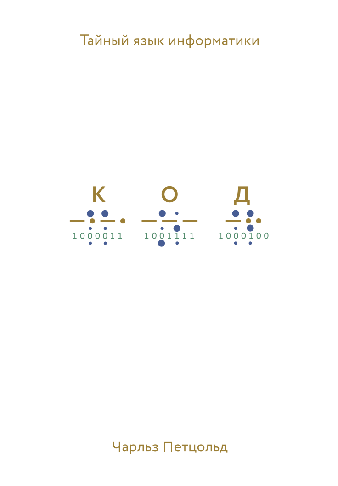
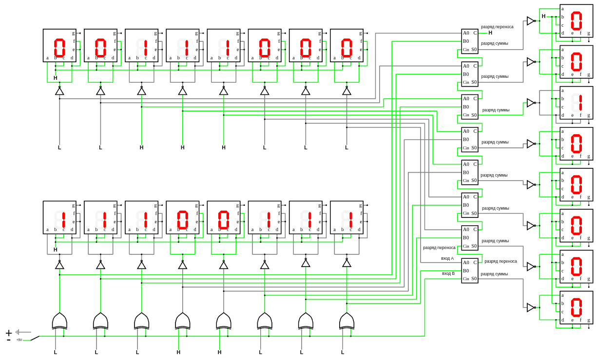
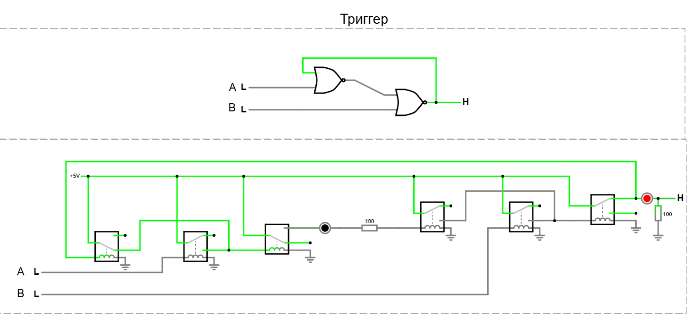
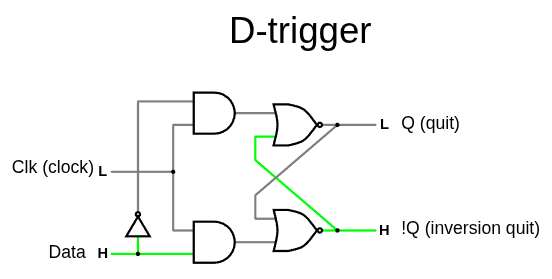
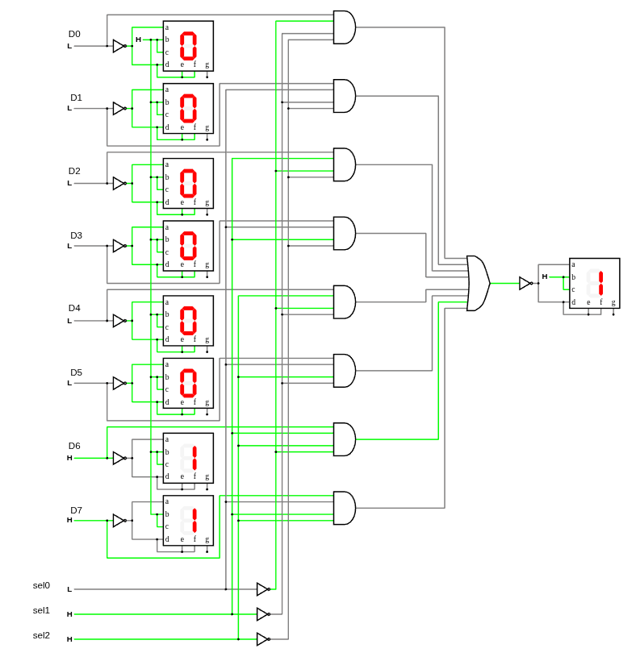
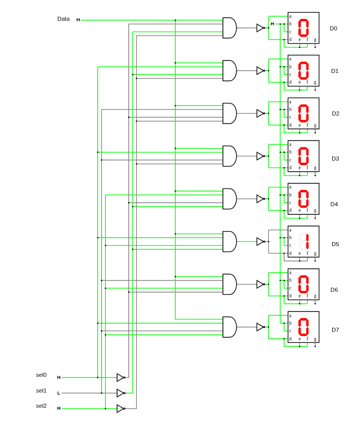
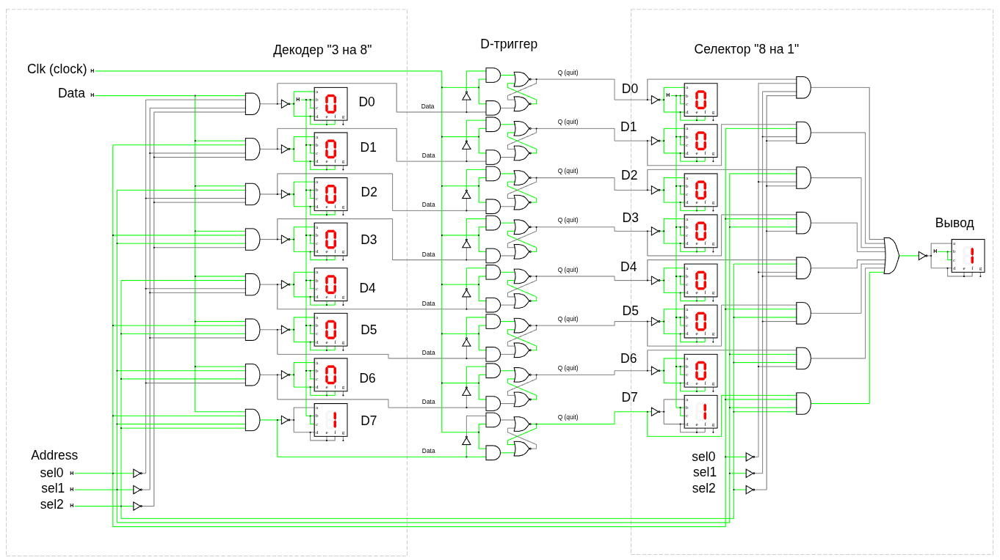
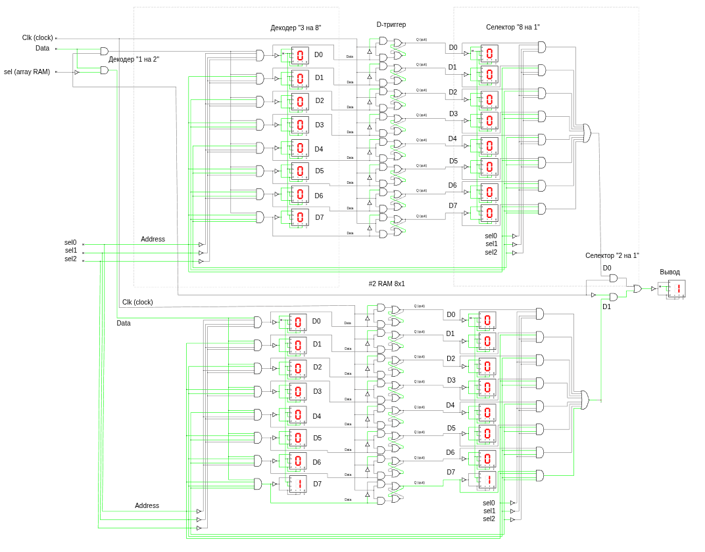

# Чарльз Петцольд. КОД тайный язык информатики



## Глава 10. Логика и переключатели

Явившись в зоомагазин, вы сказали продавцу: «Мне нужен стерилизованный (С) кот (М) белого (Б) или рыжего (Р) окраса; **или** стерилизованная кошка (Ж) любого окраса, кроме белого; или я возьму любую из имеющихся у вас черных кошек (Ч)», — и продавец составил такое выражение:

Каждый символ «×» соответствует месту схемы, где два переключателя (или две группы переключателей) соединены последовательно, каждый символ «+» — месту схемы, в котором два переключателя (или две группы переключателей) соединены параллельно.


`(М × С × (Б + Р)) + (Ж × С × (1 − Б)) + Ч`

или так

`(С × (М × (Б + Р)) + (Ж × (1 − Б))) + Ч`

* символ `+` соответсвует параллельному соединению т.е. `ИЛИ`
  * т.е. кошка/кот не может быть двух полов одновременно, поэтому или так или иначе т.е. **что-то одно**
* символ `x` соответсвует параллельному соединению т.е. `И`
  * т.е. кошка/кот может быть белая/черная/рыжая и **одновременно** женского/мужского пола, тут нет противоречий
* `1 − Б` означает - не белая, т.е. `НЕ`

Действительно, если вы просмотрите электрическую схему слева направо и сверху вниз, то столкнетесь с буквами в том же порядке (ну почти), в каком они представлены в выражении.


[Логика и переключатели (www.falstad.com/circuit)](https://www.falstad.com/circuit/circuitjs.html?ctz=CQAgjCAMB0l3BWcMBMcUHYMGZIA4UA2ATmIxAUgpABZsKBTAWjDACgB3WsQ2uCwlRr9IbAG7dewqrhp8qCvtUUwEbHigEyEmhIPkhNAEwYAzAIYBXADYAXJtYZHwUVzEjsATiFkGwGKRFkODYAZx80Hx1JKM0qCAtrUIY2AA8opGxsPB8MGRoIORQ5QHIQMPAAwwxNFDwczDjXROTy-15saLaqxqpmlK4u6Qr26NF0sBpiHzApnnaUTSK5QEIQTmHu9Zm41sqtwzrwYkaE8ySU8NqcniEecH14kD61y7uqF73RLnej-friqDWBV4eyBhn+YzB9BQxF4xSQ0KmSxAgDQQNJg+FgeE0IpgHJIwA4IGjsNjwDRMghZjQ8YY5IBEECJNHIxRy2EINQQhRpIHp6WJTImPkIUP8tC5gAIQNgAZV+G1Z9WqrhOZ1cKDWXQ6mmwkQ1AIuBwWclBBsVj1OLS4em0i1uOs+MRecpldtBe0th22Fv0rv0tsBt2uMQ+fth-yNB1EQA)

## Глава 11. Логические вентили

Логические вентили можно комбинировать для решения более сложных задач, например для выполнения простых арифметических операций.


[Логические вентили OR, AND, XOR (www.falstad.com/circuit)](https://www.falstad.com/circuit/circuitjs.html?ctz=CQAgjCAMB0l3BWcMBMcUHYMGZIA4UA2ATmIxAUgpABZsKBTAWjDACgAPEJwjYimkh4p+CGnlogUNEADkA8gBU2YDBKY1ihChm1NsCFDu3aIqKFFhIw8eJchG09ozERQ2Ac24GjhfN8MQQhoqULYAJW5NbQRdKK0KMBcLEOpQywQ2ACdvSBkEP1yZQmkLG0hPIqDS-Tyg1LCuHjx6bGx1QmwIbBoIGVKADXlwzm5eIxYSMew9MEJtfplh0eaZMB7ptexyRZAAQVkAERUS7jAaGSY8KhYLqIkjABMGADMAQwBXABsAFyYvhiPcAWUKwdhzCZgYhGc6XKEw6FSEDPd7fP4AoFmEFgk4TaRUGbqfG0OZIlGfX7-QHA9KucFqMY1WHcMRwu6mSxY1zWWxwZwUUEOeyQJAVVTqOiQu76QK3Yo06BcqzIXn8yj81wi9zi7goApnaWqWbshVKrXlWxqwUuWBaiqRYRsy6EfVykG0Kii7GZLxMVlnJIs6XXEGVGWQwPh7ghsK+o0ByFxK60tgAd0ZcMjLtmgYq6Y02AjExowQT7nzepzeLw6lYLjYABkxq66829IX3e8vgBnBhpRtRUssSMly4d9Jd3v9ptMFA1suz+f6ZJUSd90VsACyBrhc+4CRYe6oKGgmRybsPteD6XKYeZGivY5XESiHYvo537tSXtBmQdlc-RdHy-T13RgTJ839S8WUjJIJDzGDIT3P1YMRBCUMhRFlxueFy28JwWCwwscKPNN8JI9QfDOUj82Is4sPvXD0MYhjDRos4kzgwCuPQlBSgPXCEgqONEVwwjHH8MJz0E2ZRLuKhb23cSQAEu4hKkU8B30GZwEjNpTDQiw12ne4FJHEMmKMt4e3XdwZxKNYs1KSzV2sqcN1oupW200xczIjRxF04sLL8yDRKcxz619PjIt1Zz5PcX1CSC7xCAkZlY0QlKMPABL0NwGQQ1qGQhP85KDwKlTtHQi4JCK2qqrwnKDwa0qHQQREiuCKgYxSUDaU0nVipAIqYpGqgORgM0eVVVwjHVObhQ3IaGqK5KQ0mxVsXNXlrQFDVbWWhk-U6m4EEDDbTW2mbLUWhbYBtNwKiU4k6OUujj006LUl6PRiUlUNz1egjXrSso4DKpw3uBsIZznCQqKA2hx2BYyNxnWJtERzHkeSCA0aaujEfhkAqPQ-1sbiMmw1+0nZVp5LMoChH6cCxn3Hau43pxj6+rSb1-Ia-SolJSqarZuoNFFnSxWOomCIZpxNrMWBSDV9X1YwFB6G5FVboe-bFs1awVGOimFbZpWrtcDXbdILWdeVC07DuvbjfALToiCfwTt8SSrJs-sIQCebCmGgpj2RV4KXRakuXsdglMqiPdX1FPPsyHViVbOjW2V+w7dth37Bul2DfuoV3fpBG8Fij88+t1XC817WS71suhQrx7zRfbPA1w1t0m-MDNPTXO93aNZ2MnlKZ54sj673Qx0tIrxc65px40y+u7nruIwnTbO7jQdL5LIueucCDKBxP3L+n8MaFJAAmKibKjmSox-Ubc2znpALWepUF0HVdIJ5M6nHGONf+TgQxPGjmiKkmIR6QHYF4ABd9oEKUKFJTBUD0EZRVC+ZejViEoyoMPAaPogha3AHuSBcwUw6mIQkSBLCFQ2mkHgDABQUBgDwMQEUFxKCOx2rNA2TgjaHQ9lwKEEAxBSA6joSQpRZAHGOOmYhw4jBey0XhYWLA4iaK3ufHSuj9HGLHpLHOpjB4vlptBGe0Eh79QFm-Wu+4sbuMmGUZ+P8TJiQSGJUkT8X4L1JEwBIjjSqHxqIErCpUvA6ISDo0smVKoRKxpLVJHMpBMj3EEo8fMfwZFNhIexXEdFcXzjbZuati662dnyV2B03DV1ybuBGVi6GN0gLUuprcGm7StC0nuMi8CyWPNgfgLAuHKJkAoEYTCw7MgwFYk0KsOHRC4fwlB2xcCQFSU7IZi0JEGyrpUVZmYjCXOjCmSIKc3QPNvs4-mv5sj-1lAwj5Ex1K3jQbKBI3CJi9TFKcG5kwgGfMKHA1ElIMQ0m2onb5ZxCjXBwtgjSEEKDIVbA82xGicWGJxX5LOqQqLCyovnbAioxAHK1qoPZcxiDMCSI9UuTTy5uykbLMppZyVg0pT0vp9sBlHLEZ3LlrSTFYx0slRm0rSYCoFTLXuZLAi3zJkUkeVCKXuOFiEFMa8BV6rBga0Mh8yXuI1e4hCH4Z5exnq-KQ-gZ63w-BOPx6NaCRPcV7d139A4eVoHywIFNAgVByGG+au8mmEK8P6BqCaQW4gEDIM1CbAowpjoghFgp2AyJwFIcZUgaCOH4XMkAAwFmlOMKTJw6C6KbU2eMyAuBeDEA6lgJI5BBniokiMk2aCoaBAbTanJPMnA40wCuD0rySk5GAaTOoi72Z-P-kqiQK6x2guuVDZdAq6hZoQfC+OdItzrs6YVUWdQM5kSjbW6mYB1TeK4oEwpyRMjbjfafKe8FMVaVJPeUsBD8aersii7KwHcwBvctqKF1EJACXfRYT9jVoKMXfZpGc4SgNOh8aE7DVYxhXPw2BioAAjMY85APQuwWwSjXzwlpWmbwjcX7wowjyGZZIYCBzjN-SNQDhTQOBvA-xxqeBSS-N8aJsU50RpQaMKQGE0GP3nuUwh5AqQnH-qbDWHCdwWhShkCEsjfGiqtiM2WUzsn1OeLWFzMdvGZwdjNTwNNsbXK2Zc0YZK7nFV-pE7Bij4BCgpNmXqfgIXGOmHwPQWcT73AMehfqGw7jEvRbC4E-A-R9SZfIQeNK2h6VwafKTdxPqTNIg+AAOxRAASxq9STOCB6D6c0xpnTRhasNaa0CTIABJfC3tEMmH9uBCgdmRu0IkH4P9znhtzeI9Nj1tmgA)


**AND** в логике и программировании означает И (логическое умножение или конъюнкция). Это логическая операция, которая выдает истину (True), только если оба операнда истинны. Если хотя бы один из операндов ложен, то результат — ложь.

|AND| 0 | 1 |
|:--|:--|:--|
| 0 | 0 | 0 |
| 1 | 0 | 1 |

**OR** Это логическая операция, которая выдает истину (True), если хотя бы один из операндов истинен.

|OR | 0 | 1 |
|:--|:--|:--|
| 0 | 0 | 1 |
| 1 | 1 | 1 |

**XOR** (от англ. Exclusive OR/Исключающее ИЛИ). Это логическая операция, которая выдает истину (True), если только один из операндов истинен, и ложь (False), если оба операнда одинаковы (оба истинны или оба ложны).

|XOR| 0 | 1 |
|:--|:--|:--|
| 0 | 0 | 1 |
| 1 | 1 | 0 |


**NOT** (Инвертор) Инвертирует входное значение. Истина становится Ложью, и наоборот.

0 -> NOT -> 1

1 -> NOT -> 0

**NAND** (Not-AND/И-НЕ) Противоположность AND. Выдает Ложь, только если оба входа Истинны. Т.е. сперва применяется операция AND и к результату ее применяется операция NOT: 1 AND 1 = 1 NOT = 0

|NAND| 0 | 1 |
|:-- |:--|:--|
| 0  | 1 | 1 |
| 1  | 1 | 0 |


**NOR** (Not-OR/ИЛИ-НЕ) Противоположность OR. Выдает Истину, только если оба входа Ложны. Т.е. сперва применяется операция OR и к результату ее применяется операция NOT: 0 OR 0 = 0 NOT = 1

|NOR| 0 | 1 |
|:--|:--|:--|
| 0 | 1 | 0 |
| 1 | 0 | 0 |

**XNOR** (Exclusive-NOR/Исключающее ИЛИ-НЕ). Противоположность XOR. Выдает Истину, если оба входа одинаковы (оба Ложны или оба Истинны).

|XNOR| 0 | 1 |
|:-- |:--|:--|
| 0  | 1 | 0 |
| 1  | 0 | 1 |


## Глава 12. Двоичный сумматор

При сложении двух двоичных чисел получается бит суммы который представлен как **NOR** (Not-OR/ИЛИ-НЕ) и бит переноса который представлен как **AND**. Поэтому можно комбинировать вентили И и Искл-ИЛИ для сложения двух двоичных цифр A и B.


[схема полусумматора и полного сумматора (www.falstad.com/circuit)](https://www.falstad.com/circuit/circuitjs.html?ctz=CQAgjCAMB0l3BWcAOZ0AsBOAbJyAmAZm3UPUkxAUipFKoFMBaMMAKDGpCfWXE3x0+YAVBCCaCDgnTde4MIPmsJ4sVIDucvvkh8myGrr6Q2Wg0b3dD4fCbPWai-Tlv3zJEK6aewAdmwoBx5hAO5fMNMPWW9XV1MAGW44wJZ0GMCnEAAzAEMAGwBnBlpE5MDnbjB0tzEaPKKSpFMAWSEFQRsVMXxoKTblUS7RIz62AA9ufDBAzEoWbD9wAjpwQMAmEEBREEA+EEAWEAAdQoBBCanOcEJBBYrCJFkZkC29w4AhU7A4BVldJFYl+8CgAEQQAMIIB2EEBgHkQA6FQCCIIBhEEAPCAIwDSIKc5vxAvh8L90QCQCDwVDDoB+EEArCCA0mAXhBtjDgRxMEgmK5LjQQiAWUFJkxdEtLrIWAg+Jd-mtHjtoScucZ2QhUpxKLdKHintC3pMsOyseAZJq7qKCZDofCkajJghBLd7n4hQgRQ8DUTCmSKdTaWwkkzAhy0rIOVkGsVSu7yjKrtVfeaxBAA00gm0aBzLpqaKN+mJbhaLZHU2wAEZTfCyTxEL3o0z57mF8TkcTEdll05MpSBPw0DXfWSAfBBtoBuEDhxoRwMAQiDbQH0u5dOxUKeVUwiJC22aBbBV+LB3hOKekQSz8A5AqB5rrrrYNtJmYpvcxoNJRdeQLb+9R-eNINtRaCVzWjI9MacQQfuANR+JG4Y9OoDh3heICAdBpiTIYECYHweAVJAEB4g6RqIiipyGDu6BIAIwjyJhYKGiS5JUjSdKTMQvyEIQdDVBcD6iiqhySuyvjYBhYBMTMsjKuKrynPgeBeEqDwfEo+rkY6zrUW6bQgQRsjfkBsg5iIgSykYfiCHe+AGWo7DvrK4gmdgqCWaovRSLep7snWCCKM5mRXgesbwXQ6CYiBdAMpZfDCc8xynOkQoUIFvJuaFqqnIQfhMYxIXomQGFyYS0KKa6tEgK2EBkDQhhevQZHZYcA6mgVkDfH4sjIIQ+l2kC8k5VReVsOZXp1tZQp1jmjn6YZbnGao9ReTeVBOc1siuRadXPteR75oWRg1gySDYEx5bVkYhCUAypb2Oq1l0MuuCBasVbdj2lLIoAnCBVThw6jo2lxMSBqTGV9CBKtWIBHAAcgAIh9WoblMrZCExHYgAAGgA8gASsE8jeJ4a7mMoU4WLUc7WpqME2d0-VAXuMAYdA+C8YQyC4PThHYP9zAsTAkC-PA8BQLAhkpnzvOIEE-guMuNkLCTJGU9AEAc3MCuK4rBm7bAXPcwLKxcBzEiwJz4DBA8gFJuTpgAOZVMuFk0CzHnmx0MEWZUtt1GwFs+PNYQe1QIxBO7rh3p6PsTcEAdOd75ruCGkfhPNTmE0Khk1BHNQVLz1O0-xDOYEzsqs2kQvq9zQv8yXQv6wnVSiDI-IB6nMty7ASvN3MKuF8sGtl9rgsc-r7BaCbVaVkWVZRMTd6D1pDhgbBYSAWPZMmTPJn22BBlOE56+uwATppMFL8BuhRnAYn0IsXpXYsAP2u1lEujR3XgHPJlYkWK-iGMA8AVWJvW6HVtylEC7MeLBq5exEABP+XI+RUCJtyAKgpMoPA4uFD0EDYE-Qsnef0U0jwelfjBIe2JlyjzECtTk3BPqEJ+g1Qh18NgiUKGqfaVB0C8kIlQLgFUKKwhwqiNo3Qa7iCrEInMFtBGiDAv9EOu9BE1AkaoD4Y8kxCLkVPFGVck78gIaIsQNZmh1DGBooO5MWBTlNnoyQdReZSArIxB88hDoAUgEsPaTB7EwSsIdGgfhaE+SbHQZqtVAlw0Bndfsr0Rxjg0YBAIfASA+POpefR1iYBSA0XeFc81U6kLbFYy8aSHCGBtlWVAJSp67zKYQxqNh54dzdiAKpgFMBuTqWUIRrZ5puU6ctXBQRbxzywa062ZC+lj0yVgsIyVMgOFiS5KZg0imfB6cUgqizd4tMEKpLwblVlOBPhbTZjTPjEWOQUopNhtlHO2WPa5kZMDAWzEsm2FlVk9LHm8paHSlqV0yVWQCWSYIN0aXzBk1oWYuOQFgMAyBmAmDVh3YuOsqCa11sLSuqzAU9MBWnKmQsW7IBhTMBAspVZ9w1qilFZde6-FmVZKw2KaxjwBTWbFVh7YAosgC9+9tsUWWxTyhpVTpmNK-INP2BVIwiriWsu2DhtnbLeUkjgRNYnnQVedFijcIBoAIGChm1BvwtNhQYduSikWC27isGlIsiZKr4MKzV9x074uboSwlLNSVmopV3SlNr2AaJUDbUmeh4k2WSfkwx6TlgiJqHMLR1iUkFM-rYeQqjLh8FEWwWRGbWH3FzdI4+q8C2SOIJIX2rQLhTlUekSQNQhoxs9rpNy2DPKviPFoGSTbG2OxmZ2xQLy0L-L-p2ws8SqyKHkMA7NrEbZLzLQVI++zi2byPvxKZS6gidtzbBBd89p57vnUAle08x0YNTeOqeo6p2riAaPFVwgCDZPuAOvNQLtWupbsrIg3rO7IqtWivuD6L1vtYJGIRuLZauqwNaEQvidJkHheSv9lq-V61pf2o+McwOGXjtPV9ekFDganKvAjYQg3B1duI-856cOUZTA0-i5inZkCLCM1euhB22CNux09nxYJntNsBij5MB3Bulh++WX7v1kqLjzf9aHhbsFFiB0TO7SbOrxVJmDhLMDwZwIh39FqtaKaA1oJpt7v5Xu1EtKFwhqCNSTAvU8PioVrE+HZrd7mfGgRcwVNzphA3mh8zuYLi6Cl0EjQLKQ4jeAOvPGwzoTmJWcDc9szg6rsxBEDbxZcS9cswSZZY0oUbhNhfS2FpqAFgW93gIxRiWIfgCHg4QRuyHjOl2RTayuMwjb5YeNsyDbW5grj8DgQUkBcs4C0gi818nUPUvQwbSYMKVyNN8SgZCjSbDw1Rg4B56lQJxclRIA9x7Qtuf3Z2vzGkZieA0pWu76k3P+CmQFj+UgVtja2QzfgML-P0PxLfJ0nUH6doc405QfnPM+WqAgJiMh7OCk4UgtqlVeEmlOAtVhy56asMB1hO+Sl8rpCtkqIK2A1vxU4hFNhtUhJfhcasZBjC3j5ggSVVw1RbgwXOHtaoVgGZCVpii3apxrQOr8h3QIUKAZVl2OsYEJJewRKRG9EEaI9O+RfVt9IIpbq9ges9DHg4ol5n4HWI56B+IXSPEAA)

Существует причина, по которой эта схема называется полусумматором. Разумеется, она складывает две двоичные цифры и выдает бит суммы и бит переноса. Однако длина подавляющего большинства двоичных чисел превышает один бит. То, что полусумматор не может сделать, так это прибавить возможный бит переноса, получившийся в результате предыдущей операции сложения. Представьте, что складываем два двоичных числа.

```
 1111
+
 1111
-----
11110
```

Мы можем использовать полусумматор только для сложения цифр в правом крайнем столбце: 1 плюс 1 равно 0, 1 переносится. В случае со вторым столбцом справа нам, по сути, нужно сложить три двоичные цифры из-за переноса. И это касается всех остальных столбцов. Каждая последующая операция сложения двух двоичных цифр может включать бит переноса из предыдущего столбца.

Для сложения трех двоичных цифр понадобятся два полусумматора и вентиль ИЛИ, соединенные следующим образом.


В следующей таблице представлены все возможные комбинации входов для полного сумматора и результирующие выходы.

| Вход A | Вход B | Вход для переноса | Выход для суммы | Выход для переноса |
|:------:|:------:|:-----------------:|:----------------:|:------------------:|
| 0 | 0 | 0 | 0 | 0 |
| 0 | 1 | 0 | 1 | 0 |
| 1 | 0 | 0 | 1 | 0 |
| 1 | 1 | 0 | 0 | 1 |
| 0 | 0 | 1 | 1 | 0 |
| 0 | 1 | 1 | 0 | 1 |
| 1 | 0 | 1 | 0 | 1 |
| 1 | 1 | 1 | 1 | 1 |

 
Для создания сумматора потребуются 144 реле. Вот как я это понял: для каждого вентиля И, ИЛИ и И-НЕ требуются по два реле. Таким образом, вентиль Искл-ИЛИ состоит из шести реле. Полусумматор — это вентиль Искл-ИЛИ и вентиль И, поэтому для его создания необходимы восемь реле. Каждый полный сумматор — два полусумматора и вентиль ИЛИ, то есть 18 реле. 

Нам нужны восемь полных сумматоров для создания 8-битной машины, или 144 реле.

Пример: `5 (0101) + 6 (0110) = 11 (1011)`

```
 0101
+
 0110
_____
 1011

```

**8-ми битный сумматор на реле**


[8-ми битный сумматор сложения на реле (www.falstad.com/circuit)](https://www.falstad.com/circuit/circuitjs.html?ctz=CQAgjCAMB0mQrCAzADgEzQOwDY33WACxICcJk2hIJitkI8ApgLRhgBQARuCUttWDQhCYJMOyJI7AB7USmYYSpsSKRQqpoqgfBBAfCCBuEEC8IIGkQQJwgAHQDOgQRBAwiCAeEHuAGEEBCILsACIDJCYUalIX4wOH5-EmEQLRBAFhBAJhAnK0B+EANbO0dXDycucEJIP0phNH54SDEpbjASNHoUEkDiRGwwSS8lREwS4RIqdv5lfhjAURBdKKsAIRbCBsnOqko1PpBB4asAQS94QQYAkGxULbCF9ydAdhB3QHkQEcsEwFYQd2vDXWtM2SJ4MQ3A+HwGCvCwfiOpwuVlS9mM7AA7uBilR-Gp-nAQHCoF5-ig2igxGAUGxvCheuAASdzpcbncHk9IYTET4+vlaSioaJKjtMEImv5WUIpFCut14OzCL5vAKUS98UIUJgFNjVEiUPRNFQAPIAJXYYB8hP+XO1-EwosCUGgEBgcHN-2wVtQvkImBI2LQhWNCHA5vNLqExU9LtdUk18IF9AN7KDSKQQiNMFNsHdlutvn89sdzrNiCC7voZq9Wdg3NjzVVet1-x1lCzUGE9EklZg8HYAHNoZyQ9DsGpW1nG9lhZjBWzw9yUUWmlURaGx2yK4rq7XjfWmdgaaKEcHOTzqWu+ojkRumpBYULoQfB4z5fRcFQyJHIv6tYIj+34RG1E-suBjTHM6QyJjVBQRC+dpJFgdNM1zSAcx9M0-Q1e9BAvYUEMQ+FlE-EBWGgcsRDtJADyFbBVEwFhCn4NM3UzH1vWzX1miZKoLwHB9X2FKQm2QnZ4ECNAyy42tu1ENBXz40QlE4siUXY0cGBwcBpPgFkuyksd4FktgVMUs91OrJc5NFAU1D3BCGCEvSvV0u94S0NR4DEth9LEqMTV9c0f1UUgFUoJpVL9UCKPdKiIPzOBmgDN1Ils5RjMinYP2jDCwCwnIcMwPClHxIiSKtF0wMomjqLzWitOsnZImvUqqD3ErVO4x9bypURdOwJjSEjAc9xfEs+EY7kBO67wx1EWSp34gAncB+ua9l+pG+gMwakrL3ARa+KMscJECSDZlWhqtpkzbIg2ySJtMhTpt0s6xpOmy7M6y65rgBajxiwSbsq9gRz2mLypiiscgYOc6w+uT1qQ3IWMMyt-prXN6zChVg3bc9vCRog4ucxLiGxWUhS6GoqiYZg5XIjMAvyoKiss3UcA7UUaffGMIEStFMU1GgKBKJQWDIHL-I9cnoILM9W1bBGUcM7sRb4cXvGlpTkdSkJalliS2O8E8jvaWZ2uOqbxN1PWuyhPXy3V2ZcjPE2La1nZ-qpsWlptpanKZ6AsZxGpcdxgnucMvzSf5wqCsgym4Js2TnYHZ30ddlmkDZ4olyQLmibCEnwMCwWQrPB2+Id1iqQdIRWz5ccc4VMui7LtWq7Fyo-ERLtxqrkvNjFh6N3zhvgzlqk9cV-aVbPGr9ZHge1d8HqBDaocpHGyeKuRw2KKpB3IgXpapCLEelpizeodnadoHrIt+6R036b+w-a2PqknSoAyIgtx+pAAGWoIo7M-yrKwAMwAQwADaWEYADf0qkIiREIMrPAvRlbBn4u-KoNlTKaiKKZOaIAAHANAXRSBVBoGBF0oQs898GAsgROQ3qi5qxf2rIpBqxDlaUN+nfYUS0IwXnqlCISr5IhkM3nfCKLIBHcPwQwXSZCX7sAAJIfy2NuBRN9aCyPkfTShl95wMCEd0TkZDOw6KRDqMhu42F+CPCYo8G5eFIiPJw2xEsaEDTmrpS+jDEbwl0jiMihjvHUiMT4nhkQRoaLHG-J+tN2TDVFJg7BICwEaggfoscsDnGVgUF2d+yt1H6iRhWOJuDSHBNFMg6uhdv7yKOhuHefFlZVPKTLOpBdeT8DfF3FEciKhIxilUCMSjYbaJ4ZAZWXF6BVBGRgu+wyigiOmYvaxlClrjNaWIniTV+EVBvO9IZfSSG9K9GJaxJQDmaGOVQ0hczLr7POUc5WeyzkkPCcg6spkqjPQwR+ApCSmgKGWZ0fgPFTKPO8PxIZEy1DPJMo466SiulvS0laXRdICGN0YfkHIio7mosXEeZgpSSF4otnuOY4A1IksJdC0QmxmD5AqKKGl2yIn0GYBXKo+QWVdh+UyhKmweLUvUukxBT92WsrORyysEAvl4MhawXlkAdSyuody1gAL5X8BVRchV+QqgKp1Ec3VcqtWMp4l-CIaDCSkKIAsSFeqpkVw1TawJyqLG5GZRXKQnSaBCAZU-I1yjBlImqFuQNOcXFBpDdU4hDdhDQvtfkCuVi7XZGUBQw57B34V0oWGucUqURctKQKrQc1NgIMyTwQUiirUSqwUA+J0qLYCqrQKo5EKG1iVKXuOhyaIlaTspsJtFk74DiLcgE8I7rHDv+qU8dSbp0WxnUM+EskC1prkZm3SA6j4qLXcy2lYkfUDIXD25gLq1DipbQlVVnjSFMSvRaid7J+BpXvQ1fdjb935E7VQH1VaNUXo1b+21i6eUVpAyid+myMLrrdRWSVtbCngN+RbRVER-oodLeBkNB6MKfr-vBhJwHxWQfPcDI6izIhZoPmA5RwNRkWsfnqqjMN5xUgZDqfECw55IlpSEfIuH5pNg47bJEdSf6RsVDZDdkzjYiVOlJ6FDIK5scmfPZhYkaiBE0gJkTmmhBV0g0bbjyh1NqcZRp7t9du0bgZEeRTnKtR0d4kQ2KjMb6ugDo3IOFMYKhS1Gx1pSFWkxzc7lMmXms6wRkxJN8fSNxHT6W+eWR1Hx8Vw2rN8j52Fie7EJwQfhM0fLVgPPLZcSuGeK2Jfz9nhJEJ7rVhm6EIKhcDiHYOwVYJhSq0Z-xaNXNNb5p51r3mhZbzkieTNkABzuqY4DW+n1kP5HkOqtLVZqOwwWn0n98dvWfvYONKlO3lDbcvRKx67FjsAeTt+xje44Bnr6RmeYlKggEPhHdmNxUHvcV2RLfbV3hOiSikObTgOQYTQ3SWrSx3aX-d20yWHR2I6MsEJth7aAvufcfdQMleb7zvZ-S9nDsxgswXNNAsgBo4APjIEgA0vMPMUza6HMKKPDtyWlj6l2Lk4BuT-J5QCXEMn+wzgLGiPmtKE6I41DCiamSS6PGwDn7qBKS4e5Lm7KuOdq45xr87mwFedSscdNgnIFcMQ+4Zk3sxlDo8lNVsbsJi2ckzWheKpO4Dk-kMUeVWgaepXpyL8LYuRth2Wn0zNx2Xck9jK5Mg7l-xeS+Hk4XeUg+FXF53Hj2PnOduFCOogeexEcmUGpfASpLdl+7cX0lPiRwwir-X5tM2t0CTtEIMhrwAW3mN1xVCygviga7COJcF5tz0Fi83mjLPG92XrwI6PmZ4y7ETLgJc0C5Yp7C0NiLvnPGIh44iKtXP3dqqtMv3wq+Dy8DIpvlrUFg-ZykOKbYhQwjYnQBEAcSoQBqkLqguybeVmDUtOrS-e58yOle5q-wCuskT+hItK6IpK5A4AwohwxIwIVwtw9wjwmQTIQoEK-01eM6LwxACgRMoYhA3qNQfwRIQIlwoI4IsgBKuApU3qCkNBIAgIJIiQWBFIzwBQYQtOwgWo-0CwSwlwawTBaAYQNAwhagcoYhQwlw4w5Q5AmgSEIgYQGSWQzI7efEIgzKQQzQsg0o7eewZAYyIg4QkQsQ8QVwyQoI6QRwXgqgEAKqUUH+KqEA3+egRgZgIIDgzgbgngqhY4z6pAZBRApQu0yGuyyszAsWVIBKcRvQqK7EX0skj8I8hmzB+h8RHaMRZ6yW8R9SoRzK9iERGEOA2hsgrhVRSEjo9RiAPhBgJgFgNggRThXgphGEqA-AFhvRmI1hVAthiQDhnRwRmQ5QrUvRSMBhVR0hKIqhJ4CR0sRAvwNKmoYoAhGEAoBwWozAAoBIOo4hYwLQixhxUochuxpuFqpxlgkh-yOG+IrBzxYgaBdBPB5IOBqIpBVROoTQlB-x7xFqXBGBDBr6woCRnI1e0J70LwiKMupASBzKxAxxtB3BmB3xlITIleJ6Cu5K6UUOskhxG6veuxg6vIpkJ6LuA4NJXYz+6qSAXwKBnhzJQg3+v+LOI+FJYaqJFcx+MeVOZ+5+SYDo6AqYt+g29+6eIe0+KxQoc09eJ6++C+cYIpNoYpjopQUpjOw2j+wMq4vJm4uxmkM4a2LG7E5J9J0I9Kip-E7EgBKpc0kw6qGK-EdeCpmaypGws8q2zGQMuJnINpsJRJe4eJRJsJqAyO+BgxxmUJ7pme36S48hJJKZuOVkm2L0F2L0ruzkJ+vOHkAE3kwEAeqe2+D+HW8EKxL02I36uZapZOcelOPu5OtOOp7mgeFZspBpcuwZjmtuuxaaUk-Zak5uhxsBxuOZaknUE5qsmuy2Ik0uDK04KuKxZGkupslum5TEy5NsRkKxNsiuy27UoerOzx8Iy5b4gp34cefOxZQEZZW+MpIcGeZ5+Ob4bA657CjZHuzZ3u1OvA-u6c5ZL57WeC55NKFsS2OGRKG2O2smm26ZHU+6jmIBxpHU1KaFqFg652qF-a-UhxkOXGoOpJc0-2RFwOj09ESFDag5c5EuNZak+O2RhROGIkLFsBfU1KpspFW5KIf2PFSEF2-F80NFO2wlQlEs82RRwoMFNKrEk+62I4kuL0k2bBhySlLGnWwZAQsI7KelDWbuT5d+DA+pVZNWMu9IHOhlvWjWJl0pZlO+wsNlSmulu2TYA8J62Sdp8Cx0Qm3lIQ9qwK6WUJO8YVFkusfEDFR0ZFoK+shxLIb4NKYisVzsYVDCOlyZFsyV6Zx+DlepzlVMdGUFllpVLm9lIFz5TllZeCDIDF9VrCUI5mNplmNpSZMuFcLV9pE88RxAem1K-VV03VXVfVE+YleI9ZlWul8Cfc0VJCJVjyVIJVI8i1s1gm7KdGLVdGTc3W5VAVO1K8UI9V6ZAVyFtGuk5Vj85VV8FpQMp881fGkQJ6K20Ms2R6pSzAR5LIX1J44ScailClkM9AuaiGx6A8I6X1csIKZaxGR5l1+5ny+G9aZ6FW3648SaK53aWNX6F52NW5r66NaxH6zSn+O2Fsz6N1Q65NraRRcFhGpsn151DNw6yG+5qiANfeeNh6HNqJe636hlPNhGRJn1PVmNIgd6cJN63q0Zx6stD6cZo6368thNux-a+6gtqtL1xmAtQGx6Et2NBt-6vp2NJt4SxG9plC7VSNOC3ySSyGJtkNZtMNmGwVuG2tOayNFyZ6ltP1YtzVu6vYzKrFUIK1sk9qIdWGhlEdaaAdQ5SK8dHSPA9Kb4Oqy2ildYAaMqesMq7Ni6u6U6rqsF0KJq2VtNu69NZqH6865qVNQyCqENaq3NUyWqeeTdONdqBdYy7dBN+dVR0sad-dPiSCAEVRY6YqiNcGttoU9t9qENAqUNEkGS3tzKNsbK6Nf1wBUlydEllKhJBJuKfYCKh9KRUGiRUIBKgg6K8RR9t2yGV9BC8RD9Sx5azKlmlRrAtOxh1AOICUpAgQjRn9vAwxIAvhbRARaQwR3RdJZAV4yBqc3hqG0QcQYx+gKQExGQOhMxRMsk8xn9QhZQPAKxpc6xYQrATo39lBZDiuGgBxiuBCdxShZxUh1DdK1xsqLIihywDxLQT90hswToCU0hiDOoYJpIvBPxJBQhn9FGtk3qgkIjGJ4JgR4IeBUJ5UsJ5UcBlo12B4Mo9ohh+EHBYjXx2BOJzYujIk5KRhTqQ06qbAqM1pDj0KbVQQGhdJbjEsjJGEtQWIvg3qtQioSDXJ94PJsqqMYTnjFVbuQpp+CYtoyYEpN+nZoFNVPZFlx4ujSEypj20T+ZsTS+mpdo4p6OBVmctVw4Jp4Te+hh5ut1AZt8VpSMrA4Mtp8jrT8sRAHj72neCU72Q+mTfT2TKx2kc4b1LeQZWTgYwZNjWkeJszmjDCajZ6GjsZLTldAVggOo8lWzPiLO9F9k00-K0kdlMTt5v4RZiePkIEKT1VTOb5LO6uJzdZPKK4eZX47onuLZgF7ZZTou6TEFLz1TYe8j0kasVuPKMJ45ELnTF2ELr0kL2WUkOuhQUUKLRu4L6uqLDuQjGLDUWLmay5B2jF12x2x5Qjyu+zm2ggzCRL0hQWfWsThZCeAuQutzpl9zcpeO999LOL5DdSv5V+FOAFvuQFHZzWjlnLvZILQj2zJJuzmOQjtKBzayUOb6aIE08rGrmFoLqMFFzjU56rg0hFozu1pFBr5rxkHc8Fsr32oL64+LIzLzuTsqDrTI+Oz9LrML3F8jJU5rJUZrcLvLxL5DRuE1kFNLgQQbs1MlQjysOzvL9T71hpTzK46lrzfp4zU+fmMz6bmz6bpz+Zfzaer5XLZVQQA4XlFbgoJOxb3Zpb0rVbrT9V1bx0VbhOrYsqf1-l7KX5sI9qfbDpOwUJELyVBrSW0Vo7k72rlsk75uY7g5cWc7CWI7dToeLbqrC7ZYtbVVHL5lu+EitTTmtreTpodbYFocx1MzLzLbYLq8T9rTrjHTq8vbrTLVUTvV9jB49AVcLTdsAlOmQzfgD7-7E1t7dM17m9UWPKJ4JVg74miLh7MH70G112Gr77M7XGmzqrmzM7YHMzOHvbqro2cHqr11CrSbLeD1X7Ucz1rblHNGhGxLxGxL-1tTfl-LqsNa09eas9f97aaGoOGG5tP1zHl1rHNtda3t-HOtMn0nobXNCnva12wbb6AbWtoOgGib1NJ7lNFHOn5DxiPLetn1zEx6+nTHQk3dZ6rHvNcbdQKnflmd9YO6fTTEb66bQt5nCAktH7mNQQ-CyGWjBn5Un1wXPCMDLIlN4X2NozgGnnGnBbHnqy99e08XKXNnxkgGVr6a5aQH-iLTilU9UnYNpnxkkNprLtbHbnQ4LTOsINXt-6UTLHz7cdnHWG3rod4nLzA7LznchjU2hhd7bXhzk1GbSddKvrMC7dkb-qH1Rd5DoqA7x2LatTp6R7TqpdJ7MqFnVdKnxitdu3g9n97aM32n9d9jvLx3Znq3uLrauq6nfdJ3pyuq-2Tyo9n9cq1LK3knCGiSSGy37aC9QnVXndf9cqvbK3W9U3mm9Ks3xKuKCz1jSgluyPohT9KPx992bwMyMtOPWPvRGr0B2Pvc8O1KycDaXqvROQJdC3ycgX7K9P70+adPrpZq5PbPwnuX691PgXqOlBP8xXf3T3ycfEx3ovm3dP-U4v-U+qTJNPvqTJsvLd8vYv7dFPJdv6SAnUPEJJ2v0me3vROvUvBvMq2vkiJvtP9q2vsy1vAvE3VPCRCv4vCvXn1v2L9VEYcOWG8czu5R2LCHCRvL7vs1bXGvPv53ct5uxGnCZa1vfXhP64eGPHpXsRg5kNEYE+y9InMt0fl1sf1aoNmNmfoGQf59ct0uWv0uuNCRzr+68cpP2NJfTffXBn8cJ4lN7fxqdJXfFfUHFfA9sRhO-68cSMn1BfHqPvdfytCfzndnTvbaytrvWi8392Mx4-9vI-0vsRnUCtqxryO-pvPfnUnfu-WtEvTfrv5-CvWvyvhG5vLpytd-ctbPWvnPuXMf9vVtTPhfjX-3L-YvNDBfy54Zpyiy-BfsDW44ldi+X-H6j-1GyxVfeAjGfkn3NINMT4SHffigjX6FZ-SybK9k-1MgBV9ev2PaiQLIFWdTsE8RnpQJaovhVyXXf3iMnz7Ec5qTJMjiwL1qe8PewZCMLalUzsCdw8ReODEhXiCZhB0kX9iINngvtla5uOgWu2arCDzcbVCfqxl4G8tuBu2MKCVXIGIDOo+VXdpK33YZkxuWA4djgNfA7tdS5TAFrOyV6OQoS2vEtGwKN6bBkq2vYcglQjB1Joq9Aodh4N5aBDps1AuQexnd664h4QfHUJ2z4HzljqWuc3J71b5hREBN7LXHX2sHstjBRVddrwJ66M9MhfWc9mkwbawQVKKxL3soHTZB9Xq18ZShRHuwK95K4fBjutnErU8G0F2VoXtgmgc8uh5PWXmIL6Ey1+opFB-vFRdba9mKafUPnyx8GbRZhtjeiuQMgoLCAO4wygZsPGpnYJo9fQco1H94T4dWvRLYRRX8EoU5BEePXpQKqio50Kaws-h0PMEtCz+LOfHOH0HYQDT23OIVl7ipyitac0wIwYVQqZUw1hN-ZcuHxvLuhmW-ObyM1BKFStIs8wr-lCJmIHkn+FCKEZvzXJP81IquIYZiy1wPD0RkVcFt0ODazl1hnTIFusI4hB8nO+LDQQVlRwB8zyqubFhC1qHGZBWXzEVm2WAo2D-mZQg9msK5GUi90grOEQ+XJIgjbBoonOIz06ivCDeBee7ITnVGE8wkDUPEqP2mYz9++UZaPnqO1aGllSBffcHIOOF4CW8jpHvllzZ618wkPeZppaIHynDG4lTI0kH2gzlEfuaA5NvKTkGH4LRxkGERaA1Ir5CgV+DfNkNBF2DwRYTfwT6IL4RjhSZ+TUpfnXzJMJWCYxUdo38BMlJs6Yfxr0XTacl1QVJe7NHydJqD4cNw70m6NuG6j8hETXFPqO2I6NCe7BNmOUSaDolOC6BcRtiVwI9gNRJ4KMsP1+LSNk4axORtT217GNhxEDMELw3l4UBXiC-EEqIxXFYkzG-BKhkb0mzsNteJ4LhhIXOJkMIw0CU8VoEHH3EVCRDZWj52yAbFteBDLBnANaZ4MrsacaBjLSCD9F4G7fEEjYRQb2E0GjhSYi4V-oJFigl5NksUGaJIMwG-hDopAw8A6FKg5Rb9sgHkDU8rid9Nfrg2EHoUNwyRdCskX6aMIOx72aiZXWJ4YRCgVjOiYxIuxCRmEjvTiZL3tTCN28H3fibxwB7Mp+GmgBemJMFRloeeeKKuNclkmQ4heBGZVJJOO6STbueKZEGpNMQXdmJ5mbSbLkV7MTS42kuYVt00kHcSSQkEzr+mslXpRJfiDSUJHW56STOC3XhNZ1ElVxJ+k3PSdNwVQ8S5uq8USSLGDJoADEbXQoIN2YkRTMB4Uv3jFLdZYZApfEhkP+kKBIQfqGUiWKAOYnLw8Uy8Brin3-6fVwpKSNDGVIrDZ8P+WUz8pdWym-9iphGSqdjRanpSlotkwRHgW-RRTS+hQIvPuhamdTTyEXb1HgCi4rFxpSqMqcxKuTIYpp8nfqacjPQLT2pavFaYlnn69TWphU4+Nolc6aTTMfk1WHtNX56Sluxklwc1K0nzTHJBnOycegel78HplNJ6VrUkm2TzMNfQKZ9MMmlTkQv0q3sZIAI9TS4OfS6Y+i8mKSoBf3FnitJMkVSwZoPXKYdIkiozPaTUx6fpiyneTSM0VbaUtAKn1dbRNGbePVL8TXUnpWlQMmYIekBU3p88dlHTKZmaJtM9M+mC1XCl5Jh49UhkCVXCn99YqAsh+LzP771VwpEHHqezQEF5Tew+RUSrsM5mmxf2qLBgXtQalKzSams+QtSQanWYwpDIcWQYh0Hkzj2FkhlpVWFEltwKpg8WX4mSoPTDBVs+tjbKXbqohIK7Fae3FcGaT98UJD2b1CbBCyGQwc7maFRWkhz-ZmiUITFPGypTu2RWDnMLLLh4pEa1mJOW+HFmGxQ8Qs-uBnPc5ZC8xCo12XkJ6l6x6ZesQtme3lEiiS5FQqWWmzpISzM29QljLG3RnyVApbQljM8J+kcSvpvQkNn3OpTOTIYIOfuQbkGm7gtI+OISLSlnlpTHWUsmEgvKSmQUHp68xeX9kGnqIKKbU4YaRSGmEV95Jw1OXqx3l5JgCF858FZLcS9zcs9FN6ffLlbuy7p7w26bS0mnmZ0xfw75oCMwDAjnZF7B5veEfnmZyW6Mn+TKKuaIia51sy9nyyEkQKPJJLc6cWiTm4ypIX82lJLlHlDtkFuWZcngthYjy2Ms5eKUizkgGyoWiIVOagOZFSzUYj842dWQbnsggWzcoyvk0zD8iARgo8VgNnzElyqWY01sEPLEXvNfh0CgXMnnjHFyEF9MvxJ3LunLNZpqaf2czQsZ5SRIeJVaa2LLnZMwp9ST0gYsDCTTZo1MxptkCbnplemBUolK6I2nZN6Ues70WEy5k1M9JXowMS3mDGyyzFZcnKoK0KbRi181+JESYKTG0KPFVTBqT-JCUX4YxOYiJbkO8Z4ouIfjTwrAiCaRBf81Y-xdYrGmbSGx7s9RNaRiXhkjFrEjaTtARJMzKA+jeBqiwYa7jPi+4vgpCRWmXRYSeiqRmQWkKyMgSskniMuLaUQkmC+RT2FuM4mKMhxbSskAeKvExTZCdoCOZw0YbcNHiR41OUIVWUxTk4HBR8dhMmm5kNiQkPAC-V0KzTcGQQYyZ+JMJNyFIcDUSQpEQbgS7CSQKCRg2cK1EXiskxoFQv6U0B5gqE1ouhOglYSyis00yB-WkJ05iJek6+q-O94Eo55j9d2UtQvr5F2STxQlNikaHMScVqKnFYQ02SiSm6sKgINEV+WiSlAb+bGMxKUAEhIgaE9ohCs8APKxpuQPTE0smwHAkGoxSCeg0wnOFpiWU0engy0AXLSVahZiWclIaErRA2xbZU6AuV7K8Uqqw5Uw0sDjAWGzEj2ewydAJoNll4iZe7NQA3gxptOfla0sxILKOlfSxlf2gXF4ocgNqpRvQRUadK5V3pMKUXW0aIk8UogdMAY2YmCRRldqiRuYx6UDpcUW3DqFZNSQDiVpqSDcG1V151Am55qQsdsEJQbBWSXKo8JWLPLuKk17i81FAo-GqqEAlQdoHgCXFwKXZzOe8MqQzWDNCUArRlovijEJMSmAihnPIrfLD5olZakdRnRJnrYmmK0qAh6KDWTlwWTpP5HYr+QDMrRYa0vJNI7SWKj0Ma0vGFKrSVKepTaXRf6u9UUoXS-suZB1TxTPpO5z6cEY-PzwcT88kigsneUuastfIci2uc2svKbrCCHCl9Qvl-A85rw9kLiMTCAWlCbZHAPsj1KTWPq7YKuMKTNIZFOh6uPrfVS1F1kzTaRScnFcgvN74LcFBGkjdDUxGErUYRCxMkvMZWH4iFfACWCIsJUwkGNnIKBe+pZYlkUlYI98vNNlpfD0c7G4Df+BKBgaERPMRtcAqFiwaZWN6k8HeqNGPyCNymo0XvKTXoUNVO0MnmNI02DTU1fUfTV0PqlbqSK6mkSOpocXhtVNNuTbOhqVSCbUNs83DWxRvVpt5pLmvXFarWJ7yiNgbEeQJo4l+ajqcmoTUdgC0Ot25YW7PCxrEwTq25iC-PDUPvjTh4tQMLKmGq8RMzKEVckLIIsHVlsEqayOrJlpdKFz8tP6t8gkPdnmpxZWaSWEnMgydseIZpHLNlpZALwg1rWoOf7JmkOzU1UVd2X1vxkDa3Z+q9hP7PsRjab1oMFNQXAy3ybZgk2jWOVoHWVbCt-M59ELK22rauy0mxtihsrYoakNSgmrbJHTXZrZB66pWGdp8TiCatpkFWWVgA6czzUr2j5Ph3g3-Q6tSzIrZBn5kGZlqJmgcADoYSod9VecfIqNt6H0zn09MgbZ9sJXjYmZ96i6qJOfSUz7126vGTVvWRHryRaW2+M1PdLEYi0cfdHUnxvWoCYZdtAHoyr6SQ0tAWfIVKTpJ31TEyv3ZSaVKGq2Shq6UojbZL83vSBNg0oXd1Pp19SVao0pHVQFemo7pdi2x6fLqV2D8Vpyu0qYxsek0aDp0WwXagNOlbSctg0yjHP2alVpSpl2s3XKhWmnqFdkKUqbbrJo+rx8k0x3bZJXT47LcxujdMbqumPT30R6v3aVI936q4KEGLKVAXqnZrOdM9OnRqvnQVSt11UlGcVsrBBqCdRfM3WpAj1cVIpstPiS5sYFYa7cxe0NKVuSkLoK93247V2E9QuLZaak+WivzB43qx+7kmjU93Ryq70d-fcyejnHp8T1dgusdLXX73Gp26TOgSQFKl1GSqdL3c1Y3xlRd7VU0+xfe3oZ0T6+d3PQSe6Xklk7Gp0AuGbSoZ0SS+doPTvbvp334qh5Am7iTPqYlBqv4cazFYSGf13J8iL+7sXisxTuz+YaKa7CSi-0MRLcs5d-PCFqA2dEwFyJ+rKp26yrU+MBgeiVlYDhKQByqCoOPUR7wGY90B+xuEvkkVA19T9fwN3WpYkGLkZBtumQZO1PxqW+BsVGActTicFQEKFjiwaYOGF2DfyVgOwduT2NyD3B7EJXUENSgBJMBzep6maaMGCDUBrzk-QAWO5DCChs8E-URLyHY6g8VgNKH6L2NtDKh-g3JV0O57xEKqC6aYbLSqGs8KqfjDTtj0mHNQvKSdpgEhzJ7zO7YOaPK3cMH7he9h5w5DISh+GikABgEuJ0aC2NQjB+S9HrStoOH-D1h41CO0rz2JWAleaxIkb0R0dUjhiLwl3muxZGgkABixHRy8OT9LDiieI0FLkTEHAsnBjOgboKMJRRD9h+A9kbrJjI6OvBsxI0fnQdHhDI7dg8kaEN71DC4SmI7IfcSNGajjRmg2Qh4OEFmDMxujqMfE6oHt9NnWVYd2wNKS7DsxwgwCknaoHkZ8iHg4FkmNjzbDQRhKLAfvotHT4HjREqbAqPdz7qmhoY0oh4MOKfFjHQNJwYtida3jWHAduwf+M4BYMisgdqCengBHyRy1eVnoZHgqo5hesRE0UE8NzCxYWh9TLQv+CzVm4-KLw7+3+A7Ca4+JvpK412AyDmqA7Ak-ieVy8haTP7N9CUeClKHw62J5Q8VXlbsHkTbxwUgznAiuQeNdgjgPDGxPsGbYHxqwYy35MCmOgUm6DUVFk08n0A3QEZvaCVQ8n1TZsRo-VCDkeM9DmpmE55TVPDQ1TRp5GCicA6Wn5YnbHE7khs6ER4hKctEEGkMKIkqYPJxEracRK5bowspgU-2r20KnxcIprUBie7H-GfTr6k0P6fAiBnUmyI9MCmzHCYnqhI7Dk9js+gdG5KonWQ9jvoiI8oDCLE46QOLOMGyz5B61udmpJtHwcnB-9rdg6McU6OehtaKyYOjXZWzT0SA3RUR5dm-s4nSE4cICOKTdhw5rQwRThPEVgCNZocya0hMdRBzG6bBmgktwlQeDsmQs4xPXNvHyokp0wQF2uxFnjIJZn4Sfl4Wtk-cgC79fApAVWRCzDROHlAY40XMuNQEG5kXPW3StRmKBycdJB4MjSQYnB3cnDxaPKRODS5FM7WdpFPmlyT5hs31FnMzk30rZ43NCz0MKstD86haOyakx9m00jzKC8oYZGagACfI-8nwr9zBRPzt5wrWZ1TMwoGLvpplpxvhFARcxFW2i9K3+PsG9zAJ3USM0gI5MeSxKbE4Acib5GqmLpqSySlGyjg3T3pIi8RUJ31hHSI7Hkl03kYiWe8MzLw8msvQhDDSYR6Ey4l1Rannjt8afFBb0thgVUqpLtRTjuzyA8ICoA0FqHlOJnwAJasyxumMvmGzzBTHtRKDCVxiaLTat8uKBYIpGWSsoGzh6OLW8gmTLudS3SYmiichz8zBc+4jdMEle2sl1EO2EQDuE38OINwtAUHEmN2lPxXEoJZhISWHWJBN4FcYBJfB1jSqj4piXGU-B5GF+HYHsBOM7iPVpjB1YoCKsBgNAXQAI7cROLaqtl0wLQ4sWgSdnnQF4s4lCpSPE1mSjRrYqSoV4pG5izoFA4sTgI+A4rLxDMPY3wBgSRiEEz5cKqCKYNaiDoK47eJUDyMugzKnQGCrZXfLsJOuMMCIDEAoHYFSRDHuj34PabcV2IZs0eZ2jvxLo8E6WCbURtcci+sgI4r0S+AQAJAePItaCT3H2qfiQAA)


[8-ми битный сумматор сложения (www.falstad.com/circuit)](https://www.falstad.com/circuit/circuitjs.html?ctz=CQAgjCAMB0l3BWcMBMcUHYMGZIA4UA2ATmIxAUgoqoQFMBaMMAKAA8QUCQ8AWPEL3w8EEXuEIhAAiCAGEEDsIFMDyIIBYQADoBnQPwggVhAp2wLwggPhBAgiAz2nQuTzEB2DChDFIYidPlK1644GEQQDwgvwGkQc2ZJa0kwQiRrYkFXQCYQQFEQQ08AIWCwBzw7CQg+KnEIkETkjQBBFjBicIxQ-nBiTLqHVg5MCBrbGpAsF0LZBRUNH38gjl4HDGIkCIFJgQLJfo8NHT0jUwqq8C77KkqJtE5wFgBzbcliDPPHQio7zerJBAb6h2eHZvNMB0JxkDtyL8kAs3ANPMNAg9rrxfq9BLDPq1CE8wNh-hgIKJJCCloMvH5IZVHv9sOEXthSUcWpwMFRsFl0Uh6djXLjwQSggB3GmNATfHiFSAsblgHZ8a54QXCiWFfmSyRC7n83Y8kCEPACRWq9UCUWSHVQaV6tUIYkGrX896q033JX2Ci3a42w0iroILhOx0W+0w8T83jYBzehwB5pdUMu6FwaGByPGwrGurBwS68Oa6Vyqj+9Ou8K8ApdY3J+OFrrJtB8+1Fr7qkAMWvYYjievA1nuPGrAwmMxIgQMNF2NH5NtgoYclgAWVVDDquGbSc40AQUONM91LzXVJrMQy5DsBVwsT67fZIxXXTwexel63rRwnAQe4wfMdOJPY7PROuFbhP8+docClJH5OdIxAyAC0kUCtWNfljWglgAElBFjMBIBQcReC2NCMKgKAlwoaVnTQoQHT2OAczI5B7WIkjI0IXDmAgqimPELUGIKOjInCOitSwi5w2w9C2OlfjkFwsS0PtLViMgH0hOkojHTIbEthUw0wEfKj1KtdSqHIe5kIjPBYTEky2PwpBl25Z0NVoR0+Eo51LjeZT83o3Cm3EZz3PYzz3O4xxfNErZ5UEULYT4iLMLUq4ZOUq4xJcyNbMKMypU08hUqea9BW6PChUyqixKtMT9IKpT8i2MSysqigXhKl4oqedzGqDELVM6ihgu5Di1VwwK+r88Q+udIa6qtMbcPi+zZooD0hSM2MEFarYVosmArIqLSxtNeqfj28rbSowKxMCmbundcLJAwK7mu6ZixNu9ruTOvanuY4bunFQLnxE3rcL+qigYu57gfFUHDjGjVDSWiZHq2WkNoI5c4c4CSthQabLMImzHQwuafwuy1HQQgHxFA50yf6inmMC6nJME4Dpo69GYuAxS8azeSOZelimeuQqdsdY0rSLfLDJQn52bVZGtq5ng5qTOrmFcvYepp8B3OIjW+rAAK9v1-7rtcM7jbNk3VZSkXEuwuKVa6jLhb2HLmgVCWNOdklXe9vCDOtulKTEoCA6lk2I3u+kZYj1mQ+DiHpT630TWxSLE4k2FnWTi6IyztOFaEObSXTNGo5Nsu7hR7assdJhtY3I2-YqgAZbrmyt0QHCYOLwBAAAzABDAAbdQ6GoC665lyfQ83MTN3uhhqq2efWenueti+ph9T2rePPbp5a6lBXN2dXeJ5vU+rcWsPF662+CqrgDHES2Nkr41DhLDt+M3tIGIxB0SsY-6xnMmBe0p1YznUAQdbEQDPo-zeB6XOC1oHzXmMtDW-powRkLpGCMZccHRnLD6WM-J34fAkqQzmqpG4RkbuQ2WYd6EINNqhBUqD750PYchJgdhgLCF4YWXyONrJ1lRA5KgvDrzHV4R6G8TAUChRkRkbCkgFFKMjOo8IaiVE6PYdyOujF3KCLzMbExWt26Bl1BrWRAh5Gog9Mwgx+tcL2PGAUYKrcpEOGXqiF4GRNS90HiPMeSAhbkDrjvOohjMICEII3f218FGygERkBMwjNq4zEWgKg9iUAgOUTMRWYjxHFK1N3SkhQKmhEKZUnRpSz7SgUbCRuyTTGaLSe07utYnElNrPYopvTmniDyS04KRUtF1miRkUycSEkVQmepTci9WpzPcokppXlikrI8WYxy2z9lDLCBYushybFbNacco5CY1FhUaQYsKVSwo3nKfs+RzyZF2W2clF5SFTmYwEVcjJVcJnMEpMs1iKY1TzMKcxAZzEhloWEPYiiJzyloUNsYpF1izGQtaRi9p5T1JVKWUfOsxK1HqV+c41F8iqXKIgrkyRUlMiSyYJAPaP52WYrloRHhvAUl9gFYSkRTTcHyOMjI4u2yQ7UrrCHKpsqpV1PleCslM4xnznSWY4VJz+w9JsdK+R0qhnJwlZqz2ES57ROTnUeJ6yKo8JQJygRzqRWZNEQwAm2zMyaJ-PYi8yjCw6MDR04NYiuj3PlQi4xbq0VNLja0n8Qz-WSOTYauFkjQLMImSHZZoE7UwstXWQKyyk5rPEBsgxfV5F6xse6OxkiG3xoMY+Lpzahl1ubG2ltUzVF9r0ZoySaizIyObRKjR5TbJNukbDOsPauU9voaKiZdzol-wrR7cpQN5FA07TDWtMMhk4C6QaY94pWknt7S2bRJad7qsClUwKcr6wHskc+mRKpd1XV+Twq9XKr3Lo9X8hgV7jmgcpGFSu8s6wqjBqBq6YNykGng79O6TTBowxvZdPm2GDR4cOk0ndVSwPqtI2og0UGMMw1Qwesj4p4PEfYauwofVQMMcOPaytjr50XmXj2qDorW2Ong1aJDTTm3waeuhgxZ0sPSdw3JoVWwoHVtcVUgT6rNNqPHVpj0om5EPsBldes6nmNaTw7hUzlbONFvCaq-UVnQIqi41uppzmTOgSowYn88H-XqrjXc-z+jo0jKqYF9Vxp8NRcI84ro0WdgybrL5kzxpxM+dIn53+6GnV7S+V6vLeVgMTLOlZ5OLm7NithFJ2E3n5W1ng0a9Vuq7lNZCxqsLI7Ch1f7JSfDIdVMObVFhkO6X6uzE85SMbM5oxSaATlqZ3WJXdaK1XHhBKeC+I5aEVbMH2WZdS3JCYSX2XCHg+pab6l8MXZO1drDV3YslLhVUjbPXXsvdpZF1F8HsUCna5Cn7dEqOgtKWxgHtmHVsuOeB6Hu2skMC+edq4039nwbCij1jWH0cnbCvh3Hj2dl-f+Tt9rsPbl1B66jkzbz1VbPO+5YHFmrtWbpxD7j9xQWKMc+3IgNmqCuardk6rqXedE-RUUwH-TIsoBW-UqX-3Rd3M6WLppYL9RYbVynDpoONelOmyECbXdNf65yTh7J832rrZl6EXx1uxcros-rPaYP3HdDZ25rxfiJi1m8YrO4QTh6j3Hqr13P3XdvasWb2xKvnF8KJ9Ht74eXtx7e1z4bfZdFa-RWn6Laf9eR5+3nk74j9KpcbMdy3YiU++JT3D5cnu4+BmZXH3B-vglB7CSwT3dvQJtMEEQvC7fQmGk99tzgGux+t8H4H4fQovHHLjQj6qA+qBD+D14-99oIPYhX-3Gf6-ePASwz2qfEA1+d68bq3vurT975CQfgrUFDiP-7-71f++L9V8LKi8xLKCp347xH2yUKFICNztz-zbw-yAO5QEh0THwgOn3v0-yXwuGMSuSO3-3P2gKvSqEkUAwwMgKQOgJ7SWSXQIIDyILn0WwuA3F1QQPf0oK72S0Nh-0TXILPygPKUC3kTYOEBgkSzdjN34O5zwnGlzDEVuWZXa11S5RkJZlbS6EXUUNIm3UpAAzUIJxa2Wxt2kO62Xl1QaEogYAE34y6D0iI0g2XhwK9FVzH1wLETsLLFV2rx0Tj1+1eQBT7AXwJ1REUNSUb0OAng7ixXthshCLeFWVDjqHWihRkkiJiKJjqh-ASL4KIncmSPcmlQumlRiKyLSIplrBiObQumbSKJQTCO8g9BiPNDqgNGqJhjiJGhhhiP2Qun2RaOVgqJ4GiPcncJVlRRiL6J82yy7mVFrHRXLyjy926HGOcJeA6HN29yMIyAt0WJmOWPySWIcN-lmJpRGO2K2PRQwIWMXmR12PJWRxM2SgWKJTOL7DBhuKI0QxMwePOIQy2OMPmLeLExMzE2+K+KFSATeP-hM3-mBKBL7DGOWMmPsUmI3jmJ8R0U2JuA6WRLyVfgVwxIOJRKOPtBRXtHhL2MRIuOJNuNZRJJxM2SuCsKukJNgx-TwNpPazBn4xeDpM+PJI5MpNbTZJHSxPKUlSmX5LFSxK9QJPa19TFNJOcL8Iz3SNSPEIhWMU6LEWVLlL9AVIlGZTkWUR1OyT5HkP1LZmAOZmNlglSSuESOcUtItI+BUNV0tNIhgM4HtPEJDi2BDi1Exh3m8JC0TFq3yHzmKX5G31VGEP2kYStHYj9GP0UIaKNB2EODqBVD4lsGYhnEKGpmNH2RARVNjCb2YKf11MFRNONOz1lCs2V2pmdK5Q229SOM5SdLrPjIMX-R3k31wwXSdIXRbOoP+HTLkLMTjQLJfytK-x0NOVyTpPjCuHrE4lw3sUkM23axaVnNhG-mrXEGSj7w3NLPA2V13J3Ibjt13NgidKaFdKmT5HPIEEMKHVvI9GdLvIbInKfPKIcL2jvKfJsLdJ93zLeP-L7FfkNR8TQLUhsWh2XmOS2XDLnjSnZPgsHXsPRQuFrmsOOn52xnMO5CoFILMKcJFBuiuhAKaiNBoK7gMNItkxAMfMor5mzJvBATlSYrpGaFRS1A-ldRYM1NzNsEAkCNElmCTLTONkzheARF7JvDNW5j5g9MpG9PYSAA)

## Глава 13. А как насчет вычитания?

Используется сложение с отрицательными числами, представленных в дополнительном коде.

Сложение предполагает последовательное продвижение от крайнего правого столбца цифр до крайнего левого. Каждое значение, перенесенное из одного столбца, прибавляется к следующему. При вычитании мы ничего не переносим; мы заимствуем, а это действие предполагает использование довольно запутанного механизма.

```
 уменьшаемое
-
 вычитаемое
___________
 разность
```


```
 253
- 
 176
____
  77
```

Начнем решение с крайнего правого столбца. Сначала мы замечаем, что 6 больше 3, поэтому нам нужно занять 1 у 5, а затем вычесть 6 из 13, в результате чего получается 7. Мы помним, что заняли 1 у 5, поэтому вместо 5 имеем 4, что меньше 7, поэтому занимаем 1 у 2, вычитаем 7 из 14 и получаем 7. Мы заняли 1 у 2, поэтому у нас есть только единица, из которой вычитаем 1 и получаем 0. Наш ответ — 77.

Как же заставить группу логических вентилей следовать такой странной логике?
Не будем даже пытаться. Вместо этого используем небольшой трюк, позволяющий вычитать без заимствования. 
Вместо вычитания мы будем суммировать но предварительно поработаем с вычитаемым, его следует побайтово инвертировать (дополнение до единицы) и прибавить 1.

```

 253
- 
 176
____
  77

Дополнительный код: 
инвертируем вычитаемое 176 и прибавляем 1:
 176 => !10110000 => 01001111
 1 => 00000001 
результат: 01001111 + 00000001 = 01010000

теперь к уменьшаемому 253 (11111101) прибавляем вычитаемое: 

 11111101
+
 01010000
 ________
101001101

Отбрасываем старший (переполняющий) разряд за пределами 8 бит, остается 01001101 что соответсвует 77

```
```rust
fn main() {
    let a:u8 = 253; 
    let b:u8 = 176; 
    println!("{a} ({:08b}) - {b} ({:08b}) = {} ({:08b})", a,b,a-b,a-b);
    println!("---");
    println!("Дополнительный код  : !{b} ({:08b}) + 1 ({:08b}) = {:08b}", !b ,1,-(b as i8));
    println!("Выполняем вычисление: {a} ({:08b}) + !{b} ({:08b}) = {} ({:08b})", a, -(b as i8),a as i8 + (-(b as i8)) ,a as i8 + (-(b as i8)) );
}
```


Еще пример:
```
 56  
-
 24  
_________
 32  
 
Дополнительный код: 
инвертируем вычитаемое 24 и прибавляем 1:
 24 => !00011000 => 11100111
 1 => 00000001 
результат: 11100111 + 00000001 = 11101000
                                  
теперь к уменьшаемому прибавляем вычитаемое:

 00111000
+
 11101000
_________
100100000

Отбрасываем старший (переполняющий) разряд за пределами 8 бит, остается 00100000 что соответсвует 32
 
```

```rust
fn main() {
    let a:u8 = 56; 
    let b:u8 = 24; 
    println!("{a} ({:08b}) - {b} ({:08b}) = {} ({:08b})", a,b,a-b,a-b);
    println!("---");
    println!("Дополнительный код  : !{b} ({:08b}) + 1 ({:08b}) = {:08b}", !b ,1,-(b as i8));
    println!("Выполняем вычисление: {a} ({:08b}) + !{b} ({:08b}) = {} ({:08b})", a, -(b as i8),a as i8 + (-(b as i8)) ,a as i8 + (-(b as i8)) );
}
```

Инверсию вычитаемого реализуем через **XOR** (от англ. Exclusive OR/Исключающее ИЛИ), а прибавление **1** реализуем через HIGH сигнал разряда переноса в первый сумматор.



[8-ми битный сумматор сложения и вычитания (www.falstad.com/circuit)](https://www.falstad.com/circuit/circuitjs.html?ctz=CQAgjCAMB0l3BWcMBMcUHYMGZIA4UA2ATmIxAUgoqoQFMBaMMAKAA8QUCQ8AWPEL3w8EEXuEIhAAiCAGEEDsIFMDyIIBYQADoBnQPwggVhAp2wLwggPhBAgiAz2nQuTzEB2DChDFIYidPlK1644GEQQDwgvwGkQc2ZJa0kwQiRrYkFXQCYQQFEQQ08AIWCwBzw7CQg+KnEIkETkjQBBFjBicIxQ-nBiTLqHVg5MCBrbGpAsF0LZBRUNH38gjl4HDGIkCIFJgQLJfo8NHT0jUwqq8C77KkqJtE5wTerJBAb6h3OHZvNMB0JxkDtyR6QFtwHPYcCT7cleI9LoIgbdWoQzmBsM8MBBRADXEtBl4-L9KqdnthwhdsFiji1OBgqNgsjCkCSEX13MifkEAO6ExoCe48QqQFgMsA7Pj-VmSdmcrp4Qos4X8jmM7qHFmEPACAWS2UCLmSJVQCUqkCRDFqhUs66ShCEKh6+wUY28o0mjVdBBcS0W00OQHiFm8bAOJ2CD2892em0AuC+n0KzWFTV1L11CPyiWiqhu2OC8K8ApdTVesPprpetDMs0Zu6ykAMYvYYjiUvvRHUzyrAwmMzggQMaF2aH5GtfIaooIAWUlDDquErkc40AQf01Q+VFxn+KLMQy5DsBVwsSp3ZRIynQr2FzwCeOrRwnAQK4wzItHyR317u8keeBT9uDJZuMfZpH6rfX8gackb9Qy6FlNSAlgAElvWaSAUHEXgtjAWDxBNCcKAlK1kCEc09jgJMcOQM1MOYf8fy1ODwCQ8RiKosjCAokjxG1SjSIVBDJDIAFEOQsj2OQCi+KQs0FWIyAzUEsT-QZTDOMELZZPZMBzwI2SDQU7ooHVKC-R4IE+LwIFUKQSdpItOVaDMyMMItYgMhU1M6IoitqJshyFXo8RnK1I1HDciV9MKfTDP8rYDPg+S7JEmy7L42ypIIsU5NCNkKmUzDEoNRKqHIa0lPITC+INPjss0qL8i2Pjius2gLkKi42K2BAHLq+LKoqxq-IZDzyKYnzuvcijusw-rqooC5hoosqCMwu1Y20n0mvCs43KgNDJzygjmINZiSutUyqGYvidtGjA7SS7ozoayQiSWi7Wq2Q6thuxzxEvXrrp5AbXp5TC3rI36zt+z6TsOYa5S06DulIvjnqM9D5puASthQSbVuM0a4IshNhCm-ULXArqKO-TCCZ655SOY0nBK6PiUZQkLHyRz94swt1keE0aI0QnNUvyi1NQNDMNOtBGtVuwy0fQ-aeCxwR8Joq5+c6smwAc4jle61X3vAZXBK41V6YZI7buYFn+ZixDIs5-XXEUtL+bOC42WF9UNpJvEDQ-TScv+-G8T4r2pp0yqQwZ54eRD+7AP9rYSUNsmXW8gFgsJ+CgQKlOCJ0jP44KoMSeLdlRbj86S7h9b7aoJg1bnLXvdKlgABkKAcpg7NEBw289cAQAAMwAQwAG3UOhqCm6vbon32q7qPj5yukt2skeew6nueti+ktCmYphxVTrezgtXfp5LOpMOP8fDwIruIZ0hgl8X-lJZMyU4sht+2J9JCBJ9D+4zNP6Ok-qfwmBHH0YUyIyh8jpY6RsfSHR9LDf+Vx7TZ3tCAigqCFrKzdEGYOQYMEl3wXtSUbofQsgwXTSGFDkE63gl-XW8D6HNBwQWAEX896Q3vuw5o4ooJMDsI+YQAj0wrRgOjBkAizJVyhAeEhAj7RXyYCgUK8iMiIWXuo0IaiVHhE0bog+ZFq4MVblCUR8cREpkrFCe0dcFQKIEEomxyplbGPEE48YBQ-LNwERcLYvjmjoJ7gPYeo8kB23INXHy843Fyy1HXH2Rct4oBFMIjI4YxFrQlMooMTiUDgLUTMGWW8oTaKMcwPEhQ254ivvYipeiSl4gvtkjIQI67KIyRY9JViSnFjsS0opTiin9Mka09xMiiBePphtZR-i6jKL0gIQgCSG4zNkjErydRlkOUSdkrySivIjJLHwRxVcTl0KMWEC5DBzlHPvg5dpVy7mJSqYlZpkiXnL0SrU7J5ylHfPkeZYp987I-P4Vcp8NzEKZPRjM+pp8WyMTids16DdRm0SGaRO5SFhBOLwhcupkAfLtJxS4rptESVEp6fY2SVT1kpUkbS5eskfmjPxQcvc5T-xUDxWaMFW8qWcDSYKuxz9IKn1SS2XgnTSpZMkUIHlM8ClGKxKcksXtWXqsqcvDV8ivZVK9u80+bTW7Supdks11zVUEuydapR1q7mJyUYnfpMy57zMTlslZIsSwoB8pCv11KxWSMxsC+MRinxOM5XU9Mmjo0tNjVvLoRrWxYtboGm1IbiXpuEHcyNVcnx3O-PatN0zlKtiafM78XqdmrPLTveZ3Ua2ovkd1JRmtXGzWBV2u554ekMB7a4jtlY+2ZtPho8dmjOFDgnTOsp9iu3OtUUY9KVdMo+oHSBYRo7RXiPQjMt58zAFLO9UYv6Si-p3LVO28GdycD9rVHenk7T71jqrA099hj7HMSqcxTVpZwbtp8v+3YwLTqZA3a+yFr7d1ZP4a+q5DAEPOz3S-JDhxwMlkw5h794NMOfpw9k5iaoCOXSI31cGn7YFYZ5G85D076MlmvQypjeGzoAccSxpDPJ8PnpSge7eFFuOvUOCil2STN2hH8aOrKwaSwA07gaQjkiu34ZhmR+VD1KPqfinOrU2mHo+W-RRN5MmuNmeXou8z9p8NWend1fDbb+P1r6kJhzonT0RK1aqIT35QNid2ZIvz7Hi1cafPhyNYXgNVMi9O0Ly8M1ZQTaqSjmpqNMC6CRzUynfXCHw9ljTvrsIRYAWR-hiWlGJZQ1kt1D0hOJ3855i1QI1NAiS0F4s+G7VcctW87r06nVVN61xr2JHRtGdtXiMbeIcutk6yFmbhWhxBjU4gsrErQjOsKLJ1D4qmCCsQ0haLT9dtsuK+xoSEwlukruovHYS3ZIkdkrNx7lHHsTfRaRN5R3krTp+3yAVuKuM3fy+y4HtF8sYuc5E+F3U26kUa7WjdVzEMo+qxI45V98Nv1m+c-DiVcfb0owTpbiUSNk4+4vByby0fTtp8cuo7WGezHY38rjXlsfU+h3dnzlYOceaR67ctWiyYLJEwdJrozJm3bFwDupRTIfFiZx037vTON-el99lJqv5dTdS6UpO5SDdZYN7NkILPO7wrN2gbKF38lXf9Pw7pPB-HO52zV4XvBXPWM8VKCXgv2Q+NkRMYsASZYmmCUPEeY8Wm+-y775XziZdJ8T4IgHDi5ex5M1UsxOuWkGKywXynsyUuIoMWbj0FvklPWu1iW3lvywO4hpYl3mi0-u-RkHtPHoZFp4VaVPuUewnqiD9r8m1ix-94jyE6P4Sm4Cv9alwVU-I+hJjz4iF0Srkr4gDP4fgesN4hZEh-2BDV+z5H-JkClHR0r6oHv9fG3x9P7v4Ptfc+fEZp7766BZ-79D8fwYFAgNyAILBtwHwfznyzU2wLWJXxWAmujOkKByzS1RhGmTEMRuRkQG0lSfyoQXS3RbFHVDXsSg2ESg2L16y2ykxwJoKfwaHwkk1byvw4h5kkQQ38VfSqDUUFW4IX3CHgJaXb1dzTxu3sQhWEU3z+zT0hVz2eEOHHlNhbmsStmklMXbmanlmvAEEWjiREk0OUKFS0Oxh0IcifH0NdGEF0OtSmmtWsMLgwgcjsLVnQVGi7V0K7QsMwVMKYnBimjVF0N1EcN8J8J4CsmlnOV0POS8MiIeUEOlhu10LEOyRZBKxD0YOD2T0b26AcNGWyI6GSUQVyMKKb2USKIyPtxyMRUkiqK5VK0txqIKMJQAVDxx2KJBVKLaMYK6KwzOiaOyWw3Y2w3aOGKIIuH6JU3GPYyU3aJmKlXKKMSAXYyAXaJWJbFSPaMyKcWyI3iEL8X0V-g12VTKIcF2Kl0OIFTNDOMuIgxuMcD+xqP8TfmuI6OBWeOnXeN6NOIYzOgvTOheMw2k32JXTkXk2BIXWBKHAuPsR0mdWhItQuNAO+IjT5QLSuOkMIK3jMJxgDARSxNHAyNNURWxPwk1DyTVTqUUQmWZEmnzxpInxFFpIwNkLsnMIGRuDSVZOwnlxuGwn239W5NxK9ljjxAVGRi33FM4QjDa3yEzivmPygw5gwO2monqglFBBv2v1JJ2EODqFAzYlsFIiHEKFJjJOHCZDIh9G-yAJ8m-0pNwJV04CZOSUZIZMAlYhaUFVkK9MFLZQFJkS9L8IGKP2iUVN02IL5OIKDPlRNKNMtXwJSNtMOBtKEQyOEK+R5WuLDDslLAKFUOOWwILOYO-TzM7iBD-kkXLJzOdwrJdLoMdNrMdJuwbPzM1FDXnBIItWZD5LqAYMWIED7P5I4lcL9PrP+z7MJR8kHPHMdCFNDytPaIXJbF-lcRXMrCuS8nENCn8Q3OVi5inXOjqRtmPj4KPPuKri4NnIZAOlRgUglCoHWVHTvM5EQN4UcDVJfPfM7ktVIF0x-PtGNI4g-N5CBXAU1TAuJBghxIZC-nxRTOQGgvkLCNsAcDtP8lmF1MNPjnTguA1PwividQTCVPuMxA4kfGL1DXhWWz2ANwPyhOaBAJ0gyD-zfwvzosFhAMFnAOnwAKgNPiDCopolFOySEuXlA3hVIMOCoqBQkt+SvioqohouErOyUv0QEtovz3UqaVKVUsvyQyQJAMw2Yoj1314r0rfioosu4vP333n32wLBAMu3AGsv-3fz0oyC-kcsqOMogLMrosyIUuyJ8p4rcvZAAGV8TdKmBKA8zRTNIH8EwWAABzLeGKyiZMpSSpZitFSKyibSuvPK8UAAJVSqxSUktwQCysuk0mwnCVlUnA4GitJBCCQGiohEomLGok7nMCauVFkVSvNieHggEFUAAAdUprFRDHLRD4CjhYUmo6zCrFqxC5r90FqhylqNqVqrg1r1zLYmknlZru4K5KwYNDLKkjrNITqWDNqd1Lr5rRxwxGLwx7rdqf9wgQCM1trqA0Ndy9qBDEKT8yKLyLrAanzk07rAafy5xLVkiQ1sJ4VowNKMC35ez8y0bnQ+rhKgA)


## Глава 14. Обратная связь и триггеры

Волшебство наблюдается, когда вы размыкаете верхний переключатель. Поскольку выход вентиля ИЛИ-НЕ — 0, если один из входов — 1, выход левого вентиля ИЛИ-НЕ не изменяется, и лампочка не гаснет.

Цикл перехода состояний Триггера:

|step| A | B |Out| Out NOR 1-й|
|:------:|:------:|:------:|:------:|:------:|
|1.  |L  |L  | H |      |
|2.  |L  |H  | L | H    |
|3.  |L  |L  | L | H    |
|4.  |H  |L  | H | L    |
|1.  |L  |L  | H |      |
|... |   |   |   |      |


Странность этой схемы заключается в  том, что, когда оба переключателя разомкнуты, иногда лампочка горит, иногда — нет. Можно сказать, что эта схема имеет **два устойчивых состояния**, когда оба переключателя разомкнуты. Называется такая схема триггером.

Триггер сохраняет информацию, «помнит». В частности, показанный ранее триггер помнит, какой переключатель был замкнут последним. Если вы столкнулись с таким триггером и видите, что лампочка горит, можете предположить, что последним был замкнут верхний переключатель; если лампочка не горит — ​нижний.



[Обратная связь и триггеры (www.falstad.com/circuit)](https://www.falstad.com/circuit/circuitjs.html?ctz=CQAgjCAMB0lwrCATJALNAHAdg2gbPJCpAJwYiEUWQUCmAtGGAFBjwDMFeNuIeWSELxqCa8VhxBZ2ecEnIZU5MPKjIq4gO5SZ4VKi40w+qM239BvabKaizhvgfjcQ7O9uc03Qpa-c-yb0VlVUhmABkHEllUb2i1GgAzAEMAGwBnWiowyM89A1jBYwMaJLTM7OYAWQC5chIVOrUkaHEAD0caelRBLBN6dhIQA3YaQCIQQAEQQA4QQGYQGcBWEAn7JGdhvAMVmPiw7VQ4Yd8Zcn1yHeRIQMVh-fYrs5Rj3wfXO-swLBini4PT5Yxj9bIVaoQFneIggoAkrMADmrjwUPhx2Epjh7xigPRwxRYXe5Hkx28R2G3hsUGgEDADDcnBgkEQYDgTNKsEElDpolg9NMeJA4O8WMKfHA5IgdJIZDwDT2TH0KEQdIZzP2HOo5KI6u5LF5QtQYFk8A+w31wrF0E5SFQJHYH3g8AweHYqHt9tOsCVyvVghQXs1DNhFCNJ0DGJKpl2+2Dut8Zz2XiucZ+pkim2G8UYW1kpRAKQyWQVzAATuA3IFdGBS9ds4ywmjK4mK6o9VmeXgivIvOXK+xdIIACa0FIAV1SABd6KlaH2Rdm6Swao2yzYbbIey2WuJItExP0TfATNncxUC9omGg-EZGSNXqery8DExdLdoWiO-e6jRE6VWDhwBXV-A7a8OwgGmuSnLKhKErcHAbBQboirgMqLIaj6qp0tyuK-rgXgIkIwF4WSMBmsqgxYKQihKGQSDsGA1rqh6zK+uyrJ+jyv4SoIxKMgISJgcR4DUjRDFIZ6qosRqGEFnC-yfvssnGi2tZIbxDaQKpJrftoOFVlIeFfvYnG6duulnApz58o0FlglZVwNFxaGGVZPpniMjm3ueFk8VxN58i4iYmfu0Knm+a4fkCWZvG+qZPKssb4sCiJhAASn5yD-I46WnGoezZAkrSGbIBJpUK9wZUKxXFWCRUZZVGVnI+AFFP+WXhiS3oZTpVX2DpxJdfVPX7MVRnddoRnEiNA1jSQHXKC1o3tYpi0LRVtVrb8+pskG+zrHJIggAOw5jhOU4zvlkAsMWu26R8xwqqJzAdPQ9rUJw3RspAMTIAYACCj0gM95B2l0PQUJIGwGAAQv9akFCaPHDN9IB-R0gxDMYWDGgylAQyA0MAEYA-EzwVhgQwuqYhP0OmAq3EV6mmEAA)

- Состояние 1.
L(A) L(B) = H - Когда на вентиле A LOW, и на вентиле B тоже LOW.

Обьясниение: так как вентиль B выключен LOW то на выходе второй группы NOR (т.е. у реле NOT) результат HIGH 
и благодаря ему происходит питание первого реле первой группы NOR что обеспечивает результирующий выход этой группы LOW (т.е. у реле NOT) и даже если переключить вентиль A в HIGH то ничего не изменится, результат триггера будет прежним HIGH    

- Состояние 2.
L(A) H(B) = L - Когда на вентиле A LOW, а на вентиле B HIGH. 

Обьясниение: вентиле B подавая HIGH сигнал закрывает реле NOT на выходе второй группы NOR и вообще результат становится LOW 
Перекрывается питание первых групп реле что в свою очередь открывает питание для реле NOT который теперь питает первое реле второй гпуппы NOR, **этот момент и есть магия, эта питающая линия на следующем шаге обеспечит питание для реле NOT второй группы что заставит его находится в LOW режиме**.

- Состояние 3.
L(A) L(B) = L - Когда на вентиле A LOW, и на вентиле B тоже LOW.

Обьясниение: выключая вентиль B мы лишь отключаем второе реле второй группы, а первое продолжает питать NOT реле удерживая его в LOW режиме.

- Состояние 3.
H(A) L(B) = H - Когда на вентиле A HIGH, а на вентиле B LOW.

Обьясниение: теперь если вентиль A HIGH, то это даст на выходе первой группы NOR результат LOW что заставит включиться в HIGH на общем выходе.


Они обеспечивают память схемы, сохраняющую историю того, что произошло ранее. 
Представьте, что значит считать, не обладая памятью. В этом случае вы не знаете, какое число задумали, какое число следует к нему прибавить! 
Точно так же схема, которая производит подсчет (описанная далее), требует наличия триггеров.
Существуют два различных типа триггеров. Тот, что я показал выше, является самым простым и называется RS-триггером (Reset/Set, сброс/установка).

Схема D-триггер со срабатыванием по уровню. 
Буква D означает «данные» (Data). Срабатывание по уровню указывает на то, что триггер сохраняет значение входа «Данные» в тот момент, когда сигнал на входе «Запомнить этот бит» достигает определенного уровня, в данном случае 1.



[D-триггер (www.falstad.com/circuit)](https://www.falstad.com/circuit/circuitjs.html?ctz=CQAgjCAMB0lwrCATJALNAHAdg2gbPJCpAJwYiEUWQUCmAtGGAFAAeIAzKkiI0h5xI8+NVMjEARAIYAXKcwCyILBzy8weGrhqNNUZNHjMAMiFR4xfcqg3qk5GhABmUgDYBnWlUgmKYYUioorb0gTThIC4eXog+YPACeIHqeipquhE8iEbxicn0HGjKqryFYjQ8NEYA7iBJlvbk9bxI8Go+tWkpNM2hbVDMtb1gWGq9KA6DxelldfkTA0pdBUXapUUVhmwgGPwtZCAkkAKhJIhiyQCKADruABQAjgCuAJYyAJTbuyfxiGCQ-nU8B4FzEAEIbvcXgA7AButAATu4XgB7aG3Z5vT7xKqAgooOaWDgEir6HKUeB4sCoMTDGn6SoUKaU4SzFktIIDACSZgsdmsfNCkAcUEMTNq5iJJXZBRKHT8wn8AssSoG7CQQhaHGsxy153EIAAwq4ANa3O4AY1cKItJs+tRlYQV3QGEsFHBKkpawrVFAw5HoNkQOGENhB1BAEnoMgRLwA5nHEVMkMkSGoUxd+vKnWnkKn2sweUweMXwKNwIDwmKauJHPZa4cC7UnRoKpywJr5bMOzwW52pt3NR61D3XWWxmIRiPK1MpxWS+XW2OW3o50vs5y+XO+T5TBnG+BNbnHJE3J5vMx4lgG3ykFgeDvlPp5fBNbgKJqFvKLI5yz-kFmUz-o0H69v6Y6vjw77-u+Pg8pByDgQhX6itkQHtoC-5znElDAfeyjAsg+GkmhOJ1JyuZYIRx7IGS2xnBASB4BATCckxYigiAELmjC8JIqi6LuJiHz0ag14kJORDidenGQo8rwibUGBboCVG9j68pqQ2WlflMymZmoWnrlMRn1kZeg4QIRmAvp84MlQ5JWYRrRqLZLn2VUig7Le-RCOQ7mbEY7BgAI4F4AIJAQJx0hyMyQ6EQhqCwehohJeRVT1t+nJtFUmo5RB8UPpyHCEXBoEUHoiWwah4rpZwGC0pyNKTGR-7wPSWnteUtGea1xV4OQWmqCKWRMuwDEUB6FbZZ6BrcVCcKIsiaIYgpnzjagiCqI4RBbeFZgGnJwn2t5YjamIWlJeEJkJaphFXWOtnAoN93EmOl1wARIJvZZX31WItnnR5TK5H9z2nRQmW0WhShPfWfmQyNWzBf5CR1KjajRbI8hXuAGoTuAxJNN117XaYSo0Lm-hpTRzhnjEY7+LmW78EVjP4+Aq6s5z121P4b2lvzJYWbO3MswLM589th4lhwmqjvKIWrvLHMK6LVNc1T-Z86r9ZM2ox6FhWA12ULdlVmhOu5lT9iU02ePvjb74BZe8DXvreaTkTnv6KT7O5vuZv7orHPEnWb1h+zb13iW3ORyH0fJEHxGztLJWy4VjNp4RHvp-7aiR7npXq+m4Eey7RYaP5+HJ4yMCW3jAf9BTAH27ZgtV+bel8kDTAm0DiudzHxvkAPrvXk6+7D8HT68w2gflsHybFQSc7x7Oi81+W6984vSeb5UA5FHnw6cMXtSzHnTp5xuNCR9f5-z+Bk+AZXvZb+mxE1TWL-pskLsOk-OBIIFRwKDxLICUsP1ZyAjeiAzgh8JSfTgZ9EC4CiIQJ4MNRmsCTbwOwfKfBeDPr5RfHlPQ8DSG+A7sLc24BTzRAvOTQEw9bDDwiFEc8sRfC5l0JzFI+g6aMO4UMJqaVUC5mamOCRmNxFU3LFlX8mN5H2xkeOMwvDbCEM0QbdIWjtj-F4JtPGEBAzhmSMaM09wrQ2jtMwAARgI+g75qQYGyNgAYjjXGIGcaYsAAZNoFiAA)

Эта схема также называется защелкой D-типа со срабатыванием по уровню; термин означает, что схема «запирает» один бит данных и удерживает его для дальнейшего использования. Эту схему также можно рассматривать в качестве ячейки памяти емкостью один бит. В главе 16 я продемонстрирую способ соединения большого количества таких триггеров для обеспечения памяти большего объема.

Когда вход Clk равен 1, выходной сигнал Q совпадает с входным сигналом «Данные». Когда значение входа Clk меняется на 0, выход Q сохраняет последнее значение входа «Данные». Дальнейшие изменения входного сигнала «Данные» не влияют на выходы до тех пор, пока значение входа Clk снова не изменится на 1. Вот таблица логики для триггера.

| вход D| вход Clk| выход Q| выход !Q|
|-------|---------|--------|---------|
|   0   |    1    |   0    |    1    |
|   1   |    1    |   1    |    0    |
|   X   |    0    |   Q    |    Q    |

`X` означает «неважно». Значение входа «Данные» неважно, поскольку в случае, когда значение входа «Запомнить этот бит» равно 0, выход Q остается прежним.

## Глава 16. Сборка памяти

Мы хотим выбирать одну из восьми однобитных защелок, используя переключатели.

Сколько переключателей нужно? Если хотим выбрать один из восьми элементов, потребуются три переключателя. 
Три переключателя (Sel 0, Sel 1, Sel 2) могут представлять восемь разных значений: 000, 001, 010, 011, 100, 101, 110 и 111, которые будут соответвовать вомьми нашим вводам данных (D0...D7).

Это некий корпус с восемью входами сверху и тремя входами слева. 
Замыкая и размыкая три переключателя, мы можем выбрать, какой из восьми входов должен быть перенаправлен на выход в нижней части корпуса.

**Селектор «8 на 1»** состоит из трех инверторов, восьми четырехвходовых вентилей И и одного восьмивходового вентиля ИЛИ.



[устройтво выбра источника данных (www.falstad.com/circuit)](https://www.falstad.com/circuit/circuitjs.html?ctz=CQAgjCAMB0l3BWcMBMcUHYMGZIA4UA2ATmIxAUgoqoQFMBaMMAKABlwwURNuxCeGblSoAzAIYAbAM51qkdpz5dwA5sKggJMuUgUB3JSGyE8IACxxjpqC0PrBy7ibMGj2boRTnjwu0YcHD1tDbyoUBAEUbx5I2wBJI15wDCihTRgkBH8wnjwzXIiBN1yPcMtjBD9DXB9sKp4K+urjSDqG7BNKlrBUnhjetJ6+5MHfERymtBSBMpDG8IGRmIUwBHJCmOTonypyCYAPcAKEbAsTgR8YgBFWI7Az-Isz4ggrn2vV9YWQQiv0v6afa2Dg7EDENTEbgQzQQbSyeSTKiAsaAkoVfhUMaY+bYlTYwgTex9FF9BxuWrgKHGLpgakUtpU7i5OktFmEn6s+YslAFCowhSJQL4skqETQLJI8FRGICnKymVXOIlGLmcwFGKE1xStUany6hJGcyky5oqASig6vDlKgG9G0FS5BBq+aU53vWguhk+d00gS+txjcz8GYWNH+IMmihiqUIEX+mOhCrBtR9FO2NYbZMh5LpvYZFj3M5q23F8zFxoga4oQvHX6QJDq+tmd5V7AsTM-dZDCh9fNErtkvrd7kVQjpVHpQMkpYCcfDf1DucrfyUjCMzoCde7VeM7c-ff237pXKHqV-G3Nw0OLw+VErc2SpPI-D9Hxa3EqY13lTYPA7+xf3-X4Yj-ACjFvIwhAHBxoIsKw4IUDgHG-VQw12TR4V0EEIIGZcMLEKQET0RRAg8MwQweXlYS0IjsKQgJ+AotQmJorDEUAvhzFVKwwG48CyOowJ+M-Ph8DMSCwHE0TOBsQJpKPB5HQGbAYyFfFyNDKjXEfS1n3AbAXRZVS2QxbARgxSxtRqRk+NfFkrNdWzHM3cBHOnNReSxMlNI8gyhJ8vspQeJcDKC-SuGtLSvIzb4eSi0YYv7Wx7go3BiHOAyv0ra4MFrB5OBdctCvIVtrkIDs4oxLhwgnGqgQLCL6rxaZFJQSiyXa4oI1FOTOpDPz1G8libG9cBvDMVyuCbMbpr5LEJtHBacwxRbFLAYCWTWPx1OUPqRp0zI9M5ba304BoVR-BowSUtkYmtRYfAhAdcges63sFIw8A6gRvuKXTsn0vBgleqwjzwQFXrlGyfDwGEoe6mGQDh2YuhR3E+lSCi+j+jHfp+5HwyBqMIfA099pALHYqzPYbGSKnkoUItKepYqMGIRscvMfKzA50reY5Mrsk7XIoQKdIxYal7+QCgRJcUyBZ2QFdiTl0KpJV0NJbGMhEdaO8G1RtRDacg24hZE2Fa2DFLalUhmX5DlPocXWtb7AG7Y5MFnpk3HYK6QMVBwfDKYDiMVFd+Sp3DsT0ksLFIGj5CVD9-H-sInREWT6EyTV9PaMzkjEnVLFIjMX01lGj3i6i-hggrwhgnFSUa9LxkK8oAiLUB+CqBcXueFfNxILQFsrFH+Z48p6Yp8iAdZ45SC5+5LZzdVGb5Xfez7rBzfpUe86WinqS46sV4j7PlRIPPyfeJE4+iHAh-AUkx-YpzrdpmYBpEOR6hhcoCBD0yMVoiAsJoAByJNSwxDGaDCkCgEWBDLjPM4DaCVSgT6akuMED0jQZaNYmDKY2FxgzfBCDr4ulxsQL05CMGIKGiAlirVwGSkIQwlAMI-acP+vAxQ6ZCF3jUJ3DIBdiI4XLHwMuaFK46ThHRLOFgmx1z4GoRuGh5GF0npRERAikr+D0VFV+UU3CGNtCGeWBiLHUWvtRUx1iWwhhHPYxcIdnFWNcUgxU2jvEj01gI3RtcRGmOCLI54fATLzEkpEyRWUj6hJiaEqST8kmMliR+YempXzpKHgY4IH5YlT1MUEmwsSwmmOUeopRaU7H+GidRA02lJ61yqY0qpFSaktmUQ8PWklknhM4IyTJ+orCFN3oYPpXRGk9Mnt0qZTYfbDP3tU5ZHTlkGgwBdOpMRNncA2VswwHd24um-i0PpDQK6nTcMvV2y9yn+A7jYO50jrkzh9LnJuDyPncAbp8w5JzTq+gwMBJZwKfQujBfMIFwFfSxKWbE2FfyKBFXrkVayiCmywvRdfYcHJXbXLxbiqgH1tmwysMvElhyORvWXkUKJq9-Re2VKS5GtBqUDgpWy8IzKJmahiCOSCry3Fpg3ry-UmKRXopHAaEcyQlnJFldHQ5Ix0gjmhogmEarupHAYMC8AlAIAMEMvqtJlZZCSCZiAXVFFIhICNXeaRrZzV3CtXq-gnCrXGpUeAmI5qayGFdpCyOPD5jcJhMG9Vft6o+0YW4GN0aOQM38IGmwPsk2GGoS6GhT0vTJqzfmnwuz5iBoaNmymBymHEN5tRdN4Ia2pprWHANmNGSSzPM2rcXQ21NvBCSOIrsiaVsBAO8CuNRZewqHGidVAfbzmLSSCWi8lWVvTGWvMeb9QWJdKYdFA6nhlp3aGpx1JJa4JaKek9NahmVXIJFZEE5IlzsZqRN++4uDBEPOAMR9EIwxTnVwWBy671VvGiGWtAHP7LS3KNX9gG+BdWnjBQyZKsTmV+uMgyVDeIxUpeNKKVNgO4eA8HPDexr3qR-l-BDv8jo92I7ZV916gA)

Входы Select позволяют выбрать, сигнал какого входа для данных появится на выходе. Например, если сигналы Select равны 000, то выходной сигнал совпадает с D0. Если входы Select равны 111, то выходной сигнал совпадает с D7. Если входы Select — ​101, выходной сигнал совпадает с D5.

| Sel0 | Sel1 | Sel2 | Выход Q |
|-------|-------|-------|---------|
| 0     | 0     | 0     | D0      |
| 1     | 0     | 0     | D1      |
| 0     | 1     | 0     | D2      |
| 1     | 1     | 0     | D3      |
| 0     | 0     | 1     | D4      |
| 1     | 0     | 1     | D5      |
| 0     | 1     | 1     | D6      |
| 1     | 1     | 1     | D7      |

Если мы хотим выбрать сигнал HIGH от D5, то выбрав Sel2=1, Sel1=0, Sel0=1 мы уже создадим три сигнала HIGH для вентиля `И` к которому идет сигнал от D5 и плюс сам сигнал HIGH от D5 что и даст полных 4 сигнала HIGH


Мы пытаемся соединить восемь однобитных защелок так, чтобы в них можно было записывать и считывать данные по отдельности, используя один сигнал «Ввод данных» и один сигнал «Вывод данных». Мы уже выяснили, что можно выбрать сигнал «Вывод данных» одной из восьми защелок, используя селектор «8 на 1».

Итак, наша задача наполовину решена. Теперь, когда мы определились с устройством на выходе, давайте займемся входом. На входе мы имеем сигналы «Данные» и «Запись». Входы «Данные» защелок можно соединить между собой. Однако мы не можем сделать то же самое с сигналами «Запись», поскольку хотим записывать данные отдельно, следовательно, должны подавать один сигнал «Запись» на одну (и только одну!) защелку.

Теперь нужна другая схема, которая немного похожа на селектор «8 на 1», но выполняет прямо противоположное действие. Эта схема называется дешифратор «3 на 8».

**Дешифратор «3 на 8»** имеет восемь выходов. В любой момент все эти выходы равны 0, кроме одного, который выбран входными сигналами Sel0, Sel1 и Sel2. Значение этого выхода совпадает со значением входа «Ввод данных».



[дешифратор «3 на 8» (www.falstad.com/circuit)](https://www.falstad.com/circuit/circuitjs.html?ctz=CQAgjCAMB0l3BWcMBMcUHYMGZIA4UA2ATmIxAUgoqoQFMBaMMAKAA9wxs8QUAWYp0I8UCFCD69JAEVYdm2cRknNCS8pP4hpkdpz4Q+W5hkOYJU7Sj3M+VQs04Z7YSZpnYbrqlzBITPthgPO7aGF7Y-n4+YIRRCNgWWtKEEUgYxDyqSHiQhpbSfF52IMSEiQGlhIRJMggsAJJSPgjCILgqrTxUMEj1Tfw+5eId4MNQUNB9jc3glJKj0ZI9UxQs0SBq7lR4sbNUy2sbW5uSuzWEh4f1x1oGNecSewcTN5SbWgjE4o9f4i+0dbvE4YNqPUHdCyA26SYh8M57OFXahvezGMBoECPZiYgFHYHGFBlLF7DHEvH1AAy4FBc0gKhqSwmEAAZgBDAA2AGc6NRdNSwN85m1SV0JlR2dzeUh+bx8GNFGMFf9wCBJTy+SwAO40xnzWZM3Q6wbCrJCvxtI0G8ZoLLjK2LMWKFqW7XtbCM8aLe16BgYLKUCAMbCdem1EA8jm6Dh+gNxEDBzptUKRuQJ-1jIkJkPK8OR6w674hHhF3haK1IiQllDFqAzR6XLG5U7i1b1QvwrFUSt8bpuys40qd1zLN1gOBZTsDztW8fykfIEoLq14Zt7Vf2Uc6jctneDivDjFNmL-fvDh5rmqy0u9rHE28+NWcjUyoHkAc1MieibkHr9mtlrCAF2H+HaaFopYoOW9Z7CaO4mis0xgbwrRDuBW5obwq6Yc6dY6nOPC4ZWuGzhO7SYuOJQkW6e5CvBJQrs2cFMdhB6aNh8GsWeKh0WuQq6H477DkKX7gPxIC-nhpTAXA0k8AgtJsRIsk3rJuhNI89zHk8V6TEhmF8IqPZqdxEiNj25JjmRAifp2NlSQREjEpRByWduzYejwO5aYxBzrs2fCNkpgVnAFQWmZ52mRQJCk4W0onRRJ4r-vJtKlhgYhSZWCmfgBOV1hpex-NpxWIWsyGEPK2WKaZlzdp2hAYKe+FkY14iVm1DmtU1i72D1vkUJ2O6lTRzbFTudVZQ1JQTQxpkIENY0zm+mELbCtJrT+yWFgBGXtQBpZKXtckSZl6kkjUELaVdZXtph-qwp2x1KY8lZ4A+Vnyu9JZDR9LVfbeLlYn912YjuN2jVQV07o8L3+TszymU1OzNsjdaCfdmKiWjUPbSdpalswYZKQTB0Aedr2LfVhy9OVmFlNTJ0kyJw6QNB-1ZGzj0qFzXXzrzQPjuz2l4MSO6VgNb3NqQzX07x3b8aZosXjslkY29xKicrW2gSdRNAVkNa6wOlF66bFOkhiKMnj0el0ybHqYfrU0qLEP0qGguuOVbjM+3zhuyYLntSXukA9XuVsh2ukcR66yGqF50dx07Yc-Guqfo7FA4Z6J479UlxvDkbevFxbjJEir4AV62+kDkE7VF82SlcFOw7YDVHPgO3tkqN3-td7Sgt9wNGK3nu1cj9Xe4hhhddU13y3x-wic+MvmdCR7t652vuNe4P+pgIPpduicGJrkfTdjhfPhpeTJ8QQBh+5X2+G31kG0dx8kj5U-FCfycUEVC0kAQ5YBxgP5XjHOaMUgpxC+FlqfeuYk4FIKtKfU2sDODEygSgo8mDnaznNBgoUlUX5f02POEh8o0F3EDkKECDkqFmnEAwq0tpczsK4HfHUiCAKcMUGQ-hfD5xcEgTw9EjtOGiKklIyRVVKpSROAzOUJYFFsPkVQdhz176SGOlos6bpHRhkWH4BB6JMomIMTqSxIwwwPUUVoexox7EOjse9doYZDJmLcIqUYXipJ+N8Z4shJxbx+LIbhC0hEsb-wgrSIin8Ek1FwrkXWJxUnkR2CZaxYNZK4VEGI8hBTMkoUKfk1CKS0laA8rkgJjtYi+MdicGhkgTjYCacLdpFwtBdIkCDUJYTHbwgiUMwZNRMDeN4D1XpEy6njOmY7Ny5DiS9KWW0lhKzTzUnskZZJKpWTPmlHWeQVAcwKPbuGaQbIAAubI3Q7I2eM6hOiVFOSeWQ+y7CdnuJae0dx3yMIAreRQNRLzWiuRqOCqS9koX2RwIUkEQziTwuhcipFn4jy-OIEeey2LZa4pxc5fAITjDEuBeOLiOp7IUpCM5IgGFT70vJUy3QQA)


| Sel0 | Sel1 | Sel2 | Выход Q |
|-------|-------|-------|---------|
| 0     | 0     | 0     | D0 будет иметь значение data, все остальные выходы 0 |
| 1     | 0     | 0     | D1 будет иметь значение data, все остальные выходы 0 |
| 0     | 1     | 0     | D2 будет иметь значение data, все остальные выходы 0 |
| 1     | 1     | 0     | D3 будет иметь значение data, все остальные выходы 0 |
| 0     | 0     | 1     | D4 будет иметь значение data, все остальные выходы 0 |
| 1     | 0     | 1     | D5 будет иметь значение data, все остальные выходы 0 |
| 0     | 1     | 1     | D6 будет иметь значение data, все остальные выходы 0 |
| 1     | 1     | 1     | D7 будет иметь значение data, все остальные выходы 0 |

Эта конфигурация защелок иногда называется памятью с записью/чтением, но чаще — ​памятью с произвольным доступом, или произвольной выборкой (random access memory, RAM). Эта конкретная конфигурация RAM хранит восемь отдельных однобитных значений.

Устройство называется памятью, потому что оно сохраняет информацию. Возможность чтения/записи говорит о том, что вы можете сохранить новое значение в любой защелке (записать значение), а также узнать, что хранится в каждой из защелок (прочитать значение). Термин «**произвольный доступ**» означает, что запись и считывание информации из защелок могут осуществляться путем изменения входных сигналов «Адрес».

Описанная выше конфигурация RAM часто называется массивом RAM. Этот конкретный массив RAM организован по схеме, иногда сокращенно обозначаемой «8 × 1» — ​восемь однобитных значений. Чтобы определить общее количество битов, которые можно сохранить в массиве RAM, нужно перемножить эти два числа. 

**массив RAM "8x1"**



[массив RAM "8x1" (www.falstad.com/circuit)](https://www.falstad.com/circuit/circuitjs.html?ctz=CQAgjCAMB0l3BWcMBMcUHYMGZIA4UA2ATmIxAUgoqoQFMBaMMAKAHcQGM0RtC9OAFmwpe-KO07cqmUVx58BkSfKojOaAeuUdV4MHOm9ROzgmKiUCQp0L4QVm8oCSUnrNvWH3KFGhIEFXNLPAEGYIcvU3CLYyoY0WwEEyCULWSzWKSU3WT0uUFiG2yJXUIvFBRBTxsPaPLanwYGuNLMxJ5mrxEqaIjK6q7aqokwBHIEhxHwuynqqnJeljGJiMJB6yp130WJABlbeyLbQSpjqggAMwBDABsAZzpqPtjtoZBtl9EwWfefpbKXmYcha-za7zeoIM4Ly4FiDEKNjAsT6aThcgiyJy7XAv0xKKCsQMYQi5xYrj0wJq+hMfgChNEx2aRycKjsAiZ7MirLK9kEgjCXK5XxA-MFfIFEgpRkEkK8svmdIoDNFeHiETFMNiCGhkwQ-JhaP1G21BtRAmNQmOlvq8p+1IV4JajveOuxet1LTdWtEgnt7z9rJWOMDZlmoYWvmUwb1GBsM1ocZ2UZV43jXqTIsITRa2fduemuZ8tpsaephBG5pAGEgg0R1drhoENZNohbPo+TQi7azpxxwvJbi2ha8FcVMHpuVe9mZAgHuhlbyM2Dw8xUy9XGnsK7XC54Y6H1Z40SMRgR6iMJ54YEE02E31vu8PYBEYSMN8r6+v+DCmmQoXBd8fjfb8AJFF9PXsCCUmla9X2pF80V6fxlSnb5sANSZoI7F8kyw04lFSAQbxnTECKbcByIRY4SMIwEkTSeJQXgktwHgv5sEzFVcPTIFOJ5HFiSYoFGNGcZBNEhNwFEyMlhjTEDHVWZgV6asUzQmlhKRRScJQf1QT0gS-mAhDDKdIEdOM8QqwMSVqIYyUbKqEkiWc3T-UxNzwLATcsLGGDnxMqylCVQINOYDJZ30DJ6ig-zDmI7BoVigQ1SYlkARxNKEpAbKXEPPB9K8QqnFClU8HUSY8vKt4IjwMlcjRer4zqhqzCapl62a8ybDjQVivtViSupPBPhqwYWlGp9Jj66lZujcSZvEKT5rUuTFtJNEpIsELdhFHbqQO8DIBHJETumloyF4s7P3okADveK6KLASAvHs5AoiIj6WqJV6jMxc7BL+jtSAxWIiiWWCzjwy7MzKjSIZyxGryoYa9BwIzTz4Ldm2xlH7rw99IGLL8LmJgp1BekmKRKMZlrSYjrBCidlRpjIfkqhncW0Mq2e+ShBi5sZG2QychHURRxcsexoj-P9z2luipaPeJ7woWZojVzYcfVzKoscHLNRSj4Zy5areQ5X4uQi901apinGWSlQ1eIXU-1d23KcfZWDDG3Q7aIQWoMDsSH2qZceEvXLqECYWdaqeJ7QT3xFVjygdbee1PlFXw0-iP9QyYGwIxz2hlnThg-wiIuKBRUvlTjyv7FmmvVtT8v86OTD7WIM167znWVM4e0h6odvG7-AwmRHlBzhzsWERHgWhBntVwVDITB5k53V9VnukJ3mwHvdg--f3sJQzLTX7TLJuLS4s-Szw0MBnXpPpjl26V6RZeGFp5fNZwHAEzIQQDsKyygklAoYCoHrxgbqU4FwXrTUQfoRsCIgHzgzjOVBWCMFbBwUA1B0R-7LVQXTJWf9NwczkDuNip9B7sToYhShtNCCVWYew90zCmHUJfEZSeyDQFIJFioAuQD8GiiARA4i-DODMLkSQvh2MqHVGRmIjK8jNzqN0HQxGqjqwxQ0c2SKdCMBGN0ELX+Qt4oyOinIGxFiNA+CepXHwFDwRWPpu4kBstRwfyBFwzxgTOYARoZ4sJ8VK4AQwJuOxsTBYxLiWIpJiSBBqzsWraJ6TtApJyQ4gCjljGqg0IUyh7s8IeCerLFxlSfDmx1tlNxogGnNNyhIjwBs7EGzaV04pa82lrxqS0-OPg+mWPsAeSu-jpoGymQbI2xTNTTOLkUyx8o7IGzqMUjwKzvDui2U0A2bU773XjMcgSN5w7UINFPIyM8aK3Nnvc7S140Sj0kMSTS0lmzWU+QaWaXz5oqB7rc6EvcnxUghTSQx2IrmwpheY909pZrHGBRwNF4g0V43+eHRsaLREcHhRjM51YcVEoNKCSl00s7VHhX7YetQ+xfOTqYFlzK0R5jaPS9xnKSa6HtBvaEEZPnCpHtCfgSt6WRNEJK8EN9walgJBipVjJeqiODJqLlAotjFjWvsUUF5GyoJ7OAEANwHhPCQKYLVPg6FcptZKWaZi-kcDMQoTc6LeCbi5e6zK3psqWgaQGohkoGmalmpqcNTrsYRtEa4HoKtvXh2PPDUUTrjVGtmbTdizkLgsTETq+xGgi0sM8bTKJebi2yyLa4qtNty0ZDrbWh+Ja15NKrdUsRJQO1FtaVW+ZfbpHdoyIOteB4a1r2WQOr+lcSjTqLYsyxRbdlVqXRoEoq6V38rbWcc526UgAA95GQBvMgQWxBIDEGQOQao6cAAi1wAAu1wWAHErrW85oQ92+CuHcR4zwR1qt3aS2WbD87rAuBrMRkHeAqMDlBvWKASjYHg7B1DAjYPekruh8lG6MjYYQxQJ2ljYNypw32b0YHR0AQo1sMCMHmUkHOWRhjljaaYSIECM0MHuidC40iHj7GMiJpw3xpDk03gCdaNRlpUnJOzNBLWCDxUGVzvZspjQSm+yy1BEEsTZ0dNAZhTh9xJGtM+HrKZ745n1O+iZEQSzJzHMtM2dq5zPa3P1LWRZ74ZlrO5R83Z6S-oXMhcwz4+mXKDCDWM2jTA4hho1PEC9D+s0kvGdS4LQFgNkvETQKMlLuXMsFecSl0reW2LwgS-l4dwn0LVcBdgZVZXiLMda1Vg5CTOwOO646WToopN9bU8h0dRzusOrEd15g3ifU7rcdQ-izi+GuvwzZ2bdKTIDZ4stulS2anUP05gRbrbolAK5mdrYRn6sOFo4xGQbG1sfD7Jd57SHsqg1KZg67T3Puvc+7LbKL5OMfZa8F4HiSYFCa+xcEBr2IdiQmGgSmsCm7wNpHtDRKO3ZXqRLAiBXsZxoEeTLDRNE+CdxJ+U3HbEcfk+gwKooxF+SJ2INjK5etkQpZZ1uL2P2m6E9-JAPnSHhfoUqWLtiPGKSGXzb8YneONZpoF+hTjtZEo8ZjMjmz8H4D6DxvqgnOvzk0+YHhlX0lOam+Qwc03Pkg40Rt54u3uuaL2-lUz6Smc2cMTU1z-LUnJe+1mUHp3Fvg-O8pqV8PW3ByVzBMwXyCv9BxOV9r-Q9N1cZ+p5KGbQvc8YTXFryX+iCt7tUpjiZ6hS8050bz74wMm40WBhA5vRPTct7J0feXHfSeM6K7R5E7Ofwe4H0LymI+jffXr-+anE+P4l4JDLhPcAhdt+ZihMKM+-toElADjRe-qtZ7z4jmf3W0cLFT5Xs-Seafdan9+rcxxH+t5sBVBxNOX9d+rLf5-uT+8ci6hD5Hy2b+73Q47V62bp6P4W4eyR6ubj4tKxbL6zDv5P5v48wsxb4W7xZZ4ZYTJhqhZZ777F7qBcgX4my7TqQz7kHJ54Lp7thN7qoh7HAtBMENgsE2C0E04tDRBgEkpMA+5kr3Ke4CEMHm4MHoLiECKS5coW6wb5Tx6zBsF0FRBp6yEva75zj85aFvZbiEFBiLTp5ZJl6GoY7UEW4mE04ZJY6iCwjsGwiv6qiU6lgMLsFWHHBFp8Ge7ayCHYzazeHiC+Hp4BG2EUBbQhEM4z5WbGFjQoFjwDLJ5eHqHqAui6H9YH7pKB6SgKHlxI6S49KmFdKG5hGFE07jIz4lDsElBOG4AO7FBOLsFlHHB1Gj5aC+TAHJptFdEW50JT5VHp59FhGibp5cyKGy68BSE06tGiyoQz4Xa6FjGZG3b55ZFF5GGS6JF65DIlHvq6FUh3xIK0h-qWqAZV4jLoHtLwHgAS40SnbJ5fLsFgD3Gf4uE-LdHyydF-iBECDyyjF94z7PEm7qDfFhHwox4BRKEXARHW4b4Lzp4HH7FQHH446ShLGkZMYObRbta6buJHZ6b-7OLs7tZuIpY4lTbEmczTZBKA5gJw6YDs6+JvodY-AOaIysmlQnEAbWrMkLZ0pHbsk0lmoWrckGrw70nsm+LCn-pWpiT5w5ry4J4U4pwxwdxPaJ6CwJ7u5jy5xqng6r4aAr4yz9x6mjYtKcxghoE6llwTwlAqFgi8Emm2kZBFpQnOEqk2kVxmnvFulfLWkNxekoZSFggzEmky4koeIBYeKzGBDhnElYl4lzxYFx4MlIj4l4mYGb4sDHpMAVQ3QTDPE4DIC4DzxUD3qBA5n24QCjRyCFmpTlClkgD3qCDZnDyrgQAxaDB1kha3o0BNmECtm5ns6cTXpMBYDYBsQECNn3oYCDk+TYzZhIBjlFnZjpJ9n3rYBzkVRIAChhCFn2YQB3plkoBbm3IrjDyxIdl+jTnKCVkVRaAvgXnmK8CCrrmsC6KHYcLUIYDQ6kltYOaAo-lrg5lJQYTRyVyXodmHl9kADCtwAA1gADr3AAAUAAxrcAAPZoXwUACUIKyQV2w8hFFhO2mcJFfuJFPS-kRFyg76NFvg2SqkFw5qMpZxw83sYIRcYCURTA8UlUq4WgR6jKYCggS5Yw6cN4a5Iwj6L65cE5TAIcjxDafpDgqpYwClEelUDaPMtI2BOltZ8URSlZkAJAlEnAxA9UNxOcIwAAishShQAI4ACuAAlk+vhY3Dtv6BHoNGpfSF5UtuCb5X3HpSCkttpUtnERxSMFxR+NUJmQvPFYxTtpzkFb8MlWCHwVFV2UFW4clYnN7ISeKfTEDlgAItSVSd+bxfdjcc-CPOVW-D-OghvI1YArDmQmAnGEhtNt1cIjcTVYBd3AgOzEBfKiNd8GNQYs8TxjmfqOQP5BAAiECMkNUEeSAI8LcLeWYLeMAoVEIDqHtWtX2ZtawHNbKLiMIAdUgD8BdetZtSeSBfgHSggBVBoKQBOWMKNI2ZtdtX-MTNerdQpbPGEusMXCdXQLcGdSem9c8a9O9USDWGuenA9SCiHJnPFFSHwSHNPEZZQhHtPEpaASHHZBHn7pjVtCpaAfxZ0DpYSsPCHMnIpdsBUczdUBdlpfTWzSscPPFKymjSzW9HTTSpxfCMla-NlUmNRRFceOFUmFUclTUSCqLbWUFUvjFQlZFOLZWMrjtq-EwEtn0oFfLSolpQbmFcbbUDOBHt8f5cqCZWZWgPGJZdesTjZdUPZahS5e5fhQKnzdMA2vzRpQzSzQHf7YqBbQgJpSHKJgZapHYXMXxRkPrYJXMPKkVVre1krQKobULVRZ9JWeYOQKhnufNbwNeezdULJa+pYgnhEWCEFhMaTe1kFv8IhoyjRLxRySUkXJ3UhiGcGbMBLWImCPrd3cPQKu1mPVnUYoXWQBQCWUwGXVHROZXU2c+jXcPEtssgxeukwN7JaGOdCDaCCkZf6KnSKsHdzdhg2lRnbWnNHdsIXA2iXGFX7S6T5UZbkg7des1mEC7VItBXZQ5d7R5XqTtqgtzcQvfeA0tvYRHo4WpWXDnUmM-dvUUhSMlYfclSXMmQKkVR0RFckig6WN3Afb+RA6TXA6AQQ12d7CKgKiTaTUZSchHq6S-cVWwwMmw6wyTdpUw-jfFDfSw-ciRTvfnayHPeQNwLWWXdwDuQ4FXRvXLVwS9gxbkfgyMAIc8dCCSnwfFOQanQOFfRHowQ2qagnQ-SHdUOQQ2sKEg4nXY9bQY5+D-bXPEAA+YKvYoyAJ7U5W5WA5bbXLWSHBEDIOpRXDtmeKY6mm-VvUmLYzlZDBrcISk-Y3gyk7fDtlfCo6k-vVo+bmRWo0tj2MrSMFk97HgmTWowY49tzXIXY7OmTU0GTXU2TQHejfzuY+gnY20xRWo2I8ZcRfPa7F2WXa7L2TJcoyQ7lNpSRVaWU2opTRgOCvlfFE0qndVCYyHN1EnS0nPJY-JdY+0onOs9Ig4-pWc6cxkBlm47EnIAA7Ego8A17QE55ZEyUx0SHPfjA0E3AdzXAeE8g-E2-hIjtgs5g97A9MlXlLrd7C3FE6tgbUmNC1C-lUtmgci2-qw-C8tDC3Vsc5iw2l-ow9sFNLzTc7FqS9UOS9zSS4Sz5Ts5w+s7jTc0MgRTwES-00sFI2gvGGMIIAtS9NemvdXbk1lsRd+E05xZZM8e8jpPo02vCKnSQVHccy9IPpjZPr82qwC2LfFADhc6fUq4ZRpqTm42QIMAA2QJMx7SA287Ayi3hATXDIc0E8wD00TSLEazM39t5cVpC7FbK1C3XBk-k2ohlUtnXli98uG98pLTdLlUmBq-jVCxlSG8ikpYDHszepm9sC9ELVqwCdzQW-y1m-Nr5QaSW8Vu-Q3pqxphWyRRK0vZy9-cMwtSDcRYK2xKeu7evXJTMzFvy022ZHwZxajnK4lNTezO7gwKnRqWJI-XSpJCpTJDq0uynl2ZjdqT6xSzZh0RTcOm4zNs7VZTNiKz4346A+84nEFUFL5Vtjq7e8m88uq6+0C443e4Qy+8gSk9hHGwuzGYs8WjGw2gm7TrWeO6AXlT5Xley5o5tlrTK8Q2+5-ezCHNjfm25Dm4pJzkpdh75RhwLcu2C-h1S3uz8tc35pRW8j5U2zW4aeGIkQ3QS26ZAzo76Kxxx1IonCs3Yb+RMVk3xxQPcWCLfBMbwSCsJ0J7oxIUab+FqVzRMR612dwLIlzZO2gqp-K7LbXcpLO8p9vHp9Cdw2p5R-KmZ5vGOe8vjhyxcFRAxUO-KpjYK6aw+J9NS51uq+RJh3SjziW2Jfckpf5ypc1nm3584+zIF+nbFYXn+-tuKw50Fa5-KkFb-JlQAsBwjqB3F4oRlz0+O3DGG95UtqBz5464JoPsF2BE+yC2xBlUpcqR+xWcPKZYDUkP-We3wEA3a68z7ca+Lvy5jWF4u+q6V6F66xExuzeC0y53qnEzh6V-Owlwh8AoPbDhp8l9bU2+V7yzeJel2wtYUN41MwO4x3LvnAnpl8Z7Mw4mCEdCPbMNC8Jw93Neec0HuUlJ4I2YAIQggArCCADcIH94AFwggAQiCAB8IIAAIgyFAARHgMhYALwggADCDIVgAw+Dl6QwziUYBs62C+h9mAAoICD+D4ACwgf30P9wMP2AiPKP9weA6PAARvIv5kzT8CNeAPVBAMoEz1wEnn2BWDdaEDyZWZxPEFZXxXZN9etfegwKD5D4ABwggAzCCK-k8qCp0CW562ZARyDztOw5kECozxjmLkBWXS9-UEBICjZSAVgODnnS-Q1zuVCijIZSDmDO-g0PqPWcCFQWji-mIBCxDS+bn69WDVg4-W9thTnS8tn68+T3SHVcDs-ED6jTkteO83W4QR-6B9jS8Dkh8dlpCjnmL5aB-rmzl7j5pbTLduHV9hDLenZATLS69Iu6++TN+UJGCuIqunYqvKt74N+cvn0GHgibMSKbPkd6BTJGOzpGMzjT-TSLiDAX1qYX1D9rGATuBNCp3bK6Db-TDb8kwgXMCA06jA1CFjCvnpwACCAAJjfwAE50D3D3Ctm4IvQUCHWECPnrWABIIIANIggAJhBSeLAIAA)

Массивы RAM можно комбинировать. Например, объединить два массива RAM «8 × 1».

Кроме памяти с произвольным доступом, существует память с **последовательным доступом**, при использовании которой для считывания значения, хранящегося по адресу 101, требуется сначала прочитать значение, хранящееся по адресу 100.

> Как вы помните, 8-битная защелка использует триггеры для хранения 8-битного значения. Чтобы использовать это устройство, на мгновение нажмите кнопку «Очистка» для обнуления содержимого защелки. Затем с помощью переключателей введите первое число. Сумматор просто прибавит его к нулевому значению на выходе защелки, поэтому результатом будет введенное число. При нажатии кнопки «Сложить» это число сохранится в защелке и отобразится лампочками. Теперь с помощью переключателей введите второе число. Сумматор прибавит его к уже сохраненному в защелке. Нажатие кнопки «Сложить» снова приводит к сохранению общей суммы в защелке и ее отображению с помощью лампочек. Так вы можете сложить множество чисел, отображая общую сумму, которая, правда, ограничена числом 255 при использовании восьми лампочек.

Массивы RAM можно комбинировать. Например, объединить два массива RAM «8 × 1». Этот массив RAM будет хранит восемь значений, размер каждого из которых составляет два бита.

Кроме того, два массива RAM «8 × 1» можно объединить как отдельные защелки, используя селектор «2 на 1» и дешифратор «1 на 2». Сигнал «Выборка», который подается как на дешифратор, так и на селектор, по сути, выбирает один из двух массивов RAM «8 × 1». На самом деле он является четвертой адресной линией. Таким образом, мы имеем дело с массивом RAM «16 × 1».



[array RAM 16x1 (www.falstad.com/circuit)](https://www.falstad.com/circuit/circuitjs.html?ctz=CQAgjCAMB0l3BWcMBMcUHYMGZIA4UA2ATmIxAUgoqoQFMBaMMAKAHcQGM0RtC9OAFmwpe-KO07cqmUVx58BkSfKojOaAeuUdV4MHOm9ROzgmKiUCQp0L4QVm8oCSUnrNvWH3KFGhIEFXNLPAEGYIcvU3CLYyoY0WwEEyCULWSzWKSU3WT0uUFiG2yJXUIvFBRBTxsPaPLanwYGuNLMxJ5mrxEqaIjK6q7aqokwBHIEhxHwuynqqnJeljGJiMJB6yp130WJABlbeyLbQSpjqggAMwBDABsAZzpqPtjtoZBtl9EwWfefpbKXmYcha-za7zeoIM4Ly4FiDEKNjAsT6aThcgiyJy7XAv0xKKCsQMYQi5xYrj0wJq+hMfgChNEx2aRycKjsAiZ7MirLK9kEgjCXK5XxA-MFfIFEgpRkEkK8svmdIoDNFeHiETFMNiCGhkwQ-JhaP1G21BtRAmNQmOlvq8p+1IV4JajveOuxet1LTdWtEgnt7z9rJWOMDZlmoYWvmUwb1GBsM1ocZ2UZV43jXqTIsITRa2fduemuZ8tpsaephBG5pAGEgg0R1drhoENZNohbPo+TQi7azpxxwvJbi2ha8FcVMHpuVe9mZAgHuhlbyM2Dw8xUy9XGnsK7XC54Y6H1Z40SMRgR6iMJ54YEE02E31vu8PYBEYSMN8r6+v+DCmmQoXBd8fjfb8AJFF9PXsCCUmla9X2pF80V6fxlSnb5sANSZoI7F8kyw04lFSAQbxnTECKbcByIRY4SMIwEkTSeJQXgktwHgv5sEzFVcPTIFOJ5HFiSYoFGNGcZBNEhNwFEyMlhjTEDHVWZgV6asUzQmlhKRRScJQf1QT0gS-mAhDDKdIEdOM8QqwMSVqIYyUbKqEkiWc3T-UxNzwLATcsLGGDnxMqylCVQINOYDJZ30DJ6ig-zDmI7BoVigQ1SYlkARxNKEpAbKXEPPB9K8QqnFClU8HUSY8vKt4IjwMlcjRer4zqhqzCapl62a8ybDjQVivtViSupPBPhqwYWlGp9Jj66lZujcSZvEKT5rUuTFtJNEpIsELdhFHbqQO8DIBHJETumloyF4s7P3okADveK6KLASAvHs5AoiIj6WqJV6jMxc7BL+jtSAxWIiiWWCzjwy7MzKjSIZyxGryoYa9BwIzTz4Ldm2xlH7rw99IGLL8LmJgp1BekmKRKMZlrSYjrBCidlRpjIfkqhncW0Mq2e+ShBi5sZG2QychHURRxcsexoj-P9z2luipaPeJ7woWZojVzYcfVzKoscHLNRSj4Zy5areQ5X4uQi901apinGWSlQ1eIXU-1d23KcfZWDDG3Q7aIQWoMDsSH2qZceEvXLfECYWdaqeJ7QT3xFVjygdbee1PlFGPlnThg-1DJgbAjHPaDz+I-wiYuKBRMvlTjgv7FmmvVtTiudeITD7S7xV28bv8VM4e0h6ofv88HlAmRHqfSvb-2R4FoQZ7VcFQyEnWN81lfVZ7pDnb338jn3hebAe0My230s8KrrjT4oPDQwGNek+mOXbuXpEl4YWml81uBwBMyEAA7CssoJJQKCAiBa8oG6lOBcF6014H6EbAiAB84M4zmQRgtBWwsEAOQdEX+y1kF0yVj-TcHM5A7jYifTe7EaGIXIbTQglVGGsPdIwhhlCXxGUHog4BCCRYqELgA3BooAFgOIrwzgjCZFEJ4djCh1RkYiIyrIzcqjdA0MRso6sMU1HNkijQjABjdBC2-kLeKUjopyCsWYjQPgnoFx8GQ8EFj6auKAbLUcb8gQcPcf4zmAEqHuJCfFAuAEMCbhsdEwWUSYkiISfEgQasbFq0iak7QSSsl2IAo5QxqoND5PIe7G+Ti76OMZOU0Q5sdbZRcbUyRIifANI8AbGxBtGncncfYVe3TV6y1aZXHwHTCkHgLr46aBsJkGyNoUzUkyS4FPMfKOyBs6iFI8Es7w7oNlNANm1JulsNBeDajecOlCDQGCOTPGi1zZ7ghHjpYkmk2ivKHq8+akgLnVnEF86yKge7XOhL3d5oKQVtgcb80x3xoSwqeb1cQxxvkcBRci3qeMfkGnbCi4RHAYXYxRViglBpQRkumlnaovy-bD1qH2V5ydTCMoZWiPM7yyWuLZSTXQ9p17QgjD8gVzzRD8CVjS8JoqwJAtLODWV2JrRyobNM2m7FnIXBYiIgUCDIrqtoaU2mES9U23cdqgm8ZjXWJESUZxeqnqyzNW0s19rrUZCdavOpBczWzMdc08xJQfWrwPA61eiy9XBtdb6dZZr5nmLNdsvVsaNAlATfGnlGhnUWrTXsm1WbV5HJQCwyu6wLgaxESW3gSjA6lr1oWjI2Aq0VobXwit3oC5NpJcmjIbbq0UCduYitYqNCtv7V2qVv5B3SoHQykgFrJ0GvZphIgQIzTlu6J0ZdSJV3+vrRuloPR3GTTeJu1ossShTWHcVWl7agS1mLVelV7M72XrOn2WWoIAk3tfbWw1dj2VUnfT4es7bXGjoLiUYDRAgMFvZauCd0G+HnvWbBlZw6uX+ig7U1D4H2ZmRA98MygH+b03-YRyNuUMOzWGkM-5gMXHiGo+Rl6b9ZrMemaxtAIzaMfxwwRsRmB-mcfcax7A8IBPESE2e9mom7EiYJOY1js7HH-Jk8Jzc7KXGbkdFJ30x64mimvXW0VBz9PsqGTwzx6n02aepfxRxFmF1wss9SkyOm2LlMoXZ8z1LP2YE85UyJACuaBa2G+8jwXGIyCnWOj4fYQuxdrdlUGxT0FhZ3YyMTSX5MpY1UurLObpN5agdunLgD6bZRfKumMaBKbQKbrA2ke01G1bdpAGi0CwFexnGge5Ms1Htd+D1rdfXzFtaRHVobbEy28qKMRfkidiDYwuXrZE-z5tbi9mljbD5uuQE27Wvb6Eb6HbYquikhkNWDbG1N1SLMwrbdO0HSUlW1zVZO8wKt8B9B4zWr0ymMim40Xkc1gjnNrsGGyaNoHvlJsQ72eDgHsOfKUtm9JTOi2GLXtWxJ4972Q6ddB3YvHhm8f8fe65wcBcwTMBhwjmJ8MHvMHprWaRgLRvPaCmgZ7GFXuLRq4yK7ADka-YJ-dK7xwtGM+BoDs6n0odnV2zRYGYCJfi4V+Q7H-4wjIiWz+J5qOXoASbpTPXouXpvX51rv73w6OW+S-lKnyk4BHyVzLBnxuMtE8lPbtR3uxMs-0ICt7F5acAP07Ja31ZacosSaN9QoRK7XYT7044FUiep8Gf13q0ebBp-18i3UOuz5gc1x7B7ZfRfJ49-dMDlu4MPcY+dsEeeZe5R5ndkHFGLUB8Y+z1KGGA8++D6K3b6C3dNbjyPl3NgcGW-bK3nsWePgW+u4v+XJtp-L6MprjGw8MfVk7UwVHu-q+79F-Pufh-Lcaev2FpvswWit5aKLVCD2K1N0lBWsBn+4tc-70GPnE7DJTjMeHmCfB7YA67NJTvWEVvWEFXEufpSbeApfSA44M1aITXbWI-bGbWTA1HbAy3PAmAraIg6bCApkS3bTSnC7VURPdAwZd3Kg3HSUagvvAzJ7OcMLYfHperGQKIEXTvLpSbMZSfXgXVa7EoBA3gVBSbKQpfYQyQ-FPfcQGhHA4oWPFQrQWnCWTQ6vEofQvQy3A9avLmB3Wg3AIOY4SwqMFCe7Uwo3P-BwaLD-AQCLAPagngpAr7RgprA4VwmkHGBBWkK4O4R4Z4Tvbw1PA7SmY7GiALWHUg8HBIpPeghiDXVHeWIvBwEbLQnIo+dQP8M3Y7Qo3I6vX5cop2e-C4JImiJCJg8nL3aReHDnJo5w0pCtH4Sg-9JTIjbmP9IJPZXfLoi1RTAtYY3zfTUJWWCrIBFxJbbxFgfwjCVxJTH+OwUtc4cAEAG4B4J4JAZQZYwQQY2RDY-o3wUIvYiIo4hlOYvgEBbxbY3Y8Ig4juXjG7DQane4lOXOAeQ1GHanZHH48uP4p9branZ3YEhuCec9TmZvHmceSuANC3MEZ-euNOJEjIM1R3MeRgxEmLV5HE6SEKfE94mwokmwseXOc7YYuYzDMrZmOwmgiY7o1YrYjvGkpbXzHo9vJkgAD2HgqhugmDACwGwGQFwBznTgABFAgBSmBVwIBRo5BRTolcpygpSqBpTBAWB5TkcIADAbxh4sAJNRTNSQBpTCBdTBSltOJiBjScA2ICBzTpSMBrSFTsZswkAmAxTOxUkaALTsB3SfIkhVRtcsBfRXYXSUBgzVxbNwzCpKIIBqgZTlA9SKotAXwHSkAkoS4AzpTWBtFKFP1GEMASt6NiI1jxNwAyy1x5TTgNT7SKFKZfQAyABhW4AAawAB17gAAKAAY1uAAHsBzOyABKIFZIULYeac9SYeOzTOOcrHOcrpfyGcw42RFiDRN3C4HYsI-Yp5b2MEYuEBcgpgeKSqevbJPUs4m8b0sYdOG8f0kYaU64AAF2uDznFKYBDkJJNVeRkGoDTh-N9mqEqhNR5lpHsMgpVPigKT1MgBIEok4GIHqhrJzhGAAEVey+yABHAAVwAEt3zJzG4eJcRh4-zSpoK3iKKKiwLKJFRaLeU7MILFy1wKQPwfNE5vZeSxYmBvZE4vMnk7MTzuLcQVsOKFykxAKgUhLh4+K9lZjysQEsA+EpjJjKE4xEs1LH4R51KX4v5UF15DL-4Lg5jSEdK1NqVrLxFRTzzqzRTu4EB2ZaynlXLvh3K9FnK6yzBBByB-IIAEQgRkhqgUyqBHhbg0z-L+ZEyQqDSEAtMAyorWB5T9QkR1gfzjikAfhZRzSoqYz5TOJrlxhgq+AEBxSVhwqUq6Bor3TOJRNuZyr1hKyMICq6q0rZEyyqqSAfyKrvglMIqQBCqgUQ5M54oAMxrthp54KNcQ5p4-yS8Q47JGKsdJqtoAKS9LzOhILlDfzthk4DrqhRCqLDqjdGLKTpqTqLr4omVrreC9rKVjz4QJLn5MC7M1y2LjwgU2LIoJL5DeUXqVSxKCQuK+L-rvZ3r3cKLn4mBPrPpyK2KlFLqftaKkakwsiQ4iiHBc5ELkK0B4w0L7SetMLqgcL+zCKSLJzeU7rpgTV7qxhQLsb6a6bmLfjKqzrwLdqdrVJRABKGbph693r5KRgDCRjxD3RYa3p1yekYqmBzByAG1td9Qla-QyaLSPyvzzFqdSCwRsNaDVqhqNc7zfgJawRMDja6UaJHKwRyTaCRadbZg4aJbHbrbhhBgJb5C9TFaKBJSFaAq-bxSTrqg3zPzfqkxFlZak1BKRhLQfToQbQgV4L-R69BUmaua+04Lu1kpcb6QM7jrRR-QTVS4WLh4U74wS6bzh4kL7TRMwhiaJFkyHBybcKqbSK6K7NkFC7CFcaQT84KLYDGL4C+7X94bI7i6u6Clwa47u5vZS4O8gaxbfIKKaEPqkx46JKk7WLI7Vq7NvRMC+KV757BoHqo74LbkVr+kq6par7E4VrL7tgMlGKY6TU20S7bk5yo7VzPofayAjwVTVajwkAQ7Nbw6d6Z84tZav9Rbw4UaMB4VD8TUuQGB68BwC7GL58TUew87oTmbtgUHkG3cy6LyMhCH4oI18b7TzB4hG7zBg6W6QAKb8LiKO6Mb5VM6IggL+7hKkwzxMHjxR6YLFyZwKKYGZ64HK7vZhQYbvYyxx7r5t87MT8JKz8I7IHeHep9qt68IJKcE1qoGKGXC1qmhkGeMTGVTxrjHxr6bxqttSG2xUFkHjHlyoGv6ELZz-7XZPagHXZyBQGw7taZLc8IK5y89D6RgHpRTQU6EHHcoxF69qoMGQ5uo4nuogL87ObC6GkTU8ohHk63UxFcnT6qGo85BG7okQHGHmH26yKB7lGV6Q5w98n2Ga9LGZrc6SGKKcm7NwnKcJKonvY8nF7FKRgW4KLUVgn7pNrvYjp1G28Qakx0nYG-ltchm-VM6W9cnM9eUUmJq3VT7dntgL1smdnNni6UnIdy63VZq3UzmFaeAtnXGlg-7AqXpK6gHmA2sNbAn5m2NZzvxzHjzLJRS0RR4CnPdOB68h8snGLDdtdJrTdcGQLM7ks4n7d8naaMg0WALIT5b3n7SyBBhG6yB-Hqm27WG6nNHzVUW4Z0b6nZKBFC6vn2by4IH7pXqxLAYHcJKh5Y6VE64Rn+WxdqXJcFG3lhXwX2X-nxX4WjzImzbZnstmW6NcXrM4XpdcWyiNWZa-zyYnk9XRG9XzHEXbqn11W5yZXZa+nXnpI0LZzA6XxIBm7Xyta-m8NZbDTt9jy6tQXEptr2YgTUGOdElkntgN44mt5kXvzM6adPbJqgTuGx6tqV6NrmlSmmcib0Kmd7TQGanKXO7GXlo4XXMWmGWGJFrw3Hkk3hHGWV6xKyMJG2JC9gX6chXeWIl6KrVpXfWfWS8G3J7ZKZIVmTVJXE2HqvXrmCMsc-y3JI3JMJ2524X8dF2inZ3Dmp3iTE4NqVzrwPXLXuWRF9akD9aNmiTu7onfQz3L2JFE4EH+byzaD5Gb3L4j3Zh5HaDn8gV72H5K6f21GnayZwTlIBFZZASnHuBpFtHIOUFPaYOpXPiQOATlJh3AOt3jSwXUOMOJNr74OOspzrwqJPWyMsWHxTHJrjjt8-zVNmXyJMC-z1taO5dY3GOALVN6Pw2iOKPmPJWedRnbMAt6KiOxKAqpaxLv5eW-4R2+PZW+OeXjyJOfW4Z22xK7NZW6PC2t0LqGOwIy3qXeF77w3via3gza62IkrULs2+AXXW7KaC3SP3NK7Jr2OY3mW1O2O6WOb8HqVRPN2bxixo2HOKLg3EpBOFPZDqcpPpWiPLWNPbWbxiBE5PnCgGHXXwHEPLtK5Iv9raCW9aC5m0Oomf25n0qVxbBtckpPBzTABCEEAFYQQAbhBavAAuEEACEQQAPhBAABEF7IACI8BezABeEEAAYQXssAbr90vSGGB8jARbWwVs9OQAFBBmu2vAAWEFq66-uG6+wAG+G-uDwDG4ACNZE8MjqfhXLwB6oIBlBDuuAYc+wKxcrQhXi9TOJ4h0KLy7JRoXSGAWuOvAAOEEAGYQf7tblQa8uQevKavcYIqF1oiQeUggVGeMUxcgdC4a6U+WggJAOtKQCsBwMr1Hrq1ByoUUQtKQcwYnvMmUoqqFnyCgN70xAIWIVHoMuHqwasab7HtsZ01HnUuHmn4gHUUnpAfnmqmUuUqF1nj7CYOMOFPsVHq0lng0tIJs0xCTRn-Mt0yH-VaHxKWJ8H9iPXgLICZacHinXQE33yE3tnQ8ZxaFgLaF+EW3zGR51OyUXvbX+J1713jdvQCZNBnjNBmcP36aRcQYNO69NOl31Ja9IwbZYW6zYWoWyUTZYqjmQBY4jQNCiy1ggMgAQQABM8+AAnOge4e4Bqv8JIMs2RE6HM8YMl9OfPovkvsvs3w6rpC9Qtfa3fTv0Pw6q61vkOj7w6+sE8bGKoJkDvkfkHw69-Dvr9hcMfx-OfnjjvlvVf7Dbv+vVB867DC9XAIW7YXAMo3fI-sIPfvF6f7m1Ow-hdhf4oITbf7ms9vf74x-3gDTu-ytX4F-stOHziStPSFICr4NoRgqPN0nD3Vq5lleapJKEBnzLy8oW7VKeBVCAEQBkBFPLUmL2DZoDCowVE0s4SNLc93SFUE6hWDwEIMHAB4JnsQLK5VAzuXAUxC3Qs6o8qe2AqYNmCAFuFMAVJGUgTyFIOAacQA8UnpEAGo9R+tQCoh31+TRAO+SFXvidWkFHtMauiP1g4DFYTdagJzDQWoNtpJgG0YmByuISxS3ksy2QQBqwklpVM0uQTeGlkFY6VVig62Q+n2CSBVpDBrg7fCZAwiB9D+GnZJqvCSBOMvBf8MtszQCFcdVCdHQLuXUiGiMvBQlUzngBzKiZE4iAStDNzzYUtqandLIDRw3j6DaQ9LYSlkDnK-kAhc5EzqxTsGiNVMPOSGIpRcEOCGhagKIe23WwNpdGtQrzL9RKEo12hTQj6nYKga1CouzQytLo3aEf8qK4QwxpEOsbhDyOkQ8xqJBWKWNwh8wlobYxmErZghQQuYRriaF1DZy2MEQNhl8qVpC87lBtI+3cG+srh+HHWnoOO63CS8VwgHOcKSgOIqceg94W8KvzuDn03w4oMDl5QwciAojMEZMyBGUDwSmNIdGBzhEQi0Q4IjXGCOfpgjX2jw+lBBTRFXNoRVgN2IYKqB4ima9-VaocOVzJ1VCvrLwdWzGoBDC0awtQF5HpHMjr6KwukbswZHX1aRJIjkatVpG3J2hQbZbMYG94vgsgS7Lof21yFz0XBcneSi4JFG1Dx24NeUXKOZGDQYatQj1jqIKRI1chm1FYduSKELlJRa7BkZInyaIUkhvAZENrjSE9AbOTDLIR3VpqqEPWvIlIP4M1FOcPRWo+lmELUA0jqRnTYClSK0B4Y9+JHMYdcLg4Gg4xolSUeSJOEsiTB4pBtP7TpgZjMxPzN1rygpEy0mhaQdaqoRBZeDQOrImQlAxWGUiuRagPXGULUCVj6xMhW6qoWfT0cAhmrCsdo3WxTxXq7Qw9lUMSCasVRP1EcXaMhpKivhoogcSDViDzipQsYztkOMrDaisgqrWoZSINGJB3hKw+RHpzNGjijW3Y4hnjRrq2ij+ldR0XAFzbks7O2Q90VoFVZeDOxrnfIa+I7HrjAx0w5sTzTLGCN+aybN8Qf3ArDiVx-1N4bOO3FFiThlI9MXaLK4K0LBSUdWgE3zHHDNBS5RfuqxMhTxNq+EivFWLSCrVRIJYylORNSYbwp4y1VeErz9FuF68XYqLBNXEC0Spa-YnJlxJJGqYKJx4tQbEwlGWAVB-YsVnOJ6aLjqoaomQKJL7BpB+KybPiVs2UljRdxag7uORLBQmd1JaQC5vROozWjLxmPQqJ7TSF6SyW2FV0TTRiFMSIK+E5iR+Kon2T2J4TUIX+MEkIt2JR0aIReVclXlzqJIsSWbTBHiTVJPjMfhenxaEAsyU8fKihOEFdx7x1gqcrhMAZj8MCEY7wCjXwmXgSJj+GiWZhIlYNyJeU1sdwPjbsT5+Hk+kn5LcJlSxhKIxqTA0nG1ThJ2UpRouPGb9ioRc4whnxIHAyTvAxbfsV-g3GWB387U+kgtGKGWAEUTY7wDFCPG2CJpWwmQMGiMlMB8AmPCsCqXMn3cNa+bJ8bZMoGzC3CX7H0adO3ZVS307khaZgBynsSz8vkpnOdLixz97Gc48ZpCKt4rTKBpjYsUVMQmYB9Qs5CwSDMsmh1MJCtDKdfWLFmEspVgbuPhJQLlSXQNEzKeVPfrkTUZNU9+vhLYI1TsSr0yIEJP7FFw5xr9PicTL4nb0BJVgCYfJMxGNSKZ1M0+kNIZlSN5JRscaS3T3qLjMpuk7AjRLwLLSppz9ciWkk2mG5MewgVIa9BboNpDp1kxGefXYmeFYWksgUerMch3SRZyM9iTaBekEyh+g-DXP2OfYYjBO1MuGbDJeZ0pYp1gcwcIOsBWCoZ6XBOpYDXI-tC0RhIkd7OhCVAeO2gwtG4MxqnVPZ+RO9oHKxCIok4scyOXpGVYhz8A0cxWLWiJEnkU5meYGS9zBnCDGqeYj2VNOCykipgxjfsWoRva+zKU+E9vm30Rqaz6J4tfCVIWjaXSg5jEqYAIS6Z1yZadckmDaMx6+ya6CsgYM6KOlsN6mi4k7uRKZRiy+Jkse6ZLEqH0yvqM86VBzKrn9iOksjeSS7T4lu0-pNcxqWvR6FeyLqi82cTvPpo7yeONE0ua3KQbkSTCJMyoOqxfm7UX5z8+idsgfnGNW5-1J+Z4PYniV8Jig8qanJqnXYWJAgo0fRIgU1T-y+EqBbAsmx1SBBq6dKjjz4CMCEQFA3Bf6XTijV0qFnaztlQ4HWcMBI1Tqu6WsAZjXK2VHwEkHlC1V6qBY1QoZXEScQEi+mHhR804UJFsodpAoPaBEVGUxAYiUMOIs1gSwmhCsXgGqFKTDQVwWCXQmUUixiBj0wi6bspTEVnFIkYipRUeXkknZBKpirHHxOuzHyLa58gQYOPkmxznBMgMxVNJOzydHFDilxdnBU6Li5B9MmBTkMsCGD7phgnSdPOlhkT6JAeEzkPJyLxSXoY82sMlNs4sNjpGCwmpVLcKoKnJ0Stidkuzi-jQlZtcBRrGjYmCJBWAMGRINDSMNfmz4nIm8FkFY5+xCcn4PHOVZlzKgF1YsYEtanWKulfSrCTkWni9K8RfmcCjBxsy8AzKzsABHwDeDIJ+FsPQUqDMLTp8fSUZdZUQq1IE8fIztUUne3-oTcGGqZWMgLysC7VokbhZIKcq1KsCfIGQbgSKWiQk0EGPArUsz1WWJA-QwVUUuhQwiED1e5ypWlUD-ZdxjAhQF0ggIVLiQlecHCFUr3r5akee3ymQmTx9IAqkKc3TAcyXrSEBj0Q6BZeOCZI0l60UyogABE4j1EOSjifFfxiJVnEX8GJZNOxObSfFMa7Kqkjw1ZVuEs5mcspaSULSGzCRmNA+uiTeLCrzpjhIkfCIlV-FXJx6IkVFPlUwkOxv+AEbdKFWSwRAGGdwYRlVVIlqRBgvQexylJj09JxQAxSDMSBMqWk+K7RfMoJXsZyVpBPhTB3fRUrnVaGW1YZn3QUqiVHqtRIdQqKZLceE4rcEn1DX+K9IZ2DlRIMGxUhaCzK33HyuOxRrH2AeSoLtiT73UZsm4AYInlzWfS0KJ1E7vzy9n2M9IMcwkTHNtp1qsugcooqmqmDgkm1GirNVSCpw1qUg-hMNbGqsISCzQTxA8hETexRrWs8c3OuASbh98N0MaqfuwUZGJ4519Q-Eeyu7WWAuVDRJPgYScLLreku62nEn0FT5qQ6A+E9eKNLUt1i6Fam9XwiTURYk1XKo9oHI3XVqt1RhLNWoQ-W48v1uamVU2ulTjquBjhZ1sMF04zr+1kGGNUVKXUwbh+ZIJvGKtrWWBxVQrfdbAX3WLrI1Nyq7Eny4ZApr1Vgf3ARs6XEbq4yIJ5YRp1qByXQv6gkXsiTU9pmNjlLNYQVY0HYT1SqujWpMALcag4ScbTIIVGwz8DkMaxyUupvywbqY8aygYBomm6cMNWai-Fmrg24aOpGm6svgQLUtx91vU4jeMzvXabX1E0jVYHPhGmb5Nv4JNQBy00n4GNdmgIr2k3VXSxIEwfde-jQBJwxpUGiTesn8X79pkWarfv2scnIbsJgsJNSquU1J8q8+6yTVprLzObtJRGgtWChS3ll7RJ1DLVRpEk3DA5aMBjVFKs38TXNHEw9W4WS0MbiJS6ordFtPogaCB3eJOIZL82H9bcgW2-hpqC1bgOtn4CLdWMbWjjbpsWl8SvklC9bv8L4sDZNp0g6bwKlkJwhAhWzXqVte+etPNtK1otf1lhDOdCD22fEDtpuFtbgAU1tjSkWanbUmphYeart-uJOBi3a1P8V14FboewR6Cva4ga67QbqotRUg-tthASstsZE9butAREQCwUjG3I1tjyCHZyL3ybgRA08O9cjofUHbOcAOmMa5sB046V2H2kOHjpJxzb6YAOinE1tzJHwxFpbPzZNrU5hqOhrIQbQUKO2JAzVY29-jmq0DvaetjHZbb5wW3v9xNk2gXWlvAq+cj89aUXbRrZ1LoAdLnGXekLsQA6nBp2vnSrqrUB5ExOOhURTpk7ebigcnETcUn0X8YVFPO8DNSJvjm6hFYi+nSoogmW6Xxb8B3TxktUyEXdPm6zFKv+l5IvdOaNlRumGgHqZiScEwu7umlJInVjqloRop1VURNF3gg1B6LN3zLwdiehPcIvT1Z7U9MgNfLyu8CyFsoFU9xJLHH4Wpi9OG+LCXur1V6JlMyt1UjoSH+olhgsPhc3vszi6WMSO0HWeg9Gcw+FvelpD3oH1I66xBe3ABbj4Xj7plk+0YgWsS1O7nC6yfTKRI6JeqGVVKlkS3sjHIYt9BtIlXO0pVMT7mPuhmMWgAjn7D0l++LUOkuXJ6blpBO-bjPbSX6sNd+xBUvoHXDpL9n++ksSp9UyFvdOq-VvhiAN7J2UuAA5OygYml7XJrJEIDBlGSpN6SRmOA24T3UwHAagBtA2Ae0F9601c6UZGErXTFAA1FQBqV-rPAnpZAtaFoLQZfSRBH2Ze+OjQbplfomDgsegyvOtRsqSMFQHgwOgEP8GJBycsvQnJoNOLeDfK0gvWBEGERiqKxAQbaJ-hVBgl+SfMtDPL1wLfwch-vgXp74Zpjghhh1MYftpyHMZBh7Etob1SmH6USBOQ9VK-2P4bDTh1wxbjkN9Md9zhTmJ4fGV+G7E9YU-ugZkLdYgjF-ONNYUhJeprC47bw0lFu6xGjCQRoNtoebQ-pqRg2II8Z0kD0SDw9EpzYUXyPrSP4jKIwMYYanGHNQFRiNaob5knIqgqGMo42Fs3KFH1oGOaftUKIeB2jnCaWHUWyXnJkRQ6RlEMrKMMY89VvMo9jAKOdoDJACAo79MKLZR5jmUMo5okaCaFjDT0Co3oUKI7HagLqAlMiIqyFaNmZOwNiEDPYSwE2e4r4RLHgivIQB4qE4yvAAGlIRg8hqpDoeExbrZCxB2Js-EMPdITDLSSwNYdGT6GC4nxiE+CdP2jIXDoySw9CdIFT6Jpwc3-W7Ev0IzzEnxrtVzF-WyxPjEWbEy4QJN5dSTHxm6sEjsnKUXx3WG-eMrFrRGuYwRokydSgU-xGwmgPWDYTBWDA+TOS3EyHTeB8nCZXJm6v6DFOGZPjaMPk27wlN2jfI8p73h4AAOKmADQydE6MV9XTQbC9xSuBvsSz0nfwRp9xGLSDb6m4j1fcCvIqtNGFPj+mcRPXvMpqD4QyCF0yIk+NosPTPuf2PMqCi+nk5FpkhAGd+lAmMkT8aAsKaQnxhpFIIwRF-1VhhnmEqhb1dwu9XsmkziZ9IzAjUDpmllOR7RGmakWm69YT8d-FGaZOkC4sFZ+xvGaUR1nyzduzCA2b4Ri0ZO0ihUffANOfxK05ZNWB4NOLpBD8asTuRoGJM8cxzKDMcxHOnPdZPjOCMc7onnPkJlzg2b0+eUHN1Z1z5Zh427A7NgZBz8i7c07AHgdmtoDx+oimWhKVwLTxiO47SCFXem8I+xuGM+ZupiJljVoj85QOmBFH1xv5xo2EEKI8ygL1i0olsSAvbJujAXceARnqn1puTCKVGOGP9iTa4dz8NHWvBF1vRNQ2FzWEnwy1AnUt6FzMiZSIvlkDwS45oBab0LUX381Frw7NzLVG5qLyJzUCRrsSfGaNQgJPvNM4u8WUTcwVWMWvLMnqpFYl5cesRHPxh9TAw3mMOa0UCnGwmpxSzJckXxB9TTK93CfyZb4WWxUgeCTOD0td8x+emx079M352Ru+UIrkDReos+5pQxlwUMwrxbu4uQvW-WH6Zyhz7fLJ23IAmMbGeWAr-lcCUbm9BnbyEMB3RJAYiO2A3LpsNyzxxCtvQ4rKV+wLPCYijJVEMYey7ojLBZXkw60CYPZYaSFW8mM6sq2IhgOeoyrnIZA0clqt2RarTV5AzVeQPYZLQBEkkIHIK5hXPJOUHq06EyupN8rsTMq5CFGvZJnLmglq51cZICUyrlUJi3iNWsghvTyrA8AkYmgdmqL24INttdVFGX7+HVjoFaKFaeW8Mnl601FFOHihIx9zS0K+HSiPW9Yz1ySJFaw7NBmFESSA+Dv+tnXIV0V7cHO3+vYYbrkUSA1ajysHXIoZYT4Y1hTCw3uduoBGx1mN13W6skBh4b5aoiQGphP1tnVbGYWE2cbnoZhUWYGtHDwgB21XYFfF1xZPL9NvG6bG3As2sbMMbcAqNmvZmib2ZlNRbH7O7W3t5ZE-g-z0u1HJbd5xbVLZOGv8T+lHQCCcKVsIhcLmMcy5FE4soX1wi-N6LZa+Hd8i4EZ73kbaZBG3ve9lxi4ubvwnXKBaVhEwIUuuZWNMVt+xvZfnwe3D83Vk-F7f+gGgHpLUQOU5pgMoNQ7KVx2+mFGT579Ynt6O-tSttJWJpfWFGzCJJCIjdoyNxaPZcWSFWeZVVzK4shgMx17L8dGA+weLsNW0NVFpE-NfBNHJur8jb0JzJhAB35GpdgLKXcwgd2jIpdyCG4Uym83tD-N7Q4LaGvYl2L9zSe0xBtt6xqLhJaiziaGsL28T+8IexURgPSCPLmVk8vZbkpC2k5IITK0fO6tw17LJ9gO3DWbtHyYD1izezXeCXd3iDW1ne-CE3sv3BjUd-o6yH8Lz2to9BwCiOquKvFU76CwqzAsEKgOukhV3eQXa4EO2vZGVjA1DchNfCsDqCLA2g9GRdJ0H00bq2oWbtnyGbf6iaJlaIdDWDC9l8h-rBMLn3N5dt4E7g6B1j06HgoYky4W74VFu+-i8QY0sFifGeHut2oOSSNtntRHolge9ce3IPNbsqU2oGYuePxLmE0jxR04SITrY3E8WNxN5nOI-wlb0xFQEcM0dHCw16jk4no4qBDK9HbJUYv8l6KGPfOEtPR1SqDXmIVFBijCN0DtVuPo9Ap3zpqeH2TLLzAoLQK49kRK30Fqw5S+CBMf+KLHVqs9najkt8cjkiYo6mk-3tGGJBl5vjl8floNpuTNfavhQLQBohhqHZHsv2SHKjkJyhj-gPmdNPWElj9T3gooAadiQtLTQpkImK2Kmif4xYuLGk9unATAgyxFp10lUV4aLi+5YB-sFOKu8tLxixgpcReIrKf4RQaoEbhXBk8oyqPaGXwAWeyImh9zA56lC0utU5gMT+GQKYudHyhzXatp4ESIQtOHn4znjkOYmcxTagn0GmG87ktfO5ail5+Hlq-5wglpIzYF6uBkAjAQXpgdlcjmhfUooXbQWEFiFoBgtUcpgVFwQBTJgtQghEeKKi8S7hwWjxL3wCM7zjI9KYSQ3POGxpfFW5nw0HyMknO66cVnh5UwHnkeVIpiI9Lzl5TDvWsY71pgIV42CFcOJWM9L0V0+G6jZbpmxEa9Zy5ojXquXir3IwK7dQCvNCqrx5tS-ofthkQYr-5GS7Htcv8XXeVlwoajy2UIVi2XKtN2RUgBAASCCABpEEABMICtw7jwuCCGL6yO3PTjwucXFAPFz+IvETdcQ4gA8D8AoHDU6ujXVrp1x64oBtuI3MbhwAPTLglsxiuF0tjW3mXAU9ZLnJQKbLbOTqcA4hXVVwrXBC+hfa4AAE9eyAAJRz4ABZScnqW9g-xKu73Et2U4DLdkAAFmACbetveyeAPknsrlmsv42Z3Zl468HfJv7gzblt2O4nfWlAhNZDgX6CqpYAPlFpGKkobQDMCXojS5urwMkDsqbV1YxacpSaemnV4sLnJBcGM0wvhXDVciKKW9L797XOykAItya4rc1uPXYd-cCG69kUAY3IAA)

Этот массив RAM хранит 16 значений, размер каждого из которых составляет один бит. Количество значений, хранящихся в массиве RAM, напрямую зависит от количества входов «Адрес». В отсутствие таких входов (как в случае с однобитной и 8-битной защелками) может быть сохранено только одно значение. При наличии одного входа «Адрес» можно сохранить два значения. Два входа «Адрес» позволяют хранить четыре значения, три входа «Адрес» — в​ осемь, четыре входа — ​шестнадцать.

Что произойдет, если вы отключите его от источника питания? Все электромагниты потеряют свои магнитные свойства, и с громким щелчком все контакты реле вернутся в свое исходное положение. А содержимое этой памяти? Оно исчезнет навсегда! Вот почему память с произвольным доступом также называется энергозависимой. Для хранения содержимого ей требуется постоянное энергоснабжение. На смену реле пришли такие электронные устройства, как вакуумные лампы и транзисторы.


## Глава 18. От счетов к микросхемам

#### Что такое перфокарта

**Перфокарта** — это плотная бумажная карточка, на которой данные кодируются **наличием или отсутствием отверстий** в заранее определённых позициях.
Каждая позиция соответствует **одному символу** или **единице информации (биту)**.
Машины могли считывать эти отверстия с помощью **механических, электрических или оптических датчиков**, превращая их в данные для вычислений.
 

#### Идея и происхождение

Идея использования перфокарт возникла **задолго до компьютеров**:

* **1801 год — Жозеф Мари Жаккард** (французский изобретатель) создал **ткацкий станок Жаккарда**, который использовал перфокарты для автоматического управления узорами ткани.
  Отверстия в карте определяли, какие нити поднимать — фактически это была **первая программа**, закодированная на носителе.

* **1830–1840-е — Чарльз Бэббидж** (британский математик) вдохновился идеей Жаккарда и предложил использовать перфокарты для управления своей «аналитической машиной» — механическим прототипом компьютера.

* Главный прорыв произошёл в **1890-х**, когда **Герман Холлерит** адаптировал идею перфокарт для **обработки статистических данных**.
Он создал **табулирующую машину**, которая:
  * использовала **перфокарты размером с долларовую банкноту**;
  * кодировала на них информацию о людях (возраст, пол, место жительства и т. д.);
  * считывала отверстия **электромеханическим способом**.

  Благодаря этому изобретению **перепись населения США 1890 года** была завершена **в шесть раз быстрее**, чем предыдущая.
  Эта технология легла в основу бизнеса Холлерита — **Tabulating Machine Company**, ставшей ядром будущей IBM.
 
#### Перфокарты в XX веке

* С 1920-х по 1970-е годы перфокарты были **основным средством ввода, хранения и вывода данных** в вычислительных системах.
* Они применялись в бухгалтерии, на фабриках, в банках, на ранних компьютерах и даже в космических программах NASA.
* Стандартная карта IBM имела **80 колонок и 12 строк** — отсюда пошёл формат «80 символов в строке» в старых текстовых интерфейсах.
  * Лента с перфорацией содержала код программы

#### Уход в прошлое

С развитием **магнитных носителей** (ленты, диски) в 1970–1980-х годах перфокарты постепенно ушли из употребления.
Но они оставили заметный след — даже современные языки программирования, вроде **Fortran** или **COBOL**, изначально проектировались под ограничения 80-колоночной карты.

Компьютер «Марк II» был самой крупной релейной машиной, использующей 13 тысяч реле. Реле подходили для создания компьютеров, но были неидеальны. Поскольку они были механическими, их работа основывалась на изгибании металлической пластины. После продолжительной работы реле могли сломаться, а также выйти из строя из-за частичек грязи или бумаги, застрявших между контактами. Известен случай, когда в 1947 году из реле компьютера «Марк II» в Гарварде была извлечена мошка. Грейс Хоппер (1906–1992), сотрудничавшая с Эйкеном с 1944 года, а позднее ставшая известным специалистом в области языков программирования, приклеила эту мошку в журнал с пометкой: «Первый отловленный баг».

Возможная замена для реле — ​вакуумная лампа, разработанная Джоном Флемингом (1849–1945) и Ли де Форестом (1873–1961) для радио. К началу 1940-х годов вакуумные лампы повсеместно использовались для усиления телефонных сигналов. Большое преимущество использования вакуумных ламп по сравнению с реле в том, что лампы могут переключаться из одного состояния в другое примерно за одну миллионную долю секунды — ​за одну микросекунду. Практически в каждом доме был радиоприемник, наполненный светящимися трубками, которые усиливали радиосигналы, обеспечивая их слышимость. Как и в случае с реле, из вакуумных ламп можно собрать вентили И, ИЛИ, И-НЕ и ИЛИ-НЕ. Не важно, из чего собраны вентили — ​из реле или из вакуумных ламп. Вентили всегда можно объединить в сумматоры, селекторы, дешифраторы, триггеры и счетчики. Тем не менее у вакуумных ламп наблюдались свои недостатки: они были
дорогими, потребляли много электричества и выделяли много тепла. Самая большая проблема заключалась в том, что лампы в итоге перегорали. Кроме того, в компьютере используется так много вакуумных ламп, что они могут перегорать в среднем каждые несколько минут.

Интересно отметить, что скорость не представляла серьезной проблемы на ранних этапах развития компьютерной индустрии, поскольку общая скорость вычислений была связана со скоростью, с которой машина считывала программу с бумажной или пластиковой ленты.

Во времена компьютера EDVAC (1940-х) было нецелесообразно создавать из вакуумных ламп память большого объема. Вместо этого было предложено несколько весьма странных решений. Среди успешных было использование памяти с ртутной линией задержки, в которой применялись пятифутовые трубки с ртутью. С одного конца трубки с интервалом около одной микросекунды в ртуть посылались слабые импульсы. За одну миллисекунду они достигали другого конца трубки, где детектировались как звуковые волны и отправлялись обратно. Таким образом, каждая трубка с ртутью могла хранить около 1024 бит информации. Только в середине 1950-х годов была разработана память, состоявшая из больших массивов маленьких намагниченных металлических колец, через которые проходили провода. Каждое такое кольцо могло хранить один бит информации.

Разработка транзистора (1947 год) ознаменовала начало эры твердотельной электроники, которая называется так потому, что транзисторы не требуют использования вакуумных ламп и создаются из твердых веществ, в частности из полупроводников, чаще всего из кремния (в наши дни). Помимо того, что по сравнению с вакуумными лампами транзисторы имеют куда меньшие размеры, они потребляют гораздо меньше электроэнергии, генерируют меньше тепла и дольше служат. Носить в кармане ламповый радиоприемник было невозможно. Транзисторный радиоприемник может питаться от небольшой батарейки и, в отличие от лампового, не нагревается.

Интегральная микросхема - на одном кристалле кремния можно объединить несколько транзисторов, а также резисторы и другие электрические компоненты. Чаще всего интегральные микросхемы помещаются в прямоугольный пластиковый корпус DIP (dual inline package, корпус с двухрядным расположением штырьковых выводов) с 14, 16 или даже 40 выводами.

Аббревиатура ТТЛ расшифровывается как транзисторно-транзисторная логика.
Каждая интегральная схема серии 7400 состоит из логических вентилей, сконфигурированных определенным образом. Некоторые микросхемы — прос­тые логические вентили, из которых можно создать более крупные компоненты; другие — г​ отовые компоненты: триггеры, сумматоры, селекторы и дешифраторы.

Соединить между собой микросхемы намного проще, чем отдельные транзисторы. Однако вы вряд ли бы захотели использовать схемы ТТЛ для создания массива RAM объемом 64 килобайт.

Для создания массива RAM объемом 64 килобайт вам понадобилось бы 2048 TTL чипов размера 256x1!
Если бы компьютер, описанный в главе 17, был собран из микросхем ТТЛ, он бы нормально работал с тактовой частотой десять мегагерц. На выполнение каждой инструкции уходило бы 400 наносекунд. Это, безусловно, многократно превышает скорость работы релейных устройств.
Микросхемы ТТЛ никогда не были оптимальной технологией для создания памяти.

Другим популярным семейством чипов является КМОП (комплементарная структура металл — оксид — полупроводник), или CMOS (complementary metal-oxide-semiconductor).

Потребляемая мощность микросхем ТТЛ — о​ т 4,75 до 5,25 вольта, для микро­схем КМОП — о​ т 3 до 18 вольт. Довольно большой диапазон! Кроме того, микросхемы КМОП потребляют гораздо меньше энергии по сравнению с ТТЛ-чипами, что делает возможным создание на их основе небольших устройств, работающих от батареек. Недостаток микросхемы КМОП — ​низкая скорость работы. Например, гарантированное время установки 4-битного полного сумматора КМОП 4008, работающего от напряжения 5 вольт, — 750 наносекунд. Скорость увеличивается по мере роста напряжения и составляет 250 наносекунд при десяти вольтах и 190 наносекунд — ​при 15 вольтах.
Однако по этому показателю устройство на основе микросхем КМОП сильно отстает от 4-битного ТТЛ-сумматора, время установки которого 24 наносекунды.

Сегодня существуют версии ТТЛ-чипов с малым энергопотреблением и высокоскоростные версии микросхем КМОП.

К началу 1970-х стало возможным использовать ИС для сборки компьютерного процессора целиком на единой плате. А размещение всего процессора в одном чипе было лишь вопросом времени. Первым важным продуктом компании Intel в 1970 году стал чип памяти с наибольшей на тот момент емкостью 1024 бит. Как отметил инженер Intel Тед Хофф, «вместо калькулятора с возможностью программирования я хотел создать компьютер общего назначения, запрограммированный на выполнение функций калькулятора». Это привело к разработке Intel 4004, первого «компьютера в чипе», или микропроцессора. Продажи микросхемы 4004 начались в ноябре 1971 года, она содержала 2300 транзисторов. (Согласно закону Мура, микропроцессоры, созданные 18 лет спустя, должны содержать примерно в 4000 раз больше транзисторов, или около десяти миллионов. Это предсказание оказалось довольно точным.)

Схема 4004 — ​это 4-разрядный микропроцессор, следовательно, ширина шины данных процессора составляла всего четыре бита. При сложении или вычитании чисел он был способен обрабатывать только четыре бита за один такт. Напротив, компьютер, разработанный в главе 17, имеет 8-разрядные шины данных и является 8-разрядным процессором. Как мы вскоре увидим, 8-разрядные микропроцессоры быстро превзошли 4-разрядные. Однако на этом никто не остановился. В конце 1970-х годов появились 16-разрядные микропроцессоры. Если вы вспомните компьютер из главы 17 и несколько команд, необходимых для сложения двух 16-разрядных чисел с помощью 8-разрядного процессора, то оцените преимущество 16-разрядного процессора. В середине 1980-х были разработаны 32-разрядные микропроцессоры, которые с тех пор остаются стандартом для домашних компьютеров.

Максимальная тактовая частота микросхемы 4004 составляла 108 тысяч циклов в секунду, или 108 килогерц. Тактовая частота — ​это максимальная скорость тактового генератора, который можно подключить к микропроцессору, чтобы заставить его работать. Более высокая скорость может привести к некорректной работе. К 1999 году тактовая частота микропроцессоров, предназначенных для домашних компьютеров, достигла отметки 500 мегагерц, что примерно в 5000 раз быстрее по сравнению с аналогичным показателем микросхемы 4004.
 
Объем адресуемой памяти микросхемы 4004 составлял 640 байт. Хотя это значение кажется смехотворно маленьким, оно соответствовало емкости микросхем памяти того времени учитывая, что оперативная память большинства домашних компьютеров не превышала 256 мегабайт.

Быстродействие — одна из самых важных причин, по которой мы вообще используем компьютеры. Максимальная тактовая частота оказывает очевидное влияние на общую скорость работы процессора, поскольку определяет быстроту выполнения каждой команды. Ширина шины данных процессора также влияет на его быстродействие. Несмотря на то что 4-разрядный процессор способен складывать 32-разрядные числа, при решении этой задачи он сильно уступает 32-разрядному. Тем не менее вы можете не сразу осознать, какое влияние на быстродействие оказывает максимальный объем адресуемой памяти процессора. По мере усложнения процессоров многие распространенные задачи, ранее выполнявшиеся программным обеспечением, включались в функционал самого процессора.

## Глава 19. Два классических микропроцессора

Начало было скромным: первый микропроцессор Intel 4004 содержал около 2300 транзисторов. Сегодня количество транзисторов в микропроцессорах, предназначенных для домашних компьютеров, приблизилось к отметке в десять миллионов.
Тем не менее принцип его работы на фундаментальном уровне остался прежним. Чип 8080 — ​это 8-разрядный микропроцессор, который содержит около 6000 транзисторов, работает с тактовой частотой два мегагерца и может адресовать 64 килобайта памяти. Микросхема 6800 содержит около 4000 транзисторов и тоже может адресовать 64 килобайта памяти.

Микросхемы 8080 и 6800 называются однокристальными микропроцессорами, или однокристальными компьютерами. Процессор — э​ то только один из компонентов компьютера. В дополнение к нему требуются по крайней мере некоторое оперативное запоминающее устройство (ОЗУ), какой-то способ, позволяющий пользователю записать информацию в компьютер (устройство ввода), а также извлечь ее из него (устройство вывода).

А сейчас рассмотрим сам микропроцессор. Часто его описание сопровож­ дается блок-схемой, которая иллюстрирует внутренние компоненты микропроцессора и то, как они связаны между собой. Однако на это мы уже насмотрелись в главе 17. Здесь мы постараемся понять, что происходит внутри процессора, наблюдая, как он взаимодействует с внешним миром. Другими словами, мы можем представить микропроцессор в качестве «черного ящика», внутреннюю работу которого нам не обязательно досконально изучать, чтобы разобраться в его функциях. Для этого достаточно ознакомиться с входными и выходными сигналами, в частности **набором команд**.

Чипы 8080 и 6800 — ​это интегральные микросхемы с 40 выводами. Чаще всего длина их корпуса составляет пять сантиметров, ширина — ​около 1,5 сантиметра, а высота — ​около трех миллиметров. Разумеется, мы говорим только о корпусе. Размер кремниевой пластины внутри намного меньше: в ранних версиях 8-разрядных микропроцессоров это квадрат со стороной около шести миллиметров. Корпус защищает кремниевый чип и обеспечивает доступ ко всем его входам и выходам.


## Глава 23. Фиксированная точка, плавающая точка

У большинства современных компьютеров и программ, использующих числа с плавающей точкой, применяется стандарт, введенный в 1985 году Институтом инженеров электротехники и электроники (Institute of Electrical and Electronics Engineers, IEEE) и признанный Американским национальным институтом стандартов (American National Standards Institute, ANSI), — ANSI/IEEE Std 754–1985, с​ тандарт IEEE для двоичной арифметики с плавающей точкой.

**Тип f64** — это 64-битное число с плавающей запятой, двлйной точности, размера 8 байт т.е. 64 бита (примерно 15–16 знаков точности) в формате IEEE 754:
* 1 бит знак
* 11 бит порядок (экспонента)
* 52 бита мантисса (точнее — fraction, иногда её называют significand fraction)

Любое нормализованное f64 число хранится как:
$(-1)^{5} \times (1 + \text{fraction}) \times 2^{(exponent - 1023)}$

**Тип f32** — это 32-битное число с плавающей запятой, одинарной точности, размера 4 байта т.е. 32 бита (примерно 7 десятичных знаков точности, 8 уже предел) в формате IEEE 754:

* 1 бит — знак (0 = положительное, 1 = отрицательное)
* 8 бит — порядок (экспонента), масштабирует число
* 23 бита — мантисса (точнее — fraction, иногда её называют significand fraction), хранит "значащие" биты ( **~7 значащих десятичных цифр точности всей мантиссы — до и после запятой вместе**)

> В нормализованных числах плавающей запятой есть скрытая единица в мантиссе.
> То есть реально мантисса хранит 24 бита точности, а не 23. 
> Каждое число f32 может точно хранить все целые числа **ДО** 2²⁴, то есть до 16_777_216 (т.е. максимальное число на 8 знаков)
 
Так что любое дробное число вокруг 16_777_216_f32 уже не может быть представлено с шагом меньше 1, 
поэтому 16_777_216.123_f32 и 16_777_216.321_f32 округляются к одному и тому же 16_777_216.0 
И дробные части вроде .123 и .321 просто не влезают в эти 24 бита, и всё округляется до ближайшего — 16_777_216.0


Любое нормализованное f32 число хранится как:

$(-1)^{sign} \times (1 + \text{fraction}) \times 2^{(exponent - bias)}$

где:
* `bias` (смещение экспоненты) = 127
* `exponent` может быть от 1 до 254 (0 и 255 зарезервированы для спец. значений: `0, ∞, NaN`)
* `fraction` — это 23-битная дробь вида `0.xxxxxx`

**Например**: константа [f32::MAX](https://doc.rust-lang.org/beta/std/primitive.f32.html#associatedconstant.MAX) $\approx 3.4028235×10^{38}$:

```rust
fn main() {
    println!("{:032b}", f32::MAX.to_bits());  
    let n = format!("{:032b}", f32::MAX.to_bits());
    assert_eq!(n, "01111111011111111111111111111111".to_string());
}
```
Итого бинарный вид: 
  * `[sign (1 bit)][exponent (8 bit)][fraction bits (23 bit)]`
  * `[0] [11111110] [11111111111111111111111]`

* `sign` = 0
* `exponent=11111110=254`, т.е. максимально возможная  
  * битовое значение переводим в десятичное:
  * $11111110_2=1*2^7 + 1*2^6 + 1*2^5 + 1*2^4 + 1*2^3 + 1*2^2 + 1*2^1 + 0*2^0=254$
* `fraction (mantissa)` = все 23 бита = 1 (максимально возможная дробная часть, $1−2^{−23}$ = `11111111111111111111111` в двичном виде)
  * В нормализованных числах мантисса всегда равна `1.fraction`, где fraction — это 23-битное двоичное дробное число.
  * Каждый бит в fraction представляет собой отрицательную степень двойки.
    * Первый (самый старший) бит fraction имеет $2^{-1}=\frac{1}{2}$
    * Второй бит имеет $2^{-2}=\frac{1}{4}$
    * 23-й (младший) бит имеет $2^{-23}$
  * значение `11111111111111111111111` означает двоичную дробь: $0.11111111111111111111111_2=1−2^{−23}$ (сумма геометрической прогрессии)
    * Двоичную дробь переводим в десятичную:
    * допустим у нас 23 битное значение `10...101` порядок бит [`b22=1 b21=0 ... b2=1 b1=0 b0=1`]  
      * вес для b0 = $2^{-(22+1)}=2^{-(23)}$
      * вес для b1 = $2^{-(21+1)}=2^{-(22)}$
      * вес для b2 = $2^{-(20+1)}=2^{-(21)}$
      * вес для b21 = $2^{-(1+1)}=2^{-(2)}=0,25$
      * вес для b22 = $2^{-(0+1)}=2^{-(1)}=0,5$
    * веса складываются с учетом бита: $1*2^{-(1)} + 0*2^{-(2)} +\dots + 1*2^{-(21)} + 0*2^{-(22)} + 1* 2^{-(23)}$
    * для нашей дроби `11111111111111111111111` имеем $S = 2^{-1} + 2^{-2} + 2^{-3} + \dots + 2^{-23}$ это геометрическая прогрессия $S = 1 - 2^{-23}$
  


$f32::MAX=(-1)^{sign} \times (1 + \text{fraction}) \times 2^{(exponent - bias)}=$

$ =(-1)^0 \times (1 + (1 - 2^{-23})) \times 2^{254-127}=1 \times (2 - 2^{-23})\times 2^{127} \approx 3.4028235×10^{38}$

**Например**: число 16_777_216_f32

Число одинарной точности с плавающей точкой имеет точность до одной части из 224 (одной части из `16_777_216`, примерно до шести частей из 100 миллионов). Что это значит на самом деле? Во-первых, если вы попытаетесь выразить значения `16_777_216` и `16_777_217` в виде чисел одинарной точности с плавающей точкой, они окажутся одинаковыми. Более того, любое число в промежутке между этими двумя значениями (например, `16_777_216,5`) тоже будет совпадать с ними.

Это также первое целое число, которое не может быть точно представлено в формате f32 при попытке записать 16_777_217.0, так как для этого потребовался бы ненулевой бит в дробной части, а экспонента уже находится на границе, за которой следует шаг квантования больше 1.

**Это одна из причин, почему при работе с долларами и центами предпочтительнее применять формат с фиксированной точкой.**

```rust
fn main() {
    assert_eq!(16_777_216.123_f32, 16_777_216.321_f32);// ERROR
    // 2^24=16,777216×10⁶=16_777_216
    println!("{:.10}", 16_777_216.123_f32);
    println!("{:.10}", 16_777_216.321_f32);
    // сравнивать с допуском (epsilon):
    // assert!((16_777_216.321_f64 - 16_777_216.123_f64).abs() < 1e-6);// 1e-6=1 × 10⁻⁶=0,000001
    println!("{:e}", f32::MAX);
    
   
    println!("{:032b}", 16_777_216_f32.to_bits()); // Выведет: 01001011100000000000000000000000
    let n = format!("{:032b}", 16_777_216_f32.to_bits());
    assert_eq!(n, "01001011100000000000000000000000".to_string());
}
```

Экспонента в IEEE-754 вычисляется на основе нормализованной двоичной формы числа.
 
Представим наше число в двоичном виде.
  
```rust
fn main() {
    println!("{:032b}", 16_777_216_f32.to_bits());  
    let n = format!("{:032b}", 16_777_216_f32.to_bits());
    assert_eq!(n, "01001011100000000000000000000000".to_string());
}
```
где:
* значение `01001011100000000000000000000000` это:
  * `[sign][exponent][fraction bits]`
  * `[0] [10010111] [00000000000000000000000]`
* `sign` (1 бит) = `0`
* `exponent` (8 бит) = `10010111 = 151`
  * битовое значение переводим в десятичное:
  * $1*2^7 + 0*2^6 + 0*2^5 + 1*2^4 + 0*2^3 + 1*2^2 + 1*2^1 + 1*2^0=\dots$
  * $\dots =1*128 + 0*64 + 0*32 + 1*16 + 0*8 + 1*4 + 1*2 + 1*1 =\dots$
  * $\dots =128 + 16 + 4 + 2 + 1 = 151$
* `fraction (mantissa)` (23 бита) = `00000000000000000000000 = 0`


Теперь применяем формулу:

$(-1)^{sign} \times (1 + \text{fraction}) \times 2^{(exponent - bias)}=(-1)^{0} \times (1 + 0) \times 2^{(151 - 127)}=\dots$
 
$=\dots  1 \times 1 \times 2^{24}=16777216$
 

**Например**: число `12345_f32`

```rust
fn main() {
    println!("{:032b}", 12345_f32.to_bits());  
    let n = format!("{:032b}", 12345_f32.to_bits());
    assert_eq!(n, "01000110010000001110010000000000".to_string());
}
```

где:
* значение `01000110010000001110010000000000` это:
  * `[sign][exponent][fraction bits]`
  * `[0] [10001100] [10000001110010000000000]`
* `sign` (1 бит) = `0`
* `exponent` (8 бит) = `10001100 = 140`
  * битовое значение переводим в десятичное:
  * $1*2^7 + 0*2^6 + 0*2^5 + 0*2^4 + 1*2^3 + 1*2^2 + 0*2^1 + 0*2^0=140$
* `fraction (mantissa)` (23 бита) = `10000001110010000000000 = 0,5069580078125`
  * $1*2^{-1} + 0*2^{-2} +\dots + 1*2^{-(8)} + 1*2^{-(9)} + 1* 2^{-(10)} + 0*2^{-(11)} + 0*2^{-(12)} + 1*2^{-(13)} = 0,5069580078125$


Теперь применяем формулу:

$(-1)^{sign} \times (1 + \text{fraction}) \times 2^{(exponent - bias)}=(-1)^{0} \times (1 + 0,5069580078125) \times 2^{(140 - 127)}=12345$


### Диапазон ≠ точность. Чем больше число по величине — тем меньше дробной точности у него остаётся

То есть — количество бит для мантиссы всегда одинаковое, но чем больше экспонента, тем дальше двоичная точка, и каждый следующий шаг (младший бит) означает всё больший приращение по значению.

То есть у маленьких чисел дробная точность огромная, но тогда перестают различаться очень близкие по абсолютной величине большие числа.

У float32 ~7 значащих десятичных цифр точности (всей мантиссы — до и после запятой вместе).

Но распределяются они так: чем больше целая часть, тем меньше знаков после запятой можно представить точно.

Таблица для **максимального количества точных десятичных знаков после запятой** в `float32`:
 
| Число (N)    | Цифр в целой части | Точных знаков после запятой | Пример точного значения       | Пример потери точности        |
|--------------|---------------------|----------------------------|-------------------------------|-------------------------------|
| 1            | 1                   | 6                          | 1.123456                      | 1.1234567                     |
| 10           | 2                   | 5                          | 10.12345                      | 10.123456                     |
| 100          | 3                   | 4                          | 100.1234                      | 100.12345                     |
| 1_000        | 4                   | 3                          | 1000.123                      | 1000.1234                     |
| 10_000       | 5                   | 2                          | 10000.12                      | 10000.123                     |
| 100_000      | 6                   | 1                          | 100000.1                      | 100000.12                     |
| 1_000_000    | 7                   | 0                          | 1000000.0                     | 1000000.1                     |
| 10_000_000   | 8                   | 0                          | 10000000.0                    | 10000000.1                    |
| 16_777_216   | 8                   | 0                          | 16777216.0                    | 16777216.1                    |

 
**Пояснение:**
- **Точных знаков после запятой** = `7 − цифр_в_целой_части`
- Если результат отрицательный → **0 знаков после запятой** точно
- Числа ≥ 10 миллионов уже не могут хранить десятые доли точно
- **16_777_216** — первое целое число, где `float32` не может представить следующее целое число `16_777_217` (шаг = 2)


## Глава 24. Языки высокого и низкого уровня

Иногда люди спорят, является ли программирование искусством или наукой. С одной стороны, существуют учебные программы в области компьютерных наук, а с другой — ​есть такие знаменитые книги, как «Искусство программирования» Дональда Кнута. Как писал физик Ричард Фейнман: «Информатика скорее подобна инженерному делу: нужно просто заставить что-то делать что-то». Если попросите 100 разных людей написать программу, которая выводит на экран простые числа, получите 100 различных решений. Даже те программисты, которые используют алгоритм Эратосфена, реализуют его не так, как это сделал я. Если бы программирование действительно было наукой, не существовало бы такого множества возможных решений, а неправильные заключения были бы более очевидными. Иногда стоящая перед программистом проб­лема вызывает у него озарения и творческие вспышки: в этом и заключается «искусство». И все же программирование в основном сводится к проектированию и строительству, подобно процессу возведения моста.

На домашних компьютерах язык БЕЙСИК начал использоваться в 1975 году, когда два приятеля, Билл Гейтс (род. 1955) и Пол Аллен (род. 1953), написали интерпретатор языка БЕЙСИК для микрокомпьютера Altair 8800 и основали корпорацию Microsoft.

Ранее я упоминал, что бóльшая часть языков высокого уровня не предполагает операций побитового сдвига или булевых операций над битами, которые являются частью функционала многих процессоров. Язык C — ​исключение из правила. Кроме того, важная особенность этого языка — ​поддержка указателей, которые, по сути, являются числовыми представлениями адресов памяти. Поскольку язык C поддерживает операции, реализующие многие инструкции процессора, он иногда классифицируется как язык ассемблера высокого уровня. По сравнению с любым другим языком типа АЛГОЛ язык C точнее всего имитирует общие наборы команд процессора.
