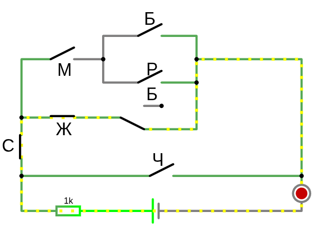
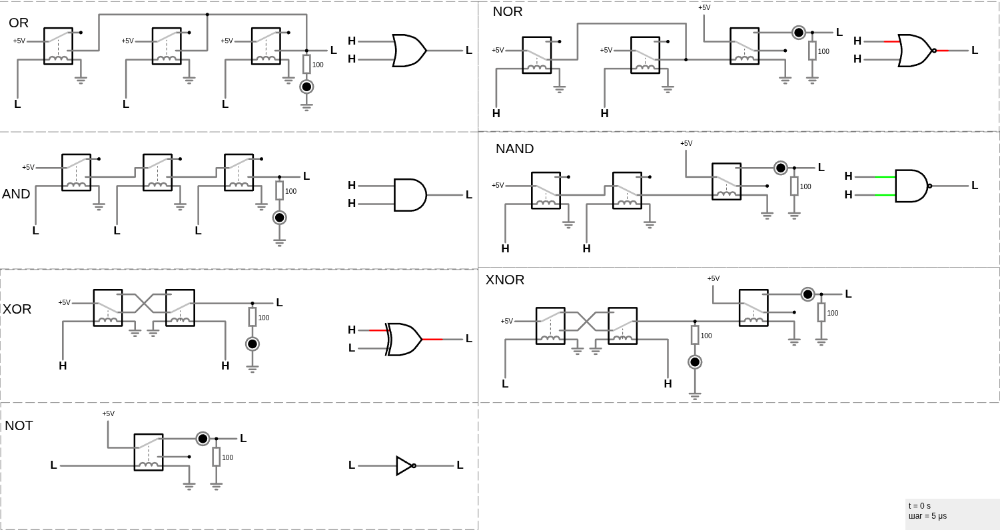
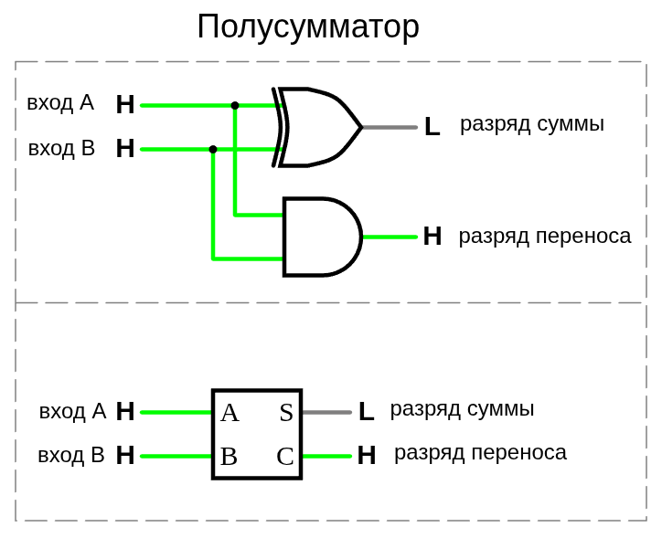
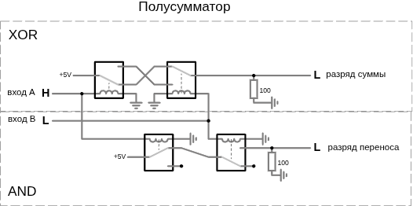
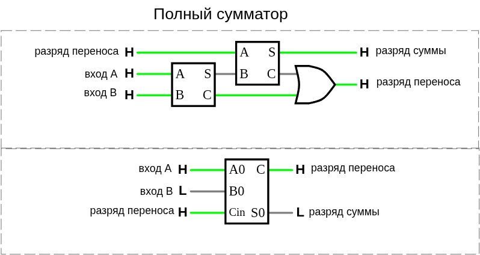
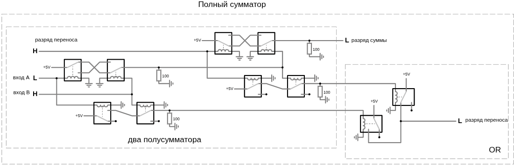
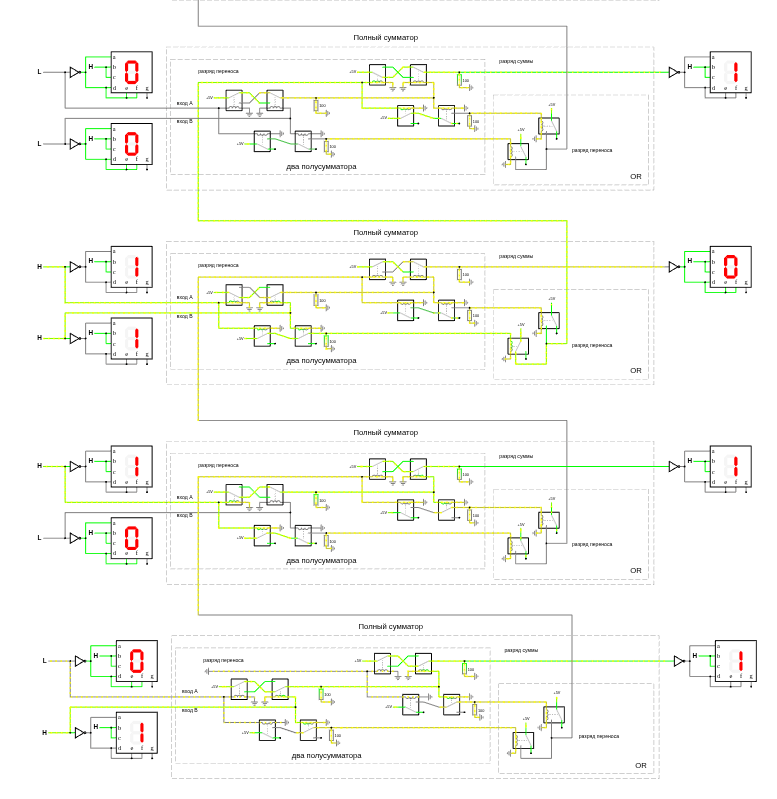
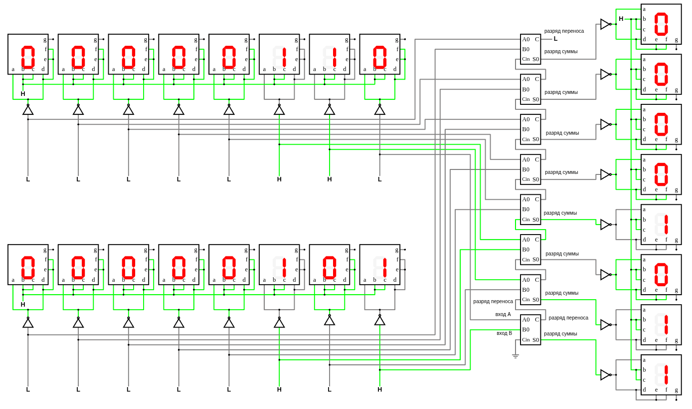

# Чарльз Петцольд. КОД тайный язык информатики

## Глава 10. Логика и переключатели

Явившись в зоомагазин, вы сказали продавцу: «Мне нужен стерилизованный (С) кот (М) белого (Б) или рыжего (Р) окраса; **или** стерилизованная кошка (Ж) любого окраса, кроме белого; или я возьму любую из имеющихся у вас черных кошек (Ч)», — и продавец составил такое выражение:

Каждый символ «×» соответствует месту схемы, где два переключателя (или две группы переключателей) соединены последовательно, каждый символ «+» — месту схемы, в котором два переключателя (или две группы переключателей) соединены параллельно.


`(М × С × (Б + Р)) + (Ж × С × (1 − Б)) + Ч`

или так

`(С × (М × (Б + Р)) + (Ж × (1 − Б))) + Ч`

* символ `+` соответсвует параллельному соединению т.е. `ИЛИ`
  * т.е. кошка/кот не может быть двух полов одновременно, поэтому или так или иначе т.е. **что-то одно**
* символ `x` соответсвует параллельному соединению т.е. `И`
  * т.е. кошка/кот может быть белая/черная/рыжая и **одновременно** женского/мужского пола, тут нет противоречий
* `1 − Б` означает - не белая, т.е. `НЕ`

Действительно, если вы просмотрите электрическую схему слева направо и сверху вниз, то столкнетесь с буквами в том же порядке (ну почти), в каком они представлены в выражении.



[схема www.falstad.com/circuit Логика и переключатели](https://www.falstad.com/circuit/circuitjs.html?ctz=CQAgjCAMB0l3BWcMBMcUHYMGZIA4UA2ATmIxAUgpABZsKBTAWjDACgB3WsQ2uCwlRr9IbAG7dewqrhp8qCvtUUwEbHigEyEmhIPkhNAEwYAzAIYBXADYAXJtYZHwUVzEjsATiFkGwGKRFkODYAZx80Hx1JKM0qCAtrUIY2AA8opGxsPB8MGRoIORQ5QHIQMPAAwwxNFDwczDjXROTy-15saLaqxqpmlK4u6Qr26NF0sBpiHzApnnaUTSK5QEIQTmHu9Zm41sqtwzrwYkaE8ySU8NqcniEecH14kD61y7uqF73RLnej-friqDWBV4eyBhn+YzB9BQxF4xSQ0KmSxAgDQQNJg+FgeE0IpgHJIwA4IGjsNjwDRMghZjQ8YY5IBEECJNHIxRy2EINQQhRpIHp6WJTImPkIUP8tC5gAIQNgAZV+G1Z9WqrhOZ1cKDWXQ6mmwkQ1AIuBwWclBBsVj1OLS4em0i1uOs+MRecpldtBe0th22Fv0rv0tsBt2uMQ+fth-yNB1EQA)

## Глава 11. Логические вентили

Логические вентили можно комбинировать для решения более сложных задач, например для выполнения простых арифметических операций.



[схема www.falstad.com/circuit Логические вентили OR, AND, XOR](https://www.falstad.com/circuit/circuitjs.html?ctz=CQAgjCAMB0l3BWcMBMcUHYMGZIA4UA2ATmIxAUgpABZsKBTAWjDACgAPEJwjYimkh4p+CGnlogUNEADkA8gBU2YDBKY1ihChm1NsCFDu3aIqKFFhIw8eJchG09ozERQ2Ac24GjhfN8MQQhoqULYAJW5NbQRdKK0KMBcLEOpQywQ2ACdvSBkEP1yZQmkLG0hPIqDS-Tyg1LCuHjx6bGx1QmwIbBoIGVKADXlwzm5eIxYSMew9MEJtfplh0eaZMB7ptexyRZAAQVkAERUS7jAaGSY8KhYLqIkjABMGADMAQwBXABsAFyYvhiPcAWUKwdhzCZgYhGc6XKEw6FSEDPd7fP4AoFmEFgk4TaRUGbqfG0OZIlGfX7-QHA9KucFqMY1WHcMRwu6mSxY1zWWxwZwUUEOeyQJAVVTqOiQu76QK3Yo06BcqzIXn8yj81wi9zi7goApnaWqWbshVKrXlWxqwUuWBaiqRYRsy6EfVykG0Kii7GZLxMVlnJIs6XXEGVGWQwPh7ghsK+o0ByFxK60tgAd0ZcMjLtmgYq6Y02AjExowQT7nzepzeLw6lYLjYABkxq66829IX3e8vgBnBhpRtRUssSMly4d9Jd3v9ptMFA1suz+f6ZJUSd90VsACyBrhc+4CRYe6oKGgmRybsPteD6XKYeZGivY5XESiHYvo537tSXtBmQdlc-RdHy-T13RgTJ839S8WUjJIJDzGDIT3P1YMRBCUMhRFlxueFy28JwWCwwscKPNN8JI9QfDOUj82Is4sPvXD0MYhjDRos4kzgwCuPQlBSgPXCEgqONEVwwjHH8MJz0E2ZRLuKhb23cSQAEu4hKkU8B30GZwEjNpTDQiw12ne4FJHEMmKMt4e3XdwZxKNYs1KSzV2sqcN1oupW200xczIjRxF04sLL8yDRKcxz619PjIt1Zz5PcX1CSC7xCAkZlY0QlKMPABL0NwGQQ1qGQhP85KDwKlTtHQi4JCK2qqrwnKDwa0qHQQREiuCKgYxSUDaU0nVipAIqYpGqgORgM0eVVVwjHVObhQ3IaGqK5KQ0mxVsXNXlrQFDVbWWhk-U6m4EEDDbTW2mbLUWhbYBtNwKiU4k6OUujj006LUl6PRiUlUNz1egjXrSso4DKpw3uBsIZznCQqKA2hx2BYyNxnWJtERzHkeSCA0aaujEfhkAqPQ-1sbiMmw1+0nZVp5LMoChH6cCxn3Hau43pxj6+rSb1-Ia-SolJSqarZuoNFFnSxWOomCIZpxNrMWBSDV9X1YwFB6G5FVboe-bFs1awVGOimFbZpWrtcDXbdILWdeVC07DuvbjfALToiCfwTt8SSrJs-sIQCebCmGgpj2RV4KXRakuXsdglMqiPdX1FPPsyHViVbOjW2V+w7dth37Bul2DfuoV3fpBG8Fij88+t1XC817WS71suhQrx7zRfbPA1w1t0m-MDNPTXO93aNZ2MnlKZ54sj673Qx0tIrxc65px40y+u7nruIwnTbO7jQdL5LIueucCDKBxP3L+n8MaFJAAmKibKjmSox-Ubc2znpALWepUF0HVdIJ5M6nHGONf+TgQxPGjmiKkmIR6QHYF4ABd9oEKUKFJTBUD0EZRVC+ZejViEoyoMPAaPogha3AHuSBcwUw6mIQkSBLCFQ2mkHgDABQUBgDwMQEUFxKCOx2rNA2TgjaHQ9lwKEEAxBSA6joSQpRZAHGOOmYhw4jBey0XhYWLA4iaK3ufHSuj9HGLHpLHOpjB4vlptBGe0Eh79QFm-Wu+4sbuMmGUZ+P8TJiQSGJUkT8X4L1JEwBIjjSqHxqIErCpUvA6ISDo0smVKoRKxpLVJHMpBMj3EEo8fMfwZFNhIexXEdFcXzjbZuati662dnyV2B03DV1ybuBGVi6GN0gLUuprcGm7StC0nuMi8CyWPNgfgLAuHKJkAoEYTCw7MgwFYk0KsOHRC4fwlB2xcCQFSU7IZi0JEGyrpUVZmYjCXOjCmSIKc3QPNvs4-mv5sj-1lAwj5Ex1K3jQbKBI3CJi9TFKcG5kwgGfMKHA1ElIMQ0m2onb5ZxCjXBwtgjSEEKDIVbA82xGicWGJxX5LOqQqLCyovnbAioxAHK1qoPZcxiDMCSI9UuTTy5uykbLMppZyVg0pT0vp9sBlHLEZ3LlrSTFYx0slRm0rSYCoFTLXuZLAi3zJkUkeVCKXuOFiEFMa8BV6rBga0Mh8yXuI1e4hCH4Z5exnq-KQ-gZ63w-BOPx6NaCRPcV7d139A4eVoHywIFNAgVByGG+au8mmEK8P6BqCaQW4gEDIM1CbAowpjoghFgp2AyJwFIcZUgaCOH4XMkAAwFmlOMKTJw6C6KbU2eMyAuBeDEA6lgJI5BBniokiMk2aCoaBAbTanJPMnA40wCuD0rySk5GAaTOoi72Z-P-kqiQK6x2guuVDZdAq6hZoQfC+OdItzrs6YVUWdQM5kSjbW6mYB1TeK4oEwpyRMjbjfafKe8FMVaVJPeUsBD8aersii7KwHcwBvctqKF1EJACXfRYT9jVoKMXfZpGc4SgNOh8aE7DVYxhXPw2BioAAjMY85APQuwWwSjXzwlpWmbwjcX7wowjyGZZIYCBzjN-SNQDhTQOBvA-xxqeBSS-N8aJsU50RpQaMKQGE0GP3nuUwh5AqQnH-qbDWHCdwWhShkCEsjfGiqtiM2WUzsn1OeLWFzMdvGZwdjNTwNNsbXK2Zc0YZK7nFV-pE7Bij4BCgpNmXqfgIXGOmHwPQWcT73AMehfqGw7jEvRbC4E-A-R9SZfIQeNK2h6VwafKTdxPqTNIg+AAOxRAASxq9STOCB6D6c0xpnTRhasNaa0CTIABJfC3tEMmH9uBCgdmRu0IkH4P9znhtzeI9Nj1tmgA)


**AND** в логике и программировании означает И (логическое умножение или конъюнкция). Это логическая операция, которая выдает истину (True), только если оба операнда истинны. Если хотя бы один из операндов ложен, то результат — ложь.

|AND| 0 | 1 |
|:--|:--|:--|
| 0 | 0 | 0 |
| 1 | 0 | 1 |

**OR** Это логическая операция, которая выдает истину (True), если хотя бы один из операндов истинен.

|OR | 0 | 1 |
|:--|:--|:--|
| 0 | 0 | 1 |
| 1 | 1 | 1 |

**XOR** (от англ. Exclusive OR/Исключающее ИЛИ). Это логическая операция, которая выдает истину (True), если только один из операндов истинен, и ложь (False), если оба операнда одинаковы (оба истинны или оба ложны).

|XOR| 0 | 1 |
|:--|:--|:--|
| 0 | 0 | 1 |
| 1 | 1 | 0 |


**NOT** (Инвертор) Инвертирует входное значение. Истина становится Ложью, и наоборот.

0 -> NOT -> 1

1 -> NOT -> 0

**NAND** (Not-AND/И-НЕ) Противоположность AND. Выдает Ложь, только если оба входа Истинны. Т.е. сперва применяется операция AND и к результату ее применяется операция NOT: 1 AND 1 = 1 NOT = 0

|NAND| 0 | 1 |
|:-- |:--|:--|
| 0  | 1 | 1 |
| 1  | 1 | 0 |


**NOR** (Not-OR/ИЛИ-НЕ) Противоположность OR. Выдает Истину, только если оба входа Ложны. Т.е. сперва применяется операция OR и к результату ее применяется операция NOT: 0 OR 0 = 0 NOT = 1

|NOR| 0 | 1 |
|:--|:--|:--|
| 0 | 1 | 0 |
| 1 | 0 | 0 |

**XNOR** (Exclusive-NOR/Исключающее ИЛИ-НЕ). Противоположность XOR. Выдает Истину, если оба входа одинаковы (оба Ложны или оба Истинны).

|XNOR| 0 | 1 |
|:-- |:--|:--|
| 0  | 1 | 0 |
| 1  | 0 | 1 |


## Глава 12. Двоичный сумматор

При сложении двух двоичных чисел получается бит суммы который представлен как **NOR** (Not-OR/ИЛИ-НЕ) и бит переноса который представлен как **AND**. Поэтому можно комбинировать вентили И и Искл-ИЛИ для сложения двух двоичных цифр A и B.





[схема полусумматора и полного сумматора www.falstad.com/circuit](https://www.falstad.com/circuit/circuitjs.html?ctz=CQAgjCAMB0l3BWcAOZ0AsBOAbJyAmAZm3UPUkxAUipFKoFMBaMMAKDGpCfWXE3x0+YAVBCCaCDgnTde4MIPmsJ4sVIDucvvkh8myGrr6Q2Wg0b3dD4fCbPWai-Tlv3zJEK6aewAdmwoBx5hAO5fMNMPWW9XV1MAGW44wJZ0GMCnEAAzAEMAGwBnBlpE5MDnbjB0tzEaPKKSpFMAWSEFQRsVMXxoKTblUS7RIz62AA9ufDBAzEoWbD9wAjpwQMAmEEBREEA+EEAWEAAdQoBBCanOcEJBBYrCJFkZkC29w4AhU7A4BVldJFYl+8CgAEQQAMIIB2EEBgHkQA6FQCCIIBhEEAPCAIwDSIKc5vxAvh8L90QCQCDwVDDoB+EEArCCA0mAXhBtjDgRxMEgmK5LjQQiAWUFJkxdEtLrIWAg+Jd-mtHjtoScucZ2QhUpxKLdKHintC3pMsOyseAZJq7qKCZDofCkajJghBLd7n4hQgRQ8DUTCmSKdTaWwkkzAhy0rIOVkGsVSu7yjKrtVfeaxBAA00gm0aBzLpqaKN+mJbhaLZHU2wAEZTfCyTxEL3o0z57mF8TkcTEdll05MpSBPw0DXfWSAfBBtoBuEDhxoRwMAQiDbQH0u5dOxUKeVUwiJC22aBbBV+LB3hOKekQSz8A5AqB5rrrrYNtJmYpvcxoNJRdeQLb+9R-eNINtRaCVzWjI9MacQQfuANR+JG4Y9OoDh3heICAdBpiTIYECYHweAVJAEB4g6RqIiipyGDu6BIAIwjyJhYKGiS5JUjSdKTMQvyEIQdDVBcD6iiqhySuyvjYBhYBMTMsjKuKrynPgeBeEqDwfEo+rkY6zrUW6bQgQRsjfkBsg5iIgSykYfiCHe+AGWo7DvrK4gmdgqCWaovRSLep7snWCCKM5mRXgesbwXQ6CYiBdAMpZfDCc8xynOkQoUIFvJuaFqqnIQfhMYxIXomQGFyYS0KKa6tEgK2EBkDQhhevQZHZYcA6mgVkDfH4sjIIQ+l2kC8k5VReVsOZXp1tZQp1jmjn6YZbnGao9ReTeVBOc1siuRadXPteR75oWRg1gySDYEx5bVkYhCUAypb2Oq1l0MuuCBasVbdj2lLIoAnCBVThw6jo2lxMSBqTGV9CBKtWIBHAAcgAIh9WoblMrZCExHYgAAGgA8gASsE8jeJ4a7mMoU4WLUc7WpqME2d0-VAXuMAYdA+C8YQyC4PThHYP9zAsTAkC-PA8BQLAhkpnzvOIEE-guMuNkLCTJGU9AEAc3MCuK4rBm7bAXPcwLKxcBzEiwJz4DBA8gFJuTpgAOZVMuFk0CzHnmx0MEWZUtt1GwFs+PNYQe1QIxBO7rh3p6PsTcEAdOd75ruCGkfhPNTmE0Khk1BHNQVLz1O0-xDOYEzsqs2kQvq9zQv8yXQv6wnVSiDI-IB6nMty7ASvN3MKuF8sGtl9rgsc-r7BaCbVaVkWVZRMTd6D1pDhgbBYSAWPZMmTPJn22BBlOE56+uwATppMFL8BuhRnAYn0IsXpXYsAP2u1lEujR3XgHPJlYkWK-iGMA8AVWJvW6HVtylEC7MeLBq5exEABP+XI+RUCJtyAKgpMoPA4uFD0EDYE-Qsnef0U0jwelfjBIe2JlyjzECtTk3BPqEJ+g1Qh18NgiUKGqfaVB0C8kIlQLgFUKKwhwqiNo3Qa7iCrEInMFtBGiDAv9EOu9BE1AkaoD4Y8kxCLkVPFGVck78gIaIsQNZmh1DGBooO5MWBTlNnoyQdReZSArIxB88hDoAUgEsPaTB7EwSsIdGgfhaE+SbHQZqtVAlw0Bndfsr0Rxjg0YBAIfASA+POpefR1iYBSA0XeFc81U6kLbFYy8aSHCGBtlWVAJSp67zKYQxqNh54dzdiAKpgFMBuTqWUIRrZ5puU6ctXBQRbxzywa062ZC+lj0yVgsIyVMgOFiS5KZg0imfB6cUgqizd4tMEKpLwblVlOBPhbTZjTPjEWOQUopNhtlHO2WPa5kZMDAWzEsm2FlVk9LHm8paHSlqV0yVWQCWSYIN0aXzBk1oWYuOQFgMAyBmAmDVh3YuOsqCa11sLSuqzAU9MBWnKmQsW7IBhTMBAspVZ9w1qilFZde6-FmVZKw2KaxjwBTWbFVh7YAosgC9+9tsUWWxTyhpVTpmNK-INP2BVIwiriWsu2DhtnbLeUkjgRNYnnQVedFijcIBoAIGChm1BvwtNhQYduSikWC27isGlIsiZKr4MKzV9x074uboSwlLNSVmopV3SlNr2AaJUDbUmeh4k2WSfkwx6TlgiJqHMLR1iUkFM-rYeQqjLh8FEWwWRGbWH3FzdI4+q8C2SOIJIX2rQLhTlUekSQNQhoxs9rpNy2DPKviPFoGSTbG2OxmZ2xQLy0L-L-p2ws8SqyKHkMA7NrEbZLzLQVI++zi2byPvxKZS6gidtzbBBd89p57vnUAle08x0YNTeOqeo6p2riAaPFVwgCDZPuAOvNQLtWupbsrIg3rO7IqtWivuD6L1vtYJGIRuLZauqwNaEQvidJkHheSv9lq-V61pf2o+McwOGXjtPV9ekFDganKvAjYQg3B1duI-856cOUZTA0-i5inZkCLCM1euhB22CNux09nxYJntNsBij5MB3Bulh++WX7v1kqLjzf9aHhbsFFiB0TO7SbOrxVJmDhLMDwZwIh39FqtaKaA1oJpt7v5Xu1EtKFwhqCNSTAvU8PioVrE+HZrd7mfGgRcwVNzphA3mh8zuYLi6Cl0EjQLKQ4jeAOvPGwzoTmJWcDc9szg6rsxBEDbxZcS9cswSZZY0oUbhNhfS2FpqAFgW93gIxRiWIfgCHg4QRuyHjOl2RTayuMwjb5YeNsyDbW5grj8DgQUkBcs4C0gi818nUPUvQwbSYMKVyNN8SgZCjSbDw1Rg4B56lQJxclRIA9x7Qtuf3Z2vzGkZieA0pWu76k3P+CmQFj+UgVtja2QzfgML-P0PxLfJ0nUH6doc405QfnPM+WqAgJiMh7OCk4UgtqlVeEmlOAtVhy56asMB1hO+Sl8rpCtkqIK2A1vxU4hFNhtUhJfhcasZBjC3j5ggSVVw1RbgwXOHtaoVgGZCVpii3apxrQOr8h3QIUKAZVl2OsYEJJewRKRG9EEaI9O+RfVt9IIpbq9ges9DHg4ol5n4HWI56B+IXSPEAA)

Существует причина, по которой эта схема называется полусумматором. Разумеется, она складывает две двоичные цифры и выдает бит суммы и бит переноса. Однако длина подавляющего большинства двоичных чисел превышает один бит. То, что полусумматор не может сделать, так это прибавить возможный бит переноса, получившийся в результате предыдущей операции сложения. Представьте, что складываем два двоичных числа.

```
 1111
+
 1111
-----
11110
```

Мы можем использовать полусумматор только для сложения цифр в правом крайнем столбце: 1 плюс 1 равно 0, 1 переносится. В случае со вторым столбцом справа нам, по сути, нужно сложить три двоичные цифры из-за переноса. И это касается всех остальных столбцов. Каждая последующая операция сложения двух двоичных цифр может включать бит переноса из предыдущего столбца.

Для сложения трех двоичных цифр понадобятся два полусумматора и вентиль ИЛИ, соединенные следующим образом.





В следующей таблице представлены все возможные комбинации входов для полного сумматора и результирующие выходы.

| Вход A | Вход B | Вход для переноса | Выход для суммы | Выход для переноса |
|:------:|:------:|:-----------------:|:----------------:|:------------------:|
| 0 | 0 | 0 | 0 | 0 |
| 0 | 1 | 0 | 1 | 0 |
| 1 | 0 | 0 | 1 | 0 |
| 1 | 1 | 0 | 0 | 1 |
| 0 | 0 | 1 | 1 | 0 |
| 0 | 1 | 1 | 0 | 1 |
| 1 | 0 | 1 | 0 | 1 |
| 1 | 1 | 1 | 1 | 1 |

 
Для создания сумматора потребуются 144 реле. Вот как я это понял: для каждого вентиля И, ИЛИ и И-НЕ требуются по два реле. Таким образом, вентиль Искл-ИЛИ состоит из шести реле. Полусумматор — это вентиль Искл-ИЛИ и вентиль И, поэтому для его создания необходимы восемь реле. Каждый полный сумматор — два полусумматора и вентиль ИЛИ, то есть 18 реле. 

Нам нужны восемь полных сумматоров для создания 8-битной машины, или 144 реле.

Пример: `5 (0101) + 6 (0110) = 11 (1011)`

```
 0101
+
 0110
_____
 1011

```




[8-ми битный сумматор на реле](https://www.falstad.com/circuit/circuitjs.html?ctz=CQAgjCAMB0mQrCAzADgEzQOwDY33WACxICcJk2hIJitkI8ApgLRhgBQARuCUttWDQhCYJMOyJI7AB7USmYYSpsSKRQqpoqgfBBAfCCBuEEC8IIGkQQJwgAHQDOgQRBAwiCAeEHuAGEEBCILsACIDJCYUalIX4wOH5-EmEQLRBAFhBAJhAnK0B+EANbO0dXDycucEJIP0phNH54SDEpbjASNHoUEkDiRGwwSS8lREwS4RIqdv5lfhjAURBdKKsAIRbCBsnOqko1PpBB4asAQS94QQYAkGxULbCF9ydAdhB3QHkQEcsEwFYQd2vDXWtM2SJ4MQ3A+HwGCvCwfiOpwuVlS9mM7AA7uBilR-Gp-nAQHCoF5-ig2igxGAUGxvCheuAASdzpcbncHk9IYTET4+vlaSioaJKjtMEImv5WUIpFCut14OzCL5vAKUS98UIUJgFNjVEiUPRNFQAPIAJXYYB8hP+XO1-EwosCUGgEBgcHN-2wVtQvkImBI2LQhWNCHA5vNLqExU9LtdUk18IF9AN7KDSKQQiNMFNsHdlutvn89sdzrNiCC7voZq9Wdg3NjzVVet1-x1lCzUGE9EklZg8HYAHNoZyQ9DsGpW1nG9lhZjBWzw9yUUWmlURaGx2yK4rq7XjfWmdgaaKEcHOTzqWu+ojkRumpBYULoQfB4z5fRcFQyJHIv6tYIj+34RG1E-suBjTHM6QyJjVBQRC+dpJFgdNM1zSAcx9M0-Q1e9BAvYUEMQ+FlE-EBWGgcsRDtJADyFbBVEwFhCn4NM3UzH1vWzX1miZKoLwHB9X2FKQm2QnZ4ECNAyy42tu1ENBXz40QlE4siUXY0cGBwcBpPgFkuyksd4FktgVMUs91OrJc5NFAU1D3BCGCEvSvV0u94S0NR4DEth9LEqMTV9c0f1UUgFUoJpVL9UCKPdKiIPzOBmgDN1Ils5RjMinYP2jDCwCwnIcMwPClHxIiSKtF0wMomjqLzWitOsnZImvUqqD3ErVO4x9bypURdOwJjSEjAc9xfEs+EY7kBO67wx1EWSp34gAncB+ua9l+pG+gMwakrL3ARa+KMscJECSDZlWhqtpkzbIg2ySJtMhTpt0s6xpOmy7M6y65rgBajxiwSbsq9gRz2mLypiiscgYOc6w+uT1qQ3IWMMyt-prXN6zChVg3bc9vCRog4ucxLiGxWUhS6GoqiYZg5XIjMAvyoKiss3UcA7UUaffGMIEStFMU1GgKBKJQWDIHL-I9cnoILM9W1bBGUcM7sRb4cXvGlpTkdSkJalliS2O8E8jvaWZ2uOqbxN1PWuyhPXy3V2ZcjPE2La1nZ-qpsWlptpanKZ6AsZxGpcdxgnucMvzSf5wqCsgym4Js2TnYHZ30ddlmkDZ4olyQLmibCEnwMCwWQrPB2+Id1iqQdIRWz5ccc4VMui7LtWq7Fyo-ERLtxqrkvNjFh6N3zhvgzlqk9cV-aVbPGr9ZHge1d8HqBDaocpHGyeKuRw2KKpB3IgXpapCLEelpizeodnadoHrIt+6R036b+w-a2PqknSoAyIgtx+pAAGWoIo7M-yrKwAMwAQwADaWEYADf0qkIiREIMrPAvRlbBn4u-KoNlTKaiKKZOaIAAHANAXRSBVBoGBF0oQs898GAsgROQ3qi5qxf2rIpBqxDlaUN+nfYUS0IwXnqlCISr5IhkM3nfCKLIBHcPwQwXSZCX7sAAJIfy2NuBRN9aCyPkfTShl95wMCEd0TkZDOw6KRDqMhu42F+CPCYo8G5eFIiPJw2xEsaEDTmrpS+jDEbwl0jiMihjvHUiMT4nhkQRoaLHG-J+tN2TDVFJg7BICwEaggfoscsDnGVgUF2d+yt1H6iRhWOJuDSHBNFMg6uhdv7yKOhuHefFlZVPKTLOpBdeT8DfF3FEciKhIxilUCMSjYbaJ4ZAZWXF6BVBGRgu+wyigiOmYvaxlClrjNaWIniTV+EVBvO9IZfSSG9K9GJaxJQDmaGOVQ0hczLr7POUc5WeyzkkPCcg6spkqjPQwR+ApCSmgKGWZ0fgPFTKPO8PxIZEy1DPJMo466SiulvS0laXRdICGN0YfkHIio7mosXEeZgpSSF4otnuOY4A1IksJdC0QmxmD5AqKKGl2yIn0GYBXKo+QWVdh+UyhKmweLUvUukxBT92WsrORyysEAvl4MhawXlkAdSyuody1gAL5X8BVRchV+QqgKp1Ec3VcqtWMp4l-CIaDCSkKIAsSFeqpkVw1TawJyqLG5GZRXKQnSaBCAZU-I1yjBlImqFuQNOcXFBpDdU4hDdhDQvtfkCuVi7XZGUBQw57B34V0oWGucUqURctKQKrQc1NgIMyTwQUiirUSqwUA+J0qLYCqrQKo5EKG1iVKXuOhyaIlaTspsJtFk74DiLcgE8I7rHDv+qU8dSbp0WxnUM+EskC1prkZm3SA6j4qLXcy2lYkfUDIXD25gLq1DipbQlVVnjSFMSvRaid7J+BpXvQ1fdjb935E7VQH1VaNUXo1b+21i6eUVpAyid+myMLrrdRWSVtbCngN+RbRVER-oodLeBkNB6MKfr-vBhJwHxWQfPcDI6izIhZoPmA5RwNRkWsfnqqjMN5xUgZDqfECw55IlpSEfIuH5pNg47bJEdSf6RsVDZDdkzjYiVOlJ6FDIK5scmfPZhYkaiBE0gJkTmmhBV0g0bbjyh1NqcZRp7t9du0bgZEeRTnKtR0d4kQ2KjMb6ugDo3IOFMYKhS1Gx1pSFWkxzc7lMmXms6wRkxJN8fSNxHT6W+eWR1Hx8Vw2rN8j52Fie7EJwQfhM0fLVgPPLZcSuGeK2Jfz9nhJEJ7rVhm6EIKhcDiHYOwVYJhSq0Z-xaNXNNb5p51r3mhZbzkieTNkABzuqY4DW+n1kP5HkOqtLVZqOwwWn0n98dvWfvYONKlO3lDbcvRKx67FjsAeTt+xje44Bnr6RmeYlKggEPhHdmNxUHvcV2RLfbV3hOiSikObTgOQYTQ3SWrSx3aX-d20yWHR2I6MsEJth7aAvufcfdQMleb7zvZ-S9nDsxgswXNNAsgBo4APjIEgA0vMPMUza6HMKKPDtyWlj6l2Lk4BuT-J5QCXEMn+wzgLGiPmtKE6I41DCiamSS6PGwDn7qBKS4e5Lm7KuOdq45xr87mwFedSscdNgnIFcMQ+4Zk3sxlDo8lNVsbsJi2ckzWheKpO4Dk-kMUeVWgaepXpyL8LYuRth2Wn0zNx2Xck9jK5Mg7l-xeS+Hk4XeUg+FXF53Hj2PnOduFCOogeexEcmUGpfASpLdl+7cX0lPiRwwir-X5tM2t0CTtEIMhrwAW3mN1xVCygviga7COJcF5tz0Fi83mjLPG92XrwI6PmZ4y7ETLgJc0C5Yp7C0NiLvnPGIh44iKtXP3dqqtMv3wq+Dy8DIpvlrUFg-ZykOKbYhQwjYnQBEAcSoQBqkLqguybeVmDUtOrS-e58yOle5q-wCuskT+hItK6IpK5A4AwohwxIwIVwtw9wjwmQTIQoEK-01eM6LwxACgRMoYhA3qNQfwRIQIlwoI4IsgBKuApU3qCkNBIAgIJIiQWBFIzwBQYQtOwgWo-0CwSwlwawTBaAYQNAwhagcoYhQwlw4w5Q5AmgSEIgYQGSWQzI7efEIgzKQQzQsg0o7eewZAYyIg4QkQsQ8QVwyQoI6QRwXgqgEAKqUUH+KqEA3+egRgZgIIDgzgbgngqhY4z6pAZBRApQu0yGuyyszAsWVIBKcRvQqK7EX0skj8I8hmzB+h8RHaMRZ6yW8R9SoRzK9iERGEOA2hsgrhVRSEjo9RiAPhBgJgFgNggRThXgphGEqA-AFhvRmI1hVAthiQDhnRwRmQ5QrUvRSMBhVR0hKIqhJ4CR0sRAvwNKmoYoAhGEAoBwWozAAoBIOo4hYwLQixhxUochuxpuFqpxlgkh-yOG+IrBzxYgaBdBPB5IOBqIpBVROoTQlB-x7xFqXBGBDBr6woCRnI1e0J70LwiKMupASBzKxAxxtB3BmB3xlITIleJ6Cu5K6UUOskhxG6veuxg6vIpkJ6LuA4NJXYz+6qSAXwKBnhzJQg3+v+LOI+FJYaqJFcx+MeVOZ+5+SYDo6AqYt+g29+6eIe0+KxQoc09eJ6++C+cYIpNoYpjopQUpjOw2j+wMq4vJm4uxmkM4a2LG7E5J9J0I9Kip-E7EgBKpc0kw6qGK-EdeCpmaypGws8q2zGQMuJnINpsJRJe4eJRJsJqAyO+BgxxmUJ7pme36S48hJJKZuOVkm2L0F2L0ruzkJ+vOHkAE3kwEAeqe2+D+HW8EKxL02I36uZapZOcelOPu5OtOOp7mgeFZspBpcuwZjmtuuxaaUk-Zak5uhxsBxuOZaknUE5qsmuy2Ik0uDK04KuKxZGkupslum5TEy5NsRkKxNsiuy27UoerOzx8Iy5b4gp34cefOxZQEZZW+MpIcGeZ5+Ob4bA657CjZHuzZ3u1OvA-u6c5ZL57WeC55NKFsS2OGRKG2O2smm26ZHU+6jmIBxpHU1KaFqFg652qF-a-UhxkOXGoOpJc0-2RFwOj09ESFDag5c5EuNZak+O2RhROGIkLFsBfU1KpspFW5KIf2PFSEF2-F80NFO2wlQlEs82RRwoMFNKrEk+62I4kuL0k2bBhySlLGnWwZAQsI7KelDWbuT5d+DA+pVZNWMu9IHOhlvWjWJl0pZlO+wsNlSmulu2TYA8J62Sdp8Cx0Qm3lIQ9qwK6WUJO8YVFkusfEDFR0ZFoK+shxLIb4NKYisVzsYVDCOlyZFsyV6Zx+DlepzlVMdGUFllpVLm9lIFz5TllZeCDIDF9VrCUI5mNplmNpSZMuFcLV9pE88RxAem1K-VV03VXVfVE+YleI9ZlWul8Cfc0VJCJVjyVIJVI8i1s1gm7KdGLVdGTc3W5VAVO1K8UI9V6ZAVyFtGuk5Vj85VV8FpQMp881fGkQJ6K20Ms2R6pSzAR5LIX1J44ScailClkM9AuaiGx6A8I6X1csIKZaxGR5l1+5ny+G9aZ6FW3648SaK53aWNX6F52NW5r66NaxH6zSn+O2Fsz6N1Q65NraRRcFhGpsn151DNw6yG+5qiANfeeNh6HNqJe636hlPNhGRJn1PVmNIgd6cJN63q0Zx6stD6cZo6368thNux-a+6gtqtL1xmAtQGx6Et2NBt-6vp2NJt4SxG9plC7VSNOC3ySSyGJtkNZtMNmGwVuG2tOayNFyZ6ltP1YtzVu6vYzKrFUIK1sk9qIdWGhlEdaaAdQ5SK8dHSPA9Kb4Oqy2ildYAaMqesMq7Ni6u6U6rqsF0KJq2VtNu69NZqH6865qVNQyCqENaq3NUyWqeeTdONdqBdYy7dBN+dVR0sad-dPiSCAEVRY6YqiNcGttoU9t9qENAqUNEkGS3tzKNsbK6Nf1wBUlydEllKhJBJuKfYCKh9KRUGiRUIBKgg6K8RR9t2yGV9BC8RD9Sx5azKlmlRrAtOxh1AOICUpAgQjRn9vAwxIAvhbRARaQwR3RdJZAV4yBqc3hqG0QcQYx+gKQExGQOhMxRMsk8xn9QhZQPAKxpc6xYQrATo39lBZDiuGgBxiuBCdxShZxUh1DdK1xsqLIihywDxLQT90hswToCU0hiDOoYJpIvBPxJBQhn9FGtk3qgkIjGJ4JgR4IeBUJ5UsJ5UcBlo12B4Mo9ohh+EHBYjXx2BOJzYujIk5KRhTqQ06qbAqM1pDj0KbVQQGhdJbjEsjJGEtQWIvg3qtQioSDXJ94PJsqqMYTnjFVbuQpp+CYtoyYEpN+nZoFNVPZFlx4ujSEypj20T+ZsTS+mpdo4p6OBVmctVw4Jp4Te+hh5ut1AZt8VpSMrA4Mtp8jrT8sRAHj72neCU72Q+mTfT2TKx2kc4b1LeQZWTgYwZNjWkeJszmjDCajZ6GjsZLTldAVggOo8lWzPiLO9F9k00-K0kdlMTt5v4RZiePkIEKT1VTOb5LO6uJzdZPKK4eZX47onuLZgF7ZZTou6TEFLz1TYe8j0kasVuPKMJ45ELnTF2ELr0kL2WUkOuhQUUKLRu4L6uqLDuQjGLDUWLmay5B2jF12x2x5Qjyu+zm2ggzCRL0hQWfWsThZCeAuQutzpl9zcpeO999LOL5DdSv5V+FOAFvuQFHZzWjlnLvZILQj2zJJuzmOQjtKBzayUOb6aIE08rGrmFoLqMFFzjU56rg0hFozu1pFBr5rxkHc8Fsr32oL64+LIzLzuTsqDrTI+Oz9LrML3F8jJU5rJUZrcLvLxL5DRuE1kFNLgQQbs1MlQjysOzvL9T71hpTzK46lrzfp4zU+fmMz6bmz6bpz+Zfzaer5XLZVQQA4XlFbgoJOxb3Zpb0rVbrT9V1bx0VbhOrYsqf1-l7KX5sI9qfbDpOwUJELyVBrSW0Vo7k72rlsk75uY7g5cWc7CWI7dToeLbqrC7ZYtbVVHL5lu+EitTTmtreTpodbYFocx1MzLzLbYLq8T9rTrjHTq8vbrTLVUTvV9jB49AVcLTdsAlOmQzfgD7-7E1t7dM17m9UWPKJ4JVg74miLh7MH70G112Gr77M7XGmzqrmzM7YHMzOHvbqro2cHqr11CrSbLeD1X7Ucz1rblHNGhGxLxGxL-1tTfl-LqsNa09eas9f97aaGoOGG5tP1zHl1rHNtda3t-HOtMn0nobXNCnva12wbb6AbWtoOgGib1NJ7lNFHOn5DxiPLetn1zEx6+nTHQk3dZ6rHvNcbdQKnflmd9YO6fTTEb66bQt5nCAktH7mNQQ-CyGWjBn5Un1wXPCMDLIlN4X2NozgGnnGnBbHnqy99e08XKXNnxkgGVr6a5aQH-iLTilU9UnYNpnxkkNprLtbHbnQ4LTOsINXt-6UTLHz7cdnHWG3rod4nLzA7LznchjU2hhd7bXhzk1GbSddKvrMC7dkb-qH1Rd5DoqA7x2LatTp6R7TqpdJ7MqFnVdKnxitdu3g9n97aM32n9d9jvLx3Znq3uLrauq6nfdJ3pyuq-2Tyo9n9cq1LK3knCGiSSGy37aC9QnVXndf9cqvbK3W9U3mm9Ks3xKuKCz1jSgluyPohT9KPx992bwMyMtOPWPvRGr0B2Pvc8O1KycDaXqvROQJdC3ycgX7K9P70+adPrpZq5PbPwnuX691PgXqOlBP8xXf3T3ycfEx3ovm3dP-U4v-U+qTJNPvqTJsvLd8vYv7dFPJdv6SAnUPEJJ2v0me3vROvUvBvMq2vkiJvtP9q2vsy1vAvE3VPCRCv4vCvXn1v2L9VEYcOWG8czu5R2LCHCRvL7vs1bXGvPv53ct5uxGnCZa1vfXhP64eGPHpXsRg5kNEYE+y9InMt0fl1sf1aoNmNmfoGQf59ct0uWv0uuNCRzr+68cpP2NJfTffXBn8cJ4lN7fxqdJXfFfUHFfA9sRhO-68cSMn1BfHqPvdfytCfzndnTvbaytrvWi8392Mx4-9vI-0vsRnUCtqxryO-pvPfnUnfu-WtEvTfrv5-CvWvyvhG5vLpytd-ctbPWvnPuXMf9vVtTPhfjX-3L-YvNDBfy54Zpyiy-BfsDW44ldi+X-H6j-1GyxVfeAjGfkn3NINMT4SHffigjX6FZ-SybK9k-1MgBV9ev2PaiQLIFWdTsE8RnpQJaovhVyXXf3iMnz7Ec5qTJMjiwL1qe8PewZCMLalUzsCdw8ReODEhXiCZhB0kX9iINngvtla5uOgWu2arCDzcbVCfqxl4G8tuBu2MKCVXIGIDOo+VXdpK33YZkxuWA4djgNfA7tdS5TAFrOyV6OQoS2vEtGwKN6bBkq2vYcglQjB1Joq9Aodh4N5aBDps1AuQexnd664h4QfHUJ2z4HzljqWuc3J71b5hREBN7LXHX2sHstjBRVddrwJ66M9MhfWc9mkwbawQVKKxL3soHTZB9Xq18ZShRHuwK95K4fBjutnErU8G0F2VoXtgmgc8uh5PWXmIL6Ey1+opFB-vFRdba9mKafUPnyx8GbRZhtjeiuQMgoLCAO4wygZsPGpnYJo9fQco1H94T4dWvRLYRRX8EoU5BEePXpQKqio50Kaws-h0PMEtCz+LOfHOH0HYQDT23OIVl7ipyitac0wIwYVQqZUw1hN-ZcuHxvLuhmW-ObyM1BKFStIs8wr-lCJmIHkn+FCKEZvzXJP81IquIYZiy1wPD0RkVcFt0ODazl1hnTIFusI4hB8nO+LDQQVlRwB8zyqubFhC1qHGZBWXzEVm2WAo2D-mZQg9msK5GUi90grOEQ+XJIgjbBoonOIz06ivCDeBee7ITnVGE8wkDUPEqP2mYz9++UZaPnqO1aGllSBffcHIOOF4CW8jpHvllzZ618wkPeZppaIHynDG4lTI0kH2gzlEfuaA5NvKTkGH4LRxkGERaA1Ir5CgV+DfNkNBF2DwRYTfwT6IL4RjhSZ+TUpfnXzJMJWCYxUdo38BMlJs6Yfxr0XTacl1QVJe7NHydJqD4cNw70m6NuG6j8hETXFPqO2I6NCe7BNmOUSaDolOC6BcRtiVwI9gNRJ4KMsP1+LSNk4axORtT217GNhxEDMELw3l4UBXiC-EEqIxXFYkzG-BKhkb0mzsNteJ4LhhIXOJkMIw0CU8VoEHH3EVCRDZWj52yAbFteBDLBnANaZ4MrsacaBjLSCD9F4G7fEEjYRQb2E0GjhSYi4V-oJFigl5NksUGaJIMwG-hDopAw8A6FKg5Rb9sgHkDU8rid9Nfrg2EHoUNwyRdCskX6aMIOx72aiZXWJ4YRCgVjOiYxIuxCRmEjvTiZL3tTCN28H3fibxwB7Mp+GmgBemJMFRloeeeKKuNclkmQ4heBGZVJJOO6STbueKZEGpNMQXdmJ5mbSbLkV7MTS42kuYVt00kHcSSQkEzr+mslXpRJfiDSUJHW56STOC3XhNZ1ElVxJ+k3PSdNwVQ8S5uq8USSLGDJoADEbXQoIN2YkRTMB4Uv3jFLdZYZApfEhkP+kKBIQfqGUiWKAOYnLw8Uy8Brin3-6fVwpKSNDGVIrDZ8P+WUz8pdWym-9iphGSqdjRanpSlotkwRHgW-RRTS+hQIvPuhamdTTyEXb1HgCi4rFxpSqMqcxKuTIYpp8nfqacjPQLT2pavFaYlnn69TWphU4+Nolc6aTTMfk1WHtNX56Sluxklwc1K0nzTHJBnOycegel78HplNJ6VrUkm2TzMNfQKZ9MMmlTkQv0q3sZIAI9TS4OfS6Y+i8mKSoBf3FnitJMkVSwZoPXKYdIkiozPaTUx6fpiyneTSM0VbaUtAKn1dbRNGbePVL8TXUnpWlQMmYIekBU3p88dlHTKZmaJtM9M+mC1XCl5Jh49UhkCVXCn99YqAsh+LzP771VwpEHHqezQEF5Tew+RUSrsM5mmxf2qLBgXtQalKzSams+QtSQanWYwpDIcWQYh0Hkzj2FkhlpVWFEltwKpg8WX4mSoPTDBVs+tjbKXbqohIK7Fae3FcGaT98UJD2b1CbBCyGQwc7maFRWkhz-ZmiUITFPGypTu2RWDnMLLLh4pEa1mJOW+HFmGxQ8Qs-uBnPc5ZC8xCo12XkJ6l6x6ZesQtme3lEiiS5FQqWWmzpISzM29QljLG3RnyVApbQljM8J+kcSvpvQkNn3OpTOTIYIOfuQbkGm7gtI+OISLSlnlpTHWUsmEgvKSmQUHp68xeX9kGnqIKKbU4YaRSGmEV95Jw1OXqx3l5JgCF858FZLcS9zcs9FN6ffLlbuy7p7w26bS0mnmZ0xfw75oCMwDAjnZF7B5veEfnmZyW6Mn+TKKuaIia51sy9nyyEkQKPJJLc6cWiTm4ypIX82lJLlHlDtkFuWZcngthYjy2Ms5eKUizkgGyoWiIVOagOZFSzUYj842dWQbnsggWzcoyvk0zD8iARgo8VgNnzElyqWY01sEPLEXvNfh0CgXMnnjHFyEF9MvxJ3LunLNZpqaf2czQsZ5SRIeJVaa2LLnZMwp9ST0gYsDCTTZo1MxptkCbnplemBUolK6I2nZN6Ues70WEy5k1M9JXowMS3mDGyyzFZcnKoK0KbRi181+JESYKTG0KPFVTBqT-JCUX4YxOYiJbkO8Z4ouIfjTwrAiCaRBf81Y-xdYrGmbSGx7s9RNaRiXhkjFrEjaTtARJMzKA+jeBqiwYa7jPi+4vgpCRWmXRYSeiqRmQWkKyMgSskniMuLaUQkmC+RT2FuM4mKMhxbSskAeKvExTZCdoCOZw0YbcNHiR41OUIVWUxTk4HBR8dhMmm5kNiQkPAC-V0KzTcGQQYyZ+JMJNyFIcDUSQpEQbgS7CSQKCRg2cK1EXiskxoFQv6U0B5gqE1ouhOglYSyis00yB-WkJ05iJek6+q-O94Eo55j9d2UtQvr5F2STxQlNikaHMScVqKnFYQ02SiSm6sKgINEV+WiSlAb+bGMxKUAEhIgaE9ohCs8APKxpuQPTE0smwHAkGoxSCeg0wnOFpiWU0engy0AXLSVahZiWclIaErRA2xbZU6AuV7K8Uqqw5Uw0sDjAWGzEj2ewydAJoNll4iZe7NQA3gxptOfla0sxILKOlfSxlf2gXF4ocgNqpRvQRUadK5V3pMKUXW0aIk8UogdMAY2YmCRRldqiRuYx6UDpcUW3DqFZNSQDiVpqSDcG1V151Am55qQsdsEJQbBWSXKo8JWLPLuKk17i81FAo-GqqEAlQdoHgCXFwKXZzOe8MqQzWDNCUArRlovijEJMSmAihnPIrfLD5olZakdRnRJnrYmmK0qAh6KDWTlwWTpP5HYr+QDMrRYa0vJNI7SWKj0Ma0vGFKrSVKepTaXRf6u9UUoXS-suZB1TxTPpO5z6cEY-PzwcT88kigsneUuastfIci2uc2svKbrCCHCl9Qvl-A85rw9kLiMTCAWlCbZHAPsj1KTWPq7YKuMKTNIZFOh6uPrfVS1F1kzTaRScnFcgvN74LcFBGkjdDUxGErUYRCxMkvMZWH4iFfACWCIsJUwkGNnIKBe+pZYlkUlYI98vNNlpfD0c7G4Df+BKBgaERPMRtcAqFiwaZWN6k8HeqNGPyCNymo0XvKTXoUNVO0MnmNI02DTU1fUfTV0PqlbqSK6mkSOpocXhtVNNuTbOhqVSCbUNs83DWxRvVpt5pLmvXFarWJ7yiNgbEeQJo4l+ajqcmoTUdgC0Ot25YW7PCxrEwTq25iC-PDUPvjTh4tQMLKmGq8RMzKEVckLIIsHVlsEqayOrJlpdKFz8tP6t8gkPdnmpxZWaSWEnMgydseIZpHLNlpZALwg1rWoOf7JmkOzU1UVd2X1vxkDa3Z+q9hP7PsRjab1oMFNQXAy3ybZgk2jWOVoHWVbCt-M59ELK22rauy0mxtihsrYoakNSgmrbJHTXZrZB66pWGdp8TiCatpkFWWVgA6czzUr2j5Ph3g3-Q6tSzIrZBn5kGZlqJmgcADoYSod9VecfIqNt6H0zn09MgbZ9sJXjYmZ96i6qJOfSUz7126vGTVvWRHryRaW2+M1PdLEYi0cfdHUnxvWoCYZdtAHoyr6SQ0tAWfIVKTpJ31TEyv3ZSaVKGq2Shq6UojbZL83vSBNg0oXd1Pp19SVao0pHVQFemo7pdi2x6fLqV2D8Vpyu0qYxsek0aDp0WwXagNOlbSctg0yjHP2alVpSpl2s3XKhWmnqFdkKUqbbrJo+rx8k0x3bZJXT47LcxujdMbqumPT30R6v3aVI936q4KEGLKVAXqnZrOdM9OnRqvnQVSt11UlGcVsrBBqCdRfM3WpAj1cVIpstPiS5sYFYa7cxe0NKVuSkLoK93247V2E9QuLZaak+WivzB43qx+7kmjU93Ryq70d-fcyejnHp8T1dgusdLXX73Gp26TOgSQFKl1GSqdL3c1Y3xlRd7VU0+xfe3oZ0T6+d3PQSe6Xklk7Gp0AuGbSoZ0SS+doPTvbvp334qh5Am7iTPqYlBqv4cazFYSGf13J8iL+7sXisxTuz+YaKa7CSi-0MRLcs5d-PCFqA2dEwFyJ+rKp26yrU+MBgeiVlYDhKQByqCoOPUR7wGY90B+xuEvkkVA19T9fwN3WpYkGLkZBtumQZO1PxqW+BsVGActTicFQEKFjiwaYOGF2DfyVgOwduT2NyD3B7EJXUENSgBJMBzep6maaMGCDUBrzk-QAWO5DCChs8E-URLyHY6g8VgNKH6L2NtDKh-g3JV0O57xEKqC6aYbLSqGs8KqfjDTtj0mHNQvKSdpgEhzJ7zO7YOaPK3cMH7he9h5w5DISh+GikABgEuJ0aC2NQjB+S9HrStoOH-D1h41CO0rz2JWAleaxIkb0R0dUjhiLwl3muxZGgkABixHRy8OT9LDiieI0FLkTEHAsnBjOgboKMJRRD9h+A9kbrJjI6OvBsxI0fnQdHhDI7dg8kaEN71DC4SmI7IfcSNGajjRmg2Qh4OEFmDMxujqMfE6oHt9NnWVYd2wNKS7DsxwgwCknaoHkZ8iHg4FkmNjzbDQRhKLAfvotHT4HjREqbAqPdz7qmhoY0oh4MOKfFjHQNJwYtida3jWHAduwf+M4BYMisgdqCengBHyRy1eVnoZHgqo5hesRE0UE8NzCxYWh9TLQv+CzVm4-KLw7+3+A7Ca4+JvpK412AyDmqA7Ak-ieVy8haTP7N9CUeClKHw62J5Q8VXlbsHkTbxwUgznAiuQeNdgjgPDGxPsGbYHxqwYy35MCmOgUm6DUVFk08n0A3QEZvaCVQ8n1TZsRo-VCDkeM9DmpmE55TVPDQ1TRp5GCicA6Wn5YnbHE7khs6ER4hKctEEGkMKIkqYPJxEracRK5bowspgU-2r20KnxcIprUBie7H-GfTr6k0P6fAiBnUmyI9MCmzHCYnqhI7Dk9js+gdG5KonWQ9jvoiI8oDCLE46QOLOMGyz5B61udmpJtHwcnB-9rdg6McU6OehtaKyYOjXZWzT0SA3RUR5dm-s4nSE4cICOKTdhw5rQwRThPEVgCNZocya0hMdRBzG6bBmgktwlQeDsmQs4xPXNvHyokp0wQF2uxFnjIJZn4Sfl4Wtk-cgC79fApAVWRCzDROHlAY40XMuNQEG5kXPW3StRmKBycdJB4MjSQYnB3cnDxaPKRODS5FM7WdpFPmlyT5hs31FnMzk30rZ43NCz0MKstD86haOyakx9m00jzKC8oYZGagACfI-8nwr9zBRPzt5wrWZ1TMwoGLvpplpxvhFARcxFW2i9K3+PsG9zAJ3USM0gI5MeSxKbE4Acib5GqmLpqSySlGyjg3T3pIi8RUJ31hHSI7Hkl03kYiWe8MzLw8msvQhDDSYR6Ey4l1Rannjt8afFBb0thgVUqpLtRTjuzyA8ICoA0FqHlOJnwAJasyxumMvmGzzBTHtRKDCVxiaLTat8uKBYIpGWSsoGzh6OLW8gmTLudS3SYmiichz8zBc+4jdMEle2sl1EO2EQDuE38OINwtAUHEmN2lPxXEoJZhISWHWJBN4FcYBJfB1jSqj4piXGU-B5GF+HYHsBOM7iPVpjB1YoCKsBgNAXQAI7cROLaqtl0wLQ4sWgSdnnQF4s4lCpSPE1mSjRrYqSoV4pG5izoFA4sTgI+A4rLxDMPY3wBgSRiEEz5cKqCKYNaiDoK47eJUDyMugzKnQGCrZXfLsJOuMMCIDEAoHYFSRDHuj34PabcV2IZs0eZ2jvxLo8E6WCbURtcci+sgI4r0S+AQAJAePItaCT3H2qfiQAA)




[8-ми битный сумматор www.falstad.com/circuit](https://www.falstad.com/circuit/circuitjs.html?ctz=CQAgjCAMB0l3BWcMBMcUHYMGZIA4UA2ATmIxAUgoqoQFMBaMMAKAA8QUCQ8AWPEL3w8EEXuEIhAAiCAGEEDsIFMDyIIBYQADoBnQPwggVhAp2wLwggPhBAgiAz2nQuTzEB2DChDFIYidPlK1644GEQQDwgvwGkQc2ZJa0kwQiRrYkFXQCYQQFEQQ08AIWCwBzw7CQg+KnEIkETkjQBBFjBicIxQ-nBiTLqHVg5MCBrbGpAsF0LZBRUNH38gjl4HDGIkCIFJgQLJfo8NHT0jUwqq8C77KkqJtE5wFgBzbcliDPPHQio7zerJBAb6h2eHZvNMB0JxkDtyL8kAs3ANPMNAg9rrxfq9BLDPq1CE8wNh-hgIKJJCCloMvH5IZVHv9sOEXthSUcWpwMFRsFl0Uh6djXLjwQSggB3GmNATfHiFSAsblgHZ8a54QXCiWFfmSyRC7n83Y8kCEPACRWq9UCUWSHVQaV6tUIYkGrX896q033JX2Ci3a42w0iroILhOx0W+0w8T83jYBzehwB5pdUMu6FwaGByPGwrGurBwS68Oa6Vyqj+9Ou8K8ApdY3J+OFrrJtB8+1Fr7qkAMWvYYjievA1nuPGrAwmMxIgQMNF2NH5NtgoYclgAWVVDDquGbSc40AQUONM91LzXVJrMQy5DsBVwsT67fZIxXXTwexel63rRwnAQe4wfMdOJPY7PROuFbhP8+docClJH5OdIxAyAC0kUCtWNfljWglgAElBFjMBIBQcReC2NCMKgKAlwoaVnTQoQHT2OAczI5B7WIkjI0IXDmAgqimPELUGIKOjInCOitSwi5w2w9C2OlfjkFwsS0PtLViMgH0hOkojHTIbEthUw0wEfKj1KtdSqHIe5kIjPBYTEky2PwpBl25Z0NVoR0+Eo51LjeZT83o3Cm3EZz3PYzz3O4xxfNErZ5UEULYT4iLMLUq4ZOUq4xJcyNbMKMypU08hUqea9BW6PChUyqixKtMT9IKpT8i2MSysqigXhKl4oqedzGqDELVM6ihgu5Di1VwwK+r88Q+udIa6qtMbcPi+zZooD0hSM2MEFarYVosmArIqLSxtNeqfj28rbSowKxMCmbundcLJAwK7mu6ZixNu9ruTOvanuY4bunFQLnxE3rcL+qigYu57gfFUHDjGjVDSWiZHq2WkNoI5c4c4CSthQabLMImzHQwuafwuy1HQQgHxFA50yf6inmMC6nJME4Dpo69GYuAxS8azeSOZelimeuQqdsdY0rSLfLDJQn52bVZGtq5ng5qTOrmFcvYepp8B3OIjW+rAAK9v1-7rtcM7jbNk3VZSkXEuwuKVa6jLhb2HLmgVCWNOdklXe9vCDOtulKTEoCA6lk2I3u+kZYj1mQ+DiHpT630TWxSLE4k2FnWTi6IyztOFaEObSXTNGo5Nsu7hR7assdJhtY3I2-YqgAZbrmyt0QHCYOLwBAAAzABDAAbdQ6GoC665lyfQ83MTN3uhhqq2efWenueti+ph9T2rePPbp5a6lBXN2dXeJ5vU+rcWsPF662+CqrgDHES2Nkr41DhLDt+M3tIGIxB0SsY-6xnMmBe0p1YznUAQdbEQDPo-zeB6XOC1oHzXmMtDW-powRkLpGCMZccHRnLD6WM-J34fAkqQzmqpG4RkbuQ2WYd6EINNqhBUqD750PYchJgdhgLCF4YWXyONrJ1lRA5KgvDrzHV4R6G8TAUChRkRkbCkgFFKMjOo8IaiVE6PYdyOujF3KCLzMbExWt26Bl1BrWRAh5Gog9Mwgx+tcL2PGAUYKrcpEOGXqiF4GRNS90HiPMeSAhbkDrjvOohjMICEII3f218FGygERkBMwjNq4zEWgKg9iUAgOUTMRWYjxHFK1N3SkhQKmhEKZUnRpSz7SgUbCRuyTTGaLSe07utYnElNrPYopvTmniDyS04KRUtF1miRkUycSEkVQmepTci9WpzPcokppXlikrI8WYxy2z9lDLCBYushybFbNacco5CY1FhUaQYsKVSwo3nKfs+RzyZF2W2clF5SFTmYwEVcjJVcJnMEpMs1iKY1TzMKcxAZzEhloWEPYiiJzyloUNsYpF1izGQtaRi9p5T1JVKWUfOsxK1HqV+c41F8iqXKIgrkyRUlMiSyYJAPaP52WYrloRHhvAUl9gFYSkRTTcHyOMjI4u2yQ7UrrCHKpsqpV1PleCslM4xnznSWY4VJz+w9JsdK+R0qhnJwlZqz2ES57ROTnUeJ6yKo8JQJygRzqRWZNEQwAm2zMyaJ-PYi8yjCw6MDR04NYiuj3PlQi4xbq0VNLja0n8Qz-WSOTYauFkjQLMImSHZZoE7UwstXWQKyyk5rPEBsgxfV5F6xse6OxkiG3xoMY+Lpzahl1ubG2ltUzVF9r0ZoySaizIyObRKjR5TbJNukbDOsPauU9voaKiZdzol-wrR7cpQN5FA07TDWtMMhk4C6QaY94pWknt7S2bRJad7qsClUwKcr6wHskc+mRKpd1XV+Twq9XKr3Lo9X8hgV7jmgcpGFSu8s6wqjBqBq6YNykGng79O6TTBowxvZdPm2GDR4cOk0ndVSwPqtI2og0UGMMw1Qwesj4p4PEfYauwofVQMMcOPaytjr50XmXj2qDorW2Ong1aJDTTm3waeuhgxZ0sPSdw3JoVWwoHVtcVUgT6rNNqPHVpj0om5EPsBldes6nmNaTw7hUzlbONFvCaq-UVnQIqi41uppzmTOgSowYn88H-XqrjXc-z+jo0jKqYF9Vxp8NRcI84ro0WdgybrL5kzxpxM+dIn53+6GnV7S+V6vLeVgMTLOlZ5OLm7NithFJ2E3n5W1ng0a9Vuq7lNZCxqsLI7Ch1f7JSfDIdVMObVFhkO6X6uzE85SMbM5oxSaATlqZ3WJXdaK1XHhBKeC+I5aEVbMH2WZdS3JCYSX2XCHg+pab6l8MXZO1drDV3YslLhVUjbPXXsvdpZF1F8HsUCna5Cn7dEqOgtKWxgHtmHVsuOeB6Hu2skMC+edq4039nwbCij1jWH0cnbCvh3Hj2dl-f+Tt9rsPbl1B66jkzbz1VbPO+5YHFmrtWbpxD7j9xQWKMc+3IgNmqCuardk6rqXedE-RUUwH-TIsoBW-UqX-3Rd3M6WLppYL9RYbVynDpoONelOmyECbXdNf65yTh7J832rrZl6EXx1uxcros-rPaYP3HdDZ25rxfiJi1m8YrO4QTh6j3Hqr13P3XdvasWb2xKvnF8KJ9Ht74eXtx7e1z4bfZdFa-RWn6Laf9eR5+3nk74j9KpcbMdy3YiU++JT3D5cnu4+BmZXH3B-vglB7CSwT3dvQJtMEEQvC7fQmGk99tzgGux+t8H4H4fQovHHLjQj6qA+qBD+D14-99oIPYhX-3Gf6-ePASwz2qfEA1+d68bq3vurT975CQfgrUFDiP-7-71f++L9V8LKi8xLKCp347xH2yUKFICNztz-zbw-yAO5QEh0THwgOn3v0-yXwuGMSuSO3-3P2gKvSqEkUAwwMgKQOgJ7SWSXQIIDyILn0WwuA3F1QQPf0oK72S0Nh-0TXILPygPKUC3kTYOEBgkSzdjN34O5zwnGlzDEVuWZXa11S5RkJZlbS6EXUUNIm3UpAAzUIJxa2Wxt2kO62Xl1QaEogYAE34y6D0iI0g2XhwK9FVzH1wLETsLLFV2rx0Tj1+1eQBT7AXwJ1REUNSUb0OAng7ixXthshCLeFWVDjqHWihRkkiJiKJjqh-ASL4KIncmSPcmlQumlRiKyLSIplrBiObQumbSKJQTCO8g9BiPNDqgNGqJhjiJGhhhiP2Qun2RaOVgqJ4GiPcncJVlRRiL6J82yy7mVFrHRXLyjy926HGOcJeA6HN29yMIyAt0WJmOWPySWIcN-lmJpRGO2K2PRQwIWMXmR12PJWRxM2SgWKJTOL7DBhuKI0QxMwePOIQy2OMPmLeLExMzE2+K+KFSATeP-hM3-mBKBL7DGOWMmPsUmI3jmJ8R0U2JuA6WRLyVfgVwxIOJRKOPtBRXtHhL2MRIuOJNuNZRJJxM2SuCsKukJNgx-TwNpPazBn4xeDpM+PJI5MpNbTZJHSxPKUlSmX5LFSxK9QJPa19TFNJOcL8Iz3SNSPEIhWMU6LEWVLlL9AVIlGZTkWUR1OyT5HkP1LZmAOZmNlglSSuESOcUtItI+BUNV0tNIhgM4HtPEJDi2BDi1Exh3m8JC0TFq3yHzmKX5G31VGEP2kYStHYj9GP0UIaKNB2EODqBVD4lsGYhnEKGpmNH2RARVNjCb2YKf11MFRNONOz1lCs2V2pmdK5Q229SOM5SdLrPjIMX-R3k31wwXSdIXRbOoP+HTLkLMTjQLJfytK-x0NOVyTpPjCuHrE4lw3sUkM23axaVnNhG-mrXEGSj7w3NLPA2V13J3Ibjt13NgidKaFdKmT5HPIEEMKHVvI9GdLvIbInKfPKIcL2jvKfJsLdJ93zLeP-L7FfkNR8TQLUhsWh2XmOS2XDLnjSnZPgsHXsPRQuFrmsOOn52xnMO5CoFILMKcJFBuiuhAKaiNBoK7gMNItkxAMfMor5mzJvBATlSYrpGaFRS1A-ldRYM1NzNsEAkCNElmCTLTONkzheARF7JvDNW5j5g9MpG9PYSAA)


