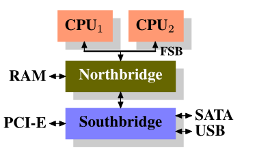
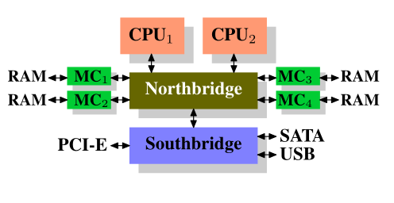
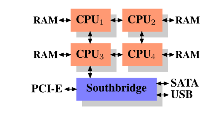
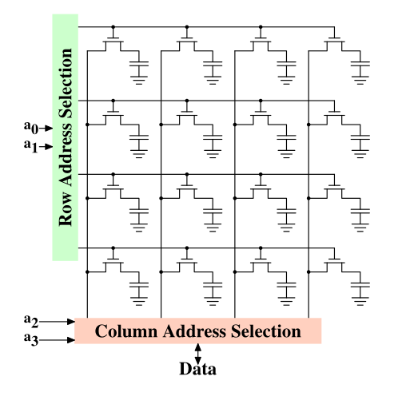

# Ulrich Drepper. What Every Programmer Should Know About Memory

*Что каждый программист должен знать о памяти*

``` 
Ульрих Дреппер
Red Hat, Inc.
[drepper@redhat.com](mailto:drepper@redhat.com)
21 ноября 2007 г.
```

---

## Аннотация

По мере того как ядра процессоров становятся быстрее и их становится больше, ограничивающим фактором для большинства программ уже сейчас — и будет оставаться ещё некоторое время — является доступ к памяти. Разработчики аппаратного обеспечения придумали всё более сложные методы обработки и ускорения доступа к памяти — такие как кэши процессора — но они не могут работать оптимально без некоторой помощи со стороны программиста. К сожалению, ни структура, ни стоимость использования подсистемы памяти компьютера или кэшей процессора хорошо не понимаются большинством программистов. В этой работе объясняется структура подсистем памяти, используемых в современных массовых аппаратных платформах, показывается, почему были разработаны кэши процессора, как они работают и что должны делать программы, чтобы достичь оптимальной производительности, используя их.
  
## Введение

В ранние годы компьютеры были намного проще. Различные компоненты системы, такие как процессор, память, устройства хранения и сетевые интерфейсы, разрабатывались вместе и, как результат, были довольно сбалансированы по производительности. Например, память и сетевые интерфейсы не были (значительно) быстрее процессора при предоставлении данных.

Разбалансировка системы: эта ситуация изменилась, когда базовая структура компьютеров стабилизировалась, и разработчики аппаратного обеспечения сосредоточились на оптимизации отдельных подсистем. Внезапно производительность некоторых компонентов компьютера значительно отстала, и появились узкие места (bottlenecks). Это особенно верно для устройств хранения и подсистем памяти, которые по причинам стоимости улучшались медленнее по сравнению с другими компонентами.

Как решали проблему медленного storage.
Медлительность устройств хранения (дисков) в основном была преодолена с помощью программных методов: 
* Операционные системы держат наиболее часто используемые (и наиболее вероятные к использованию) данные в основной памяти, доступ к которой осуществляется на порядки быстрее, чем к жёсткому диску. 
* В сами устройства хранения также был добавлен кэш, что не требует изменений в операционной системе для повышения производительности. В рамках этой работы мы не будем подробнее рассматривать программные оптимизации доступа к устройствам хранения.

В отличие от подсистем хранения (storage), устранение отставания в производительности основной памяти как узкого места оказалось гораздо более сложной задачей, и почти все решения требуют изменений в аппаратуре. 

Сегодня эти изменения в основном проявляются в следующих формах:
* проектирование RAM (скорость и параллелизм),
* проектирование контроллеров памяти,
* кэши процессора,
* прямой доступ к памяти (DMA) для устройств.

В основном этот документ будет посвящён кэшам процессора и некоторым эффектам, связанным с дизайном контроллеров памяти. В процессе рассмотрения этих тем мы также затронем DMA и рассмотрим его в общем контексте. Однако начнём с обзора архитектуры современного массового оборудования. Это необходимо для понимания проблем и ограничений эффективного использования подсистем памяти. Также мы рассмотрим различные типы RAM и объясним, почему эти различия всё ещё существуют.
 
Когда речь идёт о деталях и решениях, зависящих от операционной системы, текст описывает исключительно Linux.  
  
## Структура документа
 
**Раздел 2** [Commodity Hardware Today](#commodity-hardware-today) подробно описывает оперативную память (RAM). Содержимое этого раздела полезно знать, но не является абсолютно необходимым для понимания последующих разделов. В местах, где это нужно, будут приведены ссылки назад, чтобы читатель мог при необходимости вернуться.

**Раздел 3** подробно рассматривает поведение кэшей процессора. Используются графики, чтобы сделать текст менее сухим. Этот раздел необходим для понимания остальной части документа.

**Раздел 4** кратко описывает реализацию виртуальной памяти. Это также необходимая база.

**Раздел 5** подробно рассматривает системы с неравномерным доступом к памяти (NUMA).

**Раздел 6** [What Programmers Can Do](#what-programmers-can-do) является центральным. В нём объединяется информация из предыдущих разделов и даются рекомендации программистам по написанию эффективного кода. Нетерпеливый читатель может начать с этого раздела и при необходимости возвращаться назад.

**Раздел 7** описывает инструменты, помогающие программисту. Даже при хорошем понимании технологии не всегда очевидно, где именно возникают проблемы в сложных проектах.

**Раздел 8** рассматриваются будущие технологии.
  
## Об этом документе

Название этой работы — отсылка к классической статье Дэвида Голдберга «What Every Computer Scientist Should Know About Floating-Point Arithmetic». Эта работа до сих пор недостаточно известна, хотя должна быть обязательной для всех, кто занимается серьёзным программированием.

---

# Commodity Hardware Today 
   
Важно понимать массовое аппаратное обеспечение, поскольку специализированные системы постепенно уходят с рынка. Масштабирование в настоящее время чаще всего достигается горизонтально, а не вертикально, то есть сегодня экономически выгоднее использовать множество небольших взаимосвязанных компьютеров массового класса, чем несколько очень больших и исключительно быстрых (и дорогих) систем. Это возможно благодаря широкому распространению быстрых и недорогих сетевых технологий. Конечно, остаются ситуации, где большие специализированные системы по-прежнему необходимы и представляют коммерческий интерес, но общий рынок значительно уступает рынку массового оборудования. По состоянию на 2007 год Red Hat ожидает, что в будущих продуктах стандартными «строительными блоками» для большинства дата-центров будут компьютеры с максимум четырьмя процессорными сокетами, каждый из которых содержит четырёхъядерный CPU, который, в случае процессоров Intel, будет поддерживать Hyper-Threading (Hyper-Threading позволяет одному ядру выполнять два или более потока одновременно с минимальными дополнительными аппаратными затратами). Это означает, что стандартная система в дата-центре будет иметь до 64 виртуальных процессоров (В 2007 году 64 виртуальных ядра казались пределом. Сейчас это младший десктоп (Apple M2 Max). Серверы с 256+ ядрами и терабайтами памяти — норма). Более крупные машины будут поддерживаться, но конфигурация с четырьмя сокетами и четырьмя ядрами считается оптимальной, и большинство оптимизаций нацелено именно на такие системы.

Существуют значительные различия в архитектуре компьютеров, построенных из массовых компонентов. Тем не менее, можно охватить более 90% таких систем, сосредоточившись на наиболее важных различиях. Следует учитывать, что технические детали быстро меняются, поэтому необходимо обращать внимание на дату написания документа.

На протяжении многих лет персональные компьютеры и небольшие серверы стандартизировались вокруг чипсета, состоящего из двух частей: Northbridge и Southbridge. На рисунке 2.1 показана эта структура.



Figure 2.1: Structure with Northbridge and Southbridge

Все процессоры (в предыдущем примере их два, но может быть и больше) подключены через общую шину (Front Side Bus, FSB) к Northbridge. Northbridge, помимо прочего, содержит контроллер памяти, и его реализация определяет тип используемой оперативной памяти. Различные типы памяти, такие как DRAM, Rambus и SDRAM, требуют различных контроллеров.

Для доступа ко всем остальным устройствам системы Northbridge взаимодействует с Southbridge. Southbridge, часто называемый мостом ввода-вывода (I/O bridge), управляет связью с устройствами через различные шины. Сегодня наибольшее значение имеют шины PCI, PCI Express, SATA и USB, но также поддерживаются PATA, IEEE 1394, последовательные и параллельные порты. В более старых системах слоты AGP подключались к Northbridge из-за недостаточной скорости связи между Northbridge и Southbridge. В современных системах слоты PCI Express подключаются к Southbridge.

Такая архитектура имеет ряд важных последствий:

* вся передача данных между процессорами проходит по той же шине, которая используется для связи с Northbridge;
* вся работа с оперативной памятью проходит через Northbridge;
* оперативная память имеет только один порт;
* взаимодействие процессора с устройствами, подключёнными к Southbridge, также проходит через Northbridge.

В этой архитектуре сразу видны несколько узких мест. 
1. Одно из них связано с доступом устройств к оперативной памяти. В ранних ПК вся связь с устройствами проходила через процессор, что негативно влияло на производительность. Для решения этой проблемы появились устройства с поддержкой прямого доступа к памяти (DMA). DMA позволяет устройствам, с помощью Northbridge, напрямую читать и записывать данные в оперативную память без участия процессора. Сегодня все высокопроизводительные устройства используют DMA. Это снижает нагрузку на процессор, но создаёт конкуренцию за пропускную способность Northbridge, поскольку операции DMA конкурируют с доступом процессоров к памяти.

2. Второе узкое место связано с шиной между Northbridge и оперативной памятью. Детали зависят от типа памяти. В старых системах используется одна шина для всех модулей памяти, что исключает параллельный доступ. Более современные типы памяти используют два канала, что удваивает пропускную способность. Northbridge распределяет доступ к памяти между каналами. Ещё более новые технологии добавляют дополнительные каналы.

При ограниченной пропускной способности (bandwidth) важно планировать доступ к памяти таким образом, чтобы минимизировать задержки (latency). Как будет показано далее, процессоры работают значительно быстрее и вынуждены ожидать доступа к памяти, несмотря на наличие кэшей. Если несколько потоков, ядер или процессоров обращаются к памяти одновременно, задержки увеличиваются. То же относится и к операциям DMA.

Однако дело не только в параллелизме. Существенное влияние на производительность оказывает и характер доступа к памяти. Особенно это заметно при наличии нескольких каналов памяти.

>  CPU — не единственный "жилец" в системе. Сетевые карты и NVMe диски — пожиратели полосы пропускания. Если не настроить CPU pinning и не разнести потоки ввода-вывода и вычислений, производительность упадет в пропасть.

В некоторых более дорогих системах, Northbridge не подключен напрямую к контроллеру памяти. Вместо этого он подключён к нескольким внешним контроллерам памяти. 



Figure 2.2: Northbridge with External Controllers

Преимущество такой архитектуры заключается в наличии нескольких шин памяти и, соответственно, большей суммарной пропускной способности (bandwidth). Также это позволяет использовать больший объём памяти. Параллельный доступ к различным банкам памяти снижает задержки (latency), особенно если несколько процессоров напрямую подключены к Northbridge. Основным ограничением становится внутренняя пропускная способность Northbridge.

**Другой способ увеличения пропускной способности памяти** (bandwidth) — интеграция контроллера памяти непосредственно в процессор и подключение памяти к каждому процессору.
 


Figure 2.3: Integrated Memory Controller

Такая архитектура стала популярной благодаря системам SMP на базе процессоров AMD Opteron. В этом случае количество доступных банков памяти равно числу процессоров. В системе с четырьмя процессорами пропускная способность увеличивается в четыре раза без необходимости сложного Northbridge.
Однако у такой архитектуры есть и недостатки. Поскольку вся память системы должна быть доступна всем процессорам, она перестаёт быть равномерной. Это называется **NUMA** (Non-Uniform Memory Access/неравномерный доступ). Локальная память (подключённая к процессору) доступна быстро, а доступ к удалённой памяти требует передачи через межпроцессорные соединения, что увеличивает задержки. Для доступа к памяти другого процессора может потребоваться пересечение одного или нескольких соединений, и каждое из них добавляет задержку. Эти дополнительные задержки называются NUMA-факторами. Необходимо учитывать где лежат данные (т.е. аллокация должна быть привязана к потоку или partitioning данных) и на каком CPU выполняется поток (чтобы поток не мигрировал его нужно закреплять за CPU: thread pinning), что бы отсутвовало медленное обращение к чужой памяти CPU через межпроцессорную шину.

```
let data = vec![...]; // память аллоцирована не в потоке выполнения
spawn_threads_using(data);
```

Существуют более сложные архитектуры, где процессоры объединяются в узлы, внутри которых доступ к памяти может быть почти равномерным, но между узлами задержки значительно выше.

Системы NUMA уже широко используются и будут становиться ещё более распространёнными. Ожидается, что начиная с конца 2008 года практически все SMP-системы будут использовать NUMA. Из-за связанных с этим затрат важно понимать, когда программа работает на NUMA-системе.

Помимо описанных технических деталей, на производительность памяти влияют и другие факторы, не контролируемые программным обеспечением, поэтому они здесь не рассматриваются.

Следующие разделы рассматривают детали реализации памяти на низком уровне и протоколы доступа к DRAM. Эта информация может быть полезна для понимания принципов работы памяти, но не является обязательной и может быть пропущена.
 
## 2.1 Типы RAM

За годы существовало множество типов оперативной памяти, и каждый тип иногда значительно отличается от других. Старые типы сегодня представляют интерес в основном для историков, поэтому мы не будем рассматривать их подробно. Вместо этого сосредоточимся на современных типах RAM и рассмотрим лишь некоторые их характеристики, заметные разработчику ядра или приложений через показатели производительности.

Первый важный вопрос — почему в одной системе используются разные типы памяти. Более конкретно: почему используются как статическая память (SRAM), так и динамическая (DRAM). Первая значительно быстрее и выполняет те же функции. Почему же вся память не является SRAM? Ответ, как и ожидалось, — стоимость. SRAM значительно дороже как в производстве, так и в использовании. Чтобы понять это, рассмотрим реализацию одного бита в SRAM и DRAM.

В этом разделе рассматриваются низкоуровневые детали реализации RAM. Уровень описания будет логическим, а не тем, который требуется разработчику аппаратуры.

### 2.1.1 Статическая память (SRAM)

Ячейка SRAM из шести транзисторов состоит из четырёх транзисторов, образующих два перекрёстно соединённых инвертора. Они имеют два устойчивых состояния, соответствующих 0 и 1. Состояние сохраняется, пока подаётся питание.

Для чтения поднимается линия доступа (WL), и состояние сразу доступно на выходах. Для записи сначала устанавливаются входные линии, затем активируется WL, и новое значение перезаписывает старое.

Важно:

* одна ячейка требует 6 транзисторов;
* требует постоянного питания;
* доступ к данным практически мгновенный;
* не требует обновления (refresh).

### 2.1.2 Динамическая память (DRAM)

DRAM намного проще: одна ячейка состоит из транзистора и конденсатора.

Состояние хранится в заряде конденсатора. Для чтения поднимается линия доступа, и в зависимости от заряда возникает ток. Для записи подаётся нужный сигнал и линия активируется.

Проблемы:

* чтение разряжает конденсатор;
* заряд утечёт со временем (leakage);
* требуется регулярное обновление (refresh);
* сигнал слабый, нужен усилитель;
* чтение требует дополнительного времени.

Обычно обновление требуется каждые ~64 мс, и в это время память недоступна.

Также заряд и разряд конденсатора не мгновенны, что ограничивает скорость работы DRAM.

Главное преимущество DRAM — плотность: она значительно дешевле и компактнее, чем SRAM.
 
### 2.1.3 Доступ к DRAM

Адрес формируется как:

* виртуальный адрес → физический → выбор чипа → выбор ячейки.

Нельзя иметь отдельную линию адреса для каждой ячейки (например, 4 ГБ потребовали бы 2³² линий), поэтому адрес кодируется и затем декодируется внутри чипа.

Память организована в виде строк и столбцов:
* сначала выбирается строка (RAS - Row Address Strobe),
* затем столбец (CAS - Column Address Strobe).

> В 2007 году не могли подключить 40 проводов к каждой микросхеме памяти. Поэтому адрес передавали в два захода, как координаты на карте.
>
> 1. RAS: «Встань в проходе номер 5».
> 2. CAS: «Теперь посмотри на полку номер 3. Взял? А теперь дай книгу».
>
> Почему это медленно? Между этими командами есть задержка — надо время, чтобы пройти по проходу (tRCD — RAS to CAS Delay).

Адрес передаётся в две стадии (мультиплексирование), что уменьшает количество линий.


 
Figure 2.7: Dynamic RAM Schematic

### 2.1.4 Выводы

Важно понимать:

* не вся память — SRAM из-за стоимости;
* доступ к ячейкам требует выбора адреса;
* количество адресных линий влияет на стоимость;
* операции чтения/записи требуют времени.

## 2.2 Детали доступа к DRAM

DRAM использует:

* мультиплексированные адреса,
* задержки из-за физических свойств,
* обязательное обновление.

Современная память — SDRAM и DDR.

Работа синхронизирована с тактовым сигналом. Передача данных может происходить несколько раз за такт (DDR — два раза).

### 2.2.1 Протокол чтения

Чтение происходит в несколько этапов:

1. передаётся адрес строки (RAS),
2. затем адрес столбца (CAS),
3. затем после задержки (CAS latency) данные становятся доступны.

Передача может быть пакетной (несколько слов подряд).

### 2.2.2 Precharge и активация

Перед доступом к другой строке:
* текущая строка закрывается (precharge),
* затем открывается новая.

Это добавляет задержки.

В итоге:
* шина используется не полностью,
* фактическая пропускная способность ниже теоретической.
 
### 2.2.3 Обновление (Refresh)

Все ячейки DRAM должны регулярно обновляться.

При обновлении:

* доступ к памяти невозможен,
* это может вызывать дополнительные задержки.

### 2.2.4 Типы памяти

SDR: передача 1 раз за такт.

DDR: передача 2 раза за такт.

DDR2: выше частота шины, буферизация данных.

DDR3: ещё выше частоты, ниже энергопотребление.
 
### 2.2.5 Выводы

> [!IMPORTANT]
> * доступ к памяти медленный по сравнению с CPU;
> * последовательный доступ быстрее случайного;
> * важно избегать лишних переключений строк;
> * предвыборка (prefetch) помогает уменьшить задержки. Программный Prefetch (пишет программист) с помощью специальных инструкций в C/C++ — `__builtin_prefetch`

## 2.3 Другие потребители памяти

Кроме процессора память используют:
* устройства ввода-вывода,
* сетевые карты,
* контроллеры хранения,
* графика.

Они используют DMA для прямого доступа к памяти.

Это снижает нагрузку на CPU, но увеличивает конкуренцию за память.

В системах без выделенной видеопамяти графика использует системную RAM, что может ухудшать производительность.

---

# What Programmers Can Do

* [Обход кэша (Non-temporal операции)](#61-Обход-кэша-non-temporal-операции)
* [Оптимизация доступа к кэшу](#62-Оптимизация-доступа-к-кэшу)
* [Предвыборка (Prefetching)](#63-Предвыборка-prefetching)
* [Многопоточность: три кита проблем](#64-Многопоточность-три-кита-проблем)
* [NUMA-программирование](#65-numa-программирование)

## 6.1 Обход кэша (Non-temporal операции)

> [!IMPORTANT]
> Так как размер кеша ограничен по размеру, то он постоянно обновляется, предположительно, данными которые будут скоро использоваться.
> И возникает проблема вытеснения полезных данных из кеша, когда мы оперируем большими обьемами данных на запись, которые не будем тут же использовать и начинаем работать с другими данными. В таком случае снова идет обращение к медленной памяти для заполнения кеша.
>
> Но мы можем "сказать" процессору не заполнять кеш пока мы работаем с этими данными, используя `Non-temporal` инструкции, что бы писать напрямую в память. Что позволит нам продолжить пользоваться актуальными данными кеша без его обновления.

Когда вы пишете в память, например:

```c
array[i] = 42;
```

Процессор всегда сначала загружает целую кэш-линию (64 байта) из памяти в кэш, и только потом меняет в ней нужные байты. Потому что процессор не умеет работать с памятью напрямую — только через кэш.

**Проблема обычной записи:** Процессор сначала читает строку кэша в L1, потом изменяет. Это вытесняет полезные данные из кеша.

**Когда использовать:** Когда вы пишете большие объемы данных, которые **не будут скоро переиспользованы** (например, заполняете большой массив, который потом уйдет на диск или в сеть).

**Решение (C):** Использовать **non-temporal store** (инструкции `_mm_stream_*`). Они пишут напрямую в память, не засоряя кэш.
Функция `memset` для больших блоков уже так делает. Для своих больших массивов — используйте `_mm_stream_*`, если данные одноразовые.

```c
// Заполнение 64 байт без чтения кэша
void setbytes(char *p, int c) {
    __m128i i = _mm_set1_epi8(c);
    _mm_stream_si128((__m128i*)&p[0], i);
    _mm_stream_si128((__m128i*)&p[16], i);
    _mm_stream_si128((__m128i*)&p[32], i);
    _mm_stream_si128((__m128i*)&p[48], i);
}
```

**Решение (Rust):** Архитектурно-зависимые intrinsic. Использует модуль `std::arch` (`_mm_stream_si128`, `_mm256_stream_pd`, `_mm512_stream_ps`)

Вам нужно указать целевую архитектуру (например, `#[cfg(target_arch = "x86_64")]`) и активно включать соответствующие функции процессора (`target features`), такие как `sse2`, `avx` и т.д. Все эти функции объявлены как `unsafe`, потому что компилятор не может проверить, правильно ли вы выровняли указатель и подходит ли ваш код под требования архитектуры.

```rust,editable,no_run
use std::arch::x86_64::*;

#[cfg(target_arch = "x86_64")]
unsafe fn stream_example(data: &mut [f64]) {
    // Предполагаем, что указатель выровнен по 32 байта (для 256-битных регистров)
    let ptr = data.as_mut_ptr() as *mut __m256d;
    // Создаём вектор из 4-х нулей (для AVX)
    let zero_vec = _mm256_setzero_pd();

    // Записываем нули, пропуская кэши
    _mm256_stream_pd(ptr, zero_vec);
}
```

Если вы не готовы работать с unsafe кодом и архитектурными флагами, используйте [crate ripple](https://crates.io/crates/ripple). Он предоставляет безопасные абстракции для работы с большими данными и активно использует non-temporal запись там, где это выгодно. Вам не нужно вызывать intrinsic'и напрямую — вы просто работаете с его API, а крейт сам решает, как оптимально скопировать или инициализировать память

---

## 6.2 Оптимизация доступа к кэшу 

* [L1d — доступ к данным](#621-l1d--доступ-к-данным)
* [Выравнивание структур — критично](#Выравнивание-структур--критично)
* [Выравнивание всей структуры под кэш-линию (64 байта)](#Выравнивание-всей-структуры-под-кэш-линию-64-байта)
* [L1i — кэш инструкций](#622-l1i--кэш-инструкций)
* [L2 и выше — общий кэш для ядер](#623-l2-и-выше--общий-кэш-для-ядер)
* [TLB — кэш виртуальных адресов](#624-tlb--кэш-виртуальных-адресов)

### 6.2.1 L1d — доступ к данным

**Главный урок из умножения матриц:** Неправильный порядок обхода убивает производительность.

Таблица показывает, как сильно разный доступ к памяти влияет на скорость на одном и том же железе.

| Версия | Время (такты) | Относительно исходной |
|--------|--------------|----------------------|
| Исходная (столбцовый доступ) | 16.8 млрд | 100% |
| После транспонирования матрицы | 3.9 млрд | 23.4% |
| Блочный алгоритм (cache-aware) | 2.9 млрд | 17.3% |
| + векторизация SSE | 1.6 млрд | **9.5%** |


Исходная (столбцовый доступ), самый наивный вариант. Внутренний цикл идёт по k. `A[i][k]` читается последовательно (по строке) — хорошо. А `B[k][j]` читается по столбцу — плохо! Каждый элемент `B` — с новой кэш-линии, кэш промахивается постоянно.

```c
for (i = 0; i < N; i++)
    for (j = 0; j < N; j++)
        for (k = 0; k < N; k++)
            C[i][j] += A[i][k] * B[k][j];
```        

После транспонирования. Перед умножением копируем `B` в `BT`, где `BT[j][k] = B[k][j]` (транспонирование). Теперь оба массива читаются последовательно! Заплатили за копирование `B`, но выиграли на основном умножении.

```c
for (i...)
    for (j...)
        for (k...)
            C[i][j] += A[i][k] * BT[j][k];
```        

Блочный алгоритм (cache-aware). Как работает: Делим матрицы на блоки, которые помещаются в кэш L1/L2 (обычно 8×8 или 16×16). Работаем с блоками, а не со всей матрицей сразу. Блоки гарантируют, что данные, с которыми работаем сейчас, точно лежат в кэше.

```c
#define N 1000
#define BLOCK 8  // 8×8 блок помещается в L1d (8*8*8 = 512 байт)

double A[N][N], B[N][N], C[N][N];

void multiply_blocked() {
    for (int i = 0; i < N; i += BLOCK)
        for (int j = 0; j < N; j += BLOCK)
            for (int k = 0; k < N; k += BLOCK)
                // Перемножаем блоки i..i+BLOCK, j..j+BLOCK, k..k+BLOCK
                for (int ii = i; ii < i + BLOCK; ii++)
                    for (int jj = j; jj < j + BLOCK; jj++)
                        for (int kk = k; kk < k + BLOCK; kk++)
                            C[ii][jj] += A[ii][kk] * B[kk][jj];
}
```
 
Векторизация `SSE`. Как работает: Используем `SSE-инструкции`, которые за одну операцию обрабатывают 2 числа double (или 4 float). Плюс явная предвыборка (`_mm_prefetch`).

 
> [!IMPORTANT]
> **Что делать:**
> - Обходите матрицы **по строкам**, а не по столбцам.
> - Для больших матриц используйте **блочный алгоритм** (работайте с подматрицами, которые помещаются в кэш).
> - Перегруппируйте данные так, чтобы часто используемые поля лежали рядом (и в начале структуры).

---

### Выравнивание структур — критично:

File test.c:
```c
struct foo {
    int a;        // 4 байта
    long fill[7]; // 56 байт
    int b;        // 4 байта
};  // Итого 64 байта + дырка!
```
 
<details>
<summary>pahole (Poke-a-Hole)</summary>

`pahole (Poke-a-Hole)` — это утилита, которая показывает, как ваши структуры данных реально лежат в памяти: где дырки (padding), сколько места занимают поля, помещается ли структура в одну кэш-линию.

```
# Ubuntu/Debian
sudo apt install dwarves

# Fedora/RHEL
sudo dnf install dwarves

# Arch
sudo pacman -S pahole

# Базовое использование
pahole имя_бинарника

pahole -C имя_структуры имя_бинарника
```
 
Полезные опции pahole

| Опция | Что делает |
|-------|-----------|
| `-C имя` | Показать только структуру с именем |
| `-E` | Расширить вложенные структуры |
| `-R` | Показать смещения (reorganize) |
| `-S` | Показать размеры |
| `--cacheline_size=N` | Указать размер кэш-линии (по умолчанию 64) |
| `--reorganize` | Предложить, как переставить поля для оптимизации |

Как найти все структуры, которые не влезают в кэш-линию

```bash
pahole --sizes имя_бинарника | awk '$3 > 64'
```

Как посмотреть все структуры с их размерами

```bash
pahole --sizes имя_бинарника | sort -k3 -n
```

pahole показывает **статическую** структуру (компилятор может добавить padding). Но в реальной программе объекты могут лежать не так, как вы думаете, из-за:
- Выравнивания, заданного компилятором
- Динамического выделения (`malloc` не гарантирует выравнивание под кэш-линию)

Если хотите жёсткое выравнивание — используйте:

```c
struct foo {
    ...
} __attribute__((aligned(64)));
```

</details>


```bash
# Компилируем с -g:
gcc -g -o test test.c

# Запускаем pahole:
pahole -C foo test
```

Вывод (на 64-bit системе):

```c
struct foo {
        int                        a;                    /*     0     4 */
        long int                   fill[7];              /*     8    56 */
        int                        b;                    /*    64     4 */

        /* size: 72, cachelines: 2, members: 3 */
        /* padding: 4 */
        /* last cacheline: 8 bytes */
};
```

**Что видим:**
- `a` — смещение 0, размер 4
- `fill` — смещение 8 (дырка 4 байта после `a`!)
- `b` — смещение 64
- **Итог: 72 байта, 2 кэш-линии** (плохо)
- 4 байта padding в конце


Исправляем:

```c
struct foo {
    int a;
    int b;        // переставили в дырку
    long fill[7];
};  // Теперь 64 байта, одна кэш-линия
```

Вывод pahole:

```c
struct foo {
        int                        a;                    /*     0     4 */
        int                        b;                    /*     4     4 */
        long int                   fill[7];              /*     8    56 */

        /* size: 64, cachelines: 1, members: 3 */
};
```

64 байта, одна кэш-линия — идеально!


---

### Выравнивание всей структуры под кэш-линию (64 байта):

```c
struct strtype __attribute__((aligned(64)));
// Или при динамическом выделении:
posix_memalign(&p, 64, size);
```

В C вы **должны** помнить про `posix_memalign` при каждом выделении. В Rust:

1. **Если тип помечен `repr(align(N))`**, то выделение `Box`/`Vec` **уже корректно** (компилятор заботится).
2. **Нет неявного приведения типов** — меньше шансов случайно потерять выравнивание.
3. **`CachePadded` из `crossbeam`** решает 90% проблем с false sharing.


Когда это нужно в Rust:
- **False sharing** в многопоточности (две переменные на одной кэш-линии)
- **Производительность** (чтобы структура загружалась за один раз, а не за два)
- **SIMD** (некоторые инструкции требуют выравнивания 16/32/64 байта)


Способ 1: Атрибут `repr(align(N))` гарантирует, что каждый экземпляр `MyStruct` будет выровнен по 64 байта.

```rust,editable
#[repr(align(64))]
struct MyStruct {
    counter: u64,
    flags: u8,
    // остальные поля
}
```

Способ 2: Для массивов на стеке

```rust,editable
#[repr(align(64))]
struct Aligned64([u8; 64]);

let mut data = Aligned64([0; 64]);
```

Или с помощью `std::mem::align_of` (только чтение, не задаёт).

Способ 3: Динамическое выделение (heap)

Rust не имеет прямого аналога `posix_memalign`, но:

**Если тип помечен `repr(align(64))`**, то `Box::new`, `Vec` и т.д. **автоматически** будут возвращать память с нужным выравниванием (начиная с Rust 1.32+).

**Ручное выделение** (например, для кэш-линии, которая не является типом):

```rust,editable
use std::alloc::{Layout, alloc};

let layout = Layout::from_size_align(64, 64).unwrap();
let ptr = unsafe { alloc(layout) };
```

Способ 4: Крейты

**`crossbeam`** для false sharing:

```rust,editable
use crossbeam_utils::CachePadded;

struct Counters {
    a: CachePadded<AtomicU64>,
    b: CachePadded<AtomicU64>,
}
```

`CachePadded<T>` автоматически добавляет padding, чтобы `T` не делил кэш-линию с соседями.

**`aligned`** крейт для более тонкого контроля.


Способ 5: Для SIMD (самый частый случай)

```rust,editable
use std::arch::x86_64::*;

#[repr(align(32))]
struct Aligned32([f32; 8]);
```

Или использовать **стековые массивы с выравниванием**:

```rust,editable
let mut data = [0f32; 8];
let ptr = data.as_mut_ptr() as *mut __m256;
// но выравнивание не гарантировано, лучше так:
#[repr(align(32))] struct Aligned32([f32; 8]);
let mut data = Aligned32([0f32; 8]);
```


---

### 6.2.2 L1i — кэш инструкций

**L1i = Level 1 instruction cache** — кэш первого уровня для машинного кода (инструкций), которые выполняет процессор.

В отличие от L1d (data cache), который хранит данные, L1i хранит сами команды программы.

Что убивает L1i:

| Действие | Почему плохо |
|----------|--------------|
| **Много инлайнов** | Код раздувается, горячие циклы перестают помещаться в L1i. Для **горячих циклов** маленькие функции лучше инлайнить. Для **больших редких** — не инлайнить `#[inline(never)]`. |
| **Много вызовов функций** (если они раскиданы) | Процессор прыгает туда-сюда, сбрасывая кэш инструкций |
| **Большие переключатели (`switch`)/виртуальные вызовы** | Мешают предсказателю ветвлений и засоряют кэш |
| **Неудачное выравнивание функций** | Одна инструкция может оказаться на границе кэш-линии, вызывая лишнюю загрузку |


#### Используйте **`likely`/`unlikely`** для подсказки компилятору:
  
Проблема: Процессор предсказывает, пойдёт выполнение по `if` или по `else`. Если он ошибается — сброс конвейера (10-20 тактов штрафа).

Решение: Подсказать компилятору, какая ветка выполняется чаще. Тогда:
1. Компилятор переставит код так, чтобы редкая ветка ушла в конец функции (не засоряла L1i).
2. Процессор получит подсказку для предсказания (на некоторых архитектурах).


```c
#define likely(x)   __builtin_expect(!!(x), 1)
#define unlikely(x) __builtin_expect(!!(x), 0)

if (likely(condition)) { ... }  // редко выполняемый код уйдёт в конец
```

В Rust:

```rust,editable
use std::intrinsics::likely;
use std::intrinsics::unlikely;

if unsafe { likely(x > 0) } {
    // частый случай
} else {
    // редкий случай
}
```

Но эти интринсики unstable. Нужен nightly и `#![feature(core_intrinsics)]`.

Стабильный путь (крейт):

```rust,editable
use likely_stable::likely;

if likely(condition) {
    // редкая ветка будет вынесена в конец функции
}
```

Крейт `likely-unlikely` тоже подойдёт.

#### Уменьшайте размер кода

В C `-Os` вместо `-O2` часто побеждает на больших программах).

В Rust:
- **`opt-level = "z"`** в Cargo.toml (экстремальная оптимизация на размер, одно из значений `opt-level`)
- **`opt-level = "s"`** (размер важнее скорости)

```toml
[profile.release]
opt-level = "s"   # или "z"
```
На больших программах `"s"` часто побеждает `3` по производительности, потому что код помещается в L1i.

 
#### Выравнивайте начала функций 

В C `-falign-functions=16`

В Rust атрибут:

```rust,editable
#[repr(align(64))]
fn my_function() { ... }  // атрибут применим не к функциям
```
Это не сработает для функций (только для данных). Реального способа выровнять функции в стабильном Rust нет — компилятор решает сам.


**Профилирование L1i**

```bash
perf stat -e l1i_cache_misses ./my_program
```

Если L1i промахов много — код не помещается в кэш инструкций. Лечится:
- отключением/снижением инлайнинга
- уменьшением `opt-level`
- разбиением монолитной функции на части


---

### 6.2.3 L2 и выше — общий кэш для ядер

- На многоядерных системах **эффективный размер кэша меньше** (делится между ядрами).
- Нужно **динамически определять размер кэша** через `/sys` и подстраиваться.
- Рабочий набор должен **помещаться в кэш последнего уровня**, иначе промахи неизбежны.


В Rust нет встроенного аналога функции `sysconf` из Си, но есть несколько способов определить размер кэша, чтобы подстроить размер рабочего набора программы.


Если: **размер рабочего набора данных > размер кэша последнего уровня (LLC)**, программа получит много промахов кэша и будет тормозить. 

Зная размер кэша, можно:
- Разбить данные на блоки, которые помещаются в LLC
- Выбрать оптимальный алгоритм (например, размер блока в умножении матриц)

Приложение должно **динамически подстраиваться под размер кэша**. Не хардкодьте 8×8 блоки — на процессоре с 64MB L3 вы сможете взять блок 32×32 и получить ещё большее ускорение.


Самый надежный и удобный способ в экосистеме Rust — это не изобретать велосипед, а использовать проверенные крейты, которые аккумулируют в себе все описанные ранее способы (sysfs, `sysctl`, CPUID).

Вам понадобятся два крейта для двух разных задач:

1.  **`page_size`**: Для получения **размера страницы памяти**.

    ```rust,editable
    use page_size;

    fn main() {
        // Получаем размер страницы в байтах.
        // Результат кэшируется после первого вызова для максимальной скорости.
        let page_size_bytes = page_size::get();
        println!("Размер страницы: {} байт", page_size_bytes);
    }
    ```
    Используйте этот крейт всякий раз, когда вам нужно узнать, какого разместь блоки памяти операционная система предпочитает выделять (`posix_memalign` в Rust не нужен, но для ручного управления памятью это лучший ориентир).

2.  **`yep-cache-line-size`**: Для получения **размера кэш-линии** процессора.
    ```rust,editable
    use yep_cache_line_size::{get_cache_line_size, CacheLevel, CacheInfoError};

    fn main() -> Result<(), CacheInfoError> {
        // Пытаемся получить размер кэш-линии для L1 Data кэша
        let line_size = get_cache_line_size(CacheLevel::L1, yep_cache_line_size::CacheType::Data)?;
        println!("Размер кэш-линии L1d: {} байт", line_size);
        Ok(())
    }
    ```

---

### 6.2.4 TLB — кэш виртуальных адресов

TLB очень маленький (обычно 40-64 записи). Если ваши данные разбросаны по разным страницам по 4 КБ, то TLB быстро заполняется и начинаются промахи — каждый промах = поход в память за таблицей страниц = сотни тактов простоя.

- **TLB** хранит переводы виртуальных адресов в физические. Промах TLB — сотни тактов.
- Решение: **огромные страницы (Huge Pages)**. Вместо 4 КБ — 2 МБ или 1 ГБ.
- Чем больше страница, тем меньше записей в TLB нужно для того же объёма данных.

**Что делать:**
- На Linux: `mmap` с `MAP_HUGETLB` или `libhugetlbfs`.
- Для больших массивов и БД — обязательно.

Предварительная настройка системы (Linux):

```
# Временно (до перезагрузки)
echo 256 > /proc/sys/vm/nr_hugepages

# Постоянно — добавить в /etc/sysctl.conf
vm.nr_hugepages = 256

# Проверить
cat /proc/meminfo | grep -i huge
```

Как использовать Huge Pages в Rust — через libc напрямую:

```toml
[dependencies]
libc = "0.2"
```

```rust,editable
use libc::{mmap, munmap, MAP_HUGETLB, MAP_ANONYMOUS, MAP_PRIVATE, PROT_READ, PROT_WRITE};
use std::ptr::null_mut;

fn allocate_huge_pages(size: usize) -> *mut u8 {
    unsafe {
        let ptr = mmap(
            null_mut(),
            size,
            PROT_READ | PROT_WRITE,
            MAP_PRIVATE | MAP_ANONYMOUS | MAP_HUGETLB,
            -1,
            0,
        );
        
        if ptr == libc::MAP_FAILED {
            panic!("Failed to allocate huge pages: {}", std::io::Error::last_os_error());
        }
        ptr as *mut u8
    }
}

fn deallocate_huge_pages(ptr: *mut u8, size: usize) {
    unsafe {
        munmap(ptr as *mut libc::c_void, size);
    }
}
```


Или crate `memfd` + crate `hugetlbfs`. Создать анонимный файл в `memfd` с флагом `MFD_HUGETLB`:

```toml
[dependencies]
nix = { version = "0.29", features = ["memfd"] }
memmap2 = "0.9"
```

```rust,editable
use nix::sys::memfd::memfd_create;
use nix::sys::memfd::MemFdCreateFlag;
use std::os::unix::io::AsRawFd;
use memmap2::MmapMut;

fn allocate_huge_pages_memfd(size: usize) -> Result<MmapMut, Box<dyn std::error::Error>> {
    // Создаём memfd с флагом HUGETLB
    let fd = memfd_create("huge_region", MemFdCreateFlag::MFD_HUGETLB)?;
    
    // Устанавливаем размер
    nix::unistd::ftruncate(fd.as_raw_fd(), size as i64)?;
    
    // Отображаем в память
    let map = unsafe {
        MmapOptions::new(size)
            .map_mut(&std::fs::File::from(fd))?
    };
    
    Ok(map)
}
```


---

## 6.3 Предвыборка (Prefetching)

Процессор сам умеет предугадывать, какие данные вам скоро понадобятся, и начинает их загружать в кэш заранее, это аппаратная предвыборка.

Но аппаратная предвыборка работает только на простых линейных паттернах (иду подряд по массиву). Как только доступ становится случайным (связанный список, дерево, хеш-таблица) — предвыборка бесполезна.

Решение это программная предвыборка — вы сами даёте процессору подсказку: «Эти данные мне скоро понадобятся, начни грузить их прямо сейчас».


### Аппаратная предвыборка
- Работает автоматически, но **не пересекает границы страниц** и требует простых паттернов (линейные, с постоянным шагом).
- На случайном доступе **бесполезна**.

### Программная предвыборка
- Инструкция `_mm_prefetch`.
- Даже на случайном списке даёт выигрыш (8% в тесте автора).

```c
_mm_prefetch(&list[i+5], _MM_HINT_T0);  // подготовить 5 элементов вперёд

// Первый аргумент: адрес данных, которые скоро понадобятся.
// Второй аргумент: подсказка, куда грузить.

```

Типы подсказок (hints)

| Hint | Что означает |
|------|--------------|
| `_MM_HINT_T0` | Грузить во все уровни кэша. Данные нужны прямо сейчас |
| `_MM_HINT_T1` | Грузить только в L2 (не в L1). Данные понадобятся через много итераций|
| `_MM_HINT_T2` | Грузить только в L3 |
| `_MM_HINT_NTA` | Non-Temporal Aligned — данные одноразовые, не засорять кэш |

 
- **prefetchw** (AMD) — помечает строку как "данные будут изменяться (write)", экономя RFO.

**Что делать:** В сложных структурах (списках, деревьях) используйте ручной prefetch с отступом (distance), который даёт время на загрузку.

Отступ = сколько элементов вперёд предвыбирать.
* Слишком маленький отступ → данные не успеют загрузиться.
* Слишком большой отступ → данные вытеснятся из кэша до использования.

```
Отступ = (задержка памяти в тактах) / (время на обработку одного элемента в тактах)
```

В примере из статьи:
* Обработка одного элемента ≈ 160 тактов
* Задержка памяти ≈ 300-500 тактов
* Оптимальный отступ ≈ 5 элементов

#### Предвыборка в Rust (crate prefetch)

```toml
[dependencies]
prefetch = "1.0"
```

```rust,editable
use prefetch::prefetch;

fn main() {
    let data = vec![0u64; 1000];
    let ptr = data.as_ptr();
    
    for i in 0..data.len() - 5 {
        // Предвыбираем элемент через 5 позиций
        unsafe {
            prefetch::prefetch_read_data(ptr.add(i + 5));
        }
        
        // Обрабатываем текущий элемент
        let _val = data[i];
    }
}
```

Разные варианты prefetch из крейта:

```rust,editable
use prefetch::{
    prefetch_read_data,   // чтение, обычный
    prefetch_write_data,  // запись (prefetchw аналог)
    prefetch_read_instruction, // для кода
};

// T0 — грузить в L1/L2/L3
prefetch_read_data(ptr, 0);

// NTA — не засорять кэш
prefetch_read_instruction(ptr, 1);
```

### Поток-помощник (Helper thread)

Идея: Запустить отдельный поток (лучше на гиперпотоке того же ядра, так как кэш разделяемый), который будет только предвыбирать данные. Основной поток занимается вычислениями.

На больших рабочих наборах даёт ускорение **до 25%**.


```rust,editable
use std::thread;
use std::sync::atomic::{AtomicUsize, Ordering};

fn helper_thread(data: &[u64], prefetch_idx: &AtomicUsize) {
    let mut idx = 0;
    loop {
        let target = prefetch_idx.load(Ordering::Relaxed);
        if idx < target {
            // Предвыбираем данные
            prefetch::prefetch_read_data(data.as_ptr().add(idx));
            idx += 1;
        } else {
            thread::yield_now();
        }
    }
}

fn main_loop(data: &[u64], prefetch_idx: &AtomicUsize) {
    let mut prepared = 0;
    for i in 0..data.len() {
        // Сообщаем helper-потоку, что нужно предвыбрать на 100 элементов вперёд
        if prepared < i + 100 {
            prefetch_idx.store(prepared + 50, Ordering::Relaxed);
            prepared += 50;
        }
        
        // Обрабатываем данные (уже должны быть в кэше)
        process(data[i]);
    }
}
```
 
---

## 6.4 Многопоточность: три кита проблем
* [Конкурентность (False Sharing)](#1-Конкурентность-false-sharing)
* [Атомарные операции](#2-Атомарные-операции)
* [Пропускная способность (Bandwidth)](#3-Пропускная-способность-bandwidth)

### 1. Конкурентность (False Sharing)

**Проблема:** Два потока пишут в разные переменные, но эти переменные случайно оказались на одной кэш-линии (64 байта). Процессор этого не знает и думает, что потоки конкурируют за одни и те же данные. Он начинает гонять эту строку между ядрами туда-сюда RFO-сообщениями. Это происходит при сценарии: Счётчики (потоки часто инкрементируют), Флаги синхронизации.

**Цифры:** 4 потока на 4 процессорах — замедление **в 11 раз** (1147%) при false sharing!

Плохой код (будет false sharing): `a, b, c, d` лежат рядом в памяти. Скорее всего, они все на одной кэш-линии (64 байта). Каждый инкремент вызывает RFO.

```rust,editable
use std::thread;
use std::time::Instant;

const ITERATIONS: usize = 100_000_000;
const THREADS: usize = 4;

#[repr(C)]  // гарантируем порядок полей как в C
struct Counters {
    a: u64,
    b: u64,
    c: u64,
    d: u64,
}

fn main() {
    let mut counters = Counters { a: 0, b: 0, c: 0, d: 0 };
    let counters_ptr = &mut counters as *mut Counters;
    
    let start = Instant::now();
    
    thread::scope(|s| {
        for i in 0..THREADS {
            let ptr = counters_ptr;
            s.spawn(move || {
                let target = match i {
                    0 => unsafe { &mut (*ptr).a },
                    1 => unsafe { &mut (*ptr).b },
                    2 => unsafe { &mut (*ptr).c },
                    _ => unsafe { &mut (*ptr).d },
                };
                for _ in 0..ITERATIONS {
                    *target += 1;
                }
            });
        }
    });
    
    let elapsed = start.elapsed();
    println!("Time: {:?}", elapsed);
    println!("Results: {} {} {} {}", counters.a, counters.b, counters.c, counters.d);
}
```

```
Кэш-линия 64 байта:
┌──────────────────────────────────────────────────┐
│ a (8b) │ b (8b) │ c (8b) │ d (8b) │ ... мусор... │
└──────────────────────────────────────────────────┘
        ↑        ↑        ↑        ↑
    Поток 0  Поток 1  Поток 2  Поток 3
    
Каждый пишет в "своё" поле, но линия общая!
→ процессор постоянно пересылает линию между ядрами
```

**Проверить, есть ли false sharing:**

Если число cache-misses резко падает после добавления padding — вы нашли false sharing.

```
# Linux perf:
perf stat -e cache-misses,cache-references ./your_program
```

В коде — измерять время:

```rust,editable
fn benchmark(f: impl Fn()) -> Duration {
    let start = Instant::now();
    f();
    start.elapsed()
}

// Сравнить время с padding и без
```


**Решение C:** Padding - Разносить горячие переменные по разным кэш-линиям (64+ байт).

```c
struct {
    int counter;
    char pad[60];  // добиваем до 64 байт
} __attribute__((aligned(64)));
```

Или использовать **thread-local storage** (`__thread`), если переменная принадлежит одному потоку.

**Решение Rust:** Padding (разносим по разным линиям)

PaddedCounter занимает ровно 64 байта и выровнен по 64. Значит, каждый a, b, c, d начинается с новой кэш-линии.

```rust,editable
#[repr(C, align(64))]  // вся структура выровнена по 64 байта
struct PaddedCounter {
    value: u64,
    _padding: [u8; 56],  // добиваем до 64 байт
}

struct CountersPad {
    a: PaddedCounter,
    b: PaddedCounter,
    c: PaddedCounter,
    d: PaddedCounter,
}

fn main() {
    let mut counters = CountersPad {
        a: PaddedCounter { value: 0, _padding: [0; 56] },
        b: PaddedCounter { value: 0, _padding: [0; 56] },
        c: PaddedCounter { value: 0, _padding: [0; 56] },
        d: PaddedCounter { value: 0, _padding: [0; 56] },
    };
    // ... остальное аналогично
}
```

**Решение Rust:** [crate crossbeam](https://crates.io/crates/crossbeam)

`CachePadded<T>` автоматически добавляет padding, чтобы `T` не делил кэш-линию с соседями.

```toml
[dependencies]
crossbeam = "0.8"
```

```rust,editable
use crossbeam_utils::CachePadded;
use std::thread;

const ITERATIONS: usize = 100_000_000;
const THREADS: usize = 4;

struct Counters {
    a: CachePadded<u64>,
    b: CachePadded<u64>,
    c: CachePadded<u64>,
    d: CachePadded<u64>,
}

fn main() {
    let mut counters = Counters {
        a: CachePadded::new(0),
        b: CachePadded::new(0),
        c: CachePadded::new(0),
        d: CachePadded::new(0),
    };
    
    let counters_ptr = &mut counters as *mut Counters;
    
    thread::scope(|s| {
        for i in 0..THREADS {
            let ptr = counters_ptr;
            s.spawn(move || {
                let target = match i {
                    0 => unsafe { &mut (*ptr).a },
                    1 => unsafe { &mut (*ptr).b },
                    2 => unsafe { &mut (*ptr).c },
                    _ => unsafe { &mut (*ptr).d },
                };
                for _ in 0..ITERATIONS {
                    **target += 1;  // разыменовываем CachePadded
                }
            });
        }
    });
    
    println!("a={}, b={}, c={}, d={}", counters.a, counters.b, counters.c, counters.d);
}
```

**Решение Rust:** Thread-local storage

Если переменная действительно принадлежит одному потоку и не нужна другим:

```rust,editable
use std::thread;

fn main() {
    let start = std::time::Instant::now();
    
    thread::scope(|s| {
        for _ in 0..4 {
            s.spawn(|| {
                // Каждый поток имеет свою локальную переменную
                let mut local_counter = 0u64;
                for _ in 0..100_000_000 {
                    local_counter += 1;
                }
                // ничего не возвращаем наружу
            });
        }
    });
    
    println!("Time: {:?}", start.elapsed());
}
```

Если нужны результаты — соберите их в конце:

```rust,editable
let handles: Vec<_> = (0..4).map(|_| {
    thread::spawn(|| {
        let mut local = 0u64;
        for _ in 0..100_000_000 {
            local += 1;
        }
        local
    })
}).collect();

let sum: u64 = handles.into_iter().map(|h| h.join().unwrap()).sum();
```


---

### 2. Атомарные операции

Когда несколько потоков одновременно изменяют одну переменную, нужна синхронизация. Процессор предоставляет специальные атомарные инструкции.

CAS (Compare-And-Swap) — это сложная операция "прочитай, сравни, запиши". Процессору нужно гарантировать, что за время этих операций никто не изменил значение. На x86 для этого используется lock-префикс, который блокирует шину.

CAS в 3+ раза медленнее, чем специализированные простые атомарные операции (сложения, вычитания).

**Сравнение способов сделать атомарный инкремент (4 потока, 1M итераций):**

| Операция | Время |
|----------|-------|
| Exchange Add | 0.23s |
| Add Fetch | 0.21s |
| **Compare-and-Swap (CAS)** | **0.73s** (в 3+ раза медленнее!) |

Плохо: использовать CAS для **простого инкремента**. На каждый инкремент — цикл, в худшем случае несколько попыток, `lock cmpxchg` — дорогая инструкция.

```rust,editable
use std::sync::atomic::{AtomicU64, Ordering};

fn bad_increment(counter: &AtomicU64, iterations: usize) {
    for _ in 0..iterations {
        let mut current = counter.load(Ordering::Relaxed);
        loop {
            let new = current + 1;
            match counter.compare_exchange(
                current, new,
                Ordering::Relaxed,
                Ordering::Relaxed,
            ) {
                Ok(_) => break,
                Err(actual) => current = actual, // кто-то нас опередил
            }
        }
    }
}
```
 
**Что делать:** На x86 используйте атомарные арифметические операции (они есть встроенные), **не сводите всё к CAS** — это дорого.

Процессор генерирует одну инструкцию `lock add` — гораздо быстрее. Rust требует указывать memory ordering. Если не нужна синхронизация между потоками (просто счётчик), используйте Relaxed.

```rust,editable
use std::sync::atomic::{AtomicU64, Ordering};

fn good_increment(counter: &AtomicU64, iterations: usize) {
    for _ in 0..iterations {
        counter.fetch_add(1, Ordering::Relaxed);
    }
}
```

Когда CAS всё-таки нужен. CAS необходим для сложных lock-free структур: стеков, очередей, хеш-таблиц. Например, lock-free стек:
Здесь CAS нельзя заменить на fetch_add — операция сложнее простого инкремента.

```rust,editable
use std::sync::atomic::{AtomicPtr, Ordering};

struct Node<T> {
    value: T,
    next: *mut Node<T>,
}

struct Stack<T> {
    head: AtomicPtr<Node<T>>,
}

impl<T> Stack<T> {
    fn push(&self, node: *mut Node<T>) {
        loop {
            let head = self.head.load(Ordering::Acquire);
            unsafe { (*node).next = head };
            if self.head.compare_exchange(
                head, node,
                Ordering::Release,
                Ordering::Relaxed,
            ).is_ok() {
                break;
            }
        }
    }
}
```

---

### 3. Пропускная способность (Bandwidth)

У процессора есть ограниченние по пропускной способности шины (FSB или другая шина) от кэшей до оперативной памяти. Когда много ядер одновременно пытаются читать/писать данные, шина становится узким местом.

Вторая проблема: Если два ядра находятся в разных кэш-доменах (разные процессоры или разные кэш-кластеры), одно и то же данное может загружаться дважды — в кэш каждого ядра отдельно.

Привязка к ядрам особенно важна при сценарии:
* NUMA-системы (два и более процессора)
* Работа с большими массивами, не помещающимися в кэш
* Данные только для чтения, используемые многими ядрами

```
Плохо (разные кэш-домены):
┌─────────────────┐     ┌─────────────────┐
│   Процессор 0   │     │   Процессор 1   │
│   L3 (20MB)     │     │   L3 (20MB)     │
└────────┬────────┘     └────────┬────────┘
         │                       │
         └───────────┬───────────┘
                     │
              ┌──────▼──────┐
              │   RAM (64GB)│
              └─────────────┘

Данные X читаются в оба L3 — тратится двойная шина
```


**Решение:** Привязывайте потоки к ядрам, **разделяющим кэш** (например, на одном процессоре с общей L2/L3).

Посадить потоки, работающие с одними данными, на ядра, которые делят общий кэш (обычно L2 или L3 одного процессора). Это минимизирует дублирование данных и трафик на шину.

**C:**

```c
// Установка привязки потока
cpu_set_t cpuset;
CPU_ZERO(&cpuset);
CPU_SET(core_id, &cpuset);
pthread_setaffinity_np(pthread_self(), sizeof(cpuset), &cpuset);
```

**Rust**: [crate core_affinity](https://crates.io/crates/core_affinity) или [crate affinity](https://crates.io/crates/affinity)

```toml
[dependencies]
core_affinity = "0.8"
```

```rust,editable
use core_affinity::CoreId;

fn main() {
    // Получаем список всех ядер
    let cores = core_affinity::get_core_ids().unwrap();
    
    // Привязываем текущий поток к ядру 0
    core_affinity::set_for_current(cores[0]);
    
    // Или создаём поток и привязываем его
    let handle = std::thread::spawn(move || {
        // Устанавливаем привязку внутри потока
        core_affinity::set_for_current(cores[1]);
        // ... работа ...
    });
    
    handle.join().unwrap();
}
```

**Rust**: Через libc (ручная привязка)

```rust,editable
use libc::{cpu_set_t, sched_setaffinity, sched_getcpu, CPU_SET, CPU_ZERO, CPU_SETSIZE};
use std::thread;

fn set_affinity(core_id: usize) -> Result<(), std::io::Error> {
    let mut cpuset: cpu_set_t = unsafe { std::mem::zeroed() };
    unsafe {
        CPU_ZERO(&mut cpuset);
        CPU_SET(core_id, &mut cpuset);
        
        let res = sched_setaffinity(0, std::mem::size_of::<cpu_set_t>(), &cpuset);
        if res != 0 {
            return Err(std::io::Error::last_os_error());
        }
    }
    Ok(())
}

fn main() {
    let core_id = 2;
    
    let handle = thread::spawn(move || {
        set_affinity(core_id).unwrap();
        println!("Поток на ядре {}", unsafe { sched_getcpu() });
    });
    
    handle.join().unwrap();
}
```


#### Как определить, какие ядра делят кэш

Способ 1: [crate lscpu](https://crates.io/crates/lscpu) или чтение `/sys`

```rust,editable
fn get_shared_cache_cores() -> Vec<Vec<usize>> {
    // Читаем /sys/devices/system/cpu/cpu*/cache/index3/shared_cpu_list
    let mut result = Vec::new();
    
    for cpu in 0..num_cpus::get() {
        let path = format!("/sys/devices/system/cpu/cpu{}/cache/index3/shared_cpu_list", cpu);
        if let Ok(content) = std::fs::read_to_string(&path) {
            let cores: Vec<usize> = content
                .trim()
                .split(|c| c == ',' || c == '-')
                .filter_map(|s| s.parse().ok())
                .collect();
            result.push(cores);
        }
    }
    
    result
}
```

Способ 2: [crate hwloc](https://crates.io/crates/hwloc) (Portable Hardware Locality)

```toml
[dependencies]
hwloc = "2.0"
```

```rust,editable
use hwloc::{Topology, TopologyObjectType};

fn main() {
    let topo = Topology::new().unwrap();
    
    // Находим все ядра, разделяющие L3 кэш
    for obj in topo.objects_with_type(&TopologyObjectType::Cache) {
        if obj.attributes().cache().depth() == 3 {
            println!("L3 кэш:");
            for cpu in obj.cpuset().unwrap().iter() {
                println!("  Ядро {}", cpu);
            }
        }
    }
}
```

<br> 
<details>
<summary>Практический пример: два потока с общим L3</summary>

```rust,editable
use core_affinity::{CoreId, get_core_ids, set_for_current};
use std::sync::Arc;
use std::sync::atomic::{AtomicU64, Ordering};
use std::thread;
use std::time::Instant;

const ITERATIONS: usize = 100_000_000;

fn main() {
    let cores = get_core_ids().unwrap();
    println!("Доступные ядра: {:?}", cores);
    
    // Находим ядра, которые делят L3 кэш (обычно 0-1, 2-3, ... на одном процессоре)
    // В двухсокетном сервере ядра 0-15 на одном процессоре, 16-31 на другом
    let core_group_1 = &cores[0..4];   // первые 4 ядра на одном процессоре
    let core_group_2 = &cores[16..20]; // следующие 4 ядра на другом процессоре
    
    // Плохо: ядра с разных процессоров
    println!("Плохой сценарий: ядра с разных процессоров");
    benchmark_with_affinity(core_group_1[0], core_group_2[0]);
    
    // Хорошо: ядра на одном процессоре
    println!("Хороший сценарий: ядра на одном процессоре");
    benchmark_with_affinity(core_group_1[0], core_group_1[1]);
}

fn benchmark_with_affinity(core1: CoreId, core2: CoreId) {
    let data = Arc::new(AtomicU64::new(0));
    
    let start = Instant::now();
    
    let handle1 = {
        let data = data.clone();
        thread::spawn(move || {
            set_for_current(core1);
            for _ in 0..ITERATIONS {
                data.fetch_add(1, Ordering::Relaxed);
            }
        })
    };
    
    let handle2 = {
        let data = data.clone();
        thread::spawn(move || {
            set_for_current(core2);
            for _ in 0..ITERATIONS {
                data.fetch_add(1, Ordering::Relaxed);
            }
        })
    };
    
    handle1.join().unwrap();
    handle2.join().unwrap();
    
    let elapsed = start.elapsed();
    println!("Время: {:?}, результат: {}", elapsed, data.load(Ordering::Relaxed));
}
```

</details>
<br> 

| Задача | Решение |
|--------|---------|
| Привязать текущий поток к ядру | `core_affinity::set_for_current(core)` |
| Привязать новый поток к ядру | Установить привязку внутри его замыкания |
| Узнать, какие ядра делят кэш | Читать `/sys` или использовать `hwloc` |
| Узнать текущее ядро | `core_affinity::get_current()` или `libc::sched_getcpu` |
| Вернуть потоку свободу | Установить маску со всеми ядрами |

 
---

## 6.5 NUMA-программирование

**NUMA** (Non-Uniform Memory Access) — это архитектура, где разные процессоры имеют **свою локальную память** (быструю), а память других процессоров — **удалённую** (медленную).

**Главная цель:** Чтобы каждый поток работал со **своей локальной памятью**.

```
NUMA-система с 2 процессорами (узлами):

┌──────────────────────────┐     ┌──────────────────────────┐
│      Узел 0              │     │      Узел 1              │
│  ┌─────────────┐         │     │  ┌─────────────┐         │
│  │   CPU 0-7   │         │     │  │   CPU 8-15  │         │
│  └──────┬──────┘         │     │  └──────┬──────┘         │
│         │                │     │         │                │
│  ┌──────▼──────┐         │     │  ┌──────▼──────┐         │
│  │ Память 32GB │ быстрая │     │  │ Память 32GB │ быстрая │
│  └─────────────┘         │     │  └─────────────┘         │
└──────────────────────────┘     └──────────────────────────┘
         │                                      │
         └──────────────┬───────────────────────┘
                        │
                   Медленный
                    линк
```


**Политики памяти Linux:** (как распределяется память)

| Политика | Что делает | Когда использовать |
|----------|------------|---------------------|
| `MPOL_DEFAULT` | Выделяется на том узле, где выполнялся поток | По умолчанию, подходит не всегда |
| `MPOL_BIND` | Только с указанных узлов. Если нет памяти — ошибка | Жёсткая привязка к узлу |
| `MPOL_PREFERRED` | Предпочтительно с указанных узлов, но можно с других | Мягкая привязка |
| `MPOL_INTERLEAVE` | Чередовать страницы между узлами | Равномерное распределение (но медленнее) |

### Как работать с NUMA в C:

```c
// Выделяем память, привязанную к узлу
void *p = mmap(...);
mbind(p, len, MPOL_BIND, &nodemask, maxnode, 0);
```

Как узнать свой узел и локальные процессоры:

```c
#include <libNUMA.h>
int node = NUMA_memnode_self_current_idx();
cpu_set_t local_cpus;
NUMA_memnode_to_cpu(memnodesize, &node_mask, sizeof(local_cpus), &local_cpus);
```

Если данные только для чтения — сделайте локальную копию на каждом узле.

```c
void *local_data(void) {
    static void *data[NNODES];
    int node = NUMA_memnode_self_current_idx();
    if (!data[node])
        data[node] = allocate_local_copy();
    return data[node];
}
```

### Как работать с NUMA в Rust:


Способ 1: [crate numa](https://crates.io/crates/numa)

```toml
[dependencies]
numa = "0.2"
```

```rust,editable
use numa::{self, NodeMask};

fn main() {
    // Инициализация
    numa::initialize().unwrap();
    
    // Сколько узлов?
    let max_node = numa::max_node();
    println!("Узлов: {}", max_node + 1);
    
    // Какой узел для текущего CPU?
    let current_node = numa::node_of_cpu(numa::get_cpu());
    println!("Текущий узел: {}", current_node);
    
    // Память локального узла (по умолчанию)
    let local_memory = numa::local_memory();
    
    // Привязываем выделение памяти к узлу 0
    let mut mask = NodeMask::new();
    mask.set_node(0);
    numa::set_membind(&mask);
    
    // Теперь выделенная память будет на узле 0
    let vec = vec![0u64; 1000];
    
    // Возвращаем политику по умолчанию
    numa::set_membind(&NodeMask::all());
}
```


Способ 2: [crate libnuma](https://crates.io/crates/libnuma) (syscall wrapper)

```toml
[dependencies]
libc = "0.2"
```

```rust,editable
use libc;
use std::ptr;

fn bind_to_node(node: u32) -> Result<(), String> {
    unsafe {
        // Создаём битовую маску узлов
        let mut nodemask: libc::c_ulong = 1 << node;
        
        // Устанавливаем политику MPOL_BIND для текущего потока
        let ret = libc::set_mempolicy(
            libc::MPOL_BIND,
            &mut nodemask as *mut _ as *mut libc::c_ulong,
            (node + 1) as libc::c_ulong,
        );
        
        if ret != 0 {
            return Err("set_mempolicy failed".to_string());
        }
    }
    Ok(())
}

fn allocate_on_node(size: usize, node: u32) -> *mut u8 {
    unsafe {
        // Привязываем выделение к узлу
        let mut nodemask: libc::c_ulong = 1 << node;
        libc::mbind(
            ptr::null_mut(),  // addr (0 = пусть ядро выберет)
            size,
            libc::MPOL_BIND,
            &mut nodemask as *mut _ as *mut libc::c_ulong,
            (node + 1) as libc::c_ulong,
            0,  // flags
        );
        
        // Выделяем память
        libc::mmap(
            ptr::null_mut(),
            size,
            libc::PROT_READ | libc::PROT_WRITE,
            libc::MAP_PRIVATE | libc::MAP_ANONYMOUS,
            -1,
            0,
        ) as *mut u8
    }
}
```

Способ 3: [crate memmap2](https://crates.io/crates/memmap2) + настройка политики

```toml
[dependencies]
memmap2 = "0.9"
numa = "0.2"
```

```rust,editable
use memmap2::MmapMut;
use std::fs::OpenOptions;
use std::os::unix::io::AsRawFd;

fn allocate_local_mmap(size: usize) -> Result<MmapMut, Box<dyn std::error::Error>> {
    // Создаём анонимный файл
    let file = OpenOptions::new()
        .read(true)
        .write(true)
        .create(true)
        .open("/dev/zero")?;
    
    file.set_len(size as u64)?;
    
    // Привязываем к текущему узлу
    unsafe {
        numa::set_membind(&numa::node_mask(numa::node_of_cpu(numa::get_cpu())));
    }
    
    let mmap = unsafe { MmapMut::map_mut(&file)? };
    
    // Возвращаем политику по умолчанию
    unsafe { numa::set_membind(&numa::all_nodes()); }
    
    Ok(mmap)
}
```

#### Как узнать текущий узел CPU


```rust,editable
use numa;

fn current_node() -> u32 {
    numa::node_of_cpu(numa::get_cpu())
}

// Или через /sys
fn current_node_from_sys() -> Result<u32, Box<dyn std::error::Error>> {
    let cpu = numa::get_cpu();
    let path = format!("/sys/devices/system/cpu/cpu{}/node", cpu);
    let content = std::fs::read_to_string(path)?;
    let node: u32 = content.trim().parse()?;
    Ok(node)
}
```

#### Как привязать поток к узлу (CPU + память)


```rust,editable
use numa;
use core_affinity;

fn bind_thread_to_node(node: u32) -> Result<(), Box<dyn std::error::Error>> {
    // 1. Находим все CPU на этом узле
    let cpu_mask = numa::node_to_cpus(node);
    
    // 2. Привязываем поток к одному из CPU узла
    let cpus: Vec<core_affinity::CoreId> = (0..64)
        .filter(|&cpu| (cpu_mask >> cpu) & 1 == 1)
        .map(|cpu| core_affinity::CoreId { id: cpu })
        .collect();
    
    if let Some(&first_cpu) = cpus.first() {
        core_affinity::set_for_current(first_cpu);
    }
    
    // 3. Привязываем выделение памяти к этому же узлу
    let mut mask = numa::NodeMask::new();
    mask.set_node(node);
    numa::set_membind(&mask);
    
    Ok(())
}
```

#### Локальная копия данных для каждого узла (read-only)


```rust,editable
use numa;
use std::collections::HashMap;
use std::sync::OnceLock;

#[derive(Clone)]
struct SharedData {
    // данные, которые одинаковы для всех узлов
    values: Vec<u64>,
}

fn get_local_data() -> &'static SharedData {
    static LOCAL_DATA: OnceLock<HashMap<u32, SharedData>> = OnceLock::new();
    
    let node = numa::node_of_cpu(numa::get_cpu());
    
    LOCAL_DATA.get_or_init(|| {
        let mut map = HashMap::new();
        
        // Для каждого узла — своя копия данных
        for node in 0..=numa::max_node() {
            // Временно переключаем политику выделения на этот узел
            let mut mask = numa::NodeMask::new();
            mask.set_node(node);
            numa::set_membind(&mask);
            
            // Выделяем память на этом узле
            let data = SharedData {
                values: (0..1000).collect(), // какие-то данные
            };
            
            map.insert(node, data);
        }
        
        // Возвращаем политику по умолчанию
        numa::set_membind(&numa::all_nodes());
        
        map
    }).get(&node).unwrap()
}
```


#### Проверка распределения памяти (numa_maps)

В Linux можно посмотреть, на каких узлах лежит память процесса:

```bash
cat /proc/self/numa_maps
# Вывод показывает распределение страниц по узлам (N0, N1, N2...)
```

В Rust можно прочитать этот файл:

```rust,editable
fn print_numa_maps() -> Result<(), Box<dyn std::error::Error>> {
    let content = std::fs::read_to_string("/proc/self/numa_maps")?;
    for line in content.lines() {
        // Ищем N0=123, N1=456 и т.д.
        println!("{}", line);
    }
    Ok(())
}
```


---

## Итоговый чек-лист по разделу   

| Что делать | Зачем |
|------------|-------|
| **Блочные алгоритмы** для больших данных | Помещаются в кэш последнего уровня |
| **Обходите матрицы по строкам** | L1 кэш, предвыборка |
| **Используйте `pahole`** | Убрать дырки в структурах, уложить в одну кэш-линию |
| **Выравнивайте структуры по 64 байта** | Избежать false sharing |
| **`__thread` или свой padding** | Разнести переменные потоков |
| **Огромные страницы (Huge Pages)** | Уменьшить промахи TLB |
| **`_mm_prefetch`** | На непоследовательных структурах |
| **`MPOL_BIND` + привязка потока к узлу** | NUMA: своя память каждому потоку |
| **Non-temporal store (`_mm_stream_*`)** | Для одноразовых больших массивов |
| **`likely`/`unlikely`, `-Os`** | Эффективный L1i |

  
**Два главных принципа**:

1.  **Организуй данные так, чтобы часто используемое лежало рядом, помещалось в кэш и не пересекалось с данными других потоков.**
2.  **На NUMA заставь каждый поток работать со своей локальной памятью, иначе заплатишь 20-50% штрафа.**


 


 