# Дэвид М. Харрис, Сара Л. Харрис - Цифровая схемотехника и архитектура компьютера RISC-V - 2021

> Книга D. M. Harris, S. L. Harris «Digital Design and Computer Architecture. RISC-V Edition», де-факто являющаяся стандартом при изучении компьютерной архитектуры и цифрового синтеза во многих зарубежных университетах.

RISC (Reduced Instruction Set Computing) Вычислительная архитектура с сокращенным набором команд 

[https://riscv.org/](https://riscv.org/)

[Материалы для этой книги](https://pages.hmc.edu/harris/ddca/ddcarv.html)

[Материалы для этой книги](https://shop.elsevier.com/books/book-companion/9780128200643)

[Симулятор ассемблера Venus](https://venus.kvakil.me/) – это веб-симулятор ассемблера RISC-V.


---

> на сколько много нужно погружаться в архитектуру и для чего? Интересно связать архитектуру RISC-V с операционной системой и **практиковаться**
>
> **В идеале - моя программа написанная на реальном ассемблере под архитектуру RISC-V работает и в симуляторе Digital и в симуляторе QEMU (qemu-system-riscv32) и на ESP32-C3 (riscv32imc-unknown-none-elf). А задача со звездочкой - запустить самописную ОС (bare-metal)**
> * Но большинство riscv32 чипов — это микроконтроллеры без MMU. А Linux требует MMU. Без MMU обычный Linux не запускается.


```
Ранние ЭВМ это "последовательное исполнение команд" (in order execution)
Позднее придумали раздробить исполнение команд на стадии (pipeline) что бы позволить независимым инструкциям запускаться не дожидаясь завершения предыдущей.
Примерно в это же время примерно для таких же целей придумали superscalar - исполнение независимых инструкций параллельно на разных юнитах. Еще позже добавили к этому Out-of-order - то есть выявление независимых инструкций в буфере команд и исполнение их вне очереди.
Все подходы дополняют друг друга и оказывают синергитический эффект и в современных высокопроизводительных процессорах являются обязательными к реализации, хотя и без проблем то же не обошлось.
Как бы там нибыло это все было во времена когда быстрые программы писали только на ассемблере и ассемблер был сделан так, что бы быть удобным для программирования (CISC).

Когда языки высокого уровня (например Си) начали вытеснять ассемблер, народ задумался о том что бы сделать машинный язык проще для исполнения (RISC) максимально приблизив его к микрооперациям. Третьи вообще предложили что раз пошла такая пляска в сторону упрощения тогда надо и другие костыли выкидывать и генерировать сразу параллельный код для исполнения. (VLIW)

Последняя идея вспоткнулась об то, что для того что бы генерировать качественный параллельный код надо знать что у пользователя за железо и как именно он собирается эксплуатировать софт. 
В специализированных вычислителях где заранее известно какая программа и с какими данными будет работать - это отлично себя зарекомендовало. 
В десктопном же софте где программист пишет софт на все случаи жизни, маинтейнер собирает это все под условное железо, а пользователь использует 1% функционала от этого всего, реалии понятное дело другие, статически тут не подстроишься.
Но все постепенно меняется, 3d графика уже давно пришла к незаметной компиляции шейдеров перед запуском для более эффективного использования железа, раст постепенно к этому же подбирается, ускорять программы засчет железа уже некуда

---

Когда говорят Фонейманская архитектура тогда подразумевают что есть ещё другая архитектура - Гарвордская. 
Отличие архитектур состоит в том что Фонейманской архитектуре есть общее пространство памяти для данных и команд (то есть команды могут выступать как данные и наоборот данные как команды например Intel8086), а в Гарвардской  архетиктуре область программ и данных разделены (например PIC12F1840). 
То есть при каком либо сбое в Гарвардской архетектуре невозможен программный переход на область данных поэтому предполагается как боллее надежная.

---


 

История x86 началась ещё в конце 70-х с Intel 8086. Архитектура x86 и ARM во многом стали сложными из-за истории. x86 особенно. 
Там десятки лет тащат совместимость с древним софтом, поэтому архитектура местами выглядит как археологический слой. 
Современные x86-процессоры фактически внутри уже давно не «чистый x86»: они переводят инструкции во внутренние микрооперации и исполняют их почти как RISC-ядро. 
То есть ISA снаружи одна, а внутри всё намного рациональнее.

ARM был чище изначально, но тоже разросся. 
Когда архитектура начинает обслуживать миллиарды устройств, появляются расширения, режимы, костыли для совместимости, специализированные инструкции. 
Поэтому современный ARM уже не тот маленький аккуратный RISC из 90-х.

RISC-V действительно выглядит намного приятнее с инженерной точки зрения. 
Он создавался людьми, которые уже видели проблемы x86 и ARM. 
Там очень понятная базовая ISA: маленькое ядро инструкций и отдельные расширения. 
Хочешь float — подключаешь. Хочешь vector — подключаешь. Не хочешь мусор — не тащишь его.

Из-за этого RISC-V:

* легче изучать;
* проще писать компиляторы, эмуляторы, ядра ОС;
* проще делать свои CPU;
* проще экспериментировать.

И главное — он открытый. Это очень важная вещь. ARM — лицензируемая архитектура. 
RISC-V — открытый стандарт, любой может сделать свой процессор без отчислений. Поэтому вокруг него сейчас такой хайп.

Но есть важный момент, который часто романтизируют: ISA — это только верхушка айсберга. 
Сделать современный быстрый CPU сложно не из-за набора инструкций, а из-за:

* branch prediction;
* out-of-order execution;
* cache hierarchy;
* speculative execution;
* power management;
* interconnects;
* memory ordering.

То есть даже если ISA красивая, сделать CPU уровня Apple M-серии или AMD Zen — всё равно адская инженерия.

И ещё одна вещь: «новая и чистая архитектура победит старые» — в индустрии почти никогда так не работает. 
Побеждает экосистема. У x86 гигантская совместимость. У ARM огромный мобильный рынок и мощные компании. 
У RISC-V пока слабее инструменты, компиляторы, железо, ОС и особенно high-end CPU.

Сейчас RISC-V очень хорошо чувствует себя:

* в микроконтроллерах;
* embedded;
* IoT;
* учебных CPU;
* специализированных ускорителях.

В серверах и десктопах он пока далеко позади. Хотя прогресс идёт быстро. 
Особенно в Китае, где хотят меньше зависеть от ARM и x86 лицензий.


```


[Learn RISC-V](https://github.com/riscv/learn)

[RISC-V с нуля](https://habr.com/ru/articles/454208/)

[План создания RISC-V процессора и ОС](https://chat.deepseek.com/share/s1r19ke060jlorwe21)

[[UNИX] (2025, весна) Архитектура и язык ассемблера RISC-V](https://www.youtube.com/playlist?list=PL6kSdcHYB3x7TqvWZDPJM_TOBbdXQkd8v)
 
[[UNИX] Архитектура и язык ассемблера RISC-V (весна 2024)](https://www.youtube.com/playlist?list=PL6kSdcHYB3x5kaDr8VY9rD6gK3q-gI94I)

---


## Этапы прохождения книги

> Программное обеспечение Intel Quartus. Программное обеспечение Quartus Web Edition и Lite Edition представляет собой бесплатные версии профессиональной САПР Intel QuartusTM, предназначенной для разработки устройств на FPGA. Это позволяет студентам проектировать цифровые устройства в виде принципиальных схем или на языках SystemVerilog и VHDL. Пос­ле создания схемы или кода устройства студенты могут моделировать их поведение с использованием САПР ModelSimTM-Intel FPGA Edition или Starter Edition, которые входят в состав САПР Intel Quartus. Quartus также содержит встроенный инструмент логического синтеза, который поддерживает языки описаний SystemVerilog и VHDL.
> 
> Но если мы собираемся использовать Basys 3 в роли FPGA boards,а Basys 3 — это Xilinx Artix-7, то нам нужен Vivado
>
> Xilinx Vivado — это интегрированная среда разработки (IDE) и набор инструментов проектирования для программируемых логических интегральных схем (FPGA) и систем-на-кристалле (SoC) компании Xilinx (ныне входящей в состав AMD). Vivado используется для проектирования, анализа, синтеза и реализации цифровых систем на FPGA серии 7, UltraScale и более поздних поколений. Пакет пришёл на смену Xilinx ISE, обеспечивая современный графический интерфейс, поддержку HDL и автоматизацию проектирования.


Нужен ли PlatformIO? Да если надо быстро стартовать с ESP32-C3 или использовать embedded Rust (Rust nightly, cargo-espflash, esp-hal, Embassy.)

В книге, основной упор идёт на HDL-симуляцию, а не на визуальный симулятор по типу Digital. 

Вместо визуального соединения блоков, как в Digital: `ALU → mux → register` пишем файл Verilog `assign result = a + b;` и запускаем testbench. 
Потом смотрим waveforms обычно через: ModelSim waveform viewer или GTKWave.

На самом деле многие люди лучше понимают книгу именно через:

```
Digital
  ↓
Verilog
  ↓
Simulation
  ↓
FPGA
```

Потому что сначала понимаешь архитектуру визуально, потом переводишь идеи в HDL.

Для первых 4–6 глав используем Digital, потом постепенно переходи на Verilator и GTKWave.
 
**На практике многие проходят книгу так:**
* Сначала собирают CPU визуально в Digital
    * gates;
    * adder;
    * ALU;
    * registers;
    * RAM;
    * control unit;
    * datapath;
    * single-cycle RISC-V
* Потом переписывают в Verilog 
    * Симулятор [Verilator](https://www.veripool.org/verilator/?utm_source=chatgpt.com) (Переписываем: ALU;regfile; muxes;memory; CPU modules.) Запускаешь testbench.
    * Просмотр waveforms [GTKWave](https://gtkwave.sourceforge.net/?utm_source=chatgpt.com) (Смотрим: pipeline hazards;forwarding;stalls;branch behavior)
    * Open-source synthesis [Yosys](https://yosyshq.net/yosys/?utm_source=chatgpt.com)
* Потом запускают на FPGA. 
    * [Xilinx Vivado](https://www.xilinx.com/support/download.html)
    * Загружаешь CPU на плате [Digilent Basys 3](https://www.mouser.es/new/digilent/digilent-basys-3-trainer-board/?srsltid=AfmBOorBIUlP9uTmc9PW1MwDCPMxMcmAbYGxhZ9i_M3OLF_cp5z6uE75):
        * LED output;
        * UART;
        * instruction memory;
        * запускаешь простые RISC-V программы.
* Что ещё очень поможет
    * [RISC-V GNU Toolchain](https://github.com/riscv-collab/riscv-gnu-toolchain?utm_source=chatgpt.com) позволит:
        * компилировать C;
        * генерировать ELF/bin;
        * запускать код на твоём CPU.
    * Open-source RISC-V cores для сравнения
        * Очень хороший учебный core [NEORV32](https://github.com/stnolting/neorv32?utm_source=chatgpt.com)
        * FPGA SoC ecosystem [LiteX](https://github.com/enjoy-digital/litex?utm_source=chatgpt.com)


Совместно с этой книгой также рекомендуется читать еще одну – **"Романов А.Ю., Панчул Ю.В. - Цифровой синтез. Практический курс - 2020"**. Она создана специально как дополнение к предыдущей версии книги Харрисов.


**Курсы RVfpga**

После изучения материала данной книги мы рекомендуем пройти бесплатный цикл из двух курсов RISC-V FPGA (RVfpga). 

Первый курс рассказывает о том, как сконфигурировать коммерческое ядро RISC-V для реализации на FPGA, запрограммировать его с помощью языка ассемблера RISC-V или С, добавить к нему периферийные устройства, а также проанализировать и изменить ядро и систему памяти, включая добавление инструкций в ядро. В этом курсе используется система на кристалле (SoC) SweRVolf с открытым исходным кодом (https://github.com/chipsalliance/Cores-SweRVolf), основанная на коммерческом ядре SweRV EH1 от Western Digital (https://www.westerndigital.com/solutions/business/risc-v). В курсе также показано, как использовать симулятор HDL с открытым исходным кодом Verilator и симулятор набора команд RISC-V с открытым исходным кодом Whisper от Western Digital.

Второй курс, RVfpga-SoC, показывает, как построить SoC на основе SweRVolf, используя такие функциональные элементы, как ядро SweRV EH1, межмодульные соединения и память. Затем курс рассказывает пользователю о загрузке и запуске операционной системы Zephyr на SoC RISC-V. Все необходимое программное обес­печение и исходный код системы (файлы Verilog/SystemVerilog) бесплатны, а курсы можно проходить с использованием симулятора, поэтому вам не придется покупать оборудование. Материалы RVfpga свободно доступны после регистрации на сайте программы Imagination Technologies University по адресу https://www.imaginationtech.com/teaching/

---

## Как возникла современная база проектирования

В 1980-е годы произошли две революции в проектировании цифровых микросхем.
Первая революция была в маршруте проектирования. До конца 1980-х схемы рисовали мышкой на экране, а с начала 1990-х их стали синтезировать из кода на языках
описания аппаратуры Verilog и VHDL.

Вторая революция произошла в архитектуре и микроархитектуре процессоров.
В 1970-х были популярны процессоры с двухуровневой организацией на основе так
называемой технологии микропрограммирования. Двухуровневый, потому что процессор фактически был маленьким компьютером внутри другого компьютера.

```
Например инструкция:   ADD [R1], [R2]
могла внутри исполняться примерно так:

μ1: прочитать адрес из R1
μ2: загрузить данные из памяти
μ3: прочитать адрес из R2
μ4: загрузить данные
μ5: сложить
μ6: записать результат

Это и есть микропрограмма.
```

Такая организация позволяла создавать очень сложные системы команд, но ограничивала возможности по их параллельному выполнению.

В 1978 году группа исследователей в Стенфорде под руководством Джона Хеннесси задала себе вопрос: действительно ли нужны эти сложные команды, или их необходимость – просто маркетинговая иллюзия? Стенфордцы провели анализ большого количества пользовательских программ и пришли к выводу, что большинство используемых в программах команд – простые. И если тратить усилия не на усложнение цепочек микрокода, а на построение так называемого конвейера – структуры, в которой простые команды выполняются с перекрытием во времени, – то можно выполнять программы быстрее. Так появилась архитектура MIPS.

> MIPS буквально означает: Microprocessor without Interlocked Pipeline Stages т.е. «микропроцессор без сложных взаимоблокировок pipeline».

К похожим идеям пришла группа в Беркли под руководством Дэвида Паттерсона, которая в начале 1980-х создала архитектуры RISC I и RISC II, из которых выросла архитектура SPARC. В середине 1980-х появилась компания ARM, и за последующие десятилетия процессоры с новой организацией сначала завоевали рынок рабочих станций, а потом и бытовой электроники, сотовых телефонов и мик­роконтроллеров.

Во всех RISC-архитектурах скопились разные черты, которые ког­да-­то казались хорошими идеями, но стали тормозом прогресса при услож­нении процессоров, повышении частоты, введении микроархитектуры с вне­очередным выполнением команд, переменной длины инструкций и предсказателями перехода. У SPARС такой чертой были регистровые окна, у MIPS – слоты отложенного ветвления, у ARM – условное выполнение инструкций. Нужна была ревизия мира RISC-процессоров.

И этой ревизией стала RISC-V – архитектура, созданная в 2010 году группой того же Дэвида Паттерсона из Университета Калифорнии в Беркли, который написал два учебника и стоял у истоков архитектуры SPARC. Группа RISC-V не только объединила опыт процессорных компаний за предыдущие 30 лет, но и вступила в партнерство с Linux Foundation и многими крупными компаниями – Google, AMD, Western Digital.

Когда вы используете архитектуру RISC-V для проектирования своего процессора, вам не нужно платить за архитектурную лицензию. При этом сами вы можете получать за свой процессор деньги: продавать его как IP-блок, систему на кристалле или производить на его основе чипы. Вы также можете решить сделать бесплатный процессор с открытым кодом на Verilog для исследователей – это тоже поощряется сообществом вокруг архитектуры RISC-V.


## Предисловие

Мы считаем, что проектирование микропроцессора является своеобразным обрядом посвящения для студентов инженерных и компьютерных специальностей. Внутренняя работа микропроцессора кажется почти магической для непосвященных, но при подробном объяснении оказывается простой и доступной для понимания. Проектирование цифровых схем само по себе является захватывающим предметом. Программирование на языке ассемблера позволяет понять внутренний язык, на котором говорит микропроцессор. Микроархитектура, в свою очередь, является тем связующим звеном, которое объединяет эти предметы воедино.

## Глава 1. От нуля до единицы

### Искусство управления сложностью
Одной из характеристик, отличающих профессионального инженера-элект­ронщика или программиста от дилетанта, является систематический подход к управлению сложностью многоуровневой системы.

Критически важный принцип управления сложностью системы – **абстракция**, подразумевающая исключение из рассмотрения тех элементов, которые в данном конкретном случае несущественны для понимания работы этой системы. 

Цифровая абстракция. Преимущества цифровой абстракции заключаются в том, что разработчик цифровой системы может сосредоточиться исключительно на единицах и нулях (т.е. порог напряжения превышен или нет), полностью игнорируя, каким образом логические переменные представлены на физическом уровне. Разработчика не волнует, представлены ли нули и единицы определенными значениями напряжения (0.3, 0.5 или 1 V, 5 V ...), вращающимися шестернями или уровнем гидравлической жидкости и какой порог шума, нам нужно только знать есть HIGH или LOW и работать с этой абстракцией. Программист может продуктивно работать, не располагая детальной информацией об аппаратном обеспечении компьютера. Но понимание того, как работает это аппаратное обеспечение, позволяет программисту гораздо лучше оптимизировать программу для конкретного компьютера.

Уровни абстракции электронной вычислительной системы

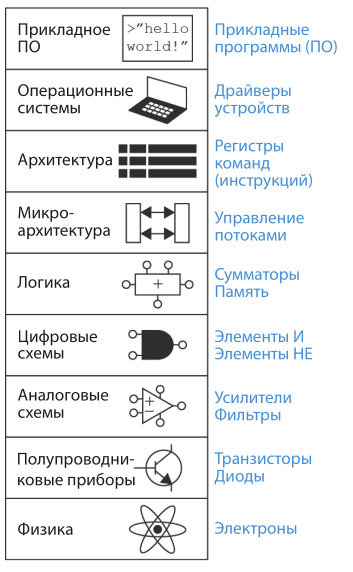

Предмет этой книги – уровни абстракции от цифровых схем до компьютерной архитектуры. Работая на каком-либо из этих уровней абстракции, полезно знать кое-что и об уровнях абстракции, непосредственно сопряженных с тем уровнем, где вы находитесь.


**Конструкторская дисциплина** – это преднамеренное ограничение самим конструктором выбора возможных вариантов разработки, что позволяет работать продуктивнее на более высоком уровне абстракции. Так как происходит избавление от уникальных решений (возможно даже лучших решений для конкретного места) подходящих только к конкретной реализации, в итоге остается набор который взаимозаменяем и подходит к различным вариантам и этот набор един им пользуются все.

Конструкторская дисциплина — это когда инженер специально ограничивает себя стандартными правилами и деталями, чтобы создавать сложные вещи проще, быстрее и надежнее.

Статическая дисциплина (static discipline). Принцип статической дисциплины требует, чтобы при условии наличия логически корректных сигналов на входе каждый элемент системы выдавал логически корректные сигналы на выходе.
При физической реализации цифровых схем на транзисторах, нужно соблюдать принцип статической дисциплины, потому что реальные аналоговые сигналы и разные логические элементы могут по-разному интерпретировать уровни напряжения (определение шума т.е. сигнал которые еще не достиг HIGH (Vdd) но уже не LOW (GND)).
Поэтому используются стандартизированные семейства логики у которых порог определения шума единый, например: TTL, CMOS, LVTTL, LVCMOS

**Иерархичность** – принцип иерархичности предполагает разделение системы на отдельные модули, а затем последующее разделение каждого такого модуля на фрагменты до уровня, позволяющего легко понять поведение каждого конкретного фрагмента.

**Модульность** – принцип модульности требует, что-бы каждый модуль в системе имел четко определенную функциональность и набор интерфейсов и мог быть легко и без непредвиденных побочных эффектов соединен с другими модулями системы.

**Регулярность/Единообразие** – принцип регулярности требует соблюдения единообразия при разработке отдельных модулей системы. Реализовано стандартное поведение не нарушающее основную суть применения, использования части системы.


---

## Глава 2. Разработка комбинационной логики


В следующих разделах будет описано, как вывести логическую функцию из любой таб­лицы истинности и как применять булеву алгебру и карты Карно для упрощения уравнений.

Дополнение (complement) переменной А – это ее отрицание $\overline{A}$ (¬A, !A, ~A). Переменная или ее дополнение называется литералом.

В логических функциях наибольший приоритет имеет операция НЕ, затем идет И, потом ИЛИ.

Оерация **И** (AND, логическое &&, побитовое &) над одним или несколькими литералами называется **конъюнкцией**, **произведением** (product) или импликантой. Минтерм (**minterm**, элементарная конъюнктивная форма) – это произведение (И), включающее все входы функции.

Операция **ИЛИ** (OR, логическое ||, побитовое |) над одним или более литералами называется **дизъюнкцией**, или **суммой**. Макстерм (**maxterm**, элементарная дизъюнктивная форма) – это сумма (ИЛИ) всех входов функции.

 

### Пример:

В серверной установлена система аварийного охлаждения.

Система включает вентилятор `F = 1`, если выполняется хотя бы одно из условий: температура слишком высокая (`T = 1`), либо обнаружен дым (`S = 1`).
Но вентилятор не должен включаться, если активирован режим обслуживания (`M = 1`).

Обозначения:
* `T` — высокая температура
* `S` — обнаружен дым
* `M` — режим обслуживания
* `F` — вентилятор включён

Требуется:
1. Построить таблицу истинности.
2. Вывести логическую функцию для `F`.
 
##### Заполняем таблицу истинности

Используем генерацию комбинаций всех возможных вариантов для трех входов, используя комбинаторику - размещения с повторениями, из 2 элементов (0,1) по 3 позиции (T, S, M) будет содержать $2^N$ строк т.е. $2^3=8$:

```rust, editable
fn generate_binary_sequences(n: usize) {
    let total = 1 << n; // 2^n комбинаций

    for i in 0..total {
        // выводим число как бинарную строку с ведущими нулями
        println!("{:0width$b}", i, width = n);
    }
}
fn main() {
    generate_binary_sequences(3);// 3 bit
}
```

Заполняем колонку `F (Y)`, сперва обрабатываем те ряды где `M = 1` мы ставим 0. Далее смотрим все ряды у которых либо `T = 1` либо `S = 1` и ставим 1, а все остальные ряды 0.

| T | S | M | F (Y) |
|---|---|---|---    |
|0|0|0| 0 |
|0|0|1| 0 |
|0|1|0| 1 |
|0|1|1| 0 |
|1|0|0| 1 |
|1|0|1| 0 | 
|1|1|0| 1 | 
|1|1|1| 0 |

Можно описать логическую функцию для любой таблицы истинности путем суммирования всех тех минтермов (дизъюнктивная форма), для которых выход Y имеет значение ИСТИНА (1).

| T | S | M | F (Y) | minterm |
|---|---|---|---    | ---     |
|0|0|0| 0 | - |
|0|0|1| 0 | - |
|0|1|0| **1** | $m_2=\overline{T}S\overline{M}$ |
|0|1|1| 0 | - | 
|1|0|0| **1** | $m_4=T\overline{S}\overline{M}$ |
|1|0|1| 0 | - |
|1|1|0| **1** | $m_6=TS\overline{M}$ |
|1|1|1| 0 | - |

Полная функция через минтермы (ИЛИ всех минтермов). Это называется СДНФ — совершенная дизъюнктивная нормальная форма `Sum of Products (SOP)`.

$F(T,S,M)=\sum{(m_2, m_4, m_6)} = \overline{T}S\overline{M} + T\overline{S}\overline{M} + TS\overline{M}$
 

> Минтермы — это «сырой» канонический вид, из которого потом получают компактную схему. Теперь можно применить булеву алгебру или карты Карно, для уменьшения количества логических операций не влияя на результат функции т.е. с эквивалентным результатом.

* Упрощаем используя булеву алгебру: 

    Смотрим на общие множители.

    Во всех трёх слагаемых есть: $\overline{M}$

    Выносим: $F= \overline{M} (\overline{T}S + T\overline{S}+TS)$

    Теперь смотрим внутрь скобок.

    Есть два члена: $\overline{T}S + TS$

    Тут есть общий множитель (S): $S(\overline{T}+T)$

    А: $\overline{T}+T = 1$

    поэтому: $S(\overline{T}+T)=S$

    Подставляем: $F=\overline{M}(S + T\overline{S})$

    Теперь используем важное правило поглощения: $S + T\overline{S} = S + T$

    **Результат**: $F=\overline{M}(S+T)$


#### Как упрощать функции «на автомате»

* Шаг 1

    Ищите общий множитель.

    Например: $AB + AC = A(B+C)$

* Шаг 2

    Ищите пары вида: $A + \overline{A} = 1$
    
    или: $A\overline{A}=0$
 
* Шаг 3

    Ищите поглощение: $A + AB = A$
    
    Например: $T + TS = T$

    потому что если (T=1), то (TS) уже ничего не меняет.

#### Альтернативный расчет через maxterm (конъюнктивная форма) 

Альтернативный способ выражения логических функций — это совершенная конъюнктивная нормальная форма (`Product of Sums, POS`).
 
Логическую функцию для любой таблицы истинности можно описать путем произведения (логического И) всех тех макстермов, для которых выход `Y` имеет значение ЛОЖЬ (0).

Правило построения макстерма:
* если значение переменной равно 0 — переменная записывается без отрицания;
* если значение переменной равно 1 — переменная записывается с отрицанием.


| T | S | M | F(Y) | minterm                         | maxterm                                      |
| - | - | - | ---- | ------------------------------- | -------------------------------------------- |
| 0 | 0 | 0 | **0**   | -                               | $M_0=T+S+M$                                  |
| 0 | 0 | 1 | **0**    | -                               | $M_1=T+S+\overline{M}$                       |
| 0 | 1 | 0 | 1    | $m_2=\overline{T}S\overline{M}$ | -                                            |
| 0 | 1 | 1 | **0**   | -                               | $M_3=T+\overline{S}+\overline{M}$            |
| 1 | 0 | 0 | 1    | $m_4=T\overline{S}\overline{M}$ | -                                            |
| 1 | 0 | 1 | **0**    | -                               | $M_5=\overline{T}+S+\overline{M}$            |
| 1 | 1 | 0 | 1    | $m_6=TS\overline{M}$            | -                                            |
| 1 | 1 | 1 | **0**    | -                               | $M_7=\overline{T}+\overline{S}+\overline{M}$ |

Полная функция через макстермы (И всех макстермов).

$F(T,S,M)=\prod(M_0,M_1,M_3,M_5,M_7) = (T+S+M) * (T+S+\overline{M}) * (T+\overline{S}+\overline{M}) * (\overline{T}+S+\overline{M}) * (\overline{T}+\overline{S}+\overline{M})$

после упрощения функции получим: $F=\overline{M}(S+T)$ т.е. тоже самое что и через построение функции минтермами. 

> Для 3–5 переменных карты Карно обычно проще и нагляднее, чем ручное применение булевой алгебры.

---

### Карта Карно

[Karnaugh Maps](https://learnabout-electronics.org/Digital/dig24.php)

Карты Карно – визуальный инструмент для минимизации функций от двух до четырех переменных.

> Никто из авторов книги тем не менее никогда не использовал карты Карно в реальной жизни для решения практических задач. Но понимание принципов, лежащих в основе карт Карно, крайне важно. Для больших задач программы логического синтеза намного эффективнее людей.

Количество клеток будет равно $2^N$, где N это количество переменных.

Карты Карно специально делают «квадратными», чтобы визуально видеть группы:
* где входы можно игнорировать
* какие переменные не влияют на результат

Общий принцип, если `k` переменных идут по вертикали, то остальные `n−k` по горизонтали, то размер: $2^k × 2^{n−k}$:
* для 2-х переменных размер таблицы из $2^2=4$ клеток (2x2)
* для 3-х переменных размер таблицы из $2^3=8$ клеток (2x4)
    * 1 переменная → строки и 2 переменные → столбцы
* для 4-х переменных размер таблицы из $2^4=16$ клеток (обычно 4x4)

Значения переменных для нумерации столбцов согласно коду Грея, чтобы соседние клетки отличались только одним битом: `00, 01, 11, 10`.

Составим карту Карно на основе нашей таблицы истинности: 

| T | S | M | F (Y) |
|---|---|---|---    |
|0|0|0| 0 |
|0|0|1| 0 |
|0|1|0| 1 |
|0|1|1| 0 |
|1|0|0| 1 |
|1|0|1| 0 | 
|1|1|0| 1 | 
|1|1|1| 0 |

Будем по очереди смотреть на каждый ряд из таблицы и заносить в карту.

Распределим переменные:
* строки → `T`, это реальные значения переменной `T`
* столбцы → `SM`, это реальные значения пары переменных `S,M`
    * например подпись `01` это `S=0, M=1`. Но порядок их размешения в карте, согласно коду Грея.
* значения в ячейках это `Y` из таблицы истинности   

Пустая карта:  

| $T/SM$ | 00 | 01 | 11 | 10 |
| ----------------- | -- | -- | -- | -- |
| 0                 |    |    |    |    |
| 1                 |    |    |    |    |

* Например:
    
    для строки из таблицы истинности

    | T | S | M | F (Y) |
    |---|---|---|---    |
    |  1|  0|  1|     0 | 

    карта будет выглядеть так:
    * T=1 и S=0, M=1 при Y=**0**

    | $T/SM$ | 00 | 01  | 11 | 10 |
    | ----------------- | -- | --  | -- | -- |
    | 0                 |    |     |    |    |
    | 1                 |    |**0**|    |    |


Заполняем всю карту:

| $T/SM$ | 00  | 01  | 11  | 10  |
| ---    | --- | --- | --- | --- |
| 0      |  0  |  0  |  0  |  1  |
| 1      |  1  |  0  |  0  |  1  |

Следующий шаг - группировка единиц:

Группа должна быть:
* размер 1, 2, 4, 8, 16... (степени двойки)
* прямоугольник (любую группу клеток, которая образует прямоугольный блок в сетке (с учётом оборачивания)), 
* можно «оборачивать края» (Крайний столбец `10` и первый столбец `00` считаются соседними)

Первая группа единиц:

| $T/SM$ | 00  | 01  | 11  | 10  |
| ---    | --- | --- | --- | --- |
| 0      |  0  |  0  |  0  |**1**|
| 1      |  1  |  0  |  0  |**1**|

Отмечаем, то что не меняется мы учитываем, а что меняется мы отбрасываем. Для этой вертикальной группы значения `S` и `M` не меняются, а `T` меняется, следовательно берем S=1 и M=0: $S\overline{M}$. 

Вторая группа единиц:

| $T/SM$ | 00  | 01  | 11  | 10  |
| ---    | --- | --- | --- | --- |
| 0      |  0  |  0  |  0  |  1  |
| 1      |**1**|  0  |  0  |**1**|

Не меняется `T` и `M`,а `S` мы отбрасываем так как оно меняется, следовательно берем T=1 и M=0: $T\overline{M}$

По итогу двух групп $S\overline{M}$ и $T\overline{M}$ имеем функцию описывыющую поведение цифровой схемы: $F= S\overline{M} + T\overline{M} = \overline{M}(S+T)$

Переводим функцию в схему (где сумма (`+`) это `OR`, а произведение (`*`) это `AND`):

```
S ─┐
   ├─ OR ─┐
T ─┘      │
          ├─ AND ─ F
   ¬M   ──┘
```

---

Шины на основе буферов с тремя состояниями когда-то были очень распространенными. Но в современных компьютерах высокие скорости передачи возможны только при соединении микросхем друг с другом напрямую (point-to-point), а не с помощью общей шины.

## Глава 3. Разработка последовательностной логики


Значение на выходе последовательностной логической схемы зависит как от текущих, так и от предыдущих входных значений, следовательно, последовательностные логические схемы обладают памятью. Последовательностные логические схемы могут явно запоминать предыдущие значения определенных входов, а могут «сжимать» предыдущие значения определенных входов в меньшее количество информации, называемое состоянием системы. Состояние цифровой последовательностной схемы – набор битов, называемый переменными состояния. Эти биты содержат всю информацию о прошлом, необходимую для определения будущего поведения схемы.

### 3.4. Конечные автоматы

Используйте следующую последовательность действий для создания конечных автоматов:
* определите входы и выходы;
* разработайте диаграмму переходов;
* для автомата Мура:
    * составьте таблицу переходов;
    * составьте таблицу выходов;
* для автомата Мили:
    * составьте объединенную таблицу выходов и переходов;
* выберите метод кодирования состояний – выбранный метод повлияет на схемотехническую реализацию;
* составьте логические выражения для следующего состояния и для выходной комбинационной схемы;
* разработайте принципиальную схему.


#### Конечный автомат, светофор 
Светофор с 3-мя состояниями.

Для трех состояний достаточно двух бит ($2^2=4$ состояния) т.е. два D-trigger с выходами $Q_0$ и $Q_1$:
* `00` - зелёный (`NOT Q0 AND NOT Q1`), обозначим как `S0`
* `01` - жёлтый (`NOT Q0 AND Q1`), обозначим как `S1`
* `10` - красный (`Q0 AND NOT Q1`), обозначим как `S2`
* `11` - не используется

Логика переходов:
1. `S0 → S1` т.е. с `00` нужно получить `01`
2. `S1 → S2` т.е. с `01` нужно получить `10`
3. `S2 → S0` т.е. с `10` нужно получить `00`


| переход | $Q_0$ | $Q_1$ | next $Q_0$ | next $Q_1$ |
|----|----|----|---------|---------|
| `S0 → S1` | 0  | 0  | 0       | **1** |
| `S1 → S2` | 0  | 1  | **1**       | 0 |
| `S2 → S0` | 1  | 0  | 0       | 0 |
| не используется | 1  | 1 | X  | X |

Выводим формулы переходов:

Значение **$next\ Q_1 = 1$** только в одной строке, поэтому можем для него написать формулу состояния
* **$next\ Q_1 = (Q_0 = 0)\ AND\ (Q_1 = 0) = NOT\ Q_0\ AND\ NOT\ Q_1$** (совпадает с формулой для зелёного цвета светофора)

И состояние $next\ Q_1 = 1$ так же уникально, 
* $next\ Q_0 = (Q_0 = 0)\ AND\ (Q_1 = 1) = NOT\ Q_0\ AND\ Q_1$


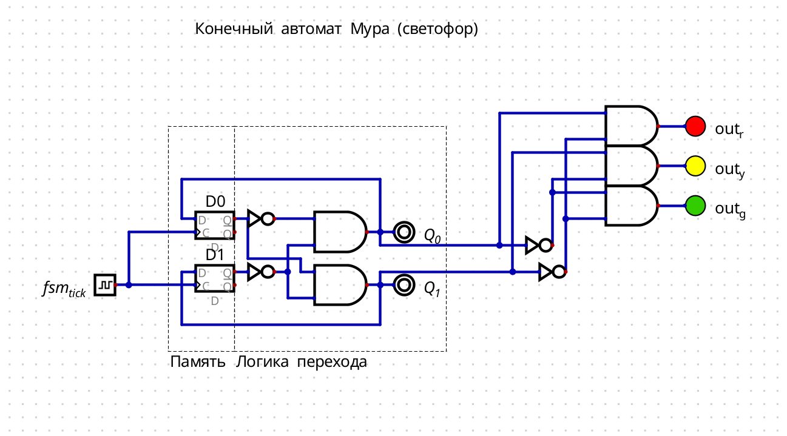

#### Конечный автомат, светофор с временным итервалом переключения
 
Состояние меняться не каждый тик, а только когда счётчик насчитал нужное число (время работы светофора):
* Зелёный — горит 10 тиков
* Жёлтый — горит 3 тика
* Красный — горит 6 тиков

Новое состояние должно переключаться только после того как проходит определенное время его работы. Для этого мы добавляем счетчик тиков и comparator'ы которые сравнивают текущее значение счетчика со значениями одного из трех состояний. Так же, что бы логика переключения не на каждый тик переключала следующее состояние, мы сохраняем в память D-trigger его прошлое состояние либо состояние после логики перехода если пришел сигнал переключения.

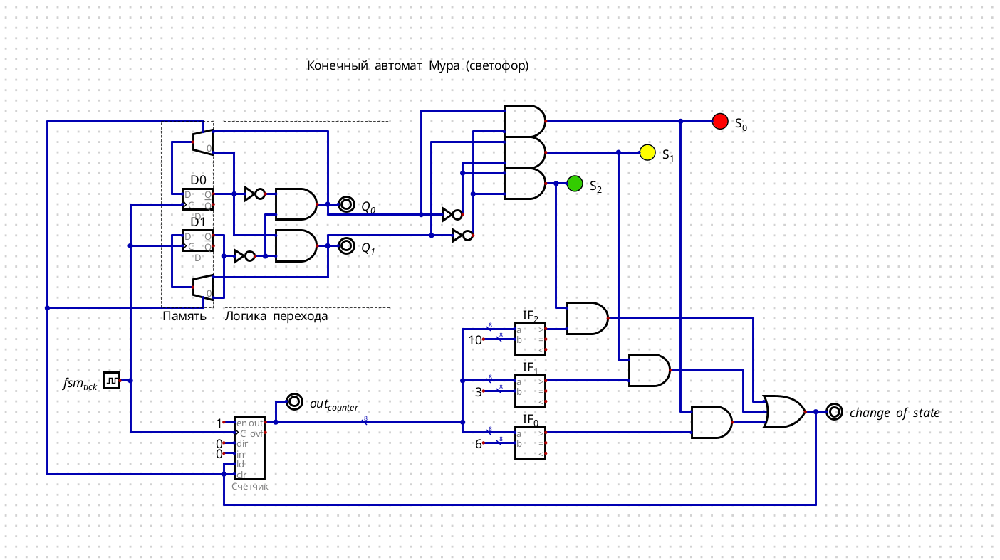

[Схема FSM (светофор) для Digital (Digital Logic Designer от Helmut Neemann)](img/harris/FSM.dig)
 

#### Конечный автомат, перекрёсток

Нужно управлять двумя светофорами одновременно:
* Дорога A  
* Дорога B  

Нельзя, чтобы обе дороги имели зелёный одновременно.

Состояние отвечает сразу за два светофора на дороге A и на дороге B (на одной дороге два светофора дублируют друг друга):

| Состояние | Q0 | Q1 | Дорога A | Дорога B |
|-----------|----|----|----------|----------|
| S0 | 0 | 0 | ЗЕЛЁНЫЙ | КРАСНЫЙ |
| S1 | 0 | 1 | ЖЁЛТЫЙ | КРАСНЫЙ |
| S2 | 1 | 0 | КРАСНЫЙ | ЗЕЛЁНЫЙ |
| S3 | 1 | 1 | КРАСНЫЙ | ЖЁЛТЫЙ |

<br>
Так же появилось четвертое состояние:

| переход | $Q_0$ | $Q_1$ | next $Q_0$ | next $Q_1$ |
|----|----|----|---------|---------|
| `S0 → S1` | 0  | 0  | 0       | 1 |
| `S1 → S2` | 0  | 1  | 1       | 0 |
| `S2 → S3` | 1  | 0  | 1       | 1 |
| `S3 → S0` | 1  | 1  | 0       | 0 |

Выведем формулы состояния для построения схемы логики перехода. 

Для next $Q_0 = 1$ когда: 
* $(NOT\ Q_0\ AND\ Q_1)\ OR\ (Q_0\ AND\ NOT\ Q_1)$

Для next $Q_1 = 1$ когда: 
* $(NOT\ Q_1 AND\ NOT\ Q_0)\ OR\ (Q_0\ AND\ NOT\ Q_1) = NOT\ Q_1$
    * выносим за скобку общее $NOT\ Q_1$, получаем $NOT\ Q_1\ AND\ ((NOT\ Q_0)\ OR\ (Q_0))$
    * далее $(NOT\ Q_0) OR\ (Q_0)$ это 1, сокращается. 
    * остается $NOT\ Q1\ AND\ 1 = NOT\ Q1$

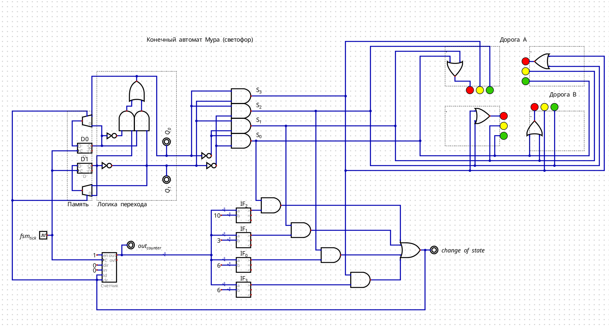

[Схема FSM (светофор) для Digital (circuit simulator)](img/harris/FSM2.dig)

#### Параллелизм

В пространственном параллелизме используется несколько копий аппаратных блоков, так что в одно и то же время можно выполнять несколько задач. Временной параллелизм предполагает разделение задачи на несколько стадий (или ступеней), как это происходит на сборочном конвейере. Несколько задач могут быть распределены по стадиям. Хотя все задачи должны пройти по всем стадиям, разные задачи в любой заданный момент времени будут находиться на своей стадии, так что несколько задач могут одновременно обрабатываться на разных стадиях. Временной параллелизм часто называется конвейеризацией. Пространственный параллелизм нередко называют просто параллелизмом.

Конвейеризация (временной параллелизм) особенно привлекательна, поскольку она увеличивает скорость работы схемы без увеличения аппаратных затрат. Вместо этого регистры, установленные между блоками комбинационной логики, разделяют ее на короткие стадий, которые могут работать на более высокой тактовой частоте. Регистры не позволяют токенам, находящимся на одной стадии, догонять и разрушать токены, которые находятся на следующей стадии обработки.

Использование параллелизма ограничивается взаимозависимостями (dependencies) реальных задач. Если текущая задача зависит от результатов предыдущей задачи, а не только от своих предыдущих шагов, то выполнение задачи не может быть начато до завершения предыдущей задачи.

Общая производительность системы измеряется задержкой и пропускной способностью. Задержка – это время, необходимое для прохождения одного токена с входа системы на ее выход. Пропускная способность – количество токенов, которое система может обработать в единицу времени. Параллелизм увеличивает пропускную способность системы.


## Языки описания аппаратуры (HDL)

[создание арх. RV32I на языке VHDL](https://youtube.com/playlist?list=PLeVWfsKqC7rN0b9k1TaQej1kG4wkKPtTJ&si=UNh1rDBjltmsTekf)
 

В 1990-е годы разработчики обнаружили, что их производительность труда резко возрастала, если они работали на более высокомvуровне абстракции, определяя только логическую функцию и предоставляя создание оптимизированных логических схем системе автоматического проектирования (САПР). Два основных языка описания аппаратуры (Hardware Description Language, HDL) – SystemVerilog и VHDL.

Две основные цели HDL – моделирование и синтез цифровых схем. 
* Моделирование – мощный способ протестировать систему на компьютере, перед тем как она превратится в аппаратуру. Среда моделирования позволяет проверить те значения сигналов в системе, которые могут быть недоступны для измерения на реальной электрической схеме.
* Логический синтез превращает код на HDL в цифровые логические схемы.

Начинайте с эскиза блочной диаграммы системы, определяя, какие ее части являются комбинационной логикой, а какие – последовательностными схемами или конечными автоматами и т. д. Затем ведите разработку для каждой части на HDL, используя правильные конст­рукции для нужного типа аппаратуры.


**VHDL** (имеет расширение `.vhd`) (VHSIC (Very High Speed Integrated Circuits) Hardware Description Language) более мощный чем SystemVerilog (имеет расширение `.sv`). 

Но если мы говорим именно про экосистему Yosys и открытые инструменты (Open-Source), то Verilog представлен несопоставимо лучше, чем VHDL.

Для Yosys язык Verilog является «родным» (native). Yosys изначально создавался Клэр Вольф именно как Verilog HDL Synthesis Tool.

Внутри Yosys встроен мощный парсер Verilog (стандарт Verilog-2005). Ему не нужны никакие внешние костыли или сторонние утилиты. Вы просто пишете read_verilog file.v, и Yosys мгновенно и без потерь переводит код во внутреннее представление.
Поскольку парсер родной, Yosys идеально сохраняет все оригинальные имена модулей, сигналов и экземпляров. Соответственно, графические вьюверы (включая TerosHDL) гораздо чище и адекватнее отображают схемы, собранные из Verilog.

А вот VHDL, Yosys сам по себе «не понимает». Чтобы прочитать VHDL-код, ему жизненно необходим внешний плагин-переводчик (в Вашем случае — это симулятор GHDL). GHDL сначала компилирует VHDL в своё промежуточное дерево, а затем плагин пытается перевести это дерево на язык, понятный для Yosys. Из-за этого строгого и сложного перевода VHDL-идентификаторы искажаются (mangling), шины бьются на отдельные биты, а типы данных обрастают суффиксами. Флаг `--rename` как раз и был создан, чтобы хоть как-то чистить этот мусор после GHDL.

Когда Yosys успешно разбирает код (неважно, написан он на Verilog или на VHDL), он переводит его на свой внутренний язык - RTLIL (RTL Intermediate Language), он использует обозначения по типу `$mux` — абстрактный мультиплексор или `$and` / `$or` — базовые логические вентили, `$add` — сумматор.

<details>
<summary> TerosHDL - расширение HDL для Vscode </summary>

[Предварительные требования (terostechnology.github.io)](https://terostechnology.github.io/terosHDLdoc/docs/installation_checklist/installation)


```bash
# Создать HDL environment
python3 -m venv ~/.venvs/hdl

# Активировать:
source ~/.venvs/hdl/bin/activate

# Установить:
pip install cocotb vsg vunit_hdl edalize

# Проверка:
python -c "import cocotb, vsg, vunit, edalize; print('ok')"

# В настройках TerosHDL поменять PATH python:
/home/jeka/.venvs/hdl/bin/python


# Verify Setup
⊙ Checking Python dependencies. Current configured installation path: "/home/$USER/.venvs/hdl/bin/python"
  🎉 vunit found.
  🎉 edalize found.
  🎉 cocotb (optional) found.
  🎉 vsg (optional) found.
```


Альтернативный вариант для yowasp-yosys и vunit-hdl:
```bash
# Установка pipx, если еще не установлен
sudo apt install pipx
pipx ensurepath

# Установка пакетов
pipx install yowasp-yosys
pipx install vunit-hdl
pipx install edalize
```


> Установите ваши любимые инструменты: Quartus Pro, ModelSim, Yosys, GHDL, Vivado... Для инструментов с открытым исходным кодом мы рекомендуем загрузить OSS CAD Suite ( https://github.com/YosysHQ/oss-cad-suite-build/releases ). OSS CAD Suite — это бинарный дистрибутив программного обеспечения для ряда программ с открытым исходным кодом, используемых в проектировании цифровой логики. Вы найдете инструменты для RTL-синтеза, формальной верификации оборудования, размещения и трассировки, программирования FPGA и тестирования с поддержкой языков описания аппаратуры, таких как Verilog, Migen и Amaranth.

```bash
https://github.com/YosysHQ/oss-cad-suite-build/releases

download oss-cad-suite-linux-x64-20260520.tgz

mkdir -p ~/.local/share/oss-cad-suite
tar -xvf ~/Downloads/oss-cad-suite-linux-x64-20260520.tgz -C ~/.local/share/oss-cad-suite --strip-components=1

# Чтобы система знала, где искать исполняемые файлы, нужно добавить путь к папку `bin` в ваш файл конфигурации терминала (`.bashrc` или `.zshrc`):

echo 'export PATH="$HOME/.local/share/oss-cad-suite/bin:$PATH"' >> ~/.bashrc
source ~/.bashrc

echo 'export PATH="$HOME/.local/share/oss-cad-suite/bin:$PATH"' >> ~/.zshrc
source ~/.zshrc

# Проверка
➜  ~ yosys --version
Yosys 0.65+51 (git sha1 5c6de0446, clang++ 18.1.8 -fPIC -O3)

➜  ~ ghdl --version
GHDL 7.0.0-dev (6.0.0.r149.g74fb7c9ea.dirty) [Dunoon edition]
 Compiled with GNAT Version: 10.5.0
 llvm 14.0.0 code generator
Written by Tristan Gingold.

Copyright (C) 2003 - 2026 Tristan Gingold.
GHDL is free software, covered by the GNU General Public License.  There is NO
warranty; not even for MERCHANTABILITY or FITNESS FOR A PARTICULAR PURPOSE.

```

**GHDL** — ваш главный компилятор и симулятор для VHDL. Именно он сейчас просчитывает файл test.vhd.

**Yosys** — синтезатор. Он превращает текстовый код VHDL/Verilog в логические вентили (из него вы получаете схемы в Schematic Viewer).

**VUnit** — библиотека для автоматизации тестирования, которую мы только что установили через pip. Она помогает запускать сотни тестов одной кнопкой.

### Проверить настройки:

откройте палитру команд vscode `Ctrl + Shift + P` и введите `verifySetup`

Нам нужно вручную указать расширению, где лежат бинарные файлы из архива OSS CAD Suite.

Похоже, расширение TerosHDL полностью игнорирует параметр "terosHDL.pythonPath" в файле конфигурации и упрямо продолжает использовать системный путь (в логе четко написано: Using "/usr/bin/python"). Это известная проблема некоторых версий данного расширения, когда оно берет интерпретатор из системного окружения PATH, а не из внутренних настроек.

Раз оно использует системный /usr/bin/python, давайте установим зависимости (vunit и edalize) прямо туда, обойдя блокировку операционной системы.

Поскольку этот Python изолирован (PEP 668), мы применим флаг --break-system-packages. 

Выполните в терминале следующую команду:

`sudo pip install vunit-hdl edalize --break-system-packages`

### Для визулизации `Schematic Viewer` 

Выберите в настройках расширения `Select the backend: GHDL + Yosys (VHDL+Verilog/SV)`

### Для тестирования Waveform (временная диаграмма) — это ваш главный инструмент отладки.

Поскольку вы не можете подключить физические приборы к коду в компьютере, Waveform показывает, как ведут себя электрические сигналы внутри вашей схемы во времени.
 
TestBench содержит код, который подает воздействия на входы модуля и проверяет правильность значений его выходов, а также выводит несоответствия между ожидаемыми и действительными значениями.

* создать проект и добавить в него файлы `.vhd`
* создаст основу для теста `TerosHDL: Generate Testbench`, то что скопировалось в буффер обмена вставить в новый файл и выбрать его главным toplevel


```
---> Build directory: $HOME.teroshdl/build
---> Make installation folder path: System path
Entering directory '$HOME.teroshdl/build'
Leaving directory '$HOME.teroshdl/build'
Entering directory '$HOME.teroshdl/build'
Leaving directory '$HOME.teroshdl/build'
```

Запуск симуляции и просмотр графиков временных диаграмм (Waveform Viewer)

```bash
# 1. Запускаем симуляцию нашего тестбенча и сохраняем сигналы в файл waveforms.vcd
~/.teroshdl/build/sillyfunction_tb --vcd=waveforms.vcd

# 2. Открываем графики во встроенном в ваш OSS CAD Suite просмотрщике GTKWave
~/.local/share/oss-cad-suite/bin/gtkwave waveforms.vcd &
 
```

Когда откроется графическое окно программы **GTKWave**:

1. В верхнем левом углу в окне **SST** нажмите на название вашего тестбенча `sillyfunction_tb`.
2. Чуть ниже, в появившейся структуре, нажмите на экземпляр вашего модуля: `sillyfunction_inst`.
3. В соседнем окне (ниже, под заголовком **Signals**) появятся все порты вашей функции: `a`, `b`, `c`, `y`.
4. Выделите их все (зажмите `Shift` или `Ctrl`) и нажмите кнопку **Append** в самом низу этого блока.

</details>


#### Подключение файла VHDL в симуляторе Digital для тестирования компонента:
* В глобальных настройках Digital прописать путь к GHDL (компилятор, симулятор VHDL)
* Добавить пустой компонент VHDL External File на панель
* В настройках компонента прописать:
    * label должен совпадать с именем entity компонента
    * прописать inputs, outputs параметры
    * выбрать пусть к файлу с кодом VHDL `.vhd`
    * выбрать компилятор GHDL

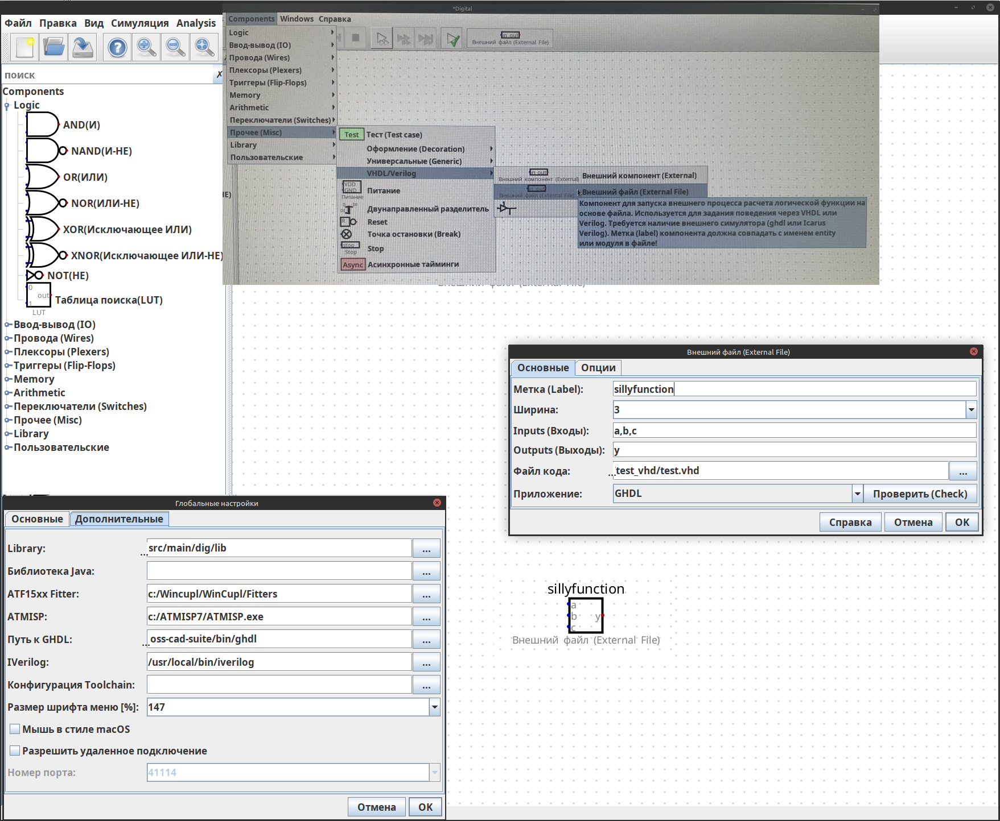

---

Одна из главных ошибок начинающих заключается в том, что они думают о коде на HDL как о компьютерной программе где идет интрепретация кода сверху вниз, а не как об **описании** цифровой аппаратуры. Если вы не представляете, хотя бы примерно, во что должен синтезироваться ваш код на HDL, то, скорее всего, результат вам не понравится. Ваша цифровая схема может получиться гораздо больше, чем нужно, или может оказаться, что ваш код моделируется правильно, но не может быть реализован в аппаратуре. Вместо этого вы должны думать над вашей разработкой в терминах блоков комбинационной логики, регистров и конечных автоматов.

Код на VHDL состоит из трех частей: 
* объявления используемых библиотек и внешних объектов (library, use), 
* объявления интерфейса объекта (entity). В объявлении интерфейса указывается имя модуля и перечисляются его входы и выходы.
* и внутренней структуры (architecture) интерфейса объекта. Блок architecture определяет, что модуль делает.


`STD_LOGIC` - тип цифрового сигнала, принимают значения '0', '1', 'z', 'x' и 'u'. Определен в библио­теке `IEEE.STD_LOGIC_1164`
 
`STD_LOGIC_VECTOR` - тип шины:
 * `STD_LOGIC_VECTOR(3 downto 0)` - 4-бит­ная шина, с порядком little-endian, биты от старшего к младшему: a(3), a(2), a(1) и a(0).
 * `STD_LOGIC_VECTOR(0 to 3)` - 4-бит­ная шина, с порядком big‐endian, биты от младшего к старшему: a(0), a(1), a(2) и a(3)


### Комбинационная логика. Битовые операторы

Пример 4-х битный инвертор.

Файл inv.vhd:

```vhdl
library IEEE;
use IEEE.STD_LOGIC_1164.all;

entity inv is
  port (
    a : in std_logic_vector(3 downto 0);
    y : out std_logic_vector(3 downto 0));
end;

architecture synth of inv is
begin
  y <= not a;
end;
```

Тестирование кода vhdl из файла inv.vhd в симуляторе Digital:

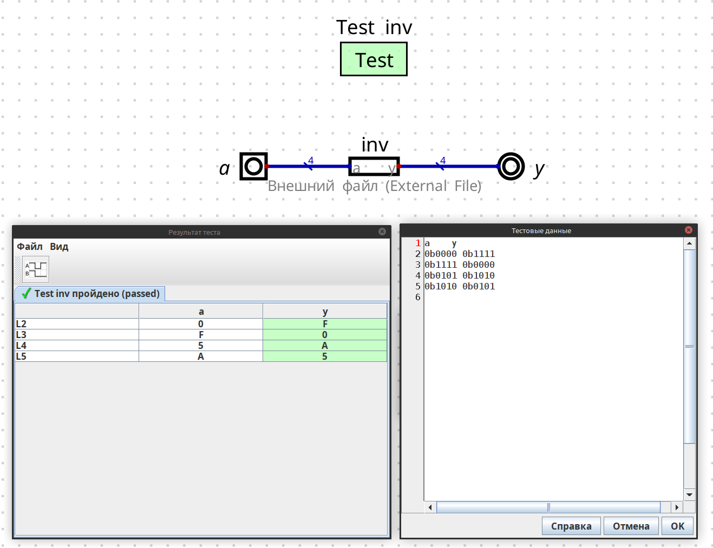

[Схема inv для Digital (Digital Logic Designer от Helmut Neemann)](img/harris/inv.dig)


[Альтернативный вариант реализации инвертора](#И-снова-комбинационная-логика) с помощью оператора `process`. Хотя оператор `process` применяется для последовательностных схем (память) его можно использовать и для комбинационной логики, если список чувствительности описан так, чтобы отвечать на любое изменение входных сигналов, и тело оператора определяет значение выходного сигнала при любой комбинации значений входов.

 
---

Пример gates. 

NOT, XOR и OR – это примеры операторов в языке VHDL

Файл gates.vhd:
```vhdl
library IEEE;
use IEEE.STD_LOGIC_1164.all;
entity gates is
  port (
    a, b : in std_logic_vector(3 downto 0);
    y1, y2, y3, y4,
    y5 : out std_logic_vector(3 downto 0));
end;

architecture synth of gates is
begin
  -- пять разных двухвходовых ЛЭ
  -- работают на 4-битных шинах
  y1 <= a and b;
  y2 <= a or b;
  y3 <= a xor b;
  y4 <= a nand b;
  y5 <= a nor b;
end;
```

TerosHDL: Schematic Viewer

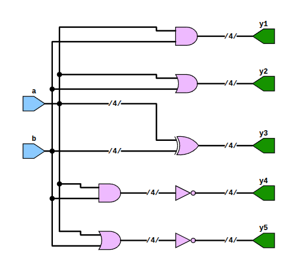

Тестирование кода vhdl из файла gates.vhd в симуляторе Digital:

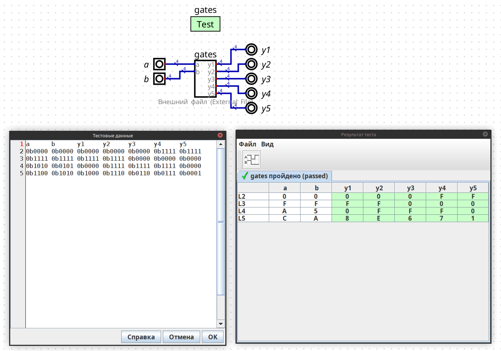

[Схема gates для Digital (Digital Logic Designer от Helmut Neemann)](img/harris/gates.dig)

---

### Комбинационная логика. Операторы сокращения

Операторы сокращения соответствуют многовходовым элементам, работающим на одной шине.

Многовходовый XOR — это классический генератор нечетности (parity checker). Если на входах схемы нечетное число единиц (например, одна, три или пять), на выходе всегда будет строго '1' (ИСТИНА). Если единиц четное количество (или все нули) — на выходе будет '0'.
  
```vhdl
library IEEE;
use IEEE.STD_LOGIC_1164.all;

entity and8 is
  port (
    a : in std_logic_vector(7 downto 0);
    y : out std_logic);
end;
architecture synth of and8 is
begin
  y <= and a;
  /* 
   "and a" записать гораздо проще, чем:
    y <= a(7) and a(6) and a(5) and a(4) and a(3) and a(2) and a(1) and a(0);
  */
end;
```

---

### Комбинационная логика. Условное присваивание

Пример: двухвходовый мультиплексор `MUX`, использующий условное присваивание сигнала для выбора одного из двух 4-битных входов.

Файл mux2.vhd:

```vhdl
library IEEE;
use IEEE.STD_LOGIC_1164.all;

entity mux2 is
  port (
        d0, d1 : in std_logic_vector(3 downto 0);
        s : in std_logic;
        y : out std_logic_vector(3 downto 0)
    );
end;

architecture synth of mux2 is
begin
  y <= d1 when s else d0;
  -- если s имеет значение 1 то на выход направить сигнал с d1, иначе y с d0
end;
```

Тестирование кода vhdl из файла mux2.vhd в симуляторе Digital:

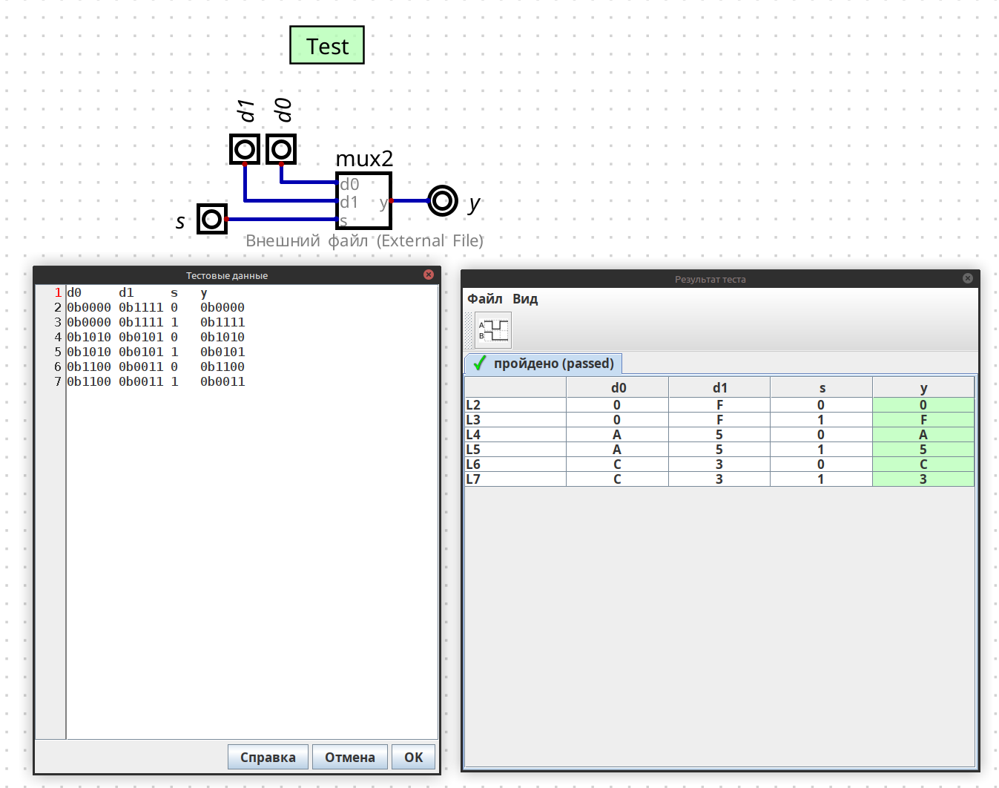
 
VHDL также поддерживает операторы выборочного присваивания сигнала для обеспечения более краткой записи, когда выбирается одна из нескольких возможностей. Это аналогично использованию операции `switch/case` вместо нескольких операций `if/else` в некоторых языках программирования.

Файл mux4.vhd:

```vhdl
library IEEE;
use IEEE.STD_LOGIC_1164.all;
entity mux4 is
  port (
    d0, d1, d2, d3 : in std_logic_vector(3 downto 0);
    s : in std_logic_vector(1 downto 0);
    y : out std_logic_vector(3 downto 0)
  );
end;

architecture synth1 of mux4 is
begin
  y <= d0 when s = "00" else
       d1 when s = "01" else
       d2 when s = "10" else
       d3;
end;
```

Четырех­входовый мультиплексор может быть переписан с использованием выборочного присваивания сигнала следующим образом:
```vhdl
architecture synth1 of mux4 is
begin
  with s select y <=
    d0 when "00",
    d1 when "01",
    d2 when "10",
    d3 when others;
end;
```

TerosHDL: Schematic Viewer

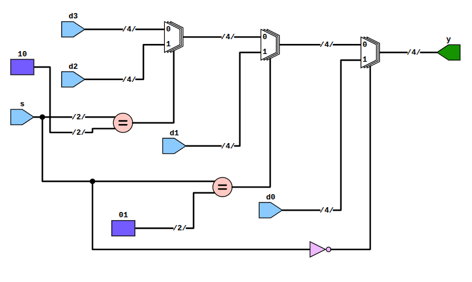

Тестирование кода vhdl из файла mux4.vhd в симуляторе Digital:

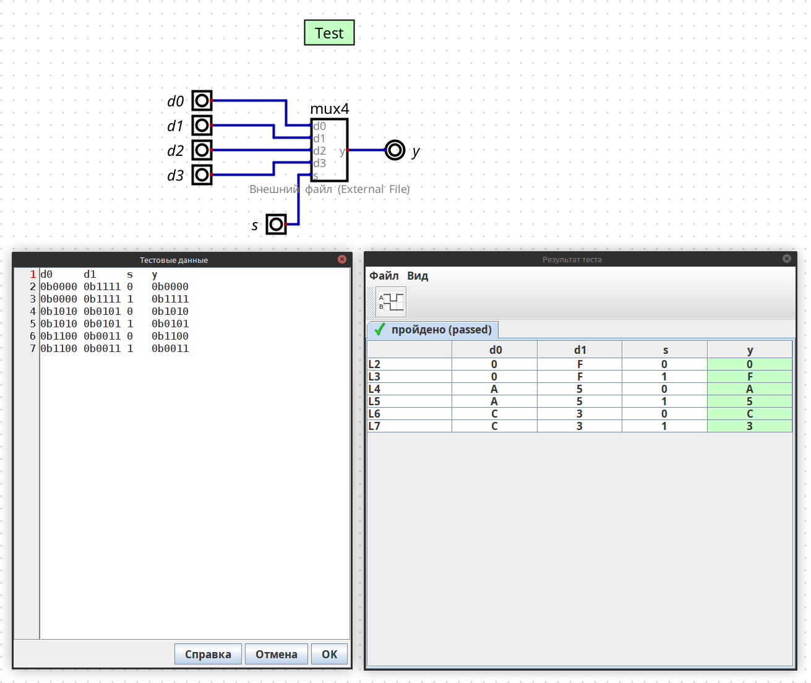
 
[Схема MUX4 для Digital (Digital Logic Designer от Helmut Neemann)](img/harris/mux4.dig)

---

### Комбинационная логика. Внутренние переменные

Операции присваивания в HDL (`assign` в языке SystemVerilog и `<=` в VHDL) выполняются параллельно. Это отличается от традиционных языков программирования, таких как `C` или `Java`, в которых операторы выполняются в том порядке, в котором они записаны. В HDL порядок записи не имеет значения. 

Пример: Полный сумматор.

Файл fulladder.vhd:
```vhdl
library IEEE;
use IEEE.STD_LOGIC_1164.all;
entity fulladder is
  port (
    a, b, cin : in std_logic;
    s, cout   : out std_logic
  );
end;

architecture synth of fulladder is
  signal p, g : std_logic; -- внутренние переменные
begin
  p    <= a xor b;
  g    <= a and b;
  s    <= p xor cin;
  cout <= g or (p and cin); -- скобки для приоритета операции
end;
```

TerosHDL: Schematic Viewer

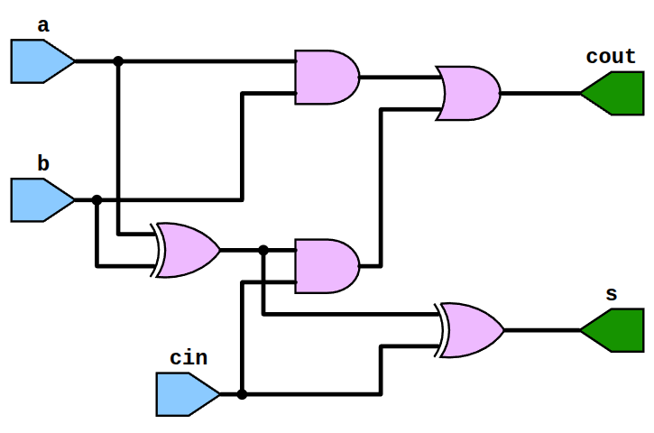

Тестирование кода vhdl из файла fulladder.vhd в симуляторе Digital:

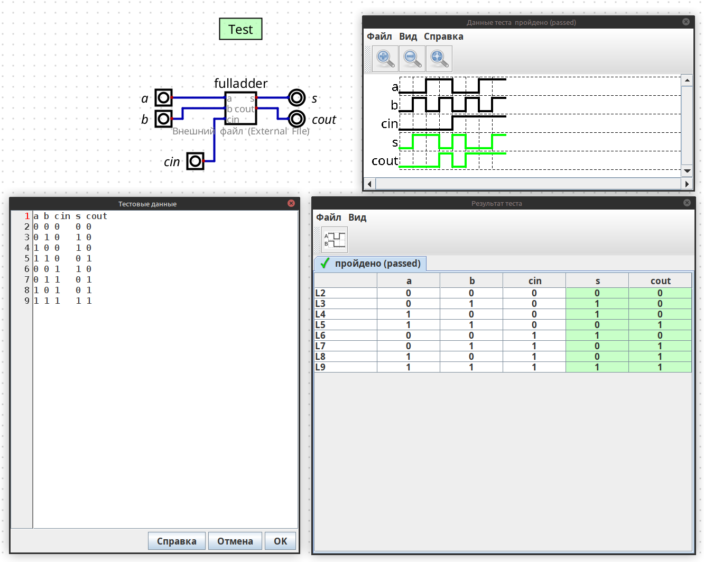

[Схема fulladder для Digital (Digital Logic Designer от Helmut Neemann)](img/harris/fulladder.dig)

 
[Альтернативный вариант реализации fulladder](#И-снова-комбинационная-логика) с помощью оператора `process`.

  
### Комбинационная логика. Числа

В отличие от SystemVerilog, язык VHDL – со строгой типизацией, что защищает пользователя от некоторых ошибок, но временами он неуклюж. Несмотря на то что тип `STD_LOGIC` принципиально важен, он не встроен в язык VHDL, а является частью библиотеки `IEEE.STD_LOGIC_1164`. Из-за этого в каждом файле должны быть операторы подключения биб­лиотеки.

Кроме того, в `IEEE.STD_LOGIC_1164` отсутствуют базовые операции типа сложения, сравнения, сдвигов и преобразования в целые из данных типа `STD_LOGIC_VECTOR`. Их, в конце концов, добавили в стандарте `VHDL 2008` в библиотеку `IEEE.NUMERIC_STD_UNSIGNED`.

В VHDL также есть тип `BOOLEAN` с двумя значениями: true и false. Значения типа `BOOLEAN` возвращаются операциями сравнения (например, сравнения на равенство, `s = '0'`) и используются в условных операторах, как when и if. В стандарте `VHDL 2008` тип `BOOLEAN true` эквивалентно `STD_LOGIC '1'`, а `BOOLEAN false` эквивалентно `STD_LOGIC '0'`. Хотя мы не объявляем никаких сигналов типа `BOOLEAN`, они автоматически являются результатом сравнения из сравнений и используются в условных операторах.

В VHDL есть тип `INTEGER` для представления целых чисел со знаком. Сигналы типа `INTEGER` могут принимать значения от $–(2^{31} – 1)\ до\ 2^{31} – 1$. В качестве индексов массивов нужно использовать целые числа, которые имеют тип `INTEGER`. Для индексации нельзя использовать сигнал типа `STD_LO­GIC` или `STD_LOGIC_VECTOR`, поэтому нужно преобразовать его в `INTE­GER`, как показано ниже в примере восьмивходового мультиплексора, выбирающего один бит из вектора с помощью трехбитного индекса. Функция `TO_INTEGER`, определенная в библиотеке `IEEE.NUMERIC_STD_UNSIGNED`, преобразует из `STD_LOGIC_VECTOR` в неотрицательные значения `INTEGER`.


```vhdl
library IEEE;
use IEEE.STD_LOGIC_1164.all;
use IEEE.NUMERIC_STD_UNSIGNED.all;

entity mux8 is
  port(
    d: inSTD_LOGIC_VECTOR(7 downto 0);
    s: inSTD_LOGIC_VECTOR(2 downto 0);
    y: out STD_LOGIC);
end;
architecture synth of mux8 is
begin
  y <= d(TO_INTEGER(s));
end;
```

VHDL также **строг** в отношении портов типа `out:` их можно использовать исключительно в качестве выходов. Для решения этой проблемы в VHDL есть отдельный тип порта `: buffer`. Сигнал, подключенный к такому порту, ведет себя как выход, но также может быть использован внутри модуля.

---

В VHDL числа STD_LOGIC записываются в бинарном коде и заключаются в одинарные кавычки: '0' и '1' указывают на логические уровни 0 и 1.

Формат объявления констант типа `STD_LOGIC_VECTOR` следующий: 
* `NB"value"`
    * N – размер в битах. Если размер не указан, то предполагается, что число имеет размер, соответствующий количеству битов значения.
    * В – буква, указывающая на основание. Если основание опущено, то по умолчанию оно равно `B` т.е. 2.
        * B - для основание 2
        * 0 - для основание 8
        * D – для основания 10
        * X – для основания 100
    * value – значение

others = '0' и others = '1' – конструкции VHDL с заполнением всех битов нулями или единицами соответственно.    

Например:
* 3B"101" - это двоичная запись 101
* B"101" - это двоичная запись 101
* "101" - это двоичная запись 101
* 3D"6" - это 6 в десятичной форме
* X"AB" - это запись с основание 16

---

Пример показывает, как обозначаются сигналы, представляющие **числа со знаком**.

В VHDL для выполнения арифметичес­ких операций и операций сравнения над `STD_LOG­IC_VECTOR` используется библиотека `NUMER­IC_STD_UNSIGNED`. При этом векторы считаются беззнаковыми.

```vhdl
-- 4.33(a): беззнаковый умножитель
library IEEE; 
use IEEE.STD_LOGIC_1164.all;
use IEEE.NUMERIC_STD_UNSIGNED.all;

entity multiplier is
  port(
    a, b: in STD_LOGIC_VECTOR(3 downto 0);
    y:    out STD_LOGIC_VECTOR(7 downto 0));
end;

architecture synth of multiplier is
begin
  y <= a * b;
end;
```

В VHDL также определены типы данных `UN­SIGNED` и `SIGNED` (в библиотеке `IEEE.NU­MERIC_STD`)

---

### Комбинационная логика. Z-состояние и X-состояние

Сигналы типа STD_LOGIC в VHDL могут принимать значения '0', '1', 'z', 'x' и 'u'.

В HDL **z-состояние** используется для описания высокоимпедансного состояния. Использование z-состояния, в частности, полезно для описания буфера с тремя состояниями, состояние выхода которого является высокоимпедансным (отключенным), когда на вход разрешения подан 0.

Пример: Тристабильный буфер

```vhdl
library IEEE;
use IEEE.STD_LOGIC_1164.all;

entity tristate is
  port (
    a  : in std_logic_vector(3 downto 0);
    en : in std_logic;
    y  : out std_logic_vector(3 downto 0)
  );
end;

architecture synth of tristate is
begin
  y <= a when en else
    "ZZZZ"; -- состояние Z для 4-х разрядной шины 
end;
```

Также в HDL используют `х` для описания неопределенного логичес­кого уровня. Если на шину одновременно попадает 0 и 1 с двух активных тристабильных буферов (или других элементов), то в результате получаем **`х`, что указывает на конфликт**. В начале моделирования состояния узлов, таких как выходы триггеров, инициализируются неизвестным состоянием (`х` в SystemVerilog и `u` – в VHDL). Это помогает отслеживать ошибки, которые появляются, если вы забыли установить триггер в начальное состояние, перед тем как использовать его выход.

**Неинициализированные состояния** входов приводят к неинициализированным состояниям сигналов на выходах, обозначаемым в VHDL как 'u'

> [!WARNING]
> `х` или `u` могут быть случайно интерпретированы схемой как 0 или 1, что приведет к непредсказуемому поведению программы!!!

`х`- или `u-состояния` при моделировании практически всегда означают ошибки или плохой стиль программирования. В синтезированной цепи это соответствует плавающему входу элемента, неинициализированному состоянию или конфликту.

---

### Комбинационная логика. Манипуляция с битами

Часто программистам приходится работать с фрагментом шины или сцеп­лять (объединять) сигналы для формирования шин. Эти операции называются манипуляциями с битами.

Пример: Выход `y` задается 9-битной переменной $c_2 c_1 d_0 d_0 d_0 c_0 101$ с использованием манипуляций с битами.

Чтобы собрать 9-битный сигнал y из кусочков других сигналов, используется оператор агрегирования (запись через запятую в круглых скобках) либо оператор конкатенации (амперсанд `&`).

Файл bit_manipulation.vhd:

```vhdl
library IEEE;
use IEEE.STD_LOGIC_1164.all;

entity bit_manipulation is
  port (
    c : in std_logic_vector(2 downto 0); -- 3-битный вход
    d : in std_logic_vector(3 downto 0); -- 4-битный вход
    y : out std_logic_vector(8 downto 0) -- 9-битный выход
  );
end;

architecture synth of bit_manipulation is
begin
  -- Собираем 9-битный выход из кусочков входов
  y <= c(2 downto 1) & d(0) & d(0) & d(0) & c(0) & "101";
  -- c(2) становится самым старшим битом — y(8)
  -- c(1) становится битом — y(7)
  -- d(0) дублируется три раза подряд и занимает места — y(6), y(5), y(4)
  -- c(0) встает на место — y(3)
  -- Строка "101" (или три жестко заданных бита '1', '0', '1') 
  ---  намертво припаивается к младшим битам — y(2), y(1), y(0)
end;
```

TerosHDL: Schematic Viewer

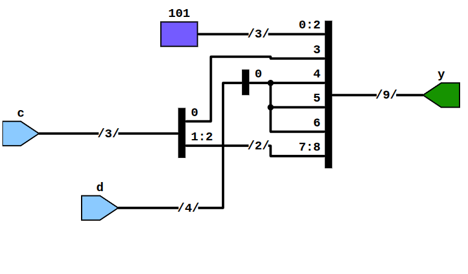

Тестирование кода vhdl из файла bit_manipulation.vhd в симуляторе Digital:

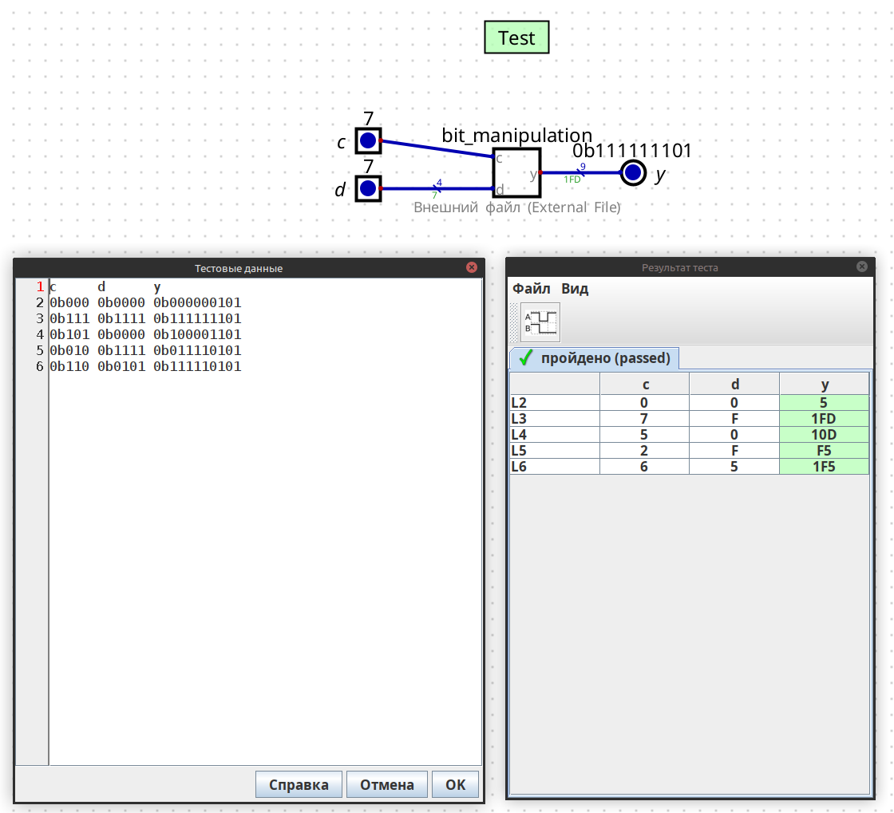

[Схема bit_manipulation для Digital (Digital Logic Designer от Helmut Neemann)](img/harris/bit_manipulation.dig)


Другой пример демонстрирует возможности оператора агрегирования в VHDL. 
Предположим, что `z` – это 8-битный сигнал типа `STD_LOGIC_VECTOR`, тогда при выполнении операции агрегирования:

`z <= ("10", 4 => '1', 2 downto 1 =>'1', others =>'0')`

`z` получит значение `10010110`:
* "10" переходит в старшую пару битов: `10xxxxxx`
* 1 также помещается в 4-й бит:  `xxx1xxxx`
* и биты 2 и 1:  `xxxxx11x`
* Все остальные биты равны 0:  `xxxxxxx0`

---

### Комбинационная логика. Задержки

В процессе моделирования, задержки помогают предсказать, насколько быстро будет работать схема (если вы укажете адекватные задержки). Также при отладке они помогают понять причину и следствие (устанавливать источник плохого результата сложно, если в процессе моделирования все сигналы меняются одновременно). 

Эти задержки игнорируются в процессе синтеза; задержка элемента, сгенерированного синтезатором, зависит от значений $t_{pd}$ и $t_{cd}$, а не от чисел в HDL-коде.

В VHDL заявление `after` используется для обозначения задержек. Единицы в этом случае определяются в наносекундах.

Файл delays_ex1.vhd:

Предполагается, что: 
* `инвертор` имеет задержку 1 нс
* трехвходовый элемент `И` имеет задержку 2 нс
* трехвходовый элемент `ИЛИ` – задержку 4 нс

```vhdl
library IEEE;
use IEEE.STD_LOGIC_1164.all;

entity delays_ex1 is
  port (
    a, b, c : in std_logic;
    y : out std_logic);
end;

architecture synth of delays_ex1 is
  signal ab, bb, cb, n1, n2, n3 : std_logic;
begin
  ab <= not a after 1 ns;
  bb <= not b after 1 ns;
  cb <= not c after 1 ns;
  n1 <= ab and bb and cb after 2 ns;
  n2 <= a and bb and cb after 2 ns;
  n3 <= a and bb and c after 2 ns;
  y  <= n1 or n2 or n3 after 4 ns;
end;
```

TerosHDL: Schematic Viewer

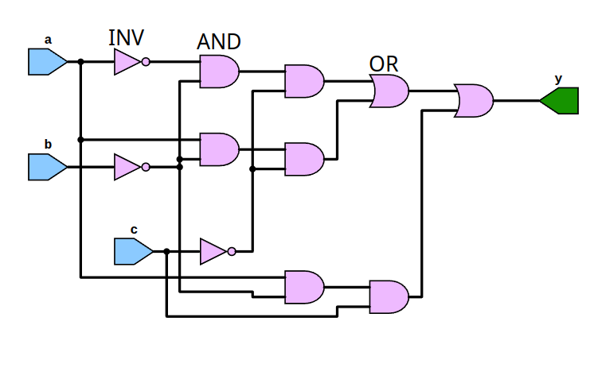

Симулятор Digital при работе с VHDL-кодом полностью игнорирует задержки времени (строки с after 1 ns). Он воспринимает эту схему как идеальную комбинационную логику, где выходы меняются мгновенно, без каких-либо наносекундных задержек, поэтому используем Waveform Viewer.

Добавим файлы delays_ex1 и delays_ex1_tb.vhd в проект и запустим TESTBENCHES:

```vhdl
library IEEE;
use IEEE.STD_LOGIC_1164.all;

entity delays_ex1_tb is
-- У тестбенча нет внешних портов
end;

architecture sim of delays_ex1_tb is
  -- Сигналы для подключения к нашей схеме
  signal ts_a, ts_b, ts_c : std_logic := '1'; -- начнем с 1 1 1
  signal ts_y             : std_logic;
begin

  -- Подключаем проверяемую схему (UUT)
  UUT: entity work.delays_ex1 
    port map (
      a => ts_a, b => ts_b, c => ts_c, y => ts_y
    );

  -- Процесс, который крутит стрелки часов в симуляторе
  process
  begin
    wait for 20 ns; -- Ждем стабилизации схемы в начале
    
    ts_a <= '0'; ts_b <= '0'; ts_c <= '0'; -- Подаем 0 0 0
    wait for 20 ns; -- Ждем, на диаграмме y станет '1' только через 7 нс
    
    ts_a <= '1'; ts_b <= '0'; ts_c <= '0'; -- Подаем 1 0 0
    wait for 20 ns; -- Наблюдаем за переходными процессами
    
    wait; -- Останавливаем симуляцию
  end process;

end;
```


Далее запуск симуляции и просмотр графиков временных диаграмм (Waveform Viewer)

```bash
# 1. Запускаем симуляцию нашего тестбенча и сохраняем сигналы в файл waveforms.vcd
~/.teroshdl/build/delays_ex1_tb --vcd=waveforms.vcd

# 2. Открываем графики во встроенном в ваш OSS CAD Suite просмотрщике GTKWave
~/.local/share/oss-cad-suite/bin/gtkwave waveforms.vcd &
 
```

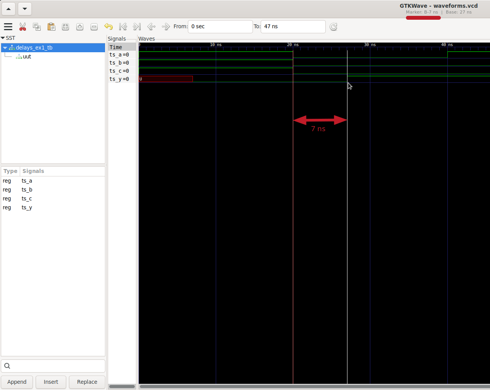

Если установить входы a=0, b=0, c=0 то наблюдаем на выходе значение y=1 с задержкой в 7 ns.


Если построить эту же самую схему из стандартных графических компонентов самого симулятора Digital и проставить задержки, то тесты успешно пройдут, но задержек не будет. После установки входов a=0, b=0, c=0 наблюдаем на выходе значение y=1 без задержки 🤥🤬. 
 
Тестирование кода vhdl из файла delays_ex1.vhd в симуляторе Digital

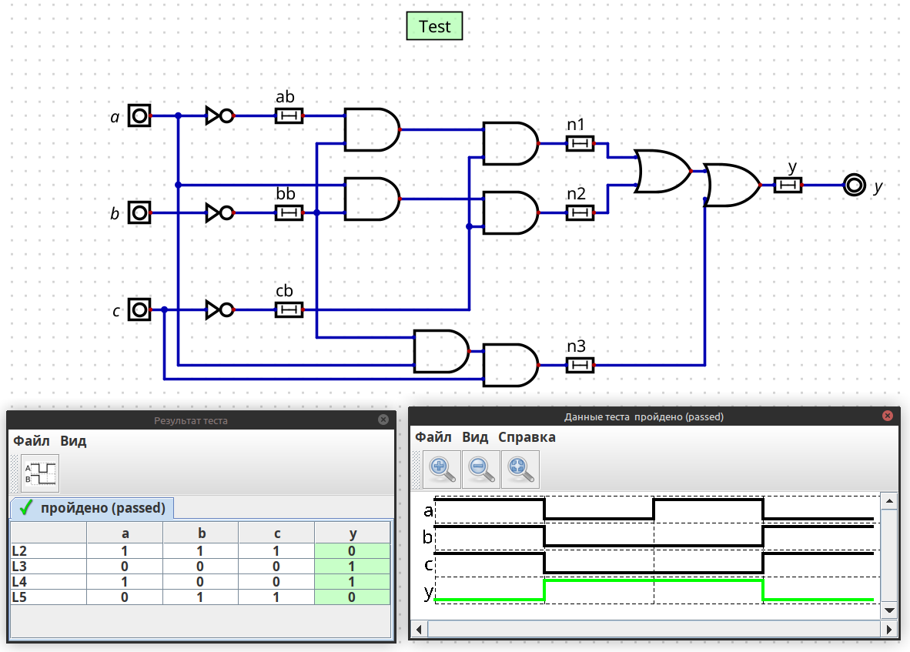


> Программа Digital (Digital Logic Designer от Helmut Neemann) создавалась в первую очередь как образовательный инструмент для проверки чистой логики (Functional Simulation). В этом режиме симулятора физические задержки элементов (транзисторов, дорожек на плате) принимаются равными нулю. График здесь нужен лишь для того, чтобы увидеть хронологию событий: сначала пришел сигнал А, затем через такт изменился выход Y.
>
> Для проверки таймингов используйте [AMD Xilinx Vivado Simulation](#amd-xilinx-vivado): Вы проверяете, успевает ли физический кристалл микросхемы обработать эти сигналы с учетом наносекундных задержек вентилей.

---

### Структурное моделирование

> [!INFO]
> Тип архитектуры:
> * **rtl** или **synth** - для простой логики (счётчики, шифраторы, mux)
> * **struct** - для главного блока (соединяет другие файлы в общую схему)
> * **beh** или **sim** - для файла симуляции (тестбенч, подающий сигналы для проверки)

Описывает модуль с точки зрения того, как он составлен из более простых модулей.


Файл component_mux4.vhd:

```vhdl
library IEEE;
use IEEE.STD_LOGIC_1164.all;

entity component_mux4 is
  port (
    d0, d1, d2, d3 : in std_logic_vector(3 downto 0);
    s : in std_logic_vector(1 downto 0);
    y : out std_logic_vector(3 downto 0)
    );
end;
architecture struct of component_mux4 is
  component mux2
    port (
      d0, d1 : in std_logic_vector(3 downto 0);
      s  : in std_logic;
      y  : out std_logic_vector(3 downto 0)
      );
  end component;
  signal low, high : std_logic_vector(3 downto 0);
begin
  lowmux : mux2 port map(d0, d1, s(0), low);
  highmux : mux2 port map(d2, d3, s(0), high);
  finalmux : mux2 port  map(low, high, s(1), y);
end;

```

Проблема включения вложенных компонентов в генерацию схемы. Если сборка ghdl не видит внешний компонент то подставляет пустышку. Например в схеме component_mux4 используется три штуки компонента mux2 который описан в файле mux2.vhd, но ghdl не добавит его в сборку:


Лог выходных данных сборки:
```bash
2026-05-27 12:10:17.676 [info] Executing: /bin/sh  /bin/sh -c  yosys -m ghdl -p "ghdl --std=08 -fsynopsys  --work=work "/home/jeka/Projects/Rust/Computer-Science-Bookshelf/src/test_vhd/component_mux4.vhd"  --work=work -e component_mux4; hierarchy -top component_mux4; proc; write_json /home/jeka/.teroshdl_F5YCG; stat"
2026-05-27 12:10:17.693 [info] 
 /----------------------------------------------------------------------------\
 |  yosys -- Yosys Open SYnthesis Suite                                       |
 |  Copyright (C) 2012 - 2026  Claire Xenia Wolf <claire@yosyshq.com>         |
 |  Distributed under an ISC-like license, type "license" to see terms        |
 \----------------------------------------------------------------------------/
 Yosys 0.65+51 (git sha1 5c6de0446, clang++ 18.1.8 -fPIC -O3)

-- Running command `ghdl --std=08 -fsynopsys  --work=work /home/jeka/Projects/Rust/Computer-Science-Bookshelf/src/test_vhd/component_mux4.vhd  --work=work -e component_mux4; hierarchy -top component_mux4; proc; write_json /home/jeka/.teroshdl_F5YCG; stat' --

1. Executing GHDL.

2026-05-27 12:10:17.707 [info] /home/jeka/Projects/Rust/Computer-Science-Bookshelf/src/test_vhd/component_mux4.vhd:23:3:warning: instance "lowmux" of component "mux2" is not bound [-Wbinding]
  lowmux:  mux2 port map(d0, d1, s(0), low);
  ^
/home/jeka/Projects/Rust/Computer-Science-Bookshelf/src/test_vhd/component_mux4.vhd:12:14:warning: (in default configuration of component_mux4(struct))
/home/jeka/Projects/Rust/Computer-Science-Bookshelf/src/test_vhd/component_mux4.vhd:24:3:warning: instance "highmux" of component "mux2" is not bound [-Wbinding]
  highmux:  mux2 port map(d2, d3, s(0), high);
  ^
/home/jeka/Projects/Rust/Computer-Science-Bookshelf/src/test_vhd/component_mux4.vhd:12:14:warning: (in default configuration of component_mux4(struct))
/home/jeka/Projects/Rust/Computer-Science-Bookshelf/src/test_vhd/component_mux4.vhd:25:3:warning: instance "finalmux" of component "mux2" is not bound [-Wbinding]
  finalmux:  mux2 port  map(low, high, s(1), y);
  ^
/home/jeka/Projects/Rust/Computer-Science-Bookshelf/src/test_vhd/component_mux4.vhd:12:14:warning: (in default configuration of component_mux4(struct))

...

=== component_mux4 ===

        +----------Local Count, excluding submodules.
        | 
       11 wires
       42 wire bits
        8 public wires
       30 public wire bits
        6 ports
       22 port bits
        3 cells
        3   mux2
```        
 
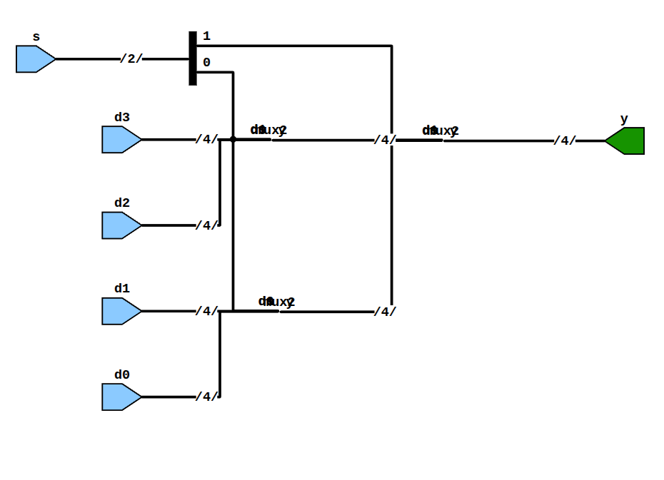

**Но, если добавить путь к внешним компонентам в настройках TerosHDL**:
 

`TerosHDL Settings => Schematic viewer => Arguments passed to GHDL`: (жестко прописать путь к внешнему компоненту)

```bash
--std=08 -fsynopsys --work=work  /home/jeka/Projects/Rust/Computer-Science-Bookshelf/src/test_vhd/mux2.vhd
```

Или общий подход, включения всех файлов. Жестко прописать главный файл входа, например component_mux4, а все оастальные добавить в сборку.

```bash
`echo $(find $(dirname "/home/jeka/Projects/Rust/Computer-Science-Bookshelf/src/test_vhd/component_mux4.vhd") -maxdepth 1 -name "*.vhd")`
```

В итоге ghdl будет использовать такую команду сборки:
```bash
ghdl --std=08 -fsynopsys /home/jeka/Projects/Rust/Computer-Science-Bookshelf/src/test_vhd/component_mux4.vhd /home/jeka/Projects/Rust/Computer-Science-Bookshelf/src/test_vhd/mux2.vhd --work=work /home/jeka/Projects/Rust/Computer-Science-Bookshelf/src/test_vhd/component_mux4.vhd  --work=work -e component_mux4; hierarchy -top component_mux4; proc; write_json /home/jeka/.teroshdl_t3xe9; stat
```


Так выглядит лог сборки с учетом внешних компонентов: 

```bash
2026-05-27 12:12:11.067 [info] Executing: /bin/sh  /bin/sh -c  yosys -m ghdl -p "ghdl --std=08 -fsynopsys `echo $(find $(dirname "/home/jeka/Projects/Rust/Computer-Science-Bookshelf/src/test_vhd/component_mux4.vhd") -maxdepth 1 -name "*.vhd")` --work=work "/home/jeka/Projects/Rust/Computer-Science-Bookshelf/src/test_vhd/component_mux4.vhd"  --work=work -e component_mux4; hierarchy -top component_mux4; proc; write_json /home/jeka/.teroshdl_2z6rN; stat"
2026-05-27 12:12:11.083 [info] 
 /----------------------------------------------------------------------------\
 |  yosys -- Yosys Open SYnthesis Suite                                       |
 |  Copyright (C) 2012 - 2026  Claire Xenia Wolf <claire@yosyshq.com>         |
 |  Distributed under an ISC-like license, type "license" to see terms        |
 \----------------------------------------------------------------------------/
 Yosys 0.65+51 (git sha1 5c6de0446, clang++ 18.1.8 -fPIC -O3)

-- Running command `ghdl --std=08 -fsynopsys /home/jeka/Projects/Rust/Computer-Science-Bookshelf/src/test_vhd/component_mux4.vhd /home/jeka/Projects/Rust/Computer-Science-Bookshelf/src/test_vhd/mux2.vhd --work=work /home/jeka/Projects/Rust/Computer-Science-Bookshelf/src/test_vhd/component_mux4.vhd --work=work -e component_mux4; hierarchy -top component_mux4; proc; write_json /home/jeka/.teroshdl_2z6rN; stat' --

...

2026-05-27 12:12:11.100 [info] 
=== component_mux4 ===

        +----------Local Count, excluding submodules.
        | 
       14 wires
       54 wire bits
       11 public wires
       42 public wire bits
        6 ports
       22 port bits
        3 submodules
        3   mux2_Bsynth

=== mux2_Bsynth ===

        +----------Local Count, excluding submodules.
        | 
        5 wires
       17 wire bits
        4 public wires
       13 public wire bits
        4 ports
       13 port bits
        1 cells
        1   $mux

=== design hierarchy ===

        +----------Count including submodules.
        | 
        3 component_mux4
        1 mux2_Bsynth

        +----------Count including submodules.
        | 
       29 wires
      105 wire bits
       23 public wires
       81 public wire bits
       18 ports
       61 port bits
        - memories
        - memory bits
        - processes
        3 cells
        3   $mux
        3 submodules
        3   mux2_Bsynth

```


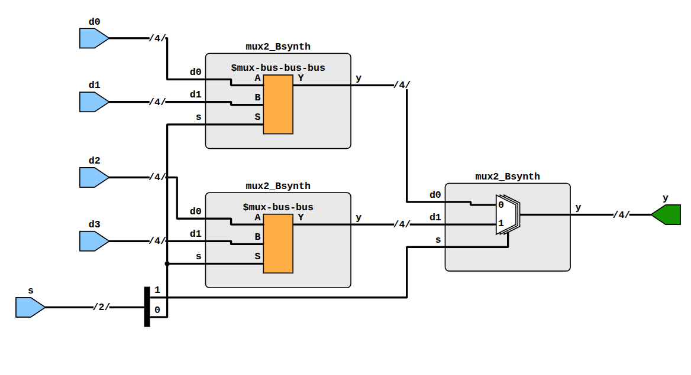


**Вариант для Verilog**

Файл mux2.sv:
```verilog
module mux2(
        input logic [3:0] d0, d1,
        input logic s,
        output logic [3:0] y
    );
    
    assign y = s ? d1 : d0;

endmodule
```

Файл component_mux4.sv:
```verilog
module component_mux4(
      input logic [3:0] d0, d1, d2, d3,
      input logic [1:0] s, 
      output logic [3:0] y
    );

  logic [3:0] low, high;

  mux2 lowmux(d0, d1, s[0], low);
  mux2 highmux(d2, d3, s[0], high);
  mux2 finalmux(low, high, s[1], y);

endmodule
```

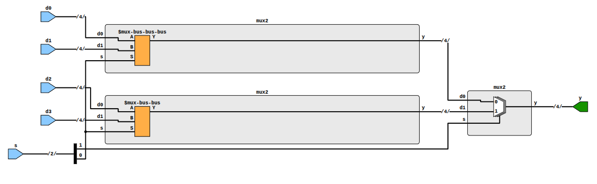

> p.s. отличие только в именах внешних компонентов, в VHDL варианте mux2 проименованы как mux2_Bsynth

---

**Доп. команды:**


**Если добавить аргумент `flatten` к Yosys**

`TerosHDL Settings => Schematic viewer => Arguments passed to Yosys: flatten`

`flatten` — Сглаживание (развертывание) схемы

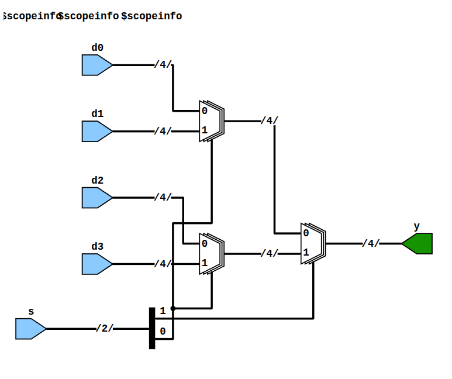


**Если добавить аргумент `techmap` к Yosys**

`TerosHDL Settings => Schematic viewer => Arguments passed to Yosys: techmap`

`techmap` — заменяет абстрактные RTL-блоки (например, знаки сложения или те же мультиплексоры) на конкретные логические вентили (И, ИЛИ, НЕ), если загружена библиотека конкретной технологии.

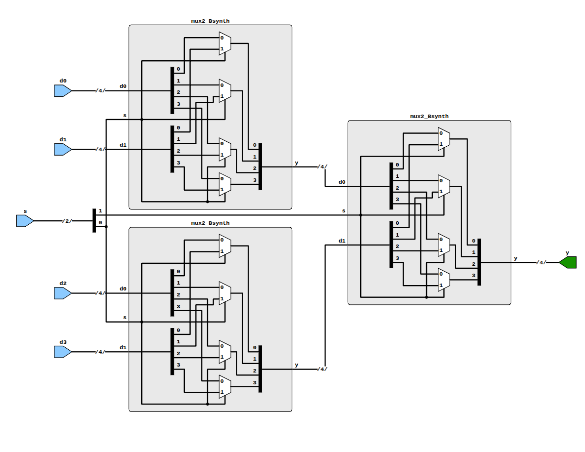


```bash
/home/$USER/.local/share/oss-cad-suite/bin/yosys -m ghdl

 /----------------------------------------------------------------------------\
 |  yosys -- Yosys Open SYnthesis Suite                                       |
 |  Copyright (C) 2012 - 2026  Claire Xenia Wolf <claire@yosyshq.com>         |
 |  Distributed under an ISC-like license, type "license" to see terms        |
 \----------------------------------------------------------------------------/
 Yosys 0.65+51 (git sha1 5c6de0446, clang++ 18.1.8 -fPIC -O3)

yosys> help

  check — Проверка на очевидные ошибки
  Сканирует Вашу схему на предмет явных аппаратных проблем: оборванные провода (wires с портами, но без соединений), конфликты драйверов (когда два выхода закорочены между собой) или обратные связи без триггеров (комбинаторные петли).

  memory — Трансляция массивов памяти
  Находит в коде объявления массивов данных (ОЗУ/ПЗУ) и превращает их в физические структуры. В зависимости от настроек, он может либо разбить память на отдельные независимые триггеры (memory_map), либо подготовить её для генерации встроенных блоков блочной памяти FPGA (memory_bram).

  opt — Запуск цикла оптимизаций
  Универсальная команда, которая чистит схему. Она запускает цепочку подкоманд: удаляет мертвые ветки логики, константные провода (которые навсегда привязаны к '0' или '1') и объединяет дублирующие элементы.

yosys> help ghdl

  -C — разрешает использовать символы UTF-8 (например, кириллицу) в комментариях кода, чтобы компилятор не ругался на незнакомые знаки.

  -fpsl — заставляет компилятор искать и обрабатывать PSL-верификационные свойства (Property Specification Language), если они записаны внутри комментариев.

  --rename-verbose — делает то же самое, что и --rename, но подробно выводит в лог терминала каждую измененную строчку

  --rename-map <file> — очищает имена и дополнительно записывает в отдельный JSON-файл «карту соответствия» (какое техническое имя во что было переименовано), чтобы сторонние программы могли сопоставить схему с исходным кодом.
```

**Настройки для главного компонента входа `component_mux4`:**

Schematic viewer/Arguments passed to Yosys:
```bash
hierarchy -libdir /home/jeka/Projects/Rust/Computer-Science-Bookshelf/src/test_vhd/; proc; opt; check;
```

Schematic viewer/Arguments passed to GHDL:
```bash
-C -fpsl --latches --rename-verbose --rename-map ./yosys.renames.map.json `echo $(find $(dirname "/home/jeka/Projects/Rust/Computer-Science-Bookshelf/src/test_vhd/component_mux4.vhd") -maxdepth 1 -name "*.vhd")`
```

### Структурное моделирование. Двухвходовый мультиплексор из пары буферов с тремя состояниями

(Но строить логические схемы из таких буферов не рекомендуется)


Файл component_mux2_tristate.vhd

```vhdl
library IEEE; 
use IEEE.STD_LOGIC_1164.all;

entity component_mux2_tristate is
    port(
        d0, d1: in STD_LOGIC_VECTOR(3 downto 0);
        s: in STD_LOGIC;
        y: out STD_LOGIC_VECTOR(3 downto 0)
    );
end;

architecture struct of component_mux2_tristate is
component tristate
    port(a: in STD_LOGIC_VECTOR(3 downto 0);
        en: in STD_LOGIC;
        y: out STD_LOGIC_VECTOR(3 downto 0)
    );
end component;

signal sbar: STD_LOGIC;
begin
    sbar <= not s;
    t0: tristate port map(d0, sbar, y);
    t1: tristate port map(d1, s, y);
end;
```

В языке VHDL такие выражения, как `not s`, не разрешены в карте портов экземпляра. Таким образом, `sbar` должен быть определен как отдельный сигнал.

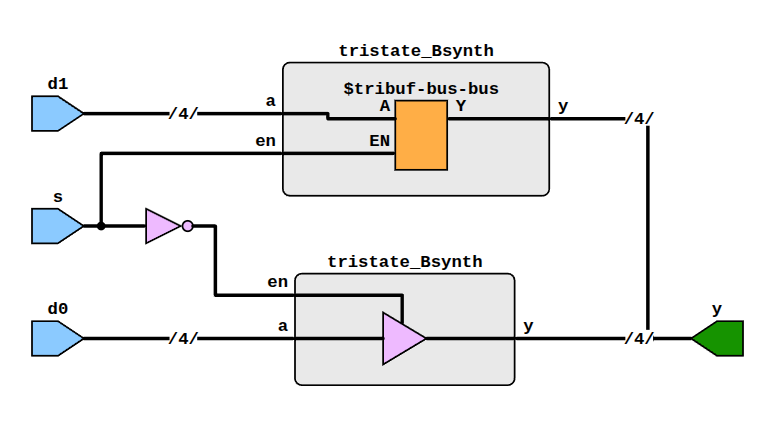

### AMD Xilinx Vivado

Бесплатная версия AMD Xilinx Vivado, где встроенный RTL Viewer справляется с VHDL безупречно.

Vivado — это тяжелая профессиональная САПР, и симуляция (запуск тестов и построение временных диаграмм / Waveforms) — это одна из ее сильнейших сторон. В нее встроен мощный симулятор Vivado Simulator (XSim).

[AMD Vivado™ Design Suite](https://www.amd.com/en/products/software/adaptive-socs-and-fpgas/vivado.html)

[Downloads Vivado™ 2025.2](https://www.xilinx.com/support/download/index.html/content/xilinx/en/downloadNav/vivado-design-tools.html) (AMD Unified Installer for FPGAs & Adaptive SoCs 2025.2.1: Linux Self Extracting Web Installer)

<details>
<summary> Install</summary>

```
chmod +x Xilinx_Unified_2025.2.1_*.bin
./Xilinx_Unified_2025.2.1_*.bin
  
```

```
Select Produtc to Install:
➡️ Vivado

➡️ Vivado ML Standard Edition

В разделе Design Tools:
- Снимите галочку с Vitis Model Composer (A toolbox for Simulink) — это интеграция с коммерческим пакетом MATLAB, без него она абсолютно бесполезна и весит лишние гигабайты.
- Снимите галочку с DocNav — это просто встроенный навигатор по PDF-документациям AMD.
- Галочки на Vivado и Vitis HLS внутри поддерева оставьте как есть (их нельзя отключить).

В разделе Devices:
- Поставьте одну единственную галочку на семейство 7 Series

В разделе Installation Options:
- Снимите галочку с Acquire or Manage a License Key. Поскольку Вы устанавливаете бесплатную версию Standard, никакие лицензионные ключи Вам менеджеру передавать не потребуется, эта утилита не нужна.

End User License Agreement for Vivado(EULA) 
  поставьте обе галочки:
  ➡️ I Agree в верхнем блоке (End User License Agreement for Vivado).
  ➡️ I Agree в нижнем блоке (Third Party Software End User License Agreement for Vivado).
```

Additional library installation required:
```
./vivado                                                     

Error: application-specific initialization failed: couldn't load file "libxv_commontasks.so": libncurses.so.5: cannot open shared object file: No such file or directory

# download libncurses5 libtinfo5
wget http://mirrors.kernel.org/ubuntu/pool/universe/n/ncurses/libtinfo5_6.3-2ubuntu0.1_amd64.deb
wget http://mirrors.kernel.org/ubuntu/pool/universe/n/ncurses/libncurses5_6.3-2ubuntu0.1_amd64.deb
sudo dpkg -i libtinfo5_6.3-2ubuntu0.1_amd64.deb
sudo dpkg -i libncurses5_6.3-2ubuntu0.1_amd64.deb
./vivado
```
 
</details>

<br>
<details>
<summary> Create Project</summary>

Получение схемы из VHDL-кода. В Vivado этот процесс называется **Elaboration** (анализ и симуляция логики без привязки к конкретным физическим транзисторам чипа).

Вот пошаговый алгоритм, как открыть файлы и построить схему:

### Шаг 1. Создание проекта

1. На стартовом экране Vivado нажмите **Create Project**.
2. В появившемся окне нажмите **Next**, укажите любое имя проекта (например, `project_mux4`) и путь к нему. Нажмите **Next**.
3. На этапе **Project Type** выберите **RTL Project** и обязательно поставьте галочку **Do not specify sources at this time** (это позволит добавить файлы вручную чуть позже и сэкономит время). Нажмите **Next**.
4. На этапе выбора чипа (Default Part) ничего не меняйте, там уже будет стоять какой-то стандартный чип из семейства 7-Series. Просто нажмите **Next**, а затем **Finish**.

---

### Шаг 2. Добавление Ваших VHDL-файлов

1. В левой панели (**Flow Navigator**) найдите раздел **Project Manager** и нажмите **Add Sources** (или нажмите комбинацию клавиш `Alt + A`).
2. Выберите пункт **Add or create design sources** и нажмите **Next**.
3. Нажмите кнопку **Add Files** и выберите Ваши VHDL-файлы (и главный модуль `component_mux4`, и внешний `mux2`).
4. Нажмите **Finish**. В панели *Sources* (по центру сверху) появится Ваша правильная древовидная структура проекта. Vivado сам поймёт, какой модуль главный.

---

### Шаг 3. Генерация и просмотр схемы (Самый главный шаг)

1. Снова посмотрите на левую панель **Flow Navigator**.
2. Найдите там раздел **RTL Analysis** (он находится чуть ниже Project Manager).
3. Кликните по стрелочке рядом с ним, чтобы развернуть подпункты, и нажмите на **Open Elaborated Design**.
4. В появившемся маленьком окне просто нажмите **OK**.

Vivado запустит синтезатор, полностью проанализирует Ваш VHDL-код, автоматически свяжет внешние зависимости и откроет графическое окно.

### Назначьте нужный модуль главным
* В панели Sources (обычно находится по центру сверху) найдите вкладку `Design Sources`.
* Вы увидите список Ваших файлов. Найдите тот файл (модуль), схему которого Вы хотите посмотреть прямо сейчас (например, component_mux4).
* Нажмите на него правой кнопкой мыши и выберите пункт `Set as Top`.
* Дождитесь смены главного файла и обновите вкладку `RTL ANALYSIS/Open Elaborated Design/Schematic` (Reload Design)

### Что Вы увидите на экране:

Перед Вами откроется чистая, профессиональная интерактивная схема.

* Все Ваши модули `lowmux`, `highmux` и `finalmux` будут подписаны **ровно так, как Вы их назвали в коде**, без какого-либо технического мусора.
* Вы сможете нажать на значок **`+`** на любом из блоков (например, на `lowmux`), и схема динамически развернётся, показав, из каких именно вентилей или внутренних мультиплексоров состоит этот конкретный компонент.
 
### Настройка версии VHDL

Чтобы изменить стандарт VHDL-93 на VHDL-2008 для всех VHDL-файлов проекта через `Tcl-консоль`, выполните корректную команду:

`set_property file_type {VHDL 2008} [get_files -filter {FILE_TYPE == "VHDL"}]`
 
Чтобы новые файлы анализировались по стандарту VHDL-2008, введите команды в `Tcl-консоль`

```
set_property target_language VHDL [current_project]
set_property file_type {VHDL 2008} [get_files *.vhd]
reset_simulation -simset sim_1 -mode behavioral
launch_simulation
```


</details>
 
AMD Xilinx Vivado: Schematic Viewer (component_mux4.vhd)
 
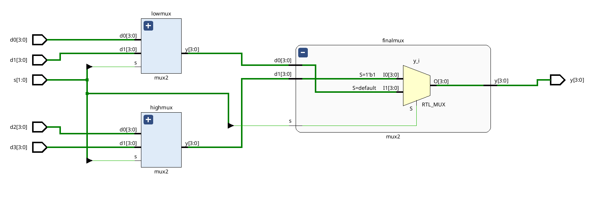

<video controls width="100%" muted playsinline preload="metadata" 
       onloadeddata="this.playbackRate = 0.5;">
    <source src="/Computer-Science-Bookshelf/img/harris/Vivado_Schematic_Viewer_component_mux4.mp4" type="video/mp4">
    Ваш браузер не поддерживает видео.
</video>

<br>
<details>
<summary> Waveform Testbench </summary>

Когда Вы запускаете симуляцию в Vivado (launch_simulation), утилита xelab транслирует Ваш VHDL-код в код на языке C, а затем компилирует его в исполняемый бинарный файл симуляции с помощью системного компилятора gcc и компоновщика ld.

Для сборки любого исполняемого файла в Linux требуются базовые файлы инициализации среды выполнения C (так называемые C Run-Time файлы: crt1.o, crti.o и crtn.o). Они отвечают за подготовку программы к работе перед тем, как управление перейдет к коду симулятора.

Проблема в изменившейся структуре путей к системным библиотекам GCC (так называемый «usrmerge» и новые пути многоархитектурной сборки), из-за чего Vivado 2025.2.1 не может корректно передать утилите ld пути к файлам crt1.o и crti.o.

Для дистрибутивов на базе Ubuntu 24.04 самым надежным решением является создание символических ссылок в стандартных директориях, где их ожидает увидеть встроенный в Vivado тулчейн сборки.
```
sudo ln -s /usr/lib/x86_64-linux-gnu/crt1.o /usr/lib/crt1.o
sudo ln -s /usr/lib/x86_64-linux-gnu/crti.o /usr/lib/crti.o
sudo ln -s /usr/lib/x86_64-linux-gnu/crtn.o /usr/lib/crtn.o
```
---

Чтобы запустить тесты и увидеть графики сигналов, Вам нужен файл тестбенча (**Testbench**) — специальный VHDL-код, который сам ничего не синтезирует, а просто генерирует тактовый сигнал, сброс и подает данные на входы Вашего модуля.

Вот как это делается в программе:

### Установить главный файл 
* в окне Sources/Design Sources установить `Set as Top` для файла который содержит тестируемый компонент
* в окне Sources/Simulation Sources установить `Set as Top` для самого файла testbench

### Добавьте файл теста в проект

1. В левой панели **Flow Navigator** нажмите **Add Sources**.
2. Выберите пункт **Add or create simulation sources** (это критически важно, тесты должны лежать в своей папке) и нажмите *Next*.
3. Нажмите *Add Files* и выберите Ваш файл тестбенча (или создайте новый через *Create File*). Нажмите *Finish*.

### Запуск симуляции

1. В панели **Sources** перейдите на вкладку **Simulation**.
2. Найдите Ваш добавленный тестбенч, нажмите на него правой кнопкой мыши и выберите **Set as Top** (теперь уже для симуляции, чтобы Vivado знал, какой тест запускать).
3. В левой панели **Flow Navigator** найдите раздел **Simulation** и нажмите **Run Simulation** -> **Run Behavioral Simulation**.

### Что произойдет дальше:

Vivado откроет совершенно новое рабочее пространство для симуляции:

* По центру откроется вкладка **Waveform**, где слева будут перечислены порты и внутренние сигналы, а справа — временная шкала с графиками (зеленые линии, показывающие `'0'`, `'1'` или шины данных).
* По умолчанию симуляция запускается на короткий промежуток (обычно $1\text{ мкс}$).
* Вы можете управлять временем симуляции с помощью кнопок на верхней панели: **Run All** (крутить бесконечно), **Run For...** (прокрутить еще на $10\text{ мкс}$) или **Restart** (сбросить на время $0\text{ нс}$).
 
Если вы добавите в процесс (`process`) тестбенча проверку условий с помощью оператора `assert` и вывод сообщений через `report`. Обратить внимание на вкладку `Tcl Console` (или вкладку `Log` в нижней части экрана). Если логика нарушена, симуляция мгновенно прервется, и Vivado подсветит красным строку с ошибкой.

```vhdl
-- Пример процесса в delays_ex1_tb.vhd
stim_proc: process
begin
    -- Шаг 1: Подаем входные сигналы (например, И - логика)
    inputs <= "00";
    wait for 10 ns;
    -- Проверяем, что на выходе логический '0'
    assert (output = '0') 
        report "Ошибка! Для входов 00 выход должен быть 0" 
        severity failure;

    -- Шаг 2: Подаем другие сигналы
    inputs <= "11";
    wait for 10 ns;
    -- Проверяем, что на выходе логическая '1'
    assert (output = '1') 
        report "Ошибка! Для входов 11 выход должен быть 1" 
        severity failure;

    -- Если все проверки прошли успешно:
    report "Тестирование успешно завершено! Логика работает верно." 
        severity note;
    wait; -- Останавливаем симуляцию
end process;
```

</details>

График временных диаграмм AMD Xilinx Vivado: Waveform Viewer для схемы [из файла delays_ex1.vhd](#Задержки):

Если установить входы a=0, b=0, c=0 то наблюдаем на выходе значение y=1 с задержкой в 7 ns.

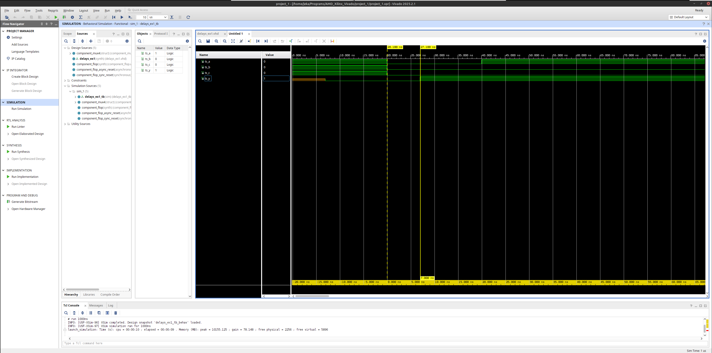

<br>
<video controls width="100%" muted playsinline preload="metadata" 
       onloadeddata="this.playbackRate = 0.5;">
    <source src="/Computer-Science-Bookshelf/img/harris/Vivado_Schematic_Viewer_Vivado_Waveform_Viewer_delays_ex1_tb.mp4" type="video/mp4">
    Ваш браузер не поддерживает видео.
</video>


---

### Последовательностная логика. Регистры.

Подавляющее большинство современных коммерческих систем построе­ но на регистрах, использующих срабатывающие по переднему фронту тактового импульса D-триггеры.


Сигналы, значения которым присвоены в операторах always языка SystemVerilog и операторах **process** языка VHDL, сохраняют свое состояние, пока не случится событие из списка чувствительности оператора, приводящее к изменению их состояния. Например, у триггера в списке чувствительности есть только сигнал `clk`, и потому триггер хранит старое значение `q` до следующего переднего фронта `clk`, даже если входной сигнал `d` изменился раньше.

> оператор одновременного присваивания VHDL (`<=`) перевычисляются каждый раз, когда изменяется какая-либо из переменных в правой части, поэтому эти операторы могут описать только комбинационную логику, а не последовательную

Для моделирования последовательной логики в операторах always/process следует пользоваться исключительно неблокирующими присваиваниями. В операторе `process` , операция `:=` означает блокирующее присваивание, `а <=` означает неблокирую­щее (одновременное) присваивание.


Оператор **process** языка VHDL имеет вид:
```vhdl
process(sensitivity list) begin
  statement;
end process;
```
 
Другой вариант идиомы VHDL для записи триггера 
* `rising_edge(clk)` является синонимом `clk'event and clk = '1'`:

```vhdl
process(clk) begin
  if clk'event and clk = '1' then
    q <= d;
  end if;
end process;
```

Оператор выполняется, когда изменяется ка­кая-либо из переменных из списка чувствительности. В этом примере оператор `if` проверяет, было ли изменение передним фронтом тактового сигнала (такта) `clk`. Если да, то `q <= d` (читается «q принимает значение d»). Таким образом, триггер копирует `d` в `q` по переднему фронту сигнала `clk`, а в остальное время значение `q` остается неизменным.

**Регистр без сброса**

Файл component_flop.vhd:
```vhdl
library IEEE; use IEEE.STD_LOGIC_1164.all;

entity component_flop is
    port(clk: in STD_LOGIC;
        d: in STD_LOGIC_VECTOR(3 downto 0);
        q: out STD_LOGIC_VECTOR(3 downto 0)
    );
end;

architecture synth of component_flop is
begin
    process(clk) begin
        if rising_edge(clk) then
            q <= d;
        end if;
    end process;
end;
```

**Регистр с асинхронным сбросом `reset`**

Файл component_flop_async_reset.vhd:

```vhdl
library IEEE; use IEEE.STD_LOGIC_1164.all;

entity component_flop_async_reset is
    port(
        clk, reset: in STD_LOGIC;
        d: in STD_LOGIC_VECTOR(3 downto 0);
        q: out STD_LOGIC_VECTOR(3 downto 0)
    );
end;

architecture asynchronous of component_flop_async_reset is
begin
    process(clk, reset) begin
        if reset = '1' then
            q <= "0000";
        elsif rising_edge(clk) then
            q <= d;
        end if;
    end process;
end;
```

**Регистр с синхронным сбросом `reset`**

Файл component_flop_sync_reset.vhd:

```vhdl
library IEEE; 
use IEEE.STD_LOGIC_1164.all;

entity component_flop_sync_reset is
    port(
        clk, reset: in STD_LOGIC;
        d: in STD_LOGIC_VECTOR(3 downto 0);
        q: out STD_LOGIC_VECTOR(3 downto 0)
    );
end;

architecture synchronous of component_flop_sync_reset is
begin
    process(clk) begin
        if rising_edge(clk) then
            if reset = '1' then q <= "0000";
                else q <= d;
            end if;
        end if;
    end process;
end;
```

**Регистр с сигналом разрешения `en` и асинхронным сбросом `reset`**

Сохраняет предыдущее значение, если оба сигнала `en` и `reset` имеют значение FALSE

Файл component_flop_en_async_reset.vhd:

```vhdl
library ieee;
use ieee.std_logic_1164.all;

entity component_flop_en_async_reset is
  port (
    clk   : in    std_logic;
    reset : in    std_logic;
    en    : in    std_logic;
    d     : in    std_logic_vector(3 downto 0);
    q     : out   std_logic_vector(3 downto 0)
  );
end entity component_flop_en_async_reset;

architecture asynchronous of component_flop_en_async_reset is

-- асинхронный сброс
begin
  process (clk, reset) is
  begin
    if (reset = '1') then
      q <= "0000";
    elsif rising_edge(clk) then
      if (en = '1') then
        q <= d;
      end if;
    end if;
  end process;
end architecture asynchronous;
```

**Группы регистров. Синхронизатор**

Один оператор always/process можно использовать для описания нескольких элементов аппаратуры.

По переднему фронту `clk`, `d` копируется в `n1`, и в то же время `n1` копируется в `q`.

Переменная `n1` должна быть объявлена как `sig­nal`, так как она используется внутри модуля в качестве сигнала для соединения логических элементов.

Файл component_sync.vhd:

```vhdl
library ieee;

use ieee.std_logic_1164.all;

entity component_sync is
  port (
    clk : in    std_logic;
    d   : in    std_logic;
    q   : out   std_logic
  );
end entity component_sync;

architecture good of component_sync is

  signal n1 : std_logic;
begin
  process (clk) is
  begin
    if rising_edge(clk) then
      n1 <= d;
      q  <= n1;
    end if;
  end process;
end architecture good;
```

**Защелки**

D-защелка открыта при высоком уровне тактового сигнала, т. е. пропускает сигнал данных с входа на выход.

Не все программы-синтезаторы хорошо справляются с защелками. Если вы не уверены, что ваш синтезатор их поддерживает, или нет особых причин использовать именно защелки, пользуйтесь вместо них триг­герами, работающими по фронту сигнала.
  
В списке чувствительности есть и `clk`, и `d`, так что process вычисляется каждый раз, когда `clk` или `d` изменяется. При высоком уровне `clk` переменная `q` принимает значение `d`.

> Добавить аргумент `--latches` в
> `TerosHDL Settings/Schematic viewer/Arguments passed to GHDL`

Файл component_latch.vhd:

```vhdl
library ieee;

use ieee.std_logic_1164.all;

entity component_latch is
  port (
    clk : in    std_logic;
    d   : in    std_logic_vector(3 downto 0);
    q   : out   std_logic_vector(3 downto 0)
  );
end entity component_latch;

architecture synth of component_latch is

begin
  process (clk, d) is
  begin
    if (clk = '1') then
      q <= d;
    end if;
  end process;
end architecture synth;
```


### И снова комбинационная логика

Операторы always языка SystemVerilog и операторы **process** языка VHDL используются для описания последовательностных схем, потому что они сохраняют состояние переменных, если не было указано их изменить. Но эти операторы можно использовать и для поведенческого описания комбинационной логики, если список чувствительности описан так, чтобы отвечать на любое изменение входных сигналов, и тело оператора определяет значение выходного сигнала при любой комбинации значений входов.

Код на HDL в примере использует операторы always/process для описания группы из четырех инверторов

Оператор `process(all)` исполняет все выражения внутри process, как только изменяется любой из сигналов оператора process. Это эквивалентно `process(a)`, но существенно лучше, так как позволяет избежать ошибок при переименовании или добавлении новых сигналов. Операторы `begin` и `end process` обязательны в VHDL, даже если process содержит только одно присваивание.

Файл component_inv_proc.vhd:

```vhdl
library ieee;
use ieee.std_logic_1164.all;

entity component_inv_proc is
  port (
    a : in    std_logic_vector(3 downto 0);
    y : out   std_logic_vector(3 downto 0)
  );
end entity component_inv_proc;

architecture proc of component_inv_proc is

begin
  process (all) is
  begin
    y <= not a;
  end process;
end architecture proc;
```


В обоих языках можно использовать блокирующие и неблокирующие присваивания в операторах always/process. Внутри одного оператора блокирующие присваивания выполняются в том порядке, в котором они написаны, в точности как в обычном языке программирования, а обновление значений переменных в левой части неблокирующих присваиваний выполняется «одновременно», после того как вычислены значения всех правых частей неблокирующих присваиваний.

В операторе `process` , операция `:=` означает блокирующее присваивание, `а <=` означает неблокирую­щее (одновременное) присваивание. Символ `<=` может использоваться и за пределами операторов `process`, где тоже исполняется одновременно.

Неблокирующие присваивания применяются к выходам и к сигналам. Блокирующие присваивания применяются к переменным, объявленным в операторах `process`.


> Используйте `process(clk)` и неблокирующие присваивания для моделирования синхронной последовательностной логики.
>
>```vhdl
> process(clk) begin
> if rising_edge(clk) then
>   n1 <= d; -- неблокирующее
>   q <= n1; -- неблокирующее
> end if;
> end process;
> ```


> Используйте одновременные присваивания вне операторов process для моделирования простой комбинационной логики.
>
>```vhdl
>y <= d0 when s = '0' else d1;
>```

> Используйте `process(all)` для моделирования более сложной комбинационной логики, если оператор process удобнее. Пользуйтесь блокирующими присваива­ ниями для локальных переменных.
>
>```vhdl
> process(all)
> variable p, g: STD_LOGIC;
> begin
>   p := a xor b; -- блокирующее
>   g := a and b; -- блокирующее
>   s <= p xor cin;
>   cout <= g or (p and cin);
> end process;
>```

> Не присваивайте значение одной и той же переменной в разных операторах `process` или одновременных присваиваниях.


Файл component_fulladder_proc.vhd:

Так как `p` и `g` упоминаются в левой части операторов блокирующего присваивания (`:=`) в операторе `process`, то они должны быть объявлены как `variable`, а не как `signal`. Объявление переменных пишется перед `be­gin` того процесса, в котором эти переменные исполь­зуются.

```vhdl
library ieee;

use ieee.std_logic_1164.all;

entity component_fulladder_proc is
  port (
    a    : in    std_logic;
    b    : in    std_logic;
    cin  : in    std_logic;
    s    : out   std_logic;
    cout : out   std_logic
  );
end entity component_fulladder_proc;

architecture synth of component_fulladder_proc is

begin
  process (all) is
    variable p, g : std_logic;
  begin
    p    := a xor b; -- блокирующее
    g    := a and b; -- блокирующее
    s    <= p xor cin;
    cout <= g or (p and cin);
  end process;
end architecture synth;
```

> Для моделирования более сложной комбинационной логики удобно пользоваться операторами `case` и `if`, которые допускаются только внутри операторов `always/process`.

### Комбинационная логика. Операторы case

Оператор `case` выполняет различные действия в зависимости от значения своих входных данных. Он подразумевает комбинационную логику, если все возможные сочетания входных данных определены; в противном случае получится последовательностная логика, и выход сохранит свое предыдущее значение в неопределенных случаях.

Если бы условие `default` или `others` не было упомянуто в операторе `case`, то дешифратор сохранял бы предыдущее значение выхода, когда вход находится в диапазоне 10–15. Для аппаратуры такое поведение было бы странно.

Пример дешифратора семисегментного индикатора
 
Файл component_seven_seg_decoder.vhd:

```vhdl
library ieee;

use ieee.std_logic_1164.all;

entity component_seven_seg_decoder is
  port (
    data     : in    std_logic_vector(3 downto 0);
    segments : out   std_logic_vector(6 downto 0)
  );
end entity component_seven_seg_decoder;

architecture synth of component_seven_seg_decoder is

begin
  process (all) is
  begin
    case data is
      -- abcdefg
      when X"0" =>
        segments <= "1111110";
      when X"1" =>
        segments <= "0110000";
      when X"2" =>
        segments <= "1101101";
      when X"3" =>
        segments <= "1111001";
      when X"4" =>
        segments <= "0110011";
      when X"5" =>
        segments <= "1011011";
      when X"6" =>
        segments <= "1011111";
      when X"7" =>
        segments <= "1110000";
      when X"8" =>
        segments <= "1111111";
      when X"9" =>
        segments <= "1110011";
      when others =>
        segments <= "0000000";
    end case;
  end process;
end architecture synth;
```

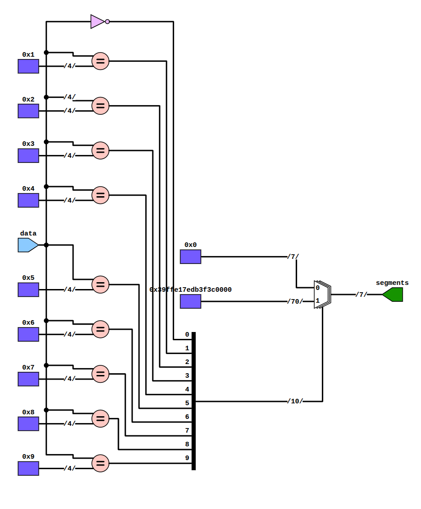

Пример дешифратора 3:8

Файл component_decoder3_8.vhd:

Строго говоря, условие `others` в данном случае не нужно для синтеза, поскольку перечислены все возможные сочетания входов, но оно полезно для моделирования на случай, если какой-либо из входов равен `x`, `z` или `u`.

```vhdl
library ieee;

use ieee.std_logic_1164.all;

entity component_decoder3_8 is
  port (
    a : in    std_logic_vector(2 downto 0);
    y : out   std_logic_vector(7 downto 0)
  );
end entity component_decoder3_8;

architecture synth of component_decoder3_8 is

begin
  process (all) is
  begin
    case a is
      when "000" =>  y <= "00000001";
      when "001" =>  y <= "00000010";
      when "010" =>  y <= "00000100";
      when "011" =>  y <= "00001000";
      when "100" =>  y <= "00010000";
      when "101" =>  y <= "00100000";
      when "110" =>  y <= "01000000";
      when "111" =>  y <= "10000000";
      when others => y <= "XXXXXXXX";
    end case;
  end process;
end architecture synth;
```

### Комбинационная логика. Условный оператор (if/else)

Если все возможные сочетания входов учтены условиями, то оператор описывает комбинационную логику, иначе – последовательностную (например, защелка)


Пример схема приоритетов, N-входовая схема приоритетов устанавливает в значение TRUE тот из выходов, который соответствует наиболее приоритетному входу, равному TRUE.

Файл component_priorityckt.vhd:
 
```vhdl
library IEEE; 
use IEEE.STD_LOGIC_1164.all;

entity component_priorityckt is
port(
    a: in STD_LOGIC_VECTOR(3 downto 0);
    y: out STD_LOGIC_VECTOR(3 downto 0)
    );
end;

architecture synth of component_priorityckt is
begin
    process(all) begin
        if a(3) = '1' then  y <= "1000";
        elsif a(2) = '1' then  y <= "0100";
        elsif a(1) = '1' then  y <= "0010";
        elsif a(0) = '1' then  y <= "0001";
        else  y <= "0000";
        end if;
    end process;
end;
```

### Комбинационная логика. Незначащие биты

Пример описания приоритетной схемы с незначащими битами.

Файл component_priority_casez.vhd

В VHDL-2008 используется "case?" для работы с символами '-'

```vhdl
library IEEE; 
use IEEE.STD_LOGIC_1164.all;

entity component_priority_casez is
    port(
        a: in STD_LOGIC_VECTOR(3 downto 0);
        y: out STD_LOGIC_VECTOR(3 downto 0)
    );
end entity component_priority_casez; 

architecture dontcare of component_priority_casez is
begin
    process(all) begin
        case? a is
            when "1---" => y <= "1000";
            when "01--" => y <= "0100";
            when "001-" => y <= "0010";
            when "0001" => y <= "0001";
            when others => y <= "0000";
        end case?; 
    end process;
end architecture dontcare;
```

### Конечные автоматы

Конечный автомат (КА) состоит из регистра состояния и двух блоков комбинационной логики для вычисления следующего состояния и выхода по заданному текущему состоянию и информации на входе.

Для инициализации КА используется асинхронный сброс. Регистр состоя­ния использует стандартную идиому для триггеров. Логика формирования следующего состояния и выхода является комбинационной.

Файл divideby3FSM.vhd:

```vhdl
library ieee;
use ieee.std_logic_1164.all;

entity divideby3fsm is
  port (
    clk   : in    std_logic;
    reset : in    std_logic;
    y     : out   std_logic
  );
end entity divideby3fsm;

architecture synth of divideby3fsm is
  type statetype is (s0, s1, s2);
  signal state, nextstate : statetype;

begin
  -- регистр состояния
  process (clk, reset) is
  begin
    if (reset) then
      state <= s0;
    elsif rising_edge(clk) then
      state <= nextstate;
    end if;
  end process;

  -- логика следующего состояния
  nextstate <= s1 when state = s0 else
               s2 when state = s1 else
               s0;
  -- выходная логика
  y <= '1' when state = s0 else
       '0';
end architecture synth;
```

В этом примере определяется новый тип перечисляемых данных `statetype` с тремя возможными значениями: `S0, S1 и S2`. `state` и `nextstate` – сигналы типа `statetype`. Благодаря использованию перечисления, а не явно задаваемых кодов состояний, VHDL позволяет синтезатору выбрать оптимальный код для состояний.

Выход `y` равен 1, когда `state` равно `S0`. Операция сравнения на неравенство записывается как `/=`. Чтобы получить на выходе 1, когда состояние отлично от `S0`, замените сравнение на state `/= S0`.

Если по какой-либо причине мы захотим, чтобы выход был равен 1 в состояниях `S0` и `S1`, выходная логика изменится следующим образом:

```vhdl
-- выходная логика
y <= '1' when (state = S0 or state = S1) else '0';
```

 
Следующие два примера описывают КА распознавателя битового
шаблона улитки. В коде показано, как использовать
операторы case и if для обработки следующего состояния и выходной
логики, зависящей и от входа, и от текущего состояния.

Пример автомат Мура для распознавания битового шаблона

Файл patternMoore.vhdl:

```vhdl
library ieee;

use ieee.std_logic_1164.all;

entity patternmoore is
  port (
    clk   : in    std_logic;
    reset : in    std_logic;
    a     : in    std_logic;
    y     : out   std_logic
  );
end entity patternmoore;

architecture synth of patternmoore is
  type statetype is (s0, s1, s2);
  signal state, nextstate : statetype;

begin

  -- регистр состояния
  process (clk, reset) is begin
    if (reset = '1') then
      state <= s0;
    elsif rising_edge(clk) then
      state <= nextstate;
    end if;
  end process;

  -- логика следующего состояния
  process (all) is begin
    case state is
      when s0 =>
        if (a = '1') then nextstate <= s0;
        else nextstate <= s1;
        end if;
      when s1 =>
        if (a = '1') then nextstate <= s2;
        else nextstate <= s1;
        end if;
      when s2 =>
        if (a = '1') then nextstate <= s0;
        else nextstate <= s1;
        end if;
      when others =>
        nextstate <= s0;
    end case;

  end process;

  -- выходная логика
  y <= '1' when state = s2 else
       '0';

end architecture synth;
```

---

### Параметризированные модули

До сих пор у модулей в наших примерах входы и выходы были фиксированной ширины. Но в языках описания аппаратуры HDL можно описывать и параметризированные модули с портами переменной ширины.

Пример дешифратор.

Широкий дешифратор $N:2^N$ довольно утомительно описывать с помощью оператора `case`, но это легко сделать с помощью параметризированного модуля, который просто устанавливает нужный бит в 1. Иначе говоря, в дешифраторе использовано блокирующее присваивание для установки всех битов в 0, а затем нужный бит изменяется в 1. 

$2**N$ означает $2^N$

Файл component_decoder_param.vhd:

```vhdl
library ieee;
  use ieee.std_logic_1164.all;
  use ieee. numeric_std_unsigned.all;

entity decoder is
  generic (
    n : integer := 3
  );
  port (
    a : in    std_logic_vector(N-1 downto 0);
    y : out   std_logic_vector(2 ** n - 1 downto 0)
  );
end entity decoder;

architecture synth of decoder is

begin
  process (all) is
  begin
    y                <= (others => '0');
    y(TO_INTEGER(a)) <= '1';
  end process;
end architecture synth;
```

---

Оператор `generate` для получения разного количества аппаратуры в зависимости от значения параметра.

В операторе `generate` допускаются циклы `for` и операторы `if` для определения количества и свойств желаемой аппаратуры.

Демонстрируется, как использовать операторы `generate` для получения `N-входовой` функции `И` из каскада двухвходовых логических элементов `И`. Конечно, для этой конкретной цели лучше подошла бы операция сокращения, но этот пример иллюстрирует общий принцип использования оператора `generate`. Используйте операторы `generate` с осторожностью – из-за них можно легко непреднамеренно получить очень большую схему!

Файл component_andN_gen.vhd:

Переменную цикла generate объявлять не нужно.

```vhdl
library ieee;
use ieee.std_logic_1164.all;

entity andn is
  generic (
    width : integer := 8
  );
  port (
    a : in    std_logic_vector(width - 1 downto 0);
    y : out   std_logic
  );
end entity andn;

architecture synth of andn is
  signal x : std_logic_vector(width - 1 downto 0);
begin
  x(0) <= a(0);
  gen : for i in 1 to width - 1 generate
    x(i) <= a(i) and x(i - 1);
  end generate gen;
    y <= x(width - 1);
end architecture synth;
```

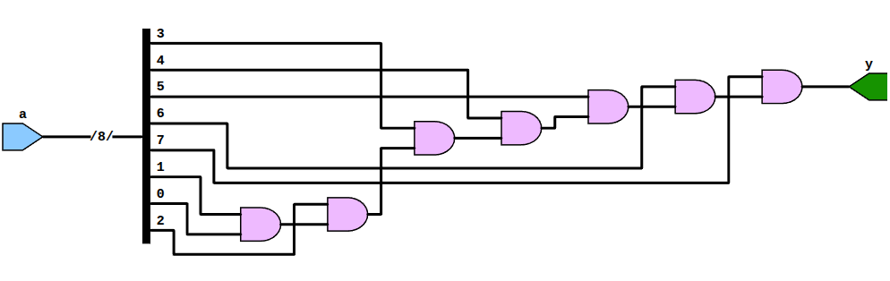

---

### Тестбенч


*Тестбенч* – это модуль на HDL, который используется для тестирования другого модуля, называемого тестируемое устройство (device under test, DUT)

Тестбенч содержит операторы для генерации значений, подаваемых на входы DUT, и также для проверки, что на выходе получаются правильные значения. Наборы входных и желаемых выходных значений называются *тестовыми векторами*.


Таблица истинности (Truth Table) на основе заданной логической функции. Таблица истинности основа для написания тестбенча. Без этой таблицы невозможно составить правильные условия assert. Именно из неё берутся значения «ожидаемый выход y равен 1 или 0» для каждой комбинации входных сигналов.
  
$y = (\bar{a}\bar{b}\bar{c}) + (a\bar{b}\bar{c}) + (a\bar{b}c) = \bar{b}\bar{c}(\bar{a} + a) + a\bar{b}c = \bar{b}\bar{c} + a\bar{b}c = \bar{b}(\bar{c} + ac) = \bar{b}(\bar{c} + a)$

Генерация всех возможных комбинация данных входа, используем [комбинаторику (размещения с повторениями)](Computer-Science-Bookshelf/discrete_mathematics/комбинаторика.html#Размещения-с-повторениями):

```rust, editable
fn generate_binary_sequences(n: usize) {
    let total = 1 << n; // 2^n комбинаций

    for i in 0..total {
        // выводим число как бинарную строку с ведущими нулями
        println!("{:0width$b}", i, width = n);
    }
}
fn main() {
    generate_binary_sequences(3);// 3 bit
}
```


| a | b | c | **y** | Комментарий / Терм из кода |
| --- | --- | --- | --- | --- |
| 0 | 0 | 0 | **1** | `not a and not b and not c` |
| 0 | 0 | 1 | **0** |  |
| 0 | 1 | 0 | **0** |  |
| 0 | 1 | 1 | **0** |  |
| 1 | 0 | 0 | **1** | `a and not b and not c` |
| 1 | 0 | 1 | **1** | `a and not b and c` |
| 1 | 1 | 0 | **0** |  |
| 1 | 1 | 1 | **0** |  |
 

Выход $y$ равен `1` только в трёх случаях:

1. Когда все входы равны 0 ($a=0, b=0, c=0$)
2. Когда $a=1, b=0, c=0$
3. Когда $a=1, b=0, c=1$

Во всех остальных случаях (включая любые комбинации, где $b=1$), выход будет равен `0`.
   
Файл sillyfunction.vhd:

```vhdl
library IEEE;
use IEEE.STD_LOGIC_1164.all;

entity sillyfunction is
  port (
    a, b, c : in std_logic;
    y       : out std_logic);

end;
architecture synth of sillyfunction is begin
  y <= (not a and not b and not c) or
    (a and not b and not c) or
    (a and not b and c);
end;
```

Синтезированная схема из кода файла sillyfunction.vhd

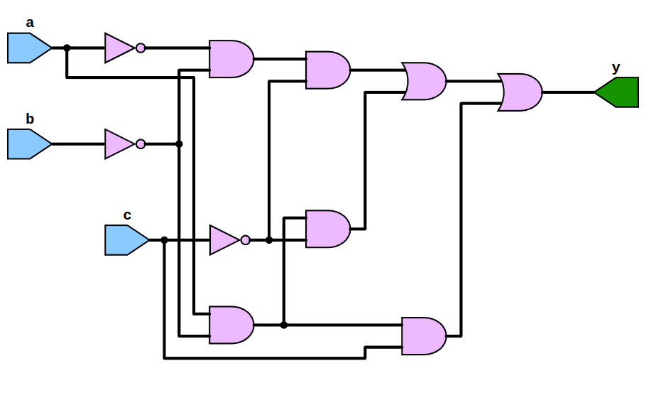

Тестирование кода vhdl из файла sillyfunction.vhd в симуляторе Digital

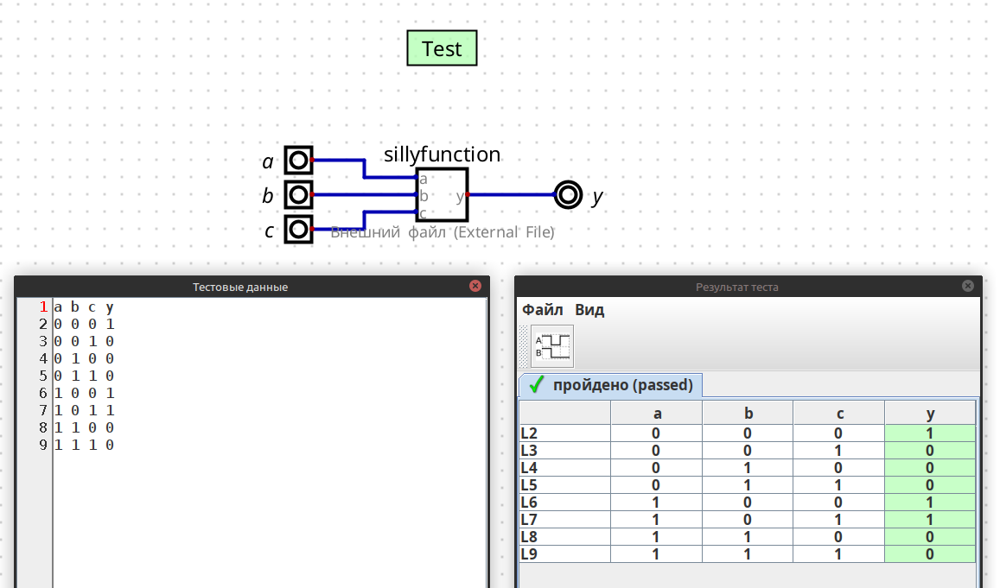

  
Составление testbench. 

В языке VHDL сигналы (`signal`) ведут себя как электронные регистры или защелки. Если Вы один раз присвоили сигналу значение (например, `a <= '0';`), оно сохраняется за ним неизменным до тех пор, пока Вы явно не присвоите ему новое значение.

Оператор `assert` проверяет условие и печатает сообщение, указанное после `report`, если условие не выполнено.

`DUT` это просто классическое имя (метка) для проверяемого компонента, расшифровывается как Device Under Test (тестируемое устройство) или иногда `UUT` (Unit Under Test).

*В цифровом проектировании это общепринятый стандарт де-факто: называть экземпляр тестируемой схемы в тестбенче словом dut.*


Файл тестбенча (Testbench) — специальный VHDL-код, который сам ничего не синтезирует, а просто генерирует тактовый сигнал, сброс и подает данные на входы Вашего модуля.
 
Файл sillyfunction_tb.vhd:

```vhdl
library ieee;
use ieee.std_logic_1164.all;
use ieee.numeric_std.all;

entity sillyfunction_tb is
end entity sillyfunction_tb;

architecture bench of sillyfunction_tb is
  -- Simulation step period
  constant clk_period : time := 10 ns;
  
  -- Signals for DUT connection
  signal a : std_logic;
  signal b : std_logic;
  signal c : std_logic;
  signal y : std_logic;
begin

  -- Direct instantiation of Device Under Test (DUT)
  dut : entity work.sillyfunction
  port map (
    a => a,
    b => b,
    c => c,
    y => y
  );

  -- Stimulus and verification process
  stimulus : process
  begin
    -- 1. Combination 000 -> Expect 1
    a <= '0'; b <= '0'; c <= '0'; wait for clk_period;
    assert (y = '1') report "Error on combination 000! Expected 1." severity failure;
    
    -- 2. Combination 001 -> Expect 0
    a <= '0'; b <= '0'; c <= '1'; wait for clk_period;
    assert (y = '0') report "Error on combination 001! Expected 0." severity failure;
    
    -- 3. Combination 010 -> Expect 0
    a <= '0'; b <= '1'; c <= '0'; wait for clk_period;
    assert (y = '0') report "Error on combination 010! Expected 0." severity failure;
    
    -- 4. Combination 011 -> Expect 0
    a <= '0'; b <= '1'; c <= '1'; wait for clk_period;
    assert (y = '0') report "Error on combination 011! Expected 0." severity failure;
    
    -- 5. Combination 100 -> Expect 1
    a <= '1'; b <= '0'; c <= '0'; wait for clk_period;
    assert (y = '1') report "Error on combination 100! Expected 1." severity failure;
    
    -- 6. Combination 101 -> Expect 1
    a <= '1'; b <= '0'; c <= '1'; wait for clk_period;
    assert (y = '1') report "Error on combination 101! Expected 1." severity failure;
    
    -- 7. Combination 110 -> Expect 0
    a <= '1'; b <= '1'; c <= '0'; wait for clk_period;
    assert (y = '0') report "Error on combination 110! Expected 0." severity failure;
    
    -- 8. Combination 111 -> Expect 0
    a <= '1'; b <= '1'; c <= '1'; wait for clk_period;
    assert (y = '0') report "Error on combination 111! Expected 0." severity failure;

    -- Final message upon success
    report "All tests passed successfully! Component logic is correct." severity note;
    
    wait; -- Stop simulation
  end process;

end architecture bench;
```

Тест в среде AMD Xilinx Vivado: SIMULATION/Run Simulation. 

Результат теста в Tcl Console: 
`Note: All tests passed successfully! Component logic is correct.`

[Пример Vivado с таймингами из файла delays_ex1.vhd](#amd-xilinx-vivado)

> Разрабатывать код для каждого тестового вектора тоже становится утомительно, особенно для модулей, требующих большого количества тестовых векторов. Еще лучше держать тестовые векторы в отдельном **файле**. Тогда тестбенч будет просто читать их из файла, подавать входной вектор на входы DUT, проверять, что значения выходов совпадают с выходным вектором, и повторять, пока не будет достигнут конец файла.


## Цифровые функциональные узлы

В этой главе мы рассмотрим более сложные комбинационные и последовательностные функциональные узлы, используемые в цифровых системах. Такие узлы включают в себя арифметические схемы, счетчики, схемы сдвига, матрицы памяти и мат­рицы логических элементов.

### Арифметические схемы. Сложение

Три типа сумматоров с распространяющимся переносом: 
* сумматоры с последовательным переносом (Ripple Carry), скорость работы линейна;  
* ускоренным переносом; (почти в три раза быстрее сумматора с последовательным переносом)
* префиксный сумматор (параллельный многоразрядный), рост скорости работы ($\log_2 N$); (почти в три раза быстрее сумматора с ускоренным переносом)

Быстрые сумматоры используют больше аппаратных ресурсов и, следовательно, являются более дорогостоящими и энергозатратными.

> [Konstantin Chaika/все о сумматорах по шагам](https://www.youtube.com/watch?v=G1GnAhp5WHc)

Файл serial_carry_adder.vhd:

Этот код описывает классический многоразрядный параметризуемый сумматор с распространяющимся последовательным переносом (Ripple Carry) и входным и выходным переносом (обычно его называют N-bit Full Adder)

По умолчанию (благодаря строке `n : integer := 8`) это 8-разрядный сумматор. Однако, изменяя параметр generic, его можно превратить в 16, 32 или даже 64-разрядный сумматор одной строчкой кода.


```vhdl
library ieee;
  use ieee.std_logic_1164.all;
  use ieee.numeric_std_unsigned.all;

entity adder is
  generic (
    n : integer := 8
  );
  port (
    a    : in    std_logic_vector(n - 1 downto 0);
    b    : in    std_logic_vector(n - 1 downto 0);
    cin  : in    std_logic;
    s    : out   std_logic_vector(n - 1 downto 0);
    cout : out   std_logic
  );
end entity adder;

architecture synth of adder is
  signal result : std_logic_vector(n downto 0);
begin
  result <= ("0" & a) + ("0" & b) + cin; -- компилятор понимает что одиночный бит cin (тип std_logic) можно математически прибавить к вектору
  -- если a — это 8-разрядный вектор (например, 11111111), то "0" & a превращает его в 9-разрядный вектор (011111111), что бы не потерять старший бит
  s      <= result(n - 1 downto 0); -- берем младшие 8 бит (от 0 до 7)
  cout   <= result(n); -- берем самый старший 9-й бит (индекс 8)
end architecture synth;
```

Префиксный сумматор (параллельный многоразрядный) это самый быстрый из всех существующих сумматоров для работы с большой разрядностью (32, 64 бита и более). В то время как обычный сумматор считает биты последовательно, Когге-Стоун делает это параллельно. Его префиксное дерево считает переносы для всех разрядов одновременно. Сигналы объединяются парами, затем четверками, затем восьмерками.

Существуют и другие параллельно-префиксные сумматоры (например, Brent-Kung или Ladner-Fischer). Но у Когге-Стоуна есть уникальное преимущество перед ними — Fan-Out (коэффициент разветвления) всегда равен ровно 2.

Это значит, что выход каждой логической ячейки внутри дерева подключен строго к двум входам следующего уровня.

В архитектуре Kogge-Stone при наличии внешнего $cin\_in$ каждый промежуточный бит переноса ($C_0 \dots C_7$) обязан физически включать в себя $cin\_in$. Если просто сдвигать индексы или добавлять $cin\_in$ только в крайние ячейки, длинная цепочка переноса «рвется» (что и происходило на критических тестах CIN=1 A=1 B=254 и CIN=1 A=128 B=127).

**VHDL 8-ми битного префиксного сумматора (архитектура Kogge-Stone)**

```vhdl
library IEEE;
use IEEE.STD_LOGIC_1164.all;

entity adder8bit is
  port (
    cin_in  : in  std_logic;
    a       : in  std_logic_vector(7 downto 0);
    b       : in  std_logic_vector(7 downto 0);
    output  : out std_logic_vector(7 downto 0);
    cin_out : out std_logic
  );
end entity adder8bit;

architecture Structural of adder8bit is
  -- Уровень 0: Базовые сигналы Generate (g0) и Propagate (p0)
  signal g0, p0 : std_logic_vector(7 downto 0);
  
  -- Уровень 1: Первая строка префиксного дерева (Сдвиг / Шаг = 1)
  signal g1, p1 : std_logic_vector(7 downto 0);
  
  -- Уровень 2: Вторая строка префиксного дерева (Сдвиг / Шаг = 2)
  signal g2, p2 : std_logic_vector(7 downto 0);
  
  -- Уровень 3: Третья строка префиксного дерева (Сдвиг / Шаг = 4)
  signal g3     : std_logic_vector(7 downto 0);
  
  -- Сигналы истинных переносов, поступающих на входы разрядов
  signal c      : std_logic_vector(7 downto 0);

begin

  ------------------------------------------------------------------------------
  -- ЭТАП 1. Препроцессинг (Входной уровень)
  ------------------------------------------------------------------------------
  gen_p0_g0: for i in 0 to 7 generate
    g0(i) <= a(i) and b(i);
    p0(i) <= a(i) xor b(i);
  end generate;

  ------------------------------------------------------------------------------
  -- ЭТАП 2. Префиксное дерево Когге-Стоуна (3 уровня)
  ------------------------------------------------------------------------------
  
  -- === УРОВЕНЬ 1 (Шаг = 1) ===
  -- Бит 0 не имеет соседа слева внутри дерева, поэтому p1(0) остается прежним
  g1(0) <= g0(0);
  p1(0) <= p0(0);
  
  -- Остальные биты (1..7) объединяются с непосредственным соседом (i-1)
  gen_l1: for i in 1 to 7 generate
    g1(i) <= g0(i) or (p0(i) and g0(i-1));
    p1(i) <= p0(i) and p0(i-1);
  end generate;


  -- === УРОВЕНЬ 2 (Шаг = 2) ===
  -- Биты 0 и 1 не имеют соседей на расстоянии 2, поэтому просто транслируются
  g2(1 downto 0) <= g1(1 downto 0);
  p2(1 downto 0) <= p1(1 downto 0);
  
  -- Остальные биты (2..7) объединяются с узлами на расстоянии 2 (i-2)
  gen_l2: for i in 2 to 7 generate
    g2(i) <= g1(i) or (p1(i) and g1(i-2));
    p2(i) <= p1(i) and p1(i-2);
  end generate;


  -- === УРОВЕНЬ 3 (Шаг = 4) ===
  -- Биты 0, 1, 2, 3 не имеют соседей на расстоянии 4, просто транслируются
  g3(3 downto 0) <= g2(3 downto 0);
  
  -- Биты 4..7 объединяются с узлами на расстоянии 4 (i-4)
  -- На этом уровне флаг 'p' нам больше не нужен, вычисляем только переносы 'g'
  gen_l3: for i in 4 to 7 generate
    g3(i) <= g2(i) or (p2(i) and g2(i-4));
  end generate;

  ------------------------------------------------------------------------------
  -- ЭТАП 3. Постпроцессинг (Интеграция cin_in и вычисление выходов)
  ------------------------------------------------------------------------------
  
  -- Интегрируем входной перенос cin_in в каждый сгенерированный префикс.
  -- Это гарантирует, что лавина cin_in мгновенно учтется в каждом разряде.
  gen_carries: for i in 0 to 7 generate
    c(i) <= g3(i) or (p2(i) and p1(i) and p0(i) and cin_in); 
  end generate;

  -- Выходной перенос сумматора — это истинный перенос самого старшего 7-го разряда
  cin_out <= c(7);

  -- Итоговая сумма: текущий Propagate (p0) XOR истинный перенос от ПРЕДЫДУЩЕГО разряда
  output(0) <= p0(0) xor cin_in;
  output(1) <= p0(1) xor c(0);
  output(2) <= p0(2) xor c(1);
  output(3) <= p0(3) xor c(2);
  output(4) <= p0(4) xor c(3);
  output(5) <= p0(5) xor c(4);
  output(6) <= p0(6) xor c(5);
  output(7) <= p0(7) xor c(6);

end architecture Structural;
```
  
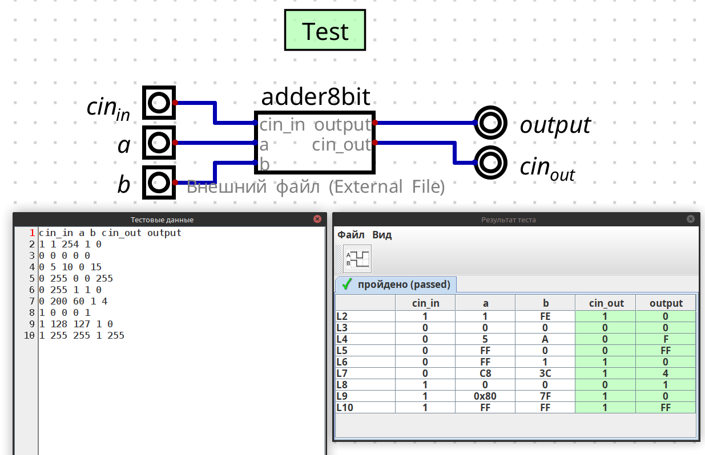

---

**Схема 16-ти битного префиксного сумматора (архитектура Kogge-Stone)**

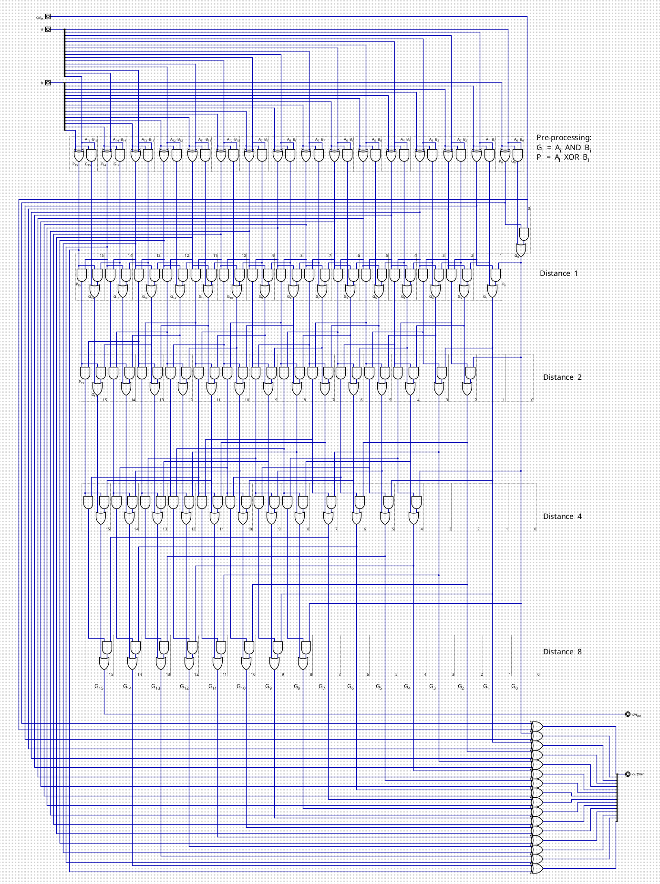

[Схема adder16bit для Digital (Digital Logic Designer от Helmut Neemann)](img/harris/adder16bit_Kogge-Stone.dig)

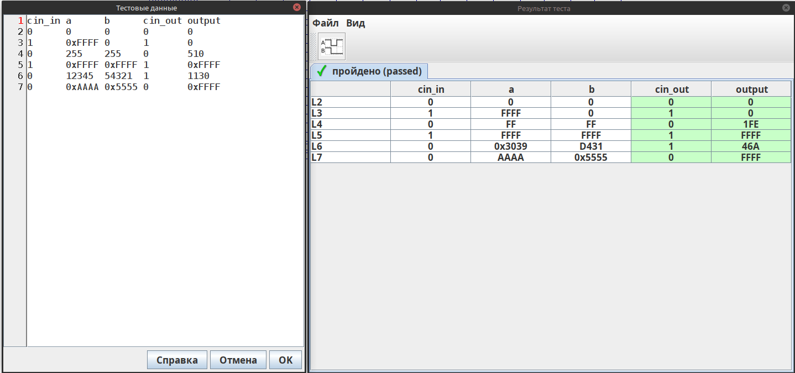

