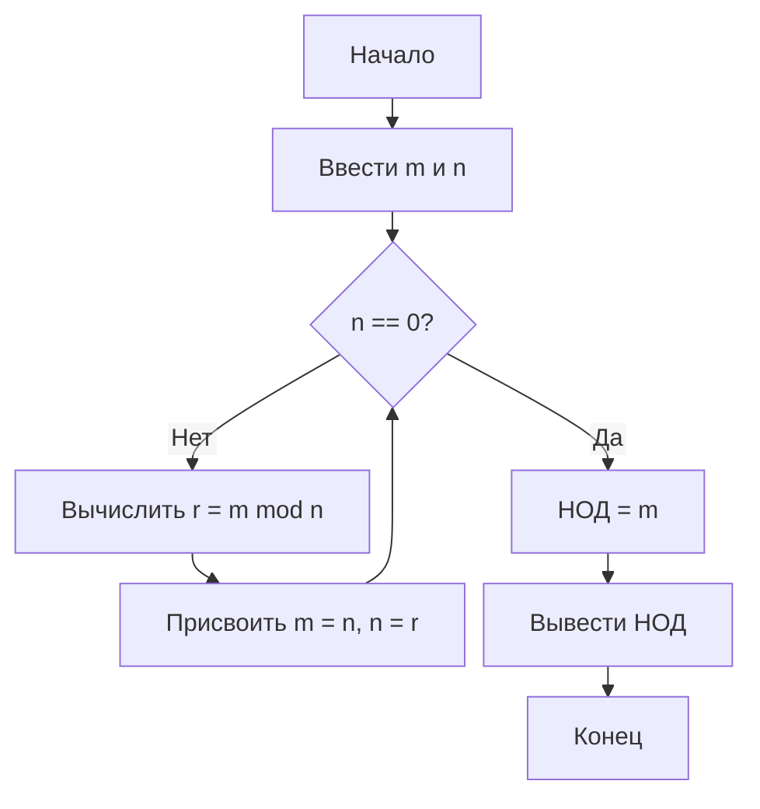

# Искусство программирования. Том 1 (3-е издание) (Основные алгоритмы)

## Предисловие к третьему изданию
компьютер и таким образом получить ее электронную
версию, что позволит в дальнейшем вносить любые изменения в технологию печати
и отображения на экране. Такой способ работы дал мне возможность сделать
буквально тысячи улучшений; я добился того, о чем так долго мечтал.
В этом новом издании я смог проверить каждое слово в тексте, стараясь сохра-
сохранить юношеский задор моих первоначальных исследований и в то же время внести
большую зрелость суждений. 

## 1.1. АЛГОРИТМЫ

К 1950 году слово “алгоритм” чаще всего ассоциировалось с алгоритмом Евклида, который представляет собой процесс нахождения наибольшего общего делителя двух чисел.


 

```rust
fn euclid(mut m:u32, mut n:u32) -> u32{
    if n == 0 {return m;}
    if n > m {
        std::mem::swap(&mut m, &mut n);
    }
    let r = (m%n) as u32;
    println!("m={m} n={n} r={r}");
    return euclid(n, r);
} 

fn main() {
  println!("euclid:{}", euclid(119, 544));
}
```
