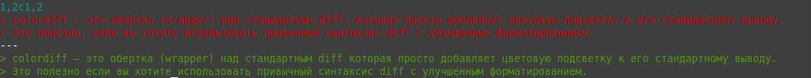
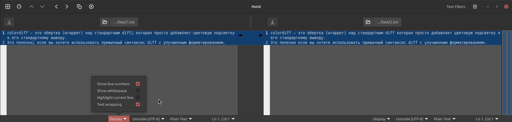
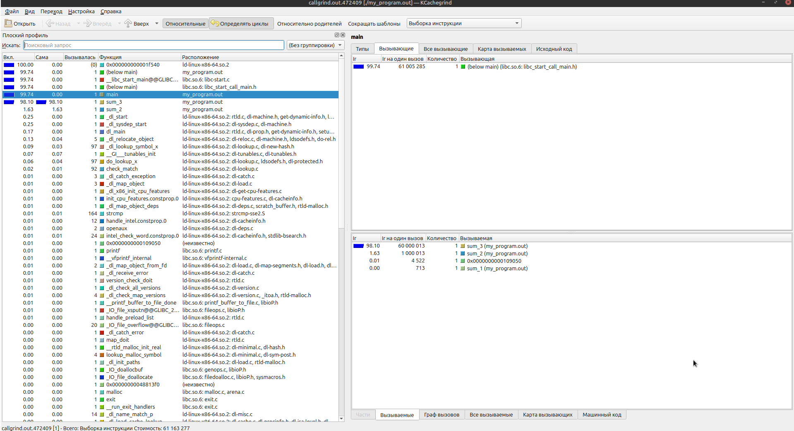

# Брайан Керниган, Роб Пайк. Практика программирования


- [Глава 1. Стиль программирования](#Глава-1-Стиль-программирования)
- [Глава 2. Алгоритмы и структуры данных](#Глава-2-Алгоритмы-и-структуры-данных)
- [Глава 3. Проектирование и реализация](#Глава-3-Проектирование-и-реализация)
- [Глава 4. Интерфейсы](#Глава-4-Интерфейсы)
- [Глава 5. Отладка](#Глава-5-Отладка)
- [Глава 6. Тестирование](#Глава-6-Тестирование)
- [Глава 7. Быстродействие](#Глава-7-Быстродействие)
- [Глава 8. Переносимость](#Глава-8-Переносимость)

## Глава 1. Стиль программирования

Пользуйтесь длинными, содержательными именами для глобальных объектов и короткими — для локальных.

Объявление каждого глобального имени полезно сопровождать кратким комментарием:

```
int npending =0; // текущая длина входной очереди
```

Например, следующая запись несет избыточную, дублирующуюся информацию:

```
queue.queueCapacity
```

**Учитывайте возможные побочные эффекты.**

при множественном присваивании результат может оказаться неправильным:

```c
str[i++] = str[i++] = ' ';

n = 1;
printf("%d %d\n", n++, n++);
```

Даже если оператор содержит всего одно инкрементирование, он все равно может дать непредсказуемый результат.
Если, например, вначале переменная i была равна 3, то элемент массива может получить значение как 3, так и 4.

```c
array[i++] = i;
```

**Используйте устойчивые конструкции (идиомы) для поддержания единого стиля.**

Идеоматический перебор в C++ и Java:

```c
for (i = 0; i < n; i++)
    array[i] = 1.0;
```

А вот стандартный цикл для перебора списка в языке С:

```c
for (р = list; р != NULL; р = p->next)
    ...
```

**Используйте каскад else if для реализации многовариантного выбора.**

Длинный каскад вложенных операторов if часто свидетельствует о низком качестве кода, а то и об откровенных ошибках в нем:
Этот каскад операторов if требует держать в уме "стек" условий и проверок, чтобы в нужных местах доставать из этого стека информацию.

```c
if (argc == з)
    if ((fin = fopen(argv[l], "г")) != NULL)
        if ((fout = fopen(argv[2], "w")) != NULL) {
            while ((c = getc(fin)) != EOF)
                putc (c, fout) ;
            fclose(fin); fclose(fout);
        } else
            printf("Can't open output file %s\n", argv[2]);
    else
        printf("Can1t open input file %s\n", argv[l]);
else
    printf("Usage: cp inputfile outputfile\n");
```

Поскольку в каждом случае выполняется максимум одна операция, следует воспользоваться системой операторов `else if`.  

```c
if (argc 1= 3)
    printf("Usage: cp inputfile outputfile\n");
else if ((fin = fopen(argv[1], "r")) == NULL)
    printf("Can't open input file %s\n", argv[l]);
else if ((fout = fopen(argv[2], "w")) == NULL) {
    printf("Can't open output file %s\n", argv[2]);
    fclose(fin);
} else {
    while ((c = getc(fin)) != EOF)
        putc(c, fout);
    fclose(fin);
    fclose(fout);
}

```

**Избегайте макрофункций.**


Макрофункция — это простая текстовая подстановка. Параметры в ее объявлении заменяются фактическими аргументами, и полученный фрагмент вставляется в виде текста на место вызова макроса.

Представители старой школы программирования на С очень любят писать макросы вместо функций для быстрых и коротких вычислений, которые выполняются очень часто.Поводом для их написания служит повышение быстродействия — с помощью макроса можно избежать потерь времени на вызов функции. Но этот аргумент был не очень убедителен даже в первые годы существования С, когда компьютеры работали медленно, а функции вызывались долго; в настоящее время об этом вообще смешно говорить.   В языке C++ встраиваемые (inline) функции сделали функциональные макросы ненужными.

Одна из наиболее серьезных проблем с макрофункциями состоит в том, что если в ее определении несколько раз фигурирует один и тот же параметр, то он может вычисляться тоже несколько раз. Если макрофункция содержит операции с побочными эффектами, в результате получается трудноуловимая ошибка.

Неожиданные последствия побочного эффекта:

```c
#define isupper(c) ((c) >= 'A' && (c) <= 'Z')

// Контекст вызова
while (isupper(c = getchar()))

// На первый взгляд, вроде бы нет противоречий:
// Макрос принимает символ `c` который считывает getchar() и проверяет, является ли он заглавной буквой.

// Но, на самом деле макрос просто подставляется текстом, до компиляции!
while (((c = getchar()) >= 'A' && (c = getchar()) <= 'Z'))

// Теперь getchar() вызывается дважды!
// Теперь всякий раз, когда введенный символ по своему значению больше или равен 'А', он будет затираться следующим символом, сравниваемым уже с 'Z'.

// Перепишем корректно
while ((с = getchar()) != EOF && isupper(c))

```

Если все же вам необходимо определить макрофункцию, делайте это с осторожностью. Заключайте в скобки тело макрофункции и ее аргументы. 
 
```c
// Возьмем, например, следующй макрос:
#define macro_square(х) (х) * (х)

// и выражение
1 / macro_square(х)

// В этом случае макроподстановка даст следующее ошибочное выражение:
1 / (x) * (x)

// Чтобы исправить ошибку, макрос следует переписать таким образом:
#define square(х) ((х) * (х))

// тогда получим корректное выражение:
1 / ((x) * (x))
```

**Присваивайте константам символические имена.**

Вместо макросов `#define` и констант (когда используется какое-то значение без имени в ходе вычисления), используйте enum 

Это избавляет от логических ошибок при подстановки кода макроса в выражения на этапе компиляции.
И делает наглядным применение общих данных.
```c
#define  MINROW 1        /* верхний край */
#define  MINCOL 1        /* левый край */
// ...

// заменим на enum
enum {
     MINROW=1,           /* верхний край */
     MINCOL=1,           /* левый край */
     MAXROW=24,          /* нижний край (<=) */
     LABELROW=1,         /* местоположение меток */
     HEIGHT=MAXROW-4,    /* высота столбцов гистограммы */
};
```


**Используйте символьные константы, а не их числовые коды.**

Для анализа свойств символьных переменных следует пользоваться функциями из заголовочного файла <сtype.h> или их эквивалентами. 

Возьмем, например, следующую проверку:
```c
if (c >= 65 && c <= 90)

// Лучше записать это следующим образом:
if (c >= 'A' && c <= 'Z' )

// Но и эта конструкция может не дать желаемого эффекта, если буквы в наборе идут не подряд или же алфавит  включает и другие символы, лучше всего воспользоваться библиотечной функцией:
if (isupper(с))

```

Нечто подобное происходит с числом `0`, которое может фигурировать в программах в самых разных контекстах.
Конечно, компилятор всегда приведет его к нужному типу самостоятельно, однако при чтении программы полезно понимать, какую роль играет нуль в том или ином случае.
Например, в `С` для обозначения нулевого указателя следует пользоваться выражениями `(void *) 0` или `NULL`, а для представления нулевого байта в конце строки — выражением `'\0'`.

Лучше записать `0` таким образом, для:
```c
int x = 0; // int-литерал, в выражениях, где ожидается число, это просто «ноль»

str = NULL; // NULL или `(void *)0` — нулевой указатель
    // NULL — это макрос, определённый в <stddef.h> или <stdio.h>
    // #define NULL ((void *)0)

name[i] = '\0';// символьный литерал тип char, нулевой байт, конец строки (код 48), то есть терминатор строки.   
    // Используется, чтобы пометить конец строки в стиле C:
    char str[] = {'H', 'i', '\0'};
    printf("%s", str); // выведет "Hi" 
    
x = 0.0; // литерал с плавающей точкой, тип double, чтобы не было неявных преобразований типов
```

## Глава 2. Алгоритмы и структуры данных

> Полезно разобрать как устроены струтуры данных и как работают алгоритмы на примеры языка C 

Весь материал в репозиториях:
* [Implementation and understanding of data structures](https://github.com/Jekahome/Data-Structures)
* [Implementing algorithms and understanding complexity](https://github.com/Jekahome/Algorithms)

## Глава 3. Проектирование и реализация  

Мы хотим сгенерировать случайный текст на английском языке, который можно было бы прочитать. Если генерировать слова или буквы по счетчику случайных чисел, в результате получается бессмыслица.

`xptmxgn xusaja afqnzqxl lhidlwcd rjdjuvpydrlwnjy`

Также не слишком осмысленным получается текст, если составить его из слов, наугад выбранных из словаря:

`polydactyl equatorial splashily jowl verahdah circumscribe`

**Цепь Маркова**

Поставленная задача обработки данных изящно решается с помощью алгоритма,в котором используется цепь Маркова. Представим себе входные данные как цепочку перекрывающихся словосочетаний. Данный алгоритм делит каждую фразу на две части: префикс из нескольких слов и суффикс из одного слова, следующий за префиксом.

Вот некоторые пары слов из исходных данных и следующие за ними слова.

Префиксы из двух слов Слова-суффиксы

| Префиксы | Слова-суффиксы|
|----|----|
|Show your |flowcharts tables|
|your flowcharts |and will|
|flowcharts and |conceal|
|flowcharts will| be|
|your tables |and and|
|will be |mystified, obvious,|
|be mystified |Show|
|be obvious. |(end)|

Марковский алгоритм начинает свою работу по обработке этого текста с вывода слов `Show your`, а затем случайным образом выбирает либо `flowcharts`, либо `tables`. Если выбирается первый вариант, то префикс приобретает вид `your flowcharts` и следующее слово должно быть `and` или `will`. Если выбирается вариант `tables`, то следующим словом будет `and`. Так продолжается до тех пор, пока не будет сгенерировано достаточно текста или пока в качестве суффикса не встретится маркер (`end`).

> Текст, сгенерированный простой цепью Маркова, часто выглядит бессмысленным на длинных отрезках, потому что базовая модель:
> 
> * Смотрит только на предыдущее состояние: Цепь Маркова первого порядка (самая простая) помнит только одно предыдущее слово (или символ). Она не "понимает" грамматику, синтаксис или общую логику всего предложения или абзаца.
> 
> * Не имеет памяти о смысле: Она просто использует вероятности перехода (какое слово чаще всего следует за предыдущим), что хорошо для локальной связности, но катастрофично для создания глобального, осмысленного повествования.
> 
> Для создания действительно качественного и связного текста сегодня используются гораздо более сложные модели, такие как рекуррентные нейронные сети (RNN) и, в основном, трансформеры (на которых построены современные большие языковые модели, например, ChatGPT, Gemini и другие).

> Цепи Маркова нужны не только для генерации текста. Это математическая модель, которая описывает последовательность случайных событий, где вероятность каждого последующего события зависит только от текущего состояния, а не от всей предыдущей истории (это называется свойством Маркова).

## Глава 4. Интерфейсы

### Сокрытие информации

**Сокрытие информации**: какие данные должны быть видимы пользователю, а какие — скрыты от него? Интерфейс должен обеспечивать несложный доступ к компонентам и при этом скрывать детали реализации так, чтобы ее можно было дорабатывать незаметно для пользователя. Сокрытие информации. Библиотека не должна накладывать никаких ограничений на длину входной строки или количество полей в ней.

Скрывайте подробности реализации. Реализация, стоящая за интерфейсом, должна быть скрыта от остальных частей программы так, чтобы ее изменение не повлияло ни на что за ее пределами. Этот организационный принцип известен под многими именами: сокрытие информации, инкапсуляция, абстрагирование, модуляризация и т.д. Все это разные названия для одной и той же идеи. Интерфейс должен скрывать детали реализации, несущественные для клиента (пользователя). Невидимые подробности можно легко изменить — например, для того, чтобы расширить область действия интерфейса, сделать его более эффективным или вообще заменить всю реализацию полностью.

Если в заголовочном файле нет подробного объявления структуры, а только ее имя, то такой тип часто называют скрытым (opaque), потому что его свойства невидимы, а все операции выполняются через указатель на какой-то реальный объект.

Избегайте глобальных переменных. Везде, где это возможно, передавайте ссылки на все данные через аргументы. Мы решительно настроены против открытости или общедоступности данных в любой форме — слишком уж сложно поддерживать корректную последовательность обработки данных, если дать пользователю право изменять переменные по его усмотрению.

Не делайте ничего за спиной пользователя. Библиотечная функция не должна записывать секретных файлов или переменных, а также изменять глобальные данные. Кроме того, ей следует быть крайне осторожной с модификацией данных в вызывающем модуле. А вот функция `strtok` нарушает сразу несколько из этих требований. Неприятно удивляет тот факт, что она записывает нулевые байты в середину строки ее исходных данных. То, что функция использует нулевой байт для обозначения места окончания предыдущей операции, подразумевает хранение неких секретных данных между ее вызовами, а это потенциальный источник ошибок и препятствие к параллельной работе нескольких экземпляров функции.

Выполняйте одну и ту же операцию везде одинаковым способом. Очень важно соблюдать согласованность и единообразие. А вот в стандартной библиотеке ввода-вывода С трудно предсказать порядок аргументов при вызове функций. В некоторых аргумент типа `FILE*` стоит первым, в некоторых — последним; размер и количество элементов передаются в какой угодно последовательности.  

### Управление ресурсами

**Управление ресурсами**: кто должен отвечать за распределение памяти и других ограниченных ресурсов? Основные проблемы — это как размещать и удалять объекты из памяти и как распоряжаться совместно используемыми экземплярами данных. Управление ресурсами. Необходимо решить, кто будет отвечать за совместно используемые данные. Кто должен открывать и закрывать файл исходных данных? Тот, кто его открывает, должен и закрывать: парные задачи должны выполняться на одном и том же уровне или в одном модуле.

Самый очевидный из таких ресурсов — это память, относительно которой всегда возникает вопрос, кто должен ее распределять и освобождать. Но есть и другие важные ресурсы совместного пользования, такие как открытые файлы и общие переменные. 

**Освобождайте ресурс на том же уровне, на котором он запрашивался**. Один из подходов к управлению размещением и освобождением ресурса заключается в том, чтобы его уничтожением ведала та же библиотека, пакет или интерфейс, которые отвечают за распределение памяти для него. Другая формулировка этого подхода такова — интерфейс не должен изменять статус существования ресурса так, чтобы это было заметно снаружи.

В деле сборки мусора существует целый ряд подходов и приемов. В некоторых схемах подсчитывается количество обращений к каждому объекту из модулей — ведется его счетчик ссылок. Объект освобождается тогда, когда его счетчик ссылок становится равным нулю. Эту технику можно запрограммировать в С и C++ явным образом для управления объектами общего пользования. В других методах периодически отслеживается путь от пула размещенных в памяти объектов ко всем объектам, на которые имеются ссылки. Объекты, для которых этот путь прослежен, считаются используемыми, тогда как объекты, на которые не ссылаются никакие другие, полагаются неиспользуемыми и могут быть освобождены.

Во избежание проблем необходимо писать **реентерабельный код**, т.е. такой, который работает корректно независимо от количества одновременно вызванных модулей. В реентерабельном коде нет ни глобальных переменных, ни статических локальных переменных, и вообще любых переменных, которые могут модифицироваться в то время, пока ими пользуется другой поток. Ключ к хорошему многопоточному программированию лежит в таком разделении компонентов, при котором они взаимодействуют только через четко определенные интерфейсы. Библиотеки, которые неосторожно предоставляют переменные в общее пользование, наносят смертельный удар по этой модели. (В многопоточной программе функция `strtok` — это настоящее стихийное бедствие, как и все функции из библиотеки С, которые хранят данные во внутренних статических переменных.) Если уж так необходимо отдавать переменные в общее пользование, то их необходимо снабдить каким-то механизмом захвата и блокирования, чтобы гарантировать единовременное обращение со стороны только одного потока.


### Обработка ошибок

**Обработка ошибок**: как распознавать ошибки и выдавать сообщения о них?
Какие меры необходимо принять, если произошла та или иная ошибка? В принципе, библиотечные функции не должны просто завершаться аварийно, если случается ошибка; тип ошибки необходимо сообщить вызывающему модулю, чтобы тот принял надлежащие меры. Не следует также выдавать сообщения об ошибках или открывать диалоговые окна, поскольку программа может выполняться в среде, где это неуместно и будет мешать работе.

Предположим, что нам требуется не просто написать несколько функций для своего собственного употребления, а сформировать библиотеку для передачи другим пользователям. Что должна делать функция в такой библиотеке, если случается непоправимая ошибка? Функции, приведенные ранее в этой главе, выводили на экран сообщение об ошибке и завершали программу аварийно. Это вполне подходит для многих программ, особенно небольших утилит и автономных приложений. Но во многих случаях такой образ действий окажется неправильным, поскольку не даст другим модулям программы шанса исправить положение. Например, текстовый редактор должен попытаться не потерять информацию из редактируемого документа. В некоторых ситуациях библиотечная функция не должна даже выводить сообщение, потому что программа вполне может выполняться в среде, где такое сообщение исказило бы выходные данные или просто пропало без следа. Разумный вариант — это выводить диагностические сообщения в файл-протокол, который можно читать независимо от других данных.

> можно запрогораммировать пару альтернативных режимов поведения при возникновении ошибок и исключительных ситуаций, и предоставить выбор на уровень выше. Ясно что не это для библиотеки, а не для конечного пользователя программы. 

**Перехватывайте ошибки на низком уровне, обрабатывайте их на высоком.**
Общий принцип гласит, что ошибки следует перехватывать на как можно более низком системном уровне, а вот обрабатывать их — на высоком. В большинстве случаев решать, что делать в связи с ошибкой, должен вызывающий, а не вызываемый модуль. Библиотечные функции могут помочь в этом, завершая ошибочную операцию корректно и неаварийно. Рассуждая таким образом, в случае несуществующего поля данных лучше возвращать `NULL`, чем завершать программу аварийно.


Во многих библиотечных функциях есть способ отличить возвращаемый нормальный результат от ошибочного. Так, функция ввода `getchar` возвращает элемент типа `char` в случае успеха и некоторое несимвольное значение типа `EOF` в случае конца файла или другой ошибки. Этот механизм не срабатывает, если возможные корректные данные заполняют весь диапазон возвращаемых функцией значений.

Было бы желательно отличать друг от друга различные исключительные состояния наподобие конца файла и др., а не сваливать их все в одну кучу и огульно называть "ошибками". Если это трудно, можно ограничиться возвратом одного "исключительного" результата, но определить еще одну функцию, которая бы по требованию выдавала более подробную информацию о последней случившейся ошибке. Именно такой подход принят в системе Unix и стандартной библиотеке С, в которой многие системные вызовы и библиотечные функции возвращают `-1`, а также помещают специфический код ошибки в глобальную переменную errno. Функция `strerror` служит для возврата строкового сообщения, ассоциированного с кодом ошибки.

**Используйте исключительные ситуации для действительно исключительных случаев**. В некоторых языках для перехвата необычных ситуаций и принятия мер существует механизм исключительных ситуаций. Если случается ошибка, выполнение программы направляется по альтернативному пути. Исключительные ситуации не следует использовать для работы с ожидаемыми, нормальными значениями данных. Неудача при открытии файла — это не очень-то экстраординарное событие; генерирование исключительной ситуации для такого случая выглядит слишком сильной мерой. В программах на С с помощью пары функций `setjmp` и `longjmp` можно организовать низкоуровневую системную базу для построения механизма исключительных ситуаций.

А как насчет восстановления ресурсов в случае ошибки? Должна ли библиотека пытаться восстановить ресурсы, если случается ошибка? Обычно не должна, но она может оказать услугу другим модулям, постаравшись оставить после себя информацию в настолько корректном и безопасном состоянии, насколько это возможно.


## Глава 5. Отладка

Отладка программы, подобно раскрытию преступления, всегда подразумевает дедуктивное рассуждение.

Некоторые средства и свойства языков действительно делают определенные классы ошибок гораздо менее вероятными. К таким средствам относится контроль диапазона индексов массивов, ограниченное использование указателей или вообще отказ от них, сборка мусора, специальные строковые типы данных, типизированный ввод-вывод, строгие требования к соответствию типов. 

Есть и такие средства, которые особенно сильно провоцируют возникновение ошибок. Это оператор goto, глобальные переменные, неконтролируемые указатели, автоматические преобразования типов. 

Программистам следует знать слабые или рискованные места своих языков и соблюдать особую осторожность при их применении. 

Необходимо также включать все проверки, поддерживаемые компилятором, и обращать внимание на все предупреждения.

**Пример Флагов Компиляции C99:**

`gcc -std=c99 -Wall -Wextra -Wformat -Werror -Wconversion -Wformat=2 -Wformat-security -O0 main.c -o main.out`


| Флаг | Назначение | Пояснение |
| :--- | :--- | :--- |
| **-std=c99** | Стандарт языка | Гарантирует, что компилятор использует правила и особенности стандарта **C99**. |
| **-Wall** | Все распространенные предупреждения | Включает обширный набор базовых, но важных предупреждений (напр., неинициализированные переменные). |
| **-Wextra** | Дополнительные предупреждения | Включает менее распространенные, но полезные проверки, которые не входят в -Wall (напр., неиспользуемые параметры функций). |
| **-Wformat** | Базовая проверка printf/scanf | Проверяет, что аргументы функций ввода/вывода (с использованием \%d, \%s) соответствуют их типу. |
| **-Wformat=2** | Усиленная проверка printf/scanf | Включает более строгие проверки безопасности и соответствия форматов. |
| **-Wformat-security** | Проверка безопасности формата | Предупреждает о потенциальных уязвимостях "Format String Attack" (атака через строку формата). |
| **-Wconversion** | Предупреждает о неявных преобразованиях | Предупреждает о неявных преобразованиях, которые могут изменить значение с потерями, без потерь игнорируется |
| **-O0** | Уровень оптимизации | Устанавливает уровень оптимизации в **ноль (0)**, что **критически важно для отладки** в GDB. Гарантирует, что код в отладчике GDB (исполняемые инструкции) строго соответствует исходному коду. Оптимизация может переупорядочить или удалить переменные, делая отладку невозможной или непредсказуемой. |
| **-Werror** | Превратить предупреждения в ошибки | Гарантирует, что код не скомпилируется, если компилятор обнаружит хотя бы одно предупреждение. Это отличная практика для поддержания чистого и безопасного кода. |

Обычно бывает нетрудно выяснить, в каком месте прервалось выполнение программы, проследить последовательность активных в тот момент функций (стековый фрейм) и отобразить значения локальных и глобальных переменных. Этой информации может оказаться вполне достаточно для обнаружения ошибки. Если же это не так, то с помощью точек останова и пошагового выполнения можно выполнить аварийную программу в отладочном режиме и найти место первого проявления проблемы.

"Слепое зондирование" с помощью отладчика далеко не всегда бывает продуктивным. На наш собственный вкус, отладчики лучше использовать только для получения стекового фрейма и значений одной-двух переменных. Одна из причин нашей нелюбви к отладчикам состоит в том, что бывает очень легко заблудиться в подробностях сложных структур данных и управляющих конструкций. Гораздо полезнее выяснить с помощью отладчика, **в каком состоянии
находилась программа в момент аварийного завершения**, а затем подумать, как это
состояние могло наступить.

Если ничего не получается понять в том какая причина ошибки, **сделайте перерыв**,... *прогуляйтесь, подышите свежим воздухом*. Иногда вы видите в исходном коде не то, что там написано, а то, что вам хотелось бы видеть. Перерыв даст вам возможность успокоиться и вернуть себе объективность в восприятии кода.

**Объясните код кому-то другому.** В одном из университетских вычислительных центров недалеко от рабочего стола консультанта восседал плюшевый медведь. Студенты, озадаченные таинственными ошибками в своих программах, обязаны были сперва поведать свои беды медведю, и только после этого им разрешалось обратиться за советом к преподавателю. 🤣

Стройте графики. Часто графики и схемы приносят больше пользы при отладке, чем текстовые данные. Разного рода графические схемы особенно полезны при анализе структур данных. Элементарная **гистограмма данных** позволяет обнаружить ненормальные отклонения в сводках экзаменационных оценок, наборах псевдослучайных чисел, размерах ячеек в хэш-таблицах и т.п.


Полезные инструменты сравнения текста diff:

Найти различия: в файлах 1.txt 2.txt, текст различается наличием пары запятых.


diff утилиты работают по принципу построчного сравнения. Если в строке 1.txt и соответствующей строке 2.txt есть хотя бы одно отличие (например, отсутствие одной запятой), то вся эта строка считается измененной и выводится целиком.

**diff**

```
$ diff -u 1.txt 2.txt
--- 1.txt	2025-11-19 13:00:56.291699715 +0100
+++ 2.txt	2025-11-19 13:00:59.921779274 +0100
@@ -1,2 +1,2 @@
-colordiff — это обертка (wrapper) над стандартным diff, которая просто добавляет цветовую подсветку к его стандартному выводу. 
-Это полезно, если вы хотите использовать привычный синтаксис diff с улучшенным форматированием.
+colordiff — это обертка (wrapper) над стандартным diff которая просто добавляет цветовую подсветку к его стандартному выводу. 
+Это полезно если вы хотите использовать привычный синтаксис diff с улучшенным форматированием.
```

**colordiff** (аналогично и `git diff --no-index 1.txt 2.txt`)


```
$ sudo apt install colordiff
$ colordiff 1.txt 2.txt
1,2c1,2
< colordiff — это обертка (wrapper) над стандартным diff, которая просто добавляет цветовую подсветку к его стандартному выводу. 
< Это полезно, если вы хотите использовать привычный синтаксис diff с улучшенным форматированием.
---
> colordiff — это обертка (wrapper) над стандартным diff которая просто добавляет цветовую подсветку к его стандартному выводу. 
> Это полезно если вы хотите использовать привычный синтаксис diff с улучшенным форматированием.
```



**wdiff** специально создан для сравнения файлов по словам

```
$ sudo apt install wdiff
$ wdiff 1.txt 2.txt
colordiff — это обертка (wrapper) над стандартным [-diff,-] {+diff+} которая просто добавляет цветовую подсветку к его стандартному выводу. 
Это [-полезно,-] {+полезно+} если вы хотите использовать привычный синтаксис diff с улучшенным форматированием.
```


**meld** — это графический инструмент для сравнения и слияния файлов и директорий (или вариант KDiff3)

(плохо видно различия)

```
$ sudo apt install meld
$ meld 1.txt 2.txt
```



### Невоспроизводимые ошибки

Впрочем, сам факт 
недетерминированного поведения ошибки уже несет в себе наводящую информацию.
Он означает, что ошибка, скорее всего, не имеет отношения к алгоритму; ее источник
кроется в работе с теми данными, которые меняются всякий раз при очередном
запуске программы.
Проверьте, все ли переменные инициализированы; ошибка может возникать оттого,
что из неинициализированной ячейки памяти выбирается случайное значение, 
оставшееся там от предыдущих задач. Наиболее вероятные виновники таких ситуаций в С и
C++ — это локальные переменные внутри функций и буферы памяти, выделенные
функциями распределения памяти. Поэтому помещайте во все переменные известные
начальные значения. Если ошибка изменяет свой характер или вообще исчезает при добавлении 
отладочного кода, то это, скорее всего, ошибка распределения памяти. В каком-то месте
программы выполняется запись за пределами разрешенной области памяти, а 
добавление отладочных операторов изменяет структуру выделяемой памяти в 
достаточной степени, чтобы изменились и проявления ошибки.

Если в месте аварийного завершения нет ничего похожего на ошибку, то 
проблема, скорее всего, связана с затиранием памяти: в определенный момент какое-то 
значение по ошибке помещается в ячейку памяти, которая будет использоваться 
гораздо позже. Иногда проблему создает "беспризорный" указатель на локальную 
переменную, который возвращается из функции при том, что переменная уничтожается,
а потом по нему выполняется обращение. Вообще, возвращение адреса локальной
переменной — верный путь к будущей катастрофе:

```c
// К тому времени, как произойдет обращение по указателю, возвращаемому из функции msg, указатель больше не будет указывать на место в памяти, содержащее какую-либо осмысленную информацию.
char *msg(int n, char *s){
  char buf[100];

  sprintf(buf, "error %d: %s\n", n, s);
  return buf;
}
// Аналогичные симптомы проявляются при попытке воспользоваться динамически выделенным буфером после того, как его освободили.
```

Например, в языках С и C++ не определено (Implementation-Defined Behavior), должна ли операция поразрядного сдвига вправо заполнять очищенные биты нулями (логический сдвиг) или значением знакового бита (арифметический сдвиг) для чисел со знаком (signed integers). Новички часто получают неожиданный ответ, потому что они ожидают, что  `i >> 1` будет вести себя как деление на 2 с округлением к нулю, что верно только для положительных чисел.

```c
i = -1;
printf("%d\n", i >> 1);
```

Программист, переходящий с одного компилятора/архитектуры на другой, может столкнуться с тем, что:
* На старой системе `-1 >> 1` давало `0` (если компилятор выбрал логический сдвиг).
* На новой системе `-1 >> 1` дает `-1` (если компилятор выбрал арифметический сдвиг).

Именно эта непредсказуемость и является ошибкой программиста, поскольку он полагался на поведение, которое не гарантируется стандартом языка.
Решение (Хорошая практика)Если вы работаете с побитовыми операциями и вам нужно гарантированное поведение, всегда используйте числа без знака (`unsigned int` или `uint32\_t`)

```c
int i = -1;
unsigned int u = (unsigned int)i;
// u >> 1 всегда будет выполнять логический сдвиг, заполняя нулями.
printf("%u\n", u >> 1); // Выведет 2147483647 (0x7FFFFFFF)
```

## Глава 6. Тестирование

Тестирование — это систематические и настойчивые попытки сломить сопротивление нормально работающей программы и заставить ее сделать ошибку.

Эдсгер Дейкстра (Edsger Dijkstra) как-то сделал знаменитое наблюдение, что тестирование способно продемонстрировать наличие ошибок, но не их отсутствие.

Если сразу в ходе разработки думать о тестировании, то и код получается лучшего качества, потому что именно тогда-то вы и знаете лучше всего, что и как должна делать программа.

**Проверяйте граничные условия и предельные случаи.** операторов — проверяйте на месте, разветвляется ли выполнение по правильному пути и выполняется ли цикл нужное количество раз. Этот процесс называется проверкой граничных условий (или предельных случаев) по той причине, что контроль правильности выполняется на естественных границах кода и данных.  

**Проверяйте предусловия и постусловия.** Еще один способ профилактики ошибок состоит в том, чтобы убедиться, что некоторые ожидаемые или необходимые условия выполняются до (предусловия) и после (постусловия) определенного фрагмента кода.

Например функция `avg` для вычисления среднего арифметического `п` элементов массива работает неправильно, если `n` меньше или равно нулю. Что должна делать функция `avg`, если аргумент `п` равен нулю? Массив без элементов — это вполне реальное понятие, а вот его среднее значение — нет.  Аварийно завершаться? Сообщать об ошибке? Возвращать некое условное безобидное значение? Что если число п отрицательно (это лишено математического смысла, но вполне может случиться)? Как предлагалось в главе 4, предпочтительнее всего возвратить ноль.

>
> 💬 На самом деле следует кинуть исключение, для функция avg если ей передали 0 для вычисления, так как это естественное поведение для нуля.
> А вот возврат нуля это уже ошибка, как и игнорирование.

А вот гарантированно неправильный ответ — это вообще игнорировать проблему. В одной статье из журнала Scientific American за ноябрь 1998 года рассказывается об инциденте, произошедшем на американском военном корабле "Yorktown" — крейсере, несущем управляемые ракеты. Один из членов команды непреднамеренно ввел 0 в ответ на запрос элемента данных. В результате произошло деление на нуль, эта ошибка вызвала каскад других ошибок, и в конечном итоге отключилось управление двигательной системой корабля. Крейсер безвольно дрейфовал в море в течение нескольких часов только потому, что управляющая программа не проверяла корректность входных данных.


**Используйте контрольные условия.** В языках С и C++ имеются средства для проверки контрольных предусловий и постусловий, объявленные в заголовочном файле `<assert.h>`. Если контрольное условие не выполняется, программа завершается аварийно, поэтому такие условия приберегают для ситуаций действительно неожиданных, в которых причина краха неизвестна, а дальнейшая работа программы невозможна.

```c
assert(n > 0);
// Если контрольное условие нарушается, программа завершается аварийно, выдавая стандартное сообщение:
// Assertion failed: n > 0, file avgtest.c, line 7
// Abort(crash)
```

**Предусматривайте все случаи.** Хорошей практикой следует считать добавление в программу кода на случай ситуаций, которые "не могут произойти". Здесь имеется в виду, что некоторые ошибки никак не могут случиться по вине программы, однако все же возникают в силу посторонних непредсказуемых обстоятельств.

**Проверяйте коды ошибок, возвращаемые из функций.** Одна из защитных мер, которыми часто пренебрегают, — это проверка того, не возвратила ли библиотечная или системная функция код ошибки вместо кода нормального завершения.


**Автоматическое регрессионное тестирование.** Начинать автоматизацию следует с регрессионного тестирования — последовательности тестов, сравнивающих новую версию какой-либо программы с ее же предыдущей версией. Назначение  регрессионного тестирования состоит как раз в том, чтобы гарантировать неизменную работу всех функций программы, кроме добавленных.

**Стрессовое тестирование**. Один из эффективных методов тестирования состоит в том, чтобы "нагрузить" программу большим объемом исходных данных, сгенерированных автоматически. Большой объем данных сам по себе опасен, поскольку из-за него переполняются буферы, массивы, счетчики и т.п.; это позволяет обнаружить в программе места, где размеры структур данных сделаны фиксированными или не контролируются должным образом.

Некоторые стандартные библиотечные функции легко уязвимы против подобных атак. Например, стандартная функция `gets` не предусматривает никакого способа ограничить размер вводимой строки, поэтому ею вообще не стоит пользоваться. Чтобы не иметь проблем, вместо нее используйте конструкцию `fgets(buf, sizeof (buf) , stdin)`.

```c
// Любая программа или функция, получающая данные снаружи (прямо или косвенно), должна проверять введенные значения прежде, чем начинать их использовать. Следующая программа взята из учебника. 
// Она считывает целое число, введенное пользователем, и выдает предупреждение, если это число слишком длинное.

#define MAXNUM 10

int main(void){
 char num[MAXNUM];

 memset(num, 0, sizeof(num));
 printf("Type a number: ");
 gets(num);
 if (num[MAXNUM-1] != 0)
    printf("Number too big.\n");
 /*...*/
}
```
Если введенное число имеет длину десять цифр, оно затрет последний нуль в массиве некоторым ненулевым значением, и теоретически эту ситуацию можно будет распознать после возвращения из функции `gets`. 

К сожалению, этих мер безопасности недостаточно. Злонамеренный хакер может ввести еще более длинную строку, которая затрет критически важные данные, — например, адрес возврата из функции, — и тем самым заставит программу не возвратиться в тело оператора `if`,а выполнить какую-то другую процедуру, возможно, с разрушительными последствиями. Таким образом, подобная небрежность при проверке исходных данных создает брешь в системе безопасности.

Бывает весьма поучительно (и иногда отрезвляюще) подвергнуть ничего не подозревающую программу, которая ожидает текстовых данных, стрессу в виде двоичного входного потока, например кода скомпилированной программы. Хорошие тестовые примеры часто можно применить сразу к нескольким программам. Например, всякую программу, считывающую файлы, следует тестировать на пустом файле. Любую программу, читающую и обрабатывающую текстовые строки, необходимо тестировать на очень длинных и пустых строках, а также на входном потоке, вообще не разделенном на строки.

Тестируйте программу на нескольких аппаратных платформах, в нескольких выполняющих средах или операционных системах; скомпилируйте ее несколькими разными компиляторами. Такие сочетания позволяют обнаружить особенности, которые не видны другими способами, например, зависимость от порядка байтов в слове и длины целых чисел, восприятие нулевых указателей, символов перевода строки и возврата каретки, специфические свойства библиотек и заголовочных файлов.

**Кто занимается тестированием**. Процитируем рассказ Дональда Кнута (Donald Knuth) о создании тестов для системы форматирования текстов ТеХ: "Я постарался выработать в себе самый подлый и изощренно коварный настрой, на который только был способен, а затем написал самый гнусный (тестирующий) код, какой только смог придумать; потом я поместил его в еще более извращенные конструкции, которые находились уже на самой грани неприличия". Напомним, что цель тестирования — не продемонстрировать, что программа работает хорошо, а найти в ней ошибки.

Тестирование методом **"черного ящика"** означает, что тестирующий ничего не знает о внутреннем устройстве кода и не имеет доступа к исходному тексту. Начинать тестирование "черного ящика" лучше всего с предельных случаев, а затем переходить к более тяжелым тестам: исходным данным большого объема, искаженным и неожиданным данным и, наконец, некорректным данным, которые программа не должна обрабатывать. Конечно, чтобы убедиться в правильности работы "основной линии" программы, следует задавать и среднестатистические, обычные исходные данные.

## Глава 7. Быстродействие

Много лет назад программисты прилагали огромные усилия к тому, чтобы заставить программы работать быстрее, потому что компьютеры были медленными, а машинное время — дорогим. Сейчас цена упала, а скорость процессоров выросла, поэтому нужда в скрупулезной оптимизации быстродействия программ отпала.

> "...менее 4 процентов общего объема программы отнимают более половины времени на ее выполнение". (Donald Knuth)


**Измерение времени и профилирование**

Стратегия ускорения:
1. Выберите лучший алгоритм или структуру данных.
2. Включите оптимизирующую компиляцию.
3. Выполняйте тонкую настройку кода.

В Unix команда `time` для измерения времени, затрачиваемого на выполнение программы:  

```
$ time ./my_program.out

real    0m0,005s      // "реальное" время, в течение которого работала программа;
user    0m0,001s      // "пользовательское" время, затраченное процессором на выполнение программы;
sys     0m0,004s      // "системное" время, затраченное операционной системой на программу
```

**KCachegrind — это мощный GUI-анализатор профилировщика.**

```
sudo apt install kcachegrind
valgrind --tool=callgrind ./my_program.out // создаст файл callgrind.out.*
kcachegrind callgrind.out.*
```

98.1% процессорного времени тратит функция `sum_3` и объем выполнения работ инструкций процессора  `60_000_013` ir (instruction reads):




**Чертите графики.** При измерении быстродействия особо полезны различные графики и схемы, иллюстрирующие результаты таких измерений. По ним можно проследить влияние изменения тех или иных параметров, сравнить алгоритмы и структуры данных, а иногда и выявить случаи неожиданного поведения.

Библиотека [`matplotlib`](https://matplotlib.org/stable/gallery/index) хорошо с этим справляется.

### Настройка кода

Имейте в виду, что хорошие компиляторы выполняют некоторые из этих оптимизаций самостоятельно, и нередко им можно только помешать, усложняя программу собственными дополнениями.

* **Заменяйте дорогостоящие операции на более простые.**

    В минувшие времена это, например, означало замену умножения сложением или сдвигом, хотя в наши дни это редко окупается.

    Однако деление и взятие остатка выполняются намного медленнее, чем умножение, поэтому определенного улучшения можно добиться, заменив деление умножением на обратную величину, а взятие остатка — операцией наложения битовой маски, если делитель является степенью двойки.

    Замена вызова функции более простой вычислительной операцией все еще может иметь смысл.

* **Кэшируйте часто используемые данные.**

* **Пишите свои функции распределения памяти.**

    Часто единственной горячей точкой программы является распределение памяти, проявляющееся в виде большого количества вызовов функции malloc или обращений к операторам new. Если в большинстве запросов требуются блоки одного и того же размера, то можно добиться существенного ускорения путем замены общих функций распределения памяти специальными. Такая специальная функция выполняет один вызов malloc, получает один большой массив блоков, а затем раздает их по одному по мере необходимости, что в итоге обходится проще и дешевле.

* **Буферизуйте ввод и вывод.** Буферизация объединяет операции в пакет.    
* **Выполняйте предварительные вычисления,** чтобы они были уже под рукой в момент, когда они понадобятся.  
* **Используйте приближенные значения.** Если точность вычислений не имеет решающего значения, используйте типы данных меньшей точности, т.е. разрядности. (В языке `C`, по умолчанию, литерал `5.0` является типом `double`)

 

**Упражнение 7.4.**

Один из способов повысить быстродействие такой функции, как `memset`, — это заставить ее записывать данные словами, а не байтами. Этот способ лучше совместим с аппаратурой и может снизить дополнительные затраты при организации циклов в четыре-восемь раз. Недостаток этого подхода состоит в том, что если блок назначения не выровнен по границе слова или его длина не кратна длине слова, то возникают различные побочные эффекты. Напишите версию этой функции, оптимизированную данным способом. Сравните ее быстродействие с существующей библиотечной версией и простым циклом побайтовой записи.

<details>
<summary>impl</summary>
 

```c
#include <stdio.h>
#include <stdlib.h>
#include <stdint.h>
#include <stddef.h>
#include <string.h>
#include <time.h>
#define SIZE (100 * 1024 * 1024)  // 100MB

// Быстро - пословно (предположим 32-битная система)
void *memset_fast(void *dest, int c, size_t n) {
    // Заполняем слово: 0x01010101 для c=1, 0xFFFFFFFF для c=255 и т.д.
    /*
    Задача: 1 char = 1 байт (8 бит) скопировать в слово 32-битной системы т.е. в 4 байта (32 бита), вместится 4 символа. 
            Получим в 4 раза меньше операций записи

    Допустим, c = 'B' = 0x42
    Разбираем:
        c = 0x42 = 01000010 в двоичной

        c << 24 = 01000010 00000000 00000000 00000000 = 0x42000000
        c << 16 = 00000000 01000010 00000000 00000000 = 0x00420000  
        c << 8  = 00000000 00000000 01000010 00000000 = 0x00004200
        c       = 00000000 00000000 00000000 01000010 = 0x00000042

    Объединяем через ИЛИ:
        0x42000000 | 0x00420000 | 0x00004200 | 0x00000042 = 0x42424242
    */
    uint32_t word = (c << 24) | (c << 16) | (c << 8) | c;// слово 0x42424242 будет содержать в себе 4 символа char 
    uint32_t *p32 = (uint32_t*)dest;// соответсвенно передвигаться по массиву будем тоже размерами слов
    
    // Основная часть - словами
    size_t words = n / 4;
    for (size_t i = 0; i < words; i++) {
        p32[i] = word;
    }
    
    // Остаток до полного размера заполним медленным способом - побайтово
    char *p8 = (char*)dest + words * 4;// находим позицию для начала записи
    for (size_t i = 0; i < n % 4; i++) {
        p8[i] = c;
    }
    return dest;
}

void *memset_optimized(void *dest, int c, size_t n) {
    if (n == 0) return dest;
    
    unsigned char *p = dest;
    unsigned char byte = (unsigned char)c;
    
    // Выравнивание до границы слова
    while (((uintptr_t)p & (sizeof(uintptr_t)-1)) && n > 0) {
        *p++ = byte;
        n--;
    }
    
    if (n >= sizeof(uintptr_t)) {
        // Создаем слово из байтов
        uintptr_t word = 0;
        for (size_t i = 0; i < sizeof(uintptr_t); i++) {
            word = (word << 8) | byte;
        }
        
        // Заполняем словами
        uintptr_t *wp = (uintptr_t*)p;
        size_t words = n / sizeof(uintptr_t);
        for (size_t i = 0; i < words; i++) {
            wp[i] = word;
        }
        
        p += words * sizeof(uintptr_t);
        n -= words * sizeof(uintptr_t);
    }
    
    // Хвост - байтами
    while (n > 0) {
        *p++ = byte;
        n--;
    }
    
    return dest;
}

void benchmark() {
    char *buffer = malloc(SIZE);
    
    // Библиотечный memset
    clock_t start = clock();
    memset(buffer, 0x42, SIZE);
    clock_t end = clock();
    printf("Library memset: %.3f ms\n", (double)(end - start) * 1000 / CLOCKS_PER_SEC);
    
    // Простой цикл
    start = clock();
    for (size_t i = 0; i < SIZE; i++) buffer[i] = 0x42;
    end = clock();
    printf("Simple loop:    %.3f ms\n", (double)(end - start) * 1000 / CLOCKS_PER_SEC);

    // memset выровненный словами
    start = clock();
    memset_fast(buffer, 0x42, SIZE);
    end = clock();
    printf("memset_fast:    %.3f ms\n", (double)(end - start) * 1000 / CLOCKS_PER_SEC);
     
    // оптимизированная версия
    start = clock();
    memset_optimized(buffer, 0x42, SIZE);
    end = clock();
    printf("memset_optimized:      %.3f ms\n", (double)(end - start) * 1000 / CLOCKS_PER_SEC);
      
    free(buffer);
}

int main(void) { 
    benchmark();
    return 0;
}
```

 
**компиляция с флагом оптимизации -O0:**

|impl|time|
|---|---|
|Library memset:   |48.805 ms|
|Simple loop:      |196.938 ms|
|memset_fast:      |49.258 ms|
|memset_optimized: |31.873 ms|

**компиляция с флагом оптимизации -O2:**

|impl|time|
|---|---|
|Library memset:    |0.003 ms|
|Simple loop:       |0.002 ms|
|memset_fast:       |0.002 ms|
|memset_optimized:  |60.493 ms|
 
Вывод: опитимизированная версия `memset_optimized` помешала оптимизатору ее исправить! А версия `memset_fast` ни такая же как и стандарная.

---

</details>
 
**Упражнение 7.5.** 

Напишите функцию распределения памяти `smalloc` для строк `С`, в которой бы использовался специальный модуль распределения для небольших строк, но прямой вызов `malloc—` для больших. Необходимо будет определить структуру для представления строк в каждом случае. Как принять решение, в каком случае переключаться с smalloc на `malloc`?

<details>
<summary>impl</summary>

```
gcc -std=c99 -Wall -Wextra -Wformat -Werror -Wformat=2 -Wformat-security -fdiagnostics-color=always -fmessage-length=0 -Wformat-diag -O2 malloc.c -o my_program.out
./my_program.out
=== Benchmark: smalloc vs regular malloc ===
Strings: 100000, Iterations: 5

Test 1: 'short' (length: 5, SMALL)
  smalloc_fast: 37.882 ms
  smalloc_old:  22.547 ms
  malloc:       11.602 ms
  Fast vs malloc: 0.31x slower
  Old vs malloc:  0.51x slower

Test 2: 'medium length string' (length: 20, SMALL)
  smalloc_fast: 22.210 ms
  smalloc_old:  21.795 ms
  malloc:       10.457 ms
  Fast vs malloc: 0.47x slower
  Old vs malloc:  0.48x slower

Test 3: 'this is a longer string that exceeds the limit' (length: 46, SMALL)
  smalloc_fast: 23.658 ms
  smalloc_old:  21.284 ms
  malloc:       14.199 ms
  Fast vs malloc: 0.60x slower
  Old vs malloc:  0.67x slower

Test 4: 'this is a very long string that definitely exceeds the small string limit and will require dynamic memory allocation' (length: 116, LARGE)
  smalloc_fast: 58.832 ms
  smalloc_old:  63.670 ms
  malloc:       34.754 ms
  Fast vs malloc: 0.59x slower
  Old vs malloc:  0.55x slower

=== Mixed workload test ===
smalloc_fast total: 70.417 ms
smalloc_old total:  35.224 ms
malloc total:       33.240 ms
Fast vs malloc: 0.47x
Old vs malloc:  0.94x
```

Вывод: `smalloc` не эффективен в современных системах! `malloc` в `glibc` настолько оптимизирован, что обычный `malloc() + free()` всегда быстрее наших оптимизаций.
 
---

</details>

**Некоторые оценки**

В традиционных языках программирования часто используется следующий подход: пишется программа, измеряющая время выполнения типичных, представительных фрагментов кода.

На компьютере MIPS R10000 с тактовой частотой
250 МГц были получены следующие данные, в которых длительность операций указана в наносекундах:

 
Вот данные в виде таблицы без колонки "Категория":

| Операции c int       | Наносекунды |
|----------------------|----------|
| i1++                 |          |
| i1 = i2 + i3         | 8        |
| i1 = i2 - i3         | 12       |
| i1 = i2 * i3         | 12       |
| i1 = i2 / i3         | 114      |
| i1 = i2 * i3         | 114      |

| Операции c float     | Наносекунды |
|----------------------|----------|
| f1 = f2              | 8        |
| f1 = f2 + f3         | 12       |
| f1 = f2 - f3         | 12       |
| f1 = f2 * f3         | 11       |
| f1 = f2 / f3         | 28       |

| Операции c double    | Наносекунды |
|----------------------|----------|
| d1 = d2              | 8        |
| d1 = d2 + d3         | 12       |
| d1 = d2 - d3         | 12       |
| d1 = d2 * d3         | 11       |
| d1 = d2 / d3         | 58       |

| Numeric Conversions  | Наносекунды |
|----------------------|----------|
| i1 = f1              | 8        |
| f1 = i1              | 8        |


| Integer Vector Operations  | Наносекунды |
|----------------------------|-------------|
| v[i] = i                   | 49          |        
| v[v[i]] = i                | 81          |
| v[v[v[i]]] = i             | 100         |


| Control Structures         | Наносекунды |
|----------------------------|-------------|
| if (i == 5) i1++           | 4           |
| if (i != 5) i1++           | 12          |
| while (i < 0) i1++         | 3           |
| i1 = suml(i2)              | 57          |
| i1 = sum2(i2, i3)          | 58          |
| i1 = sum2(i2, i3, i4)      | 54          |

А вот операции ввода-вывода не столь дешевы, как и другие библиотечные функции:

| Input/Output               | Наносекунды |
|----------------------------|-------------|
| fputs(s, fp)               | 270         |
| fgets(s, 9, fp)            | 222         |
| fprintf(fp, "%d\n", i)     | 1820        |
| fscanf(fp, "%d", &i1)      | 2070        |

| Malloc                     | Наносекунды |
|----------------------------|-------------|
| free(malloc(8))            | 342         |

| String Functions           | Наносекунды |
|----------------------------|-------------|
| strcpy(s, "0123456789")    | 157         |
| i1 = strcmp(s, s)          | 176         |
| i1 = strcmp(s, "al23456789") | 64        |

| String/Number Conversions  | Наносекунды |
|----------------------------|-------------|
| i1 = atoi("12345")         | 402         |
| sscanf("12345", "%d', &i1) | 2376        |
| sprintf(s, "%d", i)        | 1492        |
| f1 = atof("123.45")        | 4098        |
| sscanf("123.45", "%f", &f1)| 6438        |
| sprintf(s, "%6.2f", 123.45) | 3902       |

Измерения для `malloc` и `free`, по всей видимости, не показывают их истинного быстродействия, поскольку освобождение памяти сразу после ее выделения — нетипичная операция.

| Math Functions             | Наносекунды |
|----------------------------|-------------|
| i1 = rand()                | 135         |
| f1 = log(f2)               | 418         |
| f1 = exp(f2)               | 462         |
| f1 = sin(f2)               | 514         |
| f1 = sqrt(f2)              | 112         |

Данные оценки варьируются по самым разным причинам. Одна из них — это уровень оптимизации, устанавливаемый при компиляции.
Еще одна причина, по которой трудно заранее предсказать быстродействие, — это сама архитектура вычислительных систем. Качество кэш-памяти очень сильно влияет на быстродействие; проектировщики компьютеров напрягают все силы, чтобы как-то справиться с тем обстоятельством, что оперативная память намного медленнее кэш-памяти.

## Глава 8. Переносимость

Два подхода к переносимости: "объединение" и "пересечение".

"Объединение" подразумевает разработку таких программ, которые работают в каждой из намеченных систем благодаря тому, что в них включен весь необходимый для этого код с использованием таких механизмов, как условная компиляция. Этот подход имеет множество недостатков: слишком большие объемы кода, нередко слишком высокая его сложность, трудность доработки и тестирования программ.

"Пересечение" подразумевает написание как можно большей части кода таким образом, чтобы она работала без изменений в любой из систем. Системно-зависимые фрагменты, без которых не обойтись, инкапсулируются в отдельные файлы исходного кода, служащие интерфейсом между программой и конкретной операционной средой. Этот подход также имеет свои недостатки, среди которых — потенциальная потеря быстродействия и даже отдельных функциональных возможностей, но в дальней перспективе его преимущества окупают затраты.


Если программа должна работать только в одной рабочей среде и в заранее определенных условиях, то чего ради тратить время на расширение ее области применения? 

Во-первых, всякая успешная программа неизбежно может использоваться в самых неожиданных местах и с самыми непредсказуемыми целями. Разработка программы более общей, чем это определено в ее техническом задании, позволяет меньше дорабатывать ее со временем и дает многочисленные удобства в использовании. Во-вторых, операционные среды меняются. Когда компилятор, операционная система или аппаратные компоненты подвергаются модернизации, набор рабочих средств системы изменяется. Чем меньше программа зависит от специфических возможностей системы, тем менее вероятен ее крах в новом окружении и тем проще ее адаптация к нему.

Придерживайтесь стандарта языка. Программируйте базовыми средствами языка.

Избегайте условной компиляции. Условная компиляция с помощью операторов `#if def` и других подобных директив препроцессора трудна в управлении, поскольку таким образом информация рассеивается по всему исходному коду. Код с `#if def` практически невозможно тестировать. Одна директива `#if def` превращает одну программу в две, компилируемые отдельно. При этом трудно судить, все ли вариации одной программы были скомпилированы и протестированы.

Если в один блок `#if def` вносится изменение, оно же может понадобиться и в других, однако проверить его работу можно только в тех средах, в которых активизируются соответствующие блоки. Если аналогичное изменение необходимо внести в другие конфигурации, его нельзя протестировать. Если мы добавляем новый блок `#if def`,трудно изолировать данное изменение от других и определить, каким еще условиям необходимо удовлетворить, чтобы попасть в это место программы, и где еще может понадобиться устранение этой же проблемы. Наконец, если в коде какая-то часть опускается по условию, то компилятор просто ее не воспринимает. какой-нибудь невезучий клиент не попытается скомпилировать ее в среде, где активизируется именно эта часть. 

Некоторые большие системы поставляются вместе со сценариями конфигурирования, позволяющими подстроить код под конкретную локальную среду. В процессе компиляции этот сценарий анализирует свойства среды: местонахождение заголовочных файлов и библиотек, порядок байтов внутри машинных слов, размеры типов данных, известные некорректные реализации языков (а таких на удивление много) и т.д. Затем сценарий генерирует параметры конфигурации или файлы связей проекта, обеспечивающие адаптацию программы к среде.

**Локализуйте зависимость от системы в отдельных файлах**. Если для разных систем требуется разный код, эти различия следует локализовать в отдельных файлах — по одному на каждую систему.

**Порядок следования байтов**. В различных системах объекты длиннее одного байта уже могут представляться по-разному, поэтому полагаться на их специфические свойства нельзя. Например, в коротком целом числе (short int, обычно 16 бит или 2 байта) младший байт может помещаться по меньшему адресу, чем старший (так называемый "остроконечный" принцип, "little-endian"), или по большему адресу ("тупоконечный" принцип, "big-endian"). Этот выбор довольно произволен, а некоторые системы даже поддерживают обе модели. Если  необходимо послать целое число по параллельному соединению шириной в один байт, например по сетевому кабелю, мы должны выбрать, какой байт посылать первым. Тут-то и возникает главный вопрос— выбор между "тупоконечниками" и "остроконечниками".

Используйте фиксированный порядок байтов для обмена данными. И всетаки решение существует. Запишите байты в каноническом порядке, используя переносимый код:
```c
// Запись (сериализация) Всегда записывает байты в порядке: старший → младший
unsigned short x;
putchar(x >> 8); /* запись старшего байта */
putchar(x & OxFF); /* запись младшего байта */

// Чтение (десериализация) Всегда читает байты в том же порядке: старший → младший
// Затем считайте их обратно по одному и снова соберите в единое целое:
unsigned short x;
х = getchar() << 8; /* чтение старшего байта */
х |= getchar() & OxFF; /* чтение младшего байта */
```

Этот подход обобщается и на структуры, если записывать их элементы в определенном порядке, по одному байту и без добавления заполнителей. Неважно, какой именно порядок байтов выбран; важно лишь единообразие. Единственное требование заключается в том, чтобы отправитель и получатель согласовали между собой порядок байтов при передаче и количество байтов в каждом объекте.

Этот подход используется в сетевых протоколах (например, TCP/IP использует big-endian) и форматах файлов для обеспечения переносимости.

Язык Java поддерживает более высокий уровень абстрагирования, чем С или C++, так что в нем вопросы порядка байтов вообще скрыты от программиста. В библиотеках имеется интерфейс Serializable, который задает правила для пакетирования элементов данных с целью обмена или пересылки.

**Интернационализация**. Живя в Соединенных Штатах, легко забыть, что английский — не единственный язык в мире, `ASCII` — не единственный набор символов, `$` — не единственный символ денежной единицы, даты могут записываться начиная с дня, время может обозначаться по 24-часовой шкале и т.д. Таким образом, еще один аспект широко понимаемой переносимости заключается в возможности переноса программ через языковые и культурные барьеры. Все же с кодировкой Unicode связана и проблема: символы больше не помещаются в один байт, так что текст подвержен путанице с порядком байтов. Чтобы избежать этого, перед пересылкой между программами или по сети документы Unicode обычно транслируются в потоково-байтовую кодировку под названием UTF-8.

<style>
table {
  margin: 0px !important;  
  border-collapse: collapse;
}
</style>