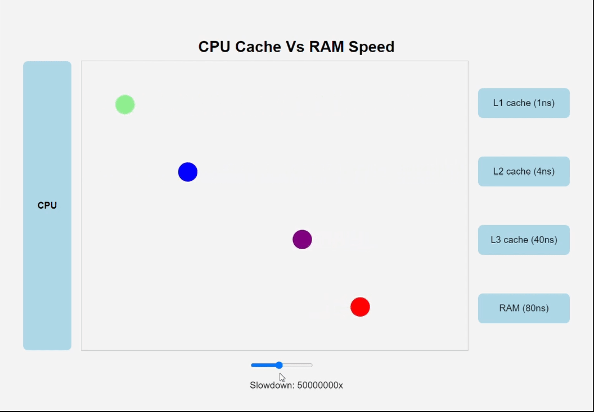
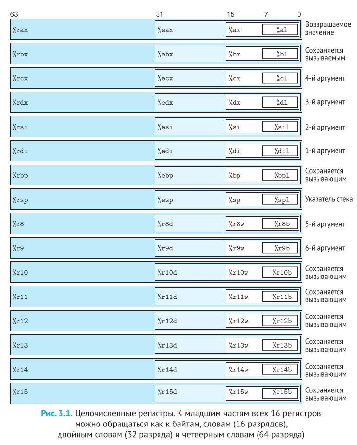

# Брайант Р. Э., О'Халларон Д. Р Компьютерные системы. Архитектура и программирование 2022

* [веб-страница книги](http://csapp.cs.cmu.edu/)
* [CS:APP3e Веб-дополнения](https://csapp.cs.cmu.edu/3e/waside.html)
* [Сайт инструктора CS:APP3e](https://csapp.cs.cmu.edu/3e/instructors.html)
* [Студенческий сайт CS:APP3e](https://csapp.cs.cmu.edu/3e/students.html)
* [lecture-code](https://web.stanford.edu/class/archive/cs/cs107/cs107.1226/lecture-code/)


Часть I Структура программы и ее выполнение
* [Глава 1. Экскурс в компьютерные системы](#Глава-1-Экскурс-в-компьютерные-системы)
    * [Процессор](#Процессор)
    * [Различные виды кеш-памяти](#Различные-виды-кеш-памяти)
    * [Конкуренция и параллелизм](#Конкуренция-и-параллелизм)
* [Глава 2. Представление информации и работа с ней](#Глава-2-Представление-информации-и-работа-с-ней)
    * [Хранение информации](#Хранение-информации)
* [Глава 3. Представление программ на машинном уровне](#Глава-3-Представление-программ-на-машинном-уровне)
  * [Программный код](#Программный-код)
  * [Машинный код](#Машинный-код)
  * [Адресная арифметика AGU — Address Generation Unit](#Адресная-арифметика-agu--address-generation-unit)
  * [Condition Codes, как работают if и while через флаги процессора](#condition-codes-как-работают-if-и-while-через-флаги-процессора)
  * [Procedures (процедуры или функции)](#procedures-процедуры-или-функции)
  * [Кэш-френдли код (Cache Locality)](#Кэш-френдли-код-cache-locality)
  * [Cache Associativity. Уровень Кэша (Конфликт полок)](#cache-associativity-Уровень-Кэша-Конфликт-полок)
* [Глава 4. Архитектура процессора](#Глава-4-Архитектура-процессора)
* [Глава 5. Оптимизация производительности программ](#Глава-5-Оптимизация-производительности-программ)
* [Глава 6. Иерархия памяти](#Глава-6-Иерархия-памяти)

Часть II Выполнение программ в системе
* [Глава 7. Связывание]()
* []()
* []()
* []()
* []()

Оба автора, Рэндал Э. Брайант (Randal E. Bryant) и Дэвид Р. О'Халларон (David R. O'Hallaron), являются профессорами в Университете Карнеги-Меллона (Carnegie Mellon University, CMU).

Книга основана на курсе CMU: Учебник был разработан на основе курса "Introduction to Computer Systems" (Введение в компьютерные системы) (известного как 15-213), который они создали и преподавали в Школе компьютерных наук CMU.

Многие книги по компьютерным системам написаны для создателей таких систем и описывают, как скомпоновать оборудование или реализовать системное программное обеспечение, включая операционную систе­му, компилятор и сетевой интерфейс. Эта книга, напротив, написана для программиста и рассказывает, как прикладные программисты могут использовать свои знания о системах для создания более качественных программ.

Linux – одна из операционных систем, ведущих свою родо­словную от операцион­ной системы Unix, первоначально разработанной в Bell Laboratories. К другим членам этого класса операционных систем относятся Solaris, FreeBSD и MacOS X. В последние годы эти операционные системы сохраняли высокий уровень совместимости благодаря усилиям по стандартизации POSIX и Standard Unix Specification. То есть сведения, что приводятся в этой книге, почти напрямую применимы ко всем этим «Unix-подобным» операционным системам.


GNU («свободное» – в смысле «свобода слова», но не в смысле «бесплатное пиво»)

GСС – один из множества полезных инструментов, созданных в рамках проекта GNU (сокращенно от «GNU’s Not Unix» – «GNU – не Unix»). Проект GNU – это освобожденная от налогов благотворительная акция, основанная Ричардом Столлменом (Richard Stallman) в 1984 году с амбициозной целью разработать законченную Unix-подобную систему, исходный код которой не обременен ограничениями на его изменение и распространение.

---

> [!IMPORTANT]
> Важно, это не пересказ и не заметки по книге. Тут только то, что **мне** было интересно, то я и решил записать.
> Книга кладезь знаний, ее нужно читать полностью.
>

## Глава 1. Экскурс в компьютерные системы

### Процессор

Ассемблер — это почти прямое отражение модели ЦП. Ассемблер — это язык, в котором вы разговариваете с процессором на его родном, аппаратном языке, почти без переводчика.

Ассемблер не является «абстрактным» языком.

Ассемблер — читаемая человеком форма машинных инструкций, которые:
* читаются по адресу из PC,
* оперируют регистрами,
* используют ALU,
* обращаются к памяти,
* явно управляют переходами.

Поэтому его синтаксис — это буквально текстовое описание того, что аппаратно делает процессор.

**Центральный процессор** (ЦП; Central Processing Unit, CPU), или просто процессор, – это механизм, который интерпретирует (или выполняет) инст­рукции, хранящиеся в основной памяти. Его ядро составляет устройст­во памяти с емкостью в одно слово (или регистр) – счетчик команд (Program Counter, PC). В любой конкретный момент времени он хранит адрес некоторой машинной инструкции в основной памяти. Кажется, что процессор работает в соответствии с очень простой моделью выполнения инструкций, определяемой его архитектурным набором команд. Сначала процессор читает инструкцию из памяти по адресу в счетчике команд (PC), интерпретирует биты инструкции, выполняет простые операции, определяемые инструкцией, а затем обновляет значение счетчика, записывая в него адрес следующей инст­рукции, которая может размещаться за текущей или где-то в другом месте в памяти. 

Существует всего несколько таких простых операций, и все они связаны с обслуживанием основной памяти, блока регистров и арифметико-логичес­кого устройства (Arithmetic/Logic Unit, ALU). 

**Блок регистров** – небольшое запоминающее устройство из совокупности регистров, каждый из которых имеет свое уникальное имя и может хра- нить одно слово. 

**Устройство ALU** вычисляет новые значения данных и адресов. Назовем лишь несколько примеров простых операций, которые процессор может выполнить по требованию той или иной инструкции: 
* загрузка: копирует байт или слово из основной памяти в регистр, затирая при этом предыдущее содержимое этого регистра; 
* сохранение: копирует байт или слово из регистра в некоторую ячейку основной памяти, затирая при этом предыдущее содержимое этой ячейки; 
* выполнение арифметико-логической операции: копирует содержимое двух ре­ гистров в ALU, выполняет соответствующую операцию с этими словами и запо­ минает результат в одном из регистров, затирая при этом предыдущее содер­ жимое этого регистра; 
* переход: извлекает слово из самой инструкции и копирует его в счетчик команд (PC), затирая предыдущее его содержимое.

Любая осмысленная работа = сначала загрузить данные в регистры, потом работать с ними. 
И это сразу видно в ассемблере:
```asm
mov rax, [x]   ; загрузка из памяти → регистр
add rax, rbx  ; ALU работает только с регистрами
mov [y], rax  ; сохранение результата в память
```
 
Синтаксис отражает реальные шаги железа:
* load
* compute
* store

Ассемблер — это декларативное описание работы ALU и регистров, а не «алгоритм» в привычном смысле.

Типичная инструкция:
```asm
add rax, rbx
```

Это буквально описание микроархитектурного действия:
* взять содержимое rax
* взять содержимое rbx
* передать в ALU
* результат записать обратно в rax


Базовые операции ассемблера:
* load
* store
* arithmetic / logic
* jump

А все остальные возможности — это уже композиция этих примитивов ассемблерных операции.

---

### Различные виды кеш-памяти

Один из самых важных уроков этой книги заключается в том, что прикладные программисты, которые знают о наличии кеш-памяти, могут воспользоваться ею и увеличить производительность своих программ на порядок.

Машинные инструкции программы в начальный момент хранятся на диске. Когда производится загрузка программы, они копируются в основную память. По мере выполнения программы ее инструкции копируются из основной памяти в процессор.

Увеличить быстродействие процессора намного проще, чем заставить основную память работать быстрее. Чтобы уменьшить разрыв между процессором и основной памятью, создатели про-
цессоров включили в них небольшие быстродействующие устройства хранения, получившие название кеш-память.

Кеш L1 (его еще называют кешем первого уровня) внутри процессора может хранить десятки тысяч байт, и доступ к ним осуществляется почти так же быстро, как к регистрам. Еще больший объем имеет кеш L2 (кеш второго уровня) – он может вместить от сотен тысяч до миллионов байт. Этот кеш связан с процессором специальной шиной. Скорость доступа к кешу L2 в 5 раз ниже скорости доступа к кешу L1, и все равно она в 5–10 раз выше скорости доступа к основной памяти. Кеши L1 и L2 построены по технологии, известной как статическая память с произвольным доступом (Static Random Access Memory, SRAM). Более новые и более мощные системы имеют три уровня кешей: L1, L2 и L3.

Кэши встроены прямо в чип процессора. Чем ближе кэш к «мозгам», тем он быстрее, но меньше и дороже.

| Уровень | Скорость (примерно) | Размер (примерно) | Где находится |
| --- | --- | --- | --- |
| **Регистры** | 0 тактов (мгновенно) | пару сотен байт | Внутри ядра |
| **L1 Кэш** | ~4 такта | 32–64 КБ | Внутри каждого ядра |
| **L2 Кэш** | ~10–12 тактов | 256–512 КБ | Рядом с ядром |
| **L3 Кэш** | ~30–50 тактов | 8–64 МБ | Общий на весь процессор |
| **RAM** | **~200–300 тактов** | Гигабайты | Отдельная планка |


Идея поместить небольшое, зато более быстрое запоминающее устройство (кеш-память) между процессором и более емким, но с худшим быстродействием запоминающим устройством (основной памятью) оказалась весьма плодотворной. Фактически запоминающие устройства в любой вычислительной системе образуют иерархию.

По мере движения по этой иерархии сверху вниз устройства становятся все медленнее, объемнее, а стоимость хранения одного байта уменьшается. Регистры находятся на вершине иерархии, которая обозначается как уровень 0 (L0). Кеш-память занимает уровни с 1 по 3 (L1–L3). Основная память находится на уровне 4 (L4) и т. д. Основная идея иерархии памяти заключается в том, что память одного уровня служит кешем для следующего нижнего уровня. То есть блок регистров – это кеш для кеш-памяти L1. Кеши L1 и L2 служат кешами для кеш-памяти L2 и L3 соответственно.




---

### Конкуренция и параллелизм

**Конкуренция на уровне потоков**

Основываясь на абстракции процессов, можно разрабатывать системы, в которых несколько программ выполняются одновременно, что приводит к конкуренции. Используя механизм потоков, можно даже запустить несколько потоков управления в рамках одного процесса.

Однопроцессорная система, конкурентное выполнение только моделируется – компьютер просто быст­ро переключался между выполняемыми процессами с загрузкой контекста.

Многопроцессорная система, все процессоры они управляются одним ядром операционной системы.

Многоядерные процессоры состоят из нескольких процессоров (называемых «ядрами»), интегрированных на один кристалл. Имеют в одной микросхеме четыре ядра, каждое со своими кешами L1 и L2, причем каждый кеш L1 разделен на две части: одна предназначена для хранения недавно выбиравшихся инструкций, а другая – данных. Ядра совместно используют кеш-память более высокого уровня (L3), а также интерфейс с основной памятью.

Гиперпоточность, которую иногда называют одновременной многопоточностью, – это технология, позволяющая одному процессору выполнять сразу несколько потоков управления. Это предполагает наличие нескольких копий определенных аппаратных средств процессора, таких как счетчики инструкций и блоки регистров, при этом другие аппаратные компоненты, такие как блок арифметических операций с плавающей точкой, наличествуют в единст­венном числе.

**Параллелизм на уровне инструкций**

Современные процессоры могут выполнять несколько инструкций одновременно. 
Использование конвейерной обработки, в которой дейст­вия, необходимые для выполнения инструкции, разделены на этапы, а аппаратное обеспечение процессора организовано в виде последовательности стадий, каждая из которых выполняет один из этапов. Стадии могут работать параллельно, выполняя разные части разных инструкций. Для поддержания скорости выполнения, близкой к 1 инструкции на такт, не требуется ничего особенно сложного. Процессоры, которые могут выполнять более одной инструкции за такт, называют суперскалярными. 
Прикладные программисты могут использовать эту модель для прогнозирования производительности своих программ, а затем писать программы так, чтобы сгенерированный код достигал более высокой степени параллелизма на уровне инструкций и, следовательно, работал быстрее.

**Одиночный поток команд, множественный поток данных**

На самом низком уровне многие современные процессоры имеют специальное оборудование, позволяющее одной инструкции параллельно выполнять несколько операций. Этот режим известен как одиночный поток команд, множественный поток данных (Single-Instruction, Multiple-Data, SIMD). Например, в последних поколениях процессоров Intel и AMD есть инструкции, которые могут параллельно складывать 8 пар чисел с плавающей точкой одинарной точности (тип данных float в языке C).

Эти инструкции SIMD предоставляются в основном для ускорения приложений, обрабатывающих изображения, звук и видео. Некоторые компиляторы пытаются автоматически использовать параллелизм этого вида в программах на C, но все же более надежным методом является разработка программ с использованием специальных типов векторных данных, поддерживаемых компиляторами, такими как GCC.

### Итоги

Компьютерные системы состоят из аппаратных и программных средств, которые взаимо­действуют с целью выполнения прикладных программ. Информация внутри компьютера представлена в виде групп битов, которые интерпретируются в зависимости от контекста. Программы транслируются другими программами в различные формы. Сначала они представлены в виде исходного текста ASCII, затем преобразуются компиляторами и компоновщиками в выполняемые файлы.

Процессоры читают и интерпретируют двоичные инструкции, находящиеся в основной памяти. Поскольку большую часть времени компьютеры тратят на копирование данных между основной памятью, устройствами ввода/вывода и регистрами процессора, память системы образует некоторую иерархию, на вершине которой находятся регистры процессора, далее следуют несколько уровней аппаратной кеш-памяти, затем основная DRAM-память и дисковая память. Чем выше находится устройство памяти в иерархии, тем выше его быстродействие и стоимость в пересчете на один бит. Кроме того, устройства памяти, находящиеся выше в иерархии, служат кешем для устройств памяти, находящихся ниже. Программисты могут опти­мизировать производительность своих программ на языке С, изучив и воспользовавшись особенностями иерархии памяти.

Ядро операционной системы играет роль посредника между прикладными программами и аппаратными средствами. Оно реализует три фундаментальные абстракции:
1) файлы, абстрагирующие устройства ввода/вывода;
2) виртуальную память, абстрагирующую как основную память, так и дисковую;
3) процессы, абстрагирующие процессоры, основную память и устройства ввода/вывода. 

Наконец, сети дают компьютерным системам возможность обмениваться данными между собой. С точки зрения конкретной системы, сеть есть не что иное, как устройство ввода/вывода.

---

## Глава 2. Представление информации и работа с ней

### Хранение информации

#### Размеры данных

Каждый компьютер имеет размер машинного слова, указывающий номинальный размер указателя. Поскольку виртуальные адреса кодируются такими словами, то наиболее важным системным параметром, определяемым размером слова, является максимальный размер виртуального адресного пространства. То есть для машины с размером слова в w бит диапазон виртуальных адресов охватывает от 0 до $2^w$ – 1, обеспечивая программе дос­туп максимум к $2^w$ байт.

В настоящее время наблюдается масштабный переход от машин с размером слова в 32 бита к машинам с размером слова в 64 бита.

**Почему 32-битная система ограничена ~4 ГБ?**

- **Размер указателя** (адреса) = 32 бита (4 байта).
- **Каждое значение указателя** — это число от `0x00000000` до `0xFFFFFFFF` (в шестнадцатеричной) или от `0` до `2³² − 1`.
- **2³² = 4 294 967 296** возможных адресов.

Каждому байту памяти присваивается свой уникальный адрес (байтовая адресация), поэтому в 32-битной системе максимально адресумая ячейка памяти в **виртуальном адресном пространстве** процесса ограничена числом `4_294_967_296 = 2³²− 1 = 0xFFFFFFFF = 4 ГБ`

Для 64-битной системы, количество адресов $2^{64}$ байт = `16_000_000_000 ГБ = 15_625_000 ТБ = 16 Эбайт`. 

Но реально в современных 64-битных процессорах (x86_64, ARM64) используются не все 64 бита для адресации: 
* Стандартный режим (48 бит): `262_144 ГБ = 256 ТБ`
* Расширенный режим (57 бит с 5-level paging): `134_217_728 ГБ`

Для языка C:
* Тип данных long в 32-разрядных программах обычно имеет размер 4 байта, а в 64-разрядных – 8 байт.
* Тип `void*` (указатель) в 32-разрядных программах 4 байта (32 бита), а в 64-разрядных – 8 байт (64 бита).
* Тип size_t в 32-разрядных программах 4 байта (32 бита), а в 64-разрядных – 8 байт (64 бита)

Правильный подход для переносимого кода:
```c
#include <stdint.h>

// Использовать фиксированные типы:
int8_t  -    // 8 bit (1 byte) Всегда 8 бит, тоже самое signed char  
int16_t -    // 16 bit (2 byte) Всегда 16 бит 
int32_t -    // Всегда 32 бита
int64_t -    // Всегда 64 бита
uintptr_t -  // Беззнаковый тип, вмещающий указатель
size_t    -  // Для размеров объектов (меняется с разрядностью)

```

#### Адресация и порядок следования байтов

Для программных объектов, занимающих несколько байтов, необходимо установить два правила: каков будет адрес объекта и как должны располагаться байты в памяти. 

Практически во всех машинах такие объекты хранятся в виде непрерывных последовательностей байтов, а адресом многобайтного объекта служит наименьший адрес ячейки памяти. Например, предположим, что переменная x типа `int` имеет адрес `0x100`, т.е. выражение взятия адреса `&x` вернет `0x100`. Тогда четыре байта, составляющих значение переменной `x`, будут храниться в ячейках памяти `0x100, 0x101, 0x102 и 0x103`.
 
Как должны располагаться байты в памяти. 
* Первое правило: порядок, когда первым следует наименьший значащий байт, называется обратным, или остроконечным (little endian).
* Второе правило: порядок, когда первым следует наибольший значащий байт, называется прямым, или тупоконечным (big endian).

Порядок байтов фиксируется с выбором конкретной **операционной системы**.
 
**Little-endian (LE)**
* **Наименее значимый байт** идёт **первым** (по меньшему адресу).
* Пример: `0x12345678` хранится как `78 56 34 12`.
* Доминирование архитектуры x86 — Intel выбрала LE, и теперь это стандарт де-факто для десктопа.
* Так делают почти все современные процессоры (Intel x86, AMD64, ARM в режиме по умолчанию). Это логично для схем и кода, удобнее считать и обрабатывать данные.
* Простота приведения типов — `int16_t x = 0x1234; → int8_t y = (int8_t)x;` даст `0x34` без сдвига адреса.
* Эффективность арифметики — сложение/вычитание начинается с младших байтов, можно не знать длину числа.

**Big-endian (BE)**
* **Наиболее значимый байт** идёт **первым** (по меньшему адресу).
* Пример: `0x12345678` хранится как `12 34 56 78`.
* Человеку этот способ привычнее, потому что мы пишем числа "от старшего к младшему".
* Простота отладки — дамп памяти читается как шестнадцатеричное число.
* В сетевых протоколах (TCP/IP) стандарт принят именно BE (его ещё называют *network byte order*).


**Почему это важно**
* Если два компьютера обмениваются числами напрямую в байтах, они должны договориться о порядке байт.
* Если вы записываете числа в бинарный файл, порядок байт должен быть фиксирован и понятен для всех, кто будет его читать.
* Ошибка с порядком байт может "перевернуть" значения:
  * `0x12345678` (305419896) на LE выглядит как `78 56 34 12` (2018915346 на BE, если интерпретировать не тем способом).


**Текстовые данные менее зависимы от платформы, нежели двоичные.**

**Текстовые данные (например, JSON, XML, CSV, plain text):**
- Платформенно-независимы — используют только ASCII/Unicode символы
- Портативны — одинаково читаются на x86, ARM, big-endian, little-endian
- Отлаживаемы — можно открыть в любом текстовом редакторе

**Двоичные данные (бинарные файлы):**

Зависят от:
- Endianness (порядок байтов)
- Размер типов (`int` = 4 или 8 байт?)
- Выравнивание структур (padding)
- Представление чисел с плавающей точкой

...

> [!INFO]
> далее в книге идет речь про особенности представления чисел в бинарном виде. 
> Особенности при операциях с вещественными числами и как вещественные числа хранятся в памяти.
> * Округление к ближайшему четному (Round to Even)
> * "Дыры" в представлении вещественных числах компьютером
> * Представление значений с плавающей точкой в стандарте IEEE
> * Почему максимальное отрицательное число не может быть представленно беззнаковым типом того разряда...
> Особенности при операциях с целыми знаковыми и т.д.. 
> Ситуации переполнения типа, битовые сдвиги ...
>
> И про то что компилятор может не предупредить о возникновении переполнения типа ...
>

---

## Глава 3. Представление программ на машинном уровне

Свой технический обзор мы начнем с того, что покажем связь между исходным кодом на языке С, ассемблерным и объектным кодами. Затем перейдем к исследованию особенностей архитектуры x86-64, начав с представления данных, манипулирования ими и реализации управления.

Зачем же тратить время на изучение машинного кода:
* какими возможностями обладает компилятор, и выявить неэффективные фрагменты программы.


Трансляция выполняется в четыре этапа. Совокупность программ, выполняющих эти четыре этапа (препроцессор, компилятор, ассемблер и компоновщик), называется системой компиляции.

Последовательность работы GCC (GNU Compiler Collection):

**1. Препроцессинг (Preprocessing)**

Инструмент: `cpp`
Что происходит: Работа с текстом программы.

* Удаляются комментарии.
* Подставляется содержимое заголовочных файлов (`#include`).
* Разворачиваются макросы (`#define`).
* Результат: «Чистый» код на Си (обычно файл с расширением `.i`).

**2. Компиляция (Compilation)**

Инструмент: `cc1`
Что происходит: Самый сложный этап. Компилятор анализирует синтаксис, проверяет ошибки и переводит код с языка Си на язык ассемблера.

* Результат: Текстовый файл с инструкциями ассемблера (расширение `.s`).
* *В вашем тексте этот этап назван генерацией ассемблерного кода.*

**3. Ассемблирование (Assembly)**

Инструмент: `as`
Что происходит: Перевод текстовых команд ассемблера в машинный код (нули и единицы), который понимает процессор.

* Результат: Объектный файл (расширение `.o` или `.obj`). Это уже машинный код, но его еще нельзя запустить, так как в нем не прописаны адреса внешних функций (например, `printf`).

**4. Компоновка / Линковка (Linking)**

Инструмент: `ld`
Что происходит: Сборка всех объектных файлов и системных библиотек в один целое. Линкер «сшивает» вызовы функций с их реальными адресами в памяти.

* Результат: Исполняемый файл (например, `a.out`, `main.exe` или ELF).

---

### Программный код

Прямая компиляция всех файлов.

Вместо того чтобы вводить четыре команды для каждого файла:

```
gcc -c p1.c

gcc -c p2.c

gcc -o p p1.o p2.o

```

Запускает всю цепочку преобразований одним махом для нескольких файлов сразу.

```
gcc -Og -o p p1.c p2.c
```

Флаг оптимизации **-Og** - оптимизирует, но бережет структуру программы, специально для удобства отладки (GDB)

Когда мы смотрим на результат оптимизации **-Og**, мы можем увидеть, что компилятор, например, не смог соптимизировать наш цикл. Это сигнал: «вы написали код так запутанно, что даже компилятор боится его трогать». Если мы поможем компилятору на уровне **-Og** (сделаешь код чище), то на уровне **-O3** он выдаст еще более впечатляющий результат.

---

### Машинный код

File mstore.c:
```c
long mult2(long, long);
void multstore(long x, long y, long *dest) {
    long t = mult2(x, y);
    *dest = t;
}
```

Чтобы увидеть соответствующий ассемблерный код формата AT&T (по умолчанию), сгенерированный компилятором С, добавим в командную строку параметр -S:
```
# создание ассемблерного представления кода из mstore.c
gcc -Og -S mstore.c
```

По этой команде GCC запустит компилятор, сгенерирует ассемблерный код, сохранит его в файле mstore.s и на этом остановится. (В обычной ситуации он далее вызывал бы ассемблер, чтобы тот сгенерировал файл с объектным кодом.)

```
# в стандартном предтавлении ассемблерного кода формата AT&T 
$ — это число, а % — регистр. И порядок обратный: "откуда -> куда"
```

File mstore.s:
```bash
	.file	"mstore.c"
	.text
	.globl	multstore
	.type	multstore, @function
multstore:
.LFB0:
	.cfi_startproc
	endbr64
	pushq	%rbx
	.cfi_def_cfa_offset 16
	.cfi_offset 3, -16
	movq	%rdx, %rbx
	call	mult2@PLT
	movq	%rax, (%rbx)
	popq	%rbx
	.cfi_def_cfa_offset 8
	ret
	.cfi_endproc
.LFE0:
	.size	multstore, .-multstore
	.ident	"GCC: (Ubuntu 13.3.0-6ubuntu2~24.04) 13.3.0"
	.section	.note.GNU-stack,"",@progbits
	.section	.note.gnu.property,"a"
	.align 8
	.long	1f - 0f
	.long	4f - 1f
	.long	5
0:
	.string	"GNU"
1:
	.align 8
	.long	0xc0000002
	.long	3f - 2f
2:
	.long	0x3
3:
	.align 8
4:

```

<details>

<summary>Для ассемблерного представления в формате Intel,Microsoft</summary>

```
# создание ассемблерного представления кода из mstore.c
gcc -Og -S -masm=intel mstore.c
```

File mstore.s:
```bash
	.file	"mstore.c"
	.intel_syntax noprefix
	.text
	.globl	multstore
	.type	multstore, @function
multstore:
.LFB0:
	.cfi_startproc
	endbr64
	push	rbx
	.cfi_def_cfa_offset 16
	.cfi_offset 3, -16
	mov	rbx, rdx
	call	mult2@PLT
	mov	QWORD PTR [rbx], rax
	pop	rbx
	.cfi_def_cfa_offset 8
	ret
	.cfi_endproc
.LFE0:
	.size	multstore, .-multstore
	.ident	"GCC: (Ubuntu 13.3.0-6ubuntu2~24.04) 13.3.0"
	.section	.note.GNU-stack,"",@progbits
	.section	.note.gnu.property,"a"
	.align 8
	.long	1f - 0f
	.long	4f - 1f
	.long	5
0:
	.string	"GNU"
1:
	.align 8
	.long	0xc0000002
	.long	3f - 2f
2:
	.long	0x3
3:
	.align 8
4:

```

</details>

Чтобы увидеть двоичный объектный код (например, в файле mstore), можно воспользоваться дизассемблером, который покажет, что программный код процедуры содержит 14 байт.
```
# создание обьектного файла mstore.o
gcc -Og -c mstore.c

# запустить отладчик GNU GDB
gdb mstore.o
```

output:
```
# вывести 18 байт начиная с метки multstore
(gdb) x/18xb multstore
0x0 <multstore>:        0xf3    0x0f    0x1e    0xfa    0x53    0x48    0x89    0xd3
0x8 <multstore+8>:      0xe8    0x00    0x00    0x00    0x00    0x48    0x89    0x03
0x10 <multstore+16>:    0x5b    0xc3
(gdb) q
```

Для исследования содержимого файлов с машинным кодом особенно ценным может оказаться класс программ, известных как дизассемблеры. Эти программы генерируют из машинного кода программный код на языке ассемблера.

```
objdump -d mstore.o
```

output:
```
mstore.o:     file format elf64-x86-64


Disassembly of section .text:

0000000000000000 <multstore>:

Смещение | Байты                 | Эквивалент на языке ассемблера
   0:     f3 0f 1e fa             endbr64
   4:     53                      push   %rbx
   5:     48 89 d3                mov    %rdx,%rbx
   8:     e8 00 00 00 00          call   d <multstore+0xd>
   d:     48 89 03                mov    %rax,(%rbx)
  10:     5b                      pop    %rbx
  11:     c3                      ret
```

Чтобы получить фактический выполняемый код, файлы с объектным кодом необходимо обработать компоновщиком, при этом один из этих файлов обязательно должен содержать функцию main. Предположим, что в файле main.с определена следующая функция:

File main.c:
```c
#include <stdio.h>
void multstore(long, long, long *);
int main() {
    long d;
    multstore(2, 3, &d);
    printf("2 * 3 --> %ld\n", d);
    return 0;
}
long mult2(long a, long b) {
    long s = a * b;
    return s;
}
```

В таком случае мы можем сгенерировать выполняемый файл prog программы следую­щим образом:
```
gcc -Og -o prog main.c mstore.c
```

Размер файла prog вырос до 8655 байт, потому что он содержит не только машин-
ный код двух процедур, но и информацию, используемую для запус­ка и завершения
программы, а также для взаимодействия с операционной систе­мой.

Файл prog можно дизассемблировать:
```
objdump -d prog
```

Результат дизассемблирования функции multstore в двоичном файле prog
```
00000000000011d8 <multstore>:
    11d8:       f3 0f 1e fa             endbr64
    11dc:       53                      push   %rbx
    11dd:       48 89 d3                mov    %rdx,%rbx
    11e0:       e8 e7 ff ff ff          call   11cc <mult2>
    11e5:       48 89 03                mov    %rax,(%rbx)
    11e8:       5b                      pop    %rbx
    11e9:       c3                      ret

```

Этот код практически идентичен полученному при дизассемблировании файла mstore.o. Главное отличие – другие адреса в колонке слева. Компоновщик изменил мес­тоположение этого кода, в результате чего адреса инструкций изменились. Второе отличие – компоновщик заполнил адрес вызываемой функции mult2 в инструкции callq. Одна из задач компоновщика – сопоставить вызовы функций с их местоположениями.

Вот как выглядит версия нашего примера с комментариями:
```
 push   %rbx         ; Сохранить %rbx на стеке
 mov    %rdx,%rbx    ; Скопировать dest в %rbx
 call   11cc <mult2> ; Вызвать mult2(x, y)
 mov    %rax,(%rbx)  ; Сохранить результат по адресу *dest
 pop    %rbx         ; Восстановить %rbx
 ret                 ; Вернуть управление
```

В некоторых ситуациях программистам приходится прибегать к ассемблерному коду, чтобы получить доступ к низкоуровневым возможностям машины. 

**Один из способов получить такой доступ** – написать группу функций на ассемблере и объединить их с функциями на C на этапе компоновки. Напи­сать
функцию целиком на языке ассемблера, поместить ее в отдельный файл и позволить
ассемблеру и компоновщику объединить ее с программным кодом на C. 

Мы разделяем логику: алгоритм пишем на Си, а «грязную» работу с железом — в отдельном .s файле.

Файл с кодом на ассемблере math_tools.s:
```asm
# math_tools.s
.globl asm_add           # Делаем имя функции видимым для линкера

asm_add:
    # В x86-64 (Linux) первые два аргумента приходят в регистрах:
    # edi — первое число
    # esi — второе число

    addl %esi, %edi      # Складываем: edi = edi + esi
    movl %edi, %eax      # Результат функции всегда должен лежать в eax
    ret                  # Возврат в вызывающую функцию
```

Инструкция movl означает (`mov` + `l`) перемещение двойного слова:
* `b` - 1 байт char
* `w` - 2 байта short слово
* `l` - 4 байта int двойное слово
* `q` - 8 байт long или char* четверное слово
* `s` - 4 байта float одинарной точности
* `l` - 8 байт double двойное слово

Файл main.c:
```c
#include <stdio.h>

// Объявляем внешнюю функцию, написанную на ассемблере
extern int asm_add(int a, int b);

int main() {
    int x = 10;
    int y = 20;
    
    int result = asm_add(x, y);
    
    printf("Результат из ассемблера: %d\n", result);
    return 0;
}
```

Сборка:
* Компилируем Си: `gcc -c main.c -o main.o`
* Ассемблируем Асм: `gcc -c math_tools.s -o math_tools.o`
* Линкуем всё вместе: `gcc main.o math_tools.o -o my_app`

В должны строго соблюдать Calling Convention (соглашение о вызовах). Если вы решите забрать аргументы не из тех регистров (например, из ebx вместо edi), программа получит мусор вместо чисел. Для x86-64 в Linux порядок такой: rdi, rsi, rdx, rcx, r8, r9.
 

**Второй способ (Inline Assembly)** – использовать поддержку GCC для встраивания ассемблерного кода непосредственно в программы на C. Использовать поддержку встраивания ассемблерного кода, имеющуюся в GCC, позволяющую с
помощью директивы asm вставлять короткие фрагменты кода на ассемблере прямо в
программу на C. Преимущество этого подхода в том, что он сводит к минимуму объем
машинно зависимого кода.

Вам не нужно знать Calling Convention: Вам не обязательно помнить, что первый аргумент должен быть в rdi. Вы просто говорите компилятору: «Мне нужно это число в любом свободном регистре», и GCC сам выберет лучший вариант.

Файл main.c:
```c
#include <stdio.h>

int main() {
    int x = 10;
    int y = 20;
    int result;

    // Вставка ассемблерного кода прямо в Си
    __asm__ (
        "addl %%ebx, %%eax;"  // Сама команда: eax = eax + ebx
        : "=a" (result)       // Выходные данные: буква 'a' означает регистр eax. Результат будет в eax, запиши его в 'result'
        : "a" (x), "b" (y)    // Входные данные: буква 'b' означает регистр ebx. Положи 'x' в eax, а 'y' в ebx
    );

    printf("Результат из inline-вставки: %d\n", result);
    return 0;
}
```

Сборка:
```
gcc -o main main.c
```
 
Устройство регистров:



Как показывают вложенные прямоугольники, инструкции могут работать с данными разного размера, хранящимися в младших байтах 16 регистров. Операции с отдельными байтами манипулируют младшими байтами, 16-разрядные операции – двумя младшими байтами, 32-разрядные операции – четырьмя младшими байтами, 64-разрядные операции – целыми регист­рами.

---

### Адресная арифметика AGU — Address Generation Unit
(правильно располагать данные в RAM)

> [!IMPORTANT]
> Почему это важно знать?

**Как x86-64 за один такт вычисляет адрес в памяти.**

Должно соблюдаться условие:
* адрес начала массива должен быть кратен размеру данных. Если массив из int (4 байта), то адрес начала должен делиться на 4
* размер данных элементов массива должен быть степенью двойки т.е. строго (1, 2, 4 и 8), если размер больше даже если 16, 32 все равно в один такт не получится.
* размер структуры должен быть выровнен и поля структуры должны быть уложены в чанки по 8 байт. 

В железе (в блоке AGU) умножение на произвольное число (например, на 7 или 13) — это медленная операция, требующая полноценного умножителя. А умножение на 1, 2, 4 и 8 делается простым битовым сдвигом влево (на 0, 1, 2 или 3 бита).  

Вот формула того, как процессор вычисляет адреса элементов массива и структур. Процессор x86-64 выполняет эту формулу аппаратно внутри одного блока (AGU — Address Generation Unit). Это значит, что сложение и умножение в этой формуле происходят бесплатно с точки зрения времени. Он вычисляет весь адрес целиком за **один** такт.

`Addr = D + Reg[Rb] + Reg[Ri] * S`

* **D** (Displacement): Смещение. Удобно для доступа к полям в структурах (struct)
* **Rb** (Base): Базовый регистр. Начало массива или объекта
* **Ri** (Index): Индексный регистр. Номер элемента в массиве  
* **S** (Scale): Множитель (только 1, 2, 4 или 8). Размер типа данных (int — 4 байта, double или указатель — 8 байт)

Пример:

```
int arr[6] = {1,2,3,4,5,6};

int x = arr[5];// Компилятор превратит вычисление адреса элемента массива в одну инструкцию: (%rdx, %rcx, 4)
```
* %rdx — адрес начала массива
* %rcx — твой индекс 
* 4 — потому что int занимает 4 байта


Допустим:
* **D** (Displacement) смещение равно 0
* **Rb** (Base) адрес начала массива %rdx равен 1000
* **Ri** (Index) равен 5
* **S** (Scale) размер типа данных для int 4

```
Addr = D + Reg[Rb] + Reg[Ri] * S = 0 + 1000 + 5 * 4 = 1020

```
Процессор мгновенно вычисляет адрес 1020 за один такт в AGU, обращается к памяти и забирает оттуда число 6.


Почему индексы массивов начинаются с нуля, если индекс Ri = 0, то: `Addr = Base + 0 * Scale = Base` т.е. адрес самого массива.

**Если у нас массив содержит тип данных размер которых не кратен степени двойки, например, не выровненная структура с двумя полями double и int = 12 байт, процессор уже не сможет вычислить адрес за один такт в AGU с помощью формулы `D(Rb, Ri, S)`**


**Выравнивание (Alignment) — это вторая часть проблемы**

Даже если мы вычислили адрес правильно, в дело вступает шина данных. Процессор тянет данные из памяти кусками по 8 байт (64 бита). Эти куски «нарезаны» в памяти строго по адресам, кратным 8.

Если наш double лежит по адресу 0x08, он идеально попадает в один «заход» процессора.

Если наш double из-за кривого размера структуры оказался на адресе `0x05`, он «размазан» между двумя блоками памяти. Процессору нужно два раза сходить в память, достать два куска, отрезать лишнее и склеить остаток.

---

### Condition Codes, как работают if и while через флаги процессора
(Минимизация прыжков т.е. if, while, for, switch. Писать логику так, чтобы процессор не захлебывался)

**Флаги состояния (Condition Codes)**

В процессоре есть специальный регистр флагов (EFLAGS). Почти любая арифметическая операция (сложение, вычитание и т.д.) меняет эти флаги как «побочный эффект».

* **ZF** (Zero Flag): Установится в 1, если результат операции был 0. (Идеально для `if (a == b)`, так как a - b = 0)
* **SF** (Sign Flag): Установится в 1, если результат отрицательный. (Для проверок `a < b`)
* **CF** (Carry Flag): Флаг переноса (для беззнаковых чисел)
* **OF** (Overflow Flag): Флаг переполнения (для чисел со знаком)

**Команды сравнения (cmp и test)**
* **cmp b, a**: Вычисляет `a - b`. Результат выкидывает, но выставляет флаги (**ZF, SF** и т.д.)
* **test b, a**: Вычисляет `a & b` (побитовое И). Тоже выкидывает результат, но выставляет флаги

**Прыжки (Jumps)**

Процессор читает флаги и, если условие совпадает, меняет свой Instruction Pointer (указатель на следующую строку кода)
* **je** (Jump if Equal): Прыгнуть, если флаг ZF=1.
* **jne** (Jump if Not Equal): Прыгнуть, если ZF=0.
* **jl** (Jump if Less): Прыгнуть, если результат был меньше нуля.

Прыжки (условные переходы) тормозят конвейер (pipeline) вычисления процессора. Современный процессор загружает в конвейер десятки инструкций наперед, а `jmp` ломает эту цепочку.
* Для безусловного jmp: Процессор внезапно понимает, что всё, что он уже успел загрузить в конвейер «после» прыжка — это мусор. Ему нужно всё выкинуть, пойти по новому адресу и начать загружать инструкции заново. Это пустые такты ожидания.
* Для условного перехода (je, jg): Тут еще хуже. Процессор не знает, прыгнет он или нет, пока не выполнит сравнение. Чтобы не стоять на месте, он гадает (Branch Prediction). Если угадал — молодец. Если ошибся — «катастрофа»: конвейер полностью очищается, все вычисления обнуляются, и процессор начинает работать с нуля по другой ветке.
 

Современные процессоры суперскалярны (Superscalar execution) они имеют несколько конвейеров (pipeline) работающих параллельно, которые загружены теми инструкциями кода который предсказал (Branch Predictor), когда предсказатель ошибается (Branch Misprediction), процессор выкидывает все результаты из всех параллельных линий и полностью очищает конвейер. Если есть работа которая не зависит от предыдущей работы то это будет просчитано в одном из конвейеров заранее. 
Например независимые данные будут просчитаны параллельно

```
a = b + c;
d = e + f;
```

В таком случае конвейер будет стоять и ждать, пока первый закончит работу. Это называется Data Dependency (зависимость по данным):

```
a = b + c;
d = a + f; // d зависит от результата первой строки
```

**Например, развертывание циклов (Loop Unrolling).**

Вместо того чтобы считать по одному числу в цикле:

```
for (i = 0; i < 100; i++) {
    sum += a[i]; // Каждая итерация зависит от предыдущей (sum)
}
```

Чтобы задействовать параллельные конвейеры:

```
for (i = 0; i < 100; i += 2) {
    sum1 += a[i];     // Конвейер 1
    sum2 += a[i + 1]; // Конвейер 2 (не зависит от sum1)
}
total_sum = sum1 + sum2;
```

Это будет работать почти в два раза быстрее, потому что мы дали процессору возможность загрузить две параллельные линии одновременно. Мы убрали «зависимость по данным» (Data Dependency) на уровне одной итерации.


Совсем без прыжков программу не напишешь. Поэтому инженеры придумали, как сделать их менее болезненными:
* Loop Unrolling (Развертывание цикла): Вместо того чтобы делать цикл на 4 итерации с 4 прыжками:

  ```
  for(int i=0; i<4; i++) a[i] = 0;

  Компилятор делает так:
  a[0] = 0; a[1] = 0; a[2] = 0; a[3] = 0;// Прыжков — ноль. Конвейер забит полезной работой.
  ```
* Conditional Move (cmov): вместо «прыгни, если больше», процессор просто говорит: «Вычисли оба варианта, а в конце я просто перепишу результат в зависимости от флага». Прыжка нет физически, конвейер идет ровно. Это можно реализовать заменой if на тернарный оператор.


> [!IMPORTANT]
> Почему это важно знать?

* **Предсказание переходов (Branch Prediction)**: Процессор пытается угадать, прыгнет он или нет, еще до того, как выполнит cmp. Если он ошибается, он теряет кучу тактов на очистку конвейера.
* **Условные передачи (cmov)**: Современные компиляторы иногда заменяют `if` на специальные инструкции, которые вообще не требуют прыжков, что делает код невероятно быстрым.

**Предсказание переходов (Branch Prediction)**

Современный процессор — это конвейер. Он начинает выполнять следующие команды еще до того, как закончил текущую. Когда он видит `if (condition)`, он не ждет результата сравнения, а угадывает, куда пойдет код, и начинает выполнять ту ветку заранее.

Это называется спекулятивное выполнение (speculative execution). Процессор — это своего рода игрок на ставках: он ставит на один из исходов `if`, чтобы не простаивать. Если ставка не сыграла, он делает «откат» (pipeline flush), что стоит примерно 15–20 тактов работы.

Вот основные стратегии, как писать код, чтобы процессор «угадывал» чаще:

**1. Сортировка данных**

Если мы обрабатываем массив в цикле и внутри есть `if`, процессор будет угадывать почти идеально, если данные отсортированы.

**2. Избавление от веток (Branchless Programming)**

Если можно заменить `if` математикой — сделайте это.

```
Пример: Найти сумму всех элементов массива, которые больше 10.

С ветвлением:
if (a[i] > 10) sum += a[i];

Без ветвления (математически):
sum += (a[i] > 10) * a[i];

итог: у процессора него нет выбора пути, а значит, нет риска ошибки. 
Нет прыжка — нет риска ошибиться в предсказании — код работает быстрее.
```

**3. Использование тернарного оператора (cmov)**

Компиляторы часто превращают простые тернарные операторы в инструкцию `cmov` (Conditional Move)

```
int max = (a > b) ? a : b;
итог: Нет прыжка — нет риска ошибиться в предсказании — код работает быстрее.
```

**4. Избегайте switch с кучей мелких кейсов**

Если в switch 20 разных вариантов, которые выпадают случайно, предсказатель переходов просто «сойдет с ума». В таких случаях лучше либо структурировать данные иначе, либо использовать таблицы переходов (которые компилятор сам создаст, если кейсы идут плотно по порядку).

**5. Пишите простые условия выхода из цикла**. 

Чем проще условие в while, тем легче компилятору превратить его в эффективный do-while с одним прыжком.

**6. Вероятные и невероятные ветки (Likely/Unlikely)**

Если вы точно знаете, что одно условие срабатывает в 99% случаев (например, проверка на ошибку, которой почти никогда не бывает), вы можете подсказать компилятору.

В современных компиляторах (GCC/Clang) есть макросы:


```c
if (__builtin_expect(ptr == NULL, 0)) { // говорим, что NULL — это почти невозможно

// код обработки редкой ошибки

}
```

Компилятор переставит блоки кода в ассемблере так, чтобы основная ветка шла «напролом» без прыжков, а редкая — была в стороне.

---

### Procedures (процедуры или функции)
(Главный враг кэша — «Прыжки»)

Почему программисты используют **inline функции**? — они просят компилятор не делать «телепортацию», а просто вставить код функции прямо в место вызова, превращая это в обычную линейную последовательность команд без всяких стеков. Но у него есть обратная сторона: если функция огромная и мы «инлайним» её в 100 местах, размер нашего исполняемого файла (.exe или .bin) раздувается. Это может привести к тому, что код перестанет влезать в L1-кэш инструкций процессора, и программа, как ни парадоксально, станет работать медленнее. Поэтому компиляторы иногда игнорируют просьбу об inline, если видят, что это навредит.

> [!IMPORTANT]
> Почему это важно знать?

Вызов функции — это самый дорогой прыжок. Нужно сохранить адрес возврата (Return Address), очистить/сохранить регистры и, возможно, выделить еще память в стеке под локальные данные в функции.

Для этого call прыжка процессор использует струтуру Stack заполняя ее последовательно состоянием программы, что бы при возврате ret снова восстановить то состояние которое было до прыжка.

>
> Стек в x86-64 — это область памяти, которая растет вниз (от больших адресов к меньшим). За него отвечает регистр %rsp (Stack Pointer).
>
> Передача аргументов (Секрет скорости x86-64). В современной x86-64 первые **6 аргументов** передаются через регистры (%rdi, %rsi, %rdx, %rcx, %r8, %r9).
>
> Локальные переменные. Если внутри функции не хватает регистров, мы «откусываем» кусок памяти у стека, просто уменьшая значение %rsp. Это и есть «рюкзак» памяти стека (Stack Frame), где лежат локальные переменные.
>
> Безопасность (Buffer Overflow): Если мы запишем в локальный массив больше данных, чем он вмещает, мы можем затереть тот самый Return Address. Тогда, когда функция будет возвращаться ret, она прыгнет не назад в код, а по адресу, который подсунул хакер.
>

---

### Кэш-френдли код (Cache Locality) 


**Почему огромные двумерные массивы лучше обходить «по строкам», а не «по столбцам»**

```c
void func(int arr[8][5]) // 8 рядов (строк) и 5 столбцов (колонок)

```

Память хранит данные **линейно**.

> [!IMPORTANT]
> **Почему это важно знать?**


* Строка = Ряд (Row) — Друзья кэша.
* Колонка = Столбец (Column) — Враги кэша (если идти только по ним).


Поскольку данные двумерного массива лежат по строкам (Row-major order), т.е. **линейно**, процессор читает их эффективно только тогда, когда мы идем по ним подряд.  

Процессор высчитывает адрес ячейки, умножая индекс строки на количество элементов в ряду, и заполняет свой кэш кэш-линиями (Cache Line по 64 байта), в которые попадает сразу пачка соседних элементов этого ряда.

Когда мы обращаемся по индексу массива, процессор не загружает из медленной RAM только один элемент. Он грузит всю **Cache Line (64 байта)**, если она еще не была загружена в кэш, и это занимает ~200 тактов. Так как массив содержит данные последовательно, то **вся Cache Line в идеале — это кусок строки (ряда) многомерного массива**. Основываясь на формуле нахождения адреса `Addr = Base + (i * colls + j) * SizeOf(T)`, процессор за 1 такт вычисляет адрес, а затем за ~1-4 такта берет значение, если оно уже оказалось в кэш-линии.

>
> Вот почему Связанные Списки (Linked Lists) — это "убийцы" кэша. 
> В связанном списке каждый узел создается через malloc в случайном месте памяти. 
> Вы читаете node1. Приезжает Cache Line. Но node2 лежит в другом конце RAM! Ваша Cache Line, которую вы только что загрузили, содержит мусор.
> Для каждого узла списка процессор снова и снова ждет по 200 тактов.
>


```
Для: 
  rows = 10 ; 10 рядов  
  colls = 5 ; 5 строк 
  int matrix[rows][colls]; 

Если нужно получить значение по адресу matrix[2][3], то: 
  Addr = Base + (2 * 5 + 3) * 4

* Base: Адрес в памяти, где начинается самый первый элемент matrix[0][0]
* i (индекс строки) = 2
* colls (количество элементов в строке) = 5
* j (смещение внутри строки) = 3
* SizeOf(T) = 4 (так как тип данных — int)

```

> **Высший пилотаж оптимизации:** Если в многомерном массиве **длина строки** (количество элементов в одном ряду) будет степенью двойки (2, 4, 8, 16, 32...), то вычисление адреса становится для процессора «реактивным».
> Это следует из упрощения операции умножения на длину строки в формуле: процессор заменит её на быструю операцию сдвига `<<`.
> `Addr = Base + (i << shift) + (j << size_shift)`


**Проход по рядам (строкам). Кэш-френдли код:**

```c
int matrix[][5] = {
    {1, 2, 3, 4, 5},    
    {6, 7, 8, 9, 10},
    {11,12,13,14,15},
    ...    
};
for (int i = 0; i < 10; i++)
    for (int j = 0; j < 5; j++)
        sum += matrix[i][j]; // Мы идем подряд по памяти

// Последовательность прохода (физически в памяти):
// [1][2][3][4][5][6][7][8][9][10]... — всё берется из одной кэш-линии.

```

**Проход по столбцам (колонкам). Медленный код:**

```c
for (int j = 0; j < 5; j++)
    for (int i = 0; i < 10; i++)
        sum += matrix[i][j]; // Мы прыгаем через целые строки!

// Последовательность прохода:
// [1][6][11][2][7][12]... — каждый шаг требует новую кэш-линию.

```

Проход по столбцам может быть в 10–50 раз медленнее, потому что при каждом шаге процессор **промахивается мимо кэша** (Cache Miss). Он загрузил в кэш (L1) кусок строки (64 байта), а мы следующим шагом просим его прыгнуть на N элементов вперед, которых нет в текущей кэш-линии. Процессору приходится снова идти в медленную память (RAM), что занимает ~200–300 тактов вместо ~1–4 тактов, если бы данные были в кэше.


<details>

<summary>Попытка повлиять на поведение кеша</summary>


Что происходит:
* cache line = 64 байта = 16 int
* мы используем 1 int, а остальные 15 выбрасываются
* L1/L2 постоянно вытесняются
* prefetcher не справляется, т.к. шаг доступа = N * sizeof(int)


```c
#include <stdio.h>
#include <stdlib.h> // EXIT_SUCCESS, EXIT_FAILURE
#include <time.h>

#define N 2048

int main(void) {
    clock_t start = clock();

    static int matrix[N][N];

    // Инициализация
    for (int i = 0; i < N; i++)
        for (int j = 0; j < N; j++)
            matrix[i][j] = i + j;

    long long sum = 0;

    // ❌ ПЛОХО: обход по столбцам
    for (int j = 0; j < N; j++) {
        for (int i = 0; i < N; i++) {
            sum += matrix[i][j];
        }
    }

    clock_t end = clock();
    double cpu_time_used = ((double) (end - start)) / CLOCKS_PER_SEC;
    printf("%lld\n", sum);
    printf("Процессорное время: %f секунд\n", cpu_time_used);

    return EXIT_SUCCESS;
}
```

`gcc -Og -o cache_miss cache_miss.c && ./cache_miss`

Процессорное время:
* 0.056399 
* 0.057095
* 0.052826


**Есть способы влиять на поведение кеша, в том числе предварительно загружать нужные кеш-линии.**

Эти инструкции подсказывают процессору, что скоро понадобятся данные по указанному адресу, и он может загрузить их заранее, пока CPU занят другими операциями 

Альтернативы:
- prefetcht1 — для L2,
- prefetcht2 — для L3,
- prefetchnta — non-temporal prefetch (для данных, которые скоро станут ненужными — не вытесняет другие данные из кеша).

Важно: prefetch — это подсказка, а не принудительная загрузка. Процессор может её проигнорировать (например, при нехватке пропускной способности памяти).

```
int main() {
    const int N = 32;
    int data[] = {1,5,4,5,7,2,1,5,4,5,7,1,5,4,5,7,1,5,4,5,7,1,5,4,5,7,1,5,4,5,7,6};
    // Подсказать процессору: скоро понадобится data[i]
    for (int i = 0; i < N; i += 16) {
        _mm_prefetch((const char*)&data[i + 64], _MM_HINT_T0); // заглянуть вперёд на 64 байта
        // ... обработать data[i] ...
    }

// Если вы обрабатываете массив поблочно по 64 байта (размер кеш-линии), и знаете, что следующая линия понадобится через несколько тактов — делайте prefetch на 1–2 линии вперёд.
// __builtin_prefetch(&array[i + 128], 0, 3); // заглянуть на 2 шага вперёд

    return 0;
}
```


```c
int main() {
    clock_t start = clock();
    
    static int matrix[N][N];

    for (int i = 0; i < N; i++)
        for (int j = 0; j < N; j++)
            matrix[i][j] = i + j;

    long long sum = 0;

    for (int j = 0; j < N; j++) {
        for (int i = 0; i < N; i++) {

            // 🔮 явный prefetch будущей строки
            if (i + PREFETCH_DISTANCE < N) {
                _mm_prefetch(
                    (const char*)&matrix[i + PREFETCH_DISTANCE][j],
                    _MM_HINT_T0
                );
            }

            sum += matrix[i][j];
        }
    }

    clock_t end = clock();
    double cpu_time_used = ((double) (end - start)) / CLOCKS_PER_SEC;
    printf("%lld\n", sum);
    printf("Процессорное время: %f секунд\n", cpu_time_used);        

    return EXIT_SUCCESS;
}
```

`gcc -Og -o prefetch prefetch.c && ./prefetch`


Процессорное время, такое же как и без оптимизации: 
* 0.052012
* 0.058620

**Аппаратный prefetcher умнее, чем кажется**

Даже при доступе по столбцам современные CPU:

* распознают постоянный stride
* автоматически подтягивают линии в L2/L3

В итоге: _mm_prefetch просто дублирует работу железа

Prefetch обычно делают на сотни байт вперёд, а не на десятки, 8 итераций — это слишком мало.


</details>

---

### Cache Associativity. Уровень Кэша (Конфликт полок)

Весь RAM (гигабайты) не может влезть в маленький L1 кэш (32 КБ). Поэтому каждый адрес в памяти жестко привязан к конкретной «полке» в кэше.

Представь, что у тебя кэш L1 имеет 64 «набора». Если вы работаете с двумя огромными массивами, и их размеры — точные степени двойки (например, 4096 байт или 8192), то элементы этих массивов с одинаковыми индексами всегда будут попадать в один и тот же набор кэша.

```c
// В этом случае начало массива B находится ровно через 32768 байт (32 *\times* 1024) после начала A
// Мы выделяем память под два массива
int A[8192]; // 8192 * 4 байта = 32 KB
int B[8192]; // 32 KB

// В памяти они лежат так:
// [ --- Array A (32KB) --- ][ --- Array B (32KB) --- ]
// Адрес A[0]: 0x0000 (условно) -> Полка кэша №0
// Адрес B[0]: 0x8000 (32768)   -> Полка кэша №0 (КОНФЛИКТ!)

for (int i = 0; i < 8192; i++) {
    sum += A[i] + B[i]; 
    // На каждом шаге B[i] выбивает A[i] из кэша, 
    // а на следующем круге A[i+1] выбивает B[i]. 
    // Это Cache Thrashing. Скорость падает в разы.
}
```

Cache Aliasing (наложения в кэше) - процессор при распределении места в кеше учитывает крастность адреса массива своему размеру и если два массива совпадают по размеру и имеют один размер кратный размеру кеша то они конфликтуют за попадание в кеш, что приводит к постоянному выбрасыванию и загрузкой в кеш.
 
Трюк с «Padding», чтобы конфликта не происходило, можно специально сделать массивы чуть-чуть «неправильного» размера. Вместо `a[1024] и b[1024]` можно сделать `a[1024] и b[1024 + 1]`. Это смещает адреса так, чтобы элементы разных строк попадали на разные полки кэша, и конфликта нет.

Баланс: Потеря тактов vs Выигрыш в кэше. Если мы сделаем размер 1025 вместо 1024, мы теряем «реактивную» математику AGU (вместо сдвига `<<`  получаем долгое умножение). 

Но посмотрим на цифры:
* Потеря на математике: +2 или +3 такта на вычисление адреса
* Выигрыш на кэше: Мы избегаем похода в RAM, который стоит 200-300 тактов

Но можно еще лучше. Чтобы не выбирать между умным AGU и быстрым кэшем: 
* Оставляют длину строки равной `a[1024] и b[1024]` (степень двойки), чтобы AGU считал адрес мгновенно.
* Но между самими массивами в памяти **вставляют «прокладку» из мусорных байтов (Padding)**, чтобы их начала не были кратны размеру кэша.

```c
// Мы добавляем небольшую «мертвую зону» между массивами. 
// Нам не нужно много — достаточно сдвинуть начало второго массива на одну кэш-линию (64 байта)
// Способ 1: через структуру с "мусором"
struct {
    int A[8192];          // 32 KB
    char padding[64];     // Прокладка (64 байта мусора)
    int B[8192];          // 32 KB
} data;

// Теперь в памяти:
// [ --- Array A --- ][ 64b ] [ --- Array B --- ]
// Адрес A[0]: 0x0000 -> Полка кэша №0
// Адрес B[0]: 0x8040 -> Полка кэша №1 (ПОБЕДА!)

// Способ 2: Просто объявить массив B чуть больше, чем нужно
int A[8192];
int dummy[16]; // Резервируем 64 байта (16 * 4)
int B[8192];

```
 
 

---

Конечно, включение ассемблерного кода в программу на C делает код зависимым от определенного класса машин (например, x86-64), и поэтому его следует использовать, только когда желаемое действие можно выполнить лишь так и никак иначе.

> [!INFO]
> Ассемблер сегодня — это либо для тех, кто копается в «кишках» железа, либо для тех, кому нужно выжать последние капли скорости в математике или графике.
>
> Современные процессоры настолько сложные (конвейеры, предсказатели переходов), что человек, пытаясь «оптимизировать» код вручную, часто делает его медленнее, чем это сделал бы компилятор.
>

## Глава 4. Архитектура процессора

**Конвейерная обработка инструкций** (instruction pipeline) — это способ организации работы процессора, при котором несколько инструкций выполняются параллельно, но на разных стадиях, чтобы увеличить скорость работы.

Идея простая:
процессор не ждёт, пока одна инструкция полностью закончится, а начинает следующую раньше, как на конвейере на заводе.

Даже если инструкция 1 байт, процессор, рассчитанный на 5 стадий, выполняет каждую стадию по такту

Классический 5-ступенчатый конвейер
* Fetch — взять инструкцию из памяти
* Decode — расшифровать инструкцию
* Execute — выполнить операцию
* Memory — доступ к памяти (если нужно)
* Writeback — записать результат в регистр


Без конвейера, инструкции выполняются последовательно по одной, 1 инструкция за 5 тактов:
```
Такт: 1 2 3 4 5 6 7 8 9 10 11 12 13 14 15
I1:   F D E M W
I2:             F D E M W
I3:                        F  D  E  M  W
```

Или как в [многоцикловом выполнении инструкций LEG](https://jekahome.github.io/Computer-Science-Bookshelf/turingcomplete/turingcomplete_cpu_architecture_2.html#wire-spaghetti):
* механизм буферизации/накопление инструкции до нужной разрядности
* Процессор 8-битный читает 1 байт за такт, инструкция занимает 4 байта

```
Такт: 1  2   3   4  5   6  7   8   9  10  11  12 ...
I1:   O  A1  A2  R  EX
I2:                     O  A1  A2  R  EX
I3:                                       O  A1  A2  R  EX

```
* O - opcode
* A1 - argument 1  
* A2 - argument 1
* R - result address
* EX - выполнение инструкции после того, как все байты собраны


С конвейером, инструкции перекрываются, 1 инструкция за 1 такт:
```
Такт: 1 2 3 4 5 6 7
I1:   F D E M W
I2:     F D E M W
I3:       F D E M W
```
После разгона конвейера: на каждом такте завершается одна инструкция. Процессор становится быстрее без увеличения частоты.      

Основная проблема конвейера: конфликты (hazards)
* **1.** Data hazard (конфликт данных). Когда одна инструкция зависит от результата предыдущей.
* **2.** Control hazard (ветвления). При условных переходах процессор не знает какая инструкция будет следующей.
* **3.** Structural hazard. Когда двум стадиям нужен один и тот же ресурс.

В конвейерной архитектуре требуется больше регистров чем в последовательных реализациях архитектур, потому что нужно хранить промежуточные данные в pipeline-регистрах между стадиями, так как для завершения инструкции нужно где-то хранить промежуточный результат.

## Глава 5. Оптимизация производительности программ
* Ручное раскрытие косвенности
* Наложение (pointer aliasing или memory aliasing)
* Явная функция без побочных эффектов
* Развертывание цикла (loop unrolling) 
* Вынос инвариантного кода из цикла
* Устранение избыточных ссылок на память
* Зависимость по данным между записью и последующим чтением (store-to-load forwarding delay)
* Параллелизм на уровне инструкций
* Устранение предсказываний (branch prediction), условное перемещения (conditional move)

Даже лучшим компиляторам могут помешать аспекты поведения программы, блокирующие ее оптимизацию, которые сильно зависят от среды выполнения. Программисты должны «помогать» компилятору, создавая такой код, который легко поддается оптимизации.

Первый шаг в оптимизации программы – устранение ненужной работы, чтобы код выполнял намеченную задачу с максимальной эффективностью. Под этим подразумевается устранение ненужных вызовов функций, условных проверок и обращений к памяти.

Понимая, как работает процессор, мы сможем сделать второй шаг в оптимизации программы и использовать способность процессоров выполнять несколько инструкций параллельно. Мы рассмотрим несколько приемов преобразования программ, помогающих уменьшить зависимости по данным между разными этапами вычислений и уве-личить степень параллелизма.

Изучение ассемблерного кода – один из самых эффективных способов достичь понимания работы компилятора и особенностей выполнения сгенерированного кода. Хорошей стратегией считается сначала тщательно изучить код на наличие в нем вложенных циклов и операций, снижающих производительность, таких как избыточные ссылки на ячейки памяти. Начав с ассемблерного кода, можно предсказать, какие операции будут выполняться параллельно и насколько полно они будут использовать ресурсы процессора. Большинство компиляторов, включая GCC, постоянно совершенствуются, с точки зрения возможностей оптимизации. Поэтому одна из эффективных стратегий состоит в том, чтобы переписать программу и довести ее до такого состояния, когда компилятор сможет сгенерировать оптимальный код.

* Ручное раскрытие косвенности - когда мы разыменовываем указатель, что бы процессор не искал адрес где взять данные, а сразу сохранял в регистр.

* Наложение (pointer aliasing или memory aliasing) - два указателя могут ссылаться на одну и ту же ячейку памяти.

    Если у меня есть два указателя a и b, компилятор не знает, указывают ли они на разные участки памяти или на один и тот же.
    * Если на разные: можно смело кешировать `*a` в регистр.
    * Если на один и тот же: нельзя кешировать, потому что запись через b может изменить значение, которое читает a.

    Решение:
    * В C ключевое слово `restrict`. Приказ компилятору от программиста: «Поверь мне, эти указатели не пересекаются». В Rust встроенный «restrict» через систему владения.
    * Локальное копирование, снятие алиасинга через копирование

* Явная функция без побочных эффектов. Большинство компиляторов не пытаются определить, свободна ли функция от побочных эффектов и пригодна ли для оптимизации. Вместо этого они предполагают худший вариант и оставляют все обращения к функциям нетронутыми.   

   Поэтому мы должны явно про это написать. В Rust можно указать, что функция не имеет побочных эффектов и она может вызывать только другие const функции:

    ```rust,no_run
    const fn add(x: usize, y: usize) -> usize {
        x + y
    }
    ```
   Если пометить функцию такими атрибутами, компилятор поверит программисту и начнет оптимизировать вызовы. В C нет стандартного способа сказать "моя функция чистая".


* Развертывание цикла (loop unrolling). В Rust (и C) компилятор часто сам разворачивает простые циклы при сборке с флагом `--release`, поэтому писать так вручную сегодня приходится редко.

   Основная цель развертывания цикла — минимизировать накладные расходы на сам цикл. Развертывание цикла помогает бороться с тем, что называется «управление циклом» (loop overhead). Мы уменьшаем количество прыжков (Jumps) и неверных предсказаний. Увеличение ILP (Instruction-Level Parallelism): Теперь, когда инструкции идут подряд, компилятор может запустить их параллельно на разных исполнительных блоках (ALU) процессора, если они не зависят друг от друга. Но если развернуть слишком сильно, код перестанет помещаться в кэш инструкций L1, и производительность упадет.


   ```rust,editable
   /*
    Функции вычисления накопленной суммы. Эти функции наглядно
    демонстрируют способы выражения производительности программ
    */
    // Функция psum1 вычисляет один элемент вектора-результата в каждой итерации
    fn psum1(a: &[f32], p: &mut [f32], n: usize) {
        if n == 0 { return; }

        p[0] = a[0];
        for i in 1..n {
            p[i] = p[i - 1] + a[i];
        }
    }

    /*
    Функция psum2 применяет метод, известный как развертывание цикла (loop unrolling),
    чтобы вычислить два элемента в каждой итерации.
    
    Если в обычном цикле мы делаем один шаг и проверяем условие, 
    то в «развернутом» мы делаем сразу два, три или более шагов, 
    прежде чем снова проверить условие выхода.
    * В два раза реже проверяем условие i < n.
    * В два раза реже увеличиваем i.
    * Помогаем процессору лучше загрузить его конвейер (pipeline), 
    выполняя несколько операций сложения подряд.
    */
    fn psum2(a: &[f32], p: &mut [f32], n: usize) {
        if n == 0 { return; }

        p[0] = a[0];
        let mut i = 1;

        // Цикл с шагом 2, аналогичный i < n-1
        while i < n.saturating_sub(1) {
            let mid_val = p[i - 1] + a[i];
            p[i] = mid_val;
            p[i + 1] = mid_val + a[i + 1];
            i += 2;
        }

        // Обработка последнего элемента для нечетного n
        if i < n {
            p[i] = p[i - 1] + a[i];
        }
    }

    fn psum4(a: &[f32], p: &mut [f32], n: usize) {
        if n == 0 { return; }

        p[0] = a[0];
        let mut i = 1;

        // Основной цикл: обрабатываем по 4 элемента за раз
        // Условие i < n - 3 гарантирует, что i+3 всегда в границах
        while i < n.saturating_sub(3) {
            let v0 = p[i - 1] + a[i];
            let v1 = v0 + a[i + 1];
            let v2 = v1 + a[i + 2];
            let v3 = v2 + a[i + 3];

            p[i] = v0;
            p[i + 1] = v1;
            p[i + 2] = v2;
            p[i + 3] = v3;

            i += 4;
        }

        // Добираем оставшиеся элементы (их может быть от 0 до 3)
        while i < n {
            p[i] = p[i - 1] + a[i];
            i += 1;
        }
    }

    // Перепишите функцию psum1 так, чтобы ей не приходилось многократно извлекать значение p[i] из памяти. 
    // Для этого не требуется использовать развертывание цикла. Мы написали такой код и, 
    // измерив его производительность, получили величину CPE 3.00,
    // обусловленную задержкой операции сложения чисел с плавающей точкой.
    fn psum1a(a: &[f32], p: &mut [f32], n: usize) {
        if n == 0 { return; }
        /* last_val хранит p[i-1]; val хранит p[i] */
        p[0] = a[0];
        let mut last_val: f32 = p[0];
        let mut val: f32;
        
        for i in 1..n {
            val = last_val + a[i];
            p[i] = val;
            last_val = val;
        }
    }
    
    fn main(){
        let a = vec![1.0, 2.0, 3.0, 4.0, 5.0];
        // Создаем пустой вектор такого же размера для результата
        let mut p = vec![0.0; a.len()];
        let n = a.len();
        psum2(&a,&mut p, n);
        println!("{:?}",p);
        
        p = vec![0.0; a.len()];
        psum1(&a,&mut p, n);
        println!("{:?}",p);
        
        p = vec![0.0; a.len()];
        psum4(&a,&mut p, n);
        println!("{:?}",p);

        p = vec![0.0; a.len()];
        psum1a(&a,&mut p, n);
        println!("{:?}",p);        
    }
    ```

* Вынос инвариантного кода из цикла. Если внутри цикла есть вычисление, результат которого не меняется от итерации к итерации, его нужно вынести до цикла. При вызове рекурсивной функции компилятор сохранит локальное состояние в стеке, что бы при возвращении из рекурсии иметь доступ к корректным значениям локальных переменных которые были до вызова рекурсии. Но и при вызове обычной функции компилятор тоже сохраняет локальное состояние в стек, потому что функция может испортить регистры. Когда компилятор не уверен, что функция безопасна, он консервативно сохраняет все живые регистры. Поэтому нужно выносить вызовы функций из циклов или помечать как "без побочных эффектов". Компиляторы сами пытаются это делать, это называется LICM (Loop Invariant Code Motion)


* Прямое обращение по индексу `arr[i]` в Rust всегда включает проверку границ во время выполнения (runtime bounds checking). Это фундаментальное отличие Rust от C/C++, где такая проверка отсутствует. 

* Устранение избыточных ссылок на память. Функция combine4 производительней чем combine3, так как не используем косвенное обращение каждую итерацию. (Сохраняйте в массиве или в глобальной переменной только окончательный результат вычислений.)

    ```rust,editable
    fn combine3(v: &Vec<i32>, dest: &mut i32) {
        for i in v {
        // компилятор создаст ассемблерные иснтр. которые будут выполянть поиск 
        //по адресу каждую итерацию по два раза - чтения и записи
            *dest = *dest + i; 
        }
    }

    fn combine4(v: &Vec<i32>, dest: &mut i32) {
        let mut acc = 0;
        for i in v {
            acc = acc + i;  // нет косвенной адресации
        }
        *dest = acc;
    }

    // версия с двумя аккумуляторами/накопителями (развертывание цикла 2×2):
    // Процессор может выполнять acc0 + v[i] и acc1 + v[i+1] параллельно, 
    // потому что они независимы (используют разные регистры). 
    // Это утилизирует несколько функциональных блоков ALU.
    // Мы преодолели барь­ер, установленный границей задержки.
    // Процессору больше не нужно откладывать начало одной операции комбинирования
    // до завершения предыдущей.
    fn combine6(v: &Vec<i32>, dest: &mut i32) {
        let length = v.len();
        let limit = length - 1;
        let mut acc0 = 0;
        let mut acc1 = 0;
        let mut i = 0;

        // Основной цикл: по 2 элемента за итерацию
        while i < limit {
            acc0 = acc0 + v[i];
            acc1 = acc1 + v[i + 1];
            i += 2;
        }
        // Обработка последнего элемента если длина нечетная
        while i < length {
            acc0 = acc0 + v[i];
            i += 1;
        }
        *dest = acc0 + acc1;
    }
    fn main(){
        let a = vec![1, 2, 3, 4, 5];
        let mut dest = 0;
        
        combine3(&a,&mut dest);
        println!("{}",dest);
        dest = 0; 
        combine4(&a,&mut dest);
        println!("{}",dest);

        dest = 0;
        combine6(&a,&mut dest);
        println!("{}",dest);
    }
    ```

* Барьер производительности — зависимость по данным между записью и последующим чтением (store-to-load forwarding delay). Храните промежуточные значения в ре­гистрах, это поможет компилятору использовать регистры.

    Этот код так же имеет зависимость по данным между записью и последующим чтением.

    Почему возникает задержка: процессор не может прочитать значение, пока запись полностью не завершится:
    * Когда процессор пишет в память, данные отправляются в store-буфер
    * Они еще не попали в кэш L1
    * Если следующий код пытается читать этот же адрес:
        * Процессор должен дождаться, пока данные "дозреют" в store-буфере
        * Или дождаться записи в кэш

    ```rust,editable
    fn combine3(v: &Vec<i32>, dest: &mut i32) {
        for i in v {
           // Читаем *dest, потом пишем *dest
            // А на следующей итерации опять читаем то, что только что записали!
            *dest = *dest + i; 
        }
    }
    ```

    Еще пример, зависимость по данным между записью и последующим чтением:
    * Предположим, что a – массив с длиной 1000, инициализированный так, что каждый элемент `a[i]` равен `i`.
    * Что получится в результате вызова `сору_аггау(a, a+1, 999)`?
        * этот случай `src = a, dest = a+1` приведет к зависимости: чтение ждет завершения записи из предыдущей итерации

    ```rust,editable
    fn copy_array(src: &[i64], dest: &mut [i64], n: usize) {
        for i in 0..n {
            dest[i] = src[i];
        }
    }
    ```

* Параллелизм на уровне инструкций. На уровне ассемблерного кода кажется, будто команды выполняются по одной за раз, каж­дая из них выбирает значения из регистров или памяти, выполняет операцию и сохраняет результаты в памяти или в регистре. Но на самом деле процессор выполняет сразу несколько команд – это явление называется **параллелизмом на уровне инструкций**. В некоторых архитектурах одновременно могут выполняться 100 и более инструкций. Чтобы обеспечить такое параллельное выполнение с сохранением модели последовательной семантики, используются сложные механизмы. 

    Зависимости по данным между операциями умножения:

    

    Математически одно и то же, результат одинаковый, но способ вычисления разный.
    * Воспользуемся свойством [ассоциативности операций](https://jekahome.github.io/Computer-Science-Bookshelf/discrete_mathematics/%D0%BA%D0%BE%D0%BC%D0%B1%D0%B8%D0%BD%D0%B0%D1%82%D0%BE%D1%80%D0%B8%D0%BA%D0%B0.html) для лучшего использования конвейера процессора.
    * Процессор может выполнять сложения независимых пар параллельно (используя несколько ALU), а потом сложить результаты. Это сокращает длину критического пути.

    ```rust,editable
    fn main(){
        let x = 2; 
        let y = 4;
        let z = 5;
        let w = 5;

        // Плохой способ (последовательный):
        // (x + y) + z + w
        let a = x + y;       
        let b = a + z;      // ждет a (последовательныя операция)
        let c = b + w;      // ждет b (последовательныя операция)
        println!("{c}");
        
        // Хороший способ (параллельный):
        // (x + y) + (z + w)
        let t1 = x + y;      // 1. можно одновременно т.е. параллельная операция
        let t2 = z + w;      // 1. можно одновременно т.е. параллельная операция
        let c = t1 + t2;     // 2. потом сложить результаты
        println!("{c}");
    }
    ```

* Пишите код, более подходящий для использования инструкций условного перемещения (conditional move).

    Классический `if` - это условный переход jmp (conditional jump), меняюший поток выполнения:
    * Вычисляется условие x < 0
    * Процессор гадает (branch prediction), пойдет он внутрь `if` или нет:
        * Если угадал правильно — отлично, конвейер не сбрасывается
        * Если не угадал — конвейер сбрасывается, теряются 10–20 тактов (штраф за непредсказанный переход)

    ```rust,editable
    fn abs(x: i32) -> i32{
        if (x < 0) {
            x = -x;
        }
        return x;
    }
    ```

    Условное перемещение cmov (conditional move):
    * Вычисляются оба значения (`x` и `-x`)
    * Вычисляется условие
    * Одна инструкция cmov (conditional move) выбирает, какое значение записать в результат
    * **Нет предсказания переходов, нет сброса конвейера!**

    ```rust,editable
    fn abs(x: i32) -> i32{
        let neg_x = -x;
        return if x < 0 {neg_x} else{ x}; // компилятор может сделать cmov
    }
    fn max(a: i32, b: i32) -> i32 {
        if b > a { b } else { a }  // компилятор сделает cmov
    }
    ```

    Обычный `if` лучше когда:
    * Выражения дорогие (функции, сложные вычисления)
    * Одна ветка выполняется крайне редко 
    * Нужны побочные эффекты (`println!`, мутация)

    Когда тернарный оператор не лучше:
    ```rust,no_run
    // Плохо для тернарного оператора:
    let result = if сложная_функция() > 10 { 
        очень_дорогая_операция() 
    } else { 
        другая_дорогая_операция() 
    };
    ```


* Перепишите код так, чтобы условный оператор `jmp` в первом цикле транслировался в инструкции условного перемещения (`cmov`).

    Ветвления, обусловленные сравнением переменных `i1` и `i2` с `n`, имеют хорошие характеристики прогнозирования – алгоритм прогнозирования ошибается, только когда условия впервые становятся ложными. С другой стороны, сравнение значений `src1[i1]` и `src2[i2]` крайне непредсказуемо для типичных данных. Это сравнение управляет условным ветвлением, давая на случайных данных величину CPE (когда количество элементов равно 2n) около 15,0.

    ```rust,editable
    // Традиционная реализация этапа слияния алгоритма сортировки слиянием требует трех циклов.
    fn merge(src1: &[i64], src2: &[i64], dest: &mut [i64], n: usize) {
        let mut i1 = 0;
        let mut i2 = 0;
        let mut id = 0;
        
        while i1 < n && i2 < n {
            if src1[i1] < src2[i2] { // условный переход jmp (conditional jump)
                dest[id] = src1[i1];
                id += 1;
                i1 += 1;
            } else {
                dest[id] = src2[i2];
                id += 1;
                i2 += 1;
            }
        }
        
        while i1 < n {
            dest[id] = src1[i1];
            id += 1;
            i1 += 1;
        }
        
        while i2 < n {
            dest[id] = src2[i2];
            id += 1;
            i2 += 1;
        }
    }
    fn main(){
        let src1 = [1, 3, 5, 7, 9];
        let src2 = [2, 4, 6, 8, 10];
        let mut dest = [0; 10];  // массив для результата
        let n = 5;  // длина исходных массивов
        
        merge(&src1, &src2, &mut dest, n);
        println!("{:?}", &dest[..10]);
    }

    ```

    Это еще одна демонстрация, как небольшое изменение стиля программирования может значительно упростить компилятору возможность использования инструкций условного перемещения:

    ```rust,editable
    fn merge(src1: &[i64], src2: &[i64], dest: &mut [i64], n: usize) {
        let mut i1 = 0;
        let mut i2 = 0;
        let mut id = 0;
        
        while i1 < n && i2 < n {
            let v1 = src1[i1];
            let v2 = src2[i2];
            let take1:bool = v1 < v2;
            id+=1;
            dest[id] = if take1 {v1} else{ v2};
            i1 += take1 as usize;
            i2 += (1-take1 as usize);
        }
    }
    fn main(){
        let src1 = [1, 3, 5, 7, 9];
        let src2 = [2, 4, 6, 8, 10];
        let mut dest = [0; 10];  // массив для результата
        let n = 5;  // длина исходных массивов
        
        merge(&src1, &src2, &mut dest, n);
        println!("{:?}", &dest[..10]);
    }
    ```    

## Глава 6. Иерархия памяти


Основная идея иерархии памяти заключается в том, что более быстрое и менее емкое устройство хранения служит кешем для менее быстрого и более емкого устройства уровнем ниже. Иными словами, каждый следующий уровень в иерархии кеширует данные, хранящиеся уровнем ниже.

Для создания более эффективных программ, мы можем порекомендовать:
* сосредоточиться на внутренних циклах, где выполняется большая часть вычислений и обращений к памяти;
* пытаться добиться максимальной пространственной локальности программ путем последовательного чтения данных в том порядке, в каком они хранятся в памяти;
* пытаться добиться максимальной временнóй локальности программ частым использованием данных после того, как они будут прочитаны из памяти.

**Процессоры работают намного быстрее, чем память**.

Это явление называют **«Стеной памяти» (Memory Wall)**. Современный CPU может выполнять несколько операций за один такт, но ждет данные из оперативной памяти сотни тактов. В это время процессор просто простаивает.

### Иерархия памяти в цифрах (примерные значения для современной системы):

| Уровень | Скорость (латентность) | Размер |
| --- | --- | --- |
| **Регистры** | < 1 такта | < 1 КБ |
| **Кэш L1** | ~4 такта | ~32-64 КБ |
| **Кэш L2** | ~12 тактов | ~256-512 КБ |
| **Кэш L3** | ~40-60 тактов | ~2-64 МБ |
| **RAM (Основная)** | ~200-300 тактов | Гигабайты |
| **SSD (NVMe)** | ~10,000-100,000 тактов | Терабайты |
 
Как программист вы должны понимать иерархическую организацию памяти, потому что она серьезно влияет на производительность приложений. Если необходимые для программы данные хранятся в регистрах процессора, то они будут доступны выполняемой инструкции немедленно. Если данные хранятся в кеше, то для их извлечения потребуется от 4 до 75 циклов синхронизации. Чтобы получить данные из основной памяти, потребуются сотни циклов, а чтобы прочитать с диска – десятки миллионов циклов!

1. **Локальность данных (Locality):** Программа должна обрабатывать данные, которые находятся «рядом» друг с другом в памяти. Если вы читаете массив последовательно, процессор загружает в кэш не один элемент, а целую «линию» (обычно 64 байта), предсказывая, что следующие данные понадобятся скоро.
2. **Структуры данных:**
* **Массивы (Arrays)** — идеально для кэша. Данные лежат подряд.
* **Связные списки (Linked Lists)** — катастрофа для кэша. Узлы раскиданы по всей памяти, каждый переход `node->next` — это потенциальный промах кэша и обращение к медленной RAM.
3. **Принцип работы хеш-таблиц:** Если хеш-функция распределяет данные хаотично, таблица работает медленно. Если данные лежат компактно — быстро.

Фундаментальная и незыблемая идея любой компьютерной системы заключается в том, что, понимая, как система перемещает данные вверх и вниз по иерархии памяти, можно писать программы так, что они будут хранить свои данные на более высоких уровнях иерархии, обеспечивающих более короткое время доступа.
  
**«Разработка с учетом кэша» (Cache-aware programming)**. Понимание как данные попадают из SSD в RAM, затем в L3, L2 и, наконец, в L1 и регистры, помогает писать код, который работает в разы (или даже в тысячи раз) быстрее, не меняя при этом алгоритмическую сложность ( остается ).
 
1. **Матричные вычисления:** Вместо того чтобы идти по матрице по столбцам (хаотичный доступ к памяти), программист идет по строкам (последовательный доступ), гарантируя, что следующая порция данных уже загружена в кэш процессора.
2. **Структуры данных (Data Oriented Design):** Вместо `Array of Structures` (массива объектов) программисты часто используют `Structure of Arrays` (массив данных одного типа, затем массив данных другого типа). Это позволяет процессору загружать в кэш только те данные, которые нужны в данный момент.
3. **Хеширование:** Использование "Linear Probing" (открытой адресации) в хеш-таблицах часто быстрее, чем "Chaining" (цепочки), именно потому что элементы лежат в памяти подряд, и кэш работает эффективнее.

 
Иерархия памяти существует из-за компромисса между скоростью, объемом и стоимостью.
* **Регистры процессора:** Очень быстрые (1 такт), но стоят огромных денег, поэтому их мало (несколько сотен байт).
* **Кэш (L1, L2, L3):** Очень быстрые, расположены близко к ядрам процессора, но имеют объем от десятков КБ до десятков МБ.
* **Оперативная память (RAM):** Достаточно быстрая, но по сравнению с процессором — медленная (сотни тактов ожидания). При этом объемная и доступная по цене.
* **SSD/HDD (Диск):** Огромная емкость, но чудовищно медленная по сравнению даже с RAM.

Идея в том, что программист (или компилятор) должен стремиться к тому, чтобы данные, с которыми программа работает *прямо сейчас*, находились максимально близко к процессору (в регистрах или кэше).

Как это выглядит на практике: 

Чтобы программа работала быстро, нужно писать код, учитывающий эту иерархию. Это называется **локальность обращений (locality of reference)**. 

Есть два ее вида:

**А. Пространственная локальность**
Если программа обратилась по адресу `X`, велика вероятность, что она обратится к рядом лежащим адресам (`X+1`, `X+2`...).
* *Как это использовать:* При загрузке одного байта из RAM в кэш, процессор загружает целую «строку кэша» (обычно 64 байта). Если ваш код идет по массиву последовательно (`for i in range(1000): arr[i]`), следующие элементы уже будут в кэше. Если же вы прыгаете по случайным адресам, кэш будет постоянно промахиваться, и процессор будет простаивать в ожидании данных из RAM.

**Б. Временнáя локальность**
Если программа обратилась к данным сейчас, велика вероятность, что она обратится к ним же снова в ближайшее время.
* *Как это использовать:* Если вы используете переменную в цикле, компилятор постарается держать её в регистре, а не сбрасывать в память на каждой итерации.

Суть временнóй локальности заключается в многократном использовании одних и тех же данных. Как только фрагмент данных окажется в кеше после первого промаха, можно ожидать некоторого количества последующих обращений к этим же данным. Кеш работает быстрее, чем устройство хранения уровнем ниже, поэтому эти последующие обращения будут обслуживаться намного быстрее, чем первоначальный промах.

---

Кеш-памяти, играет роль промежуточного хранилища между процессором и основной памятью, потому что она оказывает наибольшее влияние на производительность программ.

Энергозависимая память память с произвольным доступом (Random Access Memory, RAM), или ОЗУ, выпускается в двух вариантах: статическом и динамическом. Статическая память (Static RAM, SRAM) обладает более высоким быстродействием, но и стоит дороже, чем динамическая память (Dynamic RAM, DRAM). SRAM используется как кеш-память, которая встраивается в сам процессор и/или размещается на материнской плате рядом с ним. DRAM используется в роли основной памяти и буфера графической системы.

SRAM хранит каждый бит в бистабильной (с двумя устойчивыми состояния­ми) ячейке памяти. Каждая ячейка реализуется в виде цепи из шести транзисторов. Эта цепь обладает способностью бесконечно долго поддерживать любой из двух уровней напряжения, которые называют состояниями. Любое промежуточное состояние будет не­устойчивым: попав в него, цепь быстро перейдет в одно из устойчивых состояний. В отличие от DRAM, обновлять их необязательно. Память SRAM не восприимчива к таким возмущениям, как свет и электрические помехи. Но для каждой ячейки SRAM требуется больше транзисторов, чем для ячейки DRAM, их нельзя разместить так же плотно, как ячейки DRAM, поэтому память получается более дорогостоящей и потребляет больше электроэнергии.

DRAM хранит каждый бит как заряд конденсатора. Конденсатор имеет очень маленькую емкость, порядка 30 фемтофарад (30×10–15 фарад). Память DRAM допускает возможность очень плотного размещения ячеек, каждая из которых состоит из конденсатора и одного транзистора. В отличие от SRAM, ячейки памяти DRAM очень чувствительны к любым возмущениям.
При изменении напряжения конденсатор не сможет сам восстановить его. На самом деле светочувствительные матрицы в цифровых фотоаппаратах и видеокамерах являются массивами ячеек DRAM. Из-за естественных причин ячейки DRAM разряжаются в течение порядка 10–100 мс. К счастью, для компьютеров, в которых длительность циклов синхронизации измеряется наносекундами, этот факт не является существенным. Система памяти периодически обновляет хранимые биты, читая и перезаписывая их. В некоторых системах также применяются технологии хранения с исправлением ошибок, когда в каждое компьютерное слово добавляется несколько дополнительных битов (например, 32-битное слово быть представлено 38 битами), с помощью которых схема может выявить и исправить любой одиночный ошибочный бит в слове.

Энергонезависимая память. Существует множество типов энергонезависимой памяти. По историческим причинам они носят общее название постоянной памяти (Read-Only Memory, ROM), хотя некоторые типы ROM позволяют не только читать информацию, но и записывать.
* Программируемую постоянную память (Programmable ROM, PROM) можно запрограммировать только один раз.
* Стираемая программируемая постоянная память (Erasable Programmable ROM, EPROM) имеет прозрачное кварцевое окошко, через которое ячейки можно облучить ультрафиолетовым светом. Информация в ячейках EPROM стирается при попадании на них ультрафиолетовых лучей через окошко. Можно запрограммировать до 1000 циклов.
* Флеш-память – это разновидность энергонезависимой памяти на базе EEPROM, которая стала важнейшей технологией хранения данных.Твердо­тельный диск (Solid State Disk, SSD), – более быструю, более надежную и менее энергоемкую альтернативу обычным вращающимся дискам. Но с недостатком по сравнению с вращающимися дисками - износ блоков флеш-памяти при перезаписи.


## Глава 7. Связывание

Связывание (компоновка) – это процесс сборки и объединения различных час­тей программного кода и данных в единый файл, который можно загрузить в память и запустить на выполнение. Связывание может выполняться во время компиляции – после трансляции исходного кода в машинный; во время загрузки – сразу после загрузки программы в память загрузчиком; и даже во время выполнения. В ранних компьютерных системах связывание выполнялось вручную. В современных системах это делается автоматически – специальными программами, которые называются редакторами связей, или компоновщиками.

Вопросы компоновки плохо освещены в компьютерной литературе. Компоновка охватывает такие области знаний, как компиляция, компьютерная архитектура и операционные системы, поэтому для ее понимания требуется знать особенности гене­рирования объектного кода, программирования на машинном языке, реализации программ и виртуальной памяти. Компоновка не вписывается ни в одну из обычных специальностей в области компьютерных систем, и потому типичные вопросы, возникающие в этой сфере, недостаточно хорошо освещены в литературе.

<details>
<summary>...</summary>

```
Драйверы компиляторов.
7.2. Статическое связывание.
7.3. Объектные файлы ELF.
7.4. Перемещаемые объектные файлы.
7.5. Идентификаторы и таблицы имен.
7.6. Разрешение ссылок.
7.7.
Перемещение.
7.8. Выполняемые объектные файлы.
7.9. Загрузка выполняемых объектных файлов.
7.10.Динамическое связывание с разделяемыми библиотеками.
7.11.Загрузка и связывание с разделяемыми библиотеками из приложений.
7.12.Перемещаемый программный код.
7.13.Подмена библиотечных функций.
7.14.Инструменты для управления объектными файлами.
```

Toolchain: ... разобраться как работает линковщик (Linker) и загрузчик (Loader), формат файлов ELF

</details>

### Подмена библиотечных функций

Компоновщики Linux поддерживают мощную методику подмены библиотечных функций (library interpositioning), которая позволяет перехватывать вызовы библиотечных функций и вместо них выполнять свой код. Используя методику подмены, можно, например, подсчитать, сколько раз вызывалась конкретная библиотечная функция, проверить ее аргументы и результат и даже заменить ее совершенно другой реализацией.

Вот основная идея: для некоторой целевой функции, вызов которой нужно перехватить, создается функция-обертка с прототипом, идентичным прототипу целевой функции. Затем, используя определенный механизм подмены, вы обманываете систему, заставляя ее вызывать функцию-обертку вместо целевой функции. Функция-обертка обычно выполняет свою логику, а затем вызывает целевую функцию и передает возвращаемое ею значение обратно вызывающему коду.
 
Подмена может происходить во время:
* компиляции;
* компоновки;
* выполнения, когда программа загружается и выполняется;

#### Подмена во время компиляции

Чтобы выполнить подмену во время компиляции, необходимо иметь доступ к файлам с исходным кодом программы.

Наша цель – использовать механизм подмены для отслеживания вызовов malloc и free во время работы программы.

Локальный заголовочный файл malloc.h сообщает препроцессору, что тот должен заменить все вызовы целевой функции вызовом ее обертки.

File substitution/malloc.h:

```c
// substitution/malloc.h
#define malloc(size) mymalloc(size)
#define free(ptr) myfree(ptr)

#include <stdio.h>

void *mymalloc(size_t size);
void myfree(void *ptr);
```

File substitution/main.c

```c
// substitution/main.c - тестируемый код
#include <stdio.h>
#include <malloc.h>
#include <stdlib.h> 
#include <stdint.h> 

int main(){
    int32_t *p = malloc(8 * sizeof(*p));
    if (p == NULL) {
        fprintf(stderr, "Ошибка выделения памяти\n");
        return EXIT_FAILURE;
    }
    free(p);
    return EXIT_SUCCESS;
}
```

File substitution/mymalloc.c:

```c
// substitution/mymalloc.c - обверткаа для malloc
#ifdef COMPILETIME
#include <stdio.h>
#include <malloc.h> // стандартный заголовочный файл !!!

/* Функция-обертка для malloc */
void *mymalloc(size_t size){
    void *ptr = malloc(size);
    printf("malloc(%d)=%p\n", (int)size, ptr);
    return ptr;
}

/* Функция-обертка для free */
void myfree(void *ptr){
    free(ptr);
    printf("free(%p)\n", ptr);
}
#endif
```
 

Compilation:
* Подмена обеспечивается параметром `-I.`
    * Аргумент (точка) которого требует от препроцессора C искать заголовочные файлы (в том числе и malloc.h) сначала в текущем каталоге, а затем в обычных системных каталогах.

```bash
cd substitution/

gcc -DCOMPILETIME -c mymalloc.c
gcc -I. -o main.out main.c mymalloc.o
./main.out

-------------------------------------
malloc(32)=0x56d12c8dc2a0
free(0x56d12c8dc2a0)
```    


#### Подмена во время компоновки

Для подмены во время компоновки необходимо иметь доступ к перемещаемым объектным файлам.

Файлы substitution/main.c и substitution/malloc.h не изменились.

File substitution/mymalloc.c:

```c
// substitution/mymalloc.c - обверткаа для malloc
#ifdef LINKTIME
#include <stdio.h>

void *__real_malloc(size_t size);
void __real_free(void *ptr);

/* Функция-обертка для malloc */
void *__wrap_malloc(size_t size){
    void *ptr = __real_malloc(size); /* Вызов malloc из libc */
    printf("malloc(%d) = %p\n", (int)size, ptr);
    return ptr;
}

/* Функция-обертка для free */
void __wrap_free(void *ptr){
    __real_free(ptr); /* Вызов free из libc */
    printf("free(%p)\n", ptr);
}
#endif
```

Compilation:
* Статический компоновщик Linux поддерживает подмену во время компоновки, предлагая для этого флаг `--wrap f`. Этот флаг требует от компоновщика разрешать ссылки на имя `f` как на `__wrap_f` (два символа подчеркивания в начале) и ссылки на имя `__real_f` (два символа подчеркивания в начале) как на `f`.
* Параметр `-Wl, option` передает свой аргумент `option` компоновщику. Запятые в `op­tion` заменяются пробелами. То есть параметр `-Wl,--wrap,malloc` передаст `--wrap malloc` компоновщику, аналогично сработает параметр `-Wl,--wrap,free`.

```bash
# компиляция исходных файлов в перемещаемые объектные файлы
gcc -DLINKTIME -c mymalloc.c
gcc -c main.c
# компиляция объектных файлов в выполняемый модуль
gcc -Wl,--wrap,malloc -Wl,--wrap,free -o main.out main.o mymalloc.o
./main.out
 
-------------------------------------
malloc(32) = 0x5aaf751152a0
free(0x5aaf751152a0)
```

#### Подмена во время выполнения

Для подмены во время выполнения достаточно иметь доступ только к выполняемому объектному файлу. Этот удивительный механизм основан на переменной окружения `LD_PRELOAD` динамического компоновщика.

Если в переменной окружения `LD_PRELOAD` задать список путей к разделяемым библио­текам (через пробелы или двоеточие), то при загрузке и выполнении программы динамический компоновщик (`LD-LINUX.SO`) сначала будет искать библиотеки в каталогах, перечисленных в `LD_PRELOAD`, и только потом в других стандартных каталогах.

С помощь­ю этого механизма можно перехватить вызов любой функции в любой библиотеке, включая `libc.so`, во время загрузки и в ходе выполнения любого выполняемого файла.

Вызов `dlsym` возвращает указатель на целевую функцию в `libc`. Затем обертка вызывает целевую функцию, выводит свою информацию и возвращает значение, полученное от целевой функции.

Файлы substitution/main.c и substitution/malloc.h не изменились.

File substitution/mymalloc.c:

```c
// substitution/mymalloc.c - обверткаа для malloc
#ifdef RUNTIME
#define _GNU_SOURCE
#include <stdio.h>
#include <stdlib.h>
#include <dlfcn.h>
#include <unistd.h>
#include <string.h>

// Флаг для предотвращения рекурсии
static int in_hook = 0;
/* Функция-обертка для malloc */
void *malloc(size_t size) {
    static void *(*real_malloc)(size_t) = NULL;

    // Инициализация указателя на настоящий malloc
    if (!real_malloc) {
        real_malloc = dlsym(RTLD_NEXT, "malloc"); /* Получить адрес malloc в libc */
    }

    void *ptr = real_malloc(size);

    // Если мы уже внутри хука (вызвано из printf), просто возвращаем указатель
    if (in_hook) return ptr;

    in_hook = 1;
    // Используем fprintf(stderr), он чуть безопаснее, но в идеале — write()
    fprintf(stderr, "malloc(%zu) = %p\n", size, ptr);
    in_hook = 0;

    return ptr;
}

void free(void *ptr) {
    static void (*real_free)(void *) = NULL;

    if (!real_free) {
        real_free = dlsym(RTLD_NEXT, "free"); /* Получить адрес free в libc */
    }

    if (ptr) {
        real_free(ptr);  /* Вызвать free из libc */
        if (!in_hook) {
            in_hook = 1;
            fprintf(stderr, "free(%p)\n", ptr);
            in_hook = 0;
        }
    }
}
#endif
```

Compilation:

```bash
# собрать разделяемую библиотеку, содержащую функции-обертки
gcc -DRUNTIME -shared -fpic -o mymalloc.so mymalloc.c -ldl
# компиляция основной программы
gcc -o main.out main.c
# запустить программу в командной оболочке bash
LD_PRELOAD="./mymalloc.so" ./main.out

-------------------------------------
malloc(32) = 0x5d771800c2a0
free(0x5d771800c2a0)
```

Обратите внимание, что с помощью LD_PRELOAD можно подменить вызовы библиотечных функций из любых программ!

```bash
# вызов стандартной библиотеки uptime
➜  substitution /usr/bin/uptime
 15:52:50 up 2 days, 16:56,  1 user,  load average: 1,58, 2,05, 1,57

# вызов стандартной библиотеки uptime с подменой библиотечных функций malloc и free
➜  substitution LD_PRELOAD="./mymalloc.so" /usr/bin/uptime
malloc(37) = 0x5a8c64a802a0
malloc(5) = 0x5a8c64a802d0
free(0x5a8c64a802d0)
...
malloc(1024) = 0x5a8c64a82790
 15:53:14 up 2 days, 16:56,  1 user,  load average: 1,27, 1,93, 1,54
free(0x5a8c64a82790)
```

**В системе Linux имеется множество утилит, которые помогут вам исследовать объектные файлы и управлять ими.**

* AR – создает статические библиотеки, вставляет, удаляет, перечисляет и извлекает элементы.
* STRINGS – выводит все печатаемые строки, имеющиеся в объектном файле.
* STRIP – удаляет таблицу имен из объектного файла.
* NM – перечисляет имена, определенные в таблице имен объектного файла.
* SIZE – перечисляет имена и размеры секций в объектном файле.
* READELF – показывает полную структуру объектного файла, включая информацию в заголовке ELF. Обладает возможностями утилит SIZE и NM.
* OBJDUMP – основа всех инструментов для работы с двоичными файлами. Может отобразить всю информацию об объектном файле. Чаще всего используется для дизассемблирования двоичного кода в секции `.text`.
* LDD – перечисляет разделяемые библиотеки, необходимые выполняемому файлу во время выполнения.

