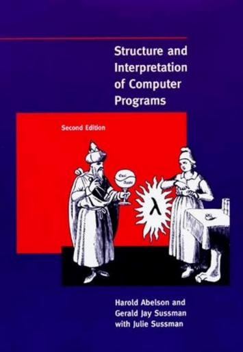

# Харольд Абельсон. Структура и интерпретация компьютерных программ (SICP) 

<script>
    (function() {
        const localMap = {
            // JS скрипты
            'https://cdnjs.cloudflare.com/ajax/libs/codemirror/5.43.0/mode/scheme/scheme.min.js': 'sicp/js/scheme.min.js',
            'https://viebel.github.io/klipse/repo/js/biwascheme-0.6.6-min.js': 'sicp/js/biwascheme-0.6.6-min.js',
            
            // CSS
            'https://storage.googleapis.com/app.klipse.tech/css/codemirror.css': 'sicp/css/codemirror.css',
        };
        
        // Перехватываем XMLHttpRequest
        const XHR = XMLHttpRequest;
        const originalOpen = XHR.prototype.open;
        
        XHR.prototype.open = function(method, url, async, user, pass) {
            //console.log('XHR:', url);
            if (localMap[url]) {
                console.log(`Перехват XHR: ${url} → ${localMap[url]}`);
                return originalOpen.call(this, method, localMap[url], async, user, pass);
            }
            return originalOpen.call(this, method, url, async, user, pass);
        };
    
        console.log('Перехватчик установлен');
    })();

    window.klipse_settings = {
        selector_eval_scheme: ".language-scheme", 
        klipse_limit: 5,
    };
 
    // Загружаем Klipse только для этой страницы
    (function() {

        function loadScript(src) {
            return new Promise((resolve, reject) => {
                const script = document.createElement('script');
                script.src = src;
                script.onload = resolve;
                script.onerror = reject;
                document.head.appendChild(script);
            });
        }

        // Загружаем всё локально из папки этой страницы
        window.onload = async function() {
            try {
                await loadScript('sicp/js/klipse_plugin.min.js');
                console.log("Klipse готов");
            } catch(e) {
                console.error("Ошибка загрузки Klipse:", e);
            }
        };
    })();
</script>
<link rel="stylesheet" href="sicp/css/codemirror.css">
<style>
    .klipse-result {
        background: #c4f5d3;
        color: #333;
        border-left: 5px solid #72e98b;
        padding: 5px;
        margin-top: 0px;
        margin-bottom: 20px;
    }
    .CodeMirror-line span[cm-text] {
        display: none !important;
    }
</style>

[**6.001** Structure and Interpretation of Computer Programs](https://ocw.mit.edu/courses/6-001-structure-and-interpretation-of-computer-programs-spring-2005/)
* первое число это номер кафедры: 6 — факультет электротехники и информатики
(EECS — Electrical Engineering and Computer Science)
* числа после точки, это конкретный предмет внутри кафедры: 001 — [Structure and Interpretation of Computer Programs (SICP)](https://ocw.mit.edu/search/?d=Electrical%20Engineering%20and%20Computer%20Science&s=department_course_numbers.sort_coursenum&type=course)

[**6.001** Материалы курса, экзамен](https://ocw.mit.edu/courses/6-001-structure-and-interpretation-of-computer-programs-spring-2005/download/)

"Структура и интерпретация компьютерных программ" (SICP), написанная Харольдом Абельсоном и Джеральдом Сассманом, - это не просто учебник по программированию. Это своего рода "библия" компьютерных наук, по которой десятилетиями учили студентов в [Massachusetts Institute of Technology (MIT)](https://www.mit.edu/education/). Он преподавался по одноимённой книге и был культовым в 80–90-е.

Современный курс основан на Python 6.100L / 6.100A.

6.100L:
* [6.100L](https://ocw.mit.edu/courses/6-100l-introduction-to-cs-and-programming-using-python-fall-2022/)

6.100A: Part 1: Berkeley CS61A, Composing Programs:
* [github.com/vladSirin](https://github.com/vladSirin/Structure-and-Interpretation-of-Computer-Programs)
* [Course Website](https://cs61a.org/) 
* [Online Textbook](http://composingprograms.com/)

Ее часто называют "Книгой Волшебника" (Wizard Book) из-за обложки и того факта, что она учит контролировать "магию" вычислений.

<details>
<summary>Wizard Book</summary>



</details>

SICP нужно прорешивать. Если не трогать упражнения, "магия" не сработает.


*Сайт [mitpress.mit.edu/sicp](https://mitpress.mit.edu/9780262510875/structure-and-interpretation-of-computer-programs/) предоставляет поддержку пользователям этой книги. Там есть программы из книги, простые задания по программированию, сопроводительные материалы и реализации диалекта Лиспа Scheme.*

Первые три главы дают мощнейший скачок в понимании того, как работает код:
* **Глава 1**: [Построение абстракций с помощью процедур (чертовски круто объясняет рекурсию и итерацию).](sicp_сhapter_1.html)
* **Глава 2**: [Построение абстракций с помощью данных (как объединять данные в структуры).](sicp_сhapter_2.html)
* **Глава 3**: [Модульность, объекты и состояние](sicp_сhapter_3.html) (здесь появляется понятие переменчивого состояния и то, как оно усложняет жизнь).

Почему Lisp?
* В Lisp синтаксиса почти нет, вам нужно самим конструировать абстракции.
* Код - это данные, это позволяет программе легко анализировать и изменять саму себя. Важно для интерпретаторов и компиляторов.
* Используя Lisp вы пересоздаете существующие концепции языков программирования.

Почему в роли диалекта Lisp имеено Scheme
* В Scheme используются статические области связывания переменных, а функции могут возвращать в качестве значений другие функции.
* В Scheme стандарт гарантирует, что если ты используешь рекурсию определенным образом, она не «переполнит стек» и будет работать так же эффективно, как цикл while
* В Scheme практически нет "магических" конструкций. Весь язык можно описать на паре страниц.
* Scheme - это "Lisp-1". Это значит, что функции и переменные в нем живут в одном пространстве имен.


<br>
<details>
<summary>Install Lisp, Scheme, DrRacket:</summary>

[DrRacket](https://docs.racket-lang.org/drracket/) — это современная "песочница" и редактор кода, созданный специально для обучения программированию на языке Lisp (и его диалектах вроде Scheme). 

[Download DrRacket](https://racket-lang.org/)


* Запуск IDE DrRacket:

    ```
    $ drracket
    ```
    
* Современный Racket - это не совсем тот Scheme, который в SICP. Чтобы использовать именно "язык волшебников", нужно загрузить модуль:

    ```
    # Скачать пакет расширения sicp (в котором лежат специфические функции из книги) 
    $ /usr/racket/bin/raco pkg install sicp
    ```

    Запуск интерпретатора в интерактивном режиме (REPL)
    ```
    $ racket
    Welcome to Racket v9.1 [cs].

    > (require sicp)
    > (+ 2 2)
    4
    > (exit)
    ```

* Запуск готового файла (.scm или .rkt)

    File solution.rkt:
    ```
    #lang sicp

    (+ 2 2)
    ```

    ```
    $ racket solution.rkt

    $ racket -I sicp solution.rkt
    ```

</details>

 
## Предисловие

> [!QUOTE]
> *Использование Лиспа не ограничивает нас в том, что́ мы можем описать в наших программах, — лишь в способе их выражения.*

<br>
<details>
<summary>...</summary>

> [!QUOTE]
> *Для умения создавать большие, значительные программы нет лучшего помощника, чем свободное владение мощными организационными методами. И наоборот: затраты, связанные с написанием больших программ, побуждают нас изобретать новые методы уменьшения веса функций и деталей, входящих в эти программы.*
>
> *Процессы, посредством которых наши программы на Лиспе переводятся в «машинные» программы, сами являются абстрактными моделями, которые мы воплощаем в программах. Их изучение и реализация многое дают для понимания организационных методов, направленных на программирование произвольных моделей. Разумеется, так можно смоделировать и сам компьютер.*
>
> *Продвигаясь по материалу этой книги, мы будем встречаться с тремя группами явлений: человеческий разум, совокупности компьютерных программ и компьютер.*
>
> *Раздельное выделение трех групп явлений — не просто вопрос тактического удобства. Хотя эти группы и остаются, как говорится, в голове, но, проводя это разделение, мы позволяем потоку символов между тремя группами двигаться быстрее. В человеческом опыте с этим потоком по богатству, живости и обилию возможностей сравнится разве что сама эволюция жизни. Отношения между разумом человека, программами и компьютером в лучшем случае метастабильны. Компьютерам никогда не хватает мощности и быстродействия. Каждый новый прорыв в технологии производства аппаратуры ведет к появлению более масштабных программных проектов, новых организационных принципов и к обогащению абстрактных моделей. Пусть каждый читатель время от времени спрашивает себя: «А зачем, к чему все это?» — только не слишком часто, чтобы удовольствие от программирования не сменилось горечью философского тупика.*

> [!QUOTE]
> *Алгол 60, который уже никогда не будет живым языком, продолжает жить в генах Scheme и Паскаля. Пожалуй, трудно найти две более разные культуры программирования, чем те, что образовались вокруг этих двух языков и используют их в качестве единой валюты. Паскаль служит для построения пирамид — впечатляющих, захватывающих статических структур, создаваемых армиями, которые укладывают на места тяжелые плиты. При помощи Лиспа порождаются организмы — впечатляющие, захватывающие динамические структуры, создаваемые командами, которые собирают их из мерцающих мириад более простых организмов. Организующие принципы в обоих случаях остаются одни и те же, за одним существенным исключением: программист, пишущий на Лиспе, располагает на порядок большей творческой свободой в том, что касается функций, которые он создает для использования другими. Программы на Лиспе населяют библиотеки функциями, которые оказываются настолько полезными, что они переживают породившие их приложения. Таким ростом полезности мы во многом обязаны списку — исконной лисповской структуре данных.*
>
> *В самом деле, в любой большой программной задаче один из важных принципов организации состоит в том, чтобы ограничить и изолировать потоки информации в отдельных модулях задачи, изобретая для этого язык. По мере приближения к границам системы, где мы — люди — взаимодействуем чаще всего, эти языки обычно становятся все менее примитивными. В результате такие системы содержат сложные функции по обработке языка, повторенные по многу раз. У Лиспа же синтаксис и семантика настолько просты, что синтаксический разбор можно считать элементарной задачей. Таким образом, методы синтаксического разбора не играют почти никакой роли в программах на Лиспе, и построение языковых процессоров редко служит препятствием для роста и изменения больших Лисп-систем. Наконец, именно эта простота синтаксиса и семантики возлагает бремя свободы на всех программистов на Лиспе. Никакую программу на Лиспе больше, чем в несколько строк длиной, невозможно написать, не населив ее самостоятельными функциями. Находите новое и приспосабливайте, складывайте и стройте новыми способами! Я поднимаю тост за программиста на Лиспе, укладывающего свои мысли в гнезда скобок.*
>
> *Алан Дж. Перлис*
>
>  *Нью-Хейвен, Коннектикут*


### Предисловие ко второму изданию

> [!QUOTE]
> 
> *Материал этой книги был основой вводного курса по информатике в MIT начиная с 1980 года. Он обязателен для всех студентов MIT на специальностях «электротехника» и «информатика», как одна из четырех частей «общей базовой программы обучения», которая включает еще два курса по электрическим схемам и линейным системам, а также курс по проектированию цифровых систем. К тому времени, как было выпущено первое издание, мы преподавали этот материал в течение четырех лет, и прошло еще двенадцать лет до появления второго издания. Нам приятно, что наша работа была широко признана и включена в другие тексты. Мы видели, как наши ученики черпали идеи и программы из этой книги и на их основе строили новые компьютерные системы и языки.*
>
> *Первое издание книги почти точно следовало программе нашего односеместрового курса в MIT. Рассмотреть весь материал, включая то, что добавлено во втором издании, в течение семестра будет невозможно, так что преподавателю придется выбирать. В нашей собственной практике мы иногда пропускаем раздел про логическое программирование (раздел 4.4), наши студенты используют имитатор > регистровых машин, но мы не описываем его реализацию (раздел 5.2), наконец, мы даем лишь беглый обзор компилятора (раздел 5.5). Даже в таком виде курс остается интенсивным. Некоторые преподаватели предпочтут ограничиться первыми тремя или четырьмя главами, оставляя прочий материал для последующих курсов.*

### Предисловие к первому изданию

> [!QUOTE]
>
> *Построение этого вводного курса по информатике отражает две основные задачи. Во-первых, мы хотим привить слушателям идею, что компьютерный язык — это не просто способ заставить компьютер производить вычисления, а новое формальное средство выражения методологических идей. Таким образом, программы должны писаться для того, чтобы их читали люди, и лишь во вторую очередь для выполнения машиной. Во-вторых, мы считаем, что основной материал, на который должен быть направлен курс этого уровня, — не синтаксис определенного языка программирования, не умные алгоритмы для эффективного вычисления определенных функций, даже не математический анализ алгоритмов и оснований программирования, но методы управления интеллектуальной сложностью больших программных систем.*
>
> *Наша цель — развить в студентах, проходящих этот курс, хороший вкус к элементам стиля и эстетике программирования. Они должны овладеть основными методами управления сложностью в большой системе, уметь прочитать 50-ти страничную программу, если она написана в хорошем стиле. Они должны в каждый данный момент понимать, чего сейчас не следует читать и что сейчас не нужно понимать. Они не должны испытывать страха перед модификацией программы, сохраняя при этом дух и стиль исходного автора.*
>
> *В основе нашего подхода к предмету лежит убеждение, что «компьютерная наука» не является наукой и что ее значение мало связано с компьютерами. Компьютерная революция — это революция в том, как мы мыслим и как мы выражаем наши мысли. Сущность этих изменений состоит в появлении дисциплины, которую можно назвать компьютерной эпистемологией, — исследования структуры знания с императивной точки зрения, в противоположность более декларативной точке зрения классических математических дисциплин. Математика дает нам структуру, в которой мы можем точно описывать понятия типа «что такое». Вычислительная наука дает нам структуру, в которой мы можем точно описывать понятия типа «как».*
>
> *Scheme, тот диалект Лиспа, который мы используем, пытается совместить силу и красоту Лиспа и Алгола. От Лиспа мы берем метаязыковую мощь, которой он обязан простоте своего синтаксиса, единообразное представление программ как объектов данных, выделение данных из кучи с последующей их утилизацией сборщиком мусора. От Алгола мы берем лексическую область действия и блоковую структуру, подаренные нам первопроходцами проектирования языков программирования из комитета по Алголу.*
  
---

["Hacker Culture"](https://en.wikipedia.org/wiki/Hacker_culture)

В MIT «hacker» исторически означал изобретательного инженера-розыгрышника, а не киберпреступника. Это отдельная культурная [традиция](https://hsw-mba.livejournal.com/67282.html), отличная от компьютерного хакинга.

Хакерская культура — это субкультура людей, которые получают удовольствие — часто в коллективном плане — от интеллектуального вызова, заключающегося в творческом преодолении ограничений программных систем или электронного оборудования (в основном цифровой электроники ) для достижения новых и оригинальных результатов. Действия, совершаемые в духе игривости и исследования (например, программирование или другие виды деятельности), называются хакингом. Однако определяющей характеристикой хакера является не сама выполняемая деятельность (например, программирование ), а то, как она выполняется и является ли она захватывающей и осмысленной. Действия, основанные на игривой изобретательности, можно считать имеющими «хакерскую ценность», и поэтому возник термин «хаки», ранними примерами которого являются розыгрыши в MIT, устроенные студентами для демонстрации своих технических способностей и изобретательности. Культура хакерства первоначально зародилась в академической среде в 1960-х годах в рамках клуба Tech Model Railroad Club (TMRC) Массачусетского технологического института (MIT) и лаборатории искусственного интеллекта MIT. Первоначально взлом подразумевал проникновение в закрытые зоны хитрым способом без причинения серьезного ущерба. Среди известных взломов в Массачусетском технологическом институте можно отметить размещение полицейской машины кампуса на крыше Большого Купола и превращение Большого Купола в R2-D2

---

</details>

## Синтаксис Scheme

Лисп был изобретен в конце 1950-х как формализм для рассуждений об определенном типе логических выражений, называемых уравнения рекурсии (recursion equations), как о модели вычислений. Лисп, чье название происходит от сокращения английских слов LISt Processing (обработка списков), был создан с целью обеспечить возможность символьной обработки для решения таких программистских задач, как символьное дифференцирование и интегрирование алгебраических выражений. С этой целью он содержал новые объекты данных, известные под названием атомов и списков, что резко отличало его от других языков того времени.

Хотя Лисп и не преодолел пока свою старую репутацию безнадежно медленного языка, в наше время он используется во многих приложениях, где эффективность не является главной заботой.

> [!IMPORTANT]
> Для интерпретации Scheme в браузере, используется библиотека javascript [Klipse](https://github.com/viebel/klipse)

**Выражение (expression)**

Вы печатаете выражение (expression), а интерпретатор отвечает, выводя результат вычисления (evaluation) этого выражения.

```

```

```
(+ 1 2) ; выражение (expression)

где:
+ это operator по соглашению prefix notation
1 и 2 это operands

;; nest combinations, pretty printing
(* 
    (+ 1 2) 
    (+ 2 3) 
    8
) 

где:
(+ 1 2) и (+ 2 3) это arguments процедуры
```

**Комментарии**:

* `;` — один знак для комментариев "в конце строки" кода.
* `;;` — два знака для комментариев, которые стоят на отдельной строке и выровнены по коду.
* `;;;` — три знака для описания целых файлов или крупных модулей.
* `#;` — комментирование целого выражения 
* `#| ... |#` — блочный (многострочный) комментарий

```scheme
#|
  Тут может быть много текста.
  И даже (другие скобки) внутри.
  Этот блок будет полностью скрыт от интерпретатора.
|#
;; арифметика + - * /
(+ 0.5 0.5) ; 0.5 + 0.5
(abs -1.5) ; -1.5
(sqrt -1) ; Комплексные числа: 0+1i
(log 6) ; ln(6) — логарифм по основанию e
(exp 6) ; e^6 — число e в степени 6
;; float
(= 0.3333333333333333 (/ 1 3))
;; Результат будет 6. Умножение (* 10 20) полностью проигнорировано.
(+ 1 2 #;(* 10 20) 3) 
;; интерпретатор используемый Klipse (BiwaScheme)
;; вместо remainder используется mod
(define (remainder n d)
  (if (< n d)
      n
      (remainder (- n d) d)))
(remainder 10 3) ; остаток от деления 
```

**bool**:
* and, or - это особая форма т.е. с нормальным порядком
```scheme
(= 3 3) ; true #t
(> 10 5); #t
(if (or #f #t) 88 99) ; 88
(if (and #f #t) 88 99) ; 99
(if (not #f) 88 99) ; 88
(even? 5) ; предикат проверяет, является ли число чётным
```

**Условие**: `(if <проверка> <что_делать_если_правда> <что_делать_если_ложь>)`
* if - это особая форма т.е. с нормальным порядком
```scheme
(+ 10 (if (< 5 2) 6 8))
```

**Список условий**: 
* cond - это особая форма т.е. с нормальным порядком

```
(cond (<условие_1> <результат_1>)
      (<условие_2> <результат_2>)
      (else <результат_по_умолчанию>))
```


```scheme
(define (abs x)
  (cond ((> x 0) x)
        ((= x 0) 0)
        ((< x 0) (- x))
  )
)
(abs 0.5)        
```        

В теле `if` или `cond` иногда нужно выполнить два действия подряд (сначала применить функцию, а потом вызвать рекурсию). В языке `Scheme` для этого есть команда `begin`:

```lisp
(begin
  (действие-1)
  (действие-2))
```


**Создание переменной**:

```scheme
;; global environment
;; define это expression special forms
(define my_var 1.77) ; Inexact Float
(define result (- my_var 1))
(+ my_var 2 3 )  
(/ (+ 2 8) my_var)
```

**Создание процедуры**:

```scheme
;; procedure definitions
(define (my_proc_mul arg1) (* arg1 arg1))
(my_proc_mul 5)
;; процедура с local environment
(define (my_proc_mul arg1)
   (define loc_var1 (* 2 arg1))
   (define loc_var2 (* 2 arg1))
   (+
    loc_var1
    loc_var2
   )
)
(my_proc_mul 5) ; 20
```

**Округление**:

```scheme
;; 1. FLOOR — Округление «вниз» (в сторону минус бесконечности)
(floor 3.6)   ; 3.0
(floor -3.6)  ; -4.0 (тянет число влево по числовой прямой)
;; 2. CEILING — Округление «вверх» (в сторону плюс бесконечности)
(ceiling 3.1)  ; 4.0
(ceiling -3.1) ;-3.0 (тянет число вправо по числовой прямой)
;; 3. TRUNCATE — Отбрасывание хвоста (всегда в сторону НУЛЯ)
;; Работает как топор: просто отрубает все, что после точки
(truncate 3.9)  ; 3.0
(truncate -3.9) ; -3.0 (в отличие от floor, тянет -3.9 к нулю)
;; 4. ROUND — Округление к ближайшему целому
(round 3.4)   ; 3.0
(round 3.6)   ; 4.0
(round 3.5)   ; 4.0 (в Scheme часто округляет к ближайшему четному)
```

**Проверка целых чисел**:

```
;; интерпретатор используемый Klipse (BiwaScheme)
;; не поддерживает exact? и inexact->exact
;; проверка на целое число
(exact? 1.0) ; #f т.е. false так как float
(exact? 3) ; #t т.е. true так как целое
;; преобразует в дробь
(inexact->exact 0.125) ; 1/8
```

Ломаная реализация exact: 

```scheme
(define (exact? n) (= n (floor n)))
(exact? 2.0) ; #t
(exact? 2.1) ; #f
```

---
 
<!--

<link rel="stylesheet" type="text/css" href="https://storage.googleapis.com/app.klipse.tech/css/codemirror.css">

<script>
    window.klipse_settings = {
        selector_eval_scheme: ".language-scheme", 
         klipse_limit: 5,
    };
</script>

<script src="http://app.klipse.tech/plugin_prod/js/klipse_plugin.min.js"></script>
 
-->


