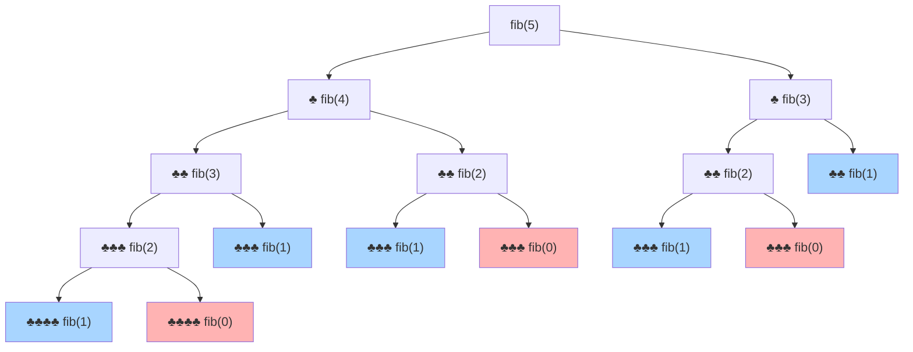
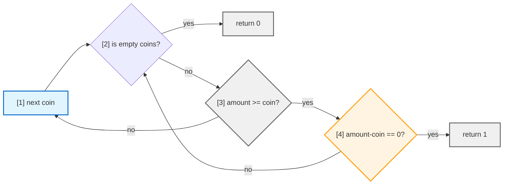
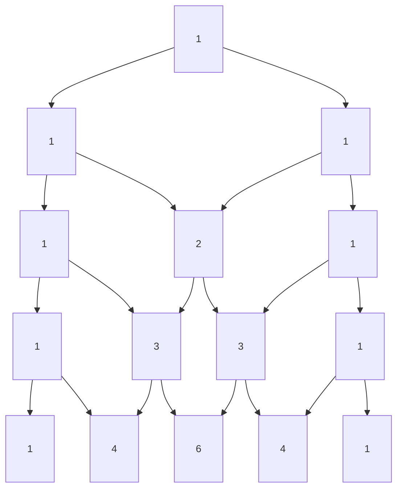
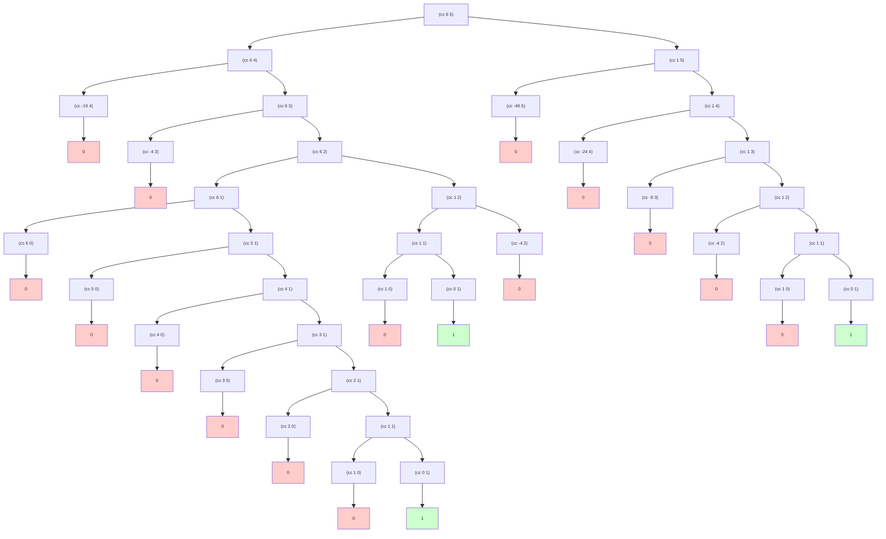

# Харольд Абельсон. Структура и интерпретация компьютерных программ (SICP) 

<script>
    (function() {
        const localMap = {
            // JS скрипты
            'https://cdnjs.cloudflare.com/ajax/libs/codemirror/5.43.0/mode/scheme/scheme.min.js': 'sicp/js/scheme.min.js',
            'https://viebel.github.io/klipse/repo/js/biwascheme-0.6.6-min.js': 'sicp/js/biwascheme-0.6.6-min.js',
            
            // CSS
            'https://storage.googleapis.com/app.klipse.tech/css/codemirror.css': 'sicp/css/codemirror.css',
        };
        
        // Перехватываем XMLHttpRequest
        const XHR = XMLHttpRequest;
        const originalOpen = XHR.prototype.open;
        
        XHR.prototype.open = function(method, url, async, user, pass) {
            //console.log('XHR:', url);
            if (localMap[url]) {
                console.log(`Перехват XHR: ${url} → ${localMap[url]}`);
                return originalOpen.call(this, method, localMap[url], async, user, pass);
            }
            return originalOpen.call(this, method, url, async, user, pass);
        };
    
        console.log('✅ Перехватчик установлен');
    })();

    window.klipse_settings = {
        selector_eval_scheme: ".language-scheme", 
        klipse_limit: 5,
    };
 
    // Загружаем Klipse только для этой страницы
    (function() {

        function loadScript(src) {
            return new Promise((resolve, reject) => {
                const script = document.createElement('script');
                script.src = src;
                script.onload = resolve;
                script.onerror = reject;
                document.head.appendChild(script);
            });
        }

        // Загружаем всё локально из папки этой страницы
        window.onload = async function() {
            try {
                await loadScript('sicp/js/klipse_plugin.min.js');
                console.log("Klipse готов");
            } catch(e) {
                console.error("Ошибка загрузки Klipse:", e);
            }
        };
    })();
</script>
<link rel="stylesheet" href="sicp/css/codemirror.css">
<style>
    .klipse-result {
        background: #c4f5d3;
        color: #333;
        border-left: 5px solid #72e98b;
        padding: 5px;
        margin-top: 0px;
        margin-bottom: 20px;
    }
    .CodeMirror-line span[cm-text] {
        display: none !important;
    }
</style>

[**6.001** Structure and Interpretation of Computer Programs](https://ocw.mit.edu/courses/6-001-structure-and-interpretation-of-computer-programs-spring-2005/)
* первое число это номер кафедры: 6 — факультет электротехники и информатики
(EECS — Electrical Engineering and Computer Science)
* числа после точки, это конкретный предмет внутри кафедры: 001 — [Structure and Interpretation of Computer Programs (SICP)](https://ocw.mit.edu/search/?d=Electrical%20Engineering%20and%20Computer%20Science&s=department_course_numbers.sort_coursenum&type=course)

[**6.001** Материалы курса, экзамен](https://ocw.mit.edu/courses/6-001-structure-and-interpretation-of-computer-programs-spring-2005/download/)

"Структура и интерпретация компьютерных программ" (SICP), написанная Харольдом Абельсоном и Джеральдом Сассманом, - это не просто учебник по программированию. Это своего рода "библия" компьютерных наук, по которой десятилетиями учили студентов в [Massachusetts Institute of Technology (MIT)](https://www.mit.edu/education/). Он преподавался по одноимённой книге и был культовым в 80–90-е.

Современный курс основан на Python 6.100L / 6.100A.

6.100L:
* [6.100L](https://ocw.mit.edu/courses/6-100l-introduction-to-cs-and-programming-using-python-fall-2022/)

6.100A: Part 1: Berkeley CS61A, Composing Programs:
* [github.com/vladSirin](https://github.com/vladSirin/Structure-and-Interpretation-of-Computer-Programs)
* [Course Website](https://cs61a.org/) 
* [Online Textbook](http://composingprograms.com/)

Ее часто называют "Книгой Волшебника" (Wizard Book) из-за обложки и того факта, что она учит контролировать "магию" вычислений.

<details>
<summary>Wizard Book</summary>


</details>

SICP нужно прорешивать. Если не трогать упражнения, "магия" не сработает.


*Сайт [mitpress.mit.edu/sicp](https://mitpress.mit.edu/9780262510875/structure-and-interpretation-of-computer-programs/) предоставляет поддержку пользователям этой книги. Там есть программы из книги, простые задания по программированию, сопроводительные материалы и реализации диалекта Лиспа Scheme.*

Первые три главы дают мощнейший скачок в понимании того, как работает код:
* Глава 1: Построение абстракций с помощью процедур (чертовски круто объясняет рекурсию и итерацию).
* Глава 2: Построение абстракций с помощью данных (как объединять данные в структуры).
* Глава 3: Модульность, объекты и состояние (здесь появляется понятие переменчивого состояния и то, как оно усложняет жизнь).

Почему Lisp?
* В Lisp синтаксиса почти нет, вам нужно самим конструировать абстракции.
* Код - это данные, это позволяет программе легко анализировать и изменять саму себя. Важно для интерпретаторов и компиляторов.
* Используя Lisp вы пересоздаете существующие концепции языков программирования.

Почему в роли диалекта Lisp имеено Scheme
* В Scheme используются статические области связывания переменных, а функции могут возвращать в качестве значений другие функции.
* В Scheme стандарт гарантирует, что если ты используешь рекурсию определенным образом, она не «переполнит стек» и будет работать так же эффективно, как цикл while
* В Scheme практически нет "магических" конструкций. Весь язык можно описать на паре страниц.
* Scheme - это "Lisp-1". Это значит, что функции и переменные в нем живут в одном пространстве имен.


<br>
<details>
<summary>Install Lisp, Scheme, DrRacket:</summary>

[DrRacket](https://docs.racket-lang.org/drracket/) — это современная "песочница" и редактор кода, созданный специально для обучения программированию на языке Lisp (и его диалектах вроде Scheme). 

[Download DrRacket](https://racket-lang.org/)


* Запуск IDE DrRacket:

    ```
    $ drracket
    ```
    
* Современный Racket - это не совсем тот Scheme, который в SICP. Чтобы использовать именно "язык волшебников", нужно загрузить модуль:

    ```
    # Скачать пакет расширения sicp (в котором лежат специфические функции из книги) 
    $ /usr/racket/bin/raco pkg install sicp
    ```

    Запуск интерпретатора в интерактивном режиме (REPL)
    ```
    $ racket
    Welcome to Racket v9.1 [cs].

    > (require sicp)
    > (+ 2 2)
    4
    > (exit)
    ```

* Запуск готового файла (.scm или .rkt)

    File solution.rkt:
    ```
    #lang sicp

    (+ 2 2)
    ```

    ```
    $ racket solution.rkt

    $ racket -I sicp solution.rkt
    ```

</details>

 
## Предисловие

> [!QUOTE]
> *Использование Лиспа не ограничивает нас в том, что́ мы можем описать в наших программах, — лишь в способе их выражения.*

<br>
<details>
<summary>...</summary>

> [!QUOTE]
> *Для умения создавать большие, значительные программы нет лучшего помощника, чем свободное владение мощными организационными методами. И наоборот: затраты, связанные с написанием больших программ, побуждают нас изобретать новые методы уменьшения веса функций и деталей, входящих в эти программы.*
>
> *Процессы, посредством которых наши программы на Лиспе переводятся в «машинные» программы, сами являются абстрактными моделями, которые мы воплощаем в программах. Их изучение и реализация многое дают для понимания организационных методов, направленных на программирование произвольных моделей. Разумеется, так можно смоделировать и сам компьютер.*
>
> *Продвигаясь по материалу этой книги, мы будем встречаться с тремя группами явлений: человеческий разум, совокупности компьютерных программ и компьютер.*
>
> *Раздельное выделение трех групп явлений — не просто вопрос тактического удобства. Хотя эти группы и остаются, как говорится, в голове, но, проводя это разделение, мы позволяем потоку символов между тремя группами двигаться быстрее. В человеческом опыте с этим потоком по богатству, живости и обилию возможностей сравнится разве что сама эволюция жизни. Отношения между разумом человека, программами и компьютером в лучшем случае метастабильны. Компьютерам никогда не хватает мощности и быстродействия. Каждый новый прорыв в технологии производства аппаратуры ведет к появлению более масштабных программных проектов, новых организационных принципов и к обогащению абстрактных моделей. Пусть каждый читатель время от времени спрашивает себя: «А зачем, к чему все это?» — только не слишком часто, чтобы удовольствие от программирования не сменилось горечью философского тупика.*

> [!QUOTE]
> *Алгол 60, который уже никогда не будет живым языком, продолжает жить в генах Scheme и Паскаля. Пожалуй, трудно найти две более разные культуры программирования, чем те, что образовались вокруг этих двух языков и используют их в качестве единой валюты. Паскаль служит для построения пирамид — впечатляющих, захватывающих статических структур, создаваемых армиями, которые укладывают на места тяжелые плиты. При помощи Лиспа порождаются организмы — впечатляющие, захватывающие динамические структуры, создаваемые командами, которые собирают их из мерцающих мириад более простых организмов. Организующие принципы в обоих случаях остаются одни и те же, за одним существенным исключением: программист, пишущий на Лиспе, располагает на порядок большей творческой свободой в том, что касается функций, которые он создает для использования другими. Программы на Лиспе населяют библиотеки функциями, которые оказываются настолько полезными, что они переживают породившие их приложения. Таким ростом полезности мы во многом обязаны списку — исконной лисповской структуре данных.*
>
> *В самом деле, в любой большой программной задаче один из важных принципов организации состоит в том, чтобы ограничить и изолировать потоки информации в отдельных модулях задачи, изобретая для этого язык. По мере приближения к границам системы, где мы — люди — взаимодействуем чаще всего, эти языки обычно становятся все менее примитивными. В результате такие системы содержат сложные функции по обработке языка, повторенные по многу раз. У Лиспа же синтаксис и семантика настолько просты, что синтаксический разбор можно считать элементарной задачей. Таким образом, методы синтаксического разбора не играют почти никакой роли в программах на Лиспе, и построение языковых процессоров редко служит препятствием для роста и изменения больших Лисп-систем. Наконец, именно эта простота синтаксиса и семантики возлагает бремя свободы на всех программистов на Лиспе. Никакую программу на Лиспе больше, чем в несколько строк длиной, невозможно написать, не населив ее самостоятельными функциями. Находите новое и приспосабливайте, складывайте и стройте новыми способами! Я поднимаю тост за программиста на Лиспе, укладывающего свои мысли в гнезда скобок.*
>
> *Алан Дж. Перлис*
>
>  *Нью-Хейвен, Коннектикут*


### Предисловие ко второму изданию

> [!QUOTE]
> 
> *Материал этой книги был основой вводного курса по информатике в MIT начиная с 1980 года. Он обязателен для всех студентов MIT на специальностях «электротехника» и «информатика», как одна из четырех частей «общей базовой программы обучения», которая включает еще два курса по электрическим схемам и линейным системам, а также курс по проектированию цифровых систем. К тому времени, как было выпущено первое издание, мы преподавали этот материал в течение четырех лет, и прошло еще двенадцать лет до появления второго издания. Нам приятно, что наша работа была широко признана и включена в другие тексты. Мы видели, как наши ученики черпали идеи и программы из этой книги и на их основе строили новые компьютерные системы и языки.*
>
> *Первое издание книги почти точно следовало программе нашего односеместрового курса в MIT. Рассмотреть весь материал, включая то, что добавлено во втором издании, в течение семестра будет невозможно, так что преподавателю придется выбирать. В нашей собственной практике мы иногда пропускаем раздел про логическое программирование (раздел 4.4), наши студенты используют имитатор > регистровых машин, но мы не описываем его реализацию (раздел 5.2), наконец, мы даем лишь беглый обзор компилятора (раздел 5.5). Даже в таком виде курс остается интенсивным. Некоторые преподаватели предпочтут ограничиться первыми тремя или четырьмя главами, оставляя прочий материал для последующих курсов.*

### Предисловие к первому изданию

> [!QUOTE]
>
> *Построение этого вводного курса по информатике отражает две основные задачи. Во-первых, мы хотим привить слушателям идею, что компьютерный язык — это не просто способ заставить компьютер производить вычисления, а новое формальное средство выражения методологических идей. Таким образом, программы должны писаться для того, чтобы их читали люди, и лишь во вторую очередь для выполнения машиной. Во-вторых, мы считаем, что основной материал, на который должен быть направлен курс этого уровня, — не синтаксис определенного языка программирования, не умные алгоритмы для эффективного вычисления определенных функций, даже не математический анализ алгоритмов и оснований программирования, но методы управления интеллектуальной сложностью больших программных систем.*
>
> *Наша цель — развить в студентах, проходящих этот курс, хороший вкус к элементам стиля и эстетике программирования. Они должны овладеть основными методами управления сложностью в большой системе, уметь прочитать 50-ти страничную программу, если она написана в хорошем стиле. Они должны в каждый данный момент понимать, чего сейчас не следует читать и что сейчас не нужно понимать. Они не должны испытывать страха перед модификацией программы, сохраняя при этом дух и стиль исходного автора.*
>
> *В основе нашего подхода к предмету лежит убеждение, что «компьютерная наука» не является наукой и что ее значение мало связано с компьютерами. Компьютерная революция — это революция в том, как мы мыслим и как мы выражаем наши мысли. Сущность этих изменений состоит в появлении дисциплины, которую можно назвать компьютерной эпистемологией, — исследования структуры знания с императивной точки зрения, в противоположность более декларативной точке зрения классических математических дисциплин. Математика дает нам структуру, в которой мы можем точно описывать понятия типа «что такое». Вычислительная наука дает нам структуру, в которой мы можем точно описывать понятия типа «как».*
>
> *Scheme, тот диалект Лиспа, который мы используем, пытается совместить силу и красоту Лиспа и Алгола. От Лиспа мы берем метаязыковую мощь, которой он обязан простоте своего синтаксиса, единообразное представление программ как объектов данных, выделение данных из кучи с последующей их утилизацией сборщиком мусора. От Алгола мы берем лексическую область действия и блоковую структуру, подаренные нам первопроходцами проектирования языков программирования из комитета по Алголу.*
  
---

["Hacker Culture"](https://en.wikipedia.org/wiki/Hacker_culture)

В MIT «hacker» исторически означал изобретательного инженера-розыгрышника, а не киберпреступника. Это отдельная культурная [традиция](https://hsw-mba.livejournal.com/67282.html), отличная от компьютерного хакинга.

Хакерская культура — это субкультура людей, которые получают удовольствие — часто в коллективном плане — от интеллектуального вызова, заключающегося в творческом преодолении ограничений программных систем или электронного оборудования (в основном цифровой электроники ) для достижения новых и оригинальных результатов. Действия, совершаемые в духе игривости и исследования (например, программирование или другие виды деятельности), называются хакингом. Однако определяющей характеристикой хакера является не сама выполняемая деятельность (например, программирование ), а то, как она выполняется и является ли она захватывающей и осмысленной. Действия, основанные на игривой изобретательности, можно считать имеющими «хакерскую ценность», и поэтому возник термин «хаки», ранними примерами которого являются розыгрыши в MIT, устроенные студентами для демонстрации своих технических способностей и изобретательности. Культура хакерства первоначально зародилась в академической среде в 1960-х годах в рамках клуба Tech Model Railroad Club (TMRC) Массачусетского технологического института (MIT) и лаборатории искусственного интеллекта MIT. Первоначально взлом подразумевал проникновение в закрытые зоны хитрым способом без причинения серьезного ущерба. Среди известных взломов в Массачусетском технологическом институте можно отметить размещение полицейской машины кампуса на крыше Большого Купола и превращение Большого Купола в R2-D2

---

</details>

## Синтаксис Scheme

Лисп был изобретен в конце 1950-х как формализм для рассуждений об определенном типе логических выражений, называемых уравнения рекурсии (recursion equations), как о модели вычислений. Лисп, чье название происходит от сокращения английских слов LISt Processing (обработка списков), был создан с целью обеспечить возможность символьной обработки для решения таких программистских задач, как символьное дифференцирование и интегрирование алгебраических выражений. С этой целью он содержал новые объекты данных, известные под названием атомов и списков, что резко отличало его от других языков того времени.

Хотя Лисп и не преодолел пока свою старую репутацию безнадежно медленного языка, в наше время он используется во многих приложениях, где эффективность не является главной заботой.

> [!IMPORTANT]
> Для интерпретации Scheme в браузере, используется библиотека javascript [Klipse](https://github.com/viebel/klipse)

**Выражение (expression)**

Вы печатаете выражение (expression), а интерпретатор отвечает, выводя результат вычисления (evaluation) этого выражения.

```

```

```
(+ 1 2) ; выражение (expression)

где:
+ это operator по соглашению prefix notation
1 и 2 это operands

;; nest combinations, pretty printing
(* 
    (+ 1 2) 
    (+ 2 3) 
    8
) 

где:
(+ 1 2) и (+ 2 3) это arguments процедуры
```

**Комментарии**:

* `;` — один знак для комментариев "в конце строки" кода.
* `;;` — два знака для комментариев, которые стоят на отдельной строке и выровнены по коду.
* `;;;` — три знака для описания целых файлов или крупных модулей.
* `#;` — комментирование целого выражения 
* `#| ... |#` — блочный (многострочный) комментарий

```scheme
#|
  Тут может быть много текста.
  И даже (другие скобки) внутри.
  Этот блок будет полностью скрыт от интерпретатора.
|#
;; арифметика + - * /
(+ 0.5 0.5) ; 0.5 + 0.5
(abs -1.5) ; -1.5
(sqrt -1) ; Комплексные числа: 0+1i
(log 6) ; ln(6) — логарифм по основанию e
(exp 6) ; e^6 — число e в степени 6
;; float
(= 0.3333333333333333 (/ 1 3))
;; Результат будет 6. Умножение (* 10 20) полностью проигнорировано.
(+ 1 2 #;(* 10 20) 3) 
;; интерпретатор используемый Klipse (BiwaScheme)
;; вместо remainder используется mod
(define (remainder n d)
  (if (< n d)
      n
      (remainder (- n d) d)))
(remainder 10 3) ; остаток от деления 
```

**bool**:
* and, or - это особая форма т.е. с нормальным порядком
```scheme
(= 3 3) ; true #t
(> 10 5); #t
(if (or #f #t) 88 99) ; 88
(if (and #f #t) 88 99) ; 99
(if (not #f) 88 99) ; 88
(even? 5) ; предикат проверяет, является ли число чётным
```

**Условие**: `(if <проверка> <что_делать_если_правда> <что_делать_если_ложь>)`
* if - это особая форма т.е. с нормальным порядком
```scheme
(+ 10 (if (< 5 2) 6 8))
```

**Список условий**: 
* cond - это особая форма т.е. с нормальным порядком

```
(cond (<условие_1> <результат_1>)
      (<условие_2> <результат_2>)
      (else <результат_по_умолчанию>))
```

```scheme
(define (abs x)
  (cond ((> x 0) x)
        ((= x 0) 0)
        ((< x 0) (- x))
  )
)
(abs 0.5)        
```        


**Создание переменной**:

```scheme
;; global environment
;; define это expression special forms
(define my_var 1.77) ; Inexact Float
(define result (- my_var 1))
(+ my_var 2 3 )  
(/ (+ 2 8) my_var)
```

**Создание процедуры**:

```scheme
;; procedure definitions
(define (my_proc_mul arg1) (* arg1 arg1))
(my_proc_mul 5)
;; процедура с local environment
(define (my_proc_mul arg1)
   (define loc_var1 (* 2 arg1))
   (define loc_var2 (* 2 arg1))
   (+
    loc_var1
    loc_var2
   )
)
(my_proc_mul 5) ; 20
```

**Округление**:

```scheme
;; 1. FLOOR — Округление «вниз» (в сторону минус бесконечности)
(floor 3.6)   ; 3.0
(floor -3.6)  ; -4.0 (тянет число влево по числовой прямой)
;; 2. CEILING — Округление «вверх» (в сторону плюс бесконечности)
(ceiling 3.1)  ; 4.0
(ceiling -3.1) ;-3.0 (тянет число вправо по числовой прямой)
;; 3. TRUNCATE — Отбрасывание хвоста (всегда в сторону НУЛЯ)
;; Работает как топор: просто отрубает все, что после точки
(truncate 3.9)  ; 3.0
(truncate -3.9) ; -3.0 (в отличие от floor, тянет -3.9 к нулю)
;; 4. ROUND — Округление к ближайшему целому
(round 3.4)   ; 3.0
(round 3.6)   ; 4.0
(round 3.5)   ; 4.0 (в Scheme часто округляет к ближайшему четному)
```

**Проверка целых чисел**:

```
;; интерпретатор используемый Klipse (BiwaScheme)
;; не поддерживает exact? и inexact->exact
;; проверка на целое число
(exact? 1.0) ; #f т.е. false так как float
(exact? 3) ; #t т.е. true так как целое
;; преобразует в дробь
(inexact->exact 0.125) ; 1/8
```

Ломаная реализация exact: 

```scheme
(define (exact? n) (= n (floor n)))
(exact? 2.0) ; #t
(exact? 2.1) ; #f
```

---

## Глава 1. ПОСТРОЕНИЕ АБСТРАКЦИЙ С ПОМОЩЬЮ ПРОЦЕДУР

Таким образом, от любого мощного языка программирования требуется способность описывать простые данные и элементарные процедуры (правила обработки данных), а также наличие средств комбинирования и абстракции процедур и данных.


Вычисление комбинаций, примем во внимание, что интерпретатор, вычисляя значение комбинации, тоже следует процедуре:

Чтобы вычислить комбинацию, требуется:
1. Вычислить все подвыражения комбинации. Если это скобки — запускаем все правило целиком с начала.
2. Применить процедуру, которая является значением самого левого подвыражения (оператора) к аргументам — значениям остальных подвыражений (операндов).

```
(* 
    (+ 2 (+ 1 1)) 
    (/ 8 4) 
) 
```

Таким образом, правило вычисления рекурсивно (recursive) по своей природе, это означает, что в качестве одного из своих шагов оно включает применение того же самого правила из п.1.

### Две модели для вычисления

Суть подстановочной модели: Мы ведем себя так, будто интерпретатор — это просто текстовый редактор «Найти и Заменить». Мы заменяем вызов функции её кодом.  Подстановочная модель — это иллюзия. Она нужна людям, чтобы понимать простые программы. В реальности компьютер так не делает, потому что постоянно копировать и вставлять текст — это дико медленно и жрет память. Подстановочная модель не умеет работать с изменяемым состоянием. 
 
Подстановочная модель (Substitution Model). Мы просто подставляем текст вместо имен.

> [!EXAMPLE]
> Процедура: `(define (square x) (* x x))`
> 
> Вызов `(square (+ 2 3))`

* **Апликативный порядок (applicative-order evaluation)** (Нормальные люди) "вычисление аргументов, затем применение процедуры":
    *  для этого считаем `(+ 2 3)` и подставляем 5 в тело функции: `(* 5 5)`. Получаем 25
* **Нормальный порядок (normal-order evaluation)** (Ленивые люди) "полная подстановка, затем редукция":  
    * не вычисляет аргументы, пока не понадобится их значение
    * сразу подставляем выражение (+ 2 3) в тело: `(* (+ 2 3) (+ 2 3))` 
    * далее считаем первый плюс: `(* 5 (+ 2 3))`
    * далее считаем второй плюс: `(* 5 5)`
    * получаем 25 

<br>
<details>
<summary>Модель применения (Environment Model):</summary>

Модель применения (Environment Model). Как компьютер работает на самом деле.
* Вместо того чтобы заменять текст, интерпретатор заводит таблицу (словарь)
* при вызове `(square 5)` создается стековый кадр (stack frame) в локальном окружении, это таблица, где колонки — это имена формальных параметров, а значения — переданные аргументы 
* Интерпретатор берет тело функции и находит значения для локальных переменных в таблице
* У каждого фрейма есть ссылка на «родительский» фрейм (внешнее окружение). Если переменная не найдена в текущей таблице, интерпретатор идет искать её в родительскую.
* В Environment Model, если мы вернули одну функцию из другой, "кадр" (окружение) не удаляется, потому что на него остается ссылка. Это и есть механизм замыканий (closures).

</details>

#### Поблема нормального порядка

* **Эффективность (Проблема дублирования работы)**.
    В Лиспе используется аппликативный порядок вычислений, отчасти из-за дополнительной эффективности, которую дает возможность не вычислять многократно выражения:

    С аппликативным порядком для процедуры: `(define (square x) (* x x))` при ее вызове `(square (+ 2 3))` мы сперва вычисляем аргумент т.е. `(+ 2 3)=5` и его подставляем в **тело функции**: `(* 5 5)`

    Но при нормальном порядке (ленивом), при вызове `(square (+ 2 3))` мы не вычисляем `(+ 2 3)` для аргумента, а сразу прокидываем его дальше и вычисляем когда это выражение понадобится, в следствии чего мы имеем такое **тело функции**: `(* (+ 2 3) (+ 2 3))` т.е. мы два раза будем вычислять одно и тоже выражение `(+ 2 3)`

* **Проблема с побочными эффектами (изменение переменных или вывод на экран)**.

    Лисп выбирает аппликативный порядок, чтобы программист всегда точно знал: если я передал аргумент в функцию, он вычислится ровно один раз прямо сейчас. Потому что с нормальным порядком вычислений становится очень сложно обращаться, как только мы покидаем область процедур, которые можно смоделировать с помощью подстановки.

    Так как ленивые вычисления вычисляются по месту столько раз сколь они были проброшены, то при налии счетчика внутри такого выражения вся логика ломается.


Иллюстрирация аппликативного порядка вычислений в Rust

```rust
fn foo<T>(mut f1: T, a: i32) -> i32
where
    T: FnMut(i32) -> i32,
{
    f1(a) + f1(a)
}

fn main() {
    let mut acc = 0;

    let mut f = |a| {
        acc += a; // побочный эффект
        acc
    };
    assert_eq!(foo(&mut f, 5), 15);
    assert_eq!(acc, 10);
    
}
```
 
Но операторы `&&` и `||` — это не функции, это специальные конструкции (Control Flow), которые работают по **нормальному порядку**: они не трогают правое выражение, если ответ понятен по левому.

```rust,editable
fn boom() -> bool {
    panic!("Меня вызвали, и я взорвал программу!");
}
fn main() {
    if true || boom() {
        println!("1. Пронесло! boom() не вызвался, так как true уже достаточно.");
    }
  
    if false && boom() {
        // До сюда код не дойдет
    } else {
        println!("2. Снова пронесло! boom() не вызвался, так как false убивает всё условие.");
    }
}

```
 
#### Тест для выявления метода вычисления интерпретатора: аппликативный или нормальный.

Он идеально показывает разницу в том, когда именно интерпретатор вычисляет аргументы.

```
(define (p) (p)) ; это процедура, которая вызывает саму себя

(define (test x y)
  (if (= x 0)
      0
      y))

(test 0 (p))
```

* Аппликативный порядок (как работает большинство языков и Klipse)

    Интерпретатор следует правилу: «Сначала вычисли все аргументы, потом применяй процедуру».
    Но так как процедура `p` вызывает саму себя, то интерпретатор уходит в бесконечный цикл (зависает)
 
* Нормальный порядок (ленивые вычисления)

    Интерпретатор следует правилу: «Не вычисляй, пока не прижмет (полная подстановка)».

    Вызов `(test 0 (p))` сразу подставляется прямо в тело процедуры:
    т.е. x=0 подставляется в if, а `p` вообще и не начиналось вычисляться так как не используется в выражении, результат 0
    ```
    (define (test x y)
        (if (= 0 0)
            0
            y))
    ```

**Варианты scheme с нормальным порядком т.е. ленивые:**

1. Специальные диалекты (Lazy Scheme), прямое расширение языка, которое называется Lazy Racket, в DrRacket, можно просто написать в первой строчке: `#lang lazy`

```
#lang lazy
(define (p) (p))

(define (test x y)
  (if (= x 0)
      0
      y))

(test 0 (p)) ; 0
```

2. Реализация через «Обещания» (Delay/Force)
    * delay: замораживает вычисление (создает "промис").
    * force: размораживает и заставляет вычислить.


```scheme
(define (test x y)
  (if (= x 0)
      0
      (force y))) ; Размораживаем только если x != 0

(test 0 (delay (p))) ; Замораживаем (p)
```

p.s. Haskell - король нормального порядка, он "ленивый" от рождения.


### 1.1.6. Условные выражения и предикаты

**Условие**: `(if <проверка> <что_делать_если_правда> <что_делать_если_ложь>)`
```scheme
(+ 10 (if (< 5 2) 6 8))
```

**Список условий**:

```
(cond (<условие_predicate_1> <результат_1>) ; clauses
      (<условие_predicate_2> <результат_2>) ; clauses
      (else <результат_по_умолчанию>)) ; clauses
```

Если ни один из hpi ни окажется истинным, значение условного выражения не определено `#<undef>`.


```scheme
(define (abs x)
  (cond ((> x 0) x)
        ((= x 0) 0)
        ((< x 0) (- x))))

(abs 0.5)        
```        

Вот еще один способ написать процедуру вычисления модуля, особая форма if, **ограниченный вид условного выражения**. Его можно использовать при разборе случаев, когда есть ровно два возможных исхода: 
* `(if (predicate) (следствие) (альтернатива))`
* Если *predicate* дает истинное значение, интерпретатор вычисляет *следствие* и возвращает его значение. 
* В противном случае он вычисляет *альтернативу* и возвращает ее значение

```scheme
(define (abs x)
  (if (< x 0)
      (- x)
      x))

(abs 0.5)
```
Словом предикат называют процедуры, которые возвращают истину или ложь, а также выражения, которые имеют значением истину или ложь.

В дополнение к элементарным предикатам вроде `<, =, >`, существуют операции логической композиции, которые позволяют нам конструировать составные предикаты:
* and - интерпретатор вычисляет выражения по одному, слева направо. Первый false прекращает дальнейшую проверку. (особая форма)
* or - интерпретатор вычисляет выражения по одному, слева направо. Первый true прекращает дальнейшую проверку. (особая форма)
* not - инвертирует выражение, рещультат true если выражение false, и наоборот


#### Упражнение 1.1.

```scheme
(+ 1 (- 4 6)) ; -1 т.е. числа знаковые, signed
```

```scheme
(define a 3)
(define b (+ a 1))

(+ a b (* a b)) ; 19

(* (cond ((> a b) a) ; 16
         ((< a b) b)
         (else -1))
   (+ a 1))
```
#### Упражнение 1.2.
Переведите следующее выражение в префиксную форму:

$\frac {5 + 4 + (2 - (3 - (6 + \frac{4}{5}))) }{3 (6 - 2) (2 - 7)}$

`-37/150 (или примерно -0.24666...)`

```scheme
(/ (+ 4 5 (- 2 (- 3 (+ 6 (/ 4 5))))) (* 3 (- 6 2) (- 2 7)))
```

#### Упражнение 1.3.
Определите процедуру, которая принимает в качестве аргументов три числа и возвращает сумму квадратов ($x^2 + y^2$) двух бо́льших из них.

Прототип:
```rust,editable
fn sum_squares_of_largest(a: i32, b: i32, c: i32) -> i32 {
    if a >= c && b >= c {
        a * a + b * b
    } else if a >= b && c >= b {
        a * a + c * c
    } else {
        b * b + c * c
    }
}
fn main() {
    println!("{}", sum_squares_of_largest(5, 1, 4)); // 5^2 + 4^2 = 41
}
```

```scheme
(define (cond_less a b c)
  (if (< a b) (or (< a c) (= a c)) #f) ; if(a<b){ if(a<c || a==c){true}else{false}}else{false}
)
(define (sum_of_squares a b)
  (+ (* a a) (* b b))
)
(define (my_proc x y z)
  (cond ( (cond_less x y z) (sum_of_squares y z)) ; less x
        ( (cond_less y x z)  (sum_of_squares x z)) ; less y 
        ( (cond_less z x y)  (sum_of_squares x y)) ; less z
        (else (sum_of_squares x y))) ; equivalent numbers
)
(my_proc 5 1 4)
```

#### Упражнение 1.4.

> [!NOTE]
> Оператор в комбинации может быть составным выражением!!!

условное выражение, которое возвращает либо оператор `+`, либо оператор `-`:

```scheme
(define (a-plus-abs-b a b)
  ((if (> b 0) + -) a b)
)
(a-plus-abs-b 5 3) ; b > 0, используется a + b  
```  
 
### 1.1.7. Пример: вычисление квадратного корня методом Ньютона

Противопоставление функций и процедур отражает общее различие между описанием свойств объектов и описанием того, как что-то делать, или, как иногда говорят, различие между декларативным знанием и императивным знанием.
В математике нас обычно интересуют декларативные описания (что такое), а в информатике императивные описания (как).

<br>
<details>
<summary>императивное описание (как):</summary>

Существует большое количество исследований, направленных на отыскание методов доказательства того, что программа корректна, и большая часть сложности этого предмета исследования связана с переходом от императивных утверждений (из которых строятся программы) к декларативным (которые можно использовать для рассуждений). 

Связана с этим и такая важная область современных исследований по проектированию языков программирования, как исследование так называемыхязыков сверхвысокого уровня, в которых программирование на самом деле происходит в терминах декларативных утверждений. Идея состоит в том, чтобы сделать интерпретаторы настолько умными, чтобы, получая от программиста знание типа «что такое», они были бы способны самостоятельно породить знание типа «как». В общем случае это сделать невозможно, но есть важные области, где удалось достичь прогресса.

</details>

**Квадратный корень** из числа \(x\) — это такое число \(y\), при умножении которого на само себя получается \(x\):

$y \times y = y^2 = x$

Вавилоняне умели приближенно вычислять квадратные корни еще 4000 лет назад методом, который мы сейчас называем методом Ньютона

Наиболее часто применяется Ньютонов метод последовательных приближений, который основан на том, что имея некоторое неточное значение `y` для квадратного корня из числа `x`, мы можем с помощью простой манипуляции получить более точное значение (более близкое к настоящему квадратному корню), если возьмем среднее между `y` и `x/y`.


Прототип:
```rust,editable
fn sqrt_newton(x: f32) -> f32 {
    let mut y_approximation:f32 = 2_f32;// начальное приближение
    let mut particular:f32;   // частное
    const PRECISION:f32 = 0.001_f32;  // подкоренное число допуска 1e-10
    
    // iteration 1
    particular = x / y_approximation;
    y_approximation = (particular + y_approximation) / 2_f32;  // среднее
    println!("Приближение={:.8} y={:.8}",(y_approximation * y_approximation - x).abs(), y_approximation);
    if  (y_approximation * y_approximation - x).abs() <= PRECISION {
        return y_approximation;
    }
    
    // iteration 2
    particular = x / y_approximation;
    y_approximation = (particular + y_approximation) / 2_f32;  // среднее
    println!("Приближение={:.8} y={:.8}",(y_approximation * y_approximation - x).abs(), y_approximation);
    if  (y_approximation * y_approximation - x).abs() <= PRECISION {
        return y_approximation;
    }
    
    // iteration 3
    particular = x / y_approximation;
    y_approximation = (particular + y_approximation) / 2_f32;  // среднее
    println!("Приближение={:.8} y={:.8}",(y_approximation * y_approximation - x).abs(), y_approximation);
    if  (y_approximation * y_approximation - x).abs() <= PRECISION {
        return y_approximation;
    }
     
    y_approximation
}
fn main() {
    let x = 9.0;
    println!("√{} = {}", x, sqrt_newton(x));
}
```

> Обратите внимание, что мы записываем начальное приближение как 2.0, а не как 2. Интерпретатор MIT Scheme отличает точные целые числа от десятичных значений, и при делении двух целых получается не десятичная дробь, а рациональное число. Например, поделив 10/6, получим 5/3, а поделив 10.0/6.0, получим 1.6666666666666667.

```scheme
(/ 10 6)
;(/ 10.0 6.0)
```


```scheme
(define (square x) (* x x))

(define (sqrt-iter guess x)
    (if (good-enough? guess x)
    guess
    (sqrt-iter (improve guess x) x ))
)
(define (improve guess x)
  (average guess (/ x guess))
)
(define (average x y)
  (/ (+ x y) 2)
)
(define (good-enough? guess x)
  (< (abs (- (square guess) x)) PRECISION)
)
(define PRECISION 0.001)
(define APPROX 2.0 )

(define (sqrt x)
  (sqrt-iter APPROX x))

(sqrt 9)
```

Это показывает, как можно выразить итерацию, не имея никакого специального конструкта в языке, кроме обыкновенной способности вызвать процедуру.
 
#### Упражнение 1.6.

Понимание особой формы, почему `if` должна быть особой формой. «Почему нельзя просто определить ее как обычную процедуру с помощью cond?»

Если использовать `new-if` без побочных эффектов и рекурсивных вызовов, то такой `if` выполняет свою логику:
```scheme
(define (new-if predicate then-clause else-clause)
  (cond (predicate then-clause)
        (else else-clause)))

(new-if #f 5 6) ; 6
(new-if #t 5 6) ; 5
```

Но, на самом деле, так как это простая процедура с *аппликативным порядком*, то все аргументы просчитываются заранее в любом случае, а если у нас имеется рекурсивный вызов, то он зациклиться. Поэтому, нам нужна "особая форма" `if` которая имеет *нормальный порядок* и предотвращает бесконечную рекурсию.

> в Klipse нет ошибки, а в DrRacket - есть.
```scheme
(define (new-if predicate then-clause else-clause)
  (cond (predicate then-clause)
        (else else-clause))
)

;; Программа упадет с ошибкой "division by zero", 
;; хотя условие истинно и мы никогда не должны попасть в ветку с делением на ноль.
(new-if #t 5 (/ 10 0))    
```

#### Упражнение 1.7.

Проверка `good-enough?`, которую мы использовали для вычисления квадратных корней, будет довольно неэффективна для поиска квадратных корней от очень маленьких чисел. Кроме того, в настоящих компьютерах арифметические операции почти всегда вычисляются с ограниченной точностью. Поэтому наш тест оказывается неадекватным и для очень больших чисел.

Для больших чисел:
* Они представляются в формате IEEE 754 и имеют ограниченное количество битов. Чем больше экспонента, тем больше "шаг" между числами
* Шаг между представимыми числами с плавающей точкой может быть больше нашего допуска
```rust,editable
fn main() {
    let mut x = 1e10f32;  // 10 миллиардов
    for _ in 0..5 {
        println!("{:.1?} -> следующее: {:.1?}, шаг: {}", 
                 x, x.next_up(), x.next_up() - x);
        x = x.next_up();
    }
}
```

Для маленьких чисел:
* Наш допуск 0.001 слишком грубый

```scheme
(define (square x) (* x x))

(define (improve guess x)
  (average guess (/ x guess))
)
(define (average x y)
  (/ (+ x y) 2)
)
(define (good-enough? old-guess new-guess)
  (< (abs (- new-guess old-guess)) (* old-guess PRECISION))
)
(define (sqrt-iter guess x)
  (define next-guess (improve guess x))
  (if (good-enough? guess next-guess)
      next-guess
      (sqrt-iter next-guess x))
)
(define PRECISION 0.001)
(define APPROX 2.0 )

(define (sqrt x)
  (sqrt-iter APPROX x))

;; Проверка
(sqrt 9)        ; 3.0
(sqrt 0.0001)   ; 0.01 (старый метод мог дать 0.032...)
(sqrt 1e10)     ; 100000.0 (работает лучше с большими числами)
```

#### Упражнение 1.8.
Реализовать метод Ньютона для кубических корней

Метод Ньютона для кубических корней основан на том, что если y является приближением к кубическому корню из x, то мы можем получить лучшее приближение по формуле

$\frac{x/y^2 + 2y}{3}$

С помощью этой формулы напишите процедуру вычисления кубического корня, подобную процедуре для квадратного корня.

```scheme
(define (square x) (* x x))

(define (improve guess x)
  (/ (+ (/ x (square guess)) (* 2 guess))
     3))  ; (x/guess² + 2*guess)/3

(define (good-enough? old-guess new-guess)
  (< (abs (- new-guess old-guess)) (* old-guess PRECISION))
)
(define (cube-root-iter guess x)  
  (define next-guess (improve guess x))
  (if (good-enough? guess next-guess)
      next-guess
      (cube-root-iter next-guess x))
)    
(define PRECISION 0.001)
(define APPROX 2.0 )

(define (cube-root x)   
  (cube-root-iter APPROX x))

;; Проверка
(cube-root 27)  ; должно дать ~3.0
(cube-root 8)   ; должно дать ~2.0
```

### 1.1.8. Процедуры как абстракции типа «черный ящик»

У формального параметра особая роль в определении процедуры: не имеет значения, какое у этого параметра имя. Такое имя называется связанной переменной (**bound variable**), и мы будем говорить, что определение процедуры связывает (**binds**) свои формальные параметры. Значение процедуры не изменяется, если во всем ее определении параметры последовательным образом переименованы. Если переменная не связана, мы говорим, что она свободна (free). Множество выражений, для которых связывание определяет имя, называется областью действия (**scope**) этого имени. В определении процедуры связанные переменные, объявленные как формальные параметры процедуры, имеют своей областью действия тело процедуры.


Проблема здесь состоит в том, что единственная процедура, которая важна для пользователей `sqrt` — это сама `sqrt`. Остальные процедуры (`sqrt-iter`, `good-enough?` и `improve`) только забивают им головы. Теперь пользователи не могут определять других процедур с именем `good-enough?` ни в какой другой программе, которая должна работать совместно с программой вычисления квадратного корня, поскольку `sqrt` требуется это имя.

Нам хотелось бы локализовать подпроцедуры, спрятав их внутри `sqrt`, так, чтобы `sqrt` могла сосуществовать с другими последовательными приближениями, при том что у каждой из них была бы своя собственная процедура `good-enough?`.

Чтобы сделать это возможным, мы разрешаем процедуре иметь внутренние определения, локальные для этой процедуры.

**Блочная структура (block structure)**, дает правильное решение для простейшей задачи упаковки имен.

Просто все процедуры переместим внутрь тела sqrt:


```scheme
(define (square x) (* x x)) ; внешняя процедура
(define PRECISION 0.001) ; константа
(define APPROX 2.0 ) ; константа
;; ###########################################
(define (sqrt x) ; start sqrt  
    (define (average x y)
        (/ (+ x y) 2)
    )
    (define (improve guess x)
        (average guess (/ x guess))
    )
    (define (good-enough? old-guess new-guess)
        (< (abs (- new-guess old-guess)) (* old-guess PRECISION))
    )
    (define (sqrt-iter guess x)
        (define next-guess (improve guess x))
        (if (good-enough? guess next-guess)
            next-guess
            (sqrt-iter next-guess x)))
  (sqrt-iter APPROX x) ; первый вызов
) ; end sqrt  
;; ###########################################
;; Проверка
(sqrt 27)      
```

Помимо того, что мы можем вложить определения вспомогательных процедур внутрь главной, мы можем их упростить. Поскольку переменная `x` связана в определении `sqrt`, процедуры `good-enough?`, `improve` и `sqrt-iter`, которые определены внутри `sqrt`, находятся в области действия `x`. Таким образом, нет нужды явно передавать `x` в каждую из этих процедур.

Тогда `x` получит свое значение от аргумента, с которым вызвана объемлющая их процедура `sqrt`. Такой порядок называется **лексической сферой действия (lexical scoping) переменных**.


```scheme
(define (square x) (* x x)) ; внешняя процедура
(define PRECISION 0.001) ; константа
(define APPROX 2.0 ) ; константа
;; ###########################################
(define (sqrt x) ; start sqrt 
    (define (average x y)
        (/ (+ x y) 2)
    )
    (define (improve guess)
        (average guess (/ x guess))
    )
    (define (good-enough? old-guess new-guess)
        (< (abs (- new-guess old-guess)) (* old-guess PRECISION)))

    (define (sqrt-iter guess)
        (define next-guess (improve guess))
            (if (good-enough? guess next-guess)
                next-guess
                (sqrt-iter next-guess x)))
  (sqrt-iter APPROX) ; первый вызов
) ; end sqrt  
;; ###########################################
;; Проверка
(sqrt 27)      
```

---

### 1.2. Процедуры и порождаемые ими процессы

Чтобы стать специалистами, нам надо научиться представлять процессы, генерируемые различными типами процедур. Только развив в себе такую способность, мы сможем научиться надежно строить программы, которые ведут себя так, как нам надо.

Процедура представляет собой шаблон локальной эволюции (local evolution) вычислительного процесса. Она указывает, как следующая стадия процесса строится из предыдущей. Нам хотелось бы уметь строить утверждения об общем, или глобальном (global) поведении процесса, локальная эволюция которого описана процедурой. В общем случае это сделать очень сложно, но по крайней мере мы можем попытаться описать некоторые типичные схемы эволюции процессов.

В этом разделе мы рассмотрим некоторые часто встречающиеся «формы» процессов, генерируемых простыми процедурами. Кроме того, мы рассмотрим, насколько сильно эти процессы расходуют такие важные вычислительные ресурсы, как время и память.
 
### 1.2.1. Линейные рекурсия и итерация

Существует множество способов вычислять факториалы. 

Сравним два процесса вычисления факториала. С одной стороны, они кажутся почти одинаковыми. С другой стороны, когда мы рассмотрим «формы» этих двух процессов, мы увидим, что они ведут себя совершенно по-разному.

Один из них состоит в том, что-бы заметить, что n! для любого положительного целого числа `n` равен `n`, умноженному на `(n − 1)!`

**Линейно рекурсивный процесс** (linear recursive process):

Выполнение этого процесса требует, чтобы интерпретатор запоминал (и заполнял стек фреймами), какие операции ему нужно выполнить впоследствии. При вычислении `n!` длина цепочки отложенных умножений, а следовательно, и объем информации, который требуется, чтобы ее сохранить, растет линейно с ростом `n` (пропорционален `n`), как и число шагов.

```rust,editable
fn factorial_recursive(n: i32) -> i32 {
    if n == 1 { print!("{n}"); 1 }
    else {
        print!("{n} * ");
        n * factorial_recursive(n-1)
    }
}
fn main() {
    let mut n = 5; // 5! = 5 * 4 * 3 * 2 * 1 = 120
    n = n * (n - 1) * (n - 2) * (n - 3) * (n - 4);
    println!("5! = {n}");
    
    println!(" = {}",factorial_recursive(5));
}
```

```scheme
;; Линейно рекурсивный процесс
(define (factorial n)
  (if (= n 1)
      1
      (* n (factorial (- n 1))))
)

(factorial 5)
```

**Линейно итеративный процесс** (iterative process) т.е. хвостовая рекурсия (tail recursion):

Каждый рекурсивный вызов является последней операцией функции и является завершенным т.е. не создает дополнительной работы после себя.

Суть итеративного процесса: Не накапливать отложенную работу — значит состояние полностью описывается переменными, а не стеком вызовов:
* Все состояние передается через параметры
* Нет операций после возврата из рекурсии

<br>
<details>
<summary>Отличие от обычной рекурсии в том - что именно сохраняется в stack frame и зачем:</summary>
  
В хвостовой рекурсии тоже происходит накопление stack frame, но не потому что данные нужны для расчета после возврата, stack frame сохраняется просто из-за соглашения ABI языка, по сути stack frame лишний, так как все необходимые данные вычисляются до рекурсивного вызова и все состояние передается в аргументах функции.

**Нет работы после вызова и, следовательно, не нужно использовать данные из stack frame после!**

Tail Call Optimization (TCO) (в Haskell, Scala, Scheme) - это оптимизация управления потоком.

Хвостовая рекурсия дает почву для оптимизации, если функция не собирается возвращаться в текущий frame,
то незачем и сохранять return address и стек.

Оптимизация заключается в том, что `tail call` заменяется на переход (`jmp`) вместо `call + ret`.

В результате компилятор может выполнить код с постоянной глубиной стека: новые stack frame не создаются, а всё состояние передаётся через аргументы.

TCO позволяет использовать рекурсию без stack overflow.

Почему в Rust нет TCO:

TCO требует уничтожить stack frame раньше, чем Rust разрешает вызывать Drop.
* есть деструктор Drop
* есть RAII
* есть гарантированная очередность освобождения

</details>

```rust,editable
fn factorial_iterative(n: i32) -> i32{
    fn fact_iter(product: i32, counter: i32, max_count: i32) -> i32{
        if counter > max_count {
            product
        }else{
            println!("fact-iter {} {} {max_count}", counter*product, counter+1);
            fact_iter(counter*product, counter+1, max_count)
        }
    }
    fact_iter(1, 1, n)
}

fn main() {
    println!("5! = {}",factorial_iterative(5));
}
```

Стандарт Common Lisp не требует Tail Call Optimization (TCO), но в Scheme, TCO обязательна по стандарту языка.

ABI языка scheme не накапливает адреса возврата в стеке. На каждом шаге при любом значении `n` необходимо помнить лишь текущие значения переменных product, counter и max-count.
 

```scheme
;; Линейно итеративный процесс
(define (factorial n)
    (define (fact-iter product counter max-count)
        (if (> counter max-count)
            product
            (fact-iter (* counter product) (+ counter 1) max-count)
        )
    )
    (fact-iter 1 1 n)
)

(factorial 5)
```

В итеративном случае в каждый момент переменные программы дают полное описание состояния процесса. Если мы остановим процесс между шагами, для продолжения вычислений нам будет достаточно дать интерпретатору значения трех переменных программы. С рекурсивным процессом это не так. В этом случае имеется дополнительная «спрятанная» информация, которую хранит интерпретатор и которая не содержится в переменных программы, а во фремах стека.

Противопоставляя итерацию и рекурсию, нужно вести себя осторожно и не смешивать понятие рекурсивного процесса с понятием рекурсивной процедуры. Когда мы говорим, что процедура рекурсивна, мы имеем в виду факт синтаксиса: определение процедуры ссылается (прямо или косвенно) на саму эту процедуру. Когда же мы говорим о процессе, что он следует, скажем, линейно рекурсивной схеме, мы говорим о развитии процесса, а не о синтаксисе, с помощью которого написана процедура. Может показаться странным, например, высказывание «рекурсивная процедура fact-iter описывает итеративный процесс». Однако процесс действительно является итеративным: его состояние полностью описывается тремя переменными состояния, и чтобы выполнить этот процесс, интерпретатор должен хранить значение только трех переменных. Различие между процессами и процедурами может запутывать отчасти потому, что большинство реализаций обычных языков (включая Аду, Паскаль и Си) построены так, что интерпретация любой рекурсивной процедуры поглощает объем памяти, линейно растущий пропорционально количеству вызовов процедуры, даже если описываемый ею процесс в принципе итеративен. Как следствие, эти языки способны описывать итеративные процессы только с помощью специальных«циклических конструкций» вроде `do, repeat, until, for и while`.

#### Упражнение 1.9.

Каждая из следующих двух процедур определяет способ сложения двух положительных целых чисел с помощью процедур inc, которая добавляет к своему аргументу 1, и dec, которая отнимает от своего аргумента 1.

Используя подстановочную модель, проиллюстрируйте процесс, порождаемый каждой из этих процедур, вычислив `(+ 4 5)`. Являются ли эти процессы итеративными или рекурсивными?

**first procedure**

```scheme
(define (inc x)
  (+ x 1)
)
(define (dec x)
  (- x 1)
)
;; first procedure
(define (add a b)
    (if (= a 0)
      b
      (inc (add (dec a) b))
    )
)

(add 4 5)
```
 
```
Так выглядит процесс накопления кадров в стеке с дополнительной работой после вызова

(add 4 5)
→ (inc (add 3 5))
→ (inc (inc (add 2 5)))
→ (inc (inc (inc (add 1 5))))
→ (inc (inc (inc (inc (add 0 5)))))
→ (inc (inc (inc (inc 5))))
→ (inc (inc (inc 6)))
→ (inc (inc 7))
→ (inc 8)
→ 9

Это рекурсивный процесс, он накопливает необходиму работу после своего рекрсивного вызова, 
тем что нужно еще выполнить inc

Состояние хранится в stack frame

Когда доходим до базового случая 5, стек содержит 4 кадра, которые будут разворачиваться 
в обратном порядке, применяя inc к результату.

Память: O(n) — растет пропорционально a
```

Прототип:
```rust,editable
fn inc(x: i32) -> i32 { x + 1 }
fn dec(x: i32) -> i32 { x - 1 }

fn add(a: i32, b: i32) -> i32 {
    if a == 0 {
        b
    } else {
        println!("PUSH (inc (+ {} {b})) т.е. запомнить после выполнить inc {}", dec(a), dec(a)+b);
        inc(add(dec(a), b))
    }
}
fn main() {
    println!("result = {}", add(4, 5));  
}
```

**second procedure**

```scheme
(define (inc x)
  (+ x 1)
)
(define (dec x)
  (- x 1)
)
;; second procedure
(define (add a b)
    (if (= a 0)
      b
      (add (dec a) (inc b))
    )
)

(add 4 5)
```   


```
Так выглядит процесс накопления кадров в стеке без доп. работы после

(+ 4 5)
→ (+ 3 6)
→ (+ 2 7)
→ (+ 1 8)
→ (+ 0 9)
→ 9

Это итеративный процесс накапливает только адрес возврата, без отложенной работы 
    после вызова рекурсивного вызова

Состояние полностью хранится в параметрах (a и b)
```

Прототип:
```rust,editable
fn inc(x: i32) -> i32 { x + 1 }
fn dec(x: i32) -> i32 { x - 1 }

fn add(a: i32, b: i32) -> i32 {
    if a == 0 {
        b
    } else {
        println!("PUSH (+ {} {}) т.е. {}",dec(a), inc(b), dec(a)+inc(b));
        add(dec(a), inc(b))  // хвостовой вызов!
    }
}
fn main() {
    println!("result = {}", add(4, 5));  
}
```
 

#### Упражнение 1.10.
Следующая процедура вычисляет математическую функцию, называемую функцией Аккермана.

```scheme
(define (A x y)
  (cond ((= y 0) 0)
        ((= x 0) (* 2 y))
        ((= y 1) 2)
        (else (A (- x 1) (A x (- y 1))
              )
        )
   )
)
(A 1 3) ; 2*2*2=8
(A 1 4) ; 2*2*2*2=16
(A 1 5) ; 2*2*2*2*2=32
(A 1 10) ; 2^10=1024
(A 0 4) ; f(n) = 2n
(A 1 10) ; g(n) = 2^n
;; 2 ↑↑ n (экспоненциальная башня степеней h(n) = 2^(2^(2^...)) с n двойками)
; (A 2 5) → (A 1 65536) = 2⁶⁵⁵³⁶
 
```

Функция Аккермана — это классический пример глубоко рекурсивной функции.

Текущая реализация растет невероятно быстро.

Для чего нужна:
* Демонстрирует, что рекурсия может выражать функции, которые нельзя выразить простыми циклами
* Показывает границы вычислимости
* Используется в теории алгоритмов для тестирования оптимизаций компиляторов

Прототип:
```rust,editable
fn ackermann(deep: usize, x: i32, y: i32) -> i32 {
    println!("{}(A {} {})","♣".repeat(deep), x,  y );
    if y == 0 {
        0
    } else if x == 0 {
        2 * y
    } else if y == 1 {
        2
    } else {
        ackermann(deep+1, x - 1, ackermann(deep+1, x, y - 1))
    }
}
fn main() {
    println!("{}", ackermann(0, 1, 10)); 
    println!("----------------------"); 
    println!("{}", ackermann(0, 2, 4)); 
}
```

 
### 1.2.2. Древовидная рекурсия (tree recursion)

В качестве примера рассмотрим вычисление последовательности чисел Фибоначчи, в которой каждое число является суммой двух предыдущих `0, 1, 1, 2, 3, 5, 8, 13, 21, . . .`
 
```scheme
(define (fib n)
  (cond ((= n 0) 0)
        ((= n 1) 1)
        (else (+ (fib (- n 1))
                 (fib (- n 2))))
  )
)

(fib 5)
```

Заметьте, что на каждом уровне (кроме дна) ветви разделяются надвое, это отражает тот факт, что процедура `fib` при каждом вызове обращается к самой себе дважды.

Проблема: экспоненциальная сложность `O(2ⁿ)`

Прототип:
```rust,editable
fn fib(deep: usize, n: u32) -> u32 {
    println!("{} fib({})","♣".repeat(deep), n );
    match n {
        0 => 0,
        1 => 1,
        _ => fib(deep+1, n - 1) + fib(deep+1, n - 2)
    }
}

fn main() {
    println!("{}", fib(0, 5));
}
```



Все вычисление (fib 3) — почти половина общей работы, — повторяется дважды. В сущности, нетрудно показать, что общее число раз, которые эта процедура вызовет `(fib 1)` или `(fib 0)` (в общем, число листьев) в точности равняется `Fib(n+1)`. Чтобы понять, насколько это плохо, отметим, что значение `Fib(n)` растет экспоненциально при увеличении `n`.

С другой стороны, требования к памяти растут при увеличении аргументавсего лишь линейно, поскольку в каждой точке вычисления нам требуется запоминать только те вершины, которые находятся выше нас по дереву. В общем случае число шагов, требуемых древовидно-рекурсивным процессом, будет пропорционально числу вершин дерева, а требуемый объем памяти будет пропорционален максимальной глубине дерева.

Для получения чисел Фибоначчи мы можем сформулировать итеративный процесс. Идея состоит в том, чтобы использовать пару целых `a` и `b`, которым в начале даются значения `Fib(1) = 1` и `Fib(0) = 0`, и на каждом шаге применять одновременную транс-
формацию `a← a+b` и `b←a`

Каждый шаг использует два предыдущих, которые уже есть в переменных. Ничего не пересчитывается заново.

Пара (a, b) хранит два последних числа Фибоначчи:
* Каждое число вычисляется один раз
* Количество шагов = O(n) — линейно
* Начальные значения: a = Fib(1) = 1, b = Fib(0) = 0
* На каждом шаге: (a, b) ← (a + b, a)
* Через n шагов b становится Fib(n)

Второй метод вычисления чисел Фибоначчи представляет собой линейную итерацию. Разница в числе шагов, требуемых двумя этими методами — один пропорционален n, другой растет так же быстро, как и само Fib(n), — огромна, даже для небольших значений аргумента.

```scheme
(define (fib n)
  (fib-iter 1 0 n)
)
(define (fib-iter a b count)
  (if (= count 0)
      b
      (fib-iter (+ a b) a (- count 1)))
)

(fib 5)
```

Прототип:
```rust,editable
fn fib(n: u32) -> u32 {
    fn fib_iter(deep: usize, a: u32, b: u32, count: u32) -> u32 {
        println!("{}a={a} b={b} count={count}","♣".repeat(deep));
        if count == 0 {
            b
        } else {
            fib_iter(deep+1, a + b, a, count - 1)
        }
    }
    
    fib_iter(0, 1, 0, n)
}
 
fn main() {
    println!("{}", fib(5));
}
```

### [Размен денег](https://wiki.c2.com/?SicpIterationExercise)

Сколькими способами можно разменять сумму в 100¢ (1 доллар), если имеются монеты по 50¢, 25¢, 10¢, 5¢, 1¢ цент?
* 50¢ + 50¢
* 50¢ + 25¢ + 25¢
* 10¢ + 10¢ + 10¢ + 10¢ + 10¢ + 10¢ + 10¢ + 10¢ + 10¢ + 10¢
* ...

Древовидная рекурсия здесь работает как полный перебор всех комбинаций. Каждый путь от корня до листа = один конкретный способ размена. Древовидная структура здесь не баг, а фича — она просто перебирает все варианты, и каждый валидный путь добавляет +1 к результату.

Рекурсивное решение, разбиваем все способы на две группы:
* Способы, которые не используют самую крупную монету (50¢)
    * размениваем 100¢ монетами 25,10,5,1
* Способы, которые используют хотя бы одну 50¢
    * берем одну 50¢, осталось 50¢, которые размениваем всеми монетами (включая 50¢)




1$ = 292 способа

Прототип:
```rust,editable
#[derive(Debug, Clone, Copy)]
enum Coin {
    C1 = 1,
    C5 = 5,
    C10 = 10,
    C25 = 25,
    C50 = 50,
}

const COINS: [Coin; 5] = [Coin::C50, Coin::C25, Coin::C10, Coin::C5, Coin::C1];

fn count_change(count:&mut Vec<i32>, amount: u32) -> u32 {
    cc(0,count, amount, &COINS)
}

fn cc(deep:usize, count:&mut Vec<i32>, amount: u32, coins: &[Coin]) -> u32 {
    count.push(1);

    if amount == 0 {
        println!("+1 способ!\n");
        return 1;
    }
    if coins.is_empty() {
        return 0;
    }
    
    let first_coin = coins[0] as u32;
    
    // Проверяем, можно ли вычесть монету
    let with_first = if amount >= first_coin {
        println!("{} amount={amount} coins={:?}","♣".repeat(deep), coins);
        println!("{} >>>вычитаем монету {first_coin}<<<\n","♣".repeat(deep));
        cc(deep+1,count, amount - first_coin, coins)
    } else {
        // пропускаем монету
        println!("{} ---пропускаем монету {first_coin}---","♣".repeat(deep));
        0
    };
    
    cc(deep+1,count, amount, &coins[1..]) + with_first
}

fn main() {
    let mut count = vec![];
    println!("Количество способов: {} \ncount call: {}", count_change(&mut count, 6),count.len());  
}
```

```scheme
(define (count-change amount)
  (cc amount 5))

(define (cc amount kinds-of-coins)
  (cond ((= amount 0) 1)
        ((or (< amount 0) (= kinds-of-coins 0)) 0)
        (else (+ (cc amount
                     (- kinds-of-coins 1))
                 (cc (- amount
                        (first-denomination kinds-of-coins))
                     kinds-of-coins)))))

(define (first-denomination kinds-of-coins)
  (cond ((= kinds-of-coins 1) 1)
        ((= kinds-of-coins 2) 5)
        ((= kinds-of-coins 3) 10)
        ((= kinds-of-coins 4) 25)
        ((= kinds-of-coins 5) 50))) 

(count-change 100)
```

<br>
<details>
<summary>Улучшение. Динамическое программирование или мемоизация:</summary>

Улучшить можно, если запоминать уже посчитанные пары (сумма, количество монет) — это называется **динамическое программирование или мемоизация**:
* Хранилище для пар (amount, kinds) → результат
* Проверка перед вычислением
* Сохранение после вычисления

Прототип:
```rust,editable
use std::collections::HashMap;

#[derive(Debug, Clone, Copy, PartialEq, Eq, Hash)]
enum Coin {
    C1 = 1,
    C5 = 5,
    C10 = 10,
    C25 = 25,
    C50 = 50,
}

const COINS: [Coin; 5] = [Coin::C50, Coin::C25, Coin::C10, Coin::C5, Coin::C1];

fn count_change(amount: u32) -> u32 {
    let mut memo = HashMap::new();
    cc(amount, &COINS, &mut memo)
}

fn cc(amount: u32, coins: &[Coin], memo: &mut HashMap<(u32, usize), u32>) -> u32 {
    if amount == 0 {
        return 1;
    }
    if coins.is_empty() {
        return 0;
    }
    
    let key = (amount, coins.len());
    if let Some(&result) = memo.get(&key) {
        return result;
    }
    
    let first_coin = coins[0] as u32;
    
    let without_first = cc(amount, &coins[1..], memo);
    
    let with_first = if amount >= first_coin {
        cc(amount - first_coin, coins, memo)
    } else {
        0
    };
    
    let result = without_first + with_first;
    memo.insert(key, result);
    result
}

fn main() {
    println!("{}", count_change(100)); // 292
}
```


```scheme
(define memo '())

(define (count-change amount)
  (cc amount 5))

(define (get-memo amount kinds)
  (let ((pair (assoc (cons amount kinds) memo)))
    (if pair (cdr pair) #f)))

(define (set-memo amount kinds value)
  (set! memo (cons (cons (cons amount kinds) value) memo))
  value)

(define (cc amount kinds-of-coins)
  (let ((cached (get-memo amount kinds-of-coins)))
    (if cached
        cached
        (let ((result 
                (cond ((= amount 0) 1)
                      ((or (< amount 0) (= kinds-of-coins 0)) 0)
                      (else (+ (cc amount (- kinds-of-coins 1))
                              (cc (- amount (first-denomination kinds-of-coins)) 
                                  kinds-of-coins))))))
          (set-memo amount kinds-of-coins result)))))

(define (first-denomination kinds-of-coins)
  (cond ((= kinds-of-coins 1) 1)
        ((= kinds-of-coins 2) 5)
        ((= kinds-of-coins 3) 10)
        ((= kinds-of-coins 4) 25)
        ((= kinds-of-coins 5) 50)))

(count-change 100)
```

</details>

Наблюдение, что древовидная рекурсия может быть весьма неэффективна, но зато ее часто легко сформулировать и понять, привело исследователей к мысли, что можно получить лучшее из двух миров, если спроектировать «умный компилятор», который мог бы трансформировать древовидно-рекурсивные процедуры в более эффективные, но вычисляющие тот же результат.

#### Упражнение 1.11.

Функция `f` определяется правилом: `f (n) = n, если n < 3, и f (n) = f (n − 1) + f (n − 2) + f (n − 3), если n ≥ 3`. 

Последовательность трибоначчи: 0, 1, 2, 3, 6, 11, 20, 37, 68, 125, 230, ...

* Напишите процедуру, вычисляющую `f(n)` с помощью рекурсивного процесса (recursive process) (экспоненциальный рост). 

    Прототип:
    ```rust,editable
    fn f(n: u32) -> u32 {
        if n < 3 {
            n
        } else {
            f(n - 1) + f(n - 2) + f(n - 3)
        }
    }

    fn main() {
        println!("{}",f(7));
    }
    ```

    ```scheme
    (define (f n)
        (if (< n 3) 
            n
            (+ (f (- n 1)) (f (- n 2)) (f (- n 3)))
        )
    )
    (f 7)
    ```
    

* Напишите процедуру, вычисляющую `f(n)` с помощью итеративного процесса (iterative process) (линейный рост).

    Суть итеративного процесса: Не накапливать отложенную работу — значит состояние полностью описывается переменными, а не стеком вызовов:
    * Все состояние передается через параметры
    * Нет операций после возврата из рекурсии

    Прототип:
    ```rust,editable
    fn f(n: i32) -> i32 {
        fn iter(acc:i32, b:i32, c:i32, count:i32) -> i32{
            print!("{acc} ");
            if count == 0{
                return acc;
            }
            iter(acc+b+c, acc, b, count-1)
        }
        if n < 3 {
            n
        } else {
            print!("sequence: 0 1 ");
            iter(2, 1, 0, n-2)
        }
    }
    
    fn main() {
        println!("\nTribonacci: {}",f(5));
    }
    ```

    ```scheme
    (define (f n)
    (define (f-iter acc b c count)
        (if (= count 0)
            acc
            (f-iter (+ acc b c) acc b (- count 1))))
        (if (< n 3) n (f-iter 2 1 0 (- n 2)))
    )
    (f 7)
    ```
 

#### Упражнение 1.12.
Приведенная ниже таблица называется треугольником Паскаля (`Pascal’s triangle`)



Все числа по краям треугольника равны 1, а каждое число внутри треугольника равно сумме двух чисел над ним. Напишите процедуру, вычисляющую элементы треугольника Паскаля с помощью рекурсивного процесса.

```rust,editable
fn pascal(n: u32, k: u32) -> u32 {
    if k == 0 || k == n {
        1
    } else {
        pascal(n - 1, k - 1) + pascal(n - 1, k)
    }
}

fn main() {
    let rows = 5;
    for n in 0..rows {
        print!("{}", "  ".repeat((rows - n - 1) as usize));
        
        for k in 0..=n {
            print!("{:4}", pascal(n, k));
        }
        println!();
    }
}
```

```scheme
(define (pascal n k)
  (if (or (= k 0) (= k n))
      1
      (+ (pascal (- n 1) (- k 1))
         (pascal (- n 1) k))))

(define (print-pascal-triangle rows)
  (define (print-row n)
    (define (iter k)
      (display (pascal n k))
      (display " ")
      (if (< k n)
          (iter (+ k 1))
          (newline)))
    (iter 0))

  (define (loop n)
    (if (< n rows)
        (begin
          (print-row n)
          (loop (+ n 1)))
        'done))  
  (loop 0))

(print-pascal-triangle 5)
```

#### Упражнение 1.13.

Последовательности чисел Фибоначчи: 0, 1, 1, 2, 3, 5, 8, 13, 21, . . .

Докажите, что Fib(n) есть целое число, ближайшее к `φⁿ/√5`, где `φ=(1+√5)/2` 

Указание: пусть `ψ = (1 − √5)/2`

С помощью определения чисел Фибоначчи и индукции докажите, что `Fib(n)=(φⁿ − ψⁿ)/√5`

* n = 0: (φ⁰ − ψ⁰)/√5 = (1 − 1)/√5 = 0 = Fib(0)
* n = 1: (φ¹ − ψ¹)/√5 = (φ − ψ)/√5 = ( ((1+√5)/2)^1 − ((1−√5)/2)^1 )/√5 = (√5)/√5 = 1 = Fib(1)

Индукционный шаг для n+1:
```
Fib(n+1) = Fib(n) + Fib(n−1) => Fib(2) = Fib(1) + Fib(0) => 1 = 1 + 0

Fib(n+1) = (φⁿ - ψⁿ)/√5 + (φⁿ⁻¹ - ψⁿ⁻¹)/√5
         = (φⁿ + φⁿ⁻¹ - ψⁿ - ψⁿ⁻¹)/√5
         = (φⁿ⁻¹(φ + 1) - ψⁿ⁻¹(ψ + 1))/√5

Но φ + 1 = φ² (потому что φ² = φ + 1)

И ψ + 1 = ψ² (потому что ψ² = ψ + 1)

Fib(n+1) = (φⁿ⁻¹·φ² - ψⁿ⁻¹·ψ²)/√5 = (φⁿ⁺¹ - ψⁿ⁺¹)/√5
```

Если работает для двух подряд идущих чисел, то работает и для следующего, значит работает для всех чисел.

```
Fib(2) => 1 + 0 = 1
Fib(3) => 1 + 1 = 2
Fib(4) => 2 + 1 = 3
Fib(5) => 3 + 2 = 5
Fib(6) => 5 + 3 = 8
...
```


Почему Fib(n) — ближайшее целое к φⁿ/√5?
```
Так как |ψ| < 1, то |ψⁿ| < 1 для всех n ≥ 0.

По формуле: Fib(n) = φⁿ/√5 − ψⁿ/√5

Поскольку |ψⁿ/√5| < 1/√5 < 1/2, то разница между φⁿ/√5 и Fib(n) меньше 0.5.

Следовательно, Fib(n) — ближайшее целое число к φⁿ/√5.
```

### 1.2.3. Порядки роста (order of growth)

Процессы могут значительно различаться по количеству вычислительных ресурсов, которые они потребляют.  Порядок роста дает общую оценку ресурсов, необходимых процессу при увеличении его входных данных.

`R(n)` — количество ресурсов (количество исполняемых элементарных машинных операций), необходимых процессу для решения задачи размера `n`.

В компьютерах, которые выполняют определенное число операций за данный отрезок времени, требуемое время будет пропорционально необходимому числу элементарных машинных операций. Порядки роста дают всего лишь грубое описание поведения процесса.

*В этих утверждениях скрывается важное упрощение. Например, если мы считаем шаги процесса как «машинные операции», мы предполагаем, что число машинных операций, нужных, скажем, для вычисления произведения, не зависит от размера умножаемых чисел, а это становится неверным при достаточно больших числах. Те же замечания относятся и к оценке требуемой памяти.*

В какой роли может выступать абстракция `n`:
* `n` может быть числом цифр после запятой, если требуется вычислить приближение к квадратному корню числа
* `n` может быть количеством рядов в матрицах, в задаче умножения матриц

`R(n)` имеет порядок роста `Θ(f(n))` => `R(n) = Θ(f(n))`, если существуют положительные постоянные `k1` и `k2` , независимые от `n`, такие, что `k1 * f(n) ≤ R(n) ≤ k2 * f(n)` для всякого достаточно большого `n`.

**Например, замеры нашей программы, при разных n:**
* (1) n=1600 → время=1 секунда
* (2) n=2200 → время=2 секунды
* (3) n=2500 → время=3 секунды
* (4) n=3000 → время=5 секунд

Какой порядок роста для этих замеров?

Нам нужно найти "константу" - такой коэффициент `C`, который по мере увеличения `n` не имеет тренд увеличения, а всегда остается в пределах одного диапазона. Если наблюдается стабильная динамика его роста, значит мы не верно предположили формулу роста.

* Проверим `R(n) = Θ(n²)?` квадратичный рост: `k1 * n² ≤ t ≤ k2 * n²?`
    * `t = (какой-то коэффициент C) × n²` тогда `C=t/n²`
        * k1 это самый маленький коэффициент C, среди замеров
        * k2 это самым большой коэффициент C, среди замеров
    * проверка предположения роста:    
        * (1) C=1/1600²=0.00000039 => k1 минимальное значение
        * (2) C=2/2200²=0.00000042 => коэффициент снова увеличился !
        * (3) C=3/2500²=0.00000048 => коэффициент снова увеличился !!
        * (4) C=5/3000²=0.00000056 => это не k2, коэффициент снова увеличился !!!
        * Итог: коэффициент имеет тренд увеличения, порядок `Θ(n²)` не подходит
* Проверим `R(n) = Θ(n³)?` кубический рост: `k1 * n³ ≤ t ≤ k2 * n³?`
    * `t = (какой-то коэффициент C) × n³` тогда `C=t/n³`
    * проверка предположения роста: 
        * (1) C=1/1600³=0.00000000024 => k2 максимальный C
        * (2) C=2/2200³=0.00000000018 => k1 минимальный C
        * (3) C=3/2500³=0.00000000019 => роста нет, стабильный C
        * (4) C=5/3000³=0.00000000018 => роста нет, стабильный C
        * Итог: 
            * коэффициент `C` стабилен, все расчеты в пределах предположения: 
                * `k1 * n³ ≤ t ≤ k2 * n³` 
                * `0.00000000018 * n³ ≤ t ≤ 0.00000000024 * n³`
            * замеры соответсвуют кубическому порядку


#### Упражнение 1.14.

Нарисуйте дерево, иллюстрирующее процесс, который порождается процедурой count-change из
раздела 1.2.2 при размене 11 центов. Каковы порядки роста памяти и числа шагов, используемых
этим процессом при увеличении суммы, которую требуется разменять?
 
Описание дерева:
* дерево начинается с корня `(cc 11 5)` (5 типов монет) 
* Каждый узел `(cc amount k)` порождает два дочерних:
    * Левый: `(cc amount k-1)` — это ветка, где мы отказываемся от использования монет текущего, самого крупного типа (для данного узла).
    * Правый: `(cc (- amount (first-denom k)) k)` — это ветка, где мы используем одну монету текущего типа (самую крупную из доступных) и пытаемся разменять остаток тем же набором монет.
* Из-за этого дерево получается несбалансированным. Левая ветка быстро "иссушается" (уменьшается k), а правая ветка может быть очень глубокой (уменьшается amount, но k остается большим). 
* Листья дерева — это базовые случаи: (cc 0 k) возвращает 1 (успех) и (cc amount 0) или случаи с amount < 0 возвращают 0 (неудача).


Дерево для `count-change(6)` с монетами [5,1]. Количество рекурсивных вызовов 54.

В Lisp каждый путь исследуется независимо, поэтому одни и те же подзадачи (например, `(cc 11)`) вычисляются многократно в разных ветках. В прототипе Rust-версии такие подзадачи вычисляются один раз из-за последовательного порядка.


 

Порядок роста числа шагов (времени):
* В SICP коде **Экспоненциальный** `Θ(2ⁿ)`, потому что два рекурсивных вызова независимы и создают полное бинарное дерево. 
* Потому что каждый вызов функции `cc` (кроме базовых случаев) порождает два новых вызова. Следовательно, количество вызовов (узлов дерева) растет как `O(2^(amount))`
* За каждые +5 к сумме число вызовов растет в ~4-5 раз — это экспонента.

Порядок роста числа шагов (времени):
* В коде прототипа на Rust, вызовы идут последовательно, поэтому дерево "схлопывается" и получается квадратичный рост `Θ(n²)`.

Порядок роста памяти:
* Растет пропорционально сумме — линейный (`O(amount)` или `O(n)`)
* Максимальная глубина стека равна длине самого длинного пути в дереве от корня до листа. В нашем случае это путь, где мы всё время идем по правым веткам (всё время берем по одной мелкой монетке, например, по 1 центу). Чтобы разменять 11 центов монетами по 1 центу, нужно сделать 11 шагов вглубь. Если мы захотим разменять 100 центов, самая длинная ветка будет иметь глубину 100.

> В Scheme оба рекурсивных вызова честно создают два независимых поддерева. 
> Lisp честно проходит все уровни kinds-of-coins, даже когда уже понятно, что сумма 1 слишком мала для крупных монет.
> Lisp создает все возможные пути, включая те, которые заведомо ведут в минус, потому что он строит дерево вызовов до вычисления значений. 
> Rust вычисляет по мере необходимости (из-за строгого порядка слева направо), что автоматически отсекает некоторые ветки.
>
>
> Rust строгий язык с фиксированным порядком, даже если мы пишем:
> ```
> let without_first = cc(amount, kinds - 1);
> let with_first = cc(amount - coin, kinds);
> without_first + with_first
> ```
> это все равно получается последовательное, а не параллельное вычисление.


### 1.2.4. Возведение в степень

Рассмотрим задачу возведения числа в степень. Нам нужна процедура, которая, приняв в качестве аргумента основание `b` и положительное целое значение степени `n`, возвращает `bⁿ`. Один из способов получить желаемое — через рекурсивное определение

```
bⁿ = b * bⁿ⁻¹
b⁰ = 1
```

которое прямо переводится в процедуру c линейно рекурсивным процесслм, требующим `Θ(n)` шагов и `Θ(n)` памяти.

```scheme
(define (expt b n)
  (if (= n 0) 
      1
      (* b (expt b (- n 1)))
  )
)
(expt 2 3)
```

прототип:

```rust,editable
fn expt_req(b:i32, n:i32) -> i32{
    if n==0 {return 1;}
    else{b * expt_req(b, n-1)}
}

fn expt_iter(b:i32, n:i32) -> i32{
    fn iter(b:i32, acc:i32, n:i32) -> i32{
        if n==0 {return acc;}
        else{iter(b, acc*b, n-1)}
    } 
    iter(b,1,n)
}   

fn main() {
    for n in 0..10{
        println!("{} {}", expt_req(2,n), expt_iter(2,n));  
    }
}
```

Подобно факториалу, мы можем немедленно сформулировать эквивалентную линейную итерацию. 
Эта версия требует `Θ(n)` шагов и `Θ(1)` памяти.

```scheme
(define (expt b n)
  (define (iter b acc n)
    (if (= n 0) 
        acc
        (iter b (* acc b) (- n 1))
      )
  )
  (iter b 1 n)
)
(expt 2 3)
```

Можно вычислять степени за меньшее число шагов, если использовать последовательное возведение в квадрат. 

Например, вместо того, чтобы вычислять `b⁸` в виде: `b*(b*(b*(b*(b*(b*(b*b))))))`

мы можем вычислить его за три умножения:

```
b² = b * b
b⁴ = b² * b²
b⁸ = b⁴ * b⁴
```

прототип:

```rust,editable
fn expt_req(count: &mut Vec<i32>, b:i128, n:i128) -> i128{
    count.push(1);
    if n==0 {return 1;}
    else{b * expt_req(count, b, n-1)}
}

fn square(x:i128)->i128{
    x*x
}
fn expt_req_fast(count: &mut Vec<i32>, b:i128, n:i128) -> i128{
    count.push(1);
    if n==0 {return 1;}
    else if n%2==0 { 
        square(expt_req_fast(count, b, n/2)) 
    }
    else {b * expt_req_fast(count, b, n-1)}
}
fn main() {
    let mut count = vec![];
    let mut count_fast = vec![];
    
    println!("{:<6} | {:<5} | {:<10} | {}", "Способ", "n", "вызовов", "expt");
    println!("{:-<6} | {:-<5} | {:-<10} | {:-<30}", "", "", "", "");
    
    let res_req = expt_req(&mut count, 2, 50);
    let res_req_fast = expt_req_fast(&mut count_fast, 2, 50);
    println!("{:<6} | n={:<3} | {:<10} | {}",  "req", 50, count.len(),res_req);
    println!("{:<6} | n={:<3} | {:<10} | {}",  "fast", 50, count_fast.len(), res_req_fast);
    println!();
    count.clear();
    count_fast.clear();
    let res_req = expt_req(&mut count, 2, 100);
    let res_req_fast = expt_req_fast(&mut count_fast, 2, 100);
    println!("{:<6} | n={:<3} | {:<10} | {}", "req", 100, count.len(), res_req);
    println!("{:<6} | n={:<3} | {:<10} | {}", "fast", 100, count_fast.len(), res_req_fast);
}
```

```scheme
(define (square x) (* x x))

(define (fast_expt b n)
  (cond ((= n 0) 1)
        ((even? n) (square (fast_expt b (/ n 2))))
        (else (* b (fast_expt b (- n 1))))
  )
)
(fast_expt 2 3)
```

Процесс, вычисляющий `fast_expt`, растет логарифмически как по используемой памяти, так и по количеству шагов. Чтобы увидеть это, заметим, что вычисление b²ⁿ с помощью этого алгоритма требует всего на одно умножение больше, чем вычисление `bⁿ`. Следовательно, размер степени, которую мы можем вычислять, возрастает примерно вдвое с каждым следующим умножением, которое нам разрешено делать. Таким образом, число умножений, требуемых для вычисления степени `n`, растет приблизительно так же быстро, как логарифм `n` по основанию 2. Процесс имеет степень роста `Θ(log(n))`


С помощью идеи последовательного возведения в квадрат можно построить также итеративный алгоритм, который вычисляет степени за логарифмическое число шагов.


#### Упражнение 1.16.

Напишите процедуру, которая развивается в виде итеративного процесса и реализует возведение в степень за логарифмическое число шагов, как `fast_expt`.

Имеет степень роста времени такую же как и рекурсивный `fast_expt` - `Θ(log(n))`, но вот степень роста памяти значительно лучше, итеративный способ - `O(1)`

Прототип:

```rust,editable
fn square(x:i128)->i128{
    x*x
}
fn expt_iter_fast(count: &mut Vec<i32>, b:i128, n:i128) -> i128{
    fn iter(count: &mut Vec<i32>, b:i128, acc:i128, n:i128) -> i128{
        count.push(1);
        if n==0 { 
            return acc; 
        }
        else if n%2==0 { 
            iter(count, square(b), acc, n / 2) 
        } else { 
            iter(count, b, acc*b, n-1) 
        }
    } 
    iter(count, b,1,n)
} 
fn main() {
    let mut count: Vec<i32> = vec![];
    println!("{:<9} | {:<5} | {:<10} | {}", "Способ", "n", "вызовов", "expt");
    println!("{:-<9} | {:-<5} | {:-<10} | {:-<30}", "", "", "", "");

    let res = expt_iter_fast(&mut count, 2, 50);
    println!("{:<6} | n={:<3} | {:<10} | {}", "iterative", 50, count.len(), res);
    
    count.clear();
    let res = expt_iter_fast(&mut count, 2, 100);
    println!("{:<6} | n={:<3} | {:<10} | {}", "iterative", 100, count.len(), res);
}
```


```scheme
(define (square x) (* x x)
)
(define (fast_expt_iter b n)
  (define (iter b acc n)
    (if (= n 0) 
        acc
        (if (even? n) (iter (square b) acc (/ n 2))
            (iter b (* acc b) (- n 1))
        ) 
      )
  )
  (iter b 1 n)
)
;(fast_expt_iter 2 1000) ; работает
(fast_expt_iter 2 50)
```

Scheme использует числа произвольной точности:
* Fixnums — обычные быстрые целые (пока число маленькое) 
* Bignums — когда число выходит за пределы fixnum, Scheme автоматически переключается на представление в виде списка цифр. Единственное ограничение — сколько оперативной памяти есть у компьютера
 
В Rust используются числа с фиксированной длиной, которые быстрее считаются, но ограничены размером. В Rust есть `crate num-bigint`. Он предоставляет типы `BigUint` (беззнаковое) и `BigInt` (знаковое), которые могут расти до тех пор, пока хватает памяти.


#### Упражнение 1.17. и 1.18.

Алгоритмы возведения в степень из этого раздела основаны на повторяющемся умножении. Подобным же образом можно производить умножение с помощью повторяющегося сложения. 

Следующая процедура умножения (в которой предполагается, что наш язык способен только складывать, но не умножать) аналогична процедуре `expt`:

```scheme
(define (mul a b)
  (if (= b 0)
      0
      (+ a (mul a (- b 1)))
  )
)
(define (double n) (* n 2)
)
(define (halve n)
  (if (even? n) (/ n 2) n)
)
(double 8); 16
(halve 8) ; 4
(mul 8 8) ; 64
```

Этот алгоритм затрачивает количество шагов, линейно пропорциональное `b` т.е. `Θ(n)`. Предположим теперь, что, наряду со сложением, у нас есть операции `double`, которая удваивает целое число, и `halve`, которая делит (четное) число на 2.

Используя их, напишите процедуру, аналогичную fast-expt, которая затрачивает логарифмическое число шагов `Θ(log(n))`.


Классический итеративный алгоритм умножения через удвоение и деление пополам:

```
Инвариант: acc + a * b остается постоянным

Четный случай (b четное):
(iter (double a) (halve b) acc)
    acc + (2a) * (b/2) = acc + a * b

Нечетный случай (b нечетное):
(iter a (- b 1) (+ a acc))
    (acc + a) + a * (b-1) = acc + a * b
```

Этот алгоритм, который иногда называют «методом русского крестьянина», очень стар. Примеры его использования найдены в Риндском папирусе, одном из двух самых древних существующих математических документов, который был записан (и при этом скопирован с еще более древнего документа) египетским писцом по имени А’х-мосе около 1700 г. до н.э.


```scheme
(define (double n) (* n 2))

(define (halve n)
  (/ n 2)
)
(define (mul a b)
  (define (iter a b acc)
     (if (= b 0)
         acc
         (if (even? b) 
             (iter (double a) (halve b) acc)
             (iter a (- b 1) (+ a acc))
         )
     )
  )
  (iter a b 0)
)

(mul 8 8)
```


---


<!--

<link rel="stylesheet" type="text/css" href="https://storage.googleapis.com/app.klipse.tech/css/codemirror.css">

<script>
    window.klipse_settings = {
        selector_eval_scheme: ".language-scheme", 
         klipse_limit: 5,
    };
</script>

<script src="http://app.klipse.tech/plugin_prod/js/klipse_plugin.min.js"></script>
 
-->


