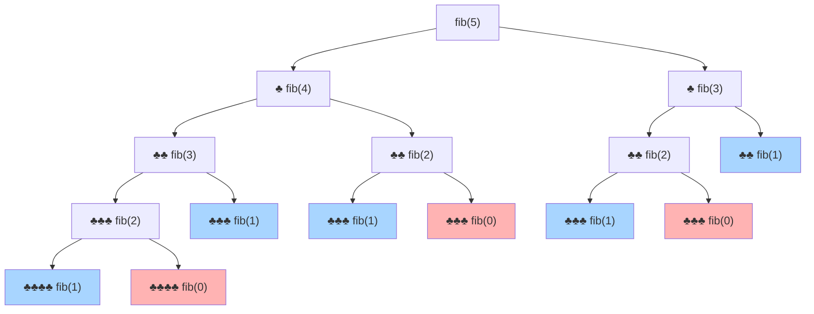
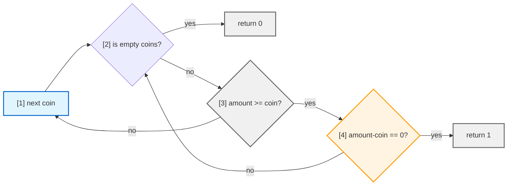
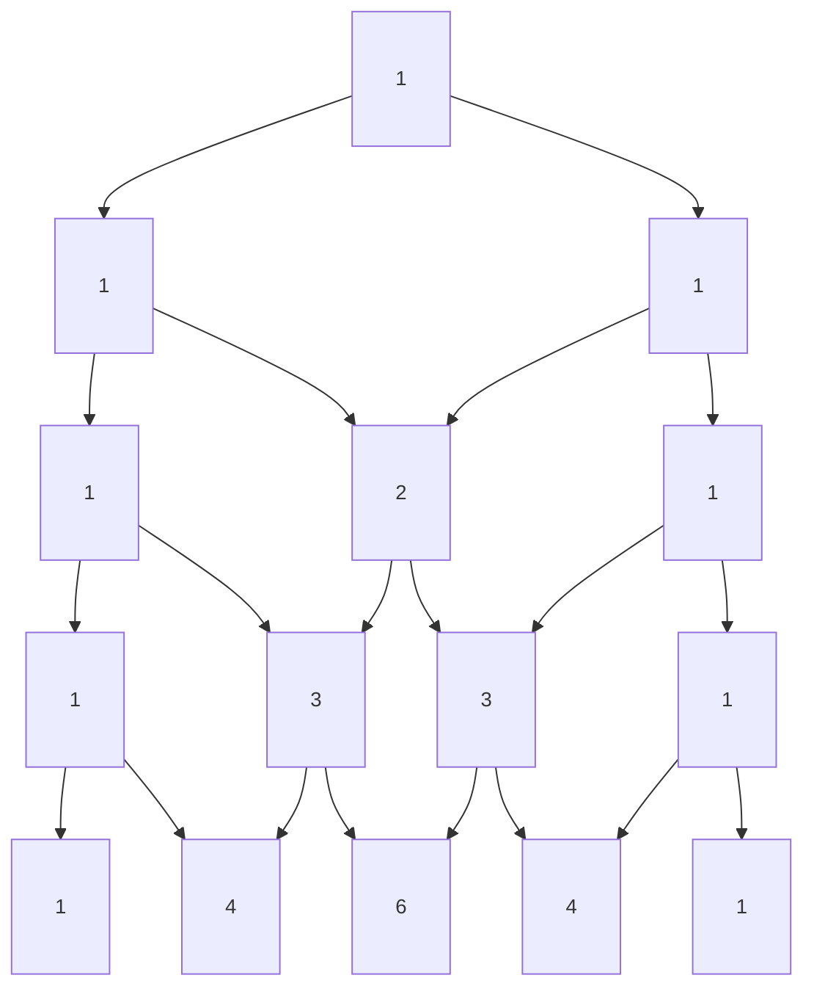
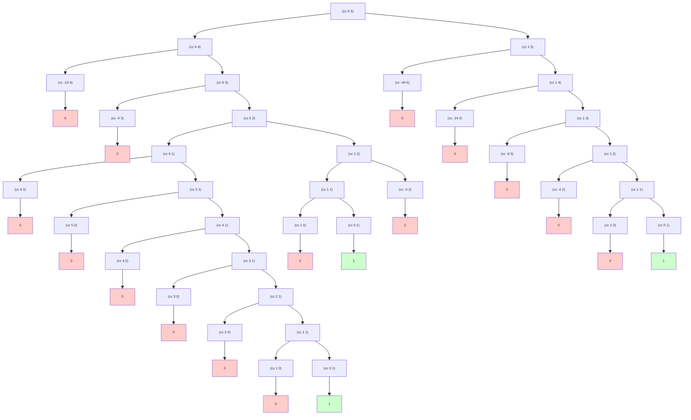

# Глава 1. Построение абстракций с помощью процедур
 
<script>
    (function() {
        const localMap = {
            // JS скрипты
            'https://cdnjs.cloudflare.com/ajax/libs/codemirror/5.43.0/mode/scheme/scheme.min.js': 'sicp/js/scheme.min.js',
            'https://viebel.github.io/klipse/repo/js/biwascheme-0.6.6-min.js': 'sicp/js/biwascheme-0.6.6-min.js',
            
            // CSS
            'https://storage.googleapis.com/app.klipse.tech/css/codemirror.css': 'sicp/css/codemirror.css',
        };
        
        // Перехватываем XMLHttpRequest
        const XHR = XMLHttpRequest;
        const originalOpen = XHR.prototype.open;
        
        XHR.prototype.open = function(method, url, async, user, pass) {
            //console.log('XHR:', url);
            if (localMap[url]) {
                console.log(`Перехват XHR: ${url} → ${localMap[url]}`);
                return originalOpen.call(this, method, localMap[url], async, user, pass);
            }
            return originalOpen.call(this, method, url, async, user, pass);
        };
    
        console.log('Перехватчик установлен');
    })();

    window.klipse_settings = {
        selector_eval_scheme: ".language-scheme", 
        klipse_limit: 5,
    };
 
    // Загружаем Klipse только для этой страницы
    (function() {

        function loadScript(src) {
            return new Promise((resolve, reject) => {
                const script = document.createElement('script');
                script.src = src;
                script.onload = resolve;
                script.onerror = reject;
                document.head.appendChild(script);
            });
        }

        // Загружаем всё локально из папки этой страницы
        window.onload = async function() {
            try {
                await loadScript('sicp/js/klipse_plugin.min.js');
                console.log("Klipse готов");
            } catch(e) {
                console.error("Ошибка загрузки Klipse:", e);
            }
        };
    })();
</script>
<link rel="stylesheet" href="sicp/css/codemirror.css">
<style>
    .klipse-result {
        background: #c4f5d3;
        color: #333;
        border-left: 5px solid #72e98b;
        padding: 5px;
        margin-top: 0px;
        margin-bottom: 20px;
    }
    .CodeMirror-line span[cm-text] {
        display: none !important;
    }
</style>
 
* [1.1. Две модели вычислений](#11-Две-модели-вычислений)
* [1.2. Процедуры и порождаемые ими процессы](#12-Процедуры-и-порождаемые-ими-процессы)
* [1.3. Формулирование абстракций с помощью процедур высших порядков](#13-Формулирование-абстракций-с-помощью-процедур-высших-порядков)


Таким образом, от любого мощного языка программирования требуется способность описывать простые данные и элементарные процедуры (правила обработки данных), а также наличие средств комбинирования и абстракции процедур и данных.


Вычисление комбинаций, примем во внимание, что интерпретатор, вычисляя значение комбинации, тоже следует процедуре:

Чтобы вычислить комбинацию, требуется:
1. Вычислить все подвыражения комбинации. Если это скобки — запускаем все правило целиком с начала.
2. Применить процедуру, которая является значением самого левого подвыражения (оператора) к аргументам — значениям остальных подвыражений (операндов).

```
(* 
    (+ 2 (+ 1 1)) 
    (/ 8 4) 
) 
```

Таким образом, правило вычисления рекурсивно (recursive) по своей природе, это означает, что в качестве одного из своих шагов оно включает применение того же самого правила из п.1.

## 1.1. Две модели вычислений

Суть подстановочной модели: Мы ведем себя так, будто интерпретатор — это просто текстовый редактор «Найти и Заменить». Мы заменяем вызов функции её кодом.  Подстановочная модель — это иллюзия. Она нужна людям, чтобы понимать простые программы. В реальности компьютер так не делает, потому что постоянно копировать и вставлять текст — это дико медленно и жрет память. Подстановочная модель не умеет работать с изменяемым состоянием. 
 
Подстановочная модель (Substitution Model). Мы просто подставляем текст вместо имен.

> [!EXAMPLE]
> Процедура: `(define (square x) (* x x))`
> 
> Вызов `(square (+ 2 3))`

* **Апликативный порядок (applicative-order evaluation)** (Нормальные люди) "вычисление аргументов, затем применение процедуры":
    *  для этого считаем `(+ 2 3)` и подставляем 5 в тело функции: `(* 5 5)`. Получаем 25
* **Нормальный порядок (normal-order evaluation)** (Ленивые люди) "полная подстановка, затем редукция":  
    * не вычисляет аргументы, пока не понадобится их значение
    * сразу подставляем выражение (+ 2 3) в тело: `(* (+ 2 3) (+ 2 3))` 
    * далее считаем первый плюс: `(* 5 (+ 2 3))`
    * далее считаем второй плюс: `(* 5 5)`
    * получаем 25 

<br>
<details>
<summary>Модель применения (Environment Model):</summary>

Модель применения (Environment Model). Как компьютер работает на самом деле.
* Вместо того чтобы заменять текст, интерпретатор заводит таблицу (словарь)
* при вызове `(square 5)` создается стековый кадр (stack frame) в локальном окружении, это таблица, где колонки — это имена формальных параметров, а значения — переданные аргументы 
* Интерпретатор берет тело функции и находит значения для локальных переменных в таблице
* У каждого фрейма есть ссылка на «родительский» фрейм (внешнее окружение). Если переменная не найдена в текущей таблице, интерпретатор идет искать её в родительскую.
* В Environment Model, если мы вернули одну функцию из другой, "кадр" (окружение) не удаляется, потому что на него остается ссылка. Это и есть механизм замыканий (closures).

</details>

#### Поблема нормального порядка

* **Эффективность (Проблема дублирования работы)**.
    В Лиспе используется аппликативный порядок вычислений, отчасти из-за дополнительной эффективности, которую дает возможность не вычислять многократно выражения:

    С аппликативным порядком для процедуры: `(define (square x) (* x x))` при ее вызове `(square (+ 2 3))` мы сперва вычисляем аргумент т.е. `(+ 2 3)=5` и его подставляем в **тело функции**: `(* 5 5)`

    Но при нормальном порядке (ленивом), при вызове `(square (+ 2 3))` мы не вычисляем `(+ 2 3)` для аргумента, а сразу прокидываем его дальше и вычисляем когда это выражение понадобится, в следствии чего мы имеем такое **тело функции**: `(* (+ 2 3) (+ 2 3))` т.е. мы два раза будем вычислять одно и тоже выражение `(+ 2 3)`

* **Проблема с побочными эффектами (изменение переменных или вывод на экран)**.

    Лисп выбирает аппликативный порядок, чтобы программист всегда точно знал: если я передал аргумент в функцию, он вычислится ровно один раз прямо сейчас. Потому что с нормальным порядком вычислений становится очень сложно обращаться, как только мы покидаем область процедур, которые можно смоделировать с помощью подстановки.

    Так как ленивые вычисления вычисляются по месту столько раз сколь они были проброшены, то при налии счетчика внутри такого выражения вся логика ломается.


Иллюстрирация аппликативного порядка вычислений в Rust

```rust
fn foo<T>(mut f1: T, a: i32) -> i32
where
    T: FnMut(i32) -> i32,
{
    f1(a) + f1(a)
}

fn main() {
    let mut acc = 0;

    let mut f = |a| {
        acc += a; // побочный эффект
        acc
    };
    assert_eq!(foo(&mut f, 5), 15);
    assert_eq!(acc, 10);
    
}
```
 
Но операторы `&&` и `||` — это не функции, это специальные конструкции (Control Flow), которые работают по **нормальному порядку**: они не трогают правое выражение, если ответ понятен по левому.

```rust,editable
fn boom() -> bool {
    panic!("Меня вызвали, и я взорвал программу!");
}
fn main() {
    if true || boom() {
        println!("1. Пронесло! boom() не вызвался, так как true уже достаточно.");
    }
  
    if false && boom() {
        // До сюда код не дойдет
    } else {
        println!("2. Снова пронесло! boom() не вызвался, так как false убивает всё условие.");
    }
}

```
 
#### Тест для выявления метода вычисления интерпретатора: аппликативный или нормальный.

Он идеально показывает разницу в том, когда именно интерпретатор вычисляет аргументы.

```
(define (p) (p)) ; это процедура, которая вызывает саму себя

(define (test x y)
  (if (= x 0)
      0
      y))

(test 0 (p))
```

* Аппликативный порядок (как работает большинство языков и Klipse)

    Интерпретатор следует правилу: «Сначала вычисли все аргументы, потом применяй процедуру».
    Но так как процедура `p` вызывает саму себя, то интерпретатор уходит в бесконечный цикл (зависает)
 
* Нормальный порядок (ленивые вычисления)

    Интерпретатор следует правилу: «Не вычисляй, пока не прижмет (полная подстановка)».

    Вызов `(test 0 (p))` сразу подставляется прямо в тело процедуры:
    т.е. x=0 подставляется в if, а `p` вообще и не начиналось вычисляться так как не используется в выражении, результат 0
    ```
    (define (test x y)
        (if (= 0 0)
            0
            y))
    ```

**Варианты scheme с нормальным порядком т.е. ленивые:**

1. Специальные диалекты (Lazy Scheme), прямое расширение языка, которое называется Lazy Racket, в DrRacket, можно просто написать в первой строчке: `#lang lazy`

```
#lang lazy
(define (p) (p))

(define (test x y)
  (if (= x 0)
      0
      y))

(test 0 (p)) ; 0
```

2. Реализация через «Обещания» (Delay/Force)
    * delay: замораживает вычисление (создает "промис").
    * force: размораживает и заставляет вычислить.


```scheme
(define (test x y)
  (if (= x 0)
      0
      (force y))) ; Размораживаем только если x != 0

(test 0 (delay (p))) ; Замораживаем (p)
```

p.s. Haskell - король нормального порядка, он "ленивый" от рождения.

---

### 1.1.6. Условные выражения и предикаты

**Условие**: `(if <проверка> <что_делать_если_правда> <что_делать_если_ложь>)`
```scheme
(+ 10 (if (< 5 2) 6 8))
```

**Список условий**:

```
(cond (<условие_predicate_1> <результат_1>) ; clauses
      (<условие_predicate_2> <результат_2>) ; clauses
      (else <результат_по_умолчанию>)) ; clauses
```

Если ни один из hpi ни окажется истинным, значение условного выражения не определено `#<undef>`.


```scheme
(define (abs x)
  (cond ((> x 0) x)
        ((= x 0) 0)
        ((< x 0) (- x))))

(abs 0.5)        
```        

Вот еще один способ написать процедуру вычисления модуля, особая форма if, **ограниченный вид условного выражения**. Его можно использовать при разборе случаев, когда есть ровно два возможных исхода: 
* `(if (predicate) (следствие) (альтернатива))`
* Если *predicate* дает истинное значение, интерпретатор вычисляет *следствие* и возвращает его значение. 
* В противном случае он вычисляет *альтернативу* и возвращает ее значение

```scheme
(define (abs x)
  (if (< x 0)
      (- x)
      x))

(abs 0.5)
```
Словом предикат называют процедуры, которые возвращают истину или ложь, а также выражения, которые имеют значением истину или ложь.

В дополнение к элементарным предикатам вроде `<, =, >`, существуют операции логической композиции, которые позволяют нам конструировать составные предикаты:
* and - интерпретатор вычисляет выражения по одному, слева направо. Первый false прекращает дальнейшую проверку. (особая форма)
* or - интерпретатор вычисляет выражения по одному, слева направо. Первый true прекращает дальнейшую проверку. (особая форма)
* not - инвертирует выражение, рещультат true если выражение false, и наоборот


#### Упражнение 1.1.

```scheme
(+ 1 (- 4 6)) ; -1 т.е. числа знаковые, signed
```

```scheme
(define a 3)
(define b (+ a 1))

(+ a b (* a b)) ; 19

(* (cond ((> a b) a) ; 16
         ((< a b) b)
         (else -1))
   (+ a 1))
```
#### Упражнение 1.2.
Переведите следующее выражение в префиксную форму:

$\frac {5 + 4 + (2 - (3 - (6 + \frac{4}{5}))) }{3 (6 - 2) (2 - 7)}$

`-37/150 (или примерно -0.24666...)`

```scheme
(/ (+ 4 5 (- 2 (- 3 (+ 6 (/ 4 5))))) (* 3 (- 6 2) (- 2 7)))
```

#### Упражнение 1.3.
Определите процедуру, которая принимает в качестве аргументов три числа и возвращает сумму квадратов ($x^2 + y^2$) двух бо́льших из них.

Прототип:
```rust,editable
fn sum_squares_of_largest(a: i32, b: i32, c: i32) -> i32 {
    if a >= c && b >= c {
        a * a + b * b
    } else if a >= b && c >= b {
        a * a + c * c
    } else {
        b * b + c * c
    }
}
fn main() {
    println!("{}", sum_squares_of_largest(5, 1, 4)); // 5^2 + 4^2 = 41
}
```

```scheme
(define (cond_less a b c)
  (if (< a b) (or (< a c) (= a c)) #f) ; if(a<b){ if(a<c || a==c){true}else{false}}else{false}
)
(define (sum_of_squares a b)
  (+ (* a a) (* b b))
)
(define (my_proc x y z)
  (cond ( (cond_less x y z) (sum_of_squares y z)) ; less x
        ( (cond_less y x z)  (sum_of_squares x z)) ; less y 
        ( (cond_less z x y)  (sum_of_squares x y)) ; less z
        (else (sum_of_squares x y))) ; equivalent numbers
)
(my_proc 5 1 4)
```

#### Упражнение 1.4.

> [!NOTE]
> Оператор в комбинации может быть составным выражением!!!

условное выражение, которое возвращает либо оператор `+`, либо оператор `-`:

```scheme
(define (a-plus-abs-b a b)
  ((if (> b 0) + -) a b)
)
(a-plus-abs-b 5 3) ; b > 0, используется a + b  
```  
 
---

### 1.1.7. Пример: вычисление квадратного корня методом Ньютона

Противопоставление функций и процедур отражает общее различие между описанием свойств объектов и описанием того, как что-то делать, или, как иногда говорят, различие между декларативным знанием и императивным знанием.
В математике нас обычно интересуют декларативные описания (что такое), а в информатике императивные описания (как).

<br>
<details>
<summary>императивное описание (как):</summary>

Существует большое количество исследований, направленных на отыскание методов доказательства того, что программа корректна, и большая часть сложности этого предмета исследования связана с переходом от императивных утверждений (из которых строятся программы) к декларативным (которые можно использовать для рассуждений). 

Связана с этим и такая важная область современных исследований по проектированию языков программирования, как исследование так называемыхязыков сверхвысокого уровня, в которых программирование на самом деле происходит в терминах декларативных утверждений. Идея состоит в том, чтобы сделать интерпретаторы настолько умными, чтобы, получая от программиста знание типа «что такое», они были бы способны самостоятельно породить знание типа «как». В общем случае это сделать невозможно, но есть важные области, где удалось достичь прогресса.

</details>

**Квадратный корень** из числа \(x\) — это такое число \(y\), при умножении которого на само себя получается \(x\):

$y \times y = y^2 = x$

Вавилоняне умели приближенно вычислять квадратные корни еще 4000 лет назад методом, который мы сейчас называем методом Ньютона

Наиболее часто применяется Ньютонов метод последовательных приближений, который основан на том, что имея некоторое неточное значение `y` для квадратного корня из числа `x`, мы можем с помощью простой манипуляции получить более точное значение (более близкое к настоящему квадратному корню), если возьмем среднее между `y` и `x/y`.


Прототип:
```rust,editable
fn sqrt_newton(x: f32) -> f32 {
    let mut y_approximation:f32 = 2_f32;// начальное приближение
    let mut particular:f32;   // частное
    const PRECISION:f32 = 0.001_f32;  // подкоренное число допуска 1e-10
    
    // iteration 1
    particular = x / y_approximation;
    y_approximation = (particular + y_approximation) / 2_f32;  // среднее
    println!("Приближение={:.8} y={:.8}",(y_approximation * y_approximation - x).abs(), y_approximation);
    if  (y_approximation * y_approximation - x).abs() <= PRECISION {
        return y_approximation;
    }
    
    // iteration 2
    particular = x / y_approximation;
    y_approximation = (particular + y_approximation) / 2_f32;  // среднее
    println!("Приближение={:.8} y={:.8}",(y_approximation * y_approximation - x).abs(), y_approximation);
    if  (y_approximation * y_approximation - x).abs() <= PRECISION {
        return y_approximation;
    }
    
    // iteration 3
    particular = x / y_approximation;
    y_approximation = (particular + y_approximation) / 2_f32;  // среднее
    println!("Приближение={:.8} y={:.8}",(y_approximation * y_approximation - x).abs(), y_approximation);
    if  (y_approximation * y_approximation - x).abs() <= PRECISION {
        return y_approximation;
    }
     
    y_approximation
}
fn main() {
    let x = 9.0;
    println!("√{} = {}", x, sqrt_newton(x));
}
```

> Обратите внимание, что мы записываем начальное приближение как 2.0, а не как 2. Интерпретатор MIT Scheme отличает точные целые числа от десятичных значений, и при делении двух целых получается не десятичная дробь, а рациональное число. Например, поделив 10/6, получим 5/3, а поделив 10.0/6.0, получим 1.6666666666666667.

```scheme
(/ 10 6)
;(/ 10.0 6.0)
```


```scheme
(define (square x) (* x x))

(define (sqrt-iter guess x)
    (if (good-enough? guess x)
    guess
    (sqrt-iter (improve guess x) x ))
)
(define (improve guess x)
  (average guess (/ x guess))
)
(define (average x y)
  (/ (+ x y) 2)
)
(define (good-enough? guess x)
  (< (abs (- (square guess) x)) PRECISION)
)
(define PRECISION 0.001)
(define APPROX 2.0 )

(define (sqrt x)
  (sqrt-iter APPROX x))

(sqrt 9)
```

Это показывает, как можно выразить итерацию, не имея никакого специального конструкта в языке, кроме обыкновенной способности вызвать процедуру.
 
#### Упражнение 1.6.

Понимание особой формы, почему `if` должна быть особой формой. «Почему нельзя просто определить ее как обычную процедуру с помощью cond?»

Если использовать `new-if` без побочных эффектов и рекурсивных вызовов, то такой `if` выполняет свою логику:
```scheme
(define (new-if predicate then-clause else-clause)
  (cond (predicate then-clause)
        (else else-clause)))

(new-if #f 5 6) ; 6
(new-if #t 5 6) ; 5
```

Но, на самом деле, так как это простая процедура с *аппликативным порядком*, то все аргументы просчитываются заранее в любом случае, а если у нас имеется рекурсивный вызов, то он зациклиться. Поэтому, нам нужна "особая форма" `if` которая имеет *нормальный порядок* и предотвращает бесконечную рекурсию.

> в Klipse нет ошибки, а в DrRacket - есть.
```scheme
(define (new-if predicate then-clause else-clause)
  (cond (predicate then-clause)
        (else else-clause))
)

;; Программа упадет с ошибкой "division by zero", 
;; хотя условие истинно и мы никогда не должны попасть в ветку с делением на ноль.
(new-if #t 5 (/ 10 0))    
```

#### Упражнение 1.7.

Проверка `good-enough?`, которую мы использовали для вычисления квадратных корней, будет довольно неэффективна для поиска квадратных корней от очень маленьких чисел. Кроме того, в настоящих компьютерах арифметические операции почти всегда вычисляются с ограниченной точностью. Поэтому наш тест оказывается неадекватным и для очень больших чисел.

Для больших чисел:
* Они представляются в формате IEEE 754 и имеют ограниченное количество битов. Чем больше экспонента, тем больше "шаг" между числами
* Шаг между представимыми числами с плавающей точкой может быть больше нашего допуска
```rust,editable
fn main() {
    let mut x = 1e10f32;  // 10 миллиардов
    for _ in 0..5 {
        println!("{:.1?} -> следующее: {:.1?}, шаг: {}", 
                 x, x.next_up(), x.next_up() - x);
        x = x.next_up();
    }
}
```

Для маленьких чисел:
* Наш допуск 0.001 слишком грубый

```scheme
(define (square x) (* x x))

(define (improve guess x)
  (average guess (/ x guess))
)
(define (average x y)
  (/ (+ x y) 2)
)
(define (good-enough? old-guess new-guess)
  (< (abs (- new-guess old-guess)) (* old-guess PRECISION))
)
(define (sqrt-iter guess x)
  (define next-guess (improve guess x))
  (if (good-enough? guess next-guess)
      next-guess
      (sqrt-iter next-guess x))
)
(define PRECISION 0.001)
(define APPROX 2.0 )

(define (sqrt x)
  (sqrt-iter APPROX x))

;; Проверка
(sqrt 9)        ; 3.0
(sqrt 0.0001)   ; 0.01 (старый метод мог дать 0.032...)
(sqrt 1e10)     ; 100000.0 (работает лучше с большими числами)
```

#### Упражнение 1.8.
Реализовать метод Ньютона для кубических корней

Метод Ньютона для кубических корней основан на том, что если y является приближением к кубическому корню из x, то мы можем получить лучшее приближение по формуле

$\frac{x/y^2 + 2y}{3}$

С помощью этой формулы напишите процедуру вычисления кубического корня, подобную процедуре для квадратного корня.

```scheme
(define (square x) (* x x))

(define (improve guess x)
  (/ (+ (/ x (square guess)) (* 2 guess))
     3))  ; (x/guess² + 2*guess)/3

(define (good-enough? old-guess new-guess)
  (< (abs (- new-guess old-guess)) (* old-guess PRECISION))
)
(define (cube-root-iter guess x)  
  (define next-guess (improve guess x))
  (if (good-enough? guess next-guess)
      next-guess
      (cube-root-iter next-guess x))
)    
(define PRECISION 0.001)
(define APPROX 2.0 )

(define (cube-root x)   
  (cube-root-iter APPROX x))

;; Проверка
(cube-root 27)  ; должно дать ~3.0
(cube-root 8)   ; должно дать ~2.0
```

---

### 1.1.8. Процедуры как абстракции типа «черный ящик»

У формального параметра особая роль в определении процедуры: не имеет значения, какое у этого параметра имя. Такое имя называется связанной переменной (**bound variable**), и мы будем говорить, что определение процедуры связывает (**binds**) свои формальные параметры. Значение процедуры не изменяется, если во всем ее определении параметры последовательным образом переименованы. Если переменная не связана, мы говорим, что она свободна (free). Множество выражений, для которых связывание определяет имя, называется областью действия (**scope**) этого имени. В определении процедуры связанные переменные, объявленные как формальные параметры процедуры, имеют своей областью действия тело процедуры.


Проблема здесь состоит в том, что единственная процедура, которая важна для пользователей `sqrt` — это сама `sqrt`. Остальные процедуры (`sqrt-iter`, `good-enough?` и `improve`) только забивают им головы. Теперь пользователи не могут определять других процедур с именем `good-enough?` ни в какой другой программе, которая должна работать совместно с программой вычисления квадратного корня, поскольку `sqrt` требуется это имя.

Нам хотелось бы локализовать подпроцедуры, спрятав их внутри `sqrt`, так, чтобы `sqrt` могла сосуществовать с другими последовательными приближениями, при том что у каждой из них была бы своя собственная процедура `good-enough?`.

Чтобы сделать это возможным, мы разрешаем процедуре иметь внутренние определения, локальные для этой процедуры.

**Блочная структура (block structure)**, дает правильное решение для простейшей задачи упаковки имен.

Просто все процедуры переместим внутрь тела sqrt:


```scheme
(define (square x) (* x x)) ; внешняя процедура
(define PRECISION 0.001) ; константа
(define APPROX 2.0 ) ; константа
;; ###########################################
(define (sqrt x) ; start sqrt  
    (define (average x y)
        (/ (+ x y) 2)
    )
    (define (improve guess x)
        (average guess (/ x guess))
    )
    (define (good-enough? old-guess new-guess)
        (< (abs (- new-guess old-guess)) (* old-guess PRECISION))
    )
    (define (sqrt-iter guess x)
        (define next-guess (improve guess x))
        (if (good-enough? guess next-guess)
            next-guess
            (sqrt-iter next-guess x)))
  (sqrt-iter APPROX x) ; первый вызов
) ; end sqrt  
;; ###########################################
;; Проверка
(sqrt 27)      
```

Помимо того, что мы можем вложить определения вспомогательных процедур внутрь главной, мы можем их упростить. Поскольку переменная `x` связана в определении `sqrt`, процедуры `good-enough?`, `improve` и `sqrt-iter`, которые определены внутри `sqrt`, находятся в области действия `x`. Таким образом, нет нужды явно передавать `x` в каждую из этих процедур.

Тогда `x` получит свое значение от аргумента, с которым вызвана объемлющая их процедура `sqrt`. Такой порядок называется **лексической сферой действия (lexical scoping) переменных**.


```scheme
(define (square x) (* x x)) ; внешняя процедура
(define PRECISION 0.001) ; константа
(define APPROX 2.0 ) ; константа
;; ###########################################
(define (sqrt x) ; start sqrt 
    (define (average x y)
        (/ (+ x y) 2)
    )
    (define (improve guess)
        (average guess (/ x guess))
    )
    (define (good-enough? old-guess new-guess)
        (< (abs (- new-guess old-guess)) (* old-guess PRECISION)))

    (define (sqrt-iter guess)
        (define next-guess (improve guess))
            (if (good-enough? guess next-guess)
                next-guess
                (sqrt-iter next-guess x)))
  (sqrt-iter APPROX) ; первый вызов
) ; end sqrt  
;; ###########################################
;; Проверка
(sqrt 27)      
```

---

## 1.2. Процедуры и порождаемые ими процессы

Чтобы стать специалистами, нам надо научиться представлять процессы, генерируемые различными типами процедур. Только развив в себе такую способность, мы сможем научиться надежно строить программы, которые ведут себя так, как нам надо.

Процедура представляет собой шаблон локальной эволюции (local evolution) вычислительного процесса. Она указывает, как следующая стадия процесса строится из предыдущей. Нам хотелось бы уметь строить утверждения об общем, или глобальном (global) поведении процесса, локальная эволюция которого описана процедурой. В общем случае это сделать очень сложно, но по крайней мере мы можем попытаться описать некоторые типичные схемы эволюции процессов.

В этом разделе мы рассмотрим некоторые часто встречающиеся «формы» процессов, генерируемых простыми процедурами. Кроме того, мы рассмотрим, насколько сильно эти процессы расходуют такие важные вычислительные ресурсы, как время и память.
 
---

### 1.2.1. Линейные рекурсия и итерация

Существует множество способов вычислять факториалы. 

Сравним два процесса вычисления факториала. С одной стороны, они кажутся почти одинаковыми. С другой стороны, когда мы рассмотрим «формы» этих двух процессов, мы увидим, что они ведут себя совершенно по-разному.

Один из них состоит в том, что-бы заметить, что n! для любого положительного целого числа `n` равен `n`, умноженному на `(n − 1)!`

**Линейно рекурсивный процесс** (linear recursive process):

Выполнение этого процесса требует, чтобы интерпретатор запоминал (и заполнял стек фреймами), какие операции ему нужно выполнить впоследствии. При вычислении `n!` длина цепочки отложенных умножений, а следовательно, и объем информации, который требуется, чтобы ее сохранить, растет линейно с ростом `n` (пропорционален `n`), как и число шагов.

```rust,editable
fn factorial_recursive(n: i32) -> i32 {
    if n == 1 { print!("{n}"); 1 }
    else {
        print!("{n} * ");
        n * factorial_recursive(n-1)
    }
}
fn main() {
    let mut n = 5; // 5! = 5 * 4 * 3 * 2 * 1 = 120
    n = n * (n - 1) * (n - 2) * (n - 3) * (n - 4);
    println!("5! = {n}");
    
    println!(" = {}",factorial_recursive(5));
}
```

```scheme
;; Линейно рекурсивный процесс
(define (factorial n)
  (if (= n 1)
      1
      (* n (factorial (- n 1))))
)

(factorial 5)
```

**Линейно итеративный процесс** (iterative process) т.е. хвостовая рекурсия (tail recursion):

Каждый рекурсивный вызов является последней операцией функции и является завершенным т.е. не создает дополнительной работы после себя.

Суть итеративного процесса: Не накапливать отложенную работу — значит состояние полностью описывается переменными, а не стеком вызовов:
* Все состояние передается через параметры
* Нет операций после возврата из рекурсии

<br>
<details>
<summary>Отличие от обычной рекурсии в том - что именно сохраняется в stack frame и зачем:</summary>
  
В хвостовой рекурсии тоже происходит накопление stack frame, но не потому что данные нужны для расчета после возврата, stack frame сохраняется просто из-за соглашения ABI языка, по сути stack frame лишний, так как все необходимые данные вычисляются до рекурсивного вызова и все состояние передается в аргументах функции.

**Нет работы после вызова и, следовательно, не нужно использовать данные из stack frame после!**

Tail Call Optimization (TCO) (в Haskell, Scala, Scheme) - это оптимизация управления потоком.

Хвостовая рекурсия дает почву для оптимизации, если функция не собирается возвращаться в текущий frame,
то незачем и сохранять return address и стек.

Оптимизация заключается в том, что `tail call` заменяется на переход (`jmp`) вместо `call + ret`.

В результате компилятор может выполнить код с постоянной глубиной стека: новые stack frame не создаются, а всё состояние передаётся через аргументы.

TCO позволяет использовать рекурсию без stack overflow.

Почему в Rust нет TCO:

TCO требует уничтожить stack frame раньше, чем Rust разрешает вызывать Drop.
* есть деструктор Drop
* есть RAII
* есть гарантированная очередность освобождения

</details>

```rust,editable
fn factorial_iterative(n: i32) -> i32{
    fn fact_iter(product: i32, counter: i32, max_count: i32) -> i32{
        if counter > max_count {
            product
        }else{
            println!("fact-iter {} {} {max_count}", counter*product, counter+1);
            fact_iter(counter*product, counter+1, max_count)
        }
    }
    fact_iter(1, 1, n)
}

fn main() {
    println!("5! = {}",factorial_iterative(5));
}
```

Стандарт Common Lisp не требует Tail Call Optimization (TCO), но в Scheme, TCO обязательна по стандарту языка.

ABI языка scheme не накапливает адреса возврата в стеке. На каждом шаге при любом значении `n` необходимо помнить лишь текущие значения переменных product, counter и max-count.
 

```scheme
;; Линейно итеративный процесс
(define (factorial n)
    (define (fact-iter product counter max-count)
        (if (> counter max-count)
            product
            (fact-iter (* counter product) (+ counter 1) max-count)
        )
    )
    (fact-iter 1 1 n)
)

(factorial 5)
```

В итеративном случае в каждый момент переменные программы дают полное описание состояния процесса. Если мы остановим процесс между шагами, для продолжения вычислений нам будет достаточно дать интерпретатору значения трех переменных программы. С рекурсивным процессом это не так. В этом случае имеется дополнительная «спрятанная» информация, которую хранит интерпретатор и которая не содержится в переменных программы, а во фремах стека.

Противопоставляя итерацию и рекурсию, нужно вести себя осторожно и не смешивать понятие рекурсивного процесса с понятием рекурсивной процедуры. Когда мы говорим, что процедура рекурсивна, мы имеем в виду факт синтаксиса: определение процедуры ссылается (прямо или косвенно) на саму эту процедуру. Когда же мы говорим о процессе, что он следует, скажем, линейно рекурсивной схеме, мы говорим о развитии процесса, а не о синтаксисе, с помощью которого написана процедура. Может показаться странным, например, высказывание «рекурсивная процедура fact-iter описывает итеративный процесс». Однако процесс действительно является итеративным: его состояние полностью описывается тремя переменными состояния, и чтобы выполнить этот процесс, интерпретатор должен хранить значение только трех переменных. Различие между процессами и процедурами может запутывать отчасти потому, что большинство реализаций обычных языков (включая Аду, Паскаль и Си) построены так, что интерпретация любой рекурсивной процедуры поглощает объем памяти, линейно растущий пропорционально количеству вызовов процедуры, даже если описываемый ею процесс в принципе итеративен. Как следствие, эти языки способны описывать итеративные процессы только с помощью специальных«циклических конструкций» вроде `do, repeat, until, for и while`.

#### Упражнение 1.9.

Каждая из следующих двух процедур определяет способ сложения двух положительных целых чисел с помощью процедур inc, которая добавляет к своему аргументу 1, и dec, которая отнимает от своего аргумента 1.

Используя подстановочную модель, проиллюстрируйте процесс, порождаемый каждой из этих процедур, вычислив `(+ 4 5)`. Являются ли эти процессы итеративными или рекурсивными?

**first procedure**

```scheme
(define (inc x)
  (+ x 1)
)
(define (dec x)
  (- x 1)
)
;; first procedure
(define (add a b)
    (if (= a 0)
      b
      (inc (add (dec a) b))
    )
)

(add 4 5)
```
 
```
Так выглядит процесс накопления кадров в стеке с дополнительной работой после вызова

(add 4 5)
→ (inc (add 3 5))
→ (inc (inc (add 2 5)))
→ (inc (inc (inc (add 1 5))))
→ (inc (inc (inc (inc (add 0 5)))))
→ (inc (inc (inc (inc 5))))
→ (inc (inc (inc 6)))
→ (inc (inc 7))
→ (inc 8)
→ 9

Это рекурсивный процесс, он накопливает необходиму работу после своего рекрсивного вызова, 
тем что нужно еще выполнить inc

Состояние хранится в stack frame

Когда доходим до базового случая 5, стек содержит 4 кадра, которые будут разворачиваться 
в обратном порядке, применяя inc к результату.

Память: O(n) — растет пропорционально a
```

Прототип:
```rust,editable
fn inc(x: i32) -> i32 { x + 1 }
fn dec(x: i32) -> i32 { x - 1 }

fn add(a: i32, b: i32) -> i32 {
    if a == 0 {
        b
    } else {
        println!("PUSH (inc (+ {} {b})) т.е. запомнить после выполнить inc {}", dec(a), dec(a)+b);
        inc(add(dec(a), b))
    }
}
fn main() {
    println!("result = {}", add(4, 5));  
}
```

**second procedure**

```scheme
(define (inc x)
  (+ x 1)
)
(define (dec x)
  (- x 1)
)
;; second procedure
(define (add a b)
    (if (= a 0)
      b
      (add (dec a) (inc b))
    )
)

(add 4 5)
```   


```
Так выглядит процесс накопления кадров в стеке без доп. работы после

(+ 4 5)
→ (+ 3 6)
→ (+ 2 7)
→ (+ 1 8)
→ (+ 0 9)
→ 9

Это итеративный процесс накапливает только адрес возврата, без отложенной работы 
    после вызова рекурсивного вызова

Состояние полностью хранится в параметрах (a и b)
```

Прототип:
```rust,editable
fn inc(x: i32) -> i32 { x + 1 }
fn dec(x: i32) -> i32 { x - 1 }

fn add(a: i32, b: i32) -> i32 {
    if a == 0 {
        b
    } else {
        println!("PUSH (+ {} {}) т.е. {}",dec(a), inc(b), dec(a)+inc(b));
        add(dec(a), inc(b))  // хвостовой вызов!
    }
}
fn main() {
    println!("result = {}", add(4, 5));  
}
```
 

#### Упражнение 1.10.
Следующая процедура вычисляет математическую функцию, называемую функцией Аккермана.

```scheme
(define (A x y)
  (cond ((= y 0) 0)
        ((= x 0) (* 2 y))
        ((= y 1) 2)
        (else (A (- x 1) (A x (- y 1))
              )
        )
   )
)
(A 1 3) ; 2*2*2=8
(A 1 4) ; 2*2*2*2=16
(A 1 5) ; 2*2*2*2*2=32
(A 1 10) ; 2^10=1024
(A 0 4) ; f(n) = 2n
(A 1 10) ; g(n) = 2^n
;; 2 ↑↑ n (экспоненциальная башня степеней h(n) = 2^(2^(2^...)) с n двойками)
; (A 2 5) → (A 1 65536) = 2⁶⁵⁵³⁶
 
```

Функция Аккермана — это классический пример глубоко рекурсивной функции.

Текущая реализация растет невероятно быстро.

Для чего нужна:
* Демонстрирует, что рекурсия может выражать функции, которые нельзя выразить простыми циклами
* Показывает границы вычислимости
* Используется в теории алгоритмов для тестирования оптимизаций компиляторов

Прототип:
```rust,editable
fn ackermann(deep: usize, x: i32, y: i32) -> i32 {
    println!("{}(A {} {})","♣".repeat(deep), x,  y );
    if y == 0 {
        0
    } else if x == 0 {
        2 * y
    } else if y == 1 {
        2
    } else {
        ackermann(deep+1, x - 1, ackermann(deep+1, x, y - 1))
    }
}
fn main() {
    println!("{}", ackermann(0, 1, 10)); 
    println!("----------------------"); 
    println!("{}", ackermann(0, 2, 4)); 
}
```

---

### 1.2.2. Древовидная рекурсия (tree recursion)

В качестве примера рассмотрим вычисление последовательности чисел Фибоначчи, в которой каждое число является суммой двух предыдущих `0, 1, 1, 2, 3, 5, 8, 13, 21, . . .`
 
```scheme
(define (fib n)
  (cond ((= n 0) 0)
        ((= n 1) 1)
        (else (+ (fib (- n 1))
                 (fib (- n 2))))
  )
)

(fib 5)
```

Заметьте, что на каждом уровне (кроме дна) ветви разделяются надвое, это отражает тот факт, что процедура `fib` при каждом вызове обращается к самой себе дважды.

Текущая реализация имеет экспоненциальную сложность `O(2ⁿ)`

Прототип:
```rust,editable
fn fib(deep: usize, n: u32) -> u32 {
    println!("{} fib({})","♣".repeat(deep), n );
    match n {
        0 => 0,
        1 => 1,
        _ => fib(deep+1, n - 1) + fib(deep+1, n - 2)
    }
}

fn main() {
    println!("{}", fib(0, 5));
}
```



Все вычисление (fib 3) — почти половина общей работы, — повторяется дважды. В сущности, нетрудно показать, что общее число раз, которые эта процедура вызовет `(fib 1)` или `(fib 0)` (в общем, число листьев) в точности равняется `Fib(n+1)`. Чтобы понять, насколько это плохо, отметим, что значение `Fib(n)` растет экспоненциально при увеличении `n`.

С другой стороны, требования к памяти растут при увеличении аргументавсего лишь линейно, поскольку в каждой точке вычисления нам требуется запоминать только те вершины, которые находятся выше нас по дереву. В общем случае число шагов, требуемых древовидно-рекурсивным процессом, будет пропорционально числу вершин дерева, а требуемый объем памяти будет пропорционален максимальной глубине дерева.

Для получения чисел Фибоначчи мы можем сформулировать итеративный процесс. Идея состоит в том, чтобы использовать пару целых `a` и `b`, которым в начале даются значения `Fib(1) = 1` и `Fib(0) = 0`, и на каждом шаге применять одновременную транс-
формацию `a← a+b` и `b←a`

Каждый шаг использует два предыдущих, которые уже есть в переменных. Ничего не пересчитывается заново.

Пара (a, b) хранит два последних числа Фибоначчи:
* Каждое число вычисляется один раз
* Количество шагов = O(n) — линейно
* Начальные значения: a = Fib(1) = 1, b = Fib(0) = 0
* На каждом шаге: (a, b) ← (a + b, a)
* Через n шагов b становится Fib(n)

Второй метод вычисления чисел Фибоначчи представляет собой линейную итерацию c порядком роста времени: $\Theta(n)$. 

Разница в числе шагов по сравнению с первым вариантом (экспоненциальной реализацей) огромна, даже для небольших значений аргумента.

```scheme
(define (fib n)
  (fib-iter 1 0 n)
)
(define (fib-iter a b count)
  (if (= count 0)
      b
      (fib-iter (+ a b) a (- count 1)))
)

(fib 5)
```

Прототип:
```rust,editable
fn fib(n: u32) -> u32 {
    fn fib_iter(deep: usize, a: u32, b: u32, count: u32) -> u32 {
        println!("{}a={a} b={b} count={count}","♣".repeat(deep));
        if count == 0 {
            b
        } else {
            fib_iter(deep+1, a + b, a, count - 1)
        }
    }
    
    fib_iter(0, 1, 0, n)
}
 
fn main() {
    println!("{}", fib(5));
}
```

### [Размен денег](https://wiki.c2.com/?SicpIterationExercise)

Сколькими способами можно разменять сумму в 100¢ (1 доллар), если имеются монеты по 50¢, 25¢, 10¢, 5¢, 1¢ цент?
* 50¢ + 50¢
* 50¢ + 25¢ + 25¢
* 10¢ + 10¢ + 10¢ + 10¢ + 10¢ + 10¢ + 10¢ + 10¢ + 10¢ + 10¢
* ...

Древовидная рекурсия здесь работает как полный перебор всех комбинаций. Каждый путь от корня до листа = один конкретный способ размена. Древовидная структура здесь не баг, а фича — она просто перебирает все варианты, и каждый валидный путь добавляет +1 к результату.

Рекурсивное решение, разбиваем все способы на две группы:
* Способы, которые не используют самую крупную монету (50¢)
    * размениваем 100¢ монетами 25,10,5,1
* Способы, которые используют хотя бы одну 50¢
    * берем одну 50¢, осталось 50¢, которые размениваем всеми монетами (включая 50¢)




`1$ = 292 способа`

Прототип:
```rust,editable
#[derive(Debug, Clone, Copy)]
enum Coin {
    C1 = 1,
    C5 = 5,
    C10 = 10,
    C25 = 25,
    C50 = 50,
}

const COINS: [Coin; 5] = [Coin::C50, Coin::C25, Coin::C10, Coin::C5, Coin::C1];

fn count_change(count:&mut Vec<i32>, amount: u32) -> u32 {
    cc(0,count, amount, &COINS)
}

fn cc(deep:usize, count:&mut Vec<i32>, amount: u32, coins: &[Coin]) -> u32 {
    count.push(1);

    if amount == 0 {
        println!("+1 способ!\n");
        return 1;
    }
    if coins.is_empty() {
        return 0;
    }
    
    let first_coin = coins[0] as u32;
    
    // Проверяем, можно ли вычесть монету
    let with_first = if amount >= first_coin {
        println!("{} amount={amount} coins={:?}","♣".repeat(deep), coins);
        println!("{} >>>вычитаем монету {first_coin}<<<\n","♣".repeat(deep));
        cc(deep+1,count, amount - first_coin, coins)
    } else {
        // пропускаем монету
        println!("{} ---пропускаем монету {first_coin}---","♣".repeat(deep));
        0
    };
    
    cc(deep+1,count, amount, &coins[1..]) + with_first
}

fn main() {
    let mut count = vec![];
    println!("Количество способов: {} \ncount call: {}", count_change(&mut count, 6),count.len());  
}
```

```scheme
(define (count-change amount)
  (cc amount 5))

(define (cc amount kinds-of-coins)
  (cond ((= amount 0) 1)
        ((or (< amount 0) (= kinds-of-coins 0)) 0)
        (else (+ (cc amount
                     (- kinds-of-coins 1))
                 (cc (- amount
                        (first-denomination kinds-of-coins))
                     kinds-of-coins)))))

(define (first-denomination kinds-of-coins)
  (cond ((= kinds-of-coins 1) 1)
        ((= kinds-of-coins 2) 5)
        ((= kinds-of-coins 3) 10)
        ((= kinds-of-coins 4) 25)
        ((= kinds-of-coins 5) 50))) 

(count-change 100)
```

<br>
<details>
<summary>Улучшение. Динамическое программирование или мемоизация:</summary>

Улучшить можно, если запоминать уже посчитанные пары (сумма, количество монет) — это называется **динамическое программирование или мемоизация**:
* Хранилище для пар (amount, kinds) → результат
* Проверка перед вычислением
* Сохранение после вычисления

Прототип:
```rust,editable
use std::collections::HashMap;

#[derive(Debug, Clone, Copy, PartialEq, Eq, Hash)]
enum Coin {
    C1 = 1,
    C5 = 5,
    C10 = 10,
    C25 = 25,
    C50 = 50,
}

const COINS: [Coin; 5] = [Coin::C50, Coin::C25, Coin::C10, Coin::C5, Coin::C1];

fn count_change(amount: u32) -> u32 {
    let mut memo = HashMap::new();
    cc(amount, &COINS, &mut memo)
}

fn cc(amount: u32, coins: &[Coin], memo: &mut HashMap<(u32, usize), u32>) -> u32 {
    if amount == 0 {
        return 1;
    }
    if coins.is_empty() {
        return 0;
    }
    
    let key = (amount, coins.len());
    if let Some(&result) = memo.get(&key) {
        return result;
    }
    
    let first_coin = coins[0] as u32;
    
    let without_first = cc(amount, &coins[1..], memo);
    
    let with_first = if amount >= first_coin {
        cc(amount - first_coin, coins, memo)
    } else {
        0
    };
    
    let result = without_first + with_first;
    memo.insert(key, result);
    result
}

fn main() {
    println!("{}", count_change(100)); // 292
}
```


```scheme
(define memo '())

(define (count-change amount)
  (cc amount 5))

(define (get-memo amount kinds)
  (let ((pair (assoc (cons amount kinds) memo)))
    (if pair (cdr pair) #f)))

(define (set-memo amount kinds value)
  (set! memo (cons (cons (cons amount kinds) value) memo))
  value)

(define (cc amount kinds-of-coins)
  (let ((cached (get-memo amount kinds-of-coins)))
    (if cached
        cached
        (let ((result 
                (cond ((= amount 0) 1)
                      ((or (< amount 0) (= kinds-of-coins 0)) 0)
                      (else (+ (cc amount (- kinds-of-coins 1))
                              (cc (- amount (first-denomination kinds-of-coins)) 
                                  kinds-of-coins))))))
          (set-memo amount kinds-of-coins result)))))

(define (first-denomination kinds-of-coins)
  (cond ((= kinds-of-coins 1) 1)
        ((= kinds-of-coins 2) 5)
        ((= kinds-of-coins 3) 10)
        ((= kinds-of-coins 4) 25)
        ((= kinds-of-coins 5) 50)))

(count-change 100)
```

</details>

Наблюдение, что древовидная рекурсия может быть весьма неэффективна, но зато ее часто легко сформулировать и понять, привело исследователей к мысли, что можно получить лучшее из двух миров, если спроектировать «умный компилятор», который мог бы трансформировать древовидно-рекурсивные процедуры в более эффективные, но вычисляющие тот же результат.

#### Упражнение 1.11.

Функция `f` определяется правилом: `f (n) = n, если n < 3, и f (n) = f (n − 1) + f (n − 2) + f (n − 3), если n ≥ 3`. 

Последовательность трибоначчи: 0, 1, 2, 3, 6, 11, 20, 37, 68, 125, 230, ...

* Напишите процедуру, вычисляющую `f(n)` с помощью рекурсивного процесса (recursive process) (экспоненциальный рост). 

    Прототип:
    ```rust,editable
    fn f(n: u32) -> u32 {
        if n < 3 {
            n
        } else {
            f(n - 1) + f(n - 2) + f(n - 3)
        }
    }

    fn main() {
        println!("{}",f(7));
    }
    ```

    ```scheme
    (define (f n)
        (if (< n 3) 
            n
            (+ (f (- n 1)) (f (- n 2)) (f (- n 3)))
        )
    )
    (f 7)
    ```
    

* Напишите процедуру, вычисляющую `f(n)` с помощью итеративного процесса (iterative process) (линейный рост).

    Суть итеративного процесса: Не накапливать отложенную работу — значит состояние полностью описывается переменными, а не стеком вызовов:
    * Все состояние передается через параметры
    * Нет операций после возврата из рекурсии

    Прототип:
    ```rust,editable
    fn f(n: i32) -> i32 {
        fn iter(acc:i32, b:i32, c:i32, count:i32) -> i32{
            print!("{acc} ");
            if count == 0{
                return acc;
            }
            iter(acc+b+c, acc, b, count-1)
        }
        if n < 3 {
            n
        } else {
            print!("sequence: 0 1 ");
            iter(2, 1, 0, n-2)
        }
    }
    
    fn main() {
        println!("\nTribonacci: {}",f(5));
    }
    ```

    ```scheme
    (define (f n)
    (define (f-iter acc b c count)
        (if (= count 0)
            acc
            (f-iter (+ acc b c) acc b (- count 1))))
        (if (< n 3) n (f-iter 2 1 0 (- n 2)))
    )
    (f 7)
    ```
 

#### Упражнение 1.12.
Приведенная ниже таблица называется треугольником Паскаля (`Pascal’s triangle`)



Все числа по краям треугольника равны 1, а каждое число внутри треугольника равно сумме двух чисел над ним. Напишите процедуру, вычисляющую элементы треугольника Паскаля с помощью рекурсивного процесса.

```rust,editable
fn pascal(n: u32, k: u32) -> u32 {
    if k == 0 || k == n {
        1
    } else {
        pascal(n - 1, k - 1) + pascal(n - 1, k)
    }
}

fn main() {
    let rows = 5;
    for n in 0..rows {
        print!("{}", "  ".repeat((rows - n - 1) as usize));
        
        for k in 0..=n {
            print!("{:4}", pascal(n, k));
        }
        println!();
    }
}
```

```scheme
(define (pascal n k)
  (if (or (= k 0) (= k n))
      1
      (+ (pascal (- n 1) (- k 1))
         (pascal (- n 1) k))))

(define (print-pascal-triangle rows)
  (define (print-row n)
    (define (iter k)
      (display (pascal n k))
      (display " ")
      (if (< k n)
          (iter (+ k 1))
          (newline)))
    (iter 0))

  (define (loop n)
    (if (< n rows)
        (begin
          (print-row n)
          (loop (+ n 1)))
        'done))  
  (loop 0))

(print-pascal-triangle 5)
```

#### Упражнение 1.13.

Последовательности чисел Фибоначчи: 0, 1, 1, 2, 3, 5, 8, 13, 21, . . .

Докажите, что Fib(n) есть целое число, ближайшее к `φⁿ/√5`, где `φ=(1+√5)/2` 

Указание: пусть `ψ = (1 − √5)/2`

С помощью определения чисел Фибоначчи и индукции докажите, что `Fib(n)=(φⁿ − ψⁿ)/√5`

* n = 0: (φ⁰ − ψ⁰)/√5 = (1 − 1)/√5 = 0 = Fib(0)
* n = 1: (φ¹ − ψ¹)/√5 = (φ − ψ)/√5 = ( ((1+√5)/2)^1 − ((1−√5)/2)^1 )/√5 = (√5)/√5 = 1 = Fib(1)

Индукционный шаг для n+1:
```
Fib(n+1) = Fib(n) + Fib(n−1) => Fib(2) = Fib(1) + Fib(0) => 1 = 1 + 0

Fib(n+1) = (φⁿ - ψⁿ)/√5 + (φⁿ⁻¹ - ψⁿ⁻¹)/√5
         = (φⁿ + φⁿ⁻¹ - ψⁿ - ψⁿ⁻¹)/√5
         = (φⁿ⁻¹(φ + 1) - ψⁿ⁻¹(ψ + 1))/√5

Но φ + 1 = φ² (потому что φ² = φ + 1)

И ψ + 1 = ψ² (потому что ψ² = ψ + 1)

Fib(n+1) = (φⁿ⁻¹·φ² - ψⁿ⁻¹·ψ²)/√5 = (φⁿ⁺¹ - ψⁿ⁺¹)/√5
```

Если работает для двух подряд идущих чисел, то работает и для следующего, значит работает для всех чисел.

```
Fib(2) => 1 + 0 = 1
Fib(3) => 1 + 1 = 2
Fib(4) => 2 + 1 = 3
Fib(5) => 3 + 2 = 5
Fib(6) => 5 + 3 = 8
...
```


Почему Fib(n) — ближайшее целое к φⁿ/√5?
```
Так как |ψ| < 1, то |ψⁿ| < 1 для всех n ≥ 0.

По формуле: Fib(n) = φⁿ/√5 − ψⁿ/√5

Поскольку |ψⁿ/√5| < 1/√5 < 1/2, то разница между φⁿ/√5 и Fib(n) меньше 0.5.

Следовательно, Fib(n) — ближайшее целое число к φⁿ/√5.
```

---

### 1.2.3. Порядки роста (order of growth)

Процессы могут значительно различаться по количеству вычислительных ресурсов, которые они потребляют.  Порядок роста дает общую оценку ресурсов, необходимых процессу при увеличении его входных данных.

`R(n)` — количество ресурсов (количество исполняемых элементарных машинных операций), необходимых процессу для решения задачи размера `n`.

В компьютерах, которые выполняют определенное число операций за данный отрезок времени, требуемое время будет пропорционально необходимому числу элементарных машинных операций. Порядки роста дают всего лишь грубое описание поведения процесса.

*В этих утверждениях скрывается важное упрощение. Например, если мы считаем шаги процесса как «машинные операции», мы предполагаем, что число машинных операций, нужных, скажем, для вычисления произведения, не зависит от размера умножаемых чисел, а это становится неверным при достаточно больших числах. Те же замечания относятся и к оценке требуемой памяти.*

В какой роли может выступать абстракция `n`:
* `n` может быть числом цифр после запятой, если требуется вычислить приближение к квадратному корню числа
* `n` может быть количеством рядов в матрицах, в задаче умножения матриц

`R(n)` имеет порядок роста `Θ(f(n))` => `R(n) = Θ(f(n))`, если существуют положительные постоянные `k1` и `k2` , независимые от `n`, такие, что `k1 * f(n) ≤ R(n) ≤ k2 * f(n)` для всякого достаточно большого `n`.

**Например, замеры нашей программы, при разных n:**
* (1) n=1600 → время=1 секунда
* (2) n=2200 → время=2 секунды
* (3) n=2500 → время=3 секунды
* (4) n=3000 → время=5 секунд

Какой порядок роста для этих замеров?

Нам нужно найти "константу" - такой коэффициент `C`, который по мере увеличения `n` не имеет тренд увеличения, а всегда остается в пределах одного диапазона. Если наблюдается стабильная динамика его роста, значит мы не верно предположили формулу роста.

* Проверим `R(n) = Θ(n²)?` квадратичный рост: `k1 * n² ≤ t ≤ k2 * n²?`
    * `t = (какой-то коэффициент C) × n²` тогда `C=t/n²`
        * k1 это самый маленький коэффициент C, среди замеров
        * k2 это самым большой коэффициент C, среди замеров
    * проверка предположения роста:    
        * (1) C=1/1600²=0.00000039 => k1 минимальное значение
        * (2) C=2/2200²=0.00000042 => коэффициент снова увеличился !
        * (3) C=3/2500²=0.00000048 => коэффициент снова увеличился !!
        * (4) C=5/3000²=0.00000056 => это не k2, коэффициент снова увеличился !!!
        * Итог: коэффициент имеет тренд увеличения, порядок `Θ(n²)` не подходит
* Проверим `R(n) = Θ(n³)?` кубический рост: `k1 * n³ ≤ t ≤ k2 * n³?`
    * `t = (какой-то коэффициент C) × n³` тогда `C=t/n³`
    * проверка предположения роста: 
        * (1) C=1/1600³=0.00000000024 => k2 максимальный C
        * (2) C=2/2200³=0.00000000018 => k1 минимальный C
        * (3) C=3/2500³=0.00000000019 => роста нет, стабильный C
        * (4) C=5/3000³=0.00000000018 => роста нет, стабильный C
        * Итог: 
            * коэффициент `C` стабилен, все расчеты в пределах предположения: 
                * `k1 * n³ ≤ t ≤ k2 * n³` 
                * `0.00000000018 * n³ ≤ t ≤ 0.00000000024 * n³`
            * замеры соответсвуют кубическому порядку


#### Упражнение 1.14.

Нарисуйте дерево, иллюстрирующее процесс, который порождается процедурой count-change из
раздела 1.2.2 при размене 11 центов. Каковы порядки роста памяти и числа шагов, используемых
этим процессом при увеличении суммы, которую требуется разменять?
 
Описание дерева:
* дерево начинается с корня `(cc 11 5)` (5 типов монет) 
* Каждый узел `(cc amount k)` порождает два дочерних:
    * Левый: `(cc amount k-1)` — это ветка, где мы отказываемся от использования монет текущего, самого крупного типа (для данного узла).
    * Правый: `(cc (- amount (first-denom k)) k)` — это ветка, где мы используем одну монету текущего типа (самую крупную из доступных) и пытаемся разменять остаток тем же набором монет.
* Из-за этого дерево получается несбалансированным. Левая ветка быстро "иссушается" (уменьшается k), а правая ветка может быть очень глубокой (уменьшается amount, но k остается большим). 
* Листья дерева — это базовые случаи: (cc 0 k) возвращает 1 (успех) и (cc amount 0) или случаи с amount < 0 возвращают 0 (неудача).


Дерево для `count-change(6)` с монетами [5,1]. Количество рекурсивных вызовов 54.

В Lisp каждый путь исследуется независимо, поэтому одни и те же подзадачи (например, `(cc 11)`) вычисляются многократно в разных ветках. В прототипе Rust-версии такие подзадачи вычисляются один раз из-за последовательного порядка.


 

Порядок роста числа шагов (времени):
* В SICP коде **Экспоненциальный** `Θ(2ⁿ)`, потому что два рекурсивных вызова независимы и создают полное бинарное дерево. 
* Потому что каждый вызов функции `cc` (кроме базовых случаев) порождает два новых вызова. Следовательно, количество вызовов (узлов дерева) растет как `O(2^(amount))`
* За каждые +5 к сумме число вызовов растет в ~4-5 раз — это экспонента.

Порядок роста числа шагов (времени):
* В коде прототипа на Rust, вызовы идут последовательно, поэтому дерево "схлопывается" и получается квадратичный рост `Θ(n²)`.

Порядок роста памяти:
* Растет пропорционально сумме — линейный (`O(amount)` или `O(n)`)
* Максимальная глубина стека равна длине самого длинного пути в дереве от корня до листа. В нашем случае это путь, где мы всё время идем по правым веткам (всё время берем по одной мелкой монетке, например, по 1 центу). Чтобы разменять 11 центов монетами по 1 центу, нужно сделать 11 шагов вглубь. Если мы захотим разменять 100 центов, самая длинная ветка будет иметь глубину 100.

> В Scheme оба рекурсивных вызова честно создают два независимых поддерева. 
> Lisp честно проходит все уровни kinds-of-coins, даже когда уже понятно, что сумма 1 слишком мала для крупных монет.
> Lisp создает все возможные пути, включая те, которые заведомо ведут в минус, потому что он строит дерево вызовов до вычисления значений. 
> Rust вычисляет по мере необходимости (из-за строгого порядка слева направо), что автоматически отсекает некоторые ветки.
>
>
> Rust строгий язык с фиксированным порядком, даже если мы пишем:
> ```
> let without_first = cc(amount, kinds - 1);
> let with_first = cc(amount - coin, kinds);
> without_first + with_first
> ```
> это все равно получается последовательное, а не параллельное вычисление.

---

### 1.2.4. Возведение в степень

Рассмотрим задачу возведения числа в степень. Нам нужна процедура, которая, приняв в качестве аргумента основание `b` и положительное целое значение степени `n`, возвращает `bⁿ`. Один из способов получить желаемое — через рекурсивное определение

```
bⁿ = b * bⁿ⁻¹
b⁰ = 1
```

которое прямо переводится в процедуру c линейно рекурсивным процесслм, требующим `Θ(n)` шагов и `Θ(n)` памяти.

```scheme
(define (expt b n)
  (if (= n 0) 
      1
      (* b (expt b (- n 1)))
  )
)
(expt 2 3)
```

прототип:

```rust,editable
fn expt_req(b:i32, n:i32) -> i32{
    if n==0 {return 1;}
    else{b * expt_req(b, n-1)}
}

fn expt_iter(b:i32, n:i32) -> i32{
    fn iter(b:i32, acc:i32, n:i32) -> i32{
        if n==0 {return acc;}
        else{iter(b, acc*b, n-1)}
    } 
    iter(b,1,n)
}   

fn main() {
    for n in 0..10{
        println!("{} {}", expt_req(2,n), expt_iter(2,n));  
    }
}
```

Подобно факториалу, мы можем немедленно сформулировать эквивалентную линейную итерацию. 
Эта версия требует `Θ(n)` шагов и `Θ(1)` памяти.

```scheme
(define (expt b n)
  (define (iter b acc n)
    (if (= n 0) 
        acc
        (iter b (* acc b) (- n 1))
      )
  )
  (iter b 1 n)
)
(expt 2 3)
```

Можно вычислять степени за меньшее число шагов, если использовать последовательное возведение в квадрат. 

Например, вместо того, чтобы вычислять `b⁸` в виде: `b*(b*(b*(b*(b*(b*(b*b))))))`

мы можем вычислить его за три умножения:

```
b² = b * b
b⁴ = b² * b²
b⁸ = b⁴ * b⁴
```

прототип:

```rust,editable
fn expt_req(count: &mut Vec<i32>, b:i128, n:i128) -> i128{
    count.push(1);
    if n==0 {return 1;}
    else{b * expt_req(count, b, n-1)}
}

fn square(x:i128)->i128{
    x*x
}
fn expt_req_fast(count: &mut Vec<i32>, b:i128, n:i128) -> i128{
    count.push(1);
    if n==0 {return 1;}
    else if n%2==0 { 
        square(expt_req_fast(count, b, n/2)) 
    }
    else {b * expt_req_fast(count, b, n-1)}
}
fn main() {
    let mut count = vec![];
    let mut count_fast = vec![];
    
    println!("{:<6} | {:<5} | {:<10} | {}", "Способ", "n", "вызовов", "expt");
    println!("{:-<6} | {:-<5} | {:-<10} | {:-<30}", "", "", "", "");
    
    let res_req = expt_req(&mut count, 2, 50);
    let res_req_fast = expt_req_fast(&mut count_fast, 2, 50);
    println!("{:<6} | n={:<3} | {:<10} | {}",  "req", 50, count.len(),res_req);
    println!("{:<6} | n={:<3} | {:<10} | {}",  "fast", 50, count_fast.len(), res_req_fast);
    println!();
    count.clear();
    count_fast.clear();
    let res_req = expt_req(&mut count, 2, 100);
    let res_req_fast = expt_req_fast(&mut count_fast, 2, 100);
    println!("{:<6} | n={:<3} | {:<10} | {}", "req", 100, count.len(), res_req);
    println!("{:<6} | n={:<3} | {:<10} | {}", "fast", 100, count_fast.len(), res_req_fast);
}
```

```scheme
(define (square x) (* x x))

(define (fast_expt b n)
  (cond ((= n 0) 1)
        ((even? n) (square (fast_expt b (/ n 2))))
        (else (* b (fast_expt b (- n 1))))
  )
)
(fast_expt 2 3)
```

Процесс, вычисляющий `fast_expt`, растет логарифмически как по используемой памяти, так и по количеству шагов. Чтобы увидеть это, заметим, что вычисление b²ⁿ с помощью этого алгоритма требует всего на одно умножение больше, чем вычисление `bⁿ`. Следовательно, размер степени, которую мы можем вычислять, возрастает примерно вдвое с каждым следующим умножением, которое нам разрешено делать. Таким образом, число умножений, требуемых для вычисления степени `n`, растет приблизительно так же быстро, как логарифм `n` по основанию 2. Процесс имеет степень роста `Θ(log(n))`


С помощью идеи последовательного возведения в квадрат можно построить также итеративный алгоритм, который вычисляет степени за логарифмическое число шагов.


#### Упражнение 1.16.

Напишите процедуру, которая развивается в виде итеративного процесса и реализует возведение в степень за логарифмическое число шагов, как `fast_expt`.

Имеет степень роста времени такую же как и рекурсивный `fast_expt` - `Θ(log(n))`, но вот степень роста памяти значительно лучше, итеративный способ - `O(1)`

Прототип:

```rust,editable
fn square(x:i128)->i128{
    x*x
}
fn expt_iter_fast(count: &mut Vec<i32>, b:i128, n:i128) -> i128{
    fn iter(count: &mut Vec<i32>, b:i128, acc:i128, n:i128) -> i128{
        count.push(1);
        if n==0 { 
            return acc; 
        }
        else if n%2==0 { 
            iter(count, square(b), acc, n / 2) 
        } else { 
            iter(count, b, acc*b, n-1) 
        }
    } 
    iter(count, b,1,n)
} 
fn main() {
    let mut count: Vec<i32> = vec![];
    println!("{:<9} | {:<5} | {:<10} | {}", "Способ", "n", "вызовов", "expt");
    println!("{:-<9} | {:-<5} | {:-<10} | {:-<30}", "", "", "", "");

    let res = expt_iter_fast(&mut count, 2, 50);
    println!("{:<6} | n={:<3} | {:<10} | {}", "iterative", 50, count.len(), res);
    
    count.clear();
    let res = expt_iter_fast(&mut count, 2, 100);
    println!("{:<6} | n={:<3} | {:<10} | {}", "iterative", 100, count.len(), res);
}
```


```scheme
(define (square x) (* x x)
)
(define (fast_expt_iter b n)
  (define (iter b acc n)
    (if (= n 0) 
        acc
        (if (even? n) (iter (square b) acc (/ n 2))
            (iter b (* acc b) (- n 1))
        ) 
      )
  )
  (iter b 1 n)
)
;(fast_expt_iter 2 1000) ; работает
(fast_expt_iter 2 50)
```

Scheme использует числа произвольной точности:
* Fixnums — обычные быстрые целые (пока число маленькое) 
* Bignums — когда число выходит за пределы fixnum, Scheme автоматически переключается на представление в виде списка цифр. Единственное ограничение — сколько оперативной памяти есть у компьютера
 
В Rust используются числа с фиксированной длиной, которые быстрее считаются, но ограничены размером. В Rust есть `crate num-bigint`. Он предоставляет типы `BigUint` (беззнаковое) и `BigInt` (знаковое), которые могут расти до тех пор, пока хватает памяти.


#### Упражнение 1.17. и 1.18.

Алгоритмы возведения в степень из этого раздела основаны на повторяющемся умножении. Подобным же образом можно производить умножение с помощью повторяющегося сложения. 

Следующая процедура умножения (в которой предполагается, что наш язык способен только складывать, но не умножать) аналогична процедуре `expt`:

```scheme
(define (mul a b)
  (if (= b 0)
      0
      (+ a (mul a (- b 1)))
  )
)
(define (double n) (* n 2)
)
(define (halve n)
  (if (even? n) (/ n 2) n)
)
(double 8); 16
(halve 8) ; 4
(mul 8 8) ; 64
```

Этот алгоритм затрачивает количество шагов, линейно пропорциональное `b` т.е. `Θ(n)`. Предположим теперь, что, наряду со сложением, у нас есть операции `double`, которая удваивает целое число, и `halve`, которая делит (четное) число на 2.

Используя их, напишите процедуру, аналогичную fast-expt, которая затрачивает логарифмическое число шагов `Θ(log(n))`.


Классический итеративный алгоритм умножения через удвоение и деление пополам:

```
Инвариант: acc + a * b остается постоянным

Четный случай (b четное):
(iter (double a) (halve b) acc)
    acc + (2a) * (b/2) = acc + a * b

Нечетный случай (b нечетное):
(iter a (- b 1) (+ a acc))
    (acc + a) + a * (b-1) = acc + a * b
```

Этот алгоритм, который иногда называют «методом русского крестьянина», очень стар. Примеры его использования найдены в Риндском папирусе, одном из двух самых древних существующих математических документов, который был записан (и при этом скопирован с еще более древнего документа) египетским писцом по имени А’х-мосе около 1700 г. до н.э.


```scheme
(define (double n) (* n 2))

(define (halve n)
  (/ n 2)
)
(define (mul a b)
  (define (iter a b acc)
     (if (= b 0)
         acc
         (if (even? b) 
             (iter (double a) (halve b) acc)
             (iter a (- b 1) (+ a acc))
         )
     )
  )
  (iter a b 0)
)

(mul 8 8)
```

#### Упражнение 1.19.

Существует хитрый алгоритм получения чисел Фибоначчи за логарифмическое число шагов.

Вспомните трансформацию переменных состояния a и b процесса fib-iter [из раздела 1.2.2](#122-Древовидная-рекурсия-tree-recursion):
* Древовидная рекурсивная реализация имеет экспоненциальную сложность $\Theta(2^n)$
* Итеративная реализация имеет линейный порядок роста  $\Theta(n)$

Этот алгоритм использует стратегию «разделяй и властвуй» (последовательное возведение трансформации в квадрат). И имеет логарифмический порядок роста  $\Theta(\log n)$

Когда count (номер числа Фибоначчи) — четное число, мы не меняем текущие $a$ и $b$. Мы «прокачиваем» наши $p$ и $q$, превращая их в $p'$ и $q'$, и делим счетчик пополам. Это позволяет нам «лететь» по последовательности Фибоначчи, удваивая длину прыжка на каждом четном шаге.

Трансформация $T$ - переход к следующему числу Фибоначчи:
* $a = a + b$
* $b = a$

Авторы говорят: давайте расширим эту формулу, добавив в неё два параметра — $p$ и $q$. Это назовут трансформацией $T_{pq}$:
* $a \leftarrow bq + aq + ap$
* $b \leftarrow bp + aq$

Если подставить $p=0$ и $q=1$, то эта сложная формула превращается в обычный шаг Фибоначчи ($a=a+b, b=a$).

Если мы применим трансформацию $T_{pq}$ два раза подряд, это будет равносильно тому, что мы применили какую-то другую трансформацию $T_{p'q'}$ один раз. (аналогия - вместо того чтобы два раза умножать на $x$, можно один раз умножить на $x^2$)

Найдем формулы для «усиленных» коэффициентов $p'$ и $q'$:
* $a_{new} = bq + aq + ap$
* $b_{new} = bp + aq$

Если подставить эти формулы самих в себя и сократить:
* $p' = p^2 + q^2$
* $q' = q^2 + 2pq$

Вся задача — это просто реализация «быстрого возведения в степень», только вместо чисел мы «возводим в квадрат» способ вычисления чисел Фибоначчи.

Прототип:
```rust,editable
fn fib_fast(n: u32) -> u64 {
    let mut a: u64 = 1;
    let mut b: u64 = 0;
    let mut p: u64 = 0;
    let mut q: u64 = 1;
    let mut count = n;
     
    while count > 0 {
        if count % 2 == 0 {
            // случай (even? count)
            // Вычисляем p' и q' по формулам из SICP
            let next_p = p * p + q * q;
            let next_q = 2 * p * q + q * q;

            p = next_p;
            q = next_q;
            count /= 2; // Уполовиниваем шаги
        } else {
            // случай else (нечетное)
            // Обычная трансформация (a, b) с текущими p и q
            let old_a = a;
            a = b * q + a * q + a * p;
            b = b * p + old_a * q;
            count -= 1;
        }
    }
    b
}
fn main() {
    println!("Fib(10) = {}", fib_fast(10)); // 55
    println!("Fib(50) = {}", fib_fast(50)); // 12586269025
}
```

 
```scheme
(define (fib n)
  (fib-iter 1 0 0 1 n))

(define (fib-iter a b p q count)
  (cond ((= count 0) b)
        ((even? count)
         (fib-iter a
                   b
                   (+ (square p) (square q))  ; p' = p^2 + q^2
                   (+ (square q) (* 2 p q))   ; q' = q^2 + 2pq
                   (/ count 2)))
        (else (fib-iter (+ (* b q) (* a q) (* a p))
                        (+ (* b p) (* a q))
                        p
                        q
                        (- count 1)))))

(fib 10)
```

Алгоритм возведение трансформации в квадрат, позволяет **быстрого возводить в степень.** В его основе лежит та же самая логика, что и в способе вычисления Фибоначчи с логарифмическим порядком роста: если степень четная, мы «укрупняем» основание, возводя его в квадрат, и экономим половину шагов.

Прототип:
```rust,editable
fn fast_expt(mut b: u64, mut n: u32) -> u64 {
    let mut a = 1; // Аккумулятор
     
    while n > 0 {
        if n % 2 == 0 {
            // Если n четное: b^n = (b^2)^(n/2)
            b = b * b;
            n = n / 2;
        } else {
            // Если n нечетное: b^n = b * b^(n-1)
            // Просто переносим одно основание в аккумулятор
            a = a * b;
            n = n - 1;
        }
    }
    a
}
fn main() {
    println!("2^10 = {}", fast_expt(2, 10));   // 1024
    println!("3^8  = {}", fast_expt(3, 8));    // 6561
    println!("5^3  = {}", fast_expt(5, 3));    // 125
}
```

Так же, алгоритм возведение трансформации в квадрат, применяется в планировании и логистике (Графы). Существуют задачи, где нужно найти количество путей между городами ровно за $N$ шагов. Это решается возведением матрицы связей в степень $N$. Опять же, благодаря логарифмическому алгоритму, мы можем найти путь в графе из миллиарда узлов за считанные шаги.

---

### 1.2.5. Нахождение наибольшего общего делителя

По определению, наибольший общий делитель (НОД) двух целых чисел a и b — это наибольшее целое число, на которое и a, и b делятся без остатка. Например, НОД 16 и 28 равен 4.

В главе 2, когда мы будем исследовать реализацию арифметики на рациональных числах, нам потребуется вычислять НОДы, чтобы сокращать дроби. (Чтобы сократить дробь, нужно поделить ее числитель и знаменатель на их НОД. Например, 16/28 сокращается до 4/7.) Один из способов найти НОД двух чисел состоит в том, чтобы разбить каждое из них на простые множители и найти среди них общие. 

Однако существует знаменитый и значительно более эффективный алгоритм. Алгоритм Евклида имеет логарифмический порядок роста. Мы просто заменяем большее число остатком от деления, пока не дойдем до нуля: 
$$НОД(a, b) = НОД(b, a \% b)$$

Прототип:
```rust,editable
fn gcd(mut a: u32, mut b: u32) -> u32 {
    while b != 0 {
        let temp = b;
        b = a % b; // Остаток от деления
        a = temp;
        println!("{a},{b}");
    }
    a // Когда b стало 0, ответ находится в a
}
fn gcd_r(a: u32, b: u32) -> u32 {
    if b == 0 {
        a // Базовый случай: НОД(a, 0) = a
    } else {
        // Редукция: НОД(a, b) превращается в НОД(b, остаток)
        println!("{a},{b}");
        gcd(b, a % b) 
    }
}
fn main() {
    println!("НОД(206, 40) = {}\n\n", gcd(206, 40)); // 4
    println!("НОД(206, 40) = {}", gcd_r(206, 40)); // 4
}
```

Процедура порождает итеративный процесс, число шагов которого растет пропорционально логарифму чисел-аргументов.
```scheme
(define (gcd a b)
  (if (= b 0)
      a
      (gcd b (remainder a b))
  )
)
(gcd 206 40)
```      

Количество шагов растет как логарифм от меньшего числа.

Тот факт, что число шагов, затрачиваемых алгоритмом Евклида, растет логарифми-
чески, интересным образом связан с числами Фибоначчи

Существует интересная связь: самые «плохие» числа для алгоритма Евклида (на которых он делает больше всего шагов) — это числа Фибоначчи.

Теорема Ламэ: Если алгоритму Евклида требуется k шагов для вычисления НОД некоторой пары чисел, то меньший из членов этой пары больше или равен k-тому числу Фибоначчи.

Чтобы найти НОД двух соседних чисел Фибоначчи $F_n$ и $F_{n-1}$, алгоритму потребуется ровно $n$ шагов.

#### Упражнение 1.20.

Процесс, порождаемый процедурой, разумеется, зависит от того, по каким правилам работает интерпретатор. В качестве примера рассмотрим итеративную процедуру gcd, приведенную выше. Предположим, что мы вычисляем эту процедуру с помощью нормального порядка, описанного в разделе [1.1.5.](#11-Две-модели-вычислений) (Правило нормального порядка вычислений для `if` описано в упражнении 1.5.) Используя подстановочную модель для нормального порядка, проиллюстрируйте процесс, порождаемый при вычислении `(gcd 206 40)` и укажите, какие операции вычисления остатка действительно выполняются. 

Сколько операций `remainder` выполняется на самом деле при вычислении `(gcd 206 40)` в нормальном порядке? (ленивые вычисления)
* Интерпретатор следует правилу: «Не вычисляй, пока не прижмет (полная подстановка)».
* Здесь мы подставляем выражение `(remainder ...)` вместо b. Но есть подвох: когда мы доходим до `(if (= b 0) ...)`, нам приходится вычислить b, чтобы понять, истинно ли условие.
* в нормальном порядке мы не запоминаем результат `(remainder 206 40)`. Мы копируем саму эту «строку текста» и вставляем её везде, где стояло b. В итоге одно и то же действие выполняется десятки раз внутри вложенных формул.
* 1 + 2 + 4 + 7 = 14 и 4 в конце, итого 18 раз

```
(gcd 40 (remainder 206 40))
(gcd (remainder 206 40) (remainder 40 (remainder 206 40)))
(gcd (remainder 40 (remainder 206 40)) (remainder (remainder 206 40) (remainder 40 (remainder 206 40))))

```

При вычислении в аппликативном порядке? (как работает большинство языков и Klipse)
* Интерпретатор следует правилу: «Сначала вычисли все аргументы, потом применяй процедуру».  

```
40,6
6,4
4,2
2,0
```

---

### 1.2.6. Пример: проверка на простоту

В этом разделе описываются два метода проверки числа n на простоту, один с порядком роста $\Theta(\sqrt{n})$, и другой, «вероятностный», алгоритм с порядком роста $\Theta(\log n)$. В упражнениях, приводимых в конце раздела, предлагаются программные проекты на основе этих алгоритмов.

**Поиск делителей**

С древних времен математиков завораживали проблемы, связанные с простыми числами, и многие люди занимались поисками способов выяснить, является ли число простым. Один из способов проверки числа на простоту состоит в том, чтобы найти делители числа. Следующая программа находит наименьший целый делитель (больший 1) числа `n`. Она проделывает это «в лоб», путем проверки делимости `n` на все последовательные числа, начиная с 2.

Чтобы понять, является ли число (например, 13) простым, нужно попробовать разделить его на 2, 3, 4 и так далее. Если ни на что не делится — значит, простое.

> Зачем нам квадратный корень ($\sqrt{n}$)? 
>
> *Если у числа нет делителей до его корня, то их нет вообще.*
>
> Корень числа (арифметический корень) — это математическая операция, обратная возведению в степень. Квадратный корень, это число, которое при умножении само на себя дает исходное число. 
>
> Например, для числа $\sqrt{100}=10$, т.е. $10 * 10 = 100$. Число 10 является серединой всех делителей числа 100:
> * $2 \times 50 = 100$
> * $4 \times 25 = 100$
> * $5 \times 20 = 100$
> * $10 \times 10 = 100$ (Середина — это корень!)
> 
> Если мы проверили все числа до его квадратного корня и не нашли делителя, то дальше искать бессмысленно. Почему? Потому что если бы у 100 был делитель больше 10 (например, 20), то у него обязательно был бы парный ему делитель меньше 10 (в данном случае 5). А мы их уже проверили!

Прототип:
```rust,editable
fn smallest_divisor(n: u64) -> u64 {
    find_divisor(n, 2)
}

fn find_divisor(n: u64, test_divisor: u64) -> u64 {
    // 1. Если квадрат делителя больше n, значит мы перешли через корень
    // и делителей больше нет. Само число n и есть свой наименьший делитель.
    if test_divisor * test_divisor > n {
        n
    } 
    // 2. Если делится без остатка — мы нашли его!
    else if n % test_divisor == 0 {
        test_divisor
    } 
    // 3. Если нет — пробуем следующее число
    else {
        find_divisor(n, test_divisor + 1)
    }
}

fn is_prime(n: u64) -> bool {
    n > 1 && smallest_divisor(n) == n
}

fn main() {
    println!("Простое ли 7? {}", is_prime(7));   // true
    println!("Простое ли 15? {}", is_prime(15)); // false (делитель 3)
}
```

Тест на завершение основан на том, что если число `n` не простое, у него должен быть делитель, меньше или равный $\sqrt{n}$

Это означает, что алгоритм может проверять делители только от 1 до $\sqrt{n}$.

Следовательно, число шагов, которые требуются, чтобы определить, что `n` простое, будет иметь порядок роста $\Theta(\sqrt{n})$

```scheme
(define (square x) (* x x))

(define (smallest-divisor n)
  (find-divisor n 2))

(define (find-divisor n test-divisor)
  (cond ((> (square test-divisor) n) n)
        ((divides? test-divisor n) test-divisor)
        (else (find-divisor n (+ test-divisor 1)))
  )
)

(define (divides? a b)
  (= (remainder b a) 0))

(define (prime? n)
  (= n (smallest-divisor n)))

(prime? 7)
(prime? 15)

;; Упражнение 1.21. Найти наименьший делитель:
(smallest-divisor 199) ; 199, простое

(smallest-divisor 1999) ; 1999, простое

(smallest-divisor 19999) ; 7, сложное
;; Но если бы число 19999 было простым, ему пришлось бы проверять все числа до √19999, это примерно 141 число
```
  
Упражнение 1.23. **Классическая оптимизация**. Раз все четные числа (кроме 2) делятся на 2, то после проверки двойки нам нет смысла пробовать 4, 6, 8 и так далее. Мы можем просто «прыгать» через один.

Прототип:
```rust,editable
fn smallest_divisor(n: u64) -> u64 {
    if n % 2 == 0 {
        return 2;
    }
    
    let mut d = 3;
    // Пока d^2 <= n
    while d * d <= n {
        if n % d == 0 {
            return d;
        }
        d += 2; // Прыгаем: 3, 5, 7, 9...
    }
    n
}
fn is_prime(n: u64) -> bool {
    n > 1 && smallest_divisor(n) == n
}
fn main() {
    println!("Простое ли 7? {}", is_prime(7));   // true
    println!("Простое ли 15? {}", is_prime(15)); // false (делитель 3)
}
```

```scheme
(define (square x) (* x x))

(define (next n)
  (if (= n 2) 3 (+ n 2)))

(define (divides? a b)
  (= (remainder b a) 0))

(define (find-divisor n test-divisor)
  (cond ((> (square test-divisor) n) n)
        ((divides? test-divisor n) test-divisor)
        ;; Теперь используем next вместо + 1
        (else (find-divisor n (next test-divisor)))))

(define (smallest-divisor n) (find-divisor n 2))

(define (prime? n) (= n (smallest-divisor n)))

;; Тесты
(prime? 7)   
(prime? 15)  
```        

Логично ждать, что код станет в 2 раза быстрее. Но на практике (особенно в Scheme) ускорение будет меньше, чем в 2 раза (обычно около 1.5–1.7).

Почему так происходит? Лишний вызов функции: В старом коде было просто `(+ d 1)`. В новом коде теперь вызывается функция `(next d)`, в которой внутри есть проверка `if`. Вызов функции и проверка условия — это дополнительные операции для процессора.


**Тест Ферма**

Тест Ферма позволяет не перебирать все делители.

Тест на простоту с порядком роста  $\Theta(\log{n})$, основан на утверждении из теории чисел, известном как Малая теорема Ферма

> Малая теорема Ферма:
>
> Если `n` — простое число, а `a` — произвольное целое число меньше, чем `n`, то `a`, возведенное в `n-ю` степень, равно `a` по модулю `n`.

В предыдущем способе мы тратили $\Theta(\sqrt{n})$, потому что честно пытались поделить число. Если $n$ — это число из 100 знаков, его корень — это число из 50 знаков. Перебрать столько делителей невозможно.

Малая теорема Ферма дает чит-код. Вместо того чтобы искать делители, мы проверяем свойство, которое есть только у простых чисел.

Теорема говорит: если $n$ простое, то для любого $a < n$ выполняется: $a^n \equiv a \pmod n$
(То есть остаток от деления $a^n$ на $n$ равен $a$).

Тест Ферма — это вероятностный алгоритм (probabilistic alorithms):
1. Берем случайное число $a$.
2. Возводим его в степень $n$ по модулю $n$.
3. Если результат не равен $a$, то $n$ - составное (не простое).
4. Если результат равен $a$, то $n$ - с очень большой вероятностью простое.


Прототип:
 
```rust,editable
extern crate rand;
use rand::RngExt; 
// Быстрое возведение в степень по модулю: (base^exp) % m
fn expmod(mut base: u128, mut exp: u128, m: u128) -> u128 {
    let mut res = 1;
    base %= m;
    while exp > 0 {
        if exp % 2 == 1 { res = (res * base) % m; }
        base = (base * base) % m;
        exp /= 2;
    }
    res
}
fn is_prime_fermat(n: u64, k: u32) -> bool {
    if n <= 1 { return false; }
    if n <= 3 { return true; }

    let mut rng = rand::rng(); 

    for _ in 0..k {
        let a = rng.random_range(2..n - 1); 
        if expmod(a as u128, n as u128, n as u128) != a as u128 {
            return false;
        }
    }
    true
}
fn main() {
    let n = 1000003;
    let k = 10; // Количество проверок
    
    if is_prime_fermat(n, k) {
        println!("Число {} скорее всего простое", n);
    } else {
        println!("Число {} составное", n);
    }
}
```

Тест Ферма производится путем случайного выбора числа `a` между `1` и `n − 1` включительно и проверки, равен ли `a` остаток по модулю `n` от `n-ой` степени `a`. Случайное число `a` выбирается с помощью процедуры random, про которую мы предполагаем, что она встроена в Scheme в качестве элементарной процедуры. Если брать случайное `a`, шанс поймать ошибку выше (число Кармайкла).

Random возвращает неотрицательное число, меньшее, чем ее целый аргумент. Следовательно, чтобы получить случайное число между `1` и `n − 1`, мы вызываем random с аргументом `n − 1` и добавляем к результату

```
#lang sicp
;;  Быстрое возведение в степень по модулю: (base^exp) % m
(define (expmod base exp m)
  (cond ((= exp 0) 1)
        ((even? exp) (remainder (square (expmod base (/ exp 2) m)) m))
        (else (remainder (* base (expmod base (- exp 1) m)) m))))

(define (fermat-test n)
  (let ((a (+ 1 (random (- n 1)))))
    (= (expmod a n n) a)))

;; прогоняет тест заданное число раз
(define (fast-prime? n times)
  (cond ((= times 0) true)
        ((fermat-test n) (fast-prime? n (- times 1)))
        (else false)))

;; Тесты
(fast-prime? 7 10)   ; #t

(fast-prime? 15 10)  ; #f
```

Но существуют числа-обманщики (числа Кармайкла). Их мало (на 100_000_000 чисел всего 255 штук), но они есть. Они составные, но проходят тест Ферма для всех $a$. Чтобы победить их, используют тест Миллера — Рабина, который обмануть невозможно. Он работает так же быстро ($\Theta(\log n)$), но он гарантированно ловит числа Кармайкла.

 
#### Упражнение 1.22.

Замерить время работы программы.

Если порядок роста $\Theta(\sqrt{n})$, то при увеличении $n$ в 10 раз, время должно расти в $\sqrt{10} \approx 3.16$ раза.

Прототип:
 
```rust,editable
use std::time::Instant;

// Твой алгоритм из упражнения 1.21 (самый простой перебор делителей)
fn smallest_divisor(n: u64) -> u64 {
    if n % 2 == 0 { return 2; } // Быстрая проверка на четность
    
    let mut d = 3;
    while d * d <= n {
        if n % d == 0 {
            return d;
        }
        d += 2; // Прыгаем только по нечетным (еще одна оптимизация)
    }
    n
}

fn is_prime(n: u64) -> bool {
    if n < 2 { return false; }
    n == smallest_divisor(n)
}

// Процедура замера времени (аналог timed-prime-test)
fn timed_prime_test(n: u64) {
    let start = Instant::now();
    if is_prime(n) {
        let duration = start.elapsed();
        println!("\tn={} time={:.1?}", n, duration);
    }
}
 

// Процедура поиска (аналог search-for-primes)
fn search_for_primes(start: u64, count: u32) {
    let mut n = if start % 2 == 0 { start + 1 } else { start };
    let mut found = 0;
    while found < count {
        if is_prime(n) {
            timed_prime_test(n);
            found += 1;
        }
        n += 2;
    }
}

fn main() {
    println!("Ищем по 3 простых числа после заданных порогов:");

    println!("\nПорог 1_000_000_000 (10^9)");
    search_for_primes(1_000_000_000, 3);

    println!("\nПорог 10_000_000_000 (10^10)");
    search_for_primes(10_000_000_000, 3);

    println!("\nПорог 100_000_000_000 (10^11)");
    search_for_primes(100_000_000_000, 3);
}
```

Бо́льшая часть реализаций Lisp содержат элементарную процедуру runtime (кроме Klipse), которая возвращает целое число, показывающее, как долго работала система (например, в миллисекундах).

Нам нужно дописать процедуру search-for-primes, которая берет диапазон и ищет 3 простых числа.

Используя эту процедуру, напишите процедуру search-for-primes, которая проверяет на простоту все нечетные числа в заданном диапазоне.

```
#lang sicp

(define (smallest-divisor n)
  (find-divisor n 2))

(define (find-divisor n d)
  (cond ((> (* d d) n) n)
        ((= (remainder n d) 0) d)
        (else (find-divisor n (+ d 1)))))

(define (prime? n)
  (= n (smallest-divisor n)))

;; Находит первое простое от n и возвращает (n время)
(define (test n)
  (let ((start (runtime)))
    (if (prime? n)
        (list n (- (runtime) start))
        (test (+ n 1)))))
        
;; ЗАПУСК
(test 1000000)
(test 1000000)
(test 1000000)

(test 10000000)
(test 10000000)
(test 10000000)

(test 100000000)
(test 100000000)
(test 100000000)
```


#### Упражнение 1.24.
Модифицируйте процедуру timed-prime-test из упражнения 1.22 так, чтобы она использовала fast-prime? (метод Ферма) и проверьте каждое из 12 простых чисел, найденных в этом упражнении. 

Исходя из того, что у теста Ферма порядок роста $\Theta(\log n)$, то какого соотношения времени Вы бы ожидали между проверкой на простоту поблизости от 1_000_000 и поблизости от 1000? Подтверждают ли это Ваши данные? Можете ли Вы объяснить наблюдаемое несоответствие, если оно есть?

Если порядок роста $\Theta(\log n)$, то:
* Для $n = 1000$ (т.е. $10^3$), время пропорционально $\log(10^3) = 3$.
* Для $n = 1000000$ (т.е. $10^6$), время пропорционально $\log(10^6) = 6$.

Тест Ферма позволяет проверять числа из 12 знаков почти так же быстро, как из 3 знаков. Старый метод $\sqrt{n}$ на таких числах уже бы "завис", а тесту Ферма все равно на размер числа, его волнует только количество нулей в нем (степень десятки).


```rust,editable
extern crate rand;
use std::time::Instant;
use rand::RngExt; // Для rand 0.10+

fn expmod(mut base: u128, mut exp: u128, m: u128) -> u128 {
    let mut res = 1;
    base %= m;
    while exp > 0 {
        if exp % 2 == 1 { res = (res * base) % m; }
        base = (base * base) % m;
        exp /= 2;
    }
    res
}

fn fermat_test(n: u64) -> bool {
    if n <= 1 { return false; }
    if n <= 3 { return true; }
    let mut rng = rand::rng();
    let a = rng.random_range(2..n - 1);
    expmod(a as u128, n as u128, n as u128) == a as u128
}

fn is_fast_prime(n: u64, k: u32) -> bool {
    for _ in 0..k {
        if !fermat_test(n) { return false; }
    }
    true
}

fn timed_test(n: u64, k: u32) {
    let start = Instant::now();
    if is_fast_prime(n, k) {
        println!("\tn={} time={:.1?}", n, start.elapsed());
    }
}

fn main() {
    let k = 10; // Количество проверок
    
    println!("--- Тест Ферма (log n) ---");
    // Числа из 1.22
    println!("Порог 1.000:(cold start)");
    timed_test(1009, k);
    
    println!("Порог 1.000.000:");
    timed_test(1000003, k);
    
    println!("Порог 1.000.000.000.000:");
    timed_test(1000000000039, k);
}
```

#### Упражнение 1.25
Алиса Хакер жалуется, что мы зря мучаемся с expmod. Она говорит: «Зачем мы на каждом шаге берем остаток от деления? Можно же просто возвести число в степень, а потом один раз взять remainder!»

Она предлагает такую версию:


```
(define (expmod base exp m)
  (remainder (fast-expt base exp) m))
```  

Права ли Алиса? Будет ли такая процедура так же хорошо работать для наших тестов на простоту? Если нет, то почему?

Она не права. Её процедура будет работать катастрофически медленно и, скорее всего, вызовет переполнение памяти или зависание системы.
Так как Алиса предлагает вычислять полное значение огромного числа, это тяжелая задача для процессора, и для хранения таких чисел требуются мегабайты памяти (экспоненциально больше памяти), и нам вообще не нужно знать значение $base^{exp}$, нас интересует только остаток.

#### Упражнение 1.26.

У Хьюго Дума большие трудности в упражнении 1.24. Процедура fast-prime? у него работает медленнее, чем prime?. Хьюго просит помощи у своей знакомой Евы Лу Атор. Вместе изучая код Хьюго, они обнаруживают, что тот переписал процедуру expmod с явным использованием умножения вместо того, чтобы вызывать square:

Луи переписал expmod вот так:

```
(define (expmod base exp m)
  (cond ((= exp 0) 1)
        ((even? exp)
         (remainder (* (expmod base (/ exp 2) m)
                       (expmod base (/ exp 2) m))
                    m))
        (else
         (remainder (* base (expmod base (- exp 1) m))
                    m))))
```                    

Переписав процедуру таким образом, ты превратил процесс порядка $\Theta(\log n)$ в процесс порядка $\Theta(n)$»

Ловушка рекурсии. Аппликативный порядок вычислений (который используется в Лиспе и Rust): прежде чем выполнить умножение `*`, интерпретатор должен вычислить оба его аргумента. Интерпретатор видит `(* (expmod...) (expmod...))`. Он вычисляет левый `expmod`, а затем заново вычисляет правый точно такой же `expmod`. А в версии с `square`. Мы вызываем `expmod` один раз, получаем результат, а потом функция `square` просто умножает это число само на себя. Это и дает нам логарифмическую скорость: мы на каждом шаге делим задачу пополам.


#### Упражнение 1.27.

Числа, «обманывающие» тест Ферма, называются числами Кармайкла (Carmichael numbers), и про них почти ничего неизвестно, кроме того, что они очень редки. Существует 255 чисел Кармайкла, меньших 100000000. Несколько первых — 561, 1105, 1729, 2465, 2821 и 6601. При проверке на простоту больших чисел, выбранных случайным образом, шанс наткнуться на число, «обманывающее» тест Ферма, меньше, чем шанс, что космическое излучение заставит компьютер сделать ошибку при вычислении «правильного» алгоритма. То, что по первой из этих причин алгоритм считается неадекватным, а по второй нет, показывает разницу между математикой и техникой.

Покажите, что числа Кармайкла, перечисленные выше, действительно «обманывают» тест Ферма: напишите процедуру, которая берет целое число n и проверяет, правда ли $a^n$ равняется $a$ по модулю $n$ для всех `a < n`, и проверьте эту процедуру на этих числах Кармайкла.


Это доказывает, что тест Ферма — не идеален. Даже если мы проверим абсолютно все $a$, мы не сможем отличить число 561 от настоящего простого числа.Числа Кармайкла — это математические «шпионы». Они обладают свойством простых чисел по отношению к тесту Ферма, не будучи простыми.

```rust,editable
fn expmod(mut base: u128, mut exp: u128, m: u128) -> u128 {
    let mut res = 1;
    base %= m;
    while exp > 0 {
        if exp % 2 == 1 { res = (res * base) % m; }
        base = (base * base) % m;
        exp /= 2;
    }
    res
}

fn is_carmichael(n: u64) -> bool {
    // Проверяем все a от 1 до n-1
    for a in 1..n {
        if expmod(a as u128, n as u128, n as u128) != a as u128 {
            return false; // Если хоть одно a не прошло, это обычное составное число
        }
    }
    true // Все a прошли проверку Ферма!
}

fn main() {
    let carmichaels = [561, 1105, 1729, 2465, 2821, 6601];
    
    for &n in &carmichaels {
        println!("Число {}: обманывает тест Ферма? {}", n, is_carmichael(n));
    }
    
    // Для сравнения обычное составное число
    println!("\nДля сравнения обычное составное число:");
    println!("Число 560: обманывает тест Ферма? {}", is_carmichael(560));
}
```

#### Упражнение 1.28.

Один из вариантов теста Ферма, который невозможно обмануть, называется тест Миллера–Рабина (Miller-Rabin test) (Miller 1976 Rabin 1980). 

Математика говорит: если $n$ простое, то у уравнения $x^2 \equiv 1 \pmod n$ есть только два корня: $1$ и $n-1$.
Если же мы в процессе возведения в степень находим какое-то другое число $x$ (не $1$ и не $n-1$), такое что $x^2 \pmod n = 1$, то мы только что получили математическое доказательство того, что $n$ — составное.


Прототип:
```rust,editable
extern crate rand;
use rand::RngExt;

fn miller_rabin_expmod(base: u128, exp: u128, n: u128) -> u128 {
    if exp == 0 { return 1; }
    
    if exp % 2 == 0 {
        let half = miller_rabin_expmod(base, exp / 2, n);
        if half == 0 { return 0; } // Сигнал об обнаружении корня
        
        let res = (half * half) % n;
        // Ловушка: если квадрат дал 1, но корень не 1 и не n-1
        if res == 1 && half != 1 && half != n - 1 {
            return 0;
        }
        res
    } else {
        let res = miller_rabin_expmod(base, exp - 1, n);
        if res == 0 { return 0; }
        (base * res) % n
    }
}

fn miller_rabin_test(n: u64) -> bool {
    if n < 2 { return false; }
    if n == 2 { return true; }
    if n % 2 == 0 { return false; }
 
    let mut rng = rand::rng();
    let a = rng.random_range(1..n); // Выбираем случайное a < n
    
    miller_rabin_expmod(a as u128, (n - 1) as u128, n as u128) == 1
}

fn main() {
    let carmichaels = [561, 1105, 1729, 2465, 2821, 6601];
    println!("Проверка чисел Кармайкла тестом Миллера-Рабина:");
    for &n in &carmichaels {
        let is_prime = (0..20).all(|_| miller_rabin_test(n));
        println!("Число {}: простое? {}", n, is_prime);
    }

    // Для сравнения обычное составное число
    println!("\nДля сравнения обычное составное число:");
    println!("Число 560: обманывает тест Ферма? {}", miller_rabin_test(560));
}
```

Когда мы проверяли число 561 тестом Ферма, оно всегда выдавало $1$. Когда мы запускаем функцию `expmod(a, n-1, n)`, мы ожидаем получить единицу для простых чисел и чисел Кармайкла, а для составных - какой-то мусор: 4, 7 или 11.  Но внутри процесса возведения $a^{560}$ в квадрат (например, на этапе $a^{280} \to a^{560}$), алгоритм Миллера — Рабина заметил, что какое-то промежуточное число в квадрате дало $1$, хотя само оно не было ни $1$, ни $560$.

Тест Ферма просто смотрит на финиш: «Получилась в итоге 1? Значит, число простое!». Ему все ранво, что было шагом раньше.

Тест Миллера-Рабина — это «полицейский», который стоит на каждой ступеньке и смотрит:
* «Так, мы сейчас собираемся возвести число $x$ в квадрат и получить 1?»
* «Если мы сейчас не 1 и не 560, но после возведения в квадрат станем 1 — успех! Число составное!»

Результат:
* Тест Ферма на 561 говорит: true (я обманут).
* Тест Миллера — Рабина на 561 говорит: false (попался!).


```
#lang sicp

(define (square x) (* x x))

;; Проверка на нетривиальный корень
(define (check-root a n result)
  (if (and (not (= a 1))
           (not (= a (- n 1)))
           (= result 1))
      0
      result))

(define (expmod base exp m)
  (cond ((= exp 0) 1)
        ((even? exp)
         (let ((candidate (expmod base (/ exp 2) m)))
           (check-root candidate m (remainder (square candidate) m))))
        (else
         (remainder (* base (expmod base (- exp 1) m))
                    m))))

(define (miller-rabin-test n)
  (define (try-it a)
    (= (expmod a (- n 1) n) 1))
  (try-it (+ 1 (random (- n 1)))))

;; Проверка 
(define (fast-prime? n times)
  (cond ((= times 0) #t)
        ((miller-rabin-test n) (fast-prime? n (- times 1)))
        (else #f)))

(fast-prime? 561 100)
```

---

## 1.3. Формулирование абстракций с помощью процедур высших порядков

Процедура, манипулирующая другими процедурами, называется процедурой высшего порядка (higher-order procedure). В этом разделе показывается, как процедуры высших порядков могут служить в качестве мощного механизма абстракции, резко повышая выразительную силу нашего языка.


### 1.3.1. Процедуры в качестве аргументов


Математики выделили абстракцию суммирования последовательности (summation of a series) и изобрели «сигма-запись». Сила сигма-записи состоит в том, что она позволяет математикам работать с самим понятием суммы, а не просто с конкретными суммами.

Подобным образом, мы как проектировщики программ хотели бы, чтобы наш язык был достаточно мощным и позволял написать процедуру, которая выражала бы само понятие суммы, а не только процедуры, вычисляющие конкретные суммы.


Пример: Функция do-range. Она просто берет числа от a до b и применяет к ним какое-то действие action


```scheme
(define (do-range a b action)
  (if (> a b)
      (display " [Конец]")
      (begin
        (display (action a)) ; Применяем ТВОЁ действие к числу
        (display " ")
        (do-range (+ a 1) b action))))

;; А теперь запускаем с разными "картриджами":

(define (double x) (* x 2))
(define (square x) (* x x))

(do-range 1 5 double) ; Выведет: 2 4 6 8 10
(do-range 1 5 square) ; Выведет: 1 4 9 16 25
```

### 1.3.2. Построение процедур с помощью lambda

В общем случае, lambda используется для создания процедур точно так же, как define, только никакого имени для процедуры не указывается (анонимные функции).

`(lambda ((формальные-параметры)) (тело))`

Получается столь же полноценная процедура, как и с помощью define. Единственная разница состоит в том, что она не связана ни с каким именем в окружении.

```scheme
;; вариант с define
(define (plus-four x) (+ x 4)) ; Даем имя
(plus-four 10)                 ; Используем имя

```

```scheme
;; вариант с lambda
((lambda (x) (+ x 4)) 10)      ; Создали и сразу использовали
```

**Главная фишка: let — это просто lambda**

Авторы SICP показывают фокус: оператор let (создание локальных переменных) на самом деле не нужен языку. Это просто "синтаксический сахар" для лямбды.

Первая часть let-выражения представляет собой список пар вида имя–значение. Когда let вычисляется, каждое имя связывается со значением соответствующего выражения. Затем вычисляется body let, причем эти имена связаны как локальные переменные.

```scheme
;; Когда мы пишем так:
(let ((x 3)
      (y 4))
  (+ x y) ; body
)
```

```scheme
;; Для компьютера это превращается в:
((lambda (x y) (+ x y)) 3 4)
```  

Let позволяет связывать переменные сколь угодно близко к тому месту, где они используются.  

```scheme
(define x 7) 

;; 7 + (3 + 3 * 10) = 40
(+
  (let ((x 3))(+ x (* x 10)))
  x ; это внешний x
)
```

### 1.3.3. Процедуры как обобщенные методы

Мы начали исследовать более мощный тип абстракции: процедуры, которые используются для выражения обобщенных методов вычисления, независимо от конкретных используемых функций. Суть — мы можем передать поведение (алгоритм) так же легко, как число.


Программа может быть обобщенным методом решения задач.
Сегодня это «метод половинного деления» для поиска корня. Завтра это будет «метод поиска кратчайшего пути в графе», где «картриджем» будет функция стоимости проезда.

### 1.3.4. Процедуры как возвращаемые значения

Предыдущие примеры показывают, что возможность передавать процедуры в качестве аргументов значительно увеличивает выразительную силу нашего языка программирования. Мы можем добиться еще большей выразительной силы, создавая процедуры, возвращаемые значения которых сами являются процедурами.
 
Функции — это первоклассные объекты. Их можно хранить в переменных, передавать в аргументы и, самое главное, генерировать на ходу.

Когда функция возвращает lambda, эта lambda «запоминает» те переменные, которые были вокруг неё в момент создания.

В Rust это называется Closures (замыкания) и выглядит так:

```rust,editable
fn make_adder(n: i32) -> impl Fn(i32) -> i32 {
    // Мы возвращаем "кусок логики", который помнит число n
    move |x| x + n
}

fn main() {
    let add_five = make_adder(5); // Создали "прибавлятель пяти"
    println!("{}", add_five(10)); // 15
}
```

```scheme
(define (make-adder n)
  (lambda (x) (+ x n))
)

(define add-5 (make-adder 5)) ; Теперь add-5 — это функция, которая прибавляет 5
(define add-10 (make-adder 10))

(add-5 2)  ; вернет 7
(add-10 2) ; вернет 12
```

Это гораздо мощнее, чем просто передача аргумента, потому что это позволяет «генерировать» код на лету.

Пример: Производная  — это способ превратить одну функцию в другую.
* Была функция $x^2$ — стала $2x$.
* Была $\sin(x)$ — стала $\cos(x)$.

Есть функция deriv, которая на входе получает функцию и на выходе выдает новую функцию.

```scheme
(define (deriv f)
  (let ((dx 0.00001))
    (lambda (x)
      (/ 
        (- (f (+ x dx)) (f x))
         dx
      )
    )
  )
)

;; Мы передаем в deriv функцию f
;; Она возвращает нам lambda — новый кусок кода, который внутри себя помнит про f

(define (cube x) (* x x x))

(define derivative-of-cube (deriv cube)) ; Мы создали новую функцию, просто «пропустив» старую через станок.

(derivative-of-cube 5)
```         

Абстракция «Обертка» (Middleware)

```scheme
;; 1. Наш "станок" для логирования
(define (make-logged f name)
  (lambda (x)
    (newline)
    (display "--- Вызываю: ") (display name)
    (let ((result (f x)))
      (newline)
      (display "--- Результат: ") (display result)
      result)))

;; 2. Наши обычные рабочие функции
(define (square x) (* x x))
(define (double x) (* x 2))

;; 3. Генерируем "умные" версии функций
(define logged-square (make-logged square "Квадрат"))
(define logged-double (make-logged double "Удвоение"))

;; 4. Пользуемся
(logged-square 5)
(logged-double 10)
```

#### Упражнение 1.41.
Определите процедуру `double`, которая принимает как аргумент процедуру с одним аргументом и возвращает процедуру, которая применяет исходную процедуру дважды. Например, если процедура `inc` добавляет к своему аргументу 1, то (double inc) должна быть процедурой, которая добавляет 2. 

Скажите, какое значение возвращает `(((double (double double)) inc) 5)`

```scheme
(define (double f)
  (lambda (x) (f (f x)))
)
(define (inc x) (+ x 1))

((double inc) 5) ; 7

;; (double double) два по два итого 4 раза
;; (double (double double)) 4 раза от результата 4 раз т.е. 16
(((double (double double)) inc) 5) ; 21
```

#### Упражнение 1.42.
Пусть `f` и `g` — две одноаргументные функции. По определению, композиция (composition) `f` и `g` есть функция $x → f(g(x))$.
Определите процедуру compose которая реализует композицию.
Например, если `inc` — процедура, добавляющая к своему аргументу 1,

```
((compose square inc) 6)
49
```

Нам нужно принять две функции, `f` и `g`, и вернуть новую функцию, которая сначала применит `g`, а потом к результату применит `f`.

Нам нужно возвести в квадрат результат инкремента числа 6:
$x = 6 \implies (6+1)^2 = 7^2 = 49$.

Прототип:
```rust,editable
fn main() {
    let inc = |x: i32| x + 1;
    let square = |x: i32| x * x;

    // Наш "компоновщик"
    let compose = |f: fn(i32) -> i32, g: fn(i32) -> i32| {
        move |x| f(g(x))
    };

    let square_inc = compose(square, inc);
    println!("{}", square_inc(6)); // 49
}
```

```scheme
(define (compose f g)
  (lambda (x) (f (g x)) )
)


(define (inc x) (+ x 1))
(define (square x) (* x x))

((compose square inc) 6) ; 49
```    


#### Упражнение 1.43 
Написать процедуру repeated, которая берет функцию $f$ и число $n$, и возвращает функцию, которая применяет $f$ целых $n$ раз.
Например, `((repeated square 2) 5)` — это то же самое, что `(square (square 5))`, что дает 625.

```scheme
(define (compose f g)
  (lambda (x) (f (g x)))
)

(define (repeated f n)
  (if (= n 1)
      f
      (compose f (repeated f (- n 1)))
  )
)

;; Проверка
(define (square x) (* x x))

((repeated square 2) 5)      
```      

Если мы вызываем `(repeated square 2)`, алгоритм делает следующее:

1. Видит, что $n \neq 1$.
2. Вызывает `(compose square (repeated square 1))`.
3. `(repeated square 1)` возвращает просто `square`.
4. В итоге получаем `(compose square square)`.
5. Это возвращает лямбду: `(lambda (x) (square (square x)))`.


#### Упражнение 1.46.

Некоторые из вычислительных методов, описанных в этой главе, являются примерами чрезвычайно общей вычислительной стратегии, называемой пошаговое улучшение (iterative improvement). Пошаговое улучшение состоит в следующем: чтобы что-то вычислить, нужно взять какое-то начальное значение, проверить, достаточно ли оно хорошо, чтобы служить ответом, и если нет, то улучшить это значение и продолжить процесс с новым значением.


Суть стратегии

Любая задача, которую мы решали, сводится к двум шагам:
* Проверка: Достаточно ли хорош наш текущий ответ? (good-enough?)
* Улучшение: Если нет, как нам сделать ответ чуть-чуть лучше? (improve)

Нам нужно написать процедуру, которая принимает эти две функции-стратегии и возвращает третью функцию (наш готовый решатель).
* Мы передаем «правила игры» (good-enough? и improve).
* Получаем на выходе «игрока» (lambda (first-guess)).
* Игрок берет начальное число и гоняет его по кругу, пока правила не скажут «хватит».

Прототип:
```rust,editable
fn iterative_improve<G, I>(good_enough: G, improve: I) -> impl Fn(f64) -> f64
where
    G: Fn(f64) -> bool,
    I: Fn(f64) -> f64,
{
    // Возвращаем замыкание, которое делает всю работу
    move |first_guess| {
        let mut guess = first_guess;
        while !good_enough(guess) {
            guess = improve(guess);
        }
        guess
    }
}

fn main() {
    let target = 2.0;
    
    // Собираем "корешковую машину"
    let my_sqrt = iterative_improve(
        move |guess| (guess * guess - target).abs() < 0.0001,
        move |guess| (guess + target / guess) / 2.0
    );
    
    println!("Корень из 2: {}", my_sqrt(1.0));
}
```

Перепишите процедуру [sqrt из раздела 1.1.7](#117-Пример-вычисление-квадратного-корня-методом-Ньютона)

```scheme
(define (iterative-improve good-enough? improve)
  (lambda (first-guess)
    (define (iter guess)
      (if (good-enough? guess)
          guess
          (iter (improve guess))))
    (iter first-guess))
)

;; Применяем «Универсальный инструмент» к квадратным корням
(define (sqrt x)
  ((iterative-improve
    (lambda (guess) (< (abs (- (square guess) x)) 0.001)) ; Проверка
    (lambda (guess) (average guess (/ x guess))))         ; Улучшение
   1.0)) ; Начальное приближение

(sqrt 2)
```    


---


<!--

<link rel="stylesheet" type="text/css" href="https://storage.googleapis.com/app.klipse.tech/css/codemirror.css">

<script>
    window.klipse_settings = {
        selector_eval_scheme: ".language-scheme", 
         klipse_limit: 5,
    };
</script>

<script src="http://app.klipse.tech/plugin_prod/js/klipse_plugin.min.js"></script>
 
-->


