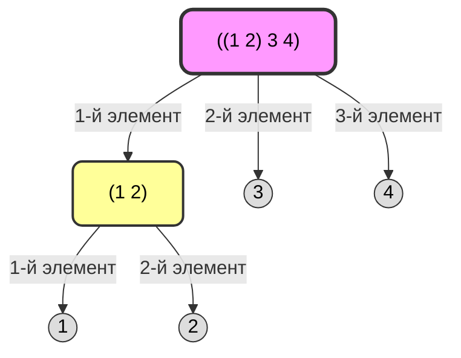
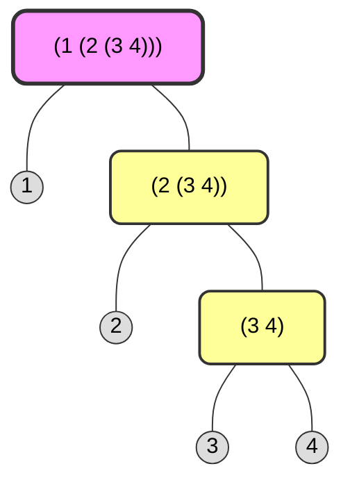

# Глава 2. Построение абстракций с помощью данных

* [2.1. Введение в абстракцию данных](#21-Введение-в-абстракцию-данных)
* [2.2. Иерархические данные и свойство замыкания](#22-Иерархические-данные-и-свойство-замыкания)
* [2.3. Символьные данные](#23-Символьные-данные)
* [2.4. Множественные представления для абстрактных данных](#24-Множественные-представления-для-абстрактных-данных)

В отличие от главы 1, где наше внимание было в основном направлено на создание абстракций с помощью сочетания процедур и построения составных процедур, в этой главе мы обращаемся к другой важной характеристике всякого языка программирования: тем средствам, которые он предоставляет для создания абстракций с помощью сочетания объектов данных и построения составных данных (compound data).


Авторы приводят отличный пример с дробями (рациональными числами). Представьте, что нужно сложить $\frac{1}{2}$ и $\frac{2}{3}$

В «мире первой главы» нет понятия «дробь». У нас есть четыре отдельных числа: n1=1, d1=2 и n2=2, d2=3.

В терминах простейших данных, рациональное число можно рассматривать как два целых числа: числитель и знаменатель. Таким образом, мы могли бы сконструировать программу, в которой всякое рациональное число представлялось бы как пара целых (числитель и знаменатель) и add-rat была бы реализована как две процедуры (одна из которых вычисляла бы числитель суммы, а другая знаменатель). Однако это было бы крайне неудобно, поскольку нам приходилось бы следить, какие числители каким знаменателям соответствуют.

Три кита этой главы:
* Составные данные (Compound Data), в языке Rust это может быть `struct`: Как из двух чисел сделать одно? В Лиспе для этого есть «клей» под названием `cons`. Он просто берет две вещи и делает из них пару.
* Абстракция данных (Data Abstraction). Функции add-rat (сложение дробей) не должно быть дела до того, как именно устроена дробь. Она должна просто просить: «Дай мне числитель этой штуки» и «Дай мне её знаменатель».
    * Если завтра мы решим хранить дробь не как два числа, а как строку или массив, нам нужно будет поменять только «клей», а не всю логику сложения.
* Понятийный уровень: Мы перестаем думать в терминах «ячеек памяти» и начинаем думать в терминах «Предметной области». Мы создаем в языке новые типы: Дроби, Векторы, Списки, Деревья.    

Мы познакомимся с тремя главными инструментами Lisp для работы с данными:
* `cons`: склеить две вещи в пару.
* `car`: достать первую вещь из пары.
* `cdr`: достать вторую вещь из пары.

## 2.1. Введение в абстракцию данных

Барьер абстракции (abstraction barriers) это слой (интерфейс: constructors и selectors), позволяющий разделять слои между собой, слой верхнего уровня оперирут понятиями представляет логику программы,а слой нижнего уровня - конкретными реализациями т.е. то, как данные расположены в памяти физически.

Барьер абстракции позволяет менять внутренности программы/детали реализации (как данные лежат в памяти), не ломая её логику (как эти данные используются).

Абстракция данных — это методология написания кода, при которой программа не делает никаких предположений о структуре данных, кроме тех, что предоставляются интерфейсными процедурами (конструкторами и селекторами):
* Конструкторы (constructors): процедуры, которые создают объект
* Селекторы (selectors): процедуры, которые извлекают части объекта

> В [Rust Newtype](https://github.com/Jekahome/Patterns?tab=readme-ov-file#type-safety-newtype-typestate) защищен на уровне компилятора. Если поле приватное, вы физически не сможете его прочитать вне модуля.
> 
> В Lisp защиты нет. Любая процедура может вызвать `(car x)` и «взломать» вашу абстракцию. Поэтому в SICP «Абстракция данных» — это скорее дисциплина программирования и архитектурный контракт:
> * Вы обещаете использовать только Newtype: numer и denom.
> * Вы соглашаетесь, что `(car x)` — это «грязный» код, нарушающий барьер.


Перенос принципа абстракции с процедур на данные.
Если в первой главе мы абстрагировали действия (создавали процедуры, чтобы скрыть детали вычислений), то здесь мы абстрагируем объекты.
* Процедурная абстракция: нам не важно, как именно вычисляется (sqrt x), нам важен результат.
* Абстракция данных: нам не важно, как «склеено» число в памяти, нам важно иметь способ получить его составные части.

> 
> Когда писался SICP, в 1980-х годах, большинство программистов использовали на Фортран, Си или Паскаль, где обращение к полям структуры напрямую (point.x = 10) было нормой жизни. Идея того, что вообще любое обращение к данным должно быть изолировано функцией, тогда была революционным «чистым кодом».

<details>
<summary>Авторы пытаются подвести нас к мысли</summary>

«Если интерфейс (селекторы и конструкторы) работает, то нам абсолютно все равно, что там внутри — кусок памяти или вообще лямбда-выражение».

Готовят нас к подлянке, которая будет в конце раздела 2.1.3.

Их цель — доказать нам, что данных вообще не существует.

Они хотят показать, что нам не нужны структуры, не нужна память, не нужны массивы. Они собираются реализовать `cons`, `car` и `cdr` через функции высшего порядка, из в первой главы.

Пару можно реализовать вот так

```
(define (cons x y)
  (lambda (m) (m x y))) ; Пара — это функция!

(define (car z)
  (z (lambda (p q) p))) ; Достаем первый элемент через еще одну функцию
```

</details>


#### 2.1.1. Пример: арифметические операции над рациональными числами

Как нам складывать, вычитать, умножать, делить и проверять на равенство рациональные числами с помощью следующих отношений

Эти стандартные математические выражения, являются техническим заданием для «Верхнего уровня абстракции» (уровня понятий).

1. Сложение (Addition)

$$\frac{n_1}{d_1} + \frac{n_2}{d_2} = \frac{n_1d_2 + n_2d_1}{d_1d_2}$$


2. Вычитание (Subtraction)

$$\frac{n_1}{d_1} - \frac{n_2}{d_2} = \frac{n_1d_2 - n_2d_1}{d_1d_2}$$

3. Умножение (Multiplication)

$$\frac{n_1}{d_1} \cdot \frac{n_2}{d_2} = \frac{n_1n_2}{d_1d_2}$$

4. Деление (Division)

$$\frac{n_1/d_1}{n_2/d_2} = \frac{n_1d_2}{d_1n_2}$$

5. Тест на равенство (Equality Test)

$$\frac{n_1}{d_1} = \frac{n_2}{d_2} \iff n_1d_2 = n_2d_1$$

#### Пары (pair)

Для реализации конкретного уровня абстракции данных в Lisp имеется составная структура, называемая парой (pair), и она создается с помощью элементарной процедуры `cons`. Имея пару, мы можем получить ее части с помощью элементарных процедур `car` и `cdr`.

```scheme
;; рациональное число 1/2
(define x (cons 1 2))

(car x) ; 1 числитель
(cdr x) ; 2 знаменатель
```

Создание абстрактных типов: numer, denom ("аля Newtype") 

```scheme
;; Интерфейс
;; Конструктор (создает пару)
(define (make-rat n d) (cons n d))

;; Селекторы (процедуры, которые лезут внутрь любой переданной пары)
(define (numer x) (car x))
(define (denom x) (cdr x))

;; -----------------------------------------------
 
(define (add-rat x y)
  (make-rat (+ (* (numer x) (denom y))
               (* (numer y) (denom x)))
            (* (denom x) (denom y)))
)

;; Создание объектов (Конструирование)
(define a (make-rat 1 2)) ; создали "объект" 1/2
(define b (make-rat 3 4)) ; создали "объект" 3/4

;; Использование в логике (Селекция)
(define c (add-rat a b)) ; Складываем объекты a и b

;; Проверка результата
#|
(display (numer c)) ; 10 числитель 
(display "/")
(display (denom c)) ;  8 знаменатель 
|#

;; Особенность Klipse: отсутствует display 
;; Вместо печати по частям, создаем "вид" для человека
(define (format-rat x)
  (list (numer x) '/ (denom x)))
 
(format-rat c)
```

<details>
<summary><b>Сила Абстракции данных.</b></summary>
 
Вы решили сменить формат хранения с пары (`cons`) на список из двух элементов (`list`), где числитель идет вторым, а знаменатель — первым. Без абстракции вам пришлось бы переписывать `add-rat`, потому что там использовались `car` и `cdr`.

С абстракцией вы меняете только 3 строки интерфейса:

```scheme
;; Интерфейс
;; Новая реализация хранения (теперь список, порядок обратный)
(define (make-rat n d) (list d n)) ; Храним как (знаменатель числитель)

;; Новые селекторы, адаптированные под это хранилище
(define (numer x) (cadr x)) ; Числитель теперь второй элемент
(define (denom x) (car x))  ; Знаменатель теперь первый элемент
;; -----------------------------------------------
;; Этот весь код остался прежним

(define (add-rat x y)
  (make-rat (+ (* (numer x) (denom y))
               (* (numer y) (denom x)))
            (* (denom x) (denom y)))
)

;; Создание объектов (Конструирование)
(define a (make-rat 1 2)) ; создали "объект" 1/2
(define b (make-rat 3 4)) ; создали "объект" 3/4

;; Использование в логике (Селекция)
(define c (add-rat a b)) ; Складываем объекты a и b

;; Проверка результата
(numer c); 10 числитель 
(denom c) ; 8 знаменатель 
```

</details>


#### Представление рациональных чисел

Будем просто представлять рациональное число в виде пары двух целых чисел: числителя и знаменателя.

Но наша реализация рациональных чисел не приводит их к наименьшему знаменателю. Что не позволяет нам экономить память и упрощать сравнения. Без сокращения одно и то же число может выглядеть в памяти по-разному и просто проверить их на равенство не получится. Лучше сразу при создании рационального числа найдем наименьший знаменатель, что даст нам только одно уникальное представление числа.

```
;; Конструктор (создает пару)
(define (make-rat n d)
    (let ((g (gcd n d)))
    (cons (/ n g) (/ d g)))
)
```


```scheme
;; Сложение (Addition)
(define (add-rat x y)
  (make-rat (+ (* (numer x) (denom y))
               (* (numer y) (denom x)))
            (* (denom x) (denom y)))
)
;; Вычитание (Subtraction)
(define (sub-rat x y)
  (make-rat (- (* (numer x) (denom y))
               (* (numer y) (denom x)))
            (* (denom x) (denom y)))
)
;; Умножение (Multiplication)
(define (mul-rat x y)
  (make-rat (* (numer x) (numer y))
            (* (denom x) (denom y)))
)
;; Деление (Division)
(define (div-rat x y)
  (make-rat (* (numer x) (denom y))
            (* (denom x) (numer y)))
)
;; Тест на равенство (Equality Test)
(define (equal-rat? x y)
  (= (* (numer x) (denom y))
     (* (numer y) (denom x)))
)
;; ----------------------------------
; Наш самописный остаток от деления
(define (remainder n d)
  (- n (* d (truncate (/ n d)))))
;; GCD (Наибольший Общий Делитель)
(define (gcd a b)
  (if (= b 0)
      a
      (gcd b (remainder a b))
  )
)
;; ----------------------------------
;; Интерфейс
;; Конструктор (создает пару)
(define (make-rat n d)
    (let ((g (gcd n d)))
    (cons (/ n g) (/ d g)))
)

;; Селекторы (процедуры, которые лезут внутрь любой переданной пары)
(define (numer x) (car x))
(define (denom x) (cdr x))
;; ----------------------------------

;; Создание объектов (Конструирование)
(define a (make-rat 5 10)) ; создали "объект" 5/10 => 1/2
(define b (make-rat 3 4)) ; создали "объект" 3/4

;; Использование в логике (Селекция)
(define c (mul-rat a b)) ; Умножаем объекты a и b

;; display
(define (format-rat x)
  (list (numer x) '/ (denom x)))
 
(format-rat c)
```

#### Упражнение 2.1.
Определите улучшенную версию `mul-rat`, которая принимала бы как положительные, так и отрицательные аргументы. `Make-rat` должна нормализовывать знак так, чтобы в случае, если рациональное число положительно, то и его числитель, и знаменатель были бы положительны, а если оно отрицательно, то чтобы только его числитель был отрицателен.

Если пользователь ввел `(make-rat 1 -2)`, конструктор должен вернуть `(-1 . 2)`.

Чтобы у Вас не было двух разных объектов для одного числа: `(1 . -2)` и `(-1 . 2)`. В математике принято, что знак всегда относится к числителю.


```
(define (make-rat n d)
  (let ((g (abs (gcd n d)))) ; Находим НОД (всегда берем модуль)
    (if (< d 0)
        (cons (/ (- n) g) (/ (- d) g)) ; Если знаменатель < 0, переворачиваем знаки у обоих
        (cons (/ n g) (/ d g))))
)
```

В стандартной библиотеке Rust (std) нет типа для рациональных чисел, но есть crates [num-rational](https://crates.io/crates/num-rational).

В Лиспе «барьер абстракции» — это джентльменское соглашение. В Rust — это закон компилятора.
В Rust барьер создается с помощью системы модулей (mod) и приватных полей.

Прототип:
```rust,editable
mod data_abstraction {
    // Структура приватна, поля приватны — никто снаружи не сделает (car x)
    #[derive(Debug)]
    pub struct Rational {
        n: i32,
        d: i32,
    }
    impl Rational {
        // Конструктор (make-rat) с логикой нормализации
        pub fn new(n: i32, d: i32) -> Self {
            let common = gcd(n.abs(), d.abs());
            let (n_red, d_red) = (n / common, d / common);
            if d_red < 0 {
                Self { n: -n_red, d: -d_red }
            } else {
                Self { n: n_red, d: d_red }
            }
        }
        // Селекторы (numer, denom)
        pub fn numer(&self) -> i32 { self.n }
        pub fn denom(&self) -> i32 { self.d }
    }
    fn gcd(a: i32, b: i32) -> i32 {
        if b == 0 { a } else { gcd(b, a % b) }
    }
}

use data_abstraction::Rational;
// Верхний уровень: Логика умножения (mul-rat)
// Она не знает, что внутри Rational есть поля .n и .d
fn mul_rat(x: &Rational, y: &Rational) -> Rational {
    Rational::new(
        x.numer() * y.numer(),
        x.denom() * y.denom()
    )
}
fn main() {
    let a = Rational::new(-1, 2);
    let b = Rational::new(2, -3);
    let result = mul_rat(&a, &b);
    println!("{}/{}", result.numer(), result.denom()); // Выведет 1/3
}
```


```scheme
;;Подготовка (Нижний уровень)

(define (remainder n d)
  (- n (* d (truncate (/ n d)))))

(define (gcd a b)
  (if (= b 0)
      (abs a)
      (gcd b (remainder a b))))

(define (make-rat n d)
  (let ((g (gcd n d)))
    (if (< d 0)
        (cons (/ (- n) g) (/ (- d) g))
        (cons (/ n g) (/ d g)))))

(define (numer x) (car x))
(define (denom x) (cdr x))

;;Логика (Верхний уровень)

(define (mul-rat x y)
  (make-rat (* (numer x) (numer y))
            (* (denom x) (denom y))))

(define (format-rat x)
  (list (numer x) '/ (denom x)))

;;ТЕСТ: (-1/2) * (-2/3)

(define a (make-rat -1 2))  ; Минус в числителе
(define b (make-rat 2 -3))  ; Минус в знаменателе (наш make-rat его перенесет)

(define result (mul-rat a b))

(format-rat result) ; (1 / 3)
```        

### 2.1.2. Барьеры абстракции (abstraction barriers)

#### Упражнение 2.2.
Рассмотрим задачу представления отрезков прямой на плоскости. Каждый отрезок представляется как пара точек: начало и конец. Определите конструктор make-segment и селекторы start-segment и end-segment, которые определяют представление отрезков в терминах точек. 

Далее, точку можно представить как пару чисел: координата x и координата y. Соответственно, напишите конструктор make-point и селекторы x-point и y-point, которые определяют такое представление. 

Наконец, используя свои селекторы и конструктор, напишите процедуру midpoint-segment, которая принимает отрезок в качестве аргумента и возвращает его середину (точку, координаты которой являются средним координат концов отрезка).


```scheme
;;Слой 1: Точки (Points)
(define (make-point x y) (cons x y))
(define (x-point p) (car p))
(define (y-point p) (cdr p))

;;Слой 2: Отрезки (Segments)
(define (make-segment start end) (cons start end))
(define (start-segment s) (car s))
(define (end-segment s) (cdr s))

;;Слой 3: Вычисления (используем только селекторы слоев ниже)
(define (midpoint-segment s)
  (let ((a (start-segment s))
        (b (end-segment s)))
    (make-point (/ (+ (x-point a) (x-point b)) 2)
                (/ (+ (y-point a) (y-point b)) 2))))

;;Проверка в Klisp (используем список для вывода)
(define p1 (make-point 0 0))
(define p2 (make-point 10 10))
(define seg (make-segment p1 p2))
(define mid (midpoint-segment seg))

(list (x-point mid) (y-point mid)) ; (5 5)
```

#### Упражнение 2.3.
Реализуйте представление прямоугольников на плоскости. (Подсказка: Вам могут потребоваться результаты упражнения 2.2.) Определите в терминах своих конструкторов и селекторов процедуры, которые вычисляют периметр и площадь прямоугольника. Теперь реализуйте другое представление для прямоугольников. 

Можете ли Вы спроектировать свою систему с подходящими барьерами абстракции так, чтобы одни и те же процедуры вычисления периметра и площади работали с любым из Ваших представлений?

Упражнение подводит нас к концепции полиморфизма, но реализует его через дисциплину написания кода.

Представление прямоугольника как: две точки координат, нижнего левого и верхнего правого угла:
```scheme
;;Уровень абстрактных понятий (Верхний уровень)
(define (perimeter rect)
  (* 2 (+ (width-rect rect) (height-rect rect))))

(define (area rect)
  (* (width-rect rect) (height-rect rect)))
;;----------------------------------------------
;;Реализация (Две точки)
;;Конструктор
(define (make-rect bottom-left top-right)
  (cons bottom-left top-right))

;;Селекторы (реализация для двух точек)
(define (width-rect r)
  (abs (- (x-point (cdr r)) (x-point (car r)))))

(define (height-rect r)
  (abs (- (y-point (cdr r)) (y-point (car r)))))

;;Применение ----------------------------------
;;1. Создаем точки (используем код из упр. 2.2)
(define (make-point x y) (cons x y))
(define p1 (make-point 0 0))
(define p2 (make-point 10 5))

;;2. Создаем прямоугольник через эти точки
(define my-rect (make-rect p1 p2))

;;3. Вычисляем параметры (используем Верхний уровень)
(perimeter my-rect) ; 30
(area my-rect)      ; 50


```

Представление прямоугольника как: точка координат угла, ширина и высота
```scheme
;;Уровень абстрактных понятий (Верхний уровень)
(define (perimeter rect)
  (* 2 (+ (width-rect rect) (height-rect rect))))

(define (area rect)
  (* (width-rect rect) (height-rect rect)))
;;----------------------------------------------
;;Реализация (Точка, Ширина и Высота)
;;Новый Конструктор
(define (make-rect origin w h)
  (cons origin (cons w h)))

;;Новые Селекторы для того же интерфейса
(define (width-rect r)
  (car (cdr r))) ; Достаем ширину напрямую

(define (height-rect r)
  (cdr (cdr r))) ; Достаем высоту напрямую
;;Применение ----------------------------------
;;1. Создаем точку отсчета и задаем размеры
(define (make-point x y) (cons x y))
(define origin (make-point 0 0))
(define w 10)
(define h 5)

;;2. Создаем прямоугольник по-новому (через точку, ширину и высоту)
(define my-rect (make-rect origin w h))

;;3. Вычисляем те же параметры (Верхний уровень не изменился!)
(perimeter my-rect) ; 30
(area my-rect)      ; 50

```

### 2.1.3. Что значит слово «данные»?

Мы привыкли думать, что данные — это какая-то «коробочка» в памяти (структура в Rust, объект в Java, пара cons в Лиспе).

Данные — это не структура. Данные — это набор условий (контракт), которым должны удовлетворять функции. Данные — это просто процедуры, которые ведут себя определенным образом.

Определение данных через поведение, `cons`, `car` и `cdr` можно написать вообще не используя память компьютера, а используя только lambda (анонимные функции).

```scheme
(define (my-cons x y)
  (lambda (m) (m x y))) ; Возвращает функцию, которая ждет другую функцию

(define (my-car z)
  (z (lambda (p q) p))) ; Передает в z функцию, которая выбирает первый элемент

(define (my-cdr z)
  (z (lambda (p q) q))) ; Передает в z функцию, которая выбирает второй элемент
;;-----------------------------------
;; 2. Слой интерфейса (меняем только реализацию, имена те же)
(define (make-rat n d) (my-cons n d))
(define (numer x) (my-car x))
(define (denom x) (my-cdr x))

;; 3. Слой логики не изменился
(define (add-rat x y)
  (make-rat (+ (* (numer x) (denom y))
               (* (numer y) (denom x)))
            (* (denom x) (denom y))))

;; 4. Использование
(define a (make-rat 1 2))
(define b (make-rat 1 4))
(define c (add-rat a b))

(list (numer c) (denom c)) ; (6 8)

```  

#### Упражнение 2.6.
Если представление пар как процедур было для Вас еще недостаточно сумасшедшим, то заметьте,
что в языке, который способен манипулировать процедурами, мы можем обойтись и без чисел (по
крайней мере, пока речь идет о неотрицательных числах), определив 0 и операцию прибавления 1
так:

```
(define zero (lambda (f) (lambda (x) x)))

(define (add-1 n)    
    (lambda (f) (lambda (x) (f ((n f) x)))))

```

Такое представление известно как числа Чёрча (Church numerals), по имени его изобретателя, Алонсо Чёрча, того самого логика, который придумал `λ-исчисление`.


В чем суть чисел Чёрча?
Число в этой системе — это количество раз, которое мы применяем функцию к аргументу.
* Ноль (zero): Примени функцию `f` к `x` 0 раз. Результат: просто `x`
* Единица (one): Примени функцию `f` к `x` 1 раз. Результат: `(f x)`
* Двойка (two): Примени функцию `f` к `x` 2 раза. Результат: `(f (f x))`

Определите one (единицу) и two (двойку) напрямую (не через zero и add-1). (Подсказка: вычислите (add-1 zero) с помощью подстановки.) Дайте прямое определение процедуры сложения + (не в терминах повторяющегося применения add-1)

```scheme
(define zero (lambda (f) (lambda (x) x)))
(define one (lambda (f) (lambda (x) (f x))))
(define two (lambda (f) (lambda (x) (f (f x)))))

;;Сложение (Прямое определение)
(define (add-n-m n m)
  (lambda (f) (lambda (x) ((n f) ((m f) x)))))
;;----------------------------------------------
; Вспомогательная функция для перевода из "Чёрча" в обычные числа
(define (church-to-int n)
  ((n (lambda (x) (+ x 1))) 0))

(church-to-int zero) ; Выведет 0
(church-to-int one)  ; Выведет 1
(church-to-int two)  ; Выведет 2

(define three (add-n-m one two))
(church-to-int three) ; Выведет 3
```

Чёрч хотел ответить на вопрос: «Каков абсолютный минимум инструментов, необходимых для вычислений?».
Оказалось, что нам не нужны:
* Числа.
* Строки.
* Память (в привычном виде).
* Циклы for или while.

Нам нужна только Lambda (возможность создать функцию и вызвать её). Всё. И имея только Lambda, можно собрать компьютер любой сложности. Это математический триумф: программирование — это не железо, это чистая логика.


### 2.1.4. Расширенный пример: интервальная арифметика

Программа Лизы неполна, поскольку она не определила, как реализуется абстракция интервала.

Вот определение конструктора интервала:
```
(define (make-interval a b) (cons a b))
```
Завершите реализацию, определив селекторы `upper-bound` и `lower-bound`. 

Лиза П. Хакер строит идеальную систему абстракции для работы с погрешностями (например, резистор $10 \pm 0.5$ Ом). Всё идет отлично, пока она не обнаруживает **«Парадокс зависимости»**.

**Суть парадокса:**
Если мы вычисляем сопротивление по двум разным (но математически эквивалентным) формулам:
1.  $R_{p} = \frac{R_1 \cdot R_2}{R_1 + R_2}$
2.  $R_{p} = \frac{1}{1/R_1 + 1/R_2}$

В обычном мире результат один. В «интервальном» мире Лизы результаты будут **разными**, потому что система «забывает», что $R_1$ снизу и $R_1$ сверху — это одно и то же число, и раздувает погрешность в два раза, так как при операциях с интервалами результат расширяется, но мы используем один и тот же интервал, поэтому результат не должен расширяться.


> Даже если ваши абстракции (селекторы и конструкторы) технически безупречны, сама математическая модель внутри них может быть ошибочной. Абстракция не лечит плохую логику
> 
> Вы можете без ошибок реализовать формулы сложения и деления.
>
> НО ваша система всё равно будет выдавать мусор, потому что сама модель (интервалы) имеет фундаментальный изъян — она не учитывает зависимость данных.


Математическая форма записи имеет значение для точности кода.

**В обычном программировании нам всеравно, написать $R_{p} = \frac{R_1 \cdot R_2}{R_1 + R_2}$ или $R_{p} = \frac{1}{1/R_1 + 1/R_2}$. Результат будет одинаковым. Но как только мы переходим к интервалам (нечетким данным), эти формулы перестают быть эквивалентными. Чтобы получить максимально точный результат в этой системе, нужно преобразовать алгебраическое выражение так, чтобы каждая переменная с погрешностью встречалась в коде только один раз.**

Именно поэтому формула, дает более точный (узкий) интервал:

$$R_p = \frac{1}{\frac{1}{R_1} + \frac{1}{R_2}}$$

чем классическая:

$$R_p = \frac{R_1 \cdot R_2}{R_1 + R_2}$$


Проблема: Если вы купили два резистора по $10 \pm 1$ Ом, их суммарное сопротивление с учетом минимальной и максимальной погрешности, будет в диапазоне от 9+9 и до 11+11. Так что просто плюс (+) тут не поможет, он выдаст просто $20$.
  
Нам нужно, чтобы программа понимала: результат — это не число $20$, а интервал $[18, 22]$.

Обычный оператор `+` умеет складывать только точки на прямой ($5 + 5 = 10$). А нам нужна процедура `add-interval` которая умеет складывать «облака вероятности».

В программировании число 10 — это точка. В интервальной арифметике «10» — это «где-то около десяти» (например, от 9 до 11). Это и есть облако. Когда вы складываете два таких «облака», результат становится еще более расплывчатым (от 18 до 22). Ошибка «раздувается», и интервал растет.


```
;; Создаем структуру (Конструктор)
;; Чтобы хранить этот диапазон, мы используем знакомую пару cons. Левое число — минимум, правое — максимум.
(define (make-interval a b) (cons a b))

;; Создаем доступ (Селекторы)
;; Нам нужны функции, которые будут доставать границы из этого интервала, чтобы мы могли проводить с ними расчеты.
(define (lower-bound i) (car i))
(define (upper-bound i) (cdr i))

;; Пишем логику сложения
;; Теперь мы учим программу складывать эти «пачки» данных. 
;; Чтобы получить минимальную границу суммы, складываем минимумы. 
;; Чтобы получить максимальную — максимумы.
(define (add-interval x y)
  (make-interval (+ (lower-bound x) (lower-bound y))
                 (+ (upper-bound x) (upper-bound y))))
;; Теперь, если у вас есть два резистора, вы описываете их как интервалы и складываете одной командой. 
;; Программа сама вернет вам новую пару с границами $18$ и $22$.

```

**Проблема «Вычитания» (Ловушка логики)**

Абстракция данных заставляет нас задумываться о смысле операции, а не просто о механическом сложении чисел.

Казалось бы, надо просто вычесть границы? Нет.

Если мы вычитаем один интервал из другого, результат должен быть максимально широким, чтобы гарантированно включать истинное значение.
* Чтобы получить минимум результата, надо из минимума первого вычесть максимум второго.
* Чтобы получить максимум результата, надо из максимума первого вычесть минимум второго.

Прототип:
```rust,editable
fn main() {
    // Первый интервал: от 10 до 15
    let (a, b) = (10.0, 15.0);
    // Второй интервал: от 2 до 5
    let (c, d) = (2.0, 5.0);

    // Прямое вычисление границ вычитания
    let res_min = a - d; // 10 - 5 = 5
    let res_max = b - c; // 15 - 2 = 13

    println!("Результат вычитания: [{}, {}]", res_min, res_max);
}
```

```
(define (sub-interval x y)
  (make-interval (- (lower-bound x) (upper-bound y))
                 (- (upper-bound x) (lower-bound y))))
```                 

**Умножение интервалов**

С умножением всё сложнее, чем со сложением. Если у нас есть два резистора с погрешностью, мы не можем просто перемножить их минимумы и максимумы, потому что среди значений могут быть отрицательные числа (например, в других физических задачах).

Чтобы гарантированно найти новые границы, нам нужно перемножить все возможные комбинации минимумов и максимумов обоих интервалов и выбрать из них самое маленькое и самое большое число.

```lisp
(define (mul-interval x y)
  (let ((p1 (* (lower-bound x) (lower-bound y)))
        (p2 (* (lower-bound x) (upper-bound y)))
        (p3 (* (upper-bound x) (lower-bound y)))
        (p4 (* (upper-bound x) (upper-bound y))))
    (make-interval (min p1 p2 p3 p4)
                   (max p1 p2 p3 p4))))
```                   

**Деление интервалов**

Деление в этой системе определяется через умножение на обратную величину.
Если мы делим на интервал $[y_{low}, y_{high}]$, это то же самое, что умножить на интервал $[1/y_{high}, 1/y_{low}]$.

Проблема в том, что если интервал-делитель проходит через ноль (например, от -1 до 1), то при делении на него значения улетают в бесконечность. Мы должны добавить проверку.

```lisp
(define (div-interval x y)
  (if (>= 0 (* (lower-bound y) (upper-bound y)))
      (error "Ошибка: Делитель пересекает ноль" y)
      (mul-interval x 
                    (make-interval (/ 1.0 (upper-bound y))
                                   (/ 1.0 (lower-bound y))))))
```                               


```scheme
;; 1. Базовые конструкторы и селекторы
(define (make-interval a b) (cons a b))
(define (lower-bound i) (car i))
(define (upper-bound i) (cdr i))

;; 2. Арифметические операции
(define (add-interval x y)
  (make-interval (+ (lower-bound x) (lower-bound y))
                 (+ (upper-bound x) (upper-bound y))))

(define (mul-interval x y)
  (let ((p1 (* (lower-bound x) (lower-bound y)))
        (p2 (* (lower-bound x) (upper-bound y)))
        (p3 (* (upper-bound x) (lower-bound y)))
        (p4 (* (upper-bound x) (upper-bound y))))
    (make-interval (min p1 p2 p3 p4)
                   (max p1 p2 p3 p4))))

(define (div-interval x y)
  (if (>= 0 (* (lower-bound y) (upper-bound y)))
      (error "Division by zero interval" y)
      (mul-interval x 
                    (make-interval (/ 1.0 (upper-bound y))
                                   (/ 1.0 (lower-bound y))))))

;; 3. Применение: считаем параллельное сопротивление
(define r1 (make-interval 9.5 10.5))
(define r2 (make-interval 18.0 22.0))

;; Вспомогательная функция для 1/R
(define (one-over r)
  (div-interval (make-interval 1.0 1.0) r))

;; Формула: 1 / (1/R1 + 1/R2)
(define rp (one-over (add-interval (one-over r1) (one-over r2))))

;; результат
(list (lower-bound rp) (upper-bound rp)) ; (6.21 6.87)
```

Это означает, что при использовании данных резисторов, итоговое сопротивление гарантированно, будет в диапазоне от 6.21 до 6.87 Ом. Вам не пришлось вручную считать погрешности для каждой дроби — абстракция данных сделала это за вас.

---

## 2.2. Иерархические данные и свойство замыкания
 
> [!IMPORTANT]
> К сожалению, в сообществе программистов, пишущих на Лиспе, словом «замыкание» обозначается еще и совершенно другое понятие: замыканием называют способ представления процедур, имеющих свободные переменные. В этом втором смысле мы слово «замыкание» в книге не используем.
>  
> Замыкание в контексте процедур, Lexical Closure (Лексическое замыкание).
>
> О способности функции «запоминать» переменные из того места, где она была создана, даже если она вызывается совсем в другом месте.
> Функция «замыкает» в себе окружающий контекст.


Замыкание в контексте данных, Closure Property (Свойство замыкания). Такое употребление слова «замыкание» происходит из абстрактной алгебры. Алгебраисты говорят, что множество замкнуто относительно операции, если применение операции к элементам этого множества дает результат, который также является элементом множества.

Почему cons называют «замыканием»? Потому что результат операции cons (пара) может сам стать аргументом для другого cons.

Так как cons может склеивать пары с парами, мы получаем бесконечную вложенность, автоматически рождается иерархия.

### 2.2.1. Представление последовательностей

Смотрите, если мы начнем соединять эти пары друг с другом, мы сможем построить не просто один интервал, а целую цепочку (список) или дерево (сложную схему)

```
;; вложенные пары (а не список), так как нет завершающего nill
(define my-data (cons 1 (cons 2 (cons 3 4))))
```

```scheme
;; список (имеет в конце элемент nil в виде '() )
;; nil - это nihil (ничто)
(define my-data (cons 1 (cons 2 (cons 3 (cons 4 '())))))

;;Весь список
my-data ; '(1 2 3 4) 
;;Достать хвост, кроме 1
(cdr my-data) ; (2 3 4)
;;Достать первое число
(car my-data) ;; 1
;;Достать второе число
(car (cdr my-data)) ;; 2
```

В итоге, у вас в руках один объект (внешняя пара), но внутри него спрятана целая структура. Это и есть иерархические (hierarchical) данные: когда целое состоит из частей, которые сами являются такими же частями.

Чтобы не сойти с ума от бесконечных cons, в языке придумали команду `list`. Система сама создаст цепочку из пар, и добавит в конце nil.

```scheme
;; список
(define my-data (list 1 2 3 4))

;;Весь список
my-data ; '(1 2 3 4) 
;;Достать хвост, кроме 1
(cdr my-data) ; (2 3 4)
;;Достать первое число
(car my-data) ; 1
;;Достать второе число
(car (cdr my-data)) ; 2
;;Достать третье число
(car (cdr (cdr my-data))); 3

```

Команда `list` просто удобный способ создать последовательность пар. 
Но, на самом деле. интерпретатор Lisp создает список используя `cons`.
Для компьютера команда `list` — это просто короткий псевдоним `(list 1 2 3 4)` разворачивает её в: `(cons 1 (cons 2 (cons 3 (cons 4 '()))))`. Выделяет в памяти четыре пары (четыре двойных ячейки).

```scheme
;; список
(define my-data (cons 1 (cons 2 (cons 3 (cons 4 '())))) )
my-data ; '(1 2 3 4)
(cdr my-data); '(2 3 4)
(car (cdr (cdr my-data))); 3
(car (cdr my-data)) ; 2
(car my-data); 1
```

Команда `cons` может стать полезной при добавлении в спискок (в начало) нового значения:
```scheme
(define new-data (cons 0  my-data))
new-data ; '(0 1 2 3 4)
```

Мы опишем несколько распространенных методов использования пар для представления последовательностей и деревьев, а также построим графический язык, который наглядно иллюстрирует замыкание.

#### Операции со списками

Процедура `list-ref` берет в качестве аргументов список и число `n` и возвращает `n-й` элемент списка. 
Обычно элементы списка нумеруют, начиная с 0.

```scheme
(define (list-ref items n)
  (if (= n 0)
      (car items)
      (list-ref (cdr items) (- n 1))))

(define my-data (list 1 2 3 4))
(list-ref my-data 3); 4

```

Часто мы проматриваем весь список. Чтобы помочь нам с этим, Scheme включает элементарную процедуру `null?`, которая определяет, является ли ее аргумент пустым списком - `nil` в виде `'()`. 

Рекурсивная процедура `length`, которая возвращает число элементов в списке, иллюстрирует эту характерную схему использования операций над списками. Длина любого списка равняется 1 плюс длина `cdr` этого списка

```scheme
(define (length items)
  (if (null? items)
      0
      (+ 1 (length (cdr items)))))

(length my-data); 4
```

Итеративная процедура `length`:

```scheme
(define (length items)
  (define (length-iter a count)
    (if (null? a)
        count
        (length-iter (cdr a) (+ 1 count))))
  (length-iter items 0))

(length my-data)
```

Соединения списков. Нужно соединить `cdr` от `list1` с `list2`, а к результату прибавить `car` от `list1` с помощью `cons`:

```scheme
(define (append list1 list2)
  (if (null? list1)
      list2
      (cons (car list1) (append (cdr list1) list2))))

;; списки
(define my-data (list 1 2 3 4))
(define my-data2 (list 5 6))

(define new-data (append my-data2 my-data))

new-data ; '(5 6 1 2 3 4)
```

#### Упражнение 2.17.
Определите процедуру `last-pair`, которая возвращает список, содержащий только последний элемент данного (непустого) списка.

```scheme
;; встпомогательные процедуры
(define (length items)
  (define (length-iter a count)
    (if (null? a)
        count
        (length-iter (cdr a) (+ 1 count))))
  (length-iter items 0))

(define (list-ref items n)
  (if (= n 0)
      (car items)
      (list-ref (cdr items) (- n 1))))
;; -----------------------------------------      

(define (last-pair items)
  (if (null? items) 
      '()
      (list-ref items (- (length items) 1))
   )
)

(last-pair (list '())) ; '()
(last-pair (list 23 72 149 34)); 34

```


#### Упражнение 2.18.
Определите процедуру reverse, которая принимает список как аргумент и возвращает список, состоящий из тех же элементов в обратном порядке:

```
(reverse (list 1 4 9 16 25))
(25 16 9 4 1)
```

Вариант на основе линейной рекурсии. Чтобы развернуть список, разверните хвост и приклейте голову в самый конец
```scheme
(define (reverse items)
  (define (iter remaining)
    (if (null? remaining) 
      '() 
      (append
        (iter (cdr remaining))
        (list (car remaining))
      )
    )
  )
   (iter items)
)
(reverse (list 1 4 9 16 25)) ; (25 16 9 4 1)
```

Но В Лиспе операция append - «дорогая». Чтобы приклеить один элемент в конец списка, append должен пройтись по всему списку с самого начала до самого конца, чтобы найти '().

Итеративный вариант. Аккумулируем acc список - каждую итерацию, добавляя в его начало первый элемент из осташегося списка
```scheme
(define (reverse items)
  (define (iter remaining acc)
    (if (null? remaining)
        acc
        (iter (cdr remaining) (cons (car remaining) acc))
    )
  )
  (iter items '())
)
(reverse (list 1 4 9 16 25))
```

#### Упражнение 2.19.
Рассмотрим программу подсчета способов размена из раздела [1.2.2.](#122-Древовидная-рекурсия-tree-recursion) Было бы приятно иметь возможность легко изменять валюту, которую эта программа использует, так, чтобы можно было, например, вычислить, сколькими способами можно разменять британский фунт.

Приятнее было бы иметь возможность просто задавать список монет, которые можно использовать при размене. Мы хотим переписать процедуру cc так, чтобы ее вторым аргументом был список монет, а не целое число, которое указывает, какие монеты использовать. Тогда у нас могли бы быть списки, определяющие типы валют:

```
(define us-coins (list 50 25 10 5 1))
(define uk-coins (list 100 50 20 10 5 2 1 0.5))
```

Это потребует некоторых изменений в программе cc. Ее форма останется прежней, но со вторым
аргументом она будет работать иначе.

Суть упражнения - отделить алгоритм от данных. Алгоритм `cc` вообще не должен знать, какие бывают деньги. Он просто должен уметь «откусывать голову» списка через `car` и «переходить к остатку» через `cdr`.

```scheme
(define us-coins (list 50 25 10 5 1))
(define uk-coins (list 100 50 20 10 5 2 1 0.5))

(define (cc amount coin-values)
  (cond ((= amount 0) 1)
        ((or (< amount 0) (no-more? coin-values)) 0)
        (else
           (+ (cc amount (except-first-denomination coin-values))
              (cc (- amount (first-denomination coin-values)) coin-values)
           )
       )
  )
)
 
;; Берем первую монету из списка (голова)
(define (first-denomination coin-values)
  (car coin-values))

;; Берем все монеты, кроме первой (хвост)
(define (except-first-denomination coin-values)
  (cdr coin-values))

;; Проверяем, не кончились ли монеты (пустой ли список)
(define (no-more? coin-values)
  (null? coin-values))

(cc 100 us-coins)
```

Влияет ли порядок списка на результат?

Нет, так как для суммы неважно, в каком порядке вы начнете подбирать слагаемые, если вы в итоге перебираете все варианты.


#### Упражнение 2.20.
Процедуры `+, * и list` принимают произвольное число аргументов. Один из способов определения таких процедур состоит в использовании точечной записи (dotted-tail notation). В определении процедуры список параметров с точкой перед именем последнего члена означает, что, когда процедура вызывается, начальные параметры (если они есть) будут иметь в качестве значений начальные аргументы, как и обычно, но значением последнего параметра будет список всех оставшихся аргументов.

Используя эту нотацию, напишите процедуру `same-parity`, которая принимает одно или более целое число и возвращает список всех тех аргументов, у которых четность та же, что у первого аргумента.


Вариант решниея на основе итеративного процесса. 
Используем обратный порядок `reverse` из-за то, что мы добавляем каждый прошедший фильтр элемент списка - в начало.

```scheme
;; вспомогательная процедура обратного порядка списка
(define (reverse items)
  (define (iter remaining acc)
    (if (null? remaining)
        acc
        (iter (cdr remaining) (cons (car remaining) acc))
    )
  )
  (iter items '())
)
;; процедура для замены mod
(define (remainder n d)
  (if (< n d)
      n
      (remainder (- n d) d))
)

(define (same-parity x . args)
   (define parity (remainder x 2)) ; локальная переменная
   (define (iter items acc)
         (if (null? items)
             (reverse acc)
             (if (= (remainder (car items) 2) parity)
                 (iter (cdr items) (cons (car items) acc) )
                 
                 (iter (cdr items)  acc)
             )
         )
   )
   (iter args (list x))
)
 
(same-parity 2 3 4 5 6 7) ; (2 4 6)
(same-parity 1 2 3 4 5 6 7) ; (1 3 5 7)
```

Вариант решения на основе рекурсивного процесса. Список строится на обратном пути из глубины рекурсии и блягодаря этому порядок элементом сохраняется.
```scheme
(define (same-parity x . rest)
  (define parity (remainder x 2))
  ;; Внутренняя функция для фильтрации
  (define (filter items)
    (if (null? items)
        '()
        (if (= (remainder (car items) 2) parity)
            (cons (car items) (filter (cdr items))) ; Оставляем элемент
            (filter (cdr items)))  ; Пропускаем элемент
        )
  )                 
  
  ;; Собираем результат: эталон + отфильтрованный хвост
  (cons x (filter rest))
)
(same-parity 2 3 4 5 6 7) ; (2 4 6)
(same-parity 1 2 3 4 5 6 7) ; (1 3 5 7)
```

#### Отображение списков
Крайне полезной операцией является применение какого-либо преобразования к каждому элементу списка и порождение списка результатов. 

Например, следующая процедура умножает каждый элемент списка на заданное число.

**На основе рекурсивного процесса.**
```scheme
(define (scale-list items factor)
  (if (null? items)
      '()
      (cons (* (car items) factor) (scale-list (cdr items) factor))
  )
)
(scale-list (list 1 2 3 4 5) 10)
```

Мы можем выделить здесь общую идею и зафиксировать ее как схему, выраженную в виде процедуры высшего порядка, в точности как в разделе [1.3.](sicp_сhapter_1.html#13-Формулирование-абстракций-с-помощью-процедур-высших-порядков) 

Здесь эта процедура высшего порядка называется `map` (*Стандартная Scheme содержит более общую процедуру map, чем описанная здесь*). Map берет в качестве аргументов процедуру от одного аргумента и список, а возвращает список результатов, полученных применением процедуры к каждому элементу списка

```scheme
(define nil '())
(define (map proc items)
  (if (null? items)
      nil
      (cons (proc (car items)) (map proc (cdr items)))
  )
)
;; использование 
(map abs (list -10 2.5 -11.6 17)) ; выполнить операцию abs над каждым элементом списка
(map (lambda (x) (* x x)) (list 1 2 3 4)) ; выполнить операцию lambda над каждым элементом списка
```

Теперь мы можем дать новое определение `scale-list` через `map`:

```scheme
(define (scale-list items factor)
  (map (lambda (x) (* x factor)) items)
)
(scale-list (list 1 2 3 4 5) 10)
```

В сущности, `map` помогает установить барьер абстракции, который отделяет реализацию процедур, преобразующих списки, от деталей того, как выбираются и комбинируются элементы списков.


**На основе итеративного процесса.**
```scheme
(define (scale-list-it items factor)
  (define (iter items factor acc)
    (if (null? items)
        (reverse acc)
        (iter (cdr items) factor (cons (* (car items) factor) acc) )
    )
  )
  (iter items factor '())
)
 
(scale-list-it (list 1 2 3 4 5) 10)
```

Процедура высшего порядка  `map` 
```scheme
(define (map-it proc items)
  (define (iter items proc acc)
    (if (null? items)
      (reverse acc)
      (iter (cdr items) proc (cons (proc (car items)) acc) )
    )
  )
  (iter items proc (list ))

)
(map-it abs (list -10 2.5 -11.6 17))
(map-it (lambda (x) (* x x)) (list 1 2 3 4))
```

Процедура `scale-list-it` через итеративный `map-it` такая же как и у рекурсивного:
```scheme
(define (scale-list-it items factor)
  (map-it (lambda (x) (* x factor)) items)
)
(scale-list-it (list 1 2 3 4 5) 10)
```

#### Упражнение 2.21.
Процедура `square-list` принимает в качестве аргумента список чисел и возвращает список квадратов этих чисел.

```scheme
(define (square-list items)
  (if (null? items)
      nil
     (cons (* (car items) (car items) ) (square-list (cdr items)) )
  )
)
(square-list (list 1 2 3 4)); (1 4 9 16)
```

Реализация с использованием `map`
```scheme
(define (square-list items)
  (map  (lambda (x) (* x x)) items)
)
(square-list (list 1 2 3 4))
```

#### Упражнение 2.23.
Процедура `for-each` похожа на map. В качестве аргументов она принимает процедуру и список элементов. Однако вместо того, чтобы формировать список результатов, `for-each` просто применяет процедуру по очереди ко всем элементам слева направо. Результаты применения процедуры к аргументам не используются вообще — `for-each` применяют к процедурам, которые осуществляют какое-либо действие вроде печати.

Обычно функции в Лиспе что-то возвращают (число, список). Но есть функции, которые делают «грязную работу» на стороне (побочные эффекты):
* Печатают текст на экране.
* Сохраняют данные в файл.
* Издают звуковой сигнал.
 
Значение, возвращаемое вызовом `for-each` (оно в листинге не показано) может быть каким угодно, например истина. Напишите реализацию `for-each.`

for-each — это стандартная встроенная функция в языке Scheme. Авторы SICP часто просят реализовать то, что уже есть в языке, чтобы вы поняли, как это устроено «под капотом».

```lisp
(for-each (lambda (x) (newline) (display x))

 (list 57 321 88)
)
```


В теле `if` или `cond` иногда нужно выполнить два действия подряд (сначала применить функцию, а потом вызвать рекурсию). В языке `Scheme` для этого есть команда `begin`:

```lisp
(begin
  (действие-1)
  (действие-2))
```

```lisp
#lang racket
(define (for-each proc items)
   (if (null? items)
      (void)
      (begin
        (proc (car items))
        (for-each proc (cdr items) )
      )
    )
)
;; использование
(for-each (lambda (x) (newline) (display x))
 (list 57 321 88)
)
```

### 2.2.2. Иерархические структуры

Естественным инструментом для работы с деревьями является рекурсия, поскольку часто можно свести операции над деревьями к операциям над их ветвями, которые сами сводятся к операциям над ветвями ветвей, и так далее, пока мы не достигнем листьев дерева.

Писать рекурсивные процедуры над деревьями в Scheme помогает элементарный предикат `pair?`, который проверяет, является ли его аргумент парой.

Процедура `count-leaves` подсчитывает число листьев дерева `(((1 2) 3 4))`



```scheme
(define (count-leaves x)
  (cond ((null? x) 0)
        ((not (pair? x)) 1)
        (else (+ (count-leaves (car x))
                 (count-leaves (cdr x)))
        )
  )
)
(define x (cons (list 1 2) (list 3 4)))
(count-leaves x); 4
(list x) ; (((1 2) 3 4))
```

#### Упражнение 2.24.
Предположим, мы вычисляем выражение `(list 1 (list 2 (list 3 4)))`. Укажите, какой результат напечатает интерпретатор, изобразите его в виде стрелочной диаграммы, а также его интерпретацию в виде дерева.




#### Упражнение 2.25.
Укажите комбинации `car` и `cdr`, которые извлекают 7 из заданного списка:

```scheme
(define x (list 1 (list 2 (list 3 (list 4 (list 5 (list 6 7)))))))
(car (cdr (car (cdr (car (cdr (car (cdr (car (cdr (car (cdr x))))))))))))
```

#### Упражнение 2.26.

```scheme
(define x (list 1 2 3))
(define y (list 4 5 6))
 
(append x y); (1 2 3 4 5 6)
(cons x y)  ; ((1 2 3) 4 5 6)
(list x y)  ; ((1 2 3) (4 5 6))
```

#### Упражнение 2.27.
Измените свою процедуру [`reverse` из упражнения 2.18](#Упражнение-218) так, чтобы получилась процедура `deep-reverse`, которая принимает список в качестве аргумента и возвращает в качестве значения список, где порядок элементов обратный и подсписки также обращены.

```scheme
(define (deep-reverse items)
  (define (iter remaining acc)
    (if (null? remaining)
         acc
         (if (pair? (car remaining)) 
             (iter (cdr remaining) (cons (reverse (car remaining)) acc) ) 
             (iter (cdr remaining) (cons (car remaining) acc) ) 
         )
      )
  )
  (iter items '())
)
(reverse (list (list 1 2) (list 3 4))) ; ((3 4) (1 2))
(deep-reverse (list (list 1 2) (list 3 4))); ((4 3) (2 1))
```

### Отображение деревьев
Подобно тому, как `map` может служить мощной абстракцией для работы с последовательностями, `map`, совмещенная с рекурсией, служит мощной абстракцией для работы с деревьями.

Cпособ реализации `scale-tree` состоит в том, чтобы рассматривать дерево как последовательность поддеревьев и использовать `map`. Мы отображаем последовательность, масштабируя по очереди каждое поддерево, и возвращаем список результатов.

Вы используете map, чтобы применить логику к каждому «ребенку» узла.
* Если ребенок — лист, просто множим.
* Если ребенок — ветка, рекурсивно скармливаем её тому же map.


```scheme
;; вручную разбираем дерево на car и cdr
(define (scale-tree tree factor)
  (cond ((null? tree) nil)
        ((not (pair? tree)) (* tree factor))
        (else (cons (scale-tree (car tree) factor)
                    (scale-tree (cdr tree) factor)))
  )
)
;; map + Рекурсия
(define (scale-tree-map tree factor)
  (map (lambda (sub-tree)
         (if (pair? sub-tree)
             (scale-tree-map sub-tree factor)
             (* sub-tree factor)
         )
        )
   tree)
)

(scale-tree (list 1 (list 2 (list 3 4) 5) (list 6 7)) 10)
(scale-tree-map (list 1 (list 2 (list 3 4) 5) (list 6 7)) 10)
```

#### Упражнение 2.30.
Определите процедуру square-tree, подобную процедуре square-list из [упражнения 2.21.](#Упражнение-221)

```scheme
(define (square-tree tree)
  (map (lambda (sub-tree)
         (if (pair? sub-tree)
             (square-tree sub-tree)  ; Если попался подсписок — ныряем рекурсивно
             (* sub-tree sub-tree))) ; Если число — просто квадрат
       tree)
)
(square-tree
 (list 1
       (list 2 (list 3 4) 5)
       (list 6 7)))
```       


#### Упражнение 2.31.
Абстрагируйте свой ответ на упражнение 2.30, получая процедуру tree-map, так, чтобы square-
tree можно было определить следующим образом:

```scheme
(define (square x) (* x x))

(define (tree-map proc tree)
  (map (lambda (sub-tree)
         (if (pair? sub-tree)
             (tree-map proc sub-tree) ; Если это ветка — ныряем глубже
             (proc sub-tree)))        ; Если это лист — применяем нашу функцию
       tree)
)
;; Теперь создание новой функции для дерева превращается в простую «сборку» из кубиков:
(define (square-tree tree) 
  (tree-map square tree))
;; использование
(square-tree
 (list 1
       (list 2 (list 3 4) 5)
       (list 6 7)))
```


#### Упражнение 2.32.
Множество можно представить как список его различных элементов, а множество его подмножеств
как список списков. Например, если множество равно `(1 2 3)`, то множество его подмножеств
равно `(() (3) (2) (2 3) (1) (1 3) (1 2) (1 2 3))`. Закончите следующее определение
процедуры, которая порождает множество подмножеств и дайте ясное объяснение, почему она
работает.

Это упражнение — классический пример того, как рекурсия работает с комбинаторикой. Суть задачи в том, чтобы получить множество всех подмножеств (power set) данного множества.

Идея в том, что все подмножества списка можно разделить на две группы:
* Те, в которых нет первого элемента.
* Те, в которых этот первый элемент есть.

Мы используем map, чтобы приклеить первый элемент `((car s))` к каждому подмножеству из тех, что мы уже нашли для хвоста (rest).

```scheme
(define (subsets s)
  (if (null? s)
      (list '())
      (let ((rest (subsets (cdr s))))
        (append rest (map (lambda (x) (cons (car s) x)) rest)))
  )
)
(subsets (list 1 2 3))
```        

Вы на практике применили Декларативное программирование. Вы не писали циклы перебора. Вы просто сказали: «Результат — это подмножества без первого элемента плюс те же подмножества, но с первым элементом».

### 2.2.3. Последовательности как стандартные интерфейсы

При работе с составными данными мы подчеркивали, что абстракция позволяет проектировать программы, не увязая в деталях представления данных, и оставляет возможность экспериментировать с различными способами представления. В этом разделе мы представляем еще один мощный принцип проектирования для работы со структурами данных — использование стандартных интерфейсов (conventional interfaces).

В этом разделе авторы перестают учить вас «копаться в кишках» списков через car и cdr и начинают учить архитектуре.

Если коротко: вам нужно понять, что любую программу по обработке данных можно представить как трубопровод (pipeline).

Программа как Конвейер

* Интерфейсы против Реализации: Вам должно быть все равно, как лежат данные (в дереве, в списке или генерируются на лету). Если у вас есть стандартные «переходники» (map, filter, accumulate), вы можете соединять их как конструктор LEGO.
* Iterators: SICP объясняет математику, которая стоит за этой строчкой кода. В 1970-х это было откровением, сегодня это стандарт индустрии.
* Борьба со сложностью: Вместо одного огромного рекурсивного куска кода, в котором перемешана логика фильтрации, обхода дерева и сложения, вы учитесь разбивать задачу на независимые шаги. Такой код легче тестировать и менять.

Понятия:
* map: Применяет функцию к каждому элементу.
* filter: Оставляет только то, что проходит проверку.
* accumulate (в других языках reduce или fold): Сжимает последовательность в одно значение.
* enumerate: Превращает сложную структуру (например, дерево) в плоский поток данных, чтобы его можно было пустить по трубе.

Чтобы этот сухой остаток превратился в работающий навык, нужно увидеть одну конкретную картинку, которую рисуют авторы.

#### Представьте задачу: «Найти сумму квадратов всех нечетных листьев в дереве».

  * Как вы это делали ранее (через рекурсию). Вы писали одну монолитную функцию. В ней в одну кучу свалены: Обход дерева, Проверка на нечетность, Возведение в квадрат, Сложение результатов. 

  Проблема: Если вам завтра понадобится не сумма, а произведение, или не квадраты, а кубы — вам придется переписывать всю рекурсивную функцию целиком. Это и есть «копание в кишках». 

* Как вы это делаете сейчас (через конвейер):
  Вы создаете Конвейер
  * Enumerate: Превращаем дерево в плоский список листьев.
  * Filter: Ставим фильтр odd?
  * Map: Пропускаем через «насадку» square
  * Accumulate: На выходе трубы стоит ведро, которое всё суммирует через `+`

Хотите заменить сумму на список? Меняете accumulate + 0 на accumulate cons '(). Хотите только числа больше 10? Добавляете еще один filter в середину. Вы не трогаете само дерево и не лезете в рекурсию.

```lisp
(accumulate + 0
            (map square
                 (filter odd?
                         (enumerate-tree tree))))
```                         

#### Фильтрация (filter)
Пропускает только те элементы, которые удовлетворяют условию (предикату).
Если элемент подходит — берем его и идем дальше. Если нет — просто идем дальше.

```scheme
(define (filter predicate sequence)
  (cond ((null? sequence) '())
        ((predicate (car sequence))
          (cons (car sequence) (filter predicate (cdr sequence)))
         )
        (else (filter predicate (cdr sequence)))
  )
)
```        

#### Накопление (accumulate или fold)

Оно берет всю последовательность и схлопывает её в одно значение (сумму, произведение или даже новый список).
* op — операция (например, + или *).
* initial — начальное значение (например, 0 для суммы или 1 для произведения).

```scheme
(define (accumulate op initial sequence)
  (if (null? sequence)
      initial
      (op (car sequence)
          (accumulate op initial (cdr sequence))
      )
  )
)
```          

Примеры:
* Сумма: `(accumulate + 0 (list 1 2 3 4)) → 10`
* Произведение: `(accumulate * 1 (list 1 2 3 4)) → 24`
* Склейка списков: `(accumulate cons '() (list 1 2 3)) → (1 2 3)`

#### Перечисление (enumerate)
Чтобы запустить конвейер, нам нужно превратить что-то сложное (дерево или диапазон чисел) в простую последовательность.

```scheme
;; Для чисел в интервале:
(define (enumerate-interval low high)
  (if (> low high)
      '()
      (cons low (enumerate-interval (+ low 1) high)))
)
;; Для листьев дерева:
;; Оно берет «кривое» дерево и выпрямляет его в плоский список.
(define (enumerate-tree tree)
  (cond ((null? tree) '())
        ((not (pair? tree)) (list tree))
        (else (append (enumerate-tree (car tree))
                      (enumerate-tree (cdr tree)))
        )
  )
)
```

#### Собираем Конвейер 

Задача «Сумма квадратов нечетных листьев дерева»:

```scheme
(define (sum-odd-squares tree)
  (accumulate + 
              0 
              (map square 
                   (filter odd? (enumerate-tree tree))
              )
  )
)
(sum-odd-squares  (list 1
       (list 2 (list 3 4) 5)
       (list 6 7)))
```                           

Вы больше не пишете цикл. Вы описываете поток данных.
* Данные «выпрямляются» (enumerate-tree).
* Отсеивается лишнее (filter odd?).
* Преобразуется каждый элемент (map square).
* Все суммируется (accumulate + 0).

Авторы показывают, что `map` и `filter` можно реализовать через `accumulate`. Это доказывает, что `accumulate` — это самая фундаментальная операция над данными.


#### Простой пример использования Конвейера

Взять числа от 1 до 10, оставить только чётные и прибавить к каждому 100

Как бы вы это написали «по-старому» с помощью рекурсии:
```scheme
(define (old-way low high)
  (cond ((> low high) '())
        ((even? low) (cons (+ low 100) (old-way (+ low 1) high)))
        (else (old-way (+ low 1) high))
  )
)
(old-way 1 10) ;; (102 104 106 108 110)
```
Проблема: Если я попрошу вас «теперь не прибавлять 100, а умножать на 2», вам придется переписывать всю функцию целиком.

Как это выглядит через Конвейер

Мы просто соединяем готовые блоки:
* Enumerate: Дай нам числа (1 2 3 4 5 6 7 8 9 10).
* Filter: Оставь только (2 4 6 8 10).
* Map: Прибавь 100 к каждому: (102 104 106 108 110).
* Accumulate: Собери их в список (через cons).

```scheme
;; 1. Генератор интервала
(define (enumerate-interval low high)
  (if (> low high)
      '()
      (cons low (enumerate-interval (+ low 1) high)))
)
;; 2. Фильтр
(define (filter predicate sequence)
  (cond ((null? sequence) '())
        ((predicate (car sequence))
         (cons (car sequence)
               (filter predicate (cdr sequence))))
        (else (filter predicate (cdr sequence))))
)
;; 3. Сборщик (аккумулятор)
(define (accumulate op initial sequence)
  (if (null? sequence)
      initial
      (op (car sequence)
          (accumulate op initial (cdr sequence))))
)
;; Запуск самого конвейера  
(accumulate cons 
    '() 
    (map (lambda (x) (+ x 100)) 
          (filter even? 
                  (enumerate-interval 1 10))
    )
)
```                         

### Вложенные отображения

Этот раздел отвечает на вопрос: «Как сделать цикл в цикле (вложенные циклы), если у нас есть только конвейеры?».

В SICP мы учимся делать это через Вложенные отображения (Nested Mappings).


* Пример: Список файлов в папках

  Представьте, что у вас есть структура проекта. У вас две папки: src и tests. В каждой лежат файлы.

  ```scheme
  ;; Список папок
  (define folders (list "src" "tests"))

  ;; Список файлов
  (define (get-files folder)
    (if (equal? folder "src")
        (list "main.scm" "utils.scm")
        (list "test1.scm" "test2.scm")))

  (map get-files folders)      
  ```

  Если использовать map - `(map get-files folders)` для получения общего списка всех файлов проекта. 
  То результат будет список списков `(("main.scm" "utils.scm") ("test1.scm" "test2.scm"))`, а не плоский список.

  
FlatMap (Сплющивание).
Чтобы получить плоский список, авторы вводят концепцию, которую в Rust вы знаете как [flat_map](https://doc.rust-lang.org/std/iter/struct.FlatMap.html). Он возьмет тот же результат, но после работы map он "схлопнет" (flatten) вложенные скобки:


В SICP это делается в два этапа:
* map — создает вложенные списки.
* accumulate append — склеивает эти списки в один плоский.

```scheme
(define (flatmap proc seq)
  (accumulate append '() (map proc seq))
)
(flatmap get-files folders)
```  

Теперь это один плоский список. С ним удобно работать: фильтровать, сортировать или просто искать в нем файл.

> [!IMPORTANT]
> Выносите тяжелые вычисления (особенно рекурсивные) как можно «выше» по конвейеру. Не заставляйте программу пересчитывать одно и то же миллион раз внутри вложенного цикла.

* Как «Конвейер» превращается в «Цикл в цикле».
  Как только внутри одного `flatmap` вы вызовете второй `map` или `flatmap` - мы получим поведение вложенного цикла.

  Пример: На основе примера со списком файлов в файлах, теперь вам нужно получить список всех функций во всех файлах.

  Чтобы добраться до функций, вам нужно проитерироваться по папкам, внутри — по файлам, а внутри них — по функциям. В обычном языке это были бы три вложенных `for` или как в Rust:
  ```rust, no_run
  let all_functions: Vec<String> = all_folders.iter()
      .flat_map(|folder| get_files(folder))    // Первый уровень сплющивания (папки -> файлы)
      .flat_map(|file| get_functions(file))    // Второй уровень (файлы -> функции)
      .collect();                              // Сборка в один вектор
  ```    

  В SICP это выглядит так:
  ```scheme
  ;; Список функций
  (define (get-functions file)
    (cond ((equal? file "main.scm")  (list "start" "stop"))
          ((equal? file "utils.scm") (list "square" "cube"))
          ((equal? file "test1.scm") (list "run-test"))
          (else '())
    )
  )

  ;; Запуск Конвейера (Вложенные циклы) 
  (define result
    (flatmap (lambda (folder) 
              (flatmap (lambda (file) 
                          (get-functions file)) ;; Самый глубокий цикл
                        (get-files folder)))    ;; Средний цикл
            folders)                           ;; Внешний цикл
  )                          

  ;; Выводим результат
  result
  ```

### 2.3. Символьные данные

Чтобы сказать Лиспу: «Не трогай это слово, не ищи его значение, просто возьми его как есть», мы используем одиночную кавычку `'`.

```scheme
(define a 1)
(define b 2)

(+ a b)   ;; Результат: 3 (Lisp вычислил значения a и b и сложил их)
'(+ a b)  ;; Результат: (+ a b) -- это просто список из трёх элементов
```


Предикат сравнения строк `eq?`

```scheme
(eq? 'apple 'apple) ;; #t (истина)
(eq? 'apple 'orange) ;; #f (ложь)
```

Данные и Код — это одно и то же

```scheme
;; символьные данные
(define my-code '(+ 1 2 3))

(car my-code)    ;; Результат: + (символ плюса!)
(cdr my-code)    ;; Результат: (1 2 3)
(length my-code) ;; Результат: 4
;; eval преврашает данные в код
(eval my-code)   ;; 6
```


### 2.3.2. Три фундаментальные идеи
 
* **Создание своего языка (DSL)**
  Вы не просто пишете функции, вы создаете микро-язык для конкретной задачи.
  * Суть: Вы научили программу воспринимать слова `'бургер` или `'скидка` не как набор букв, а как объекты с определенным смыслом. 
  * Результат: Вместо манипуляций с индексами массивов, вы оперируете понятиями из реального мира (меню, позиции, итого). Это позволяет описывать сложную бизнес-логику очень компактно.

* **Принцип абстрактных данных**
  Вы проводите четкую границу между тем, **как** данные хранятся, и тем, **что** с ними делает программа.
  * Суть: Основной функции, считающей деньги, всё равно, как устроен список заказа. Она просто запрашивает: «дай название», «дай количество». 
  * Результат: Если завтра формат хранения чека изменится, вам нужно будет переписать только пару вспомогательных функций. Весь остальной код останется нетронутым. Это ключ к созданию систем, которые легко поддерживать.

* **Рекурсивный разбор структуры**
  Вы учите программу «разбирать» данные любого объема и вложенности по одной и той же схеме.
  * Суть: Программа смотрит на начало списка: «Вижу бургер — считаю его стоимость и вызываю себя же для обработки всего остального списка». 
  * Результат: Вам не нужно знать заранее, сколько товаров в чеке или есть ли там вложенные комбо-наборы. Рекурсия позволяет элегантно обрабатывать структуры любой сложности.

 
Идея: «Умный кассир»

Представьте, что у нас есть данные в виде списка (ваш заказ). Мы хотим написать программу, которая «понимает» этот список и превращает его в итоговую сумму или в чек на другом языке.

```scheme
;; Наш «код» (заказ):
(define order '(заказ (бургер 2) (кока-кола 1) (картошка 3)))
;; Абстрактные данные (интерфейс):
(define (item-name pair) (car pair))   ;; достать название: 'бургер
(define (item-qty pair) (cadr pair))   ;; достать количество: 2

(define (all-items order) (cdr order)) ;; достать все позиции без слова 'заказ'

;; Логика (обработчик):
;; Мы пишем функцию, которая проходит по списку и что-то делает. Например, считает общую стоимость, зная цены. 
(define (get-price name)
  (cond ((eq? name 'бургер) 200)
        ((eq? name 'кока-кола) 100)
        ((eq? name 'картошка) 50)
        (else 0))
)

(define (total-cost items)
  (if (null? items)
      0
      (+ 
         (* (get-price (item-name (car items))) (item-qty (car items)))
         (total-cost (cdr items))
      )
  )
)
;; Запускаем расчет, передав список товаров (все, что после слова 'заказ')
(total-cost (all-items order))
```

### 2.4. Множественные представления для абстрактных данных
Авторы хотят, чтобы вы перестали думать «деревьями вызовов» (где одна функция вызывает другую) и начали думать «таблицами». В этом случае ваша программа превращается в гибкий конструктор из независимых модулей.

Пример: Система обработки платежей.

Представьте, что вы пишете ядро для интернет-магазина. У вас есть разные способы оплаты: Карта, Крипта и Бонусы.

Без динамической диспетчеризации вам пришлось бы в каждой функции проверять тип платежа через if-else.

Решение: **Аддитивная архитектура** (от слова add — добавлять). Мы создаем глобальную таблицу операций.

Аддитивная архитектура решает проблему «хрупкого кода». В обычном коде, добавляя новую фичу, вы рискуете сломать старые, потому что лезете в общий if-else.

В аддитивной системе вы вообще не трогаете старый рабочий код. Вы просто добавляете новый модуль «сбоку». Если в новом модуле ошибка — упадет только он, а не вся система.

```lisp
;; 1. Создаем пустую таблицу (база данных операций)
(define global-dispatch-table (make-table))

;; 2. Функция "Интерфейс" (Динамическая диспетчеризация)
;; Она просто ищет в таблице нужную реализацию по ТЕГУ (типу данных)
(define (pay amount method-data)
  (let ((type (get-type method-data))    ;; Достаем тег (например, 'card)
        (data (get-contents method-data))) ;; Достаем сами данные (номер карты)
    (let ((proc (get 'pay type global-dispatch-table))) ;; Ищем функцию в таблице
      (if proc
          (proc amount data)
          (error "Способ оплаты не поддерживается!")))))
```          

Магия Аддитивности: Регистрация плагинов. Чтобы добавить Криптовалюту, вам не нужно открывать или менять основной код программы. Вы пишете отдельный модуль и просто «втыкаете» его в таблицу.

```lisp
(define (install-card-module)
  (define (pay-by-card amount data) 
    (display "Списываем с карты..."))
  
  ;; Регистрируем функцию в глобальной таблице под тегом 'card
  (put 'pay 'card pay-by-card global-dispatch-table))

(define (install-crypto-module)
  (define (pay-by-crypto amount data)
    (display "Проверяем блокчейн..."))
  
  ;; Регистрируем функцию под тегом 'crypto
  (put 'pay 'crypto pay-by-crypto global-dispatch-table))
```  

В итоге:

1.  Интерфейс: Функция `pay`. Ей все равно, что внутри `method-data`. Она знает только, что там есть «тег».
2.  Паттерн «Стратегия»: Мы подменяем алгоритм оплаты (`pay-by-card` на `pay-by-crypto`) прямо на лету, просто передавая разные данные.
3.  Динамическая диспетчеризация: Выбор функции происходит не во время написания кода, а во время работы программы (runtime) через поиск в таблице.
4.  Аддитивная архитектура: Это «горизонтальный» рост. Вы просто вызываете `(install-crypto-module)`, и система внезапно «научилась» новому методу, при этом старый код даже не перекомпилировался.


---

<script>
    (function() {
        const localMap = {
            // JS скрипты
            'https://cdnjs.cloudflare.com/ajax/libs/codemirror/5.43.0/mode/scheme/scheme.min.js': 'sicp/js/scheme.min.js',
            'https://viebel.github.io/klipse/repo/js/biwascheme-0.6.6-min.js': 'sicp/js/biwascheme-0.6.6-min.js',
            
            // CSS
            'https://storage.googleapis.com/app.klipse.tech/css/codemirror.css': 'sicp/css/codemirror.css',
        };
        
        // Перехватываем XMLHttpRequest
        const XHR = XMLHttpRequest;
        const originalOpen = XHR.prototype.open;
        
        XHR.prototype.open = function(method, url, async, user, pass) {
            //console.log('XHR:', url);
            if (localMap[url]) {
                console.log(`Перехват XHR: ${url} → ${localMap[url]}`);
                return originalOpen.call(this, method, localMap[url], async, user, pass);
            }
            return originalOpen.call(this, method, url, async, user, pass);
        };
    
        console.log('Перехватчик установлен');
    })();

    window.klipse_settings = {
        selector_eval_scheme: ".language-scheme", 
        klipse_limit: 5,
    };
 
    // Загружаем Klipse только для этой страницы
    (function() {

        function loadScript(src) {
            return new Promise((resolve, reject) => {
                const script = document.createElement('script');
                script.src = src;
                script.onload = resolve;
                script.onerror = reject;
                document.head.appendChild(script);
            });
        }

        // Загружаем всё локально из папки этой страницы
        window.onload = async function() {
            try {
                await loadScript('sicp/js/klipse_plugin.min.js');
                console.log("Klipse готов");
            } catch(e) {
                console.error("Ошибка загрузки Klipse:", e);
            }
        };
    })();
</script>
<link rel="stylesheet" href="sicp/css/codemirror.css">
<style>
    .klipse-result {
        background: #c4f5d3;
        color: #333;
        border-left: 5px solid #72e98b;
        padding: 5px;
        margin-top: 0px;
        margin-bottom: 20px;
    }
    .CodeMirror-line span[cm-text] {
        display: none !important;
    }
</style>

