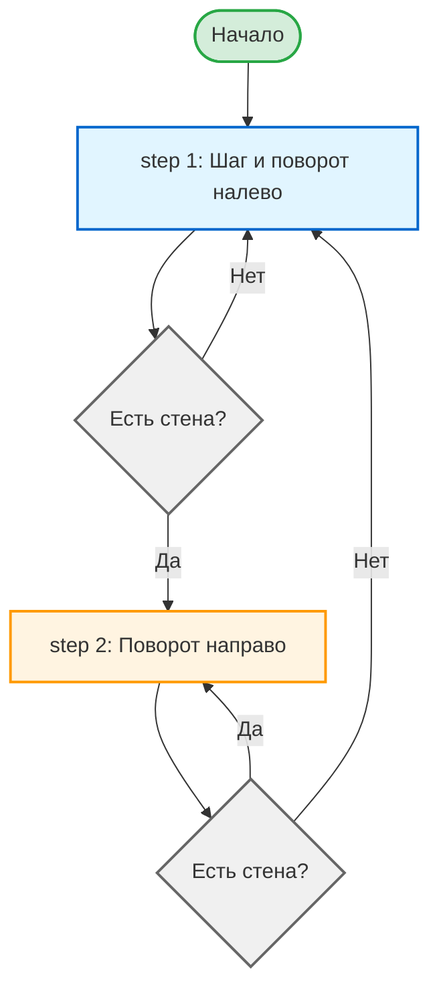
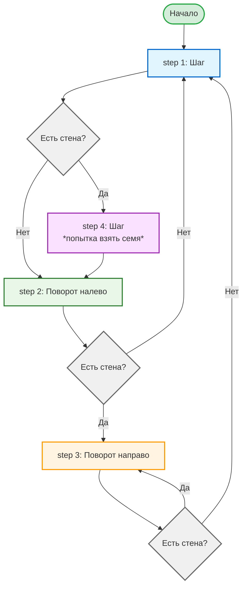

# Programming

* [Add 5](#add-5)
* [Calibrating Laser Cannons](#calibrating-laser-cannons)
* [Masking Time](#masking-time)
* [Spacial Invasion](#spacial-invasion)
* [The Maze](#the-maze)

---

Справка opcode:

```
ISA (Instruction Set Architecture) — это архитектура набора команд ("язык", на котором процессор понимает команды):
[ x  x | S2 S1 S0 | D2  D1  D0  ]
[ MODE | Source   | Destination ]

OPCODE MODE:
------------------------- 
00xxxxxx Immediate values. Source 6 bit instruction, Destination REG 0
01xxxxxx CALC (ALU).       Source REG 1 and REG 2, Destination REG 3 
10xxxxxx COPY.             Source ..[S1,S2,S3]..., Destination .....[D1,D2,D3]
11xxxxxx Conditions.       Source REG 3 and REG 0, Destination Program counter (PC)


OPCODE Source:

S2 S1 S0
--------------
0  0  0  REG 0
0  0  1  REG 1
0  1  0  REG 2
0  1  1  REG 3
1  0  0  REG 4
1  0  1  REG 5
1  1  0  INPUT # использовать внешний вход
1  1  1  UNUSED


OPCODE Destination:

D2 D1 D0 
--------------
0  0  0  REG 0
0  0  1  REG 1
0  1  0  REG 2
0  1  1  REG 3
1  0  0  REG 4
1  0  1  REG 5
1  1  0  OUTPUT # использовать внешний выход
1  1  1  UNUSED

 
Conditions:

0 0 0 Никогда т.е. не должны ничего делать
0 0 1 Если REG3 = 0
0 1 0 Если REG3 < 0
0 1 1 Если REG3 ≤ 0 
1 0 0 Всегда
1 0 1 Если REG3 ≠ 0 
1 1 0 Если REG3 ≥ 0
1 1 1 Если REG3 > 0


ALU:

V| OPCODE
-|---------------
0| xxxxx000   OR
1| xxxxx001   NAND
2| xxxxx010   NOR
3| xxxxx011   AND
4| xxxxx100   ADD
5| xxxxx101   SUB

```


## Add 5

> Задача:
>
> Внесите инструкции в компонент памяти PROGRAM, что бы ваш компьютер считал входные данные, добавил к ним значение 5 и вывел результат.

```bash
Address 0 # копируем входные данные в REG 1
Instruction: 10110001 # 177
    MODE COPY
    Source 110 (INPUT)
    Destination 001 (REG 1)

Address 1 # копируем данные из инструкции в REG 0
Instruction: 00000101 # 5
    MODE Immediate values
    Source Instruction
    Destination (REG 0)

Address 2 # копируем данные из REG 0 в REG 2
Instruction: 10000010 # 130
    MODE COPY
    Source 000 (REG 0)
    Destination 010 (REG 2)

Address 3 # выполняем операцию ADD сложение REG 1 и REG 2 => REG 3
Instruction: 01000100 # 68
    MODE CALC
    Source REG 1 и REG 2
    Destination REG 3
    100 ADD

Address 4 # выводим результат с REG 3 на output
Instruction: 10011110 # 158
    MODE COPY
    Source 011 (REG 3)
    Destination 110 (OUTPUT)
```


 
---

## Calibrating Laser Cannons

> [!TIP]
> Разблокирует `Robotron 9000+`


Сколько будет: *$2 \pi \times 1$* ?

> Задача:
> Для расчета окружности астероида используйте формулу: *$2 \pi \times r$*
> * где $r$ доступен во входных данных

Так же, нам доступно программирование на ассемблере. Ассемблер позволяет давать имена инструкциям, так например вы можете написать команду *add*, вместо кодирования двоичным форматом *0b01000100* значения 68 
* Для комментариев в ассемблере используйте символ `#`
* Для обьявления переменных: `const shoot 6`
* Формат для значений в коде: 
    * десятичный `6` (`00000110` это десятичное число, а не двоичное!) 
    * двоичный `0b00000110`
    * HEX `0x6` 
* Для меток переходов: `label finish`
* Есть возможно установить breakpoints


<details>
<summary>Assembly Editor:</summary>

```bash
# Получить входные данные r
0b10110001 # copy input (r) to reg_1
0b10001010 # copy reg_1 to reg_2

# Умножение на r раз
# Цикл, 6 раз (2*π) складываем значение r с собой

# 1
add # reg_1 + reg_2 => reg_3
0b10011001 # copy reg_3 to reg_1

# 2
add # reg_1 + reg_2 => reg_3
0b10011001 # copy reg_3 to reg_1

# 3
add # reg_1 + reg_2 => reg_3
0b10011001 # copy reg_3 to reg_1

# 4
add # reg_1 + reg_2 => reg_3
0b10011001 # copy reg_3 to reg_1

# 5
add # reg_1 + reg_2 => reg_3
0b10011110 # copy reg_3 to output 
```
</details>

---

## Masking Time

Реализовать операцию `mod 4` (остаток от деления на 4) используя битовые операции.

> Задача:
> 
> Наша неделя длится 4 дня. 
> Нужно вычислить день недели дня рождения. 
> Мы дадим дату, а вам нужно вернуть число с точностью до 8 делений.
> 
> Вам будет дано число, а в качестве результата вы должны вернуть это число по модулю 4. 
> И на это мы даем вам 8 тактов.

* Операцию `mod 4`, ищем остаток от деления на 4. 
* Вот все числа, кратные 4: 0, 4, 8, 12, 16, 20...
* В двоичной системе они всегда заканчиваются на 00:
    *  4 = xxxxx100₂
    *  8 = xxxx1000₂
    * 12 = xxxx1100₂
    * 16 = xxx10000₂
    * 20 = xxx10100₂
* закономерность - остаток от деления на 4 полностью определяется последними двумя битами!
    * 0  = 0000  (делится на 4, остаток 0)
    * 1  = 0001  (остаток 1)
    * 2  = 0010  (остаток 2)
    * 3  = 0011  (остаток 3)
    * 4  = 0100  (делится на 4, остаток 0) ← снова 00!
    * 5  = 0101  (остаток 1)
    * 6  = 0110  (остаток 2)
    * 7  = 0111  (остаток 3)
    * 8  = 1000  (делится на 4, остаток 0) ← и снова 00!
    * 9  = 1001  (остаток 1)

Т.е. любое число N можно представить как: `N = [часть кратная 4] + остаток`
* например число 9 
    * часть его кратная 4-м это будет 8
    * остаток от деления 8 mod 4 = 1 (0001) 
    * 9 = 8 + 1

В двоичной системе: `N = [биты старше 2-го] × 4 + [два младших бита]`
* например число 9 в двоичном виде: `00001001`
    * биты старше 2-го: `000010xx` отбросим 2 младших бита и переведем в десятичное => 2
    * два младших бита: `01`  переведем в десятичное => 1
    * N = 2 × 4 + 1 = 9


В общем случае, это справедливо для деления по модулю степени двойки: 
* 1 младший бит числа представляет это число по модулю 2 (четное или нечетное)
* 2 младших бита — по модулю 4
* 3 младших бита — по модулю 8 и так далее

Аналогично, в десятичной системе счисления 4321 по модулю 100 также всё просто (ответ — 21, старшие цифры не учитываются), потому что 100 — это степень числа 10.

Используя маску `00000011` (3) для вытаскивания 2-х младших бит у любого числа, мы получаем его остаток от деления на 4.


```rust
fn main() {
    let nmod = 4;
    let n = 13;
    println!("{n} mod 4={:08b}\n", n%nmod);
    
    /*
     n & mask 
    */
    let mask = 3;// 00000011
    println!("{:08b} # {n} \n& \n{:08b} # 3 mask\n--------\n{:08b} # {}",n,mask, n & mask, n & mask);
}
```


Assembly Editor:
```bash
# Получить входные данные n
0b10110001 # copy input (n) to reg_1

# mask
0b00000011 # copy (Immediate values) 3 to reg_0
0b10000010 # copy reg_0 to reg_2

# and ( n & mask )
0b01000011 # calc reg_1 AND reg_2 to reg_3

0b10011110 # copy reg_3 to output 

```

---

## Storage cracker

Построение цикла.

> Задача:
> 
> Вы выигрываете этот уровень, если отправите на output правильный пароль; ни один output не приведет к провалу уровня. Кроме того, после попытки угадать пароль которая превысила его значение, на входе мы дадим вам 1, в противном случае — 0.

Можно применить метод brute force, будем перебирать все возможные варианты, начиная с 0. 

Мы могли бы передавать само значения счетчика (PC) на выход, но эта возможность не реализована в нашей архитектуре.
 
Тогда мы можем создать цикл и последовательно выводить значения от 0 до 255, **НО** уровень игры так не работает.

<details>
<summary>Assembly Editor:</summary>

```bash
# prepare -------------------------------------

# ROM[0]
0b00000001 # reg_0 = 1

# ROM[1]
0b10000001 # copy reg_0 to reg_1 (set reg_1 = 1, reg_1 is const)

# ROM[2]
0b00000000 # reg_0 = 0

# ROM[3]
0b10000010 # copy reg_0 to reg_2 (set reg_2 = 0)

# ROM[4]
0b00000101 # reg_0 = 5 (index ROM for start while)

# while ----------------------------------------

# ROM[5] 
0b01000100 # calc reg_1 ADD reg_2 to reg_3

# ROM[6]
0b10011110 # copy reg_3 to output 

# ROM[7]
0b10011010 # copy reg_3 to reg_2 (reg_2 is cumulative)

# ROM[8]
0b11000110 # conditions 110 "REG3 ≥ 0" (rewriting to start while)
           # PC=reg_0

```
</details>

По наличию логики обратной связи, когда нам присылают 1 если мы превысили число пароля, следует что в пароле несколько чисел. И если мы превысили значение то нужно начать перебор с 0.


<details>
<summary>Assembly Editor:</summary>

```bash
# prepare -------------------------------------

# ROM[0]
0b00000001 # reg_0 = 1

# ROM[1]
0b10000001 # copy reg_0 to reg_1 (set reg_1 = 1, reg_1 is const)

# ROM[2]
0b00000000 # reg_0 = 0

# ROM[3]
0b10000010 # copy reg_0 to reg_2 (set reg_2 = 0)

# ROM[4]
0b00000101 # reg_0 = 5 (index ROM for start while)

# while ----------------------------------------

# ROM[5] 
0b01000100 # calc reg_1 ADD reg_2 to reg_3

# ROM[6]
0b10011110 # copy reg_3 to output 
 
# ROM[7]
0b10011010 # copy reg_3 to reg_2 (reg_2 is cumulative)

# ROM[8]
0b10110011 # copy input to reg_3

# ROM[9]
0b11000001 # conditions: if reg_3 == 0 { continue PC=reg_0 (rewriting to start while) }else{ reset }

# else reset --------------------------------------

# ROM[10]
0b00000000 # reg_0 = 0

# ROM[11]
0b11000100 # conditions: 100 always 1. For rewrite PC=0

```
</details>

---

## Spacial Invasion

> [!TIP]
> Разблокирует `Run fast`

Написать бота, сценарий для автоматического управления поведением робота с целью истребления космических крыс. 

> Задача:
> 
> Мы подключили ваш компьютер к нашему современному `Robot 9000+`, и мы хотим, чтобы вы запрограммировали его на стрельбу лазером по космическим крысам. Лазер не может стрелять пока выпущенный ранее лазер не долетит.
>
> 

Robot 9000+ page:


Action for `Robot 9000+`:
```
0b00000000 # 0 cursor turn left
0b00000001 # 1 move forward with the cursor
0b00000010 # 2 cursor turn right
0b00000011 # 3 skip action
0b00000100 # 4 use action
0b00000101 # 5 shoot laser

```

Сперва поиграем и найдем оптимальные шаги победы, потом запишем каждый шаг.

Создадим именованные команды (или константы) для ассемблера:
* out = `0b10000110` # copy reg_0 to output
* move = `0b00000001`
* shoot = `0b00000101`
* left = `0b00000000`  # 0 cursor turn left
* right = `0b00000010`  # 2 cursor turn right


<details>

<summary>Assembly Editor:</summary>

```bash
shoot
out

move
out

move
out
move
out
move
out
move
out

skip
out
skip
out

shoot
out
shoot
out
shoot
out
shoot
out
shoot
out

right
out

shoot
out

left
out

skip
out
skip
out
skip
out
skip
out
skip
out
skip
out
skip
out
skip
out
skip
out
skip
out
skip
out
skip
out

shoot
out
shoot
out
shoot
out

move
out
left
out
shoot
out

left
out
move
out
right
out
right
out
skip
out
skip
out
skip
out
skip
out
skip
out
skip
out
skip
out
skip
out
skip
out
shoot
out
shoot
out
shoot
out
shoot
out
shoot
out

skip
out
skip
out
skip
out
skip
out
skip
out
skip
out
skip
out
skip
out
skip
out
skip
out
skip
out
skip
out
skip
out
skip
out

shoot
out
shoot
out
shoot
out
shoot
out

```
</details>
 
<br>

<video controls width="100%" muted playsinline preload="metadata" 
       onloadeddata="this.playbackRate = 0.25;">
    <source src="/Computer-Science-Bookshelf/img/tc/Spacial_Invasion.mp4" type="video/mp4">
    Ваш браузер не поддерживает видео.
</video>

p.s. script не учитывает входной сигнал 1 - наличия крысы на позиции курсора.

---

## The Maze

> Задача:
> 
> Напишите алгоритм с помощью которого робот сможет пройти лабиринт. Если курсор стоит на стене мы посылаем в input значение 1.
>
> Напоминание, в режиме `00xxxxxx` (Immediate values) максимальное значение 0-63, так как доступно только шесть младших бит информации.


Алгоритм, приоритет слева:
* *step 1* Шаг и поворот на лево
    *  Если есть стена то *step 2*
    *  Если нет стены то *step 1*
* *step 2* Поворот на право
    *  Если есть стена то *step 2*
    *  Если нет стены то *step 1*



<details>
<summary>Assembly Editor:</summary>
 
```bash
# Создадим команды для ассемблера:
const left 0b00000000           # reg_0=0
const move 0b00000001           # reg_0=1
const right 0b00000010          # reg_0=2
const out 0b10000110            # copy reg_0 to output
const input_to_reg_3 0b10110011
const if_wall 0b11000111        # if reg_3 > 0
const if_always_move 0b11000100 # always 1 

const use_action 0b00000100       # use action (open a door)

const start_move 0b00000000  # 0 start position ROM program
const start_right 0b00001011 # 11 start position ROM program

# step 1 ------------ 
# start_move ROM[0]
move
out

# Если есть стена то step 2
left
out
use_action
out
input_to_reg_3
start_right
if_wall

# Если нет стены то step 1
start_move      
if_always_move

# step 2 ------------
# start_right ROM[11]
# Если есть стена то step 2
right
out
use_action
out
input_to_reg_3
start_right
if_wall

# Если нет стены то step 1
start_move      
if_always_move

```
</details>


Алгоритм с подбором семени.



<details>
<summary>Assembly Editor:</summary>

 
```bash
# Создадим команды для ассемблера:
const left 0b00000000           # reg_0=0
const move 0b00000001           # reg_0=1
const right 0b00000010          # reg_0=2
const out 0b10000110            # copy reg_0 to output
const input_to_reg_3 0b10110011
const if_wall 0b11000111        # if reg_3 > 0
const if_always_move 0b11000100 # always 1 

const use_action 0b00000100     # use action
  
const start_move 0b00000000     # 0 start position ROM program
const start_right 0b00001110    # 14 start position ROM program
const start_left 0b00000101     # 5
const try_take_seed 0b00010111  # 23
# step 1 ------------ 
# start_move ROM[0]
move
out
 
input_to_reg_3
try_take_seed
if_wall

# step 2 ------------ 
# start_left ROM[5]
# Если есть стена то step 3
left
out
use_action
out
input_to_reg_3
start_right
if_wall

# Если нет стены то step 1
start_move      
if_always_move

# step 3 ------------
# start_right ROM[14]
# Если есть стена то step 3
right
out
use_action
out
input_to_reg_3
start_right
if_wall

# Если нет стены то step 1
start_move      
if_always_move

# step 4 ------------
# try_take_seed ROM[23]
move
out
start_left
if_always_move
```
</details>


---

<!-- Feedback -->
<!-- Read the Formbutton docs at formspree.io/formbutton/docs. See more examples at codepen.io/formspree -->
<!-- <script src="https://formspree.io/js/formbutton-v1.min.js" defer></script> -->
<script>
  window.formbutton = window.formbutton || function() {
    (formbutton.q = formbutton.q || []).push(arguments)
  };
  formbutton("create", {
    action: "https://formspree.io/f/xkogdkjd",
    title: "Feedback",
    fields: [
      { 
        type: "text", 
        label: "Name:", 
        name: "name",
        required: true,
        placeholder: "Your name"
      },
      {
        type: "textarea",
        label: "Message:",
        name: "message",
        required: true,
        placeholder: "Please share your thoughts...",
        rows: 5
      },
      {
        type: "file",
        label: "Attach file (optional, max 10MB):",
        name: "file",
        required: false,
        multiple: false,
        accept: "image/*,.pdf,.doc,.docx,.txt"
      },
     { 
        type: "email", 
        label: "Email (optional, for reply):", 
        name: "email",
        required: false,
        placeholder: "your@email.com"
      },
      { type: "submit" }      
    ],
    styles: {
      title: {
        backgroundColor: "#333",
        color: "#fff"
      },
      input: {
        borderBottom: "1px solid #CCC",
        borderRight: "1px solid #CCC",
        padding: "5px 0"
      },
      button: {
        backgroundColor: "#4a5568",
        color: "#fff"
      },
      form: {
        backgroundColor: "#f7fafc",
        maxWidth: "400px"
      },
      submitInput: {padding: "0.75em 1em"}
    },
  });
</script>
 